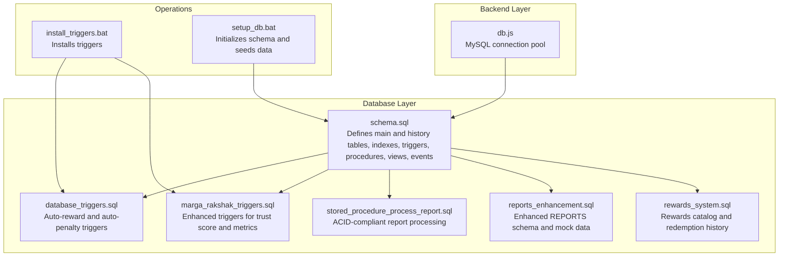
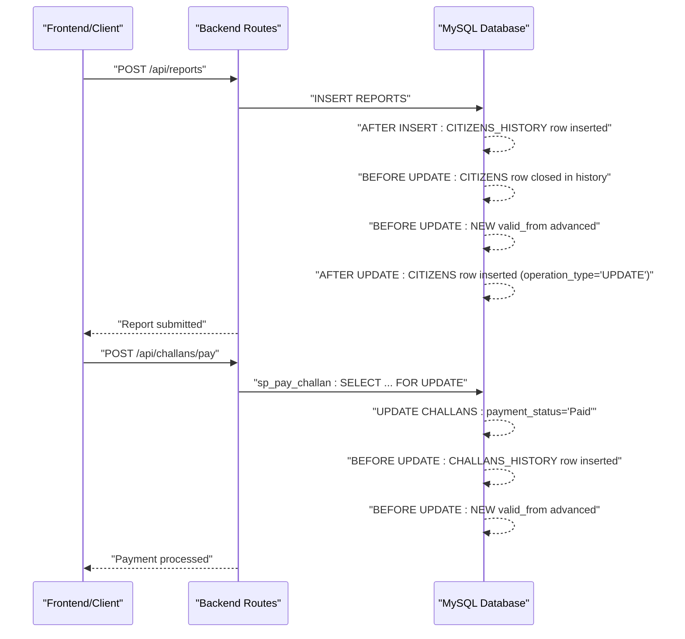
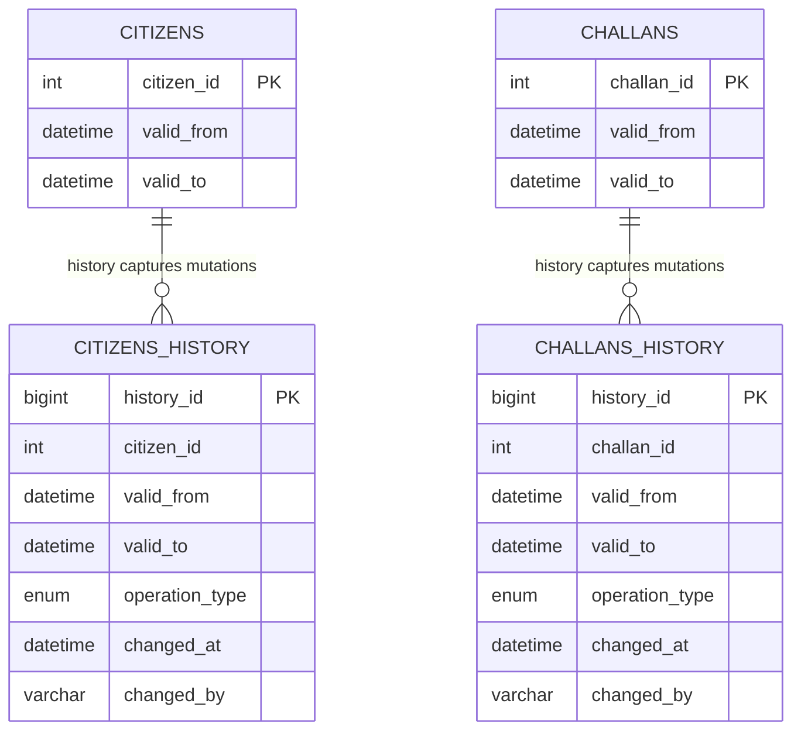
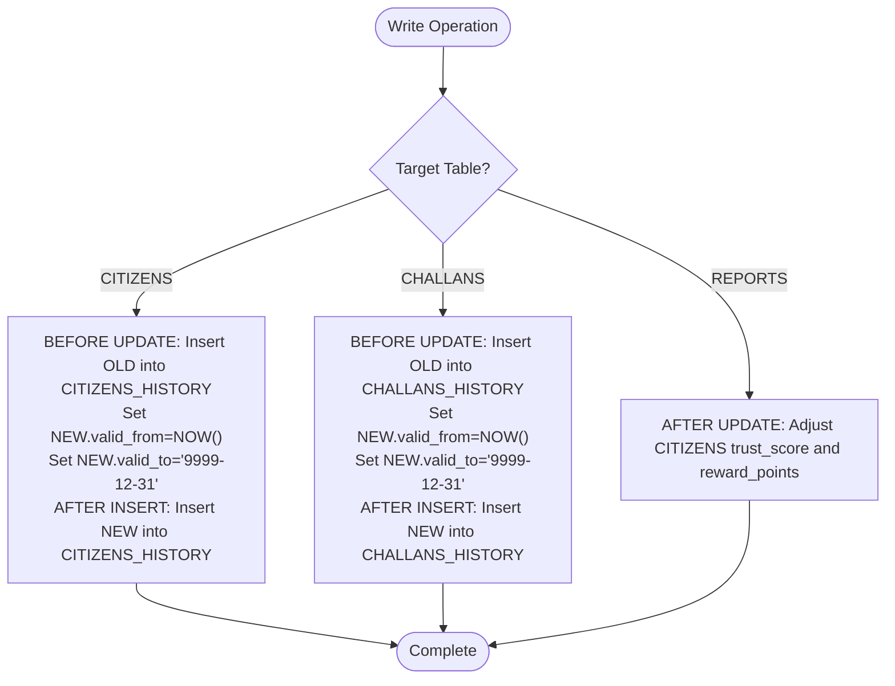
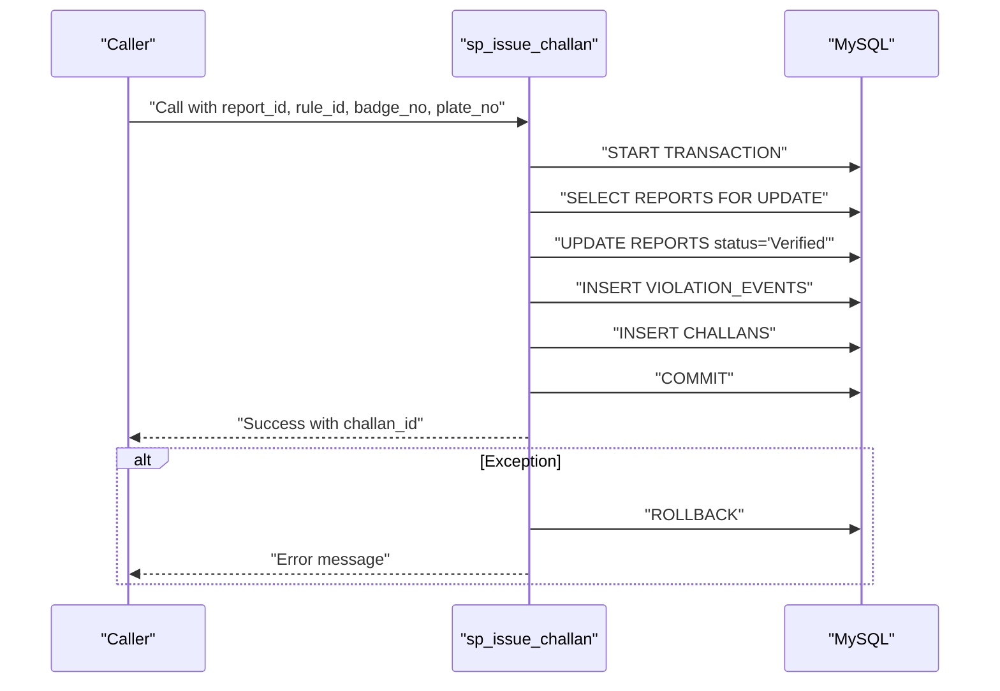
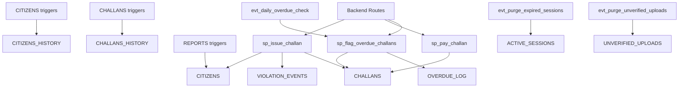

# Temporal Versioning and Historical Tracking

<cite>
**Referenced Files in This Document**
- [schema.sql](file://db/schema.sql)
- [database_triggers.sql](file://db/database_triggers.sql)
- [marga_rakshak_triggers.sql](file://db/marga_rakshak_triggers.sql)
- [stored_procedure_process_report.sql](file://db/stored_procedure_process_report.sql)
- [reports_enhancement.sql](file://db/reports_enhancement.sql)
- [rewards_system.sql](file://db/rewards_system.sql)
- [db.js](file://backend/db.js)
- [install_triggers.bat](file://scripts/install_triggers.bat)
- [setup_db.bat](file://scripts/setup_db.bat)
</cite>

## Table of Contents
1. [Introduction](#introduction)
2. [Project Structure](#project-structure)
3. [Core Components](#core-components)
4. [Architecture Overview](#architecture-overview)
5. [Detailed Component Analysis](#detailed-component-analysis)
6. [Dependency Analysis](#dependency-analysis)
7. [Performance Considerations](#performance-considerations)
8. [Troubleshooting Guide](#troubleshooting-guide)
9. [Conclusion](#conclusion)
10. [Appendices](#appendices)

## Introduction
This document explains the temporal versioning system implemented in the Traffic Violation Management System. It focuses on the dual-table approach using main tables (CITIZENS, CHALLANS) and corresponding history tables (CITIZENS_HISTORY, CHALLANS_HISTORY). The valid_from/valid_to timestamp mechanism enables historical tracking of all data changes. We document the trigger-based automation that captures changes in real-time and maintains audit trails, along with business use cases such as compliance reporting, legal proceedings, and performance analysis. We also provide examples of queries to retrieve historical data at specific points in time, highlight the advantages of temporal modeling over traditional audit logging, and outline performance implications and indexing strategies.

## Project Structure
The temporal versioning system is defined in the database schema and supported by triggers, stored procedures, views, and scheduled events. The backend connects to the database via a Node.js pool. Scripts automate installation and setup.

**Diagram sources**
- [schema.sql](file://db/schema.sql)
- [database_triggers.sql](file://db/database_triggers.sql)
- [marga_rakshak_triggers.sql](file://db/marga_rakshak_triggers.sql)
- [stored_procedure_process_report.sql](file://db/stored_procedure_process_report.sql)
- [reports_enhancement.sql](file://db/reports_enhancement.sql)
- [rewards_system.sql](file://db/rewards_system.sql)
- [db.js](file://backend/db.js)
- [install_triggers.bat](file://scripts/install_triggers.bat)
- [setup_db.bat](file://scripts/setup_db.bat)

**Section sources**
- [schema.sql](file://db/schema.sql)
- [db.js](file://backend/db.js)
- [install_triggers.bat](file://scripts/install_triggers.bat)
- [setup_db.bat](file://scripts/setup_db.bat)

## Core Components
- Main tables with temporal columns:
  - CITIZENS: includes valid_from and valid_to timestamps to track profile changes over time.
  - CHALLANS: includes valid_from and valid_to timestamps to track fine adjustments and status changes over time.
- History tables:
  - CITIZENS_HISTORY: captures every mutation of CITIZENS with operation_type, changed_at, and changed_by.
  - CHALLANS_HISTORY: captures every mutation of CHALLANS with operation_type, changed_at, and changed_by.
- Triggers:
  - CITIZENS triggers capture updates and inserts into history and manage account status transitions.
  - CHALLANS triggers capture updates and inserts into history and maintain temporal boundaries.
  - REPORTS triggers adjust trust score and reward points upon status changes.
- Stored procedures:
  - sp_issue_challan: ACID-compliant issuance pipeline.
  - sp_pay_challan: payment processing with row-level locks.
  - sp_flag_overdue_challans: batch processing of overdue challans with penalties.
  - ProcessReportAndIssueChallan: alternate ACID-compliant pipeline for report processing.
- Views:
  - Citizen_Trust_History: temporal view of trust score changes for auditing.
  - Pending_Reports_Dashboard and Officer_Performance_View: operational dashboards.
- Scheduled events:
  - evt_daily_overdue_check: daily overdue processing.
  - evt_purge_expired_sessions and evt_purge_unverified_uploads: transient table cleanup.

**Section sources**
- [schema.sql](file://db/schema.sql)
- [database_triggers.sql](file://db/database_triggers.sql)
- [marga_rakshak_triggers.sql](file://db/marga_rakshak_triggers.sql)
- [stored_procedure_process_report.sql](file://db/stored_procedure_process_report.sql)
- [reports_enhancement.sql](file://db/reports_enhancement.sql)
- [rewards_system.sql](file://db/rewards_system.sql)

## Architecture Overview
The temporal architecture ensures that every write operation to main tables is mirrored into history tables with precise time boundaries. Triggers enforce temporal semantics and audit trail integrity. Stored procedures encapsulate complex workflows with ACID guarantees. Views expose temporal perspectives for compliance and analytics.

**Diagram sources**
- [schema.sql](file://db/schema.sql)
- [stored_procedure_process_report.sql](file://db/stored_procedure_process_report.sql)

## Detailed Component Analysis

### Temporal Tables and Columns
- CITIZENS and CHALLANS define valid_from and valid_to to represent the validity period of each row version.
- valid_from is set to the current time on updates and resets to the epoch for new inserts.
- valid_to defaults to a far-future timestamp to mark the current active version.
- Indexes on valid_from and valid_to in history tables support efficient temporal queries.

**Diagram sources**
- [schema.sql](file://db/schema.sql)

**Section sources**
- [schema.sql](file://db/schema.sql)

### Trigger-Based Automation
- CITIZENS triggers:
  - BEFORE UPDATE: Insert previous version into CITIZENS_HISTORY with valid_to set to now, advance NEW.valid_from to now.
  - AFTER INSERT: Insert initial version into CITIZENS_HISTORY.
- CHALLANS triggers:
  - BEFORE UPDATE: Insert previous version into CHALLANS_HISTORY with valid_to set to now, advance NEW.valid_from to now.
  - AFTER INSERT: Insert initial version into CHALLANS_HISTORY.
- REPORTS triggers:
  - AFTER UPDATE: Adjust CITIZENS trust_score and reward_points based on status changes (Verified/Rejected).

**Diagram sources**
- [schema.sql](file://db/schema.sql)
- [database_triggers.sql](file://db/database_triggers.sql)
- [marga_rakshak_triggers.sql](file://db/marga_rakshak_triggers.sql)

**Section sources**
- [schema.sql](file://db/schema.sql)
- [database_triggers.sql](file://db/database_triggers.sql)
- [marga_rakshak_triggers.sql](file://db/marga_rakshak_triggers.sql)

### Stored Procedures and ACID Guarantees
- sp_issue_challan: Validates report state, creates violation event, issues challan, and wraps all steps in a transaction with exception handling.
- sp_pay_challan: Uses row-level locks to prevent race conditions and updates payment status and reward points.
- sp_flag_overdue_challans: Iterates unpaid challans past due date, applies penalties, logs in OVERDUE_LOG, and penalizes trust score.
- ProcessReportAndIssueChallan: Alternate pipeline with similar ACID guarantees.

**Diagram sources**
- [schema.sql](file://db/schema.sql)
- [stored_procedure_process_report.sql](file://db/stored_procedure_process_report.sql)

**Section sources**
- [schema.sql](file://db/schema.sql)
- [stored_procedure_process_report.sql](file://db/stored_procedure_process_report.sql)

### Business Use Cases for Temporal Data
- Compliance reporting: Retrieve all records as they existed at a specific timestamp for audits.
- Legal proceedings: Present immutable, time-stamped versions of records to courts and tribunals.
- Performance analysis: Analyze trends in trust scores, challan issuance rates, and overdue patterns over time.
- Regulatory adherence: Demonstrate adherence to data retention and audit requirements with built-in temporal proofs.

[No sources needed since this section provides general guidance]

### Queries to Retrieve Historical Data
Below are example query patterns for retrieving historical data at specific points in time. Replace the placeholder timestamp with the desired point-in-time value.

- Retrieve the state of a citizen’s profile at a given time:
  - Select from CITIZENS where valid_from <= target_time AND target_time < valid_to.
  - Join with CITIZENS_HISTORY to see the audit trail of changes around that time.

- Retrieve the state of a challan at a given time:
  - Select from CHALLANS where valid_from <= target_time AND target_time < valid_to.
  - Join with CHALLANS_HISTORY to reconstruct the changelog for that period.

- View trust score changes over time for a citizen:
  - Use the Citizen_Trust_History view to see all versions and operation types.

- Recreate a snapshot of the system at a specific timestamp:
  - For each main entity, select the latest version whose valid_from is <= timestamp and valid_to > timestamp.

[No sources needed since this section provides general guidance]

### Advantages of Temporal Modeling Over Traditional Audit Logging
- Atomicity: Changes are captured automatically with the write operation, ensuring no missed updates.
- Consistency: valid_from/valid_to boundaries guarantee non-overlapping, contiguous versions.
- Query simplicity: Standard SQL can be used to query historical states without complex joins or external systems.
- Auditing: History tables serve as immutable audit trails with operation metadata.

[No sources needed since this section provides general guidance]

## Dependency Analysis
The temporal system depends on:
- Triggers to mirror writes to history tables.
- Stored procedures to coordinate multi-step workflows with ACID guarantees.
- Scheduled events to maintain system hygiene and enforce policies.
- Backend connections to execute procedures and retrieve results.

**Diagram sources**
- [schema.sql](file://db/schema.sql)

**Section sources**
- [schema.sql](file://db/schema.sql)

## Performance Considerations
- Indexing strategy:
  - Add composite indexes on (valid_from, valid_to) in history tables to accelerate temporal queries.
  - Maintain indexes on foreign keys and frequently filtered columns in main tables.
- Query patterns:
  - Prefer range scans on valid_from/valid_to for temporal filtering.
  - Use LIMIT and pagination for large history datasets.
- Concurrency:
  - Stored procedures use row-level locks to avoid race conditions.
  - Triggers operate within the same transaction boundaries as the main write.
- Maintenance:
  - Scheduled events purge transient data to keep the system lean.
  - Consider partitioning history tables by time if datasets grow very large.

[No sources needed since this section provides general guidance]

## Troubleshooting Guide
- Triggers not firing:
  - Verify trigger existence and timing using INFORMATION_SCHEMA queries.
  - Confirm that the database user has sufficient privileges.
- History table anomalies:
  - Check operation_type and changed_by fields to identify unexpected updates.
  - Validate valid_from/valid_to boundaries for overlapping or gaps.
- Stored procedure errors:
  - Review exception handlers and rollback messages.
  - Ensure required parameters are passed and constraints are satisfied.
- Backend connectivity:
  - Confirm MySQL connection pool configuration and credentials.
  - Validate that the database is reachable and accepting connections.

**Section sources**
- [database_triggers.sql](file://db/database_triggers.sql)
- [marga_rakshak_triggers.sql](file://db/marga_rakshak_triggers.sql)
- [schema.sql](file://db/schema.sql)
- [db.js](file://backend/db.js)

## Conclusion
The Traffic Violation Management System employs a robust temporal versioning model with dual-table design and comprehensive trigger automation. The valid_from/valid_to mechanism, combined with dedicated history tables and stored procedures, provides strong auditability, legal defensibility, and analytical capabilities. By leveraging temporal queries and maintaining proper indexes, the system supports compliance reporting, legal proceedings, and performance analysis with minimal operational overhead.

[No sources needed since this section summarizes without analyzing specific files]

## Appendices

### Appendix A: Backend Database Pool Configuration
- The backend uses a MySQL connection pool configured with connection limits and keep-alive settings to ensure reliable access to the temporal schema.

**Section sources**
- [db.js](file://backend/db.js)

### Appendix B: Trigger Installation and Schema Setup
- Scripts automate installation of triggers and initialization of the schema, including seed data and scheduled events.

**Section sources**
- [install_triggers.bat](file://scripts/install_triggers.bat)
- [setup_db.bat](file://scripts/setup_db.bat)