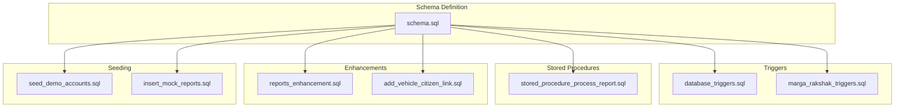
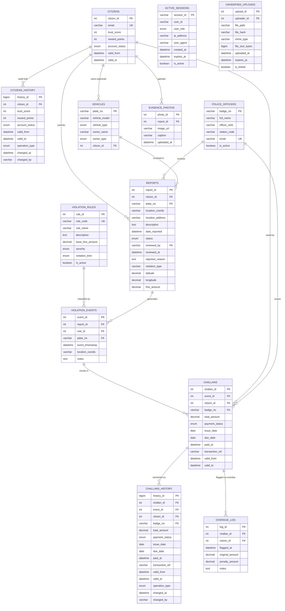
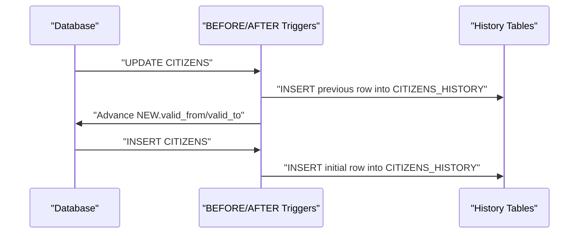
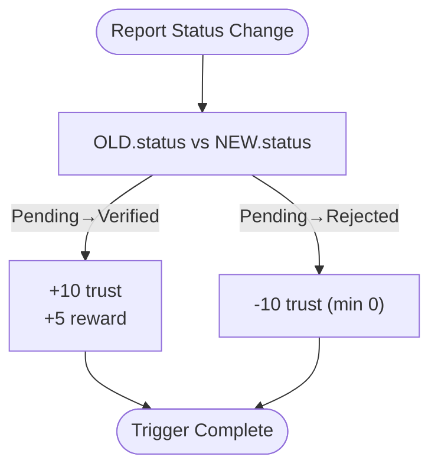
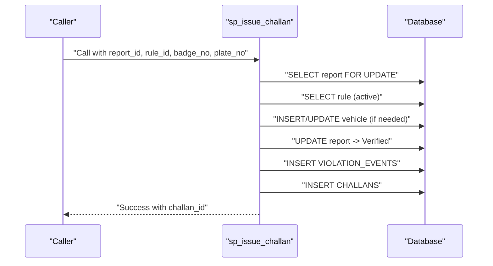
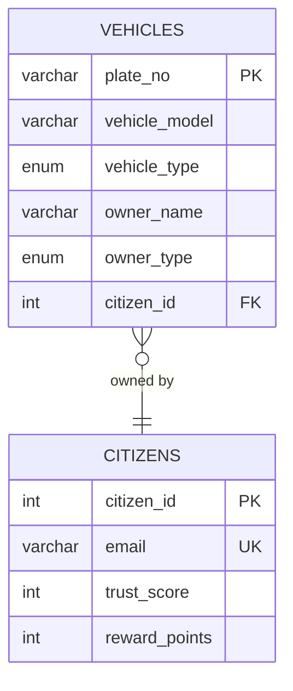
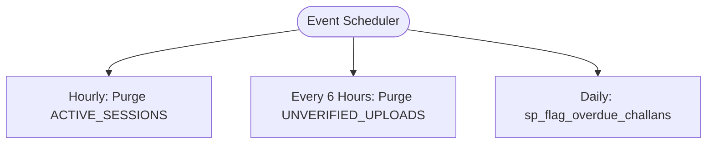
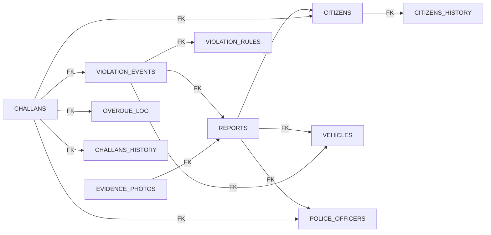

# Database Design

<cite>
**Referenced Files in This Document**
- [schema.sql](file://db/schema.sql)
- [database_triggers.sql](file://db/database_triggers.sql)
- [stored_procedure_process_report.sql](file://db/stored_procedure_process_report.sql)
- [marga_rakshak_triggers.sql](file://db/marga_rakshak_triggers.sql)
- [reports_enhancement.sql](file://db/reports_enhancement.sql)
- [add_vehicle_citizen_link.sql](file://db/add_vehicle_citizen_link.sql)
- [seed_demo_accounts.sql](file://db/seed_demo_accounts.sql)
- [insert_mock_reports.sql](file://db/insert_mock_reports.sql)
- [REALTIME_SYNC_DOCUMENTATION.md](file://REALTIME_SYNC_DOCUMENTATION.md)
</cite>

## Table of Contents
1. [Introduction](#introduction)
2. [Project Structure](#project-structure)
3. [Core Components](#core-components)
4. [Architecture Overview](#architecture-overview)
5. [Detailed Component Analysis](#detailed-component-analysis)
6. [Dependency Analysis](#dependency-analysis)
7. [Performance Considerations](#performance-considerations)
8. [Troubleshooting Guide](#troubleshooting-guide)
9. [Conclusion](#conclusion)
10. [Appendices](#appendices)

## Introduction
This document provides comprehensive data model documentation for the Traffic Violation Management System database. It details the 5NF normalized schema comprising 16 tables, explains the normalization rationale and business rules, and documents entity relationships, constraints, indexes, and temporal modeling. It also covers PL/SQL triggers for trust score automation, business logic enforcement, and audit trails; stored procedures for challan generation, payment processing, and overdue penalty calculation; data access patterns; caching strategies; performance considerations; data lifecycle and retention; and security and privacy controls. Finally, it includes examples of complex queries and optimization strategies.

## Project Structure
The database schema is defined and extended via SQL scripts located under the db/ directory. The primary schema defines core entities, temporal tables, transient tables, triggers, stored procedures, and views. Additional scripts enhance the REPORTS table, link vehicles to citizens, seed demo data, and inject mock reports.

**Diagram sources**
- [schema.sql](file://db/schema.sql)
- [database_triggers.sql](file://db/database_triggers.sql)
- [marga_rakshak_triggers.sql](file://db/marga_rakshak_triggers.sql)
- [stored_procedure_process_report.sql](file://db/stored_procedure_process_report.sql)
- [reports_enhancement.sql](file://db/reports_enhancement.sql)
- [add_vehicle_citizen_link.sql](file://db/add_vehicle_citizen_link.sql)
- [seed_demo_accounts.sql](file://db/seed_demo_accounts.sql)
- [insert_mock_reports.sql](file://db/insert_mock_reports.sql)

**Section sources**
- [schema.sql](file://db/schema.sql)
- [database_triggers.sql](file://db/database_triggers.sql)
- [marga_rakshak_triggers.sql](file://db/marga_rakshak_triggers.sql)
- [stored_procedure_process_report.sql](file://db/stored_procedure_process_report.sql)
- [reports_enhancement.sql](file://db/reports_enhancement.sql)
- [add_vehicle_citizen_link.sql](file://db/add_vehicle_citizen_link.sql)
- [seed_demo_accounts.sql](file://db/seed_demo_accounts.sql)
- [insert_mock_reports.sql](file://db/insert_mock_reports.sql)

## Core Components
This section outlines the 16-table schema, primary and foreign keys, indexes, constraints, and temporal design.

- CITIZENS
  - Primary key: citizen_id
  - Temporal columns: valid_from, valid_to
  - Indexes: email, account_status, trust_score
  - Constraints: trust_score range, account_status enum, unique email
- CITIZENS_HISTORY
  - Primary key: history_id
  - Foreign key: citizen_id → CITIZENS
  - Temporal columns: valid_from, valid_to
  - Audit trail for profile and trust changes
- POLICE_OFFICERS
  - Primary key: badge_no
  - Indexes: station_code
  - Constraints: unique email, is_active boolean
- VEHICLES
  - Primary key: plate_no
  - Optional foreign key: citizen_id → CITIZENS (added via migration)
  - Indexes: vehicle_type
  - Constraints: owner_type enum, vehicle_type enum
- VIOLATION_RULES
  - Primary key: rule_id
  - Constraints: base_fine_amount positive, severity enum, violation_time enum, is_active
  - Indexes: severity
- REPORTS
  - Primary key: report_id
  - Foreign keys: citizen_id → CITIZENS, plate_no → VEHICLES, reviewed_by → POLICE_OFFICERS
  - Enhanced columns: violation_type, latitude, longitude, fine_amount, status extended enum
  - Indexes: status, citizen_id, date_reported, violation_type, location (lat/lng), fine_amount
- EVIDENCE_PHOTOS
  - Primary key: photo_id
  - Foreign key: report_id → REPORTS
  - Indexes: report_id
- VIOLATION_EVENTS
  - Primary key: event_id
  - Foreign keys: report_id → REPORTS, rule_id → VIOLATION_RULES, plate_no → VEHICLES
  - Indexes: report_id, rule_id
- CHALLANS
  - Primary key: challan_id
  - Temporal columns: valid_from, valid_to
  - Foreign keys: event_id → VIOLATION_EVENTS, citizen_id → CITIZENS, badge_no → POLICE_OFFICERS
  - Constraints: total_amount positive, payment_status enum
  - Indexes: payment_status, citizen_id, due_date, issue_date
- CHALLANS_HISTORY
  - Primary key: history_id
  - Foreign keys: challan_id → CHALLANS, event_id → VIOLATION_EVENTS, citizen_id → CITIZENS, badge_no → POLICE_OFFICERS
  - Temporal columns: valid_from, valid_to
- OVERDUE_LOG
  - Primary key: log_id
  - Foreign keys: challan_id → CHALLANS, citizen_id → CITIZENS
  - Indexes: challan_id
- ACTIVE_SESSIONS
  - Primary key: session_id
  - Indexes: user_id, expires_at
  - Constraints: user_role enum, expires_at datetime
- UNVERIFIED_UPLOADS
  - Primary key: upload_id
  - Foreign key: uploader_id → CITIZENS
  - Indexes: expires_at, is_linked
  - Constraints: file_hash unique, mime_type, file_size_bytes
- EVENTS
  - Scheduled events: purge expired sessions, purge unverified uploads, daily overdue check

Views:
- Pending_Reports_Dashboard
- Citizen_Challan_Summary
- Officer_Performance_View
- Citizen_Trust_History

**Section sources**
- [schema.sql](file://db/schema.sql)
- [reports_enhancement.sql](file://db/reports_enhancement.sql)
- [add_vehicle_citizen_link.sql](file://db/add_vehicle_citizen_link.sql)

## Architecture Overview
The system employs a 5NF normalized relational schema with:
- Core entities for citizens, police officers, vehicles, violation rules, reports, evidence, violation events, challans, and overdue ledger
- Temporal tables (CITIZENS_HISTORY, CHALLANS_HISTORY) for historical tracking
- Transient tables (ACTIVE_SESSIONS, UNVERIFIED_UPLOADS) with scheduled purges
- Triggers for trust score automation and temporal versioning
- Stored procedures for ACID-safe business workflows
- Views for dashboards and reporting

**Diagram sources**
- [schema.sql](file://db/schema.sql)
- [reports_enhancement.sql](file://db/reports_enhancement.sql)
- [add_vehicle_citizen_link.sql](file://db/add_vehicle_citizen_link.sql)

## Detailed Component Analysis

### Normalization and Business Rules Justification
- 5NF compliance is achieved by decomposing higher normal forms into projections that eliminate join dependencies and ensure lossless joins. The schema separates concerns into distinct entities:
  - Identity and profile (CITIZENS, POLICE_OFFICERS)
  - Asset ownership (VEHICLES)
  - Rule catalog (VIOLATION_RULES)
  - Incident reporting (REPORTS)
  - Evidence (EVIDENCE_PHOTOS)
  - Event linkage (VIOLATION_EVENTS)
  - Financial liability (CHALLANS)
  - Historical audit (CITIZENS_HISTORY, CHALLANS_HISTORY)
  - Operational staging (ACTIVE_SESSIONS, UNVERIFIED_UPLOADS)
- Business rules:
  - Trust scoring is automated upon report verification/rejection.
  - Challans derive from verified reports and violation rules.
  - Overdue challans incur penalties and impact trust scores.
  - Temporal tables preserve historical state for audits and compliance.

**Section sources**
- [schema.sql](file://db/schema.sql)

### Temporal Tables and Historical Tracking
- CITIZENS_HISTORY captures profile mutations and trust changes with valid_from/valid_to windows.
- CHALLANS_HISTORY captures fine adjustments and status changes with valid_from/valid_to windows.
- Triggers manage temporal versioning on updates and inserts.

**Diagram sources**
- [schema.sql](file://db/schema.sql)

**Section sources**
- [schema.sql](file://db/schema.sql)

### Trust Score Automation and Audit Trails
- Triggers enforce trust score changes on report status transitions:
  - Verified → +10 trust, +5 reward
  - Rejected → -10 trust (min 0)
- Audit trail maintained via CITIZENS_HISTORY and CHALLANS_HISTORY.

**Diagram sources**
- [database_triggers.sql](file://db/database_triggers.sql)
- [marga_rakshak_triggers.sql](file://db/marga_rakshak_triggers.sql)

**Section sources**
- [database_triggers.sql](file://db/database_triggers.sql)
- [marga_rakshak_triggers.sql](file://db/marga_rakshak_triggers.sql)

### Stored Procedures: Challan Generation, Payment, and Overdue Processing
- sp_issue_challan
  - Validates report existence and pending status
  - Ensures violation rule is active
  - Auto-creates vehicle if missing
  - Updates report status to Verified
  - Creates VIOLATION_EVENTS and CHALLANS
  - Uses explicit transaction with exception handling
- sp_pay_challan
  - Row-level locking prevents race conditions
  - Validates ownership and status
  - Awards reward points for timely payment
- sp_flag_overdue_challans
  - Cursor-based iteration over unpaid, past-due challans
  - Applies 15% penalty, logs in OVERDUE_LOG
  - Deducts trust score

**Diagram sources**
- [schema.sql](file://db/schema.sql)

**Section sources**
- [schema.sql](file://db/schema.sql)

### Enhanced REPORTS Schema and Seed Data
- Added violation_type, latitude, longitude, fine_amount, and extended status enum.
- Seeded citizens, police officers, violation rules, vehicles, and sample reports.
- Added foreign key from VEHICLES to CITIZENS to support owner-challan routing.

**Diagram sources**
- [reports_enhancement.sql](file://db/reports_enhancement.sql)
- [add_vehicle_citizen_link.sql](file://db/add_vehicle_citizen_link.sql)
- [seed_demo_accounts.sql](file://db/seed_demo_accounts.sql)

**Section sources**
- [reports_enhancement.sql](file://db/reports_enhancement.sql)
- [add_vehicle_citizen_link.sql](file://db/add_vehicle_citizen_link.sql)
- [seed_demo_accounts.sql](file://db/seed_demo_accounts.sql)

### Transient Tables and Scheduled Maintenance
- ACTIVE_SESSIONS: short-lived sessions with auto-purge via event.
- UNVERIFIED_UPLOADS: staged evidence with expiry and linkage tracking.
- Scheduled events:
  - Purge expired sessions hourly
  - Purge unlinked uploads older than 24 hours
  - Daily overdue check invoking sp_flag_overdue_challans

**Diagram sources**
- [schema.sql](file://db/schema.sql)

**Section sources**
- [schema.sql](file://db/schema.sql)

### Views for Dashboards and Reporting
- Pending_Reports_Dashboard: police command center feed
- Citizen_Challan_Summary: citizen overview
- Officer_Performance_View: stats per officer
- Citizen_Trust_History: temporal trust score changes

**Section sources**
- [schema.sql](file://db/schema.sql)

## Dependency Analysis
- Referential integrity enforced via foreign keys across REPORTS, VIOLATION_EVENTS, CHALLANS, EVIDENCE_PHOTOS, and VEHICLES.
- Triggers depend on REPORTS and CITIZENS for trust automation; on CHALLANS for temporal versioning.
- Stored procedures coordinate multiple entities to maintain ACID properties.

**Diagram sources**
- [schema.sql](file://db/schema.sql)

**Section sources**
- [schema.sql](file://db/schema.sql)

## Performance Considerations
- Indexes:
  - High-selectivity columns: email, account_status, trust_score (CITIZENS); station_code (POLICE_OFFICERS); status, date_reported (REPORTS); payment_status, due_date, issue_date (CHALLANS); vehicle_type (VEHICLES).
  - Spatial: latitude/longitude (REPORTS) for proximity queries.
- Concurrency:
  - Stored procedures use SELECT ... FOR UPDATE to prevent race conditions.
  - Triggers minimize cross-table updates by focusing on necessary fields.
- Caching:
  - Real-time synchronization relies on direct database queries with 3-second polling; no caching is used to guarantee freshness.
- Partitioning/Archival:
  - Not implemented in current schema; consider partitioning by date for CHALLANS/OVERDUE_LOG if growth warrants.

**Section sources**
- [schema.sql](file://db/schema.sql)
- [REALTIME_SYNC_DOCUMENTATION.md](file://REALTIME_SYNC_DOCUMENTATION.md)

## Troubleshooting Guide
- Trigger verification:
  - Confirm triggers exist and fire on REPORTS updates.
- Stored procedure diagnostics:
  - Use declared exit handlers to capture SQL exceptions and return meaningful messages.
- Overdue processing:
  - Validate daily event execution and cursor logic for penalty application.
- Session and upload cleanup:
  - Ensure event_scheduler is enabled and scheduled events are active.

**Section sources**
- [database_triggers.sql](file://db/database_triggers.sql)
- [marga_rakshak_triggers.sql](file://db/marga_rakshak_triggers.sql)
- [schema.sql](file://db/schema.sql)

## Conclusion
The Traffic Violation Management System database employs a robust 5NF normalized schema with temporal modeling, strict referential integrity, and automated business logic via triggers and stored procedures. The design supports real-time dashboards, auditability, and scalable maintenance through scheduled events. The documented constraints, indexes, and procedures provide a solid foundation for production-grade traffic enforcement operations.

## Appendices

### Data Lifecycle, Retention, and Archival Rules
- CITIZENS_HISTORY and CHALLANS_HISTORY retain historical periods for legal and audit purposes.
- ACTIVE_SESSIONS and UNVERIFIED_UPLOADS are transient; purged by scheduled events.
- Consider implementing:
  - Long-term archival of CHALLANS_HISTORY and OVERDUE_LOG beyond active operational period.
  - Retention policies aligned with local regulations (e.g., 3–7 years for financial records).

[No sources needed since this section provides general guidance]

### Security, Privacy, and Access Control
- Authentication:
  - Password hashes stored; sensitive fields masked in views.
- Authorization:
  - Stored procedures enforce ownership checks (e.g., sp_pay_challan validates citizen_id).
- Logging:
  - History tables capture changes with timestamps and operators.
- Recommendations:
  - Encrypt sensitive BLOBs (face_encoding) at rest.
  - Apply least privilege roles for database connections.
  - Audit triggers and stored procedures for unauthorized access attempts.

[No sources needed since this section provides general guidance]

### Examples of Complex Queries and Optimization Strategies
- Example: Pending reports with evidence count for police dashboard
  - Join REPORTS with CITIZENS and subquery on EVIDENCE_PHOTOS
  - Optimized by indexes on REPORTS(status), REPORTS(citizen_id), EVIDENCE_PHOTOS(report_id)
- Example: Revenue per officer
  - Aggregation across CHALLANS filtered by payment_status='Paid'
  - Use covering indexes on badge_no and payment_status
- Example: Overdue challans with penalties
  - Cursor-based procedure iterates unpaid, past-due challans
  - Optimize with index on CHALLANS(due_date, payment_status)

**Section sources**
- [schema.sql](file://db/schema.sql)