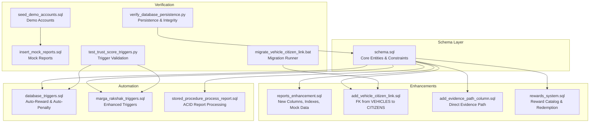
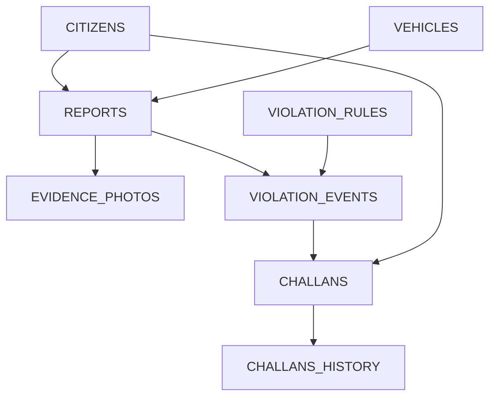
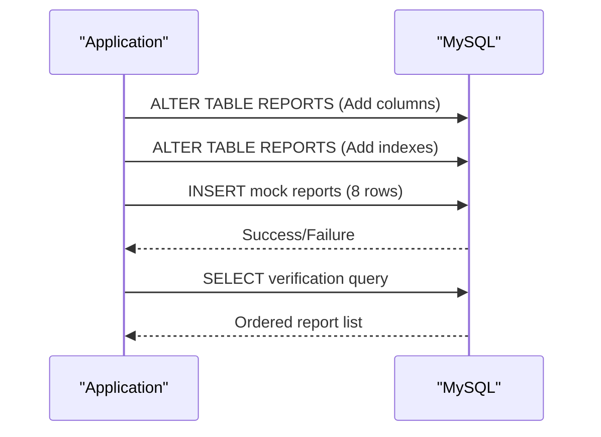
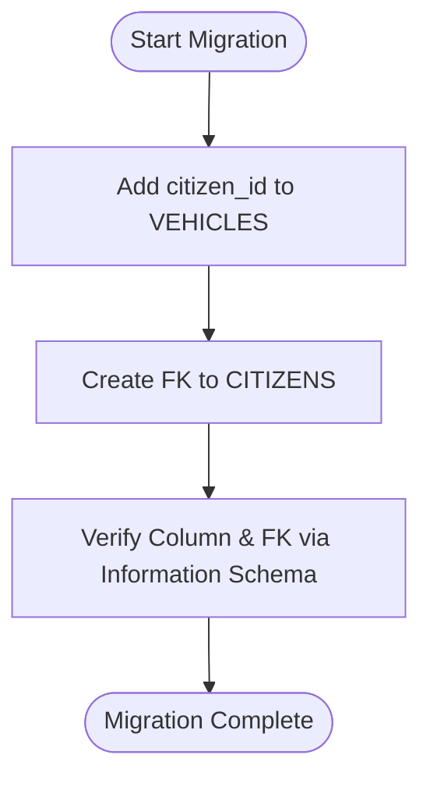
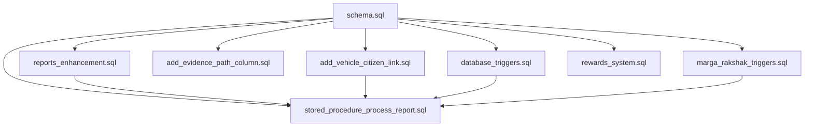

# Database Enhancements

<cite>
**Referenced Files in This Document**
- [schema.sql](file://db/schema.sql)
- [reports_enhancement.sql](file://db/reports_enhancement.sql)
- [add_vehicle_citizen_link.sql](file://db/add_vehicle_citizen_link.sql)
- [stored_procedure_process_report.sql](file://db/stored_procedure_process_report.sql)
- [database_triggers.sql](file://db/database_triggers.sql)
- [marga_rakshak_triggers.sql](file://db/marga_rakshak_triggers.sql)
- [rewards_system.sql](file://db/rewards_system.sql)
- [add_evidence_path_column.sql](file://db/add_evidence_path_column.sql)
- [seed_demo_accounts.sql](file://db/seed_demo_accounts.sql)
- [insert_mock_reports.sql](file://db/insert_mock_reports.sql)
- [migrate_vehicle_citizen_link.bat](file://scripts/migrate_vehicle_citizen_link.bat)
- [test_trust_score_triggers.py](file://scripts/test_trust_score_triggers.py)
- [verify_database_persistence.py](file://scripts/verify_database_persistence.py)
</cite>

## Table of Contents
1. [Introduction](#introduction)
2. [Project Structure](#project-structure)
3. [Core Components](#core-components)
4. [Architecture Overview](#architecture-overview)
5. [Detailed Component Analysis](#detailed-component-analysis)
6. [Dependency Analysis](#dependency-analysis)
7. [Performance Considerations](#performance-considerations)
8. [Troubleshooting Guide](#troubleshooting-guide)
9. [Conclusion](#conclusion)
10. [Appendices](#appendices)

## Introduction
This document details the database enhancements implemented to improve the Traffic Violation Management System. It covers:
- Reports enhancement: new columns, indexes, and performance improvements
- Vehicle-citizen linking: enabling challan routing to vehicle owners
- Triggers and stored procedures that automate trust scoring and report processing
- Migration scripts, upgrade procedures, and backward compatibility considerations
- Testing strategies to validate enhancements and ensure data integrity
- Guidance for applying similar enhancements in production environments

## Project Structure
The database enhancements are organized around schema definitions, targeted migrations, triggers, stored procedures, and verification scripts:
- Schema: baseline entity definitions and constraints
- Reports enhancement: adds violation type, geolocation, fine amount, and status extension
- Vehicle-citizen link: adds foreign key from vehicles to citizens
- Triggers: automatic trust scoring and reward updates
- Stored procedures: ACID-compliant report processing and challan issuance
- Utilities: evidence path storage, demo accounts, and mock data injection
- Scripts: batch migration runner and Python-based verification

**Diagram sources**
- [schema.sql:116-136](file://db/schema.sql#L116-L136)
- [reports_enhancement.sql:17-47](file://db/reports_enhancement.sql#L17-L47)
- [add_vehicle_citizen_link.sql:9-13](file://db/add_vehicle_citizen_link.sql#L9-L13)
- [add_evidence_path_column.sql:8-14](file://db/add_evidence_path_column.sql#L8-L14)
- [rewards_system.sql:6-41](file://db/rewards_system.sql#L6-L41)
- [database_triggers.sql:8-35](file://db/database_triggers.sql#L8-L35)
- [marga_rakshak_triggers.sql:16-45](file://db/marga_rakshak_triggers.sql#L16-L45)
- [stored_procedure_process_report.sql:8-98](file://db/stored_procedure_process_report.sql#L8-L98)
- [seed_demo_accounts.sql:16-107](file://db/seed_demo_accounts.sql#L16-L107)
- [insert_mock_reports.sql:12-15](file://db/insert_mock_reports.sql#L12-L15)
- [test_trust_score_triggers.py:17-198](file://scripts/test_trust_score_triggers.py#L17-L198)
- [verify_database_persistence.py:18-165](file://scripts/verify_database_persistence.py#L18-L165)
- [migrate_vehicle_citizen_link.bat](file://scripts/migrate_vehicle_citizen_link.bat#L19)

**Section sources**
- [schema.sql:116-136](file://db/schema.sql#L116-L136)
- [reports_enhancement.sql:17-47](file://db/reports_enhancement.sql#L17-L47)
- [add_vehicle_citizen_link.sql:9-13](file://db/add_vehicle_citizen_link.sql#L9-L13)
- [add_evidence_path_column.sql:8-14](file://db/add_evidence_path_column.sql#L8-L14)
- [rewards_system.sql:6-41](file://db/rewards_system.sql#L6-L41)
- [database_triggers.sql:8-35](file://db/database_triggers.sql#L8-L35)
- [marga_rakshak_triggers.sql:16-45](file://db/marga_rakshak_triggers.sql#L16-L45)
- [stored_procedure_process_report.sql:8-98](file://db/stored_procedure_process_report.sql#L8-L98)
- [seed_demo_accounts.sql:16-107](file://db/seed_demo_accounts.sql#L16-L107)
- [insert_mock_reports.sql:12-15](file://db/insert_mock_reports.sql#L12-L15)
- [test_trust_score_triggers.py:17-198](file://scripts/test_trust_score_triggers.py#L17-L198)
- [verify_database_persistence.py:18-165](file://scripts/verify_database_persistence.py#L18-L165)
- [migrate_vehicle_citizen_link.bat](file://scripts/migrate_vehicle_citizen_link.bat#L19)

## Core Components
- Reports enhancement: Adds violation_type, latitude, longitude, fine_amount, extends status enum, and indexes for performance
- Vehicle-citizen linking: Adds citizen_id to VEHICLES with foreign key to CITIZENS
- Evidence path storage: Adds evidence_path to REPORTS for direct access
- Rewards system: Introduces reward catalog and redemption history with automation
- Triggers: Auto-reward and auto-penalty for trust score management
- Stored procedures: ACID-compliant report processing and challan issuance

**Section sources**
- [reports_enhancement.sql:17-47](file://db/reports_enhancement.sql#L17-L47)
- [add_vehicle_citizen_link.sql:9-13](file://db/add_vehicle_citizen_link.sql#L9-L13)
- [add_evidence_path_column.sql:8-14](file://db/add_evidence_path_column.sql#L8-L14)
- [rewards_system.sql:6-41](file://db/rewards_system.sql#L6-L41)
- [database_triggers.sql:8-35](file://db/database_triggers.sql#L8-L35)
- [marga_rakshak_triggers.sql:16-45](file://db/marga_rakshak_triggers.sql#L16-L45)
- [stored_procedure_process_report.sql:8-98](file://db/stored_procedure_process_report.sql#L8-L98)

## Architecture Overview
The enhancements integrate seamlessly with the existing schema and automation layers. The report lifecycle is extended with richer metadata and automated actions, while vehicle ownership enables accurate challan routing.

**Diagram sources**
- [schema.sql:26-43](file://db/schema.sql#L26-L43)
- [schema.sql:87-95](file://db/schema.sql#L87-L95)
- [schema.sql:116-136](file://db/schema.sql#L116-L136)
- [schema.sql:141-149](file://db/schema.sql#L141-L149)
- [schema.sql:100-111](file://db/schema.sql#L100-L111)
- [schema.sql:154-167](file://db/schema.sql#L154-L167)
- [schema.sql:173-195](file://db/schema.sql#L173-L195)
- [schema.sql:199-219](file://db/schema.sql#L199-L219)

## Detailed Component Analysis

### Reports Enhancement
Purpose:
- Enrich reports with violation classification, precise geolocation, and monetary amounts
- Extend status to support Challan Issued
- Improve query performance via targeted indexes

Key changes:
- New columns: violation_type, latitude, longitude, fine_amount
- Extended ENUM status to include 'Challan Issued'
- Added indexes: idx_report_violation_type, idx_report_location, idx_report_fine
- Inserted 8 realistic mock records for Chennai-based violations

Performance improvements:
- Indexes accelerate filtering by violation type, spatial queries, and fine amount sorting
- Consolidated plate_no and citizen_id relationships reduce join complexity

Backward compatibility:
- Existing reports remain valid; new columns default to NULL/default values
- Status enum extension maintains existing Pending/Verified/Rejected semantics

Validation:
- Verification query orders by status and date to confirm completeness

**Section sources**
- [reports_enhancement.sql:17-47](file://db/reports_enhancement.sql#L17-L47)
- [reports_enhancement.sql:53-285](file://db/reports_enhancement.sql#L53-L285)
- [reports_enhancement.sql:288-302](file://db/reports_enhancement.sql#L288-L302)

#### Reports Enhancement Sequence

**Diagram sources**
- [reports_enhancement.sql:17-47](file://db/reports_enhancement.sql#L17-L47)
- [reports_enhancement.sql:53-285](file://db/reports_enhancement.sql#L53-L285)
- [reports_enhancement.sql:288-302](file://db/reports_enhancement.sql#L288-L302)

### Vehicle-Citizen Linking
Purpose:
- Link vehicles to their owners for accurate challan routing
- Enable owner-centric views and payment workflows

Implementation:
- Add citizen_id column to VEHICLES with foreign key to CITIZENS
- Constraint ensures referential integrity; deletion policy set to SET NULL

Impact:
- Challan creation can route to the vehicle owner automatically
- Frontend dashboards can filter by owner

Verification:
- Information schema checks confirm column and foreign key presence
- Batch runner executes migration and prints next steps

**Section sources**
- [add_vehicle_citizen_link.sql:9-13](file://db/add_vehicle_citizen_link.sql#L9-L13)
- [add_vehicle_citizen_link.sql:15-37](file://db/add_vehicle_citizen_link.sql#L15-L37)
- [migrate_vehicle_citizen_link.bat](file://scripts/migrate_vehicle_citizen_link.bat#L19)

#### Vehicle-Citizen Link Flow

**Diagram sources**
- [add_vehicle_citizen_link.sql:9-13](file://db/add_vehicle_citizen_link.sql#L9-L13)
- [add_vehicle_citizen_link.sql:15-37](file://db/add_vehicle_citizen_link.sql#L15-L37)

### Evidence Path Storage
Purpose:
- Store direct evidence path for efficient police access
- Improve evidence retrieval performance

Implementation:
- Add evidence_path to REPORTS with default NULL
- Index evidence_path for fast lookups

Verification:
- Information schema confirms column addition

**Section sources**
- [add_evidence_path_column.sql:8-14](file://db/add_evidence_path_column.sql#L8-L14)
- [add_evidence_path_column.sql:16-23](file://db/add_evidence_path_column.sql#L16-L23)

### Rewards System
Purpose:
- Track and reward citizen contributions to traffic safety
- Provide audit trail for redemptions

Implementation:
- Add reward_points to CITIZENS
- Create REWARDS_CATALOG and REDEMPTION_HISTORY
- Stored procedure calculates points; trigger updates on verified reports
- Dashboard view aggregates citizen metrics

**Section sources**
- [rewards_system.sql:6-8](file://db/rewards_system.sql#L6-L8)
- [rewards_system.sql:10-41](file://db/rewards_system.sql#L10-L41)
- [rewards_system.sql:52-103](file://db/rewards_system.sql#L52-L103)
- [rewards_system.sql:105-121](file://db/rewards_system.sql#L105-L121)

### Triggers: Auto-Reward & Auto-Penalty
Purpose:
- Automate trust score adjustments based on report outcomes
- Maintain fairness and responsiveness in reputation management

Implementation:
- Two triggers: Auto_Reward_System and Auto_Penalty_System
- Triggers fire on REPORTS status changes
- Enhanced triggers also increment submission counters

Verification:
- Python script validates trigger installation and behavior
- Tests update reports to Verified and Rejected and checks score deltas

**Section sources**
- [database_triggers.sql:8-35](file://db/database_triggers.sql#L8-L35)
- [marga_rakshak_triggers.sql:16-45](file://db/marga_rakshak_triggers.sql#L16-L45)
- [test_trust_score_triggers.py:17-198](file://scripts/test_trust_score_triggers.py#L17-L198)

### Stored Procedures: ACID Report Processing
Purpose:
- Provide transactional, atomic operations for report processing and challan issuance
- Prevent race conditions and maintain data consistency

Implementation:
- ProcessReportAndIssueChallan validates inputs, updates status, creates events and challans
- Uses explicit error handling and transaction boundaries

**Section sources**
- [stored_procedure_process_report.sql:8-98](file://db/stored_procedure_process_report.sql#L8-L98)

## Dependency Analysis
The enhancements depend on and interact with the core schema and automation components. Foreign keys ensure referential integrity; triggers enforce business rules; stored procedures encapsulate complex workflows.

**Diagram sources**
- [schema.sql:116-136](file://db/schema.sql#L116-L136)
- [reports_enhancement.sql:17-47](file://db/reports_enhancement.sql#L17-L47)
- [add_vehicle_citizen_link.sql:9-13](file://db/add_vehicle_citizen_link.sql#L9-L13)
- [add_evidence_path_column.sql:8-14](file://db/add_evidence_path_column.sql#L8-L14)
- [database_triggers.sql:8-35](file://db/database_triggers.sql#L8-L35)
- [marga_rakshak_triggers.sql:16-45](file://db/marga_rakshak_triggers.sql#L16-L45)
- [stored_procedure_process_report.sql:8-98](file://db/stored_procedure_process_report.sql#L8-L98)
- [rewards_system.sql:6-41](file://db/rewards_system.sql#L6-L41)

**Section sources**
- [schema.sql:116-136](file://db/schema.sql#L116-L136)
- [reports_enhancement.sql:17-47](file://db/reports_enhancement.sql#L17-L47)
- [add_vehicle_citizen_link.sql:9-13](file://db/add_vehicle_citizen_link.sql#L9-L13)
- [add_evidence_path_column.sql:8-14](file://db/add_evidence_path_column.sql#L8-L14)
- [database_triggers.sql:8-35](file://db/database_triggers.sql#L8-L35)
- [marga_rakshak_triggers.sql:16-45](file://db/marga_rakshak_triggers.sql#L16-L45)
- [stored_procedure_process_report.sql:8-98](file://db/stored_procedure_process_report.sql#L8-L98)
- [rewards_system.sql:6-41](file://db/rewards_system.sql#L6-L41)

## Performance Considerations
- Indexes on violation_type, latitude/longitude, and fine_amount significantly improve filtering and reporting performance
- Spatial indexing could be considered for future expansion (e.g., distance/radius queries)
- Stored procedures use row-level locks and transactions to prevent contention
- Triggers operate after DML, minimizing impact on write throughput

[No sources needed since this section provides general guidance]

## Troubleshooting Guide
Common issues and resolutions:
- Triggers not installed: Run the trigger installation batch or scripts
- Migration failures: Verify MySQL credentials, database existence, and column absence
- Report processing errors: Check stored procedure parameters and foreign key validity
- Data persistence concerns: Confirm commit behavior and foreign key constraints

Verification utilities:
- test_trust_score_triggers.py: Installs test reports and validates trigger behavior
- verify_database_persistence.py: Confirms data permanence and integrity

**Section sources**
- [migrate_vehicle_citizen_link.bat:39-51](file://scripts/migrate_vehicle_citizen_link.bat#L39-L51)
- [test_trust_score_triggers.py:17-198](file://scripts/test_trust_score_triggers.py#L17-L198)
- [verify_database_persistence.py:18-165](file://scripts/verify_database_persistence.py#L18-L165)

## Conclusion
These database enhancements strengthen the Traffic Violation Management System by:
- Enabling richer reporting with violation classification, geolocation, and monetary details
- Establishing reliable vehicle-citizen linkage for accurate challan routing
- Automating trust scoring and reward tracking through triggers and stored procedures
- Providing robust verification and migration tooling for safe upgrades

[No sources needed since this section summarizes without analyzing specific files]

## Appendices

### Upgrade Procedure Checklist
- Backup database before applying migrations
- Apply vehicle-citizen link migration via batch runner
- Run reports enhancement script to add columns and indexes
- Add evidence path column if needed
- Install or refresh triggers and stored procedures
- Seed demo accounts and inject mock reports for testing
- Execute verification scripts to validate behavior and integrity
- Monitor performance with new indexes and stored procedures

**Section sources**
- [migrate_vehicle_citizen_link.bat](file://scripts/migrate_vehicle_citizen_link.bat#L19)
- [reports_enhancement.sql:17-47](file://db/reports_enhancement.sql#L17-L47)
- [add_evidence_path_column.sql:8-14](file://db/add_evidence_path_column.sql#L8-L14)
- [seed_demo_accounts.sql:16-107](file://db/seed_demo_accounts.sql#L16-L107)
- [insert_mock_reports.sql:12-15](file://db/insert_mock_reports.sql#L12-L15)
- [test_trust_score_triggers.py:17-198](file://scripts/test_trust_score_triggers.py#L17-L198)
- [verify_database_persistence.py:18-165](file://scripts/verify_database_persistence.py#L18-L165)