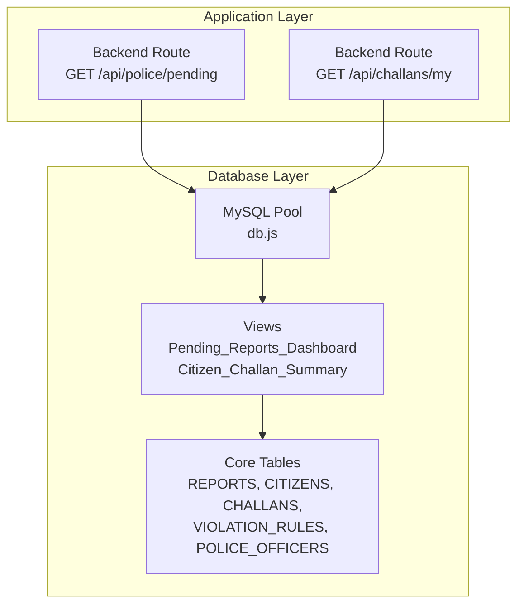
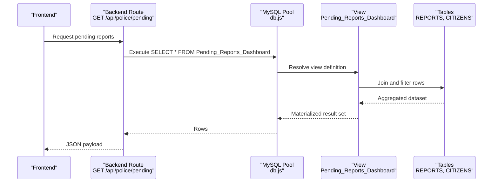
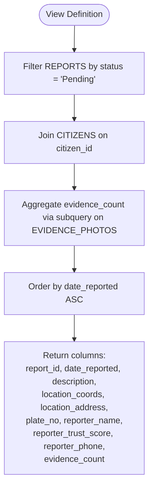
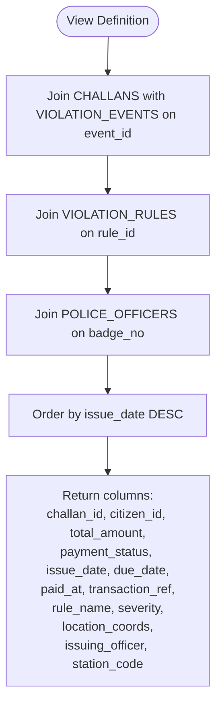
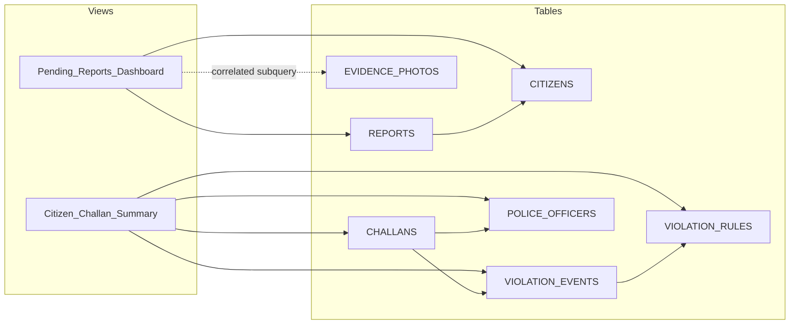

# Database Views

<cite>
**Referenced Files in This Document**
- [schema.sql](file://db/schema.sql)
- [police.js](file://backend/routes/police.js)
- [challans.js](file://backend/routes/challans.js)
- [db.js](file://backend/db.js)
- [marga_rakshak_triggers.sql](file://db/marga_rakshak_triggers.sql)
- [stored_procedure_process_report.sql](file://db/stored_procedure_process_report.sql)
</cite>

## Table of Contents
1. [Introduction](#introduction)
2. [Project Structure](#project-structure)
3. [Core Components](#core-components)
4. [Architecture Overview](#architecture-overview)
5. [Detailed Component Analysis](#detailed-component-analysis)
6. [Dependency Analysis](#dependency-analysis)
7. [Performance Considerations](#performance-considerations)
8. [Troubleshooting Guide](#troubleshooting-guide)
9. [Conclusion](#conclusion)

## Introduction
This document explains the database views that provide specialized data access patterns for different user roles in the Traffic Violation Management System. It focuses on:
- Pending_Reports_Dashboard: a police-centric view for case management and triage
- Citizen_Challan_Summary: a citizen-facing view for challan overview and payment tracking

It details view definitions, underlying table relationships, data aggregation patterns, filtering logic, security considerations, and operational maintenance implications. It also shows how these views simplify complex queries and how application code integrates with them.

## Project Structure
The views are part of the production schema and are consumed by backend routes:
- Pending_Reports_Dashboard is queried by the police portal route
- Citizen_Challan_Summary is referenced conceptually in the schema; the current backend route for citizens uses a direct query pattern, but the view definition is available for future adoption

**Diagram sources**
- [police.js:7-16](file://backend/routes/police.js#L7-L16)
- [challans.js:7-29](file://backend/routes/challans.js#L7-L29)
- [db.js:1-26](file://backend/db.js#L1-L26)
- [schema.sql:763-804](file://db/schema.sql#L763-L804)

**Section sources**
- [police.js:7-16](file://backend/routes/police.js#L7-L16)
- [challans.js:7-29](file://backend/routes/challans.js#L7-L29)
- [db.js:1-26](file://backend/db.js#L1-L26)
- [schema.sql:763-804](file://db/schema.sql#L763-L804)

## Core Components
- Pending_Reports_Dashboard: Provides a concise, filtered feed of pending reports enriched with reporter metadata and evidence counts for police command center operations.
- Citizen_Challan_Summary: Summarizes challans issued to a citizen with associated violation rules, issuing officer, and location details for transparency and payment tracking.

Both views encapsulate joins and aggregations, simplifying application logic and ensuring consistent access patterns.

**Section sources**
- [schema.sql:763-804](file://db/schema.sql#L763-L804)

## Architecture Overview
The views sit between application routes and normalized tables, acting as read-optimized facades. They reduce query complexity for clients and centralize business logic for role-specific dashboards.

**Diagram sources**
- [police.js:7-16](file://backend/routes/police.js#L7-L16)
- [db.js:1-26](file://backend/db.js#L1-L26)
- [schema.sql:763-780](file://db/schema.sql#L763-L780)

## Detailed Component Analysis

### Pending_Reports_Dashboard (Police Command Center)
Purpose:
- Present pending violations to reviewing officers for triage and action
- Include reporter identity and evidence count for context

Definition highlights:
- Filters REPORTS by status = 'Pending'
- Joins CITIZENS to expose reporter name, trust score, and phone
- Aggregates evidence count via a correlated subquery on EVIDENCE_PHOTOS
- Orders by date_reported ascending for chronological triage

Underlying relationships:
- REPORTS citizen_id -> CITIZENS
- REPORTS report_id -> EVIDENCE_PHOTOS (via correlated subquery)

Security and access:
- Access controlled by backend middleware requiring police role
- No row-level filtering by officer station is applied in the view; enforcement occurs at the route level

Performance characteristics:
- Uses a correlated subquery for evidence_count; consider indexing EVIDENCE_PHOTOS(report_id) and adding a precomputed column if performance becomes a concern
- Benefits from REPORTS(status) and REPORTS(date_reported) indexes

Usage in application:
- Called by GET /api/police/pending which executes SELECT * FROM Pending_Reports_Dashboard

**Diagram sources**
- [schema.sql:763-780](file://db/schema.sql#L763-L780)

**Section sources**
- [schema.sql:763-780](file://db/schema.sql#L763-L780)
- [police.js:7-16](file://backend/routes/police.js#L7-L16)

### Citizen_Challan_Summary (Citizen Access)
Purpose:
- Provide citizens with a consolidated summary of their challans, including rule details, issuing officer, and payment status

Definition highlights:
- Joins CHALLANS with VIOLATION_EVENTS, VIOLATION_RULES, and POLICE_OFFICERS
- Selects key fields for transparency and payment actions
- Orders by issue_date descending to show recent challans first

Underlying relationships:
- CHALLANS event_id -> VIOLATION_EVENTS
- VIOLATION_EVENTS rule_id -> VIOLATION_RULES
- CHALLANS badge_no -> POLICE_OFFICERS

Security and access:
- Access controlled by backend middleware requiring citizen role
- Application route currently queries CHALLANS directly; adopting the view would centralize the join logic and improve consistency

Performance characteristics:
- Benefits from appropriate indexes on CHALLANS(citizen_id), VIOLATION_EVENTS(event_id), and POLICE_OFFICERS(badge_no)

Usage in application:
- Current route uses a direct query; the view definition is available for future adoption

**Diagram sources**
- [schema.sql:784-804](file://db/schema.sql#L784-L804)

**Section sources**
- [schema.sql:784-804](file://db/schema.sql#L784-L804)
- [challans.js:7-29](file://backend/routes/challans.js#L7-L29)

### Supporting Triggers and Stored Procedures
Trust score automation and report processing:
- Auto_Reward_System and Auto_Penalty_System triggers adjust citizen trust scores upon report verification or rejection
- ProcessReportAndIssueChallan stored procedure coordinates end-to-end processing of verified reports into violation events and challans

These mechanisms complement the views by maintaining data integrity and automating workflows that inform the summarized datasets.

**Section sources**
- [marga_rakshak_triggers.sql:16-45](file://db/marga_rakshak_triggers.sql#L16-L45)
- [stored_procedure_process_report.sql:8-98](file://db/stored_procedure_process_report.sql#L8-L98)

## Dependency Analysis
The views depend on core tables and are consumed by backend routes. The following diagram maps these dependencies:

**Diagram sources**
- [schema.sql:763-804](file://db/schema.sql#L763-L804)

**Section sources**
- [schema.sql:763-804](file://db/schema.sql#L763-L804)

## Performance Considerations
- Indexing strategy
  - REPORTS(status, date_reported): supports Pending_Reports_Dashboard filtering and ordering
  - EVIDENCE_PHOTOS(report_id): improves correlated subquery performance for evidence_count
  - CHALLANS(citizen_id): supports Citizen_Challan_Summary filtering
  - VIOLATION_EVENTS(event_id), POLICE_OFFICERS(badge_no): support joins in Citizen_Challan_Summary
- Aggregation optimization
  - Consider materializing evidence_count into REPORTS or a summary table if the correlated subquery becomes a bottleneck
- Query simplification
  - Views eliminate repeated JOINs and WHERE clauses across endpoints, reducing client-side complexity and potential errors

[No sources needed since this section provides general guidance]

## Troubleshooting Guide
Common issues and resolutions:
- View returns empty results
  - Verify underlying tables have data and filters match expectations (e.g., REPORTS.status = 'Pending')
- Slow view performance
  - Confirm indexes exist on join and filter columns
  - Consider rewriting correlated subqueries into explicit JOINs with GROUP BY for evidence_count
- Authorization failures
  - Ensure routes enforce role-based middleware before executing view queries
- Data freshness
  - Views reflect current table state; for audit trails, consult history tables (e.g., CITIZENS_HISTORY, CHALLANS_HISTORY)

**Section sources**
- [police.js:7-16](file://backend/routes/police.js#L7-L16)
- [challans.js:7-29](file://backend/routes/challans.js#L7-L29)

## Conclusion
The Pending_Reports_Dashboard and Citizen_Challan_Summary views deliver role-specific, read-optimized access to complex datasets. They simplify application logic, improve consistency, and enable scalable performance through proper indexing. Adopting these views in complementary routes will further streamline development and maintenance while preserving strong security and data integrity guarantees.