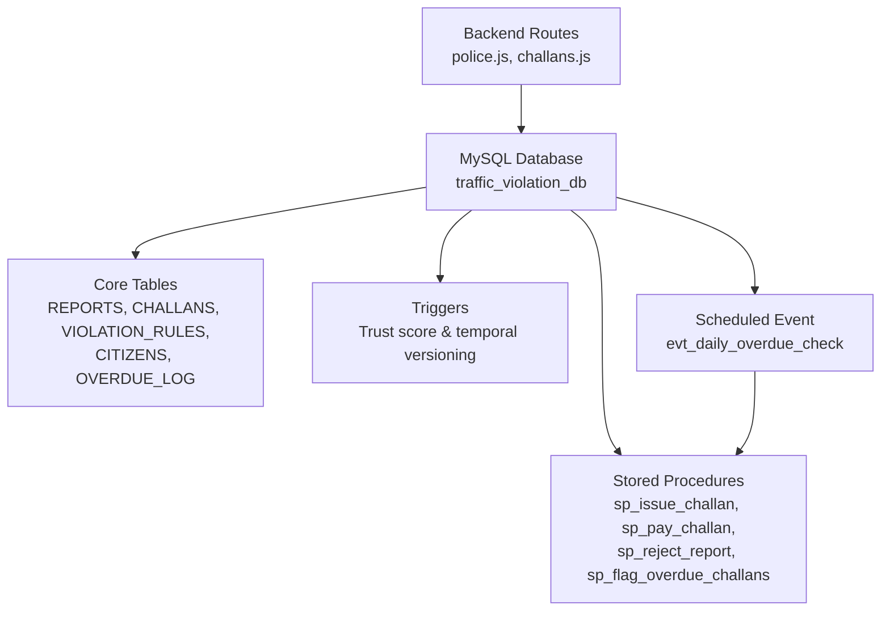
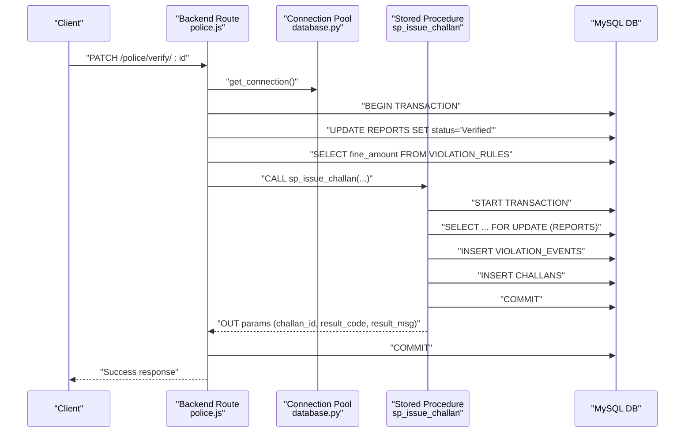
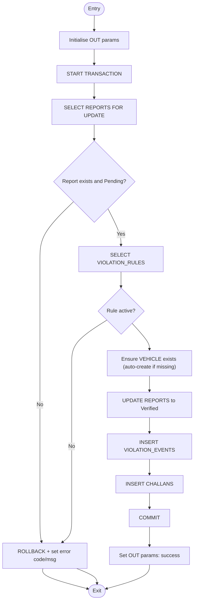
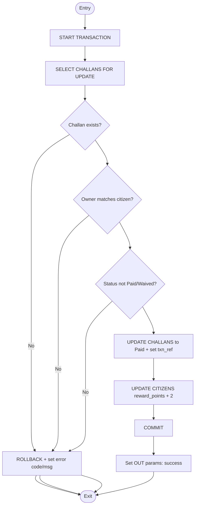
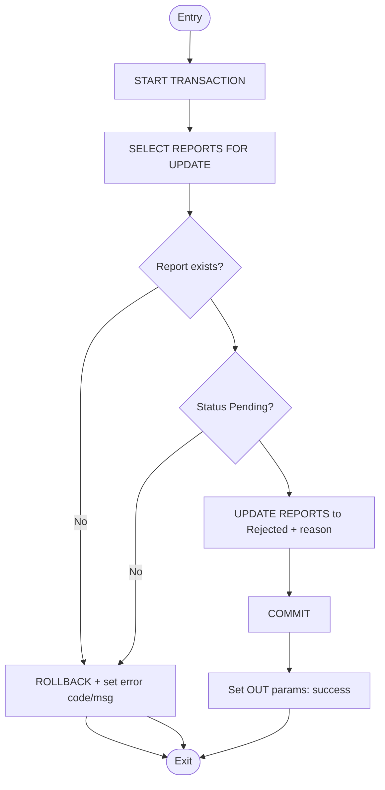
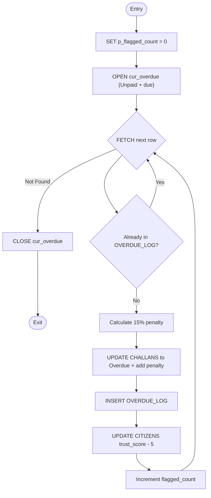
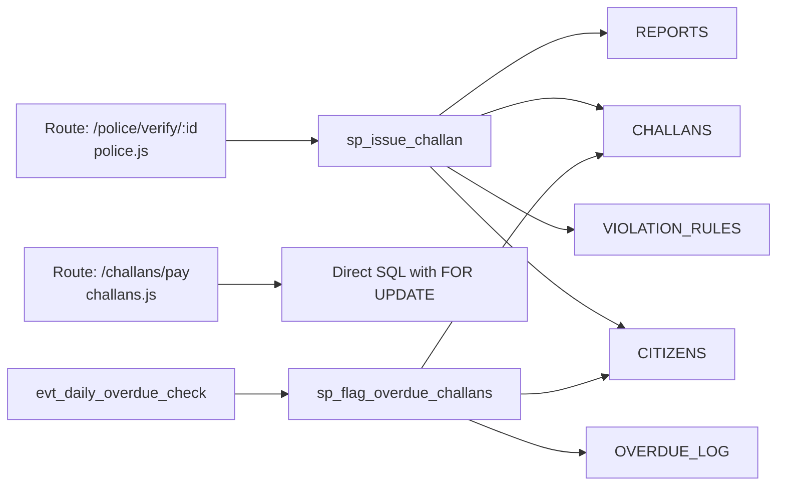

# Stored Procedures

<cite>
**Referenced Files in This Document**
- [schema.sql](file://db/schema.sql)
- [stored_procedure_process_report.sql](file://db/stored_procedure_process_report.sql)
- [police.js](file://backend/routes/police.js)
- [database.py](file://server/database.py)
- [deploy_stored_procedure.bat](file://scripts/deploy_stored_procedure.bat)
</cite>

## Table of Contents
1. [Introduction](#introduction)
2. [Project Structure](#project-structure)
3. [Core Components](#core-components)
4. [Architecture Overview](#architecture-overview)
5. [Detailed Component Analysis](#detailed-component-analysis)
6. [Dependency Analysis](#dependency-analysis)
7. [Performance Considerations](#performance-considerations)
8. [Troubleshooting Guide](#troubleshooting-guide)
9. [Conclusion](#conclusion)

## Introduction
This document provides comprehensive technical documentation for the four critical stored procedures that orchestrate core traffic violation management operations:
- sp_issue_challan: Creates challans after verifying reports and applying row-level locking.
- sp_pay_challan: Processes payments with strict concurrency controls and reward updates.
- sp_reject_report: Rejects reports with proper status checks and row-level locking.
- sp_flag_overdue_challans: Cursor-based batch job to flag overdue challans, apply penalties, and adjust trust scores.

It covers transaction management, exception handling, row-level locking, concurrency safety, deadlock prevention, input/output parameters, return codes, invocation examples, error scenarios, recovery mechanisms, cursor processing characteristics, troubleshooting, and optimization recommendations.

## Project Structure
The stored procedures are defined in the production schema and are invoked by backend routes and scheduled events. The backend routes wrap certain operations in transactions and call stored procedures where applicable.

**Diagram sources**
- [schema.sql:440-754](file://db/schema.sql#L440-L754)
- [police.js:68-71](file://backend/routes/police.js#L68-L71)
- [schema.sql:928-936](file://db/schema.sql#L928-L936)

**Section sources**
- [schema.sql:440-754](file://db/schema.sql#L440-L754)
- [police.js:68-71](file://backend/routes/police.js#L68-L71)
- [schema.sql:928-936](file://db/schema.sql#L928-L936)

## Core Components
- sp_issue_challan: Validates report status, fetches rule fine, ensures vehicle existence, updates report status, creates violation event and challan, and returns result metadata via OUT parameters.
- sp_pay_challan: Locks the target challan row, validates ownership and status, marks as Paid, sets transaction reference, and increments citizen reward points.
- sp_reject_report: Confirms report is Pending and updates status to Rejected with rejection reason.
- sp_flag_overdue_challans: Iterates unpaid challans past due date, applies 15% penalty, logs in OVERDUE_LOG, and reduces citizen trust score.

**Section sources**
- [schema.sql:440-546](file://db/schema.sql#L440-L546)
- [schema.sql:552-629](file://db/schema.sql#L552-L629)
- [schema.sql:634-686](file://db/schema.sql#L634-L686)
- [schema.sql:693-754](file://db/schema.sql#L693-L754)

## Architecture Overview
The stored procedures enforce ACID properties, use explicit transaction boundaries, and leverage row-level locks to prevent race conditions. They integrate with triggers for automatic trust score adjustments and temporal auditing. Scheduled events invoke the overdue flagging procedure to maintain data integrity and policy compliance.

**Diagram sources**
- [police.js:68-71](file://backend/routes/police.js#L68-L71)
- [schema.sql:440-546](file://db/schema.sql#L440-L546)
- [database.py:14-50](file://server/database.py#L14-L50)

## Detailed Component Analysis

### sp_issue_challan
- Purpose: Create a challan upon report verification with full transaction safety and row-level locking.
- Transaction management: Explicit transaction block with rollback on any SQL exception via EXIT HANDLER.
- Row-level locking: SELECT ... FOR UPDATE on REPORTS ensures exclusive access during validation and update.
- Concurrency safety: Prevents duplicate issuance and race conditions between verification and challan creation.
- Deadlock prevention: Single-row lock on REPORTS; keep transaction short and avoid additional locks.
- Input parameters:
  - p_report_id: INT
  - p_rule_id: INT
  - p_badge_no: VARCHAR(20)
  - p_plate_no: VARCHAR(20)
- Output parameters:
  - p_challan_id: INT
  - p_result_code: INT
  - p_result_msg: VARCHAR(255)
- Return behavior: Returns OUT values indicating success/failure and details.

**Diagram sources**
- [schema.sql:440-546](file://db/schema.sql#L440-L546)

**Section sources**
- [schema.sql:440-546](file://db/schema.sql#L440-L546)

### sp_pay_challan
- Purpose: Process payment for a challan with strict ownership and status checks.
- Transaction management: Explicit transaction with EXIT HANDLER for rollback on errors.
- Row-level locking: SELECT ... FOR UPDATE on CHALLANS prevents double-payment races.
- Concurrency safety: Validates owner identity, checks current status, and updates atomically.
- Deadlock prevention: Single-row lock; keep transaction minimal.
- Input parameters:
  - p_challan_id: INT
  - p_citizen_id: INT
  - p_txn_ref: VARCHAR(100)
- Output parameters:
  - p_result_code: INT
  - p_result_msg: VARCHAR(255)
- Return behavior: Sets OUT values indicating outcome.

**Diagram sources**
- [schema.sql:552-629](file://db/schema.sql#L552-L629)

**Section sources**
- [schema.sql:552-629](file://db/schema.sql#L552-L629)

### sp_reject_report
- Purpose: Reject a report with a reason while ensuring it remains Pending.
- Transaction management: Explicit transaction with EXIT HANDLER for rollback.
- Row-level locking: SELECT ... FOR UPDATE on REPORTS to prevent concurrent modifications.
- Concurrency safety: Validates status and updates only if Pending.
- Deadlock prevention: Single-row lock; minimal transaction scope.
- Input parameters:
  - p_report_id: INT
  - p_badge_no: VARCHAR(20)
  - p_reason: TEXT
- Output parameters:
  - p_result_code: INT
  - p_result_msg: VARCHAR(255)
- Return behavior: Sets OUT values indicating outcome.

**Diagram sources**
- [schema.sql:634-686](file://db/schema.sql#L634-L686)

**Section sources**
- [schema.sql:634-686](file://db/schema.sql#L634-L686)

### sp_flag_overdue_challans
- Purpose: Batch-flag overdue challans, apply 15% late penalty, log in OVERDUE_LOG, and reduce trust score.
- Processing model: Cursor-based iteration over unpaid challans past due date.
- Idempotency: Checks OVERDUE_LOG to avoid duplicate processing for the same challan.
- Transaction characteristics: Operates as a single atomic unit; each iteration updates CHALLANS, inserts OVERDUE_LOG, and adjusts CITIZENS trust score.
- Performance characteristics:
  - Cursor scanning: Linear scan over CHALLANS filtered by payment_status and due_date.
  - Index usage: Relies on CHALLANS indexes for due_date and payment_status filtering.
  - Throughput: Limited by cursor fetch and individual DML statements; suitable for nightly runs.
- Input/output parameters:
  - p_flagged_count: INT (OUT)
- Return behavior: Updates OUT count of flagged challans.

**Diagram sources**
- [schema.sql:693-754](file://db/schema.sql#L693-L754)

**Section sources**
- [schema.sql:693-754](file://db/schema.sql#L693-L754)

## Dependency Analysis
- Backend integration:
  - The backend route for verification calls sp_issue_challan after updating report status and validating rule details.
  - The backend route for payment uses direct SQL with row-level locking; it does not call sp_pay_challan.
- Database dependencies:
  - All procedures depend on REPORTS, CHALLANS, VIOLATION_RULES, CITIZENS, and OVERDUE_LOG.
  - Triggers on CITIZENS and CHALLANS support temporal versioning and trust score adjustments.
- Scheduling:
  - A MySQL event invokes sp_flag_overdue_challans daily to maintain overdue records.

**Diagram sources**
- [police.js:68-71](file://backend/routes/police.js#L68-L71)
- [schema.sql:440-546](file://db/schema.sql#L440-L546)
- [schema.sql:693-754](file://db/schema.sql#L693-L754)
- [schema.sql:928-936](file://db/schema.sql#L928-L936)

**Section sources**
- [police.js:68-71](file://backend/routes/police.js#L68-L71)
- [schema.sql:440-546](file://db/schema.sql#L440-L546)
- [schema.sql:693-754](file://db/schema.sql#L693-L754)
- [schema.sql:928-936](file://db/schema.sql#L928-L936)

## Performance Considerations
- Cursor-based processing:
  - sp_flag_overdue_challans iterates rows sequentially; for large datasets, consider batching or indexed scans to reduce overhead.
  - Ensure appropriate indexes exist on CHALLANS (e.g., due_date, payment_status) to optimize filtering.
- Transaction scope:
  - Keep transactions short to minimize lock duration and reduce contention.
- Deadlock prevention:
  - Access related rows in a consistent order across procedures.
  - Avoid long-running transactions and unnecessary secondary locks.
- Concurrency:
  - Row-level locks in sp_issue_challan, sp_pay_challan, and sp_reject_report prevent race conditions; ensure callers release connections promptly.
- Scheduled maintenance:
  - The daily overdue event should run during low-traffic windows to avoid impacting concurrent operations.

[No sources needed since this section provides general guidance]

## Troubleshooting Guide
Common failure scenarios and recovery mechanisms:
- sp_issue_challan
  - Report not found or already processed: Returns negative result code and message; rollback occurs automatically.
  - Invalid or inactive rule: Returns error code and message; rollback occurs automatically.
  - Recovery: Fix report status or rule activation; retry after corrections.
- sp_pay_challan
  - Challan not found: Returns error code and message; rollback occurs automatically.
  - Unauthorized access: Owner mismatch; rollback occurs automatically.
  - Already paid or waived: Returns error code and message; rollback occurs automatically.
  - Recovery: Verify challan ownership and status; ensure transaction reference uniqueness.
- sp_reject_report
  - Report not found or already processed: Returns error code and message; rollback occurs automatically.
  - Recovery: Confirm report Pending status; retry after validation.
- sp_flag_overdue_challans
  - Cursor iteration issues: Verify CHALLANS data and indexes; ensure overdue threshold logic aligns with due_date.
  - Recovery: Manually inspect overdue records; re-run after fixing data inconsistencies.
- General
  - Exception handling: All procedures use EXIT HANDLER to rollback on SQLEXCEPTION; check OUT parameters for detailed messages.
  - Deployment: Use the deployment script to install ACID-compliant procedures and verify installation via routine checks.

**Section sources**
- [schema.sql:440-546](file://db/schema.sql#L440-L546)
- [schema.sql:552-629](file://db/schema.sql#L552-L629)
- [schema.sql:634-686](file://db/schema.sql#L634-L686)
- [schema.sql:693-754](file://db/schema.sql#L693-L754)
- [deploy_stored_procedure.bat:15](file://scripts/deploy_stored_procedure.bat#L15)

## Conclusion
These stored procedures form the backbone of the traffic violation workflow, ensuring data integrity, concurrency safety, and policy compliance. By leveraging explicit transactions, row-level locks, and robust exception handling, they provide reliable outcomes for challan issuance, payment processing, report rejection, and overdue management. Scheduled automation further maintains system health. For optimal operation, monitor performance, maintain proper indexing, and follow the troubleshooting steps outlined above.