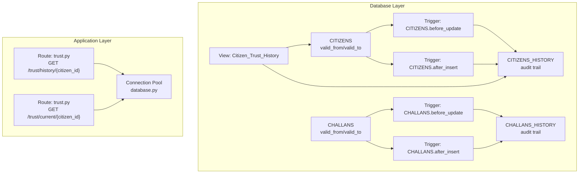
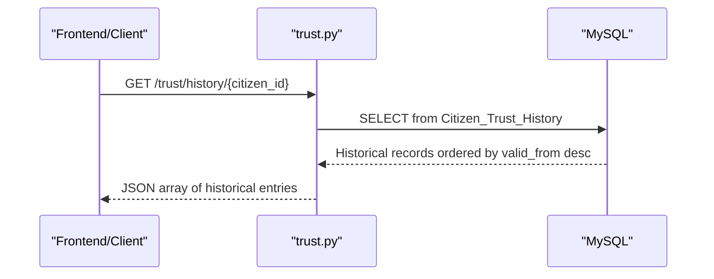
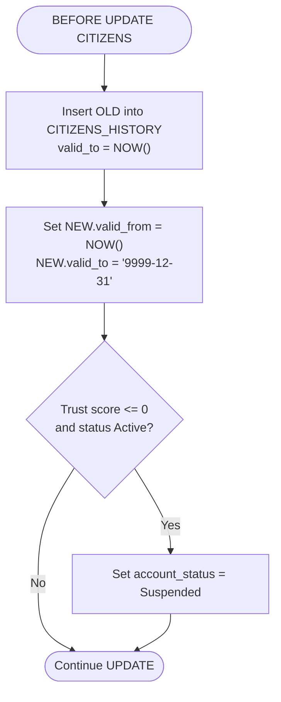
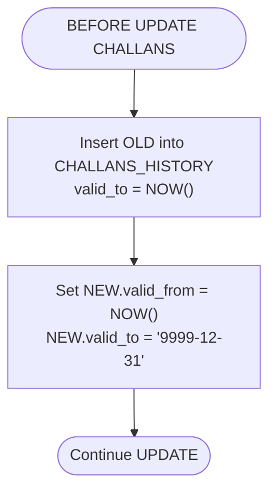
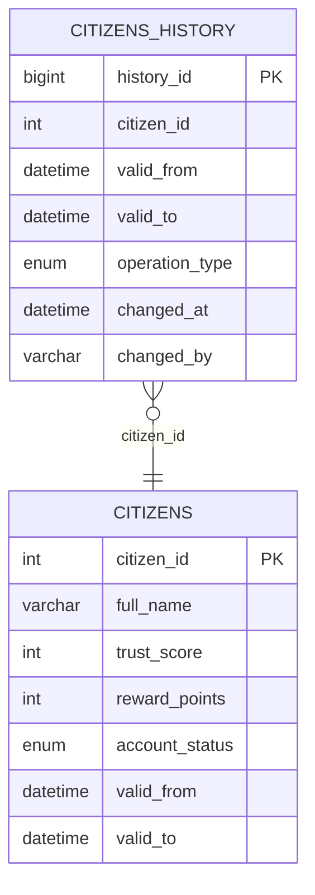
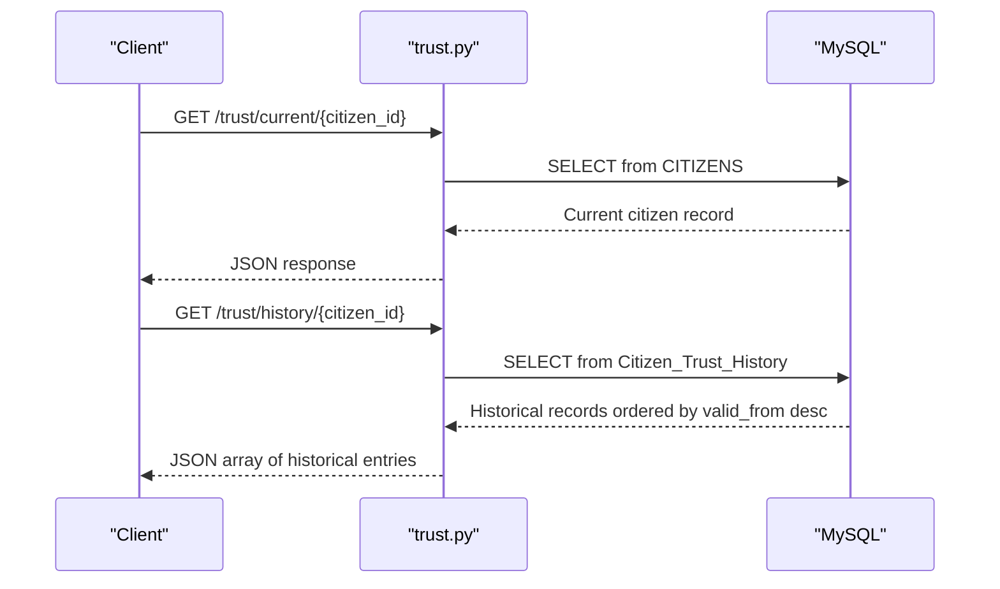
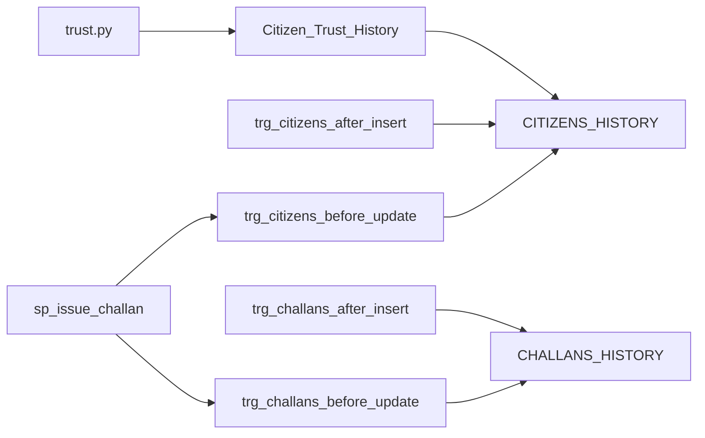

# Temporal Versioning System

<cite>
**Referenced Files in This Document**
- [schema.sql](file://db/schema.sql)
- [database_triggers.sql](file://db/database_triggers.sql)
- [marga_rakshak_triggers.sql](file://db/marga_rakshak_triggers.sql)
- [stored_procedure_process_report.sql](file://db/stored_procedure_process_report.sql)
- [reports_enhancement.sql](file://db/reports_enhancement.sql)
- [trust.py](file://server/routes/trust.py)
- [database.py](file://server/database.py)
- [install_triggers.bat](file://scripts/install_triggers.bat)
- [setup_db.bat](file://scripts/setup_db.bat)
</cite>

## Table of Contents
1. [Introduction](#introduction)
2. [Project Structure](#project-structure)
3. [Core Components](#core-components)
4. [Architecture Overview](#architecture-overview)
5. [Detailed Component Analysis](#detailed-component-analysis)
6. [Dependency Analysis](#dependency-analysis)
7. [Performance Considerations](#performance-considerations)
8. [Troubleshooting Guide](#troubleshooting-guide)
9. [Conclusion](#conclusion)

## Introduction
This document explains the temporal versioning system that maintains historical records of citizen profiles and challan changes using valid_from/valid_to columns and dedicated HISTORY tables. It covers how triggers automatically capture row changes, how to query historical data at specific points in time, and how current active records relate to historical snapshots. It also includes practical examples of temporal joins, historical analysis queries, compliance scenarios, and performance implications with indexing strategies.

## Project Structure
The temporal versioning system spans database schema, triggers, stored procedures, views, and backend API routes:
- Database schema defines core entities with valid_from/valid_to temporal columns and HISTORY tables for auditing.
- Triggers capture mutations to CITIZENS and CHALLANS, writing snapshots to CITIZENS_HISTORY and CHALLANS_HISTORY respectively.
- Stored procedures encapsulate ACID-compliant workflows that modify multiple related tables.
- Views expose temporal histories for reporting and compliance.
- Backend routes provide programmatic access to temporal data.

**Diagram sources**
- [schema.sql:26-43](file://db/schema.sql#L26-L43)
- [schema.sql:49-65](file://db/schema.sql#L49-L65)
- [schema.sql:173-195](file://db/schema.sql#L173-L195)
- [schema.sql:200-219](file://db/schema.sql#L200-L219)
- [schema.sql:312-356](file://db/schema.sql#L312-L356)
- [schema.sql:388-429](file://db/schema.sql#L388-L429)
- [schema.sql:822-839](file://db/schema.sql#L822-L839)
- [trust.py:15-61](file://server/routes/trust.py#L15-L61)
- [trust.py:63-101](file://server/routes/trust.py#L63-L101)
- [database.py:14-76](file://server/database.py#L14-L76)

**Section sources**
- [schema.sql:26-43](file://db/schema.sql#L26-L43)
- [schema.sql:49-65](file://db/schema.sql#L49-L65)
- [schema.sql:173-195](file://db/schema.sql#L173-L195)
- [schema.sql:200-219](file://db/schema.sql#L200-L219)
- [schema.sql:312-356](file://db/schema.sql#L312-L356)
- [schema.sql:388-429](file://db/schema.sql#L388-L429)
- [schema.sql:822-839](file://db/schema.sql#L822-L839)
- [trust.py:15-101](file://server/routes/trust.py#L15-L101)
- [database.py:14-76](file://server/database.py#L14-L76)

## Core Components
- CITIZENS and CHALLANS tables include valid_from and valid_to temporal columns to represent active periods.
- CITIZENS_HISTORY and CHALLANS_HISTORY tables capture historical snapshots with operation_type and changed_at metadata.
- Triggers automatically write to HISTORY tables on UPDATE/INSERT and adjust valid_from/valid_to on CITIZENS and CHALLANS.
- Views like Citizen_Trust_History aggregate historical trust score changes for analysis.
- Backend routes expose temporal data via REST endpoints.

Key temporal columns and indexes:
- CITIZENS: valid_from, valid_to, indexes on email, status, trust_score
- CITIZENS_HISTORY: indexes on citizen_id, (valid_from, valid_to)
- CHALLANS: valid_from, valid_to, indexes on status, citizen_id, due_date, issue_date
- CHALLANS_HISTORY: indexes on challan_id, (valid_from, valid_to)

**Section sources**
- [schema.sql:26-43](file://db/schema.sql#L26-L43)
- [schema.sql:49-65](file://db/schema.sql#L49-L65)
- [schema.sql:173-195](file://db/schema.sql#L173-L195)
- [schema.sql:200-219](file://db/schema.sql#L200-L219)

## Architecture Overview
The system enforces temporal integrity at the database level using triggers and stored procedures, ensuring that:
- Every update to CITIZENS or CHALLANS creates a historical snapshot.
- The active record’s valid_from is advanced and valid_to set to a sentinel future date.
- Historical queries can reconstruct the state at any point in time using valid_from/valid_to ranges.

**Diagram sources**
- [trust.py:15-61](file://server/routes/trust.py#L15-L61)
- [schema.sql:822-839](file://db/schema.sql#L822-L839)

**Section sources**
- [schema.sql:312-356](file://db/schema.sql#L312-L356)
- [schema.sql:388-429](file://db/schema.sql#L388-L429)
- [schema.sql:822-839](file://db/schema.sql#L822-L839)
- [trust.py:15-61](file://server/routes/trust.py#L15-L61)

## Detailed Component Analysis

### CITIZENS Temporal Versioning
- Trigger CITIZENS.before_update writes the previous row to CITIZENS_HISTORY with valid_to set to the current time and operation_type UPDATE, then advances NEW.valid_from to now and sets NEW.valid_to to the sentinel future date.
- Trigger CITIZENS.after_insert writes the initial row to CITIZENS_HISTORY with operation_type INSERT.
- Auto-suspension: if trust_score reaches zero, account_status is set to Suspended.

**Diagram sources**
- [schema.sql:312-335](file://db/schema.sql#L312-L335)

**Section sources**
- [schema.sql:312-356](file://db/schema.sql#L312-L356)

### CHALLANS Temporal Versioning
- Trigger CHALLANS.before_update writes the previous row to CHALLANS_HISTORY with valid_to set to the current time and operation_type UPDATE, then advances NEW.valid_from to now and sets NEW.valid_to to the sentinel future date.
- Trigger CHALLANS.after_insert writes the initial row to CHALLANS_HISTORY with operation_type INSERT.

**Diagram sources**
- [schema.sql:388-406](file://db/schema.sql#L388-L406)

**Section sources**
- [schema.sql:388-429](file://db/schema.sql#L388-L429)

### Historical Views and Compliance
- Citizen_Trust_History view joins CITIZENS_HISTORY with CITIZENS to present a timeline of trust score changes with timestamps and operation types. This supports compliance scenarios requiring auditable proof of score changes.

**Diagram sources**
- [schema.sql:49-65](file://db/schema.sql#L49-L65)
- [schema.sql:26-43](file://db/schema.sql#L26-L43)
- [schema.sql:822-839](file://db/schema.sql#L822-L839)

**Section sources**
- [schema.sql:822-839](file://db/schema.sql#L822-L839)

### Backend Access to Historical Data
- trust.py exposes endpoints to fetch current trust score and trust history for a citizen, converting datetime objects to ISO format for JSON serialization.

**Diagram sources**
- [trust.py:63-101](file://server/routes/trust.py#L63-L101)
- [trust.py:15-61](file://server/routes/trust.py#L15-L61)
- [schema.sql:822-839](file://db/schema.sql#L822-L839)

**Section sources**
- [trust.py:15-101](file://server/routes/trust.py#L15-L101)

### Stored Procedures and ACID Guarantees
- Stored procedures encapsulate multi-table updates with explicit transaction handling, row-level locks, and rollback on errors. They ensure that temporal triggers fire consistently during ACID operations.

Examples of stored procedures:
- sp_issue_challan: Creates a violation event and challan after verifying a report.
- sp_pay_challan: Processes payment with row-level locking to prevent race conditions.
- sp_reject_report: Updates report status to Rejected with a reason.
- sp_flag_overdue_challans: Iterates unpaid challans past due date, applies penalties, and updates trust scores.

These procedures rely on triggers to maintain temporal history and audit trails.

**Section sources**
- [schema.sql:440-546](file://db/schema.sql#L440-L546)
- [schema.sql:552-629](file://db/schema.sql#L552-L629)
- [schema.sql:634-686](file://db/schema.sql#L634-L686)
- [schema.sql:693-754](file://db/schema.sql#L693-L754)

### Additional Report Enhancements
- Reports enhancement script adds new columns to REPORTS (violation_type, latitude, longitude, fine_amount) and extends the status ENUM to include "Challan Issued". It also adds indexes to improve query performance for spatial and status-based filtering.

**Section sources**
- [reports_enhancement.sql:14-47](file://db/reports_enhancement.sql#L14-L47)
- [reports_enhancement.sql:53-285](file://db/reports_enhancement.sql#L53-L285)

## Dependency Analysis
The temporal system depends on:
- Triggers to capture changes and maintain HISTORY tables.
- Stored procedures to enforce ACID transactions and coordinate multi-table updates.
- Views to expose historical timelines for compliance and analysis.
- Backend routes to serve historical data to clients.

**Diagram sources**
- [schema.sql:312-356](file://db/schema.sql#L312-L356)
- [schema.sql:388-429](file://db/schema.sql#L388-L429)
- [schema.sql:440-546](file://db/schema.sql#L440-L546)
- [schema.sql:822-839](file://db/schema.sql#L822-L839)
- [trust.py:15-61](file://server/routes/trust.py#L15-L61)

**Section sources**
- [schema.sql:312-356](file://db/schema.sql#L312-L356)
- [schema.sql:388-429](file://db/schema.sql#L388-L429)
- [schema.sql:440-546](file://db/schema.sql#L440-L546)
- [schema.sql:822-839](file://db/schema.sql#L822-L839)
- [trust.py:15-61](file://server/routes/trust.py#L15-L61)

## Performance Considerations
Indexing strategies for temporal queries:
- CITIZENS_HISTORY: Index on (valid_from, valid_to) to efficiently filter historical periods.
- CHALLANS_HISTORY: Index on (valid_from, valid_to) for similar temporal filtering needs.
- CITIZENS: Indexes on email, account_status, and trust_score support common lookups.
- CHALLANS: Indexes on payment_status, citizen_id, due_date, and issue_date optimize operational queries.

Temporal query patterns:
- To retrieve the active record at a given time t, filter where t BETWEEN valid_from AND valid_to.
- To reconstruct a historical state, join CITIZENS/CITIZENS_HISTORY with CHALLANS/CHALLANS_HISTORY on the entity ID and apply the valid_from/valid_to window.
- For compliance audits, order by valid_from desc and limit as needed.

Storage and maintenance:
- Consider partitioning HISTORY tables by time ranges for very large datasets.
- Regularly purge or archive old historical rows if retention policies require it.
- Monitor trigger overhead and ensure transaction sizes remain reasonable.

[No sources needed since this section provides general guidance]

## Troubleshooting Guide
Common issues and resolutions:
- Triggers not firing: Verify trigger creation and permissions. Use verification queries to confirm triggers exist.
- Historical data missing: Ensure triggers are installed and stored procedures are executed within transactions so triggers can capture changes.
- Performance regressions: Confirm indexes on (valid_from, valid_to) and other frequently queried columns are present and used by EXPLAIN plans.
- Backend route errors: Check database connection pool initialization and route-level error handling.

Verification and setup scripts:
- install_triggers.bat installs Auto_Reward_System and Auto_Penalty_System triggers.
- setup_db.bat initializes the database schema and seeds data.

**Section sources**
- [database_triggers.sql:43-47](file://db/database_triggers.sql#L43-L47)
- [marga_rakshak_triggers.sql:53-63](file://db/marga_rakshak_triggers.sql#L53-L63)
- [install_triggers.bat:14-29](file://scripts/install_triggers.bat#L14-L29)
- [setup_db.bat:37-50](file://scripts/setup_db.bat#L37-L50)

## Conclusion
The temporal versioning system provides robust historical tracking for citizen profiles and challan changes through carefully designed triggers, HISTORY tables, and supporting views. It enables compliance-ready audits, accurate historical analysis, and reliable temporal joins. Proper indexing and stored procedure usage ensure performance and data integrity, while backend routes expose this temporal data to applications securely.