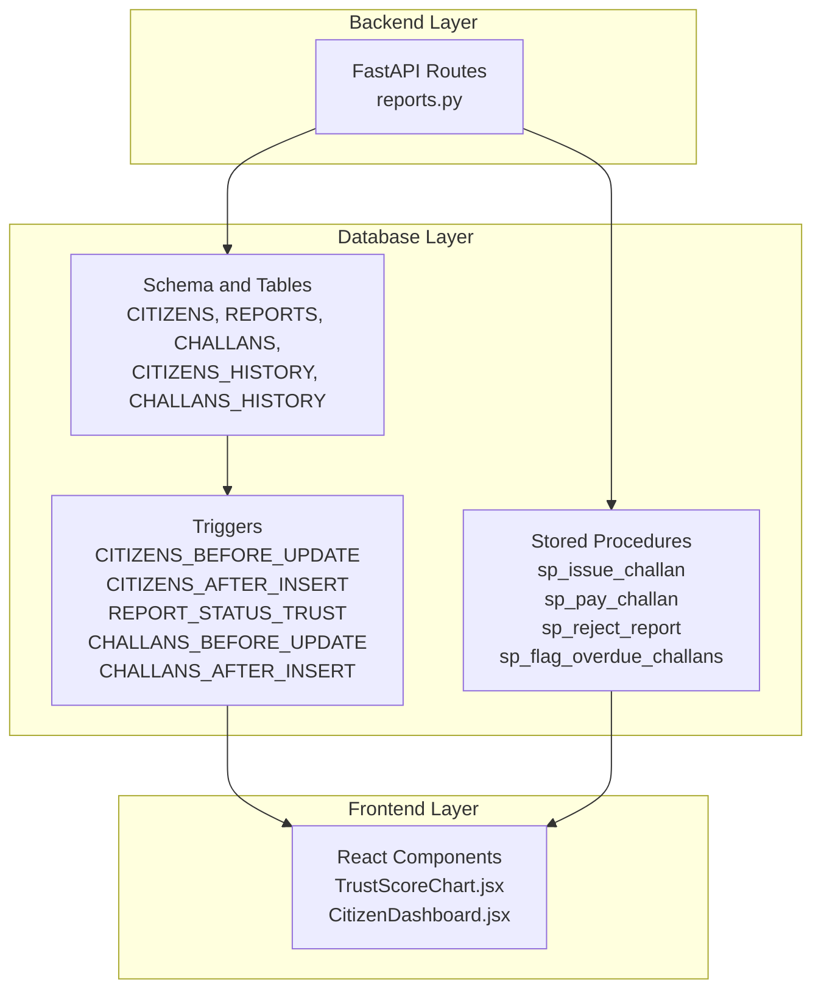
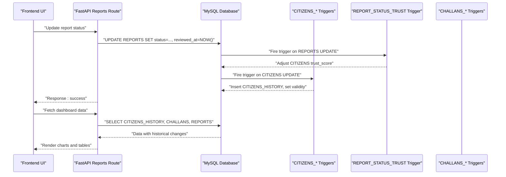
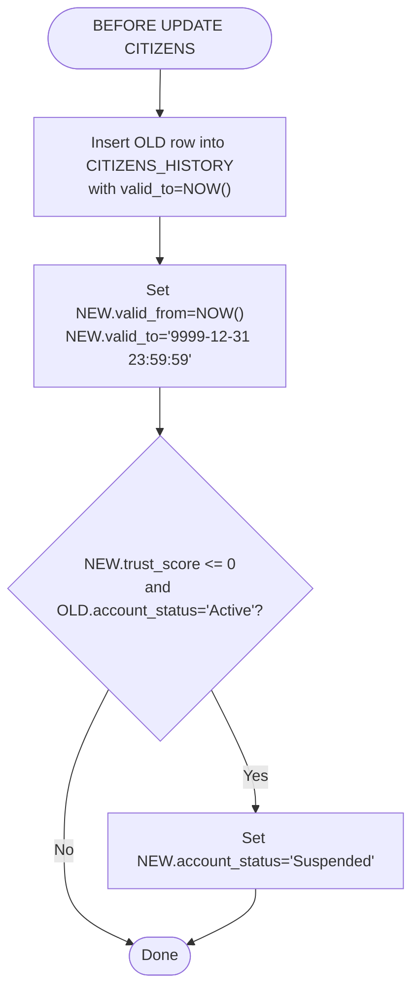
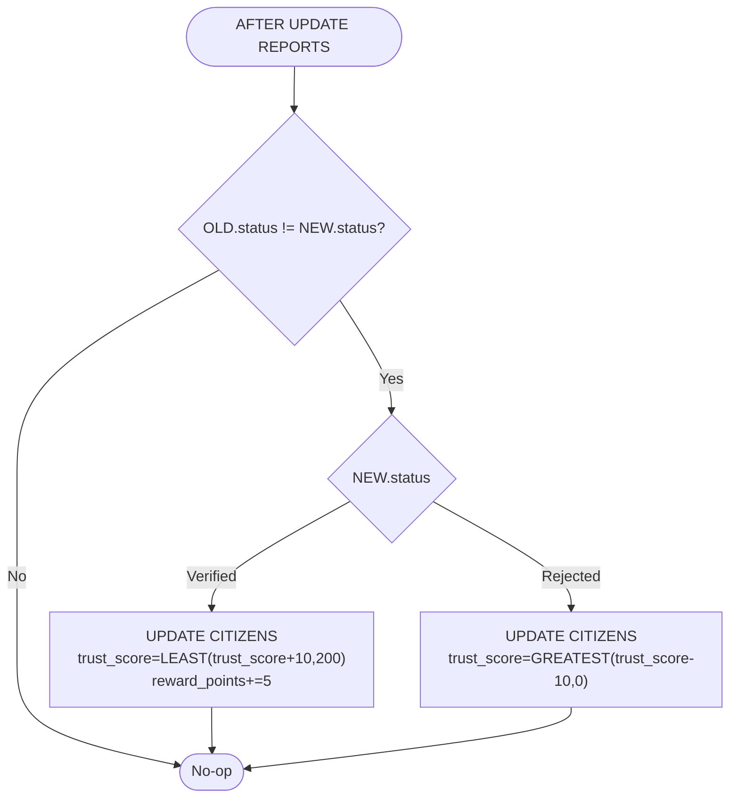
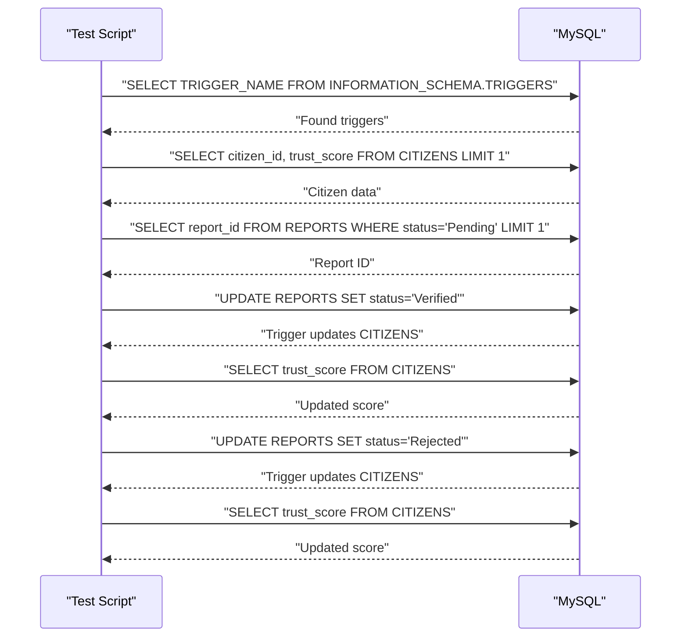
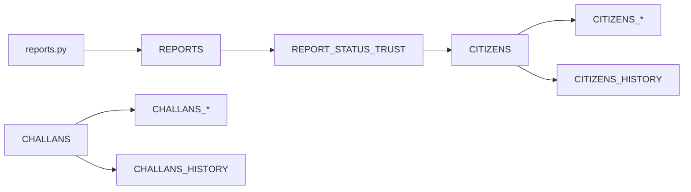

# Trigger System

<cite>
**Referenced Files in This Document**
- [schema.sql](file://db/schema.sql)
- [database_triggers.sql](file://db/database_triggers.sql)
- [marga_rakshak_triggers.sql](file://db/marga_rakshak_triggers.sql)
- [stored_procedure_process_report.sql](file://db/stored_procedure_process_report.sql)
- [reports_enhancement.sql](file://db/reports_enhancement.sql)
- [install_triggers.bat](file://scripts/install_triggers.bat)
- [test_trust_score_triggers.py](file://scripts/test_trust_score_triggers.py)
- [reports.py](file://server/routes/reports.py)
- [TrustScoreChart.jsx](file://frontend/src/components/TrustScoreChart.jsx)
- [CitizenDashboard.jsx](file://frontend/src/pages/CitizenDashboard.jsx)
</cite>

## Table of Contents
1. [Introduction](#introduction)
2. [Project Structure](#project-structure)
3. [Core Components](#core-components)
4. [Architecture Overview](#architecture-overview)
5. [Detailed Component Analysis](#detailed-component-analysis)
6. [Dependency Analysis](#dependency-analysis)
7. [Performance Considerations](#performance-considerations)
8. [Troubleshooting Guide](#troubleshooting-guide)
9. [Conclusion](#conclusion)
10. [Appendices](#appendices)

## Introduction
This document explains the PL/SQL-trigger-driven business logic and data integrity system for the Traffic Violation Management System. It focuses on five key triggers:
- CITIZENS_BEFORE_UPDATE
- CITIZENS_AFTER_INSERT
- REPORT_STATUS_TRUST
- CHALLANS_BEFORE_UPDATE
- CHALLANS_AFTER_INSERT

It also documents the trust score automation that rewards or penalizes citizens based on report outcomes, the temporal versioning triggers that capture historical changes, and the business rule enforcement mechanisms. The guide includes debugging techniques, performance considerations, best practices, and examples of trigger execution flows and error handling.

## Project Structure
The trigger system spans database schema definitions, trigger implementations, stored procedures, backend routes, and frontend components that reflect the automated changes.

**Diagram sources**
- [schema.sql:26-430](file://db/schema.sql#L26-L430)
- [reports.py:1-563](file://server/routes/reports.py#L1-L563)
- [TrustScoreChart.jsx:1-126](file://frontend/src/components/TrustScoreChart.jsx#L1-L126)
- [CitizenDashboard.jsx:1-340](file://frontend/src/pages/CitizenDashboard.jsx#L1-L340)

**Section sources**
- [schema.sql:1-942](file://db/schema.sql#L1-L942)
- [reports.py:1-563](file://server/routes/reports.py#L1-L563)

## Core Components
- CITIZENS_BEFORE_UPDATE: Captures historical state before updates, advances validity timestamps, and auto-suspends accounts when trust reaches zero.
- CITIZENS_AFTER_INSERT: Logs initial citizen records into CITIZENS_HISTORY.
- REPORT_STATUS_TRUST: Adjusts trust scores when report statuses change to Verified or Rejected.
- CHALLANS_BEFORE_UPDATE: Captures historical state before updates and advances validity timestamps.
- CHALLANS_AFTER_INSERT: Logs initial challan records into CHALLANS_HISTORY.

These triggers enforce data integrity, maintain audit trails, and automate behavioral incentives for citizens.

**Section sources**
- [schema.sql:307-429](file://db/schema.sql#L307-L429)

## Architecture Overview
The trigger architecture integrates with backend routes and stored procedures to ensure:
- Automatic trust score adjustments on report status changes.
- Temporal versioning of sensitive entities (CITIZENS, CHALLANS).
- Audit trails for compliance and governance.
- Frontend reflects real-time changes through dashboard and charts.

**Diagram sources**
- [reports.py:462-511](file://server/routes/reports.py#L462-L511)
- [schema.sql:307-429](file://db/schema.sql#L307-L429)

## Detailed Component Analysis

### CITIZENS_BEFORE_UPDATE Trigger
Purpose:
- Capture the previous state of a citizen record into CITIZENS_HISTORY before updating.
- Advance valid_from and valid_to timestamps for the new row.
- Automatically suspend accounts when trust score drops to zero.

Behavior highlights:
- Inserts a historical snapshot with operation_type='UPDATE'.
- Sets valid_to to the moment of change and valid_from to the next timestamp.
- Enforces account suspension when trust reaches zero.

**Diagram sources**
- [schema.sql:311-335](file://db/schema.sql#L311-L335)

**Section sources**
- [schema.sql:307-335](file://db/schema.sql#L307-L335)

### CITIZENS_AFTER_INSERT Trigger
Purpose:
- Log newly inserted citizen records into CITIZENS_HISTORY with operation_type='INSERT'.

Behavior highlights:
- Records initial trust_score, reward_points, and account_status.
- Sets valid_from and valid_to for the new row.

**Section sources**
- [schema.sql:338-356](file://db/schema.sql#L338-L356)

### REPORT_STATUS_TRUST Trigger
Purpose:
- Automate trust score adjustments when report statuses change:
  - Verified: increase trust score and reward points.
  - Rejected: decrease trust score (bounded by zero).

Behavior highlights:
- Only triggers when status actually changes.
- Uses LEAST/GREATEST to bound trust score within allowed limits.
- Updates CITIZENS.reward_points for Verified reports.

**Diagram sources**
- [schema.sql:363-381](file://db/schema.sql#L363-L381)

**Section sources**
- [schema.sql:358-381](file://db/schema.sql#L358-L381)

### CHALLANS_BEFORE_UPDATE Trigger
Purpose:
- Capture the previous state of a challan into CHALLANS_HISTORY before updating.
- Advance valid_from and valid_to timestamps for the new row.

Behavior highlights:
- Inserts a historical snapshot with operation_type='UPDATE'.
- Sets valid_to to the moment of change and valid_from to the next timestamp.

**Section sources**
- [schema.sql:384-406](file://db/schema.sql#L384-L406)

### CHALLANS_AFTER_INSERT Trigger
Purpose:
- Log newly inserted challan records into CHALLANS_HISTORY with operation_type='INSERT'.

Behavior highlights:
- Records all challan attributes and validity timestamps.
- Sets valid_from and valid_to for the new row.

**Section sources**
- [schema.sql:409-429](file://db/schema.sql#L409-L429)

### Trust Score Automation and Business Rule Enforcement
- Trust score automation:
  - Verified reports: +10 trust score, +5 reward points.
  - Rejected reports: -10 trust score (min 0).
  - Boundaries enforced via LEAST/GREATEST.
- Business rule enforcement:
  - CITIZENS_BEFORE_UPDATE auto-suspends accounts when trust reaches zero.
  - Stored procedures enforce status transitions and foreign key constraints.
  - Backend routes safely update report status to trigger trust adjustments.

**Section sources**
- [schema.sql:358-381](file://db/schema.sql#L358-L381)
- [schema.sql:311-335](file://db/schema.sql#L311-L335)
- [reports.py:462-511](file://server/routes/reports.py#L462-L511)

### Temporal Versioning Triggers
- CITIZENS_HISTORY captures historical changes for audit and compliance.
- CHALLANS_HISTORY captures adjustments for financial and legal tracking.
- Both triggers rely on valid_from/valid_to to represent time slices.

**Section sources**
- [schema.sql:48-65](file://db/schema.sql#L48-L65)
- [schema.sql:198-219](file://db/schema.sql#L198-L219)
- [schema.sql:307-429](file://db/schema.sql#L307-L429)

### Trigger Debugging Techniques
- Verify trigger existence and timing:
  - Use INFORMATION_SCHEMA.TRIGGERS to confirm trigger names and event manipulations.
- Manual testing:
  - Update a report from Pending to Verified or Rejected and observe CITIZENS trust score changes.
- Automated verification script:
  - The Python script checks trigger presence, finds a test citizen and pending report, performs Verified and Rejected updates, and validates score deltas.

**Diagram sources**
- [test_trust_score_triggers.py:17-198](file://scripts/test_trust_score_triggers.py#L17-L198)

**Section sources**
- [test_trust_score_triggers.py:17-198](file://scripts/test_trust_score_triggers.py#L17-L198)
- [install_triggers.bat:1-55](file://scripts/install_triggers.bat#L1-L55)

### Trigger Execution Flow Examples
- Verified report flow:
  - Backend route updates REPORTS.status to 'Verified'.
  - REPORT_STATUS_TRUST increases trust score and reward points.
  - CITIZENS_BEFORE_UPDATE captures historical state and advances validity.
- Rejected report flow:
  - Backend route updates REPORTS.status to 'Rejected'.
  - REPORT_STATUS_TRUST decreases trust score (min 0).
  - CITIZENS_BEFORE_UPDATE captures historical state and may suspend account.

**Section sources**
- [reports.py:462-511](file://server/routes/reports.py#L462-L511)
- [schema.sql:358-381](file://db/schema.sql#L358-L381)
- [schema.sql:311-335](file://db/schema.sql#L311-L335)

### Error Handling in Triggers and Stored Procedures
- Triggers:
  - Use conditional logic to ensure changes occur only when necessary (e.g., status change).
  - Bound trust score updates to valid ranges.
- Stored procedures:
  - Declare EXIT HANDLER for SQLEXCEPTION to roll back transactions and return meaningful error messages.
  - Validate inputs and preconditions before proceeding.

**Section sources**
- [schema.sql:459-465](file://db/schema.sql#L459-L465)
- [schema.sql:564-570](file://db/schema.sql#L564-L570)
- [schema.sql:644-650](file://db/schema.sql#L644-L650)

## Dependency Analysis
The trigger system depends on:
- Schema tables (CITIZENS, REPORTS, CHALLANS, CITIZENS_HISTORY, CHALLANS_HISTORY).
- Backend routes that update REPORTS status.
- Stored procedures that orchestrate multi-table changes.

**Diagram sources**
- [reports.py:462-511](file://server/routes/reports.py#L462-L511)
- [schema.sql:307-429](file://db/schema.sql#L307-L429)

**Section sources**
- [reports.py:1-563](file://server/routes/reports.py#L1-L563)
- [schema.sql:1-942](file://db/schema.sql#L1-L942)

## Performance Considerations
- Minimize trigger overhead:
  - Keep trigger bodies small and efficient; avoid heavy computations inside triggers.
  - Use indexes on frequently filtered columns (e.g., CITIZENS.trust_score, REPORTS.status).
- Bound updates:
  - Use LEAST/GREATEST to prevent unnecessary writes and reduce contention.
- Concurrency:
  - Stored procedures use row-level locks (SELECT ... FOR UPDATE) to prevent race conditions.
- Temporal indexing:
  - Indexes on valid_from/valid_to improve historical queries.

**Section sources**
- [schema.sql:31-43](file://db/schema.sql#L31-L43)
- [schema.sql:133-136](file://db/schema.sql#L133-L136)
- [schema.sql:191-194](file://db/schema.sql#L191-L194)
- [schema.sql:31-43](file://db/schema.sql#L31-L43)

## Troubleshooting Guide
Common issues and resolutions:
- Triggers not firing:
  - Verify trigger installation and existence using INFORMATION_SCHEMA.TRIGGERS.
  - Confirm backend updates are changing REPORTS.status values.
- Trust score not updating:
  - Ensure status transitions occur (Pending -> Verified/Rejected).
  - Check CITIZENS.check constraints and boundary logic.
- Historical data missing:
  - Confirm CITIZENS_HISTORY and CHALLANS_HISTORY triggers are present.
  - Verify valid_from/valid_to logic and INSERT/UPDATE operations.
- Frontend not reflecting changes:
  - Ensure backend routes fetch updated data and render CITIZENS_HISTORY and CHALLANS.
  - Validate frontend components (TrustScoreChart.jsx, CitizenDashboard.jsx) for data binding.

**Section sources**
- [test_trust_score_triggers.py:17-198](file://scripts/test_trust_score_triggers.py#L17-L198)
- [TrustScoreChart.jsx:1-126](file://frontend/src/components/TrustScoreChart.jsx#L1-L126)
- [CitizenDashboard.jsx:1-340](file://frontend/src/pages/CitizenDashboard.jsx#L1-L340)

## Conclusion
The trigger system enforces business rules, maintains data integrity, and automates citizen trust score management. The temporal versioning triggers provide auditability, while the backend routes and stored procedures ensure safe, ACID-compliant operations. Proper debugging, monitoring, and adherence to best practices guarantee reliable behavior across the system.

## Appendices

### Trigger Installation and Verification
- Install triggers using the provided batch script.
- Use the verification script to confirm trigger presence and behavior.

**Section sources**
- [install_triggers.bat:1-55](file://scripts/install_triggers.bat#L1-L55)
- [test_trust_score_triggers.py:17-198](file://scripts/test_trust_score_triggers.py#L17-L198)

### Additional Schema Enhancements
- REPORTS enhancements add violation_type, GPS coordinates, fine_amount, and expanded status enum.
- These improvements support richer reporting and analytics.

**Section sources**
- [reports_enhancement.sql:14-47](file://db/reports_enhancement.sql#L14-L47)