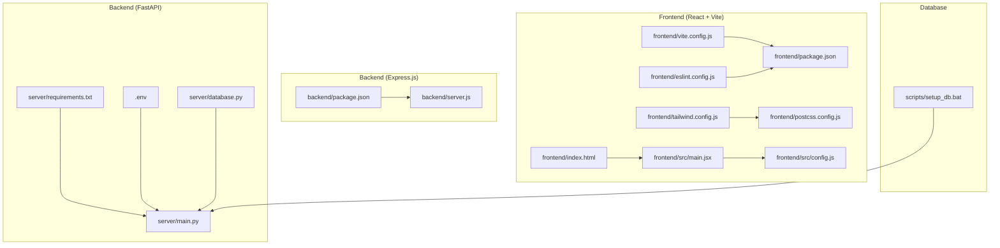
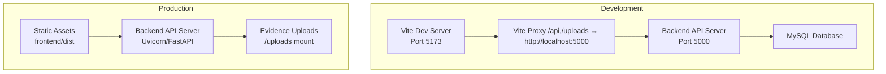
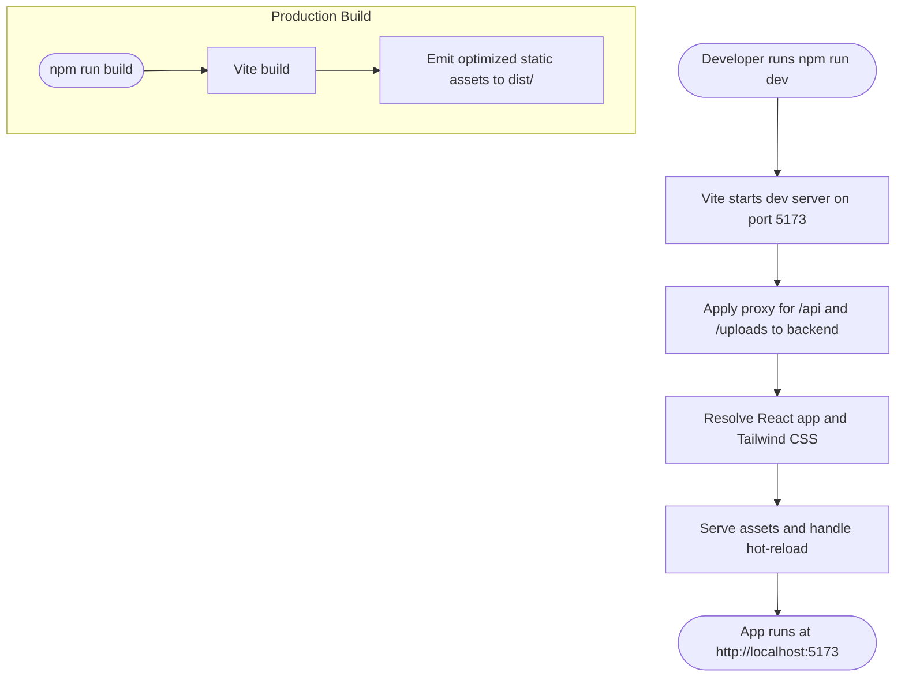
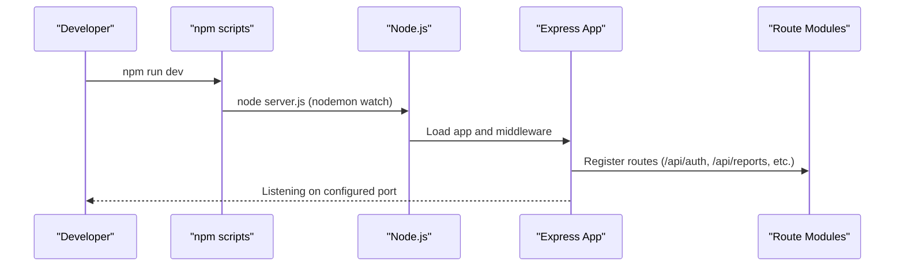
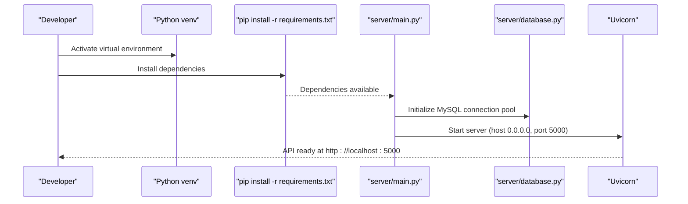
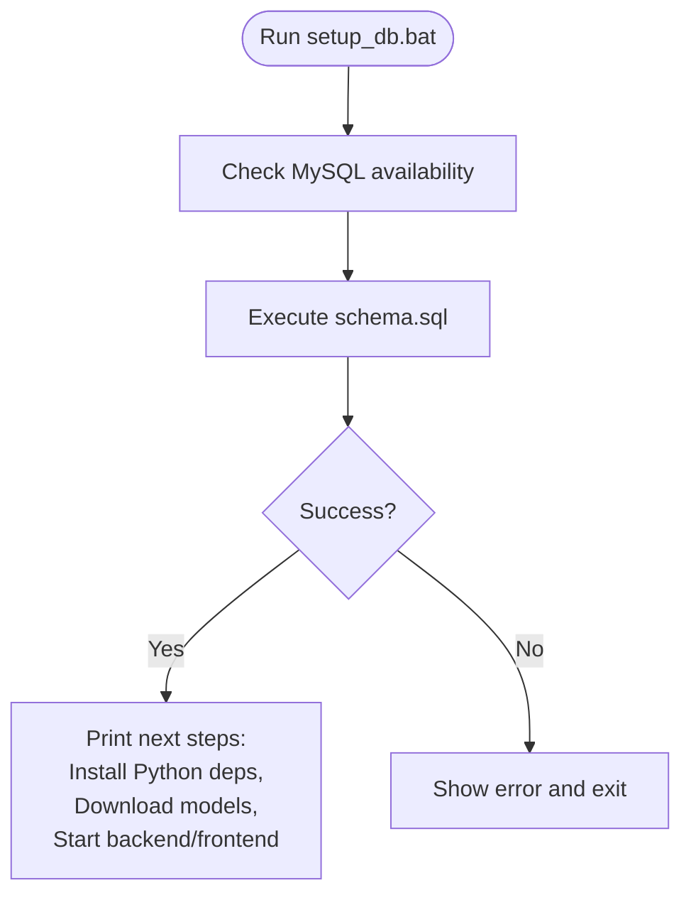
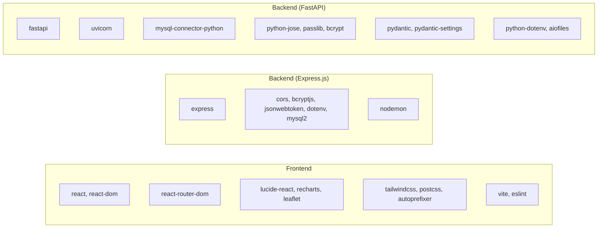

# Build Process

<cite>
**Referenced Files in This Document**
- [vite.config.js](file://frontend/vite.config.js)
- [package.json](file://frontend/package.json)
- [eslint.config.js](file://frontend/eslint.config.js)
- [tailwind.config.js](file://frontend/tailwind.config.js)
- [postcss.config.js](file://frontend/postcss.config.js)
- [index.html](file://frontend/index.html)
- [main.jsx](file://frontend/src/main.jsx)
- [config.js](file://frontend/src/config.js)
- [server.js](file://backend/server.js)
- [package.json](file://backend/package.json)
- [main.py](file://server/main.py)
- [requirements.txt](file://server/requirements.txt)
- [.env](file://server/.env)
- [database.py](file://server/database.py)
- [README.md](file://README.md)
- [setup_db.bat](file://scripts/setup_db.bat)
</cite>

## Table of Contents
1. [Introduction](#introduction)
2. [Project Structure](#project-structure)
3. [Core Components](#core-components)
4. [Architecture Overview](#architecture-overview)
5. [Detailed Component Analysis](#detailed-component-analysis)
6. [Dependency Analysis](#dependency-analysis)
7. [Performance Considerations](#performance-considerations)
8. [Troubleshooting Guide](#troubleshooting-guide)
9. [Conclusion](#conclusion)
10. [Appendices](#appendices)

## Introduction
This document describes the build and runtime processes for the Traffic Violation Management System’s frontend and backend components. It covers:
- Frontend build configuration using Vite, including asset optimization, bundling, and static file compilation.
- Backend build processes for both the deprecated Express.js service and the primary Python FastAPI service, including dependency management and virtual environment setup.
- Linting, testing, and minification steps.
- Environment-specific build configurations and optimization strategies.
- Continuous integration considerations for automated builds and deployments.
- Troubleshooting, cache management, and incremental build optimization guidance.
- Customization tips for integrating with deployment pipelines.

## Project Structure
The project is organized into three major areas:
- Frontend (React + Vite): responsible for UI, routing, styling, and API communication.
- Backend (deprecated Express.js kept for reference) and primary FastAPI service: responsible for REST APIs, authentication, database connectivity, and business logic.
- Database scripts and setup utilities for initializing the MySQL schema and supporting infrastructure.

**Diagram sources**
- [vite.config.js:1-23](file://frontend/vite.config.js#L1-L23)
- [package.json:1-30](file://frontend/package.json#L1-L30)
- [eslint.config.js:1-22](file://frontend/eslint.config.js#L1-L22)
- [tailwind.config.js:1-54](file://frontend/tailwind.config.js#L1-L54)
- [postcss.config.js:1-7](file://frontend/postcss.config.js#L1-L7)
- [index.html:1-17](file://frontend/index.html#L1-L17)
- [main.jsx:1-14](file://frontend/src/main.jsx#L1-L14)
- [config.js:1-34](file://frontend/src/config.js#L1-L34)
- [package.json:1-22](file://backend/package.json#L1-L22)
- [server.js:1-42](file://backend/server.js#L1-L42)
- [main.py:1-107](file://server/main.py#L1-L107)
- [requirements.txt:1-13](file://server/requirements.txt#L1-L13)
- [.env:1-24](file://server/.env#L1-L24)
- [database.py:1-76](file://server/database.py#L1-L76)
- [setup_db.bat:1-64](file://scripts/setup_db.bat#L1-L64)

**Section sources**
- [README.md:45-93](file://README.md#L45-L93)

## Core Components
- Frontend build toolchain: Vite orchestrates development server, asset preprocessing (PostCSS/Tailwind), and production bundling. ESLint enforces code quality. The frontend proxies API requests to the backend during development.
- Backend build toolchain: The deprecated Express.js service relies on npm scripts and Node.js runtime. The primary FastAPI service uses a Python virtual environment and pip-installed dependencies.
- Database initialization: A Windows batch script automates schema creation and seeds the database.

Key build artifacts and configuration touchpoints:
- Frontend: vite.config.js, package.json, eslint.config.js, tailwind.config.js, postcss.config.js, index.html, src/main.jsx, src/config.js.
- Backend (Express.js): backend/package.json, backend/server.js.
- Backend (FastAPI): server/main.py, server/requirements.txt, server/.env, server/database.py.
- Database: scripts/setup_db.bat.

**Section sources**
- [vite.config.js:1-23](file://frontend/vite.config.js#L1-L23)
- [package.json:1-30](file://frontend/package.json#L1-L30)
- [eslint.config.js:1-22](file://frontend/eslint.config.js#L1-L22)
- [tailwind.config.js:1-54](file://frontend/tailwind.config.js#L1-L54)
- [postcss.config.js:1-7](file://frontend/postcss.config.js#L1-L7)
- [index.html:1-17](file://frontend/index.html#L1-L17)
- [main.jsx:1-14](file://frontend/src/main.jsx#L1-L14)
- [config.js:1-34](file://frontend/src/config.js#L1-L34)
- [package.json:1-22](file://backend/package.json#L1-L22)
- [server.js:1-42](file://backend/server.js#L1-L42)
- [main.py:1-107](file://server/main.py#L1-L107)
- [requirements.txt:1-13](file://server/requirements.txt#L1-L13)
- [.env:1-24](file://server/.env#L1-L24)
- [database.py:1-76](file://server/database.py#L1-L76)
- [setup_db.bat:1-64](file://scripts/setup_db.bat#L1-L64)

## Architecture Overview
The build and runtime architecture separates concerns across frontend, backend, and database layers. During development, the frontend runs on Vite’s dev server and proxies API calls to the backend. In production, the frontend is built into optimized static assets served by the backend or a CDN, while the backend exposes REST endpoints and serves uploaded evidence.

**Diagram sources**
- [vite.config.js:7-21](file://frontend/vite.config.js#L7-L21)
- [server.js:1-42](file://backend/server.js#L1-L42)
- [main.py:69-72](file://server/main.py#L69-L72)

## Detailed Component Analysis

### Frontend Build Process (Vite)
- Tooling: Vite with React plugin, PostCSS, Tailwind CSS, and ESLint.
- Scripts: dev, build, preview.
- Development server: Port 5173 with proxy for /api and /uploads to backend.
- Asset pipeline: Tailwind CSS scanning configured via content globs; PostCSS applies Tailwind and Autoprefixer.
- Environment configuration: API base URL sourced from VITE_API_URL environment variable.
- Entry point: index.html renders src/main.jsx, which mounts App inside React Router.

**Diagram sources**
- [vite.config.js:5-21](file://frontend/vite.config.js#L5-L21)
- [package.json:6-10](file://frontend/package.json#L6-L10)
- [tailwind.config.js:3-6](file://frontend/tailwind.config.js#L3-L6)
- [postcss.config.js:1-7](file://frontend/postcss.config.js#L1-L7)
- [index.html:1-17](file://frontend/index.html#L1-L17)
- [main.jsx:1-14](file://frontend/src/main.jsx#L1-L14)
- [config.js:1-3](file://frontend/src/config.js#L1-L3)

**Section sources**
- [vite.config.js:1-23](file://frontend/vite.config.js#L1-L23)
- [package.json:1-30](file://frontend/package.json#L1-L30)
- [eslint.config.js:1-22](file://frontend/eslint.config.js#L1-L22)
- [tailwind.config.js:1-54](file://frontend/tailwind.config.js#L1-L54)
- [postcss.config.js:1-7](file://frontend/postcss.config.js#L1-L7)
- [index.html:1-17](file://frontend/index.html#L1-L17)
- [main.jsx:1-14](file://frontend/src/main.jsx#L1-L14)
- [config.js:1-34](file://frontend/src/config.js#L1-L34)

### Backend Build Process (Express.js)
- Purpose: Deprecated reference implementation retained for compatibility.
- Scripts: start (production), dev (development with nodemon).
- Dependencies: Express, CORS, JSON Web Token, bcrypt, dotenv, mysql2.
- Runtime: Listens on configurable port; serves routes under /api; includes health check and global error handling.

**Diagram sources**
- [package.json:6-9](file://backend/package.json#L6-L9)
- [server.js:1-42](file://backend/server.js#L1-L42)

**Section sources**
- [package.json:1-22](file://backend/package.json#L1-L22)
- [server.js:1-42](file://backend/server.js#L1-L42)

### Backend Build Process (FastAPI)
- Purpose: Primary backend serving REST endpoints, mounting static uploads, and managing database connections.
- Virtual environment: Recommended Python venv; dependencies managed via requirements.txt.
- Configuration: Environment variables via .env; database connection pool initialized in database.py.
- Routing: Routers included under /api/* prefixes; health check and root endpoints exposed.
- Static files: Evidence uploads mounted at /uploads.

**Diagram sources**
- [requirements.txt:1-13](file://server/requirements.txt#L1-L13)
- [main.py:1-107](file://server/main.py#L1-L107)
- [database.py:1-76](file://server/database.py#L1-L76)
- [.env:1-24](file://server/.env#L1-L24)

**Section sources**
- [requirements.txt:1-13](file://server/requirements.txt#L1-L13)
- [main.py:1-107](file://server/main.py#L1-L107)
- [database.py:1-76](file://server/database.py#L1-L76)
- [.env:1-24](file://server/.env#L1-L24)

### Database Initialization Pipeline
- Automated setup: Windows batch script executes schema.sql and prints next steps.
- Typical flow: Install dependencies, download OpenCV models, start backend, start frontend.

**Diagram sources**
- [setup_db.bat:1-64](file://scripts/setup_db.bat#L1-L64)

**Section sources**
- [setup_db.bat:1-64](file://scripts/setup_db.bat#L1-L64)

## Dependency Analysis
- Frontend dependencies: React, React DOM, React Router, Recharts, Lucide React, Leaflet, Tailwind CSS, PostCSS, ESLint, Vite, and related plugins.
- Backend (Express.js) dependencies: Express, CORS, bcryptjs, jsonwebtoken, dotenv, mysql2, nodemon.
- Backend (FastAPI) dependencies: FastAPI, Uvicorn, mysql-connector-python, python-jose, passlib, bcrypt, python-multipart, pydantic, pydantic-settings, python-dotenv, aiofiles.

**Diagram sources**
- [package.json:11-28](file://frontend/package.json#L11-L28)
- [package.json:10-20](file://backend/package.json#L10-L20)
- [requirements.txt:1-12](file://server/requirements.txt#L1-L12)

**Section sources**
- [package.json:1-30](file://frontend/package.json#L1-L30)
- [package.json:1-22](file://backend/package.json#L1-L22)
- [requirements.txt:1-13](file://server/requirements.txt#L1-L13)

## Performance Considerations
- Frontend
  - Use Vite’s built-in code splitting and dynamic imports to optimize bundle size.
  - Keep Tailwind content globs precise to reduce unnecessary CSS generation.
  - Prefer lazy-loading heavy components (e.g., charts, maps) to improve initial load.
  - Enable production builds with minification and asset hashing for caching.
- Backend
  - Use a production ASGI server (Uvicorn) with multiple workers for concurrency.
  - Centralize database connection pooling and reuse connections.
  - Serve static uploads efficiently; consider CDN for evidence assets in production.
- Database
  - Ensure proper indexing and avoid N+1 queries; leverage stored procedures and views.
  - Use prepared statements and parameterized queries to prevent overhead and injection.

[No sources needed since this section provides general guidance]

## Troubleshooting Guide
- Frontend cannot connect to backend
  - Confirm backend is running on port 5000.
  - Verify Vite proxy configuration for /api and /uploads.
  - Clear browser cache and reload.
- Backend fails to start
  - Ensure MySQL is running and reachable.
  - Validate .env credentials and database name.
  - Reinstall Python dependencies from requirements.txt.
- Database setup issues
  - Run setup_db.bat and confirm schema.sql execution.
  - Check MySQL version and PATH configuration.
- CORS or origin mismatch
  - Adjust CORS_ORIGINS in .env to include frontend ports (e.g., 5173, 5175).
- API base URL resolution
  - Set VITE_API_URL in the frontend environment to match backend address.

**Section sources**
- [vite.config.js:7-21](file://frontend/vite.config.js#L7-L21)
- [server.js:17-41](file://backend/server.js#L17-L41)
- [main.py:57-67](file://server/main.py#L57-L67)
- [.env:14-17](file://server/.env#L14-L17)
- [README.md:371-392](file://README.md#L371-L392)

## Conclusion
The Traffic Violation Management System employs a modern frontend build pipeline powered by Vite and a robust Python FastAPI backend with a dedicated virtual environment and dependency management. The deprecated Express.js backend remains as a reference. By following the documented build steps, environment configurations, and troubleshooting guidance, teams can reliably develop, test, and deploy the system across environments.

[No sources needed since this section summarizes without analyzing specific files]

## Appendices

### Environment Variables Reference
- Frontend
  - VITE_API_URL: Base URL for API endpoints.
- Backend (FastAPI)
  - DB_HOST, DB_PORT, DB_USER, DB_PASSWORD, DB_NAME, DB_POOL_SIZE
  - JWT_SECRET, JWT_ALGORITHM, JWT_EXPIRY_HOURS
  - SERVER_HOST, SERVER_PORT, CORS_ORIGINS
  - FACE_TOLERANCE, FACE_MODEL
  - UPLOAD_DIR

**Section sources**
- [config.js:1-3](file://frontend/src/config.js#L1-L3)
- [.env:1-24](file://server/.env#L1-L24)

### CI/CD Integration Guidance
- Frontend
  - Use a CI job to install dependencies, run ESLint, build static assets, and publish artifacts.
  - Cache node_modules and Vite dependencies for faster incremental builds.
- Backend (FastAPI)
  - Create a CI job to set up Python venv, install requirements, run linters/tests, and build/deploy.
  - Cache pip dependencies and Python bytecode.
- Database
  - Automate schema initialization using setup_db.bat or equivalent in CI.
- Deployment
  - Serve frontend dist via backend static files or a CDN.
  - Mount uploads directory and configure CORS for frontend origins.

[No sources needed since this section provides general guidance]