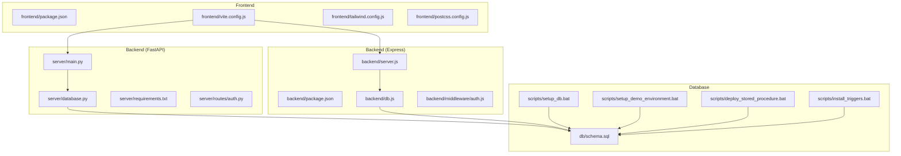
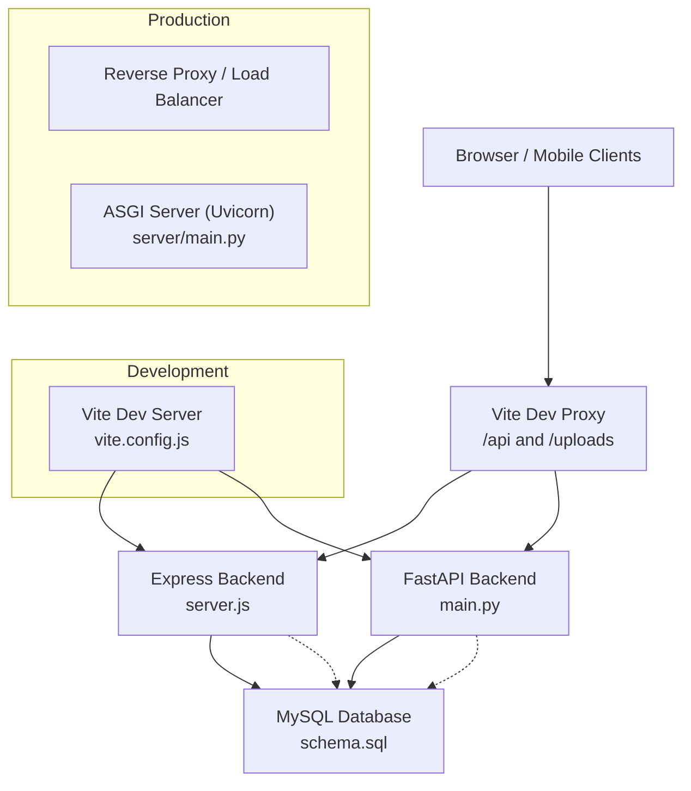
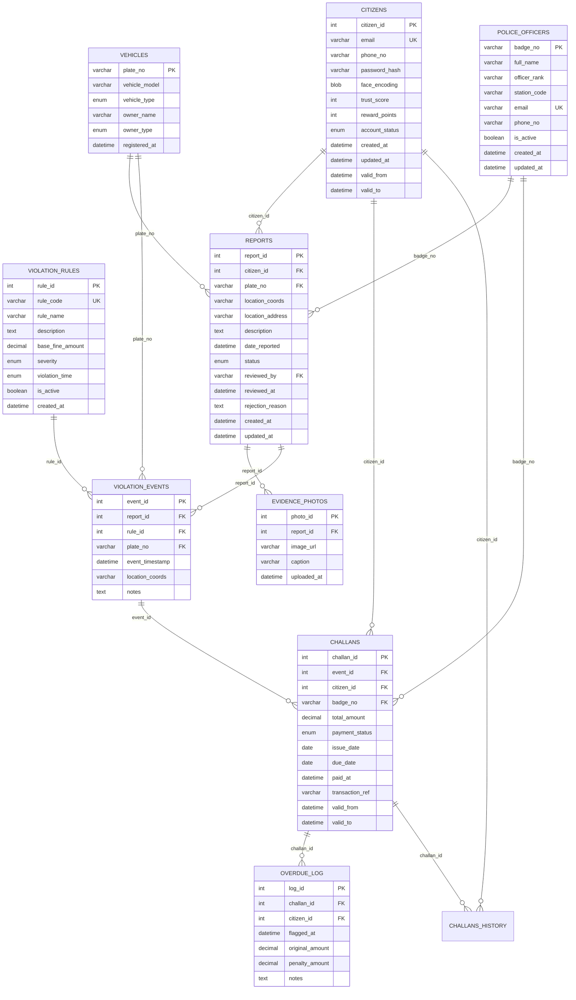
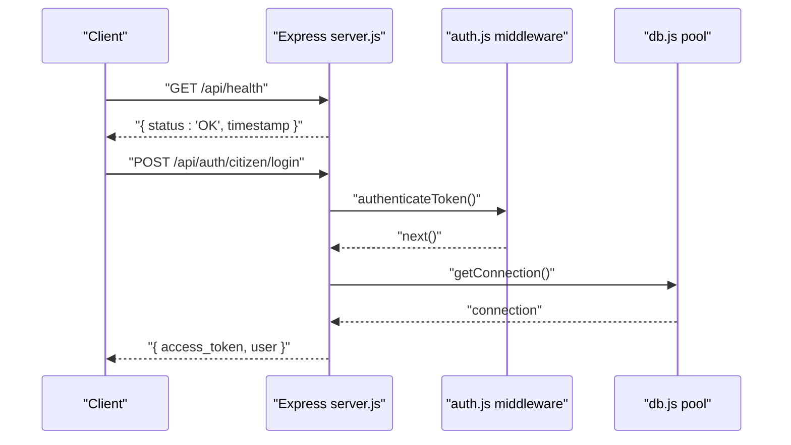
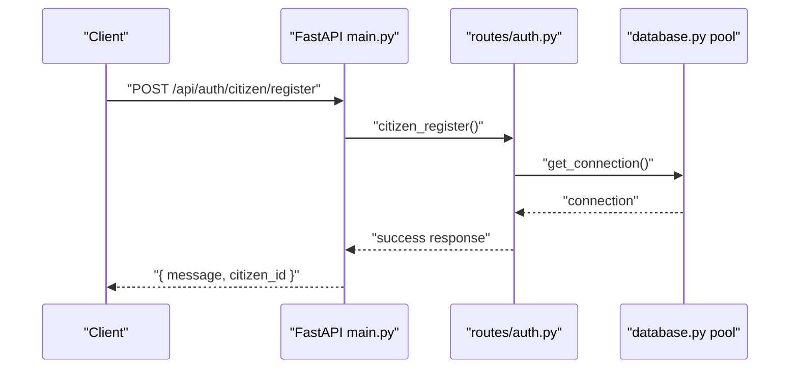
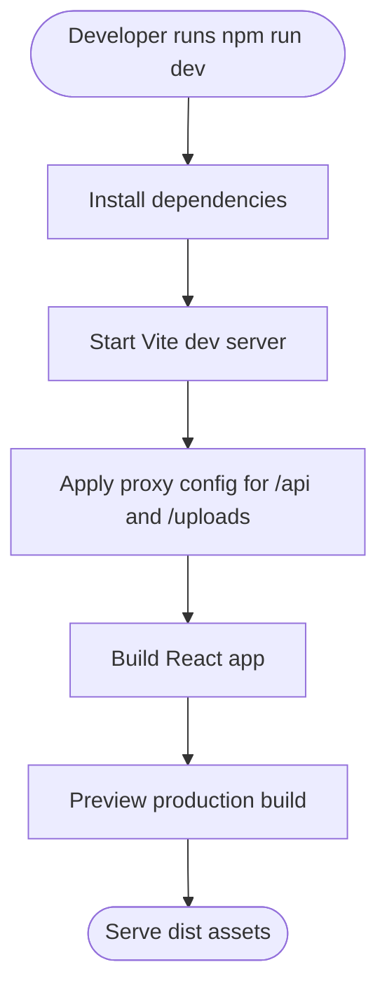
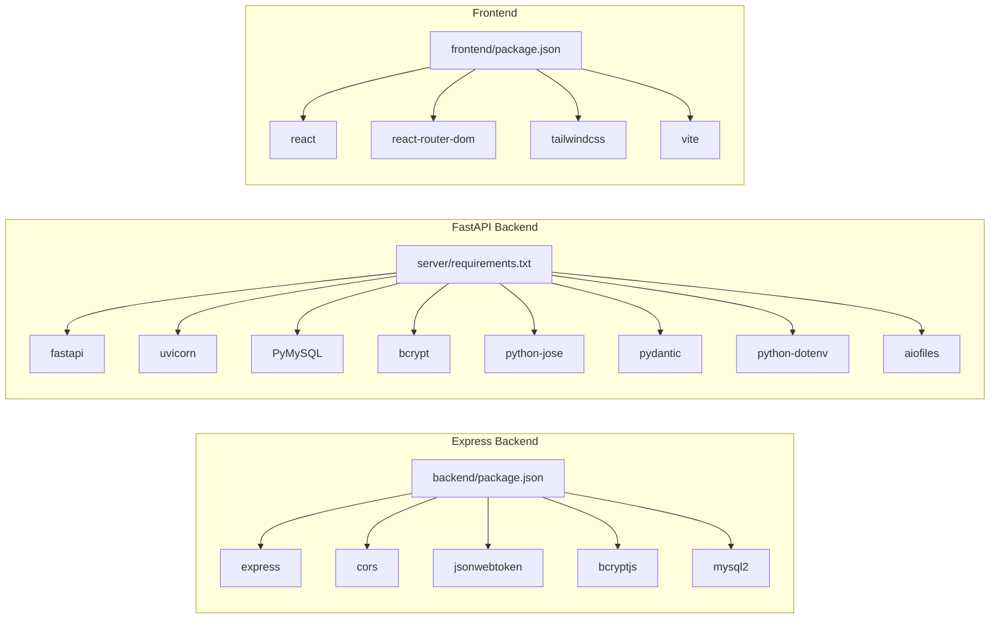

# Deployment and DevOps

<cite>
**Referenced Files in This Document**
- [backend/package.json](file://backend/package.json)
- [backend/server.js](file://backend/server.js)
- [backend/db.js](file://backend/db.js)
- [backend/middleware/auth.js](file://backend/middleware/auth.js)
- [frontend/package.json](file://frontend/package.json)
- [frontend/vite.config.js](file://frontend/vite.config.js)
- [frontend/tailwind.config.js](file://frontend/tailwind.config.js)
- [frontend/postcss.config.js](file://frontend/postcss.config.js)
- [frontend/README.md](file://frontend/README.md)
- [server/main.py](file://server/main.py)
- [server/database.py](file://server/database.py)
- [server/requirements.txt](file://server/requirements.txt)
- [server/routes/auth.py](file://server/routes/auth.py)
- [db/schema.sql](file://db/schema.sql)
- [scripts/setup_db.bat](file://scripts/setup_db.bat)
- [scripts/setup_demo_environment.bat](file://scripts/setup_demo_environment.bat)
- [scripts/deploy_stored_procedure.bat](file://scripts/deploy_stored_procedure.bat)
- [scripts/install_triggers.bat](file://scripts/install_triggers.bat)
</cite>

## Table of Contents
1. [Introduction](#introduction)
2. [Project Structure](#project-structure)
3. [Core Components](#core-components)
4. [Architecture Overview](#architecture-overview)
5. [Detailed Component Analysis](#detailed-component-analysis)
6. [Dependency Analysis](#dependency-analysis)
7. [Performance Considerations](#performance-considerations)
8. [Troubleshooting Guide](#troubleshooting-guide)
9. [Conclusion](#conclusion)
10. [Appendices](#appendices)

## Introduction
This document provides comprehensive deployment and DevOps guidance for the Traffic Violation Management System. It covers environment configuration for production, database setup, backend service configuration, frontend build processes, deployment strategies across development, staging, and production, monitoring and logging, backup and recovery, security hardening, scaling and load balancing, containerization with Docker, orchestration with Kubernetes, maintenance and update workflows, and troubleshooting production issues.

## Project Structure
The system comprises:
- Backend API written in Express.js with environment-driven configuration and a health endpoint.
- Frontend built with React and Vite, proxied to the backend during development.
- A Python/FastAPI backend with database connectivity via a connection pool and comprehensive authentication routes.
- A MySQL database with normalized schema, triggers, stored procedures, views, and scheduled events.
- Windows batch scripts to automate database initialization, trigger installation, stored procedure deployment, and demo environment setup.

**Diagram sources**
- [frontend/vite.config.js:1-23](file://frontend/vite.config.js#L1-L23)
- [backend/server.js:1-42](file://backend/server.js#L1-L42)
- [backend/db.js:1-26](file://backend/db.js#L1-L26)
- [server/main.py:1-107](file://server/main.py#L1-L107)
- [server/database.py:1-76](file://server/database.py#L1-L76)
- [db/schema.sql:1-942](file://db/schema.sql#L1-L942)
- [scripts/setup_db.bat:1-64](file://scripts/setup_db.bat#L1-L64)
- [scripts/setup_demo_environment.bat:1-79](file://scripts/setup_demo_environment.bat#L1-L79)
- [scripts/deploy_stored_procedure.bat:1-44](file://scripts/deploy_stored_procedure.bat#L1-L44)
- [scripts/install_triggers.bat:1-55](file://scripts/install_triggers.bat#L1-L55)

**Section sources**
- [frontend/package.json:1-30](file://frontend/package.json#L1-L30)
- [backend/package.json:1-22](file://backend/package.json#L1-L22)
- [server/requirements.txt:1-13](file://server/requirements.txt#L1-L13)
- [db/schema.sql:1-942](file://db/schema.sql#L1-L942)

## Core Components
- Express backend: JSON body parsing, CORS, health endpoint, route mounting, centralized error handling, and environment-driven port binding.
- FastAPI backend: Centralized CORS, static file serving for uploads, modular router inclusion, health endpoint, and structured logging.
- Database: MySQL schema with normalization, temporal tables, triggers, stored procedures, views, and scheduled events.
- Frontend: Vite-based React app with Tailwind CSS, proxy configuration for development, and build pipeline.

Key operational endpoints and behaviors:
- Health checks: Express exposes a simple health endpoint; FastAPI exposes a health endpoint and a root message endpoint.
- Authentication: Both backends implement token-based authentication; FastAPI routes include citizen/police registration and login with JWT issuance.
- Uploads: FastAPI serves uploaded evidence files from a local directory.

**Section sources**
- [backend/server.js:17-41](file://backend/server.js#L17-L41)
- [server/main.py:88-103](file://server/main.py#L88-L103)
- [server/routes/auth.py:114-491](file://server/routes/auth.py#L114-L491)
- [frontend/vite.config.js:7-21](file://frontend/vite.config.js#L7-L21)

## Architecture Overview
The system follows a dual-backend pattern:
- Express backend handles lightweight API tasks and integrates with the frontend proxy.
- FastAPI backend hosts the primary business logic, authentication, and static file serving for uploads.
- Database is shared between both backends and initialized via schema and supporting scripts.

**Diagram sources**
- [backend/server.js:10-31](file://backend/server.js#L10-L31)
- [server/main.py:69-103](file://server/main.py#L69-L103)
- [db/schema.sql:1-942](file://db/schema.sql#L1-L942)
- [frontend/vite.config.js:7-21](file://frontend/vite.config.js#L7-L21)

## Detailed Component Analysis

### Database Layer
- Schema: Defines core entities (Citizens, Police Officers, Vehicles, Violation Rules, Reports, Evidence Photos, Violation Events, Challans, Overdue Log), temporal histories, transient tables, triggers, stored procedures, and views.
- Initialization: Windows batch script executes schema and seeds the database.
- Triggers and stored procedures: Enforce business rules, maintain trust scores, and provide ACID-compliant operations for challan issuance and payments.
- Scheduled events: Auto-purge expired sessions and unverified uploads.

**Diagram sources**
- [db/schema.sql:26-235](file://db/schema.sql#L26-L235)
- [db/schema.sql:440-754](file://db/schema.sql#L440-L754)

**Section sources**
- [db/schema.sql:1-942](file://db/schema.sql#L1-L942)
- [scripts/setup_db.bat:30-35](file://scripts/setup_db.bat#L30-L35)
- [scripts/install_triggers.bat:17-18](file://scripts/install_triggers.bat#L17-L18)
- [scripts/deploy_stored_procedure.bat:15](file://scripts/deploy_stored_procedure.bat#L15)

### Express Backend (Development API)
- Environment-driven port binding and CORS policy.
- Health endpoint for readiness/liveness checks.
- Route mounting for auth, reports, police, and challans.
- Centralized 404 and error handlers.

**Diagram sources**
- [backend/server.js:17-31](file://backend/server.js#L17-L31)
- [backend/middleware/auth.js:1-37](file://backend/middleware/auth.js#L1-L37)
- [backend/db.js:15-23](file://backend/db.js#L15-L23)

**Section sources**
- [backend/server.js:10-41](file://backend/server.js#L10-L41)
- [backend/middleware/auth.js:1-37](file://backend/middleware/auth.js#L1-L37)
- [backend/db.js:1-26](file://backend/db.js#L1-L26)

### FastAPI Backend (Primary Business Logic)
- Centralized CORS configuration and static file mount for uploads.
- Modular router inclusion for auth, analytics, reports, challans, vehicles, rules, and optional police/trust routers.
- Health endpoint and root endpoint.
- Structured logging and application lifespan hooks.

**Diagram sources**
- [server/main.py:69-103](file://server/main.py#L69-L103)
- [server/routes/auth.py:114-216](file://server/routes/auth.py#L114-L216)
- [server/database.py:45-76](file://server/database.py#L45-L76)

**Section sources**
- [server/main.py:28-107](file://server/main.py#L28-L107)
- [server/routes/auth.py:114-491](file://server/routes/auth.py#L114-L491)
- [server/database.py:12-76](file://server/database.py#L12-L76)

### Frontend Build and Development
- Vite dev server with proxy to backend and uploads.
- Tailwind CSS and PostCSS configuration.
- React dependencies and build scripts.

**Diagram sources**
- [frontend/vite.config.js:5-22](file://frontend/vite.config.js#L5-L22)
- [frontend/package.json:6-10](file://frontend/package.json#L6-L10)
- [frontend/tailwind.config.js:1-54](file://frontend/tailwind.config.js#L1-L54)
- [frontend/postcss.config.js:1-7](file://frontend/postcss.config.js#L1-L7)

**Section sources**
- [frontend/vite.config.js:1-23](file://frontend/vite.config.js#L1-L23)
- [frontend/package.json:1-30](file://frontend/package.json#L1-L30)
- [frontend/tailwind.config.js:1-54](file://frontend/tailwind.config.js#L1-L54)
- [frontend/postcss.config.js:1-7](file://frontend/postcss.config.js#L1-L7)
- [frontend/README.md:1-17](file://frontend/README.md#L1-L17)

## Dependency Analysis
- Backend dependencies:
  - Express backend depends on dotenv, cors, express, jsonwebtoken, bcryptjs, mysql2.
  - FastAPI backend depends on FastAPI, Uvicorn, PyMySQL, bcrypt, python-jose, pydantic, python-dotenv, aiofiles.
- Frontend dependencies:
  - React, React DOM, React Router, Tailwind CSS, PostCSS, Vite, and related plugins.

**Diagram sources**
- [backend/package.json:10-20](file://backend/package.json#L10-L20)
- [server/requirements.txt:1-13](file://server/requirements.txt#L1-13)
- [frontend/package.json:11-29](file://frontend/package.json#L11-L29)

**Section sources**
- [backend/package.json:10-20](file://backend/package.json#L10-L20)
- [server/requirements.txt:1-13](file://server/requirements.txt#L1-13)
- [frontend/package.json:11-29](file://frontend/package.json#L11-L29)

## Performance Considerations
- Database connection pooling:
  - Express backend uses mysql2 promise pool with configurable limits and keep-alive.
  - FastAPI backend uses a Python connection pool with fixed size and reset session.
- Logging:
  - FastAPI uses structured logging with level configuration.
- Asset optimization:
  - Vite build pipeline produces optimized assets; Tailwind CSS purges unused styles.
- Recommendations:
  - Tune pool sizes based on expected concurrency.
  - Enable gzip/brotli compression at the reverse proxy.
  - Use CDN for static assets.
  - Implement database query caching for read-heavy endpoints.
  - Monitor slow queries and add appropriate indexes.

**Section sources**
- [backend/db.js:3-13](file://backend/db.js#L3-L13)
- [server/database.py:22-35](file://server/database.py#L22-L35)
- [server/main.py:28-33](file://server/main.py#L28-L33)
- [frontend/tailwind.config.js:1-54](file://frontend/tailwind.config.js#L1-L54)

## Troubleshooting Guide
Common issues and resolutions:
- Database connectivity failures:
  - Verify MySQL is running and credentials are correct.
  - Use the provided setup scripts to initialize schema and triggers.
- CORS errors:
  - Confirm CORS middleware allows required origins and headers.
- Authentication failures:
  - Ensure JWT secret matches across backends and tokens are not expired.
- Uploads not served:
  - Confirm uploads directory exists and mounted under /uploads.
- Health check failures:
  - Check both Express and FastAPI health endpoints for readiness.

Operational scripts:
- Database setup and seeding: [scripts/setup_db.bat:30-35](file://scripts/setup_db.bat#L30-L35), [scripts/setup_demo_environment.bat](file://scripts/setup_demo_environment.bat#L32)
- Triggers and stored procedures: [scripts/install_triggers.bat:17-18](file://scripts/install_triggers.bat#L17-L18), [scripts/deploy_stored_procedure.bat](file://scripts/deploy_stored_procedure.bat#L15)

**Section sources**
- [scripts/setup_db.bat:10-20](file://scripts/setup_db.bat#L10-L20)
- [scripts/setup_demo_environment.bat:28-34](file://scripts/setup_demo_environment.bat#L28-L34)
- [scripts/install_triggers.bat:17-18](file://scripts/install_triggers.bat#L17-L18)
- [scripts/deploy_stored_procedure.bat:15](file://scripts/deploy_stored_procedure.bat#L15)
- [backend/server.js:17-20](file://backend/server.js#L17-L20)
- [server/main.py:88-95](file://server/main.py#L88-L95)

## Conclusion
This guide outlines a complete deployment and DevOps strategy for the Traffic Violation Management System. By leveraging the provided scripts, configuration files, and documented components, teams can reliably provision databases, configure backends, build and serve the frontend, monitor system health, enforce security, scale for high traffic, and operate the system in production with robust backup and recovery procedures.

## Appendices

### Environment Configuration
- Express backend:
  - Port is environment-driven; health endpoint exposed.
- FastAPI backend:
  - Static uploads served from a local directory; CORS configured broadly.
- Frontend:
  - Vite dev server with proxy to backend and uploads.

**Section sources**
- [backend/server.js:10-11](file://backend/server.js#L10-L11)
- [server/main.py:69-72](file://server/main.py#L69-L72)
- [frontend/vite.config.js:7-21](file://frontend/vite.config.js#L7-L21)

### Build Processes
- Backend (Express):
  - Scripts include start and dev commands.
- Backend (FastAPI):
  - Requirements managed via requirements.txt; run with Uvicorn.
- Frontend:
  - Build via Vite; Tailwind and PostCSS configured.

**Section sources**
- [backend/package.json:6-9](file://backend/package.json#L6-L9)
- [server/requirements.txt:1-13](file://server/requirements.txt#L1-L13)
- [frontend/package.json:6-10](file://frontend/package.json#L6-L10)
- [frontend/tailwind.config.js:1-54](file://frontend/tailwind.config.js#L1-L54)
- [frontend/postcss.config.js:1-7](file://frontend/postcss.config.js#L1-L7)

### Deployment Strategies
- Development:
  - Run FastAPI with Uvicorn and Express; use Vite proxy for API and uploads.
- Staging:
  - Use a reverse proxy (e.g., Nginx) to route /api to FastAPI and /uploads to FastAPI; expose health endpoints.
- Production:
  - Containerize both backends and the database; orchestrate with Kubernetes; enable SSL/TLS termination at the ingress.

[No sources needed since this section provides general guidance]

### Monitoring and Logging
- FastAPI uses structured logging; configure log levels and sinks externally.
- Expose health endpoints for readiness probes.
- Track database performance and pool utilization.

**Section sources**
- [server/main.py:28-33](file://server/main.py#L28-L33)
- [backend/server.js:17-20](file://backend/server.js#L17-L20)
- [server/main.py:88-95](file://server/main.py#L88-L95)

### Backup and Recovery
- Database backups:
  - Use logical backups (mysqldump) and binary logs for point-in-time recovery.
- Application data:
  - Back up the uploads directory and any generated artifacts.
- Recovery testing:
  - Periodically restore from backups in a staging environment.

[No sources needed since this section provides general guidance]

### Security Considerations
- SSL/TLS:
  - Terminate TLS at the reverse proxy or ingress; enforce HTTPS redirects.
- Firewall:
  - Allow only necessary ports (e.g., 443, 80, 5000, 5001) and restrict database access to internal network.
- Access controls:
  - Enforce role-based access control using JWT claims; rotate secrets regularly.
- Secrets management:
  - Store secrets in environment variables or a secret manager; avoid committing secrets to source control.

**Section sources**
- [backend/middleware/auth.js:3](file://backend/middleware/auth.js#L3)
- [server/routes/auth.py:30](file://server/routes/auth.py#L30)

### Scaling and Load Balancing
- Horizontal scaling:
  - Scale FastAPI pods behind a load balancer; ensure stateless design.
- Session affinity:
  - Avoid sticky sessions; rely on database-backed state.
- Database scaling:
  - Use read replicas for reporting; implement connection pooling and circuit breakers.

[No sources needed since this section provides general guidance]

### Containerization and Orchestration
- Containers:
  - Build images for FastAPI and Express; mount uploads directory as persistent storage.
- Kubernetes:
  - Deploy Services, Deployments, ConfigMaps, Secrets, PersistentVolumeClaims, and Ingress for TLS termination.

[No sources needed since this section provides general guidance]

### Maintenance and Updates
- Rolling updates:
  - Use rolling upgrades with readiness probes to minimize downtime.
- Database migrations:
  - Apply schema changes via idempotent scripts; test in staging first.
- Demo environment:
  - Use the provided scripts to regenerate demo accounts and verify pipeline integrity.

**Section sources**
- [scripts/setup_demo_environment.bat:14-25](file://scripts/setup_demo_environment.bat#L14-L25)
- [scripts/setup_demo_environment.bat:58-63](file://scripts/setup_demo_environment.bat#L58-L63)