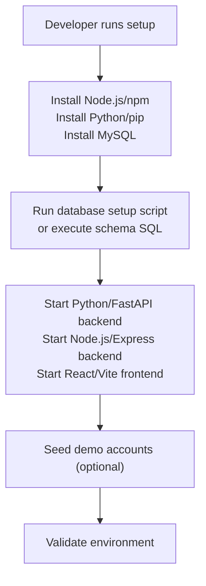
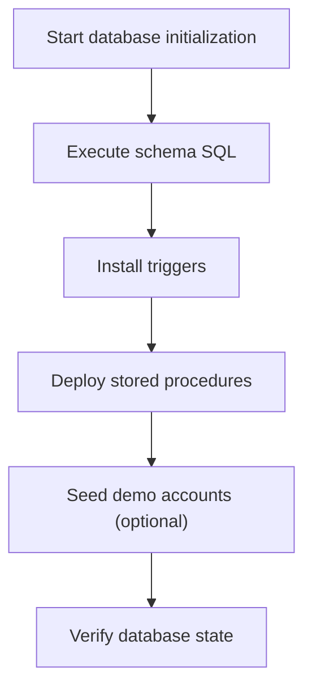
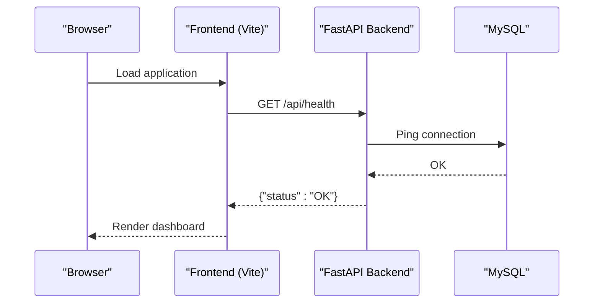

# Environment Setup

<cite>
**Referenced Files in This Document**
- [backend/package.json](file://backend/package.json)
- [frontend/package.json](file://frontend/package.json)
- [server/requirements.txt](file://server/requirements.txt)
- [SETUP_GUIDE.md](file://SETUP_GUIDE.md)
- [scripts/setup_db.bat](file://scripts/setup_db.bat)
- [scripts/setup_demo_environment.bat](file://scripts/setup_demo_environment.bat)
- [scripts/install_triggers.bat](file://scripts/install_triggers.bat)
- [scripts/deploy_stored_procedure.bat](file://scripts/deploy_stored_procedure.bat)
- [scripts/check_account.py](file://scripts/check_account.py)
- [scripts/check_police_officers.py](file://scripts/check_police_officers.py)
- [backend/db.js](file://backend/db.js)
- [backend/server.js](file://backend/server.js)
- [frontend/src/config.js](file://frontend/src/config.js)
- [server/main.py](file://server/main.py)
- [server/database.py](file://server/database.py)
- [server/init_db.py](file://server/init_db.py)
- [db/schema.sql](file://db/schema.sql)
</cite>

## Table of Contents
1. [Introduction](#introduction)
2. [Prerequisites and Dependencies](#prerequisites-and-dependencies)
3. [Development Environment Setup](#development-environment-setup)
4. [Production Environment Setup](#production-environment-setup)
5. [Environment Variables](#environment-variables)
6. [System Resource Requirements](#system-resource-requirements)
7. [Database Initialization](#database-initialization)
8. [Network Configuration](#network-configuration)
9. [Validation Procedures](#validation-procedures)
10. [Troubleshooting Guide](#troubleshooting-guide)
11. [Conclusion](#conclusion)

## Introduction
This document provides end-to-end environment setup instructions for the Traffic Violation Management System. It covers prerequisites, installation steps for development and production, environment configuration, resource requirements, database initialization, network configuration, validation, and troubleshooting.

## Prerequisites and Dependencies
- Node.js runtime and npm for the Express backend and React frontend.
- Python 3.x and pip for the FastAPI backend.
- MySQL 8.0+ server with command-line client available in PATH.
- OpenCV DNN models for facial recognition features (downloaded separately as per the Windows setup script).
- Git (recommended) for cloning and version control.

Notes:
- The backend uses Node.js with Express and the frontend uses React/Vite.
- The primary backend API is implemented in Python/FastAPI with uvicorn.
- The repository includes Windows batch scripts to automate database setup and feature deployment.

**Section sources**
- [SETUP_GUIDE.md:18-38](file://SETUP_GUIDE.md#L18-L38)
- [scripts/setup_db.bat:10-20](file://scripts/setup_db.bat#L10-L20)
- [backend/package.json:10-20](file://backend/package.json#L10-L20)
- [frontend/package.json:11-28](file://frontend/package.json#L11-L28)
- [server/requirements.txt:1-12](file://server/requirements.txt#L1-L12)

## Development Environment Setup
Follow these steps to set up the development environment:

1. Install Node.js and npm.
2. Install Python 3.x and pip.
3. Install MySQL 8.0+ and ensure the MySQL command-line client is available in PATH.
4. Clone or extract the repository to your local machine.
5. Install backend dependencies:
   - Backend (Node.js/Express): navigate to the backend directory and run the appropriate install command.
   - Frontend (React/Vite): navigate to the frontend directory and run the appropriate install command.
   - Backend (Python/FastAPI): navigate to the server directory and install Python dependencies using pip.
6. Prepare the database:
   - Run the Windows database setup script to initialize schema, triggers, and stored procedures.
   - Alternatively, manually execute the schema SQL and related scripts.
7. Start the backend servers:
   - Start the Python/FastAPI server on port 5000.
   - Start the Node.js/Express server on port 5000 (ensure ports do not conflict).
   - Start the React/Vite frontend on port 5173.
8. Seed demo data (optional):
   - Use the demo environment setup script to generate password hashes and seed demo accounts.

**Section sources**
- [SETUP_GUIDE.md:18-38](file://SETUP_GUIDE.md#L18-L38)
- [scripts/setup_db.bat:30-61](file://scripts/setup_db.bat#L30-L61)
- [scripts/setup_demo_environment.bat:14-76](file://scripts/setup_demo_environment.bat#L14-L76)
- [server/main.py:105-107](file://server/main.py#L105-L107)
- [backend/server.js:39-41](file://backend/server.js#L39-L41)

## Production Environment Setup
For production, follow these steps:

1. Provision a Linux/Windows server with sufficient CPU, memory, and disk space.
2. Install Node.js, Python 3.x, and MySQL 8.0+.
3. Secure MySQL with a strong root password and configure firewall rules.
4. Deploy the database schema, triggers, and stored procedures using the provided scripts.
5. Configure environment variables for database connectivity and security.
6. Set up reverse proxy/load balancer if serving multiple instances.
7. Monitor logs and configure alerts for database and application health.
8. Back up the database regularly and test restore procedures.

[No sources needed since this section provides general guidance]

## Environment Variables
Configure the following environment variables for secure and flexible operation:

- Database connectivity (Node.js/Express backend):
  - DB_HOST: MySQL host (default localhost)
  - DB_USER: MySQL user (default root)
  - DB_PASSWORD: MySQL password (default empty)
  - DB_NAME: Database name (default traffic_violation)

- Frontend API base URL:
  - VITE_API_URL: Base URL for the FastAPI backend (default http://localhost:5000)

- Backend (Python/FastAPI) database pool:
  - The Python backend currently hardcodes database connection parameters. To enable environment-driven configuration, modify the database configuration module to read from environment variables.

Notes:
- The Node.js backend reads database credentials from environment variables.
- The React frontend reads the API base URL from VITE_API_URL.
- The Python backend initializes a connection pool with hardcoded values; consider updating it to support environment variables for production deployments.

**Section sources**
- [backend/db.js:3-13](file://backend/db.js#L3-L13)
- [frontend/src/config.js:1-3](file://frontend/src/config.js#L1-L3)
- [server/database.py:22-35](file://server/database.py#L22-L35)

## System Resource Requirements
- Minimum recommended:
  - CPU: Quad-core 2.5 GHz
  - Memory: 8 GB RAM
  - Storage: 50 GB free disk space (schema, logs, evidence uploads)
- Recommended for moderate load:
  - CPU: Hexa-core 3.0 GHz
  - Memory: 16 GB RAM
  - Storage: 100 GB free disk space
- Additional considerations:
  - Evidence upload storage grows with usage.
  - Database performance improves with SSD storage and adequate buffer pool size.

[No sources needed since this section provides general guidance]

## Database Initialization
Initialize the database using either the automated Windows batch scripts or manual SQL execution:

1. Schema creation:
   - Execute the schema SQL to create the database and all core tables, views, and indices.
   - The schema defines normalized tables for citizens, police officers, vehicles, violation rules, reports, evidence photos, violation events, and challans.

2. Triggers installation:
   - Install auto-trust scoring triggers that adjust citizen trust scores based on police verification actions.

3. Stored procedure deployment:
   - Deploy the ACID-compliant stored procedure for processing reports and issuing challans.

4. Optional enhancements:
   - Apply additional enhancements and reports-related improvements as defined in supporting SQL scripts.

**Diagram sources**
- [db/schema.sql:10-200](file://db/schema.sql#L10-L200)
- [scripts/install_triggers.bat:14-41](file://scripts/install_triggers.bat#L14-L41)
- [scripts/deploy_stored_procedure.bat:12-31](file://scripts/deploy_stored_procedure.bat#L12-L31)
- [scripts/setup_demo_environment.bat:28-76](file://scripts/setup_demo_environment.bat#L28-L76)

**Section sources**
- [db/schema.sql:10-200](file://db/schema.sql#L10-L200)
- [scripts/setup_db.bat:30-61](file://scripts/setup_db.bat#L30-L61)
- [scripts/install_triggers.bat:14-41](file://scripts/install_triggers.bat#L14-L41)
- [scripts/deploy_stored_procedure.bat:12-31](file://scripts/deploy_stored_procedure.bat#L12-L31)
- [scripts/setup_demo_environment.bat:28-76](file://scripts/setup_demo_environment.bat#L28-L76)

## Network Configuration
- Ports:
  - Python/FastAPI backend: default 5000 (change via startup parameters).
  - Node.js/Express backend: default 5000 (ensure no port conflict).
  - React/Vite frontend: default 5173.
- Firewall:
  - Allow inbound traffic on the backend ports from trusted networks.
  - Restrict MySQL port (default 3306) to internal network or jump hosts.
- Reverse proxy:
  - Use Nginx/Apache to terminate TLS and forward requests to backend services.
- CORS:
  - The Python backend allows all origins; restrict origins in production.

**Section sources**
- [server/main.py:60-66](file://server/main.py#L60-L66)
- [SETUP_GUIDE.md:30-32](file://SETUP_GUIDE.md#L30-L32)
- [backend/server.js:11](file://backend/server.js#L11)

## Validation Procedures
Perform these checks to verify successful environment configuration:

- Backend health:
  - Call the health endpoints for both Node.js/Express and Python/FastAPI backends.
- Database connectivity:
  - Confirm the Node.js backend connects to MySQL using environment variables.
  - Use diagnostic scripts to verify accounts and police officers exist.
- Frontend integration:
  - Ensure the frontend reads VITE_API_URL and communicates with the backend.
- Feature validation:
  - Verify analytics endpoints, reports CRUD, and trust score updates after police verification.
- Uploads:
  - Confirm evidence upload directory exists and is writable.

**Diagram sources**
- [SETUP_GUIDE.md:89-95](file://SETUP_GUIDE.md#L89-L95)
- [frontend/src/config.js:1-3](file://frontend/src/config.js#L1-L3)
- [server/main.py:89-95](file://server/main.py#L89-L95)

**Section sources**
- [SETUP_GUIDE.md:89-95](file://SETUP_GUIDE.md#L89-L95)
- [scripts/check_account.py:20-60](file://scripts/check_account.py#L20-L60)
- [scripts/check_police_officers.py:16-48](file://scripts/check_police_officers.py#L16-L48)
- [backend/db.js:15-23](file://backend/db.js#L15-L23)

## Troubleshooting Guide
Common issues and resolutions:

- MySQL not found in PATH:
  - Add MySQL bin directory to PATH or run scripts from MySQL CLI/Workbench.
- Database setup fails:
  - Verify MySQL service is running and credentials are correct.
  - Ensure the target database exists or run the schema script.
- Port conflicts:
  - Change backend port in startup commands to avoid conflicts.
- CORS errors:
  - Adjust CORS middleware origins in the Python backend for production.
- Analytics shows zero data:
  - Create test reports via the frontend and refresh the analytics page.
- Charts not rendering:
  - Confirm Recharts is installed and restart the frontend dev server.
- Database connection failures:
  - Validate environment variables for DB_HOST, DB_USER, DB_PASSWORD, DB_NAME.
- Facial recognition models missing:
  - Download and place OpenCV DNN models as instructed by the setup script.

**Section sources**
- [scripts/setup_db.bat:10-20](file://scripts/setup_db.bat#L10-L20)
- [SETUP_GUIDE.md:158-178](file://SETUP_GUIDE.md#L158-L178)
- [SETUP_GUIDE.md:169-172](file://SETUP_GUIDE.md#L169-L172)
- [SETUP_GUIDE.md:174-177](file://SETUP_GUIDE.md#L174-L177)

## Conclusion
By following this guide, you can successfully set up the Traffic Violation Management System in development or production. Ensure prerequisites are met, database is initialized, environment variables are configured, and network/firewall rules are in place. Validate the environment using the provided endpoints and scripts, and refer to the troubleshooting section for common issues.