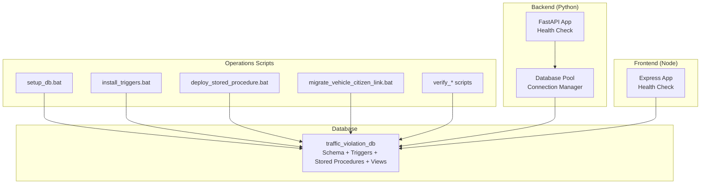
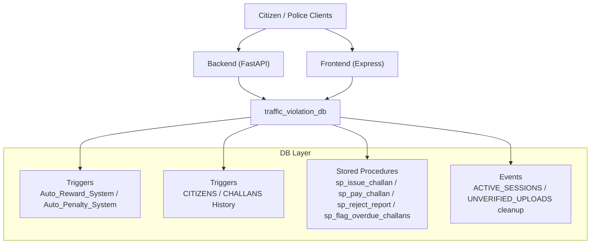
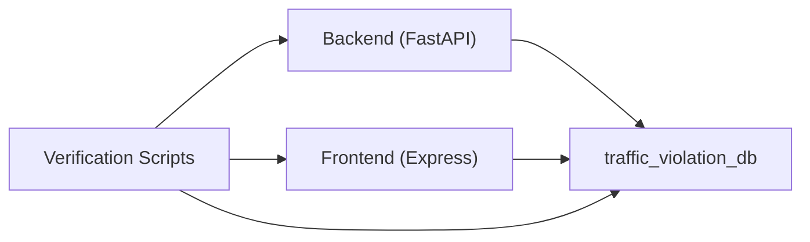

# Maintenance and Updates

<cite>
**Referenced Files in This Document**
- [schema.sql](file://db/schema.sql)
- [database_triggers.sql](file://db/database_triggers.sql)
- [stored_procedure_process_report.sql](file://db/stored_procedure_process_report.sql)
- [reports_enhancement.sql](file://db/reports_enhancement.sql)
- [add_vehicle_citizen_link.sql](file://db/add_vehicle_citizen_link.sql)
- [setup_db.bat](file://scripts/setup_db.bat)
- [install_triggers.bat](file://scripts/install_triggers.bat)
- [deploy_stored_procedure.bat](file://scripts/deploy_stored_procedure.bat)
- [migrate_vehicle_citizen_link.bat](file://scripts/migrate_vehicle_citizen_link.bat)
- [setup_demo_environment.bat](file://scripts/setup_demo_environment.bat)
- [verify_database_persistence.py](file://scripts/verify_database_persistence.py)
- [verify_complete_system.py](file://scripts/verify_complete_system.py)
- [check_account.py](file://scripts/check_account.py)
- [test_profile_api.py](file://scripts/test_profile_api.py)
- [main.py](file://server/main.py)
- [database.py](file://server/database.py)
- [server.js](file://backend/server.js)
</cite>

## Table of Contents
1. [Introduction](#introduction)
2. [Project Structure](#project-structure)
3. [Core Components](#core-components)
4. [Architecture Overview](#architecture-overview)
5. [Detailed Component Analysis](#detailed-component-analysis)
6. [Dependency Analysis](#dependency-analysis)
7. [Performance Considerations](#performance-considerations)
8. [Troubleshooting Guide](#troubleshooting-guide)
9. [Conclusion](#conclusion)
10. [Appendices](#appendices)

## Introduction
This document provides comprehensive maintenance and update procedures for the Traffic Violation Management System. It covers database maintenance (triggers, stored procedures, schema enhancements), application update workflows (zero-downtime strategies and rollbacks), routine maintenance (optimization, log cleanup, health checks), backup and restore procedures, update scheduling and change management, testing protocols, performance tuning, capacity planning, troubleshooting, and monitoring/validation during and after maintenance.

## Project Structure
The system comprises:
- Database layer with normalized schema, triggers, stored procedures, views, and transient tables
- Backend service (Python FastAPI) with database connection pooling and health endpoints
- Frontend service (Node/Express) with health checks and routing
- Windows batch scripts for setup, trigger deployment, stored procedure deployment, and migrations
- Python verification and diagnostic scripts for persistence, trust score, and system completeness

**Diagram sources**
- [schema.sql:1-942](file://db/schema.sql#L1-L942)
- [database_triggers.sql:1-48](file://db/database_triggers.sql#L1-L48)
- [stored_procedure_process_report.sql:1-115](file://db/stored_procedure_process_report.sql#L1-L115)
- [main.py:1-107](file://server/main.py#L1-L107)
- [database.py:1-76](file://server/database.py#L1-L76)
- [server.js:1-42](file://backend/server.js#L1-L42)
- [setup_db.bat:1-64](file://scripts/setup_db.bat#L1-L64)
- [install_triggers.bat:1-55](file://scripts/install_triggers.bat#L1-L55)
- [deploy_stored_procedure.bat:1-44](file://scripts/deploy_stored_procedure.bat#L1-L44)
- [migrate_vehicle_citizen_link.bat:1-54](file://scripts/migrate_vehicle_citizen_link.bat#L1-L54)
- [verify_database_persistence.py:1-165](file://scripts/verify_database_persistence.py#L1-L165)
- [verify_complete_system.py:1-260](file://scripts/verify_complete_system.py#L1-L260)

**Section sources**
- [schema.sql:1-942](file://db/schema.sql#L1-L942)
- [main.py:1-107](file://server/main.py#L1-L107)
- [database.py:1-76](file://server/database.py#L1-L76)
- [server.js:1-42](file://backend/server.js#L1-L42)
- [setup_db.bat:1-64](file://scripts/setup_db.bat#L1-L64)

## Core Components
- Database schema defines core entities, temporal history tables, transient tables, events, triggers, stored procedures, and views.
- Triggers enforce automatic trust score updates and temporal versioning.
- Stored procedures encapsulate ACID-compliant workflows for report processing and challan issuance.
- Verification scripts confirm persistence, integrity, and system completeness.
- Backend services expose health endpoints and manage database connections.

**Section sources**
- [schema.sql:1-942](file://db/schema.sql#L1-L942)
- [database_triggers.sql:1-48](file://db/database_triggers.sql#L1-L48)
- [stored_procedure_process_report.sql:1-115](file://db/stored_procedure_process_report.sql#L1-L115)
- [verify_database_persistence.py:1-165](file://scripts/verify_database_persistence.py#L1-L165)
- [verify_complete_system.py:1-260](file://scripts/verify_complete_system.py#L1-L260)
- [main.py:1-107](file://server/main.py#L1-L107)
- [database.py:1-76](file://server/database.py#L1-L76)

## Architecture Overview
The system follows a tier-1 DBMS design with:
- Government-grade normalization, temporal versioning, and audit trails
- Event-driven cleanup of transient data
- Triggers for real-time trust scoring and temporal history
- Stored procedures for safe, ACID-compliant operations
- Health-checked backend and frontend services

**Diagram sources**
- [schema.sql:277-300](file://db/schema.sql#L277-L300)
- [schema.sql:307-429](file://db/schema.sql#L307-L429)
- [schema.sql:440-754](file://db/schema.sql#L440-L754)
- [database_triggers.sql:8-35](file://db/database_triggers.sql#L8-L35)
- [main.py:88-95](file://server/main.py#L88-L95)
- [server.js:17-20](file://backend/server.js#L17-L20)

## Detailed Component Analysis

### Database Schema Maintenance
- Schema initialization and integrity: use the schema SQL to recreate and validate the database structure.
- Indexes and constraints: ensure newly added columns receive appropriate indexes.
- Temporal tables: maintain valid_from/valid_to semantics for auditability.

Recommended maintenance steps:
- After schema changes, verify:
  - New indexes exist and are used by queries
  - Foreign keys remain intact
  - Events and triggers still function as expected

**Section sources**
- [schema.sql:1-942](file://db/schema.sql#L1-L942)

### Trigger Updates and Validation
- Auto trust score triggers:
  - Verified via INFORMATION_SCHEMA triggers inspection
  - Behavior: +10 trust on verified, -10 trust on rejected (minimum 0)
- Temporal triggers:
  - CITIZENS and CHALLANS history triggers capture updates and enforce temporal boundaries

Maintenance workflow:
- Apply trigger SQL via batch script
- Confirm trigger presence and behavior using verification scripts
- Monitor trust score changes post-police actions

**Section sources**
- [database_triggers.sql:1-48](file://db/database_triggers.sql#L1-L48)
- [schema.sql:307-429](file://db/schema.sql#L307-L429)
- [install_triggers.bat:1-55](file://scripts/install_triggers.bat#L1-L55)
- [verify_complete_system.py:58-75](file://scripts/verify_complete_system.py#L58-L75)

### Stored Procedure Migrations
- ACID-compliant procedures:
  - sp_issue_challan: end-to-end challan issuance with rollback on errors
  - sp_pay_challan: locked payment processing
  - sp_reject_report: controlled report rejection
  - sp_flag_overdue_challans: batch overdue processing with penalties
- Deployment:
  - Use the dedicated deployment batch script to apply the procedure

Maintenance workflow:
- Backup current procedure definition
- Apply new procedure SQL via batch script
- Validate procedure existence and behavior
- Roll back if failures occur

**Section sources**
- [stored_procedure_process_report.sql:1-115](file://db/stored_procedure_process_report.sql#L1-L115)
- [deploy_stored_procedure.bat:1-44](file://scripts/deploy_stored_procedure.bat#L1-L44)

### Schema Enhancements and Migrations
- Reports enhancement:
  - Adds violation_type, latitude/longitude, fine_amount, and extended status enum
  - Includes realistic mock data for Chennai-based scenarios
- Vehicle-citizen linkage:
  - Adds citizen_id to VEHICLES with foreign key to CITIZENS
  - Enables challan routing to vehicle owners

Maintenance workflow:
- Run migration batch script
- Verify column addition and foreign key constraints
- Restart backend to reflect schema changes
- Validate end-to-end challan creation flow

**Section sources**
- [reports_enhancement.sql:1-302](file://db/reports_enhancement.sql#L1-L302)
- [add_vehicle_citizen_link.sql:1-38](file://db/add_vehicle_citizen_link.sql#L1-L38)
- [migrate_vehicle_citizen_link.bat:1-54](file://scripts/migrate_vehicle_citizen_link.bat#L1-L54)

### Application Update Workflows
- Backend (FastAPI):
  - Health endpoint available for readiness/liveness checks
  - Connection pooling for DB reliability
- Frontend (Express):
  - Health endpoint for basic service status
- Zero-downtime strategies:
  - Rolling restarts with health probes
  - Blue/green deployments (recommended for production)
- Rollback procedures:
  - Revert to previous container/image/tag
  - Restore database from last known-good backup

**Section sources**
- [main.py:88-95](file://server/main.py#L88-L95)
- [database.py:14-50](file://server/database.py#L14-L50)
- [server.js:17-20](file://backend/server.js#L17-L20)

### Routine Maintenance Tasks
- Database optimization:
  - Analyze slow queries and add missing indexes
  - Regularly optimize tables and update statistics
- Log cleanup:
  - Purge old logs from application servers
  - Archive or rotate logs per retention policy
- System health checks:
  - Use /api/health endpoints for automated checks
  - Monitor database event execution and trigger activity

**Section sources**
- [schema.sql:277-300](file://db/schema.sql#L277-L300)
- [main.py:88-95](file://server/main.py#L88-L95)
- [server.js:17-20](file://backend/server.js#L17-L20)

### Backup and Restore Procedures
- Database backup:
  - Use logical backup (mysqldump) for schema and data
  - Validate backups regularly and test restores
- Application data backup:
  - Back up evidence uploads directory
  - Version control sensitive configuration files
- Restore process:
  - Stop services
  - Restore database and file system artifacts
  - Restart services and run verification scripts

[No sources needed since this section provides general guidance]

### Update Scheduling and Change Management
- Planning:
  - Define change windows with stakeholders
  - Document schema and procedure changes
- Testing:
  - Run verification scripts before applying changes
  - Validate triggers, stored procedures, and views
- Deployment:
  - Apply changes in staging first
  - Promote to production with rollback plan
- Post-deployment:
  - Monitor health endpoints and logs
  - Validate end-to-end flows

**Section sources**
- [verify_database_persistence.py:1-165](file://scripts/verify_database_persistence.py#L1-L165)
- [verify_complete_system.py:1-260](file://scripts/verify_complete_system.py#L1-L260)

### Testing Protocols for Production Updates
- Pre-update:
  - Run setup and verification scripts
  - Confirm triggers and stored procedures
- During update:
  - Health checks every 30 seconds
  - Monitor DB event execution
- Post-update:
  - End-to-end tests for report and challan flows
  - Trust score verification after police actions

**Section sources**
- [verify_complete_system.py:1-260](file://scripts/verify_complete_system.py#L1-L260)
- [test_profile_api.py:1-49](file://scripts/test_profile_api.py#L1-L49)

### Performance Tuning and Capacity Planning
- Database tuning:
  - Add indexes for new columns (violation_type, location coordinates)
  - Monitor trigger overhead and optimize if needed
- Application tuning:
  - Adjust FastAPI/Uvicorn worker/process counts
  - Scale horizontally with load balancer
- Capacity planning:
  - Track growth in REPORTS, CHALLANS, and evidence uploads
  - Plan storage and compute increases accordingly

**Section sources**
- [reports_enhancement.sql:43-47](file://db/reports_enhancement.sql#L43-L47)
- [main.py:105-107](file://server/main.py#L105-L107)

### Troubleshooting Guides
- Database connectivity:
  - Use verification scripts to confirm connection and credentials
- Account issues:
  - Use diagnostic script to check account existence and password hash
- Trust score anomalies:
  - Confirm triggers are installed and active
- Stored procedure failures:
  - Check for rollback messages and error codes
- Evidence uploads:
  - Verify uploads directory permissions and disk space

**Section sources**
- [verify_database_persistence.py:1-165](file://scripts/verify_database_persistence.py#L1-L165)
- [check_account.py:1-132](file://scripts/check_account.py#L1-L132)
- [verify_complete_system.py:58-75](file://scripts/verify_complete_system.py#L58-L75)

### Emergency Repair Procedures
- Immediate actions:
  - Stop faulty deployment
  - Rollback to last known-good database and application images
- Recovery steps:
  - Restore database from backup
  - Reapply only validated changes incrementally
  - Restart services and re-run verification scripts
- Communication:
  - Notify stakeholders and document incident timeline

[No sources needed since this section provides general guidance]

### Monitoring During Maintenance and Post-Update Validation
- Real-time monitoring:
  - Health endpoints for backend and frontend
  - Database event execution logs
- Post-update validation:
  - Run verification scripts
  - Manual smoke tests for critical flows (report submission, challan issuance, payment)

**Section sources**
- [main.py:88-95](file://server/main.py#L88-L95)
- [server.js:17-20](file://backend/server.js#L17-L20)
- [verify_complete_system.py:1-260](file://scripts/verify_complete_system.py#L1-L260)

## Dependency Analysis
The backend depends on the database for all operations. Triggers and stored procedures encapsulate business logic, reducing application-level complexity. Verification scripts depend on database availability and credentials.

**Diagram sources**
- [main.py:1-107](file://server/main.py#L1-L107)
- [server.js:1-42](file://backend/server.js#L1-L42)
- [verify_database_persistence.py:1-165](file://scripts/verify_database_persistence.py#L1-L165)

**Section sources**
- [main.py:1-107](file://server/main.py#L1-L107)
- [server.js:1-42](file://backend/server.js#L1-L42)
- [verify_database_persistence.py:1-165](file://scripts/verify_database_persistence.py#L1-L165)

## Performance Considerations
- Index coverage for new columns (violation_type, latitude/longitude, fine_amount)
- Event scheduling frequency for transient cleanup
- Stored procedure transaction sizes and locking strategies
- Connection pool sizing and timeouts

**Section sources**
- [reports_enhancement.sql:43-47](file://db/reports_enhancement.sql#L43-L47)
- [schema.sql:277-300](file://db/schema.sql#L277-L300)
- [database.py:22-35](file://server/database.py#L22-L35)

## Troubleshooting Guide
Common issues and resolutions:
- Database not reachable:
  - Verify MySQL service status and network connectivity
  - Confirm credentials and database name
- Triggers not firing:
  - Check trigger existence and timing
  - Validate CITIZENS trust score updates after police actions
- Stored procedure errors:
  - Review error codes and rollback messages
  - Re-run deployment script if needed
- Upload failures:
  - Check uploads directory permissions and disk space

**Section sources**
- [verify_database_persistence.py:1-165](file://scripts/verify_database_persistence.py#L1-L165)
- [verify_complete_system.py:58-75](file://scripts/verify_complete_system.py#L58-L75)
- [check_account.py:1-132](file://scripts/check_account.py#L1-L132)

## Conclusion
This guide consolidates database and application maintenance procedures for the Traffic Violation Management System. By following structured workflows for schema changes, trigger updates, stored procedure migrations, and application updates—combined with robust verification, monitoring, and rollback strategies—you can maintain system reliability, performance, and continuity.

## Appendices
- Quick verification checklist:
  - Database connectivity and schema integrity
  - Triggers and stored procedures present and functional
  - Health endpoints responsive
  - End-to-end report and challan flows validated

[No sources needed since this section provides general guidance]