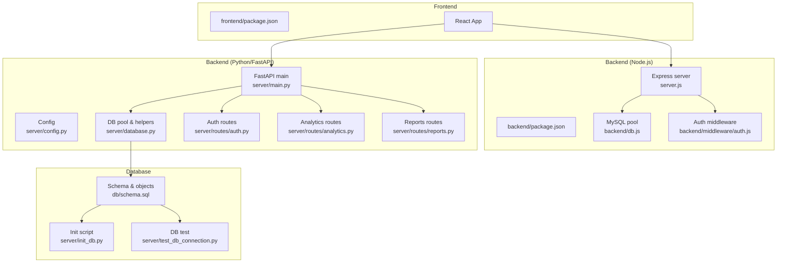
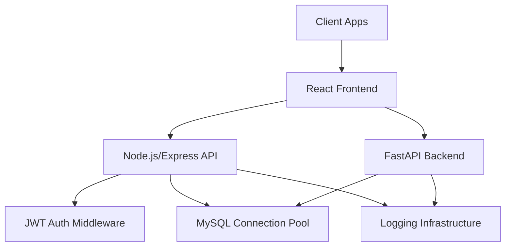
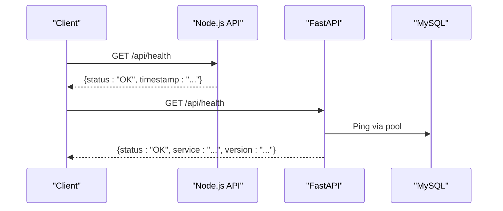
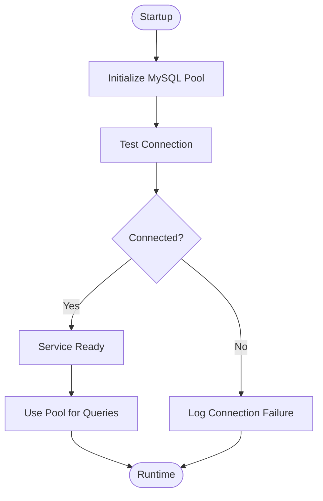
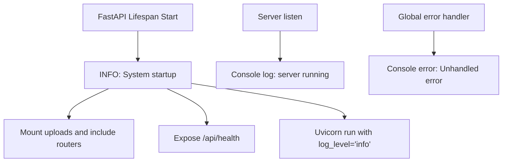
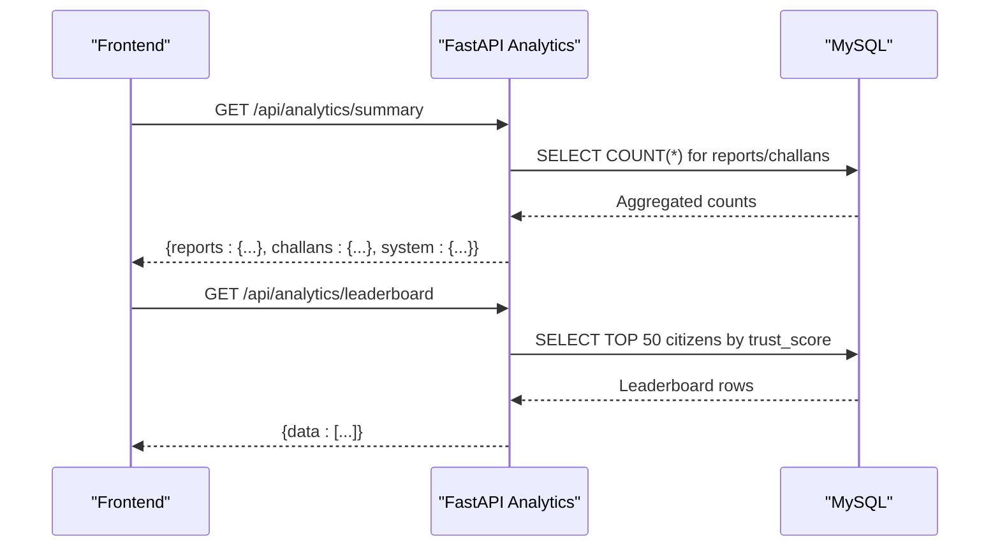
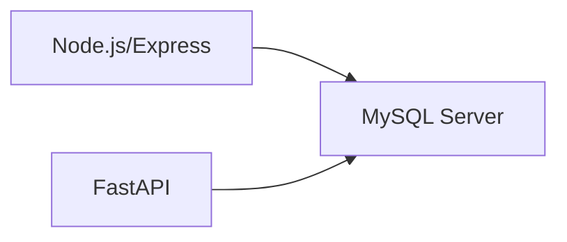

# Monitoring and Logging

<cite>
**Referenced Files in This Document**
- [backend/package.json](file://backend/package.json)
- [backend/server.js](file://backend/server.js)
- [backend/db.js](file://backend/db.js)
- [backend/middleware/auth.js](file://backend/middleware/auth.js)
- [frontend/package.json](file://frontend/package.json)
- [server/main.py](file://server/main.py)
- [server/config.py](file://server/config.py)
- [server/database.py](file://server/database.py)
- [server/routes/analytics.py](file://server/routes/analytics.py)
- [server/routes/auth.py](file://server/routes/auth.py)
- [server/routes/reports.py](file://server/routes/reports.py)
- [server/init_db.py](file://server/init_db.py)
- [server/check_db.py](file://server/check_db.py)
- [server/test_db_connection.py](file://server/test_db_connection.py)
- [db/schema.sql](file://db/schema.sql)
</cite>

## Table of Contents
1. [Introduction](#introduction)
2. [Project Structure](#project-structure)
3. [Core Components](#core-components)
4. [Architecture Overview](#architecture-overview)
5. [Detailed Component Analysis](#detailed-component-analysis)
6. [Dependency Analysis](#dependency-analysis)
7. [Performance Considerations](#performance-considerations)
8. [Troubleshooting Guide](#troubleshooting-guide)
9. [Conclusion](#conclusion)
10. [Appendices](#appendices)

## Introduction
This document provides comprehensive monitoring and logging guidance for the Traffic Violation Management System (TVMS). It covers system health monitoring (database connectivity, API response times, resource utilization), logging configuration for backend and frontend, real-time dashboards for performance and user activity, alerting strategies for critical failures and security incidents, performance monitoring (query optimization, rate limiting, memory usage), log aggregation and analysis tools, compliance reporting, and troubleshooting workflows using monitoring and logs.

## Project Structure
The TVMS consists of:
- Backend API (Node.js/Express) exposing health checks and routes
- Python/FastAPI backend with database connectivity, authentication, analytics, and report management
- Frontend built with React/Vite
- MySQL database with production-grade schema, triggers, stored procedures, and views
- Scripts for database setup, testing, and verification

**Diagram sources**
- [backend/package.json:1-22](file://backend/package.json#L1-L22)
- [backend/server.js:1-42](file://backend/server.js#L1-L42)
- [backend/db.js:1-26](file://backend/db.js#L1-L26)
- [backend/middleware/auth.js:1-37](file://backend/middleware/auth.js#L1-L37)
- [frontend/package.json:1-30](file://frontend/package.json#L1-L30)
- [server/main.py:1-107](file://server/main.py#L1-L107)
- [server/config.py:1-41](file://server/config.py#L1-L41)
- [server/database.py:1-76](file://server/database.py#L1-L76)
- [server/routes/auth.py:1-744](file://server/routes/auth.py#L1-L744)
- [server/routes/analytics.py:1-526](file://server/routes/analytics.py#L1-L526)
- [server/routes/reports.py:1-563](file://server/routes/reports.py#L1-L563)
- [db/schema.sql:1-942](file://db/schema.sql#L1-L942)
- [server/init_db.py:1-181](file://server/init_db.py#L1-L181)
- [server/test_db_connection.py:1-34](file://server/test_db_connection.py#L1-L34)

**Section sources**
- [backend/package.json:1-22](file://backend/package.json#L1-L22)
- [backend/server.js:1-42](file://backend/server.js#L1-L42)
- [backend/db.js:1-26](file://backend/db.js#L1-L26)
- [backend/middleware/auth.js:1-37](file://backend/middleware/auth.js#L1-L37)
- [frontend/package.json:1-30](file://frontend/package.json#L1-L30)
- [server/main.py:1-107](file://server/main.py#L1-L107)
- [server/config.py:1-41](file://server/config.py#L1-L41)
- [server/database.py:1-76](file://server/database.py#L1-L76)
- [server/routes/auth.py:1-744](file://server/routes/auth.py#L1-L744)
- [server/routes/analytics.py:1-526](file://server/routes/analytics.py#L1-L526)
- [server/routes/reports.py:1-563](file://server/routes/reports.py#L1-L563)
- [db/schema.sql:1-942](file://db/schema.sql#L1-L942)
- [server/init_db.py:1-181](file://server/init_db.py#L1-L181)
- [server/test_db_connection.py:1-34](file://server/test_db_connection.py#L1-L34)

## Core Components
- Health endpoints
  - Node.js backend exposes a GET /api/health returning service status and timestamp.
  - Python/FastAPI backend exposes a GET /api/health returning service status and version.
- Database connectivity
  - Node.js uses mysql2/promise with a connection pool and startup connection test.
  - Python/FastAPI uses mysql-connector with a connection pool and centralized get_connection/get_cursor helpers.
- Logging
  - Python/FastAPI uses logging.basicConfig with INFO level and structured format.
  - Node.js logs startup and unhandled errors to console.
- Authentication middleware
  - Node.js JWT-based middleware validates tokens and enforces roles.

**Section sources**
- [backend/server.js:17-20](file://backend/server.js#L17-L20)
- [server/main.py:88-95](file://server/main.py#L88-L95)
- [backend/db.js:1-26](file://backend/db.js#L1-L26)
- [server/database.py:14-76](file://server/database.py#L14-L76)
- [server/main.py:28-33](file://server/main.py#L28-L33)
- [backend/server.js:33-37](file://backend/server.js#L33-L37)
- [backend/middleware/auth.js:1-37](file://backend/middleware/auth.js#L1-L37)

## Architecture Overview
The monitoring and logging architecture integrates health checks, database connectivity, and logging across both backend stacks.

**Diagram sources**
- [backend/server.js:1-42](file://backend/server.js#L1-L42)
- [backend/middleware/auth.js:1-37](file://backend/middleware/auth.js#L1-L37)
- [server/main.py:1-107](file://server/main.py#L1-L107)
- [server/database.py:1-76](file://server/database.py#L1-L76)
- [backend/db.js:1-26](file://backend/db.js#L1-L26)

## Detailed Component Analysis

### Health Monitoring
- Node.js health endpoint
  - Endpoint: GET /api/health
  - Returns status and timestamp for basic uptime and readiness checks.
- Python/FastAPI health endpoint
  - Endpoint: GET /api/health
  - Returns status, service name, and version for readiness and deployment verification.

**Diagram sources**
- [backend/server.js:17-20](file://backend/server.js#L17-L20)
- [server/main.py:88-95](file://server/main.py#L88-L95)
- [server/database.py:45-50](file://server/database.py#L45-L50)

**Section sources**
- [backend/server.js:17-20](file://backend/server.js#L17-L20)
- [server/main.py:88-95](file://server/main.py#L88-L95)

### Database Connectivity Monitoring
- Node.js
  - Connection pool configured with limits and keep-alive.
  - Startup connection test logs success or failure.
- Python/FastAPI
  - Centralized pool initialization and context-managed connections/cursors.
  - Structured logging for pool creation and DB errors.

**Diagram sources**
- [backend/db.js:3-23](file://backend/db.js#L3-L23)
- [server/database.py:14-66](file://server/database.py#L14-L66)

**Section sources**
- [backend/db.js:1-26](file://backend/db.js#L1-L26)
- [server/database.py:1-76](file://server/database.py#L1-L76)

### Logging Configuration
- Python/FastAPI
  - Logging configured at INFO level with structured format including timestamp, level, logger name, and message.
  - Logger instances used for application lifecycle and database operations.
- Node.js
  - Console logging for startup and global error handling.
  - No explicit log rotation or structured format configuration detected.

**Diagram sources**
- [server/main.py:28-33](file://server/main.py#L28-L33)
- [server/main.py:35-47](file://server/main.py#L35-L47)
- [server/main.py:105-107](file://server/main.py#L105-L107)
- [backend/server.js:39-41](file://backend/server.js#L39-L41)
- [backend/server.js:33-37](file://backend/server.js#L33-L37)

**Section sources**
- [server/main.py:28-33](file://server/main.py#L28-L33)
- [server/main.py:105-107](file://server/main.py#L105-L107)
- [backend/server.js:33-37](file://backend/server.js#L33-L37)

### Real-Time Dashboards and Metrics
- Analytics endpoints
  - Dashboard summaries, leaderboards, citizen analytics, system analytics, violation-type distributions, recent activity, and status trends.
  - These endpoints aggregate counts and metrics directly from the database, enabling real-time dashboards.
- Evidence uploads
  - Uploads served via mounted static files for real-time access.

**Diagram sources**
- [server/routes/analytics.py:36-125](file://server/routes/analytics.py#L36-L125)
- [server/routes/analytics.py:205-255](file://server/routes/analytics.py#L205-L255)

**Section sources**
- [server/routes/analytics.py:36-125](file://server/routes/analytics.py#L36-L125)
- [server/routes/analytics.py:205-255](file://server/routes/analytics.py#L205-L255)
- [server/main.py:69-72](file://server/main.py#L69-L72)

### Alerting Mechanisms
Recommended alerting targets derived from observed components:
- Critical system failures
  - Node.js global error handler logs unhandled errors; configure external monitoring to capture stderr/stdout and alert on error spikes.
- Database errors
  - Python/FastAPI logs DB errors via logger.error; configure external monitoring to alert on DB error rate and pool exhaustion.
- Security incidents
  - Authentication middleware validates tokens; monitor repeated 401/403 responses and suspicious IP patterns.

Implementation note: The codebase does not include built-in alerting hooks. Integrate with external monitoring systems (see Performance Considerations).

**Section sources**
- [backend/server.js:33-37](file://backend/server.js#L33-L37)
- [server/database.py:59-66](file://server/database.py#L59-L66)
- [backend/middleware/auth.js:1-37](file://backend/middleware/auth.js#L1-L37)

### Performance Monitoring
- Database query optimization
  - Schema includes strategic indexes (e.g., CITIZENS idx_citizen_email, REPORTS idx_report_status).
  - Triggers and stored procedures encapsulate business logic; ensure slow queries are identified via external monitoring and optimize accordingly.
- API rate limiting
  - No built-in rate limiting detected in the provided files. Implement at the gateway or per-route as needed.
- Memory usage tracking
  - Monitor Node.js and Python processes using OS-level metrics; external monitoring can capture RSS and heap metrics.

**Section sources**
- [db/schema.sql:40-42](file://db/schema.sql#L40-L42)
- [db/schema.sql:133-135](file://db/schema.sql#L133-L135)
- [db/schema.sql:363-382](file://db/schema.sql#L363-L382)
- [server/routes/analytics.py:36-125](file://server/routes/analytics.py#L36-L125)

### Log Aggregation and Compliance Reporting
- Log aggregation
  - Python/FastAPI logs use a structured format suitable for ingestion by log collectors (e.g., filebeat/fluent-bit, cloud providers).
  - Node.js logs to stdout/stderr; container orchestration platforms can capture and forward logs.
- Compliance reporting
  - Database schema supports temporal auditing via CITIZENS_HISTORY and CHALLANS_HISTORY; leverage these tables for audit trails and compliance reporting.

**Section sources**
- [server/main.py:28-33](file://server/main.py#L28-L33)
- [db/schema.sql:48-65](file://db/schema.sql#L48-L65)
- [db/schema.sql:198-219](file://db/schema.sql#L198-L219)

## Dependency Analysis
Key runtime dependencies and their roles:
- Node.js
  - Express for routing and middleware
  - mysql2/promise for database connectivity
  - dotenv for environment configuration
- Python/FastAPI
  - FastAPI for routing and lifespan management
  - mysql-connector for database connectivity
  - uvicorn for ASGI server

**Diagram sources**
- [backend/package.json:10-17](file://backend/package.json#L10-L17)
- [server/main.py:5-10](file://server/main.py#L5-L10)
- [server/database.py:4-6](file://server/database.py#L4-L6)

**Section sources**
- [backend/package.json:1-22](file://backend/package.json#L1-L22)
- [server/main.py:1-10](file://server/main.py#L1-L10)
- [server/database.py:1-12](file://server/database.py#L1-L12)

## Performance Considerations
- Database connectivity
  - Use connection pools and context managers to minimize overhead and ensure proper cleanup.
  - Monitor pool utilization and timeouts; adjust pool size based on workload.
- API response times
  - External monitoring can measure latency for health endpoints and analytics endpoints.
  - Optimize analytics queries by leveraging indexes and avoiding N+1 patterns.
- Resource utilization
  - Track CPU, memory, and disk I/O for both Node.js and Python processes.
  - Enable profiling for CPU-bound operations if needed.
- Rate limiting
  - Implement rate limiting at the API gateway or per-route to protect backend resources.
- Storage requirements
  - Evidence uploads are served via mounted static files; ensure adequate disk space and retention policies.

[No sources needed since this section provides general guidance]

## Troubleshooting Guide
- Database connectivity issues
  - Verify database availability and credentials using provided scripts.
  - Check pool initialization logs and DB error logs for failures.
- Authentication failures
  - Inspect JWT middleware behavior and token validity.
- API errors
  - Review global error handlers for unhandled exceptions.
- Log analysis
  - Use structured logs to correlate timestamps, levels, and messages across services.

**Section sources**
- [server/test_db_connection.py:1-34](file://server/test_db_connection.py#L1-L34)
- [server/check_db.py:1-14](file://server/check_db.py#L1-L14)
- [server/database.py:45-66](file://server/database.py#L45-L66)
- [backend/middleware/auth.js:1-37](file://backend/middleware/auth.js#L1-L37)
- [backend/server.js:33-37](file://backend/server.js#L33-L37)
- [server/main.py:28-33](file://server/main.py#L28-L33)

## Conclusion
The TVMS provides foundational health endpoints, database connectivity via pools, and logging infrastructure suitable for integration with external monitoring and alerting systems. To achieve comprehensive observability, augment the existing logging with structured formats, add rate limiting, instrument performance metrics, and integrate log aggregation and alerting pipelines. The database schema’s temporal auditing capabilities support compliance reporting and incident investigations.

[No sources needed since this section summarizes without analyzing specific files]

## Appendices

### Appendix A: Health Endpoints
- Node.js: GET /api/health
- Python/FastAPI: GET /api/health

**Section sources**
- [backend/server.js:17-20](file://backend/server.js#L17-L20)
- [server/main.py:88-95](file://server/main.py#L88-L95)

### Appendix B: Database Setup and Verification
- Initialization script creates schema and tables.
- Connection tests verify database readiness and table presence.

**Section sources**
- [server/init_db.py:1-181](file://server/init_db.py#L1-L181)
- [server/test_db_connection.py:1-34](file://server/test_db_connection.py#L1-L34)