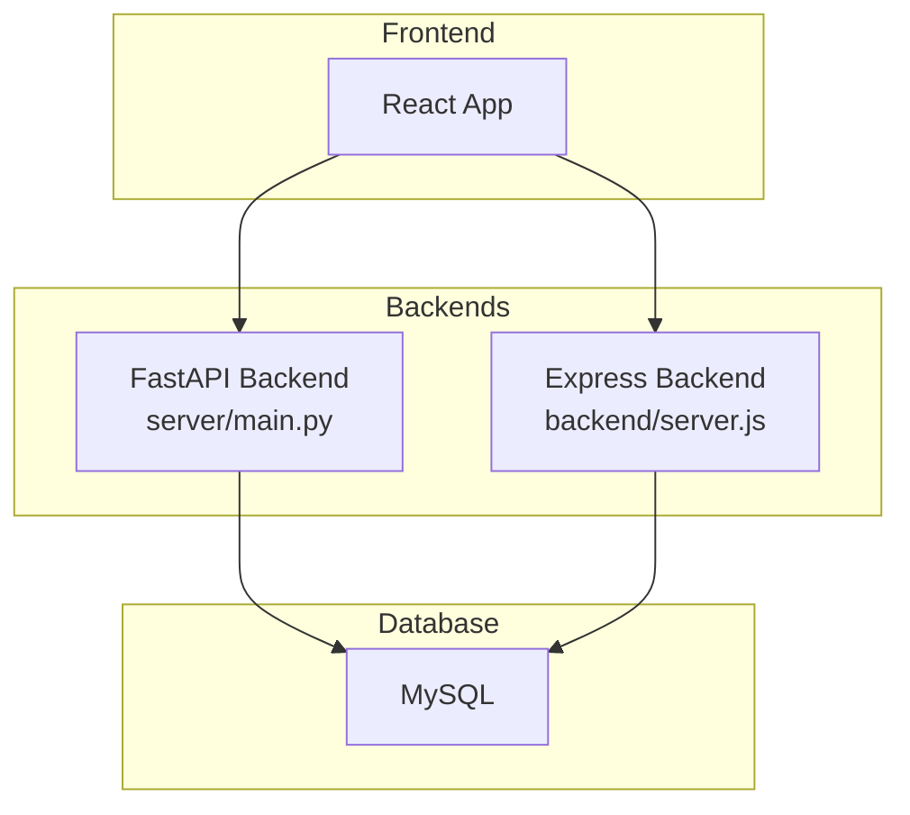
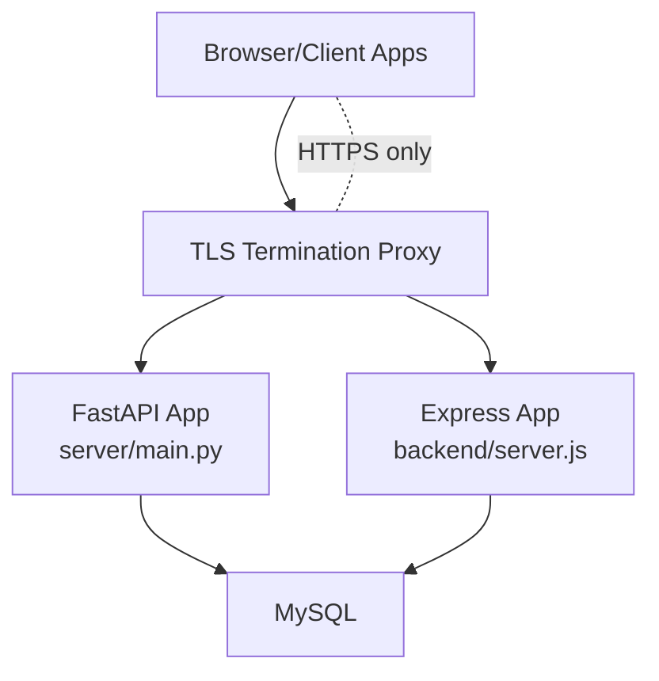
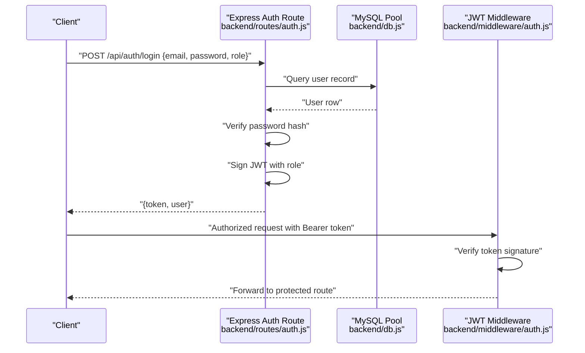
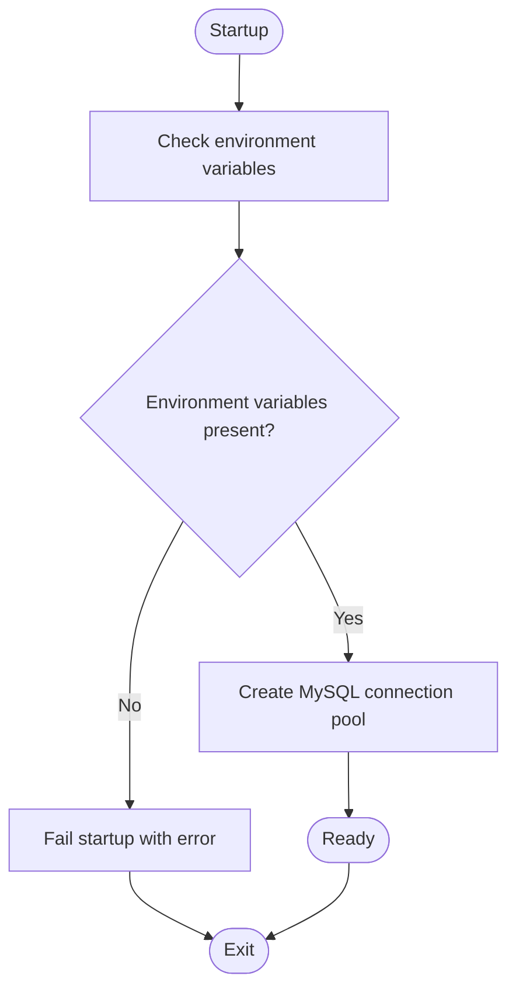
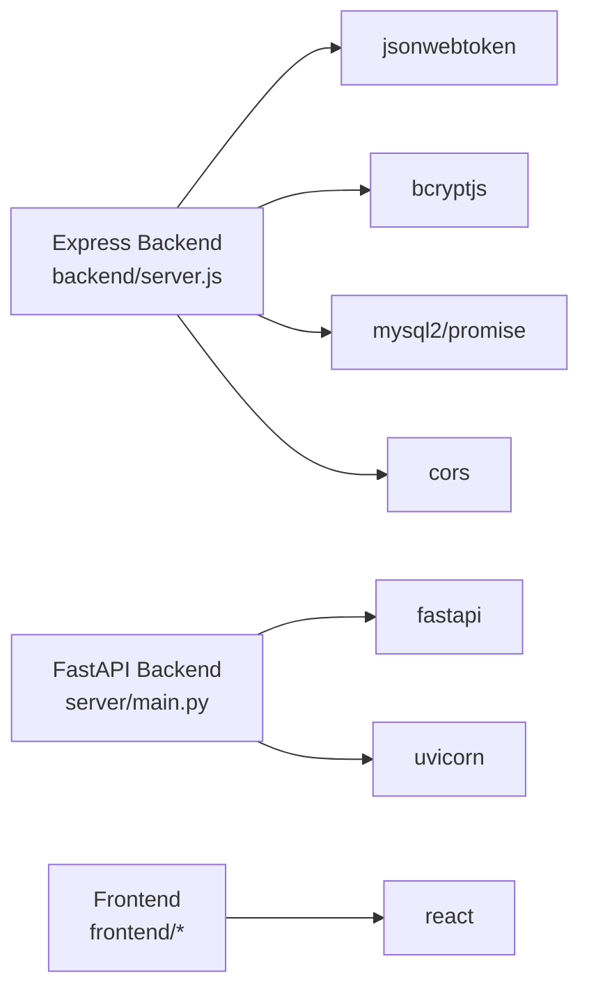

# Security and Production Deployment

<cite>
**Referenced Files in This Document**
- [backend/middleware/auth.js](file://backend/middleware/auth.js)
- [backend/routes/auth.js](file://backend/routes/auth.js)
- [backend/db.js](file://backend/db.js)
- [backend/server.js](file://backend/server.js)
- [server/main.py](file://server/main.py)
- [server/database.py](file://server/database.py)
- [scripts/generate_password_hashes.py](file://scripts/generate_password_hashes.py)
- [scripts/check_account.py](file://scripts/check_account.py)
- [backend/package.json](file://backend/package.json)
- [frontend/package.json](file://frontend/package.json)
</cite>

## Table of Contents
1. [Introduction](#introduction)
2. [Project Structure](#project-structure)
3. [Core Components](#core-components)
4. [Architecture Overview](#architecture-overview)
5. [Detailed Component Analysis](#detailed-component-analysis)
6. [Dependency Analysis](#dependency-analysis)
7. [Performance Considerations](#performance-considerations)
8. [Troubleshooting Guide](#troubleshooting-guide)
9. [Conclusion](#conclusion)
10. [Appendices](#appendices)

## Introduction
This document provides comprehensive security and production deployment guidance for the Traffic Violation Management System. It focuses on secure transport, identity and access controls, database security, audit readiness, and operational resilience. The system comprises a Python/FastAPI backend, a JavaScript/Express backend, and a React frontend. Security controls are applied at the transport layer, authentication and authorization middleware, database connectivity, and operational procedures.

## Project Structure
The system is split into:
- Python/FastAPI backend (server/main.py) exposing REST APIs and serving static evidence files
- JavaScript/Express backend (backend/server.js) providing complementary endpoints
- React frontend (frontend/) consuming the APIs
- Database layer using MySQL with connection pooling

**Diagram sources**
- [server/main.py:1-107](file://server/main.py#L1-L107)
- [backend/server.js:1-42](file://backend/server.js#L1-L42)
- [server/database.py:1-76](file://server/database.py#L1-L76)
- [backend/db.js:1-26](file://backend/db.js#L1-L26)

**Section sources**
- [server/main.py:1-107](file://server/main.py#L1-L107)
- [backend/server.js:1-42](file://backend/server.js#L1-L42)
- [backend/db.js:1-26](file://backend/db.js#L1-L26)
- [server/database.py:1-76](file://server/database.py#L1-L76)

## Core Components
- Authentication and Authorization
  - JWT-based authentication with role checks for citizen and police roles
  - Token issuance with short expiration and verification middleware
- Transport Security
  - CORS configured broadly; production deployments must restrict origins
  - TLS termination and HTTPS ingress recommended at reverse proxy/load balancer
- Database Security
  - Connection pooling with explicit credentials and timeouts
  - Hardcoded credentials present in Python backend; must be replaced with environment-driven configuration
- Audit and Observability
  - Health endpoints and centralized logging for diagnostics
- Frontend Security
  - Build-time and runtime protections via Vite/Tailwind; production builds should enforce CSP and secure headers

**Section sources**
- [backend/middleware/auth.js:1-37](file://backend/middleware/auth.js#L1-L37)
- [backend/routes/auth.js:1-117](file://backend/routes/auth.js#L1-L117)
- [backend/server.js:1-42](file://backend/server.js#L1-L42)
- [server/main.py:57-67](file://server/main.py#L57-L67)
- [server/database.py:20-43](file://server/database.py#L20-L43)
- [backend/db.js:3-13](file://backend/db.js#L3-L13)

## Architecture Overview
The system exposes two API surfaces: a Python/FastAPI backend and a JavaScript/Express backend. Both rely on a shared MySQL database. For production, all traffic must traverse TLS-terminating proxies and gateways.

**Diagram sources**
- [server/main.py:1-107](file://server/main.py#L1-L107)
- [backend/server.js:1-42](file://backend/server.js#L1-L42)
- [server/database.py:1-76](file://server/database.py#L1-L76)
- [backend/db.js:1-26](file://backend/db.js#L1-L26)

## Detailed Component Analysis

### Authentication and Authorization
- Token lifecycle
  - Login validates role-specific user records and issues signed JWT tokens with short expiration
  - Subsequent requests must include a bearer token; middleware verifies signature and decodes payload
  - Role guards enforce access per endpoint groups
- Security considerations
  - Use a strong, random secret per environment and rotate periodically
  - Enforce HTTPS to prevent token interception
  - Implement token refresh strategies and logout mechanisms as needed

**Diagram sources**
- [backend/routes/auth.js:9-76](file://backend/routes/auth.js#L9-L76)
- [backend/middleware/auth.js:5-20](file://backend/middleware/auth.js#L5-L20)
- [backend/db.js:1-26](file://backend/db.js#L1-L26)

**Section sources**
- [backend/routes/auth.js:9-76](file://backend/routes/auth.js#L9-L76)
- [backend/middleware/auth.js:1-37](file://backend/middleware/auth.js#L1-L37)
- [backend/db.js:1-26](file://backend/db.js#L1-L26)

### Database Connectivity and Secrets Management
- Python backend
  - Connection pool creation with hardcoded credentials and database name
  - Requires immediate replacement with environment-driven configuration
- JavaScript backend
  - Uses environment variables for host, user, password, database
  - Includes connection keep-alive and limits

**Diagram sources**
- [server/database.py:14-50](file://server/database.py#L14-L50)
- [backend/db.js:3-13](file://backend/db.js#L3-L13)

**Section sources**
- [server/database.py:20-43](file://server/database.py#L20-L43)
- [backend/db.js:3-13](file://backend/db.js#L3-L13)

### Transport Security and CORS
- CORS is configured broadly; production must restrict allowed origins and credentials usage
- TLS termination is mandatory at the edge; enforce HTTPS-only delivery

**Section sources**
- [server/main.py:57-67](file://server/main.py#L57-L67)
- [backend/server.js:14](file://backend/server.js#L14)

### Evidence Uploads and Static Assets
- Static file serving for uploaded evidence; ensure access controls and sanitization
- Restrict write permissions and scan uploaded content

**Section sources**
- [server/main.py:69-72](file://server/main.py#L69-L72)

### Password Hashing and Account Diagnostics
- Password hashing uses bcrypt; demo scripts generate hashes for seeding
- Diagnostic script connects to MySQL, retrieves user records, and verifies passwords

**Section sources**
- [scripts/generate_password_hashes.py:1-33](file://scripts/generate_password_hashes.py#L1-L33)
- [scripts/check_account.py:1-132](file://scripts/check_account.py#L1-L132)

## Dependency Analysis
Runtime dependencies include Express, FastAPI, bcrypt, JWT, and MySQL drivers. Ensure dependency pinning and regular security updates.

**Diagram sources**
- [backend/package.json:10-20](file://backend/package.json#L10-L20)
- [frontend/package.json:11-29](file://frontend/package.json#L11-L29)
- [server/main.py:5-10](file://server/main.py#L5-L10)

**Section sources**
- [backend/package.json:10-20](file://backend/package.json#L10-L20)
- [frontend/package.json:11-29](file://frontend/package.json#L11-L29)
- [server/main.py:5-10](file://server/main.py#L5-L10)

## Performance Considerations
- Connection pooling reduces overhead; tune pool sizes and timeouts per workload
- Keep-alive and connection limits mitigate resource exhaustion
- Enable compression and caching at the proxy layer
- Monitor slow queries and apply indexing strategies

[No sources needed since this section provides general guidance]

## Troubleshooting Guide
- Database connectivity failures
  - Verify environment variables and network reachability
  - Confirm pool initialization logs and error messages
- Authentication errors
  - Validate token presence and signature
  - Check role claims and user existence
- CORS and TLS issues
  - Ensure allowed origins and credentials alignment
  - Confirm HTTPS termination and certificate validity

**Section sources**
- [server/database.py:45-76](file://server/database.py#L45-L76)
- [backend/db.js:15-23](file://backend/db.js#L15-L23)
- [backend/middleware/auth.js:5-20](file://backend/middleware/auth.js#L5-L20)
- [server/main.py:57-67](file://server/main.py#L57-L67)

## Conclusion
The Traffic Violation Management System includes foundational security controls around JWT-based authentication and bcrypt password hashing. To achieve production-grade security, harden transport (TLS), restrict CORS, manage secrets securely, and implement robust audit and monitoring. Align operational procedures with compliance requirements for government systems.

[No sources needed since this section summarizes without analyzing specific files]

## Appendices

### A. Secure Transport and Edge Configuration
- TLS termination at reverse proxy/load balancer
- Enforce HTTPS-only cookies and secure headers
- Restrict CORS to trusted origins and remove wildcard credentials

**Section sources**
- [server/main.py:57-67](file://server/main.py#L57-L67)
- [backend/server.js:14](file://backend/server.js#L14)

### B. Secrets and Environment Management
- Replace hardcoded credentials in Python backend with environment variables
- Store JWT secret per environment and rotate regularly
- Use secrets managers for production deployments

**Section sources**
- [server/database.py:20-43](file://server/database.py#L20-L43)
- [backend/middleware/auth.js:3](file://backend/middleware/auth.js#L3)

### C. Audit and Compliance Readiness
- Maintain audit trails for authentication, authorization, and sensitive operations
- Retention policies and immutable logs per regulatory requirements
- Regular vulnerability assessments and penetration tests

[No sources needed since this section provides general guidance]

### D. Backup and Disaster Recovery
- Automated database backups with encryption at rest
- Off-site replication and periodic restore drills
- Documented RTO/RPO aligned with mission-critical SLAs

[No sources needed since this section provides general guidance]

### E. Incident Response Procedures
- Define escalation paths for security incidents
- Forensic readiness and containment procedures
- Post-incident review and remediation tracking

[No sources needed since this section provides general guidance]