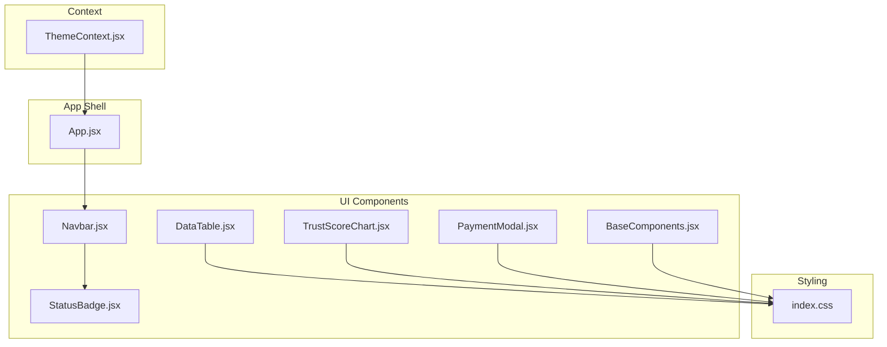
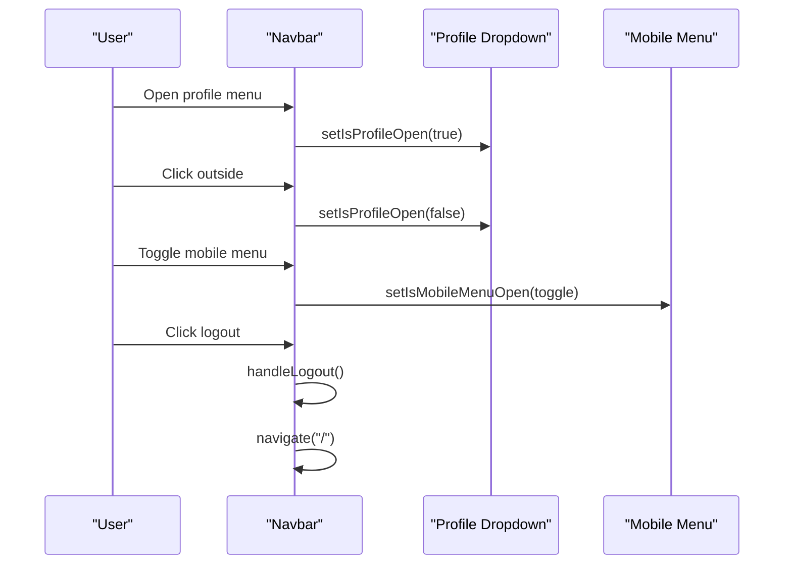
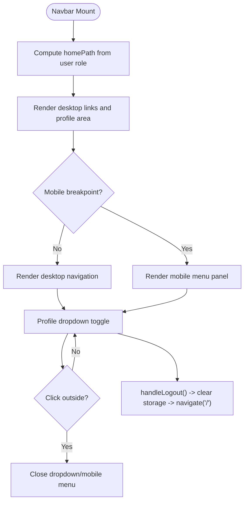
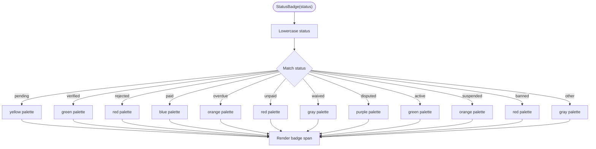
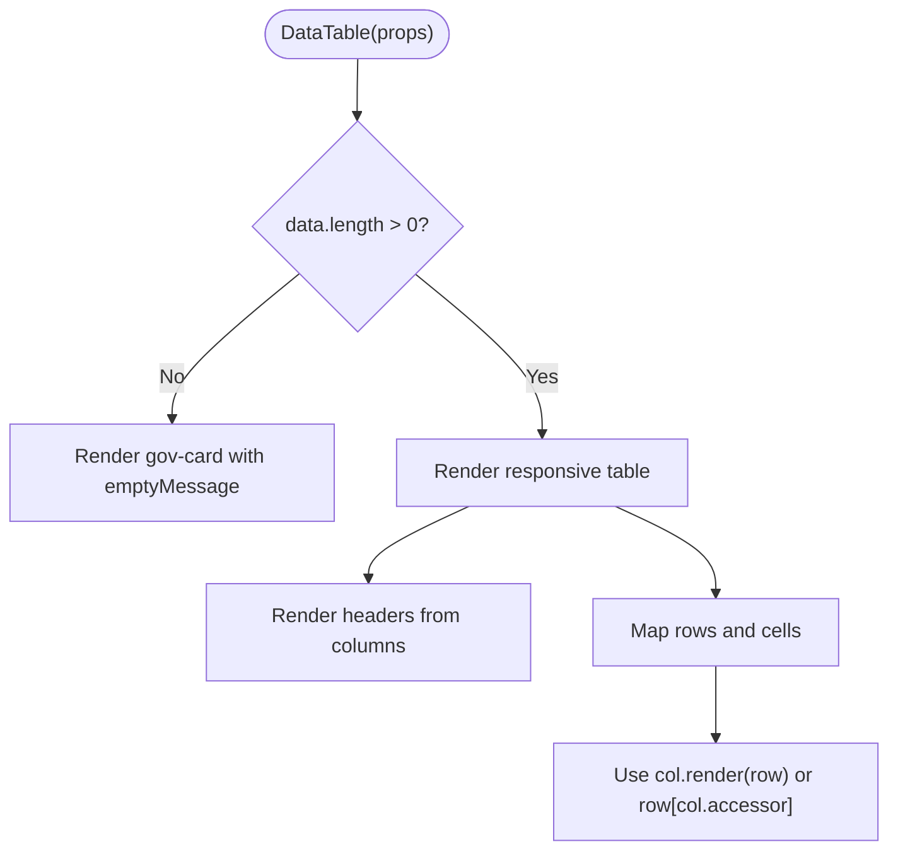
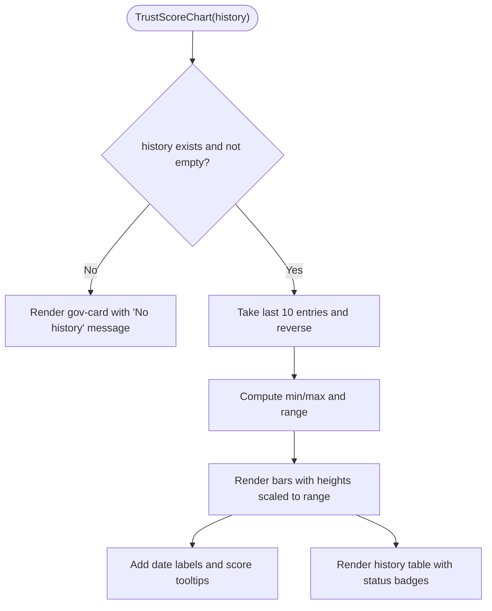
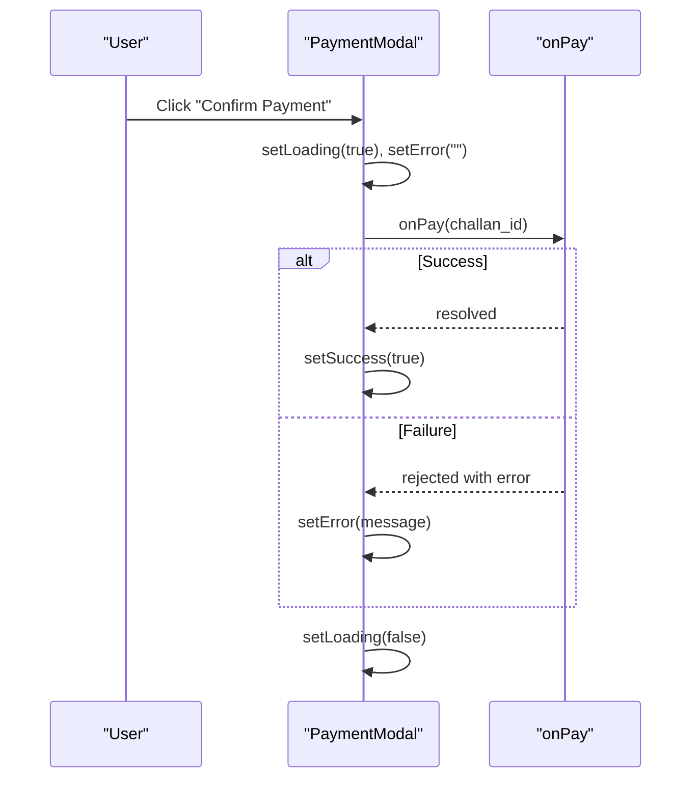
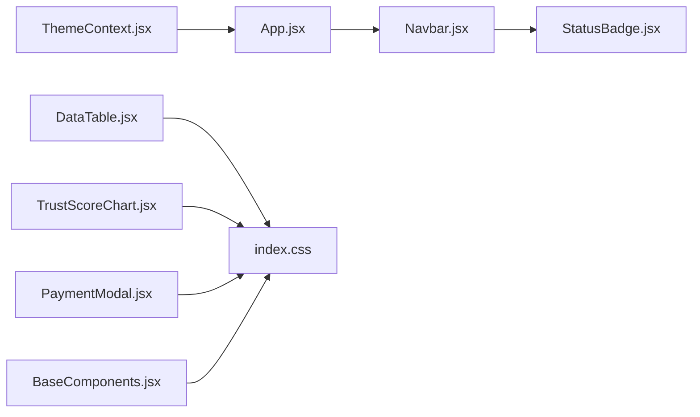

# Component Library

<cite>
**Referenced Files in This Document**
- [BaseComponents.jsx](file://frontend/src/components/ui/BaseComponents.jsx)
- [Navbar.jsx](file://frontend/src/components/Navbar.jsx)
- [StatusBadge.jsx](file://frontend/src/components/StatusBadge.jsx)
- [DataTable.jsx](file://frontend/src/components/DataTable.jsx)
- [TrustScoreChart.jsx](file://frontend/src/components/TrustScoreChart.jsx)
- [PaymentModal.jsx](file://frontend/src/components/PaymentModal.jsx)
- [ThemeContext.jsx](file://frontend/src/context/ThemeContext.jsx)
- [index.css](file://frontend/src/index.css)
- [App.jsx](file://frontend/src/App.jsx)
- [Analytics.jsx](file://frontend/src/pages/Analytics.jsx)
- [MyChallans.jsx](file://frontend/src/pages/MyChallans.jsx)
- [PaymentPage.jsx](file://frontend/src/pages/PaymentPage.jsx)
</cite>

## Table of Contents
1. [Introduction](#introduction)
2. [Project Structure](#project-structure)
3. [Core Components](#core-components)
4. [Architecture Overview](#architecture-overview)
5. [Detailed Component Analysis](#detailed-component-analysis)
6. [Dependency Analysis](#dependency-analysis)
7. [Performance Considerations](#performance-considerations)
8. [Accessibility and Responsive Design](#accessibility-and-responsive-design)
9. [Troubleshooting Guide](#troubleshooting-guide)
10. [Conclusion](#conclusion)

## Introduction
This document describes the shared component library used across the traffic violation system. It focuses on foundational UI components (buttons, forms, cards, badges, spinners, skeletons), the Navbar with user menu and responsive behavior, the StatusBadge for status display, the DataTable for tabular data, the TrustScoreChart for trust visualization, and the PaymentModal for secure payment processing. It explains component props, styling classes, event handlers, composition patterns, integration with the design system, and cross-browser compatibility considerations.

## Project Structure
The component library is primarily located under frontend/src/components, with shared utilities under frontend/src/context and global Tailwind layers under frontend/src/index.css. The App.jsx orchestrates routing and mounts the Navbar conditionally based on authentication state.

**Diagram sources**
- [App.jsx:78-80](file://frontend/src/App.jsx#L78-L80)
- [Navbar.jsx:5-14](file://frontend/src/components/Navbar.jsx#L5-L14)
- [index.css:23-64](file://frontend/src/index.css#L23-L64)

**Section sources**
- [App.jsx:27-265](file://frontend/src/App.jsx#L27-L265)
- [index.css:1-189](file://frontend/src/index.css#L1-L189)

## Core Components
This section documents the base UI primitives and shared utilities that form the foundation of the design system.

- Button
  - Purpose: Primary action with variants, sizes, icons, and full-width option.
  - Props:
    - children: node
    - variant: oneOf(primary, secondary, success, danger, outline, ghost)
    - size: oneOf(sm, md, lg)
    - onClick: func
    - type: oneOf(button, submit, reset)
    - disabled: bool
    - fullWidth: bool
    - icon: element (JSX)
    - className: string
  - Styling: Uses base styles and variant/sizes maps; supports focus rings and disabled states.
  - Accessibility: Inherits native button semantics; ensure meaningful labels for icon-only buttons.
  - Usage pattern: Wrap icons directly as children when passing an icon element.

- Input
  - Purpose: Text input with optional label, icon, validation, and error messaging.
  - Props:
    - label: string
    - name: string
    - type: string
    - value: any
    - onChange: func
    - placeholder: string
    - icon: element (JSX)
    - error: string
    - required: bool
    - disabled: bool
    - className: string
  - Styling: Conditional border and focus ring classes based on error state; left-padding adjusts for icon presence.
  - Accessibility: Proper label association via htmlFor/name; aria-invalid recommended when error is present.

- Card
  - Purpose: Container with subtle shadow and optional hover effect.
  - Props:
    - children: node
    - className: string
    - hover: bool
  - Styling: Rounded corners, border, and hover transitions.

- Badge
  - Purpose: Small status or tag indicator with semantic variants.
  - Props:
    - children: node
    - variant: oneOf(default, success, warning, danger, info, primary)
  - Styling: Semantic color classes mapped to variants.

- Skeleton and Spinner
  - Purpose: Loading placeholders and animated indicators.
  - Props:
    - Skeleton: className: string
    - Spinner: size: oneOf(sm, md, lg)

**Section sources**
- [BaseComponents.jsx:1-178](file://frontend/src/components/ui/BaseComponents.jsx#L1-L178)

## Architecture Overview
The Navbar integrates with routing and user state to render role-aware navigation, a profile dropdown, and a mobile menu. It uses click-outside detection and controlled state to manage visibility. The design system leverages Tailwind utility classes and custom component utilities defined in index.css.

**Diagram sources**
- [Navbar.jsx:16-37](file://frontend/src/components/Navbar.jsx#L16-L37)
- [Navbar.jsx:116-189](file://frontend/src/components/Navbar.jsx#L116-L189)
- [Navbar.jsx:213-246](file://frontend/src/components/Navbar.jsx#L213-L246)

**Section sources**
- [Navbar.jsx:1-252](file://frontend/src/components/Navbar.jsx#L1-L252)

## Detailed Component Analysis

### Navbar Component
- Role-aware navigation:
  - Police role: Dashboard, Review Reports, Vehicle Search, Analytics, Rules & Laws, Future Scopes.
  - Citizen role: Dashboard, Submit Report, My Reports, My Challans, Analytics, Rules & Laws, Future Scopes.
- User menu:
  - Displays initials badge derived from full_name or name.
  - Shows role badge (Citizen/Police).
  - Provides Profile and Rewards & Redeem (citizen-only) links.
  - Logout handler clears local storage and navigates to home.
- Responsive behavior:
  - Desktop: centered horizontal navigation.
  - Mobile: hamburger menu toggles a slide-in panel with vertical links and logout.
- Interaction:
  - Click-outside closes dropdown and mobile menu.
  - Active link highlighting based on current pathname.

**Diagram sources**
- [Navbar.jsx:5-14](file://frontend/src/components/Navbar.jsx#L5-L14)
- [Navbar.jsx:16-37](file://frontend/src/components/Navbar.jsx#L16-L37)
- [Navbar.jsx:213-246](file://frontend/src/components/Navbar.jsx#L213-L246)

**Section sources**
- [Navbar.jsx:5-252](file://frontend/src/components/Navbar.jsx#L5-L252)

### StatusBadge Component
- Purpose: Visual status indicator with color-coded borders and backgrounds.
- Supported statuses: pending, verified, rejected, paid, overdue, unpaid, waived, disputed, active, suspended, banned.
- Behavior: Converts incoming status to lowercase and selects appropriate semantic classes.

**Diagram sources**
- [StatusBadge.jsx:1-39](file://frontend/src/components/StatusBadge.jsx#L1-L39)

**Section sources**
- [StatusBadge.jsx:1-39](file://frontend/src/components/StatusBadge.jsx#L1-L39)

### DataTable Component
- Purpose: Renders tabular data with configurable columns and custom cell rendering.
- Props:
  - columns: array of objects with header and accessor/render keys.
  - data: array of row objects.
  - emptyMessage: string for empty state.
- Behavior:
  - Empty state displays a centered message inside a styled card.
  - Otherwise, renders a responsive table with fixed header/footer classes.

**Diagram sources**
- [DataTable.jsx:1-37](file://frontend/src/components/DataTable.jsx#L1-L37)

**Section sources**
- [DataTable.jsx:1-37](file://frontend/src/components/DataTable.jsx#L1-L37)

### TrustScoreChart Component
- Purpose: Visualizes trust score history with a bar chart and a supporting table.
- Props:
  - history: array of records with trust_score, changed_at, reward_points, account_status, operation_type, history_id.
- Behavior:
  - Displays a capped recent history (last 10 entries).
  - Computes min/max for scaling and assigns color bands.
  - Renders bars with tooltips and date labels; includes a small Y-axis guide.
  - Renders a table with dates, scores, reward points, status, and change type.

**Diagram sources**
- [TrustScoreChart.jsx:1-126](file://frontend/src/components/TrustScoreChart.jsx#L1-L126)

**Section sources**
- [TrustScoreChart.jsx:1-126](file://frontend/src/components/TrustScoreChart.jsx#L1-L126)

### PaymentModal Component
- Purpose: Modal dialog for confirming and simulating payment processing.
- Props:
  - challan: object containing challan_id, violation_description/rule_code, issued_at, amount.
  - onClose: callback to close modal.
  - onPay: async callback invoked with challan_id.
- Behavior:
  - Tracks loading, error, and success states.
  - On success, shows a confirmation screen with a close button.
  - Displays challan details and a secure notice.
  - Uses gov-themed utility classes for consistent styling.

**Diagram sources**
- [PaymentModal.jsx:10-22](file://frontend/src/components/PaymentModal.jsx#L10-L22)

**Section sources**
- [PaymentModal.jsx:1-99](file://frontend/src/components/PaymentModal.jsx#L1-L99)

## Dependency Analysis
- Component coupling:
  - Navbar depends on routing (useNavigate, useLocation) and user state to compute navigation and branding.
  - StatusBadge is standalone and stateless.
  - DataTable is a presentation component with minimal dependencies.
  - TrustScoreChart is self-contained aside from Tailwind utilities.
  - PaymentModal is a presentation component with external callbacks.
- Styling dependencies:
  - All components rely on Tailwind utilities and custom component utilities defined in index.css (e.g., gov-btn-*, gov-card, gov-table).
- Context integration:
  - ThemeContext manages dark/light mode and persists preference in localStorage.

**Diagram sources**
- [App.jsx:78-80](file://frontend/src/App.jsx#L78-L80)
- [index.css:23-64](file://frontend/src/index.css#L23-L64)

**Section sources**
- [App.jsx:27-265](file://frontend/src/App.jsx#L27-L265)
- [ThemeContext.jsx:1-39](file://frontend/src/context/ThemeContext.jsx#L1-L39)

## Performance Considerations
- Rendering:
  - Prefer memoization for expensive computations in TrustScoreChart (e.g., min/max) and DataTable (e.g., column rendering) when data volume increases.
  - Use virtualized lists for very large datasets in tables.
- Event handling:
  - Debounce search/filter inputs in parent containers to reduce re-renders.
- Styling:
  - Keep Tailwind utilities scoped to avoid unnecessary CSS bloat; leverage component utilities consistently.

## Accessibility and Responsive Design
- Accessibility:
  - Buttons and inputs use native HTML semantics; ensure labels and aria attributes where needed.
  - Focus management: rely on native focus rings; avoid removing focus-visible styles.
  - Color contrast: maintain sufficient contrast for status badges and charts.
- Responsive design:
  - Navbar uses a mobile breakpoint to switch to a slide-in menu.
  - DataTable is wrapped in an overflow container for small screens.
  - TrustScoreChart uses percentage-based heights and truncates long labels.
- Cross-browser compatibility:
  - Tailwind and modern CSS features are widely supported; ensure polyfills if targeting legacy browsers.
  - SVG usage is consistent across browsers; test animations if needed.

## Troubleshooting Guide
- Button and Input icon rendering:
  - Icons must be passed as JSX elements, not component constructors. Passing a component function will fail rendering.
- PaymentModal state:
  - Ensure onPay resolves/rejects appropriately; errors are captured and displayed.
- DataTable empty state:
  - Provide a descriptive emptyMessage; ensure data is an array to avoid unexpected behavior.
- TrustScoreChart data:
  - Ensure history entries include required fields (trust_score, changed_at, etc.) and are sorted as expected.

**Section sources**
- [BaseComponents.jsx:1-178](file://frontend/src/components/ui/BaseComponents.jsx#L1-L178)
- [PaymentModal.jsx:10-22](file://frontend/src/components/PaymentModal.jsx#L10-L22)
- [DataTable.jsx:1-37](file://frontend/src/components/DataTable.jsx#L1-L37)
- [TrustScoreChart.jsx:1-126](file://frontend/src/components/TrustScoreChart.jsx#L1-L126)

## Conclusion
The shared component library provides a cohesive, accessible, and responsive foundation for the traffic violation system. Components are intentionally simple, composable, and aligned with the design system’s Tailwind utilities and custom component classes. Integrating these components with routing, user state, and backend APIs yields a consistent user experience across desktop and mobile devices.