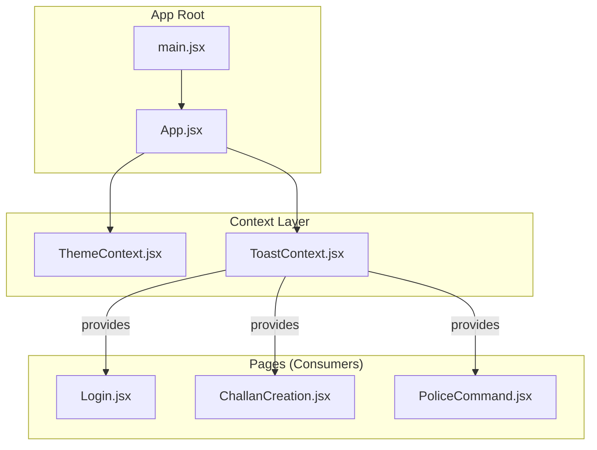
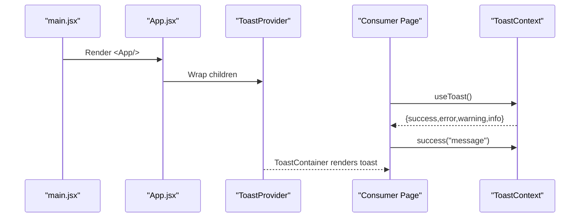
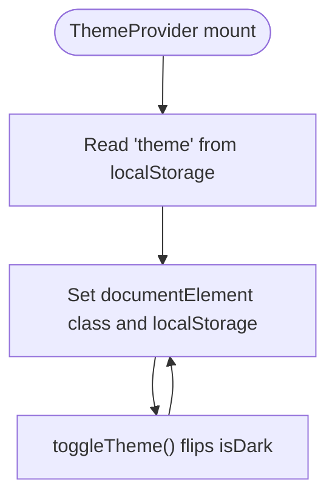
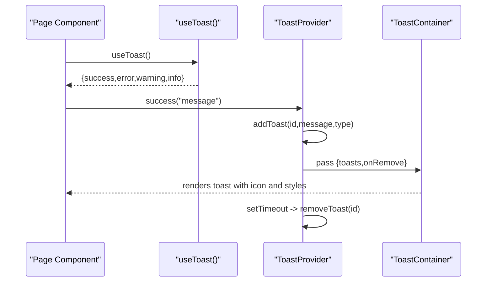
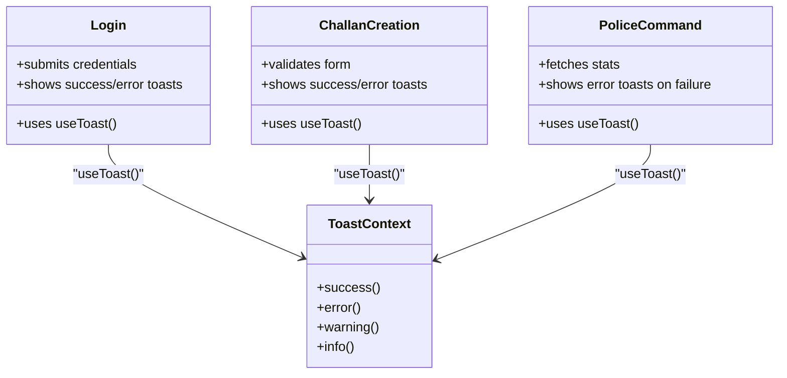
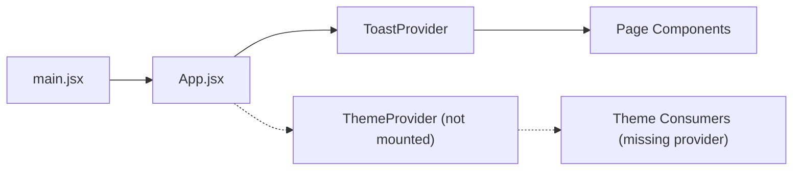

# Context Providers

<cite>
**Referenced Files in This Document**
- [ThemeContext.jsx](file://frontend/src/context/ThemeContext.jsx)
- [ToastContext.jsx](file://frontend/src/context/ToastContext.jsx)
- [App.jsx](file://frontend/src/App.jsx)
- [main.jsx](file://frontend/src/main.jsx)
- [Login.jsx](file://frontend/src/pages/Login.jsx)
- [ChallanCreation.jsx](file://frontend/src/pages/ChallanCreation.jsx)
- [PoliceCommand.jsx](file://frontend/src/pages/PoliceCommand.jsx)
</cite>

## Table of Contents
1. [Introduction](#introduction)
2. [Project Structure](#project-structure)
3. [Core Components](#core-components)
4. [Architecture Overview](#architecture-overview)
5. [Detailed Component Analysis](#detailed-component-analysis)
6. [Dependency Analysis](#dependency-analysis)
7. [Performance Considerations](#performance-considerations)
8. [Troubleshooting Guide](#troubleshooting-guide)
9. [Conclusion](#conclusion)

## Introduction
This document explains the React Context providers used in the application, focusing on ThemeContext for theme management and ToastContext for notifications. It covers provider implementation, state management patterns, consumer usage, custom hooks, and best practices for context consumption. It also documents the theme switching mechanism, toast notification system, and state synchronization across components, along with performance considerations and cleanup patterns.

## Project Structure
The context providers are defined under the frontend/src/context directory and integrated at the application root level. Consumers of these contexts are distributed across page components.

**Diagram sources**
- [main.jsx:1-14](file://frontend/src/main.jsx#L1-L14)
- [App.jsx:267-274](file://frontend/src/App.jsx#L267-L274)
- [ThemeContext.jsx:1-39](file://frontend/src/context/ThemeContext.jsx#L1-L39)
- [ToastContext.jsx:1-113](file://frontend/src/context/ToastContext.jsx#L1-L113)
- [Login.jsx:1-186](file://frontend/src/pages/Login.jsx#L1-L186)
- [ChallanCreation.jsx:1-347](file://frontend/src/pages/ChallanCreation.jsx#L1-L347)
- [PoliceCommand.jsx:1-207](file://frontend/src/pages/PoliceCommand.jsx#L1-L207)

**Section sources**
- [main.jsx:1-14](file://frontend/src/main.jsx#L1-L14)
- [App.jsx:267-274](file://frontend/src/App.jsx#L267-L274)

## Core Components
- ThemeContext: Manages dark/light mode, persists the preference in localStorage, and synchronizes the document root class for Tailwind dark mode.
- ToastContext: Provides a toast notification system with convenience methods for different toast types and automatic cleanup after a timeout.

Key implementation highlights:
- ThemeContext exports a custom hook useTheme and a ThemeProvider that exposes isDark and toggleTheme.
- ToastContext exports a custom hook useToast and a ToastProvider that exposes success, error, warning, and info methods, plus an internal ToastContainer that renders toasts.

**Section sources**
- [ThemeContext.jsx:1-39](file://frontend/src/context/ThemeContext.jsx#L1-L39)
- [ToastContext.jsx:1-113](file://frontend/src/context/ToastContext.jsx#L1-L113)

## Architecture Overview
The application bootstraps providers at the root. ToastProvider wraps the entire routing tree so any page can trigger notifications. ThemeProvider is not currently mounted at the root in the provided files; consumers of ThemeContext are not present in the examined components.

**Diagram sources**
- [main.jsx:7-13](file://frontend/src/main.jsx#L7-L13)
- [App.jsx:269-271](file://frontend/src/App.jsx#L269-L271)
- [ToastContext.jsx:13-40](file://frontend/src/context/ToastContext.jsx#L13-L40)
- [Login.jsx:8](file://frontend/src/pages/Login.jsx#L8)

## Detailed Component Analysis

### ThemeContext
- Purpose: Manage theme state and persist user preference.
- State: isDark boolean derived from localStorage.
- Effects: Adds/removes the "dark" class on document.documentElement and updates localStorage on change.
- Exposed API: toggleTheme to flip theme; consumers read isDark to conditionally apply styles.

**Diagram sources**
- [ThemeContext.jsx:13-38](file://frontend/src/context/ThemeContext.jsx#L13-L38)

**Section sources**
- [ThemeContext.jsx:1-39](file://frontend/src/context/ThemeContext.jsx#L1-L39)

### ToastContext
- Purpose: Provide a global toast notification system.
- State: Array of toasts with id, message, and type.
- Effects: Automatically removes toasts after a duration; supports manual removal.
- Exposed API: success, error, warning, info convenience methods; internal ToastContainer renders toasts with type-specific styling and icons.

**Diagram sources**
- [ToastContext.jsx:13-40](file://frontend/src/context/ToastContext.jsx#L13-L40)
- [ToastContext.jsx:42-112](file://frontend/src/context/ToastContext.jsx#L42-L112)

**Section sources**
- [ToastContext.jsx:1-113](file://frontend/src/context/ToastContext.jsx#L1-L113)

### Consumer Components
- Login: Uses useToast to show success and error notifications during authentication.
- ChallanCreation: Uses useToast to report errors and confirm successful challan creation.
- PoliceCommand: Uses useToast indirectly via the provider to surface errors during dashboard fetches.

**Diagram sources**
- [Login.jsx:8](file://frontend/src/pages/Login.jsx#L8)
- [ChallanCreation.jsx:10](file://frontend/src/pages/ChallanCreation.jsx#L10)
- [PoliceCommand.jsx:5](file://frontend/src/pages/PoliceCommand.jsx#L5)
- [ToastContext.jsx:5-11](file://frontend/src/context/ToastContext.jsx#L5-L11)

**Section sources**
- [Login.jsx:1-186](file://frontend/src/pages/Login.jsx#L1-L186)
- [ChallanCreation.jsx:1-347](file://frontend/src/pages/ChallanCreation.jsx#L1-L347)
- [PoliceCommand.jsx:1-207](file://frontend/src/pages/PoliceCommand.jsx#L1-L207)

## Dependency Analysis
- Provider placement: ToastProvider is mounted at the root in App.jsx, enabling toast usage anywhere in the app.
- ThemeProvider is not mounted at the root in the provided files; therefore, ThemeContext consumers would throw if used without wrapping the component tree with ThemeProvider.
- Consumers depend on the custom hooks exported by each context module.

**Diagram sources**
- [main.jsx:7-13](file://frontend/src/main.jsx#L7-L13)
- [App.jsx:269-271](file://frontend/src/App.jsx#L269-L271)
- [ThemeContext.jsx:13-38](file://frontend/src/context/ThemeContext.jsx#L13-L38)

**Section sources**
- [App.jsx:267-274](file://frontend/src/App.jsx#L267-L274)

## Performance Considerations
- ToastContext
  - Using useCallback for addToast and removeToast prevents unnecessary re-renders of ToastContainer when the parent re-renders.
  - Automatic cleanup via setTimeout avoids memory leaks; however, ensure long-lived components unmount to prevent orphaned timeouts if needed.
- ThemeContext
  - Persisting to localStorage on every theme change is lightweight; consider debouncing if toggled rapidly.
  - Adding/removing a single class on documentElement is efficient; avoid frequent reflows by minimizing redundant toggles.
- General
  - Keep context values minimal and stable when possible to reduce re-renders.
  - Prefer splitting providers if the app grows to avoid large shared state objects.

## Troubleshooting Guide
- useToast throws an error if used outside ToastProvider
  - Ensure the component tree is wrapped with ToastProvider at the root.
  - Verify the provider is rendered before any consumer attempts to use the hook.
- useTheme throws an error if used outside ThemeProvider
  - The current root does not wrap the app with ThemeProvider; add ThemeProvider around children in App.jsx to enable theme features.
- Toasts not appearing
  - Confirm that the ToastContainer is included in the provider’s render output and that the toasts array is non-empty.
- Theme not persisting
  - Check that localStorage keys match expectations and that documentElement class is being toggled correctly.

**Section sources**
- [ToastContext.jsx:5-11](file://frontend/src/context/ToastContext.jsx#L5-L11)
- [ThemeContext.jsx:5-11](file://frontend/src/context/ThemeContext.jsx#L5-L11)
- [App.jsx:269-271](file://frontend/src/App.jsx#L269-L271)

## Conclusion
The application provides robust context-based features for theme management and toast notifications. ToastContext is fully integrated at the root and widely used across pages. ThemeContext is implemented but not currently mounted at the root; adding ThemeProvider would enable theme switching across the app. Following the documented patterns ensures predictable state synchronization, maintainable consumer code, and good performance.