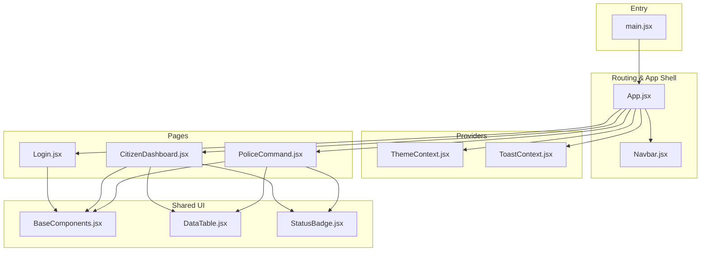
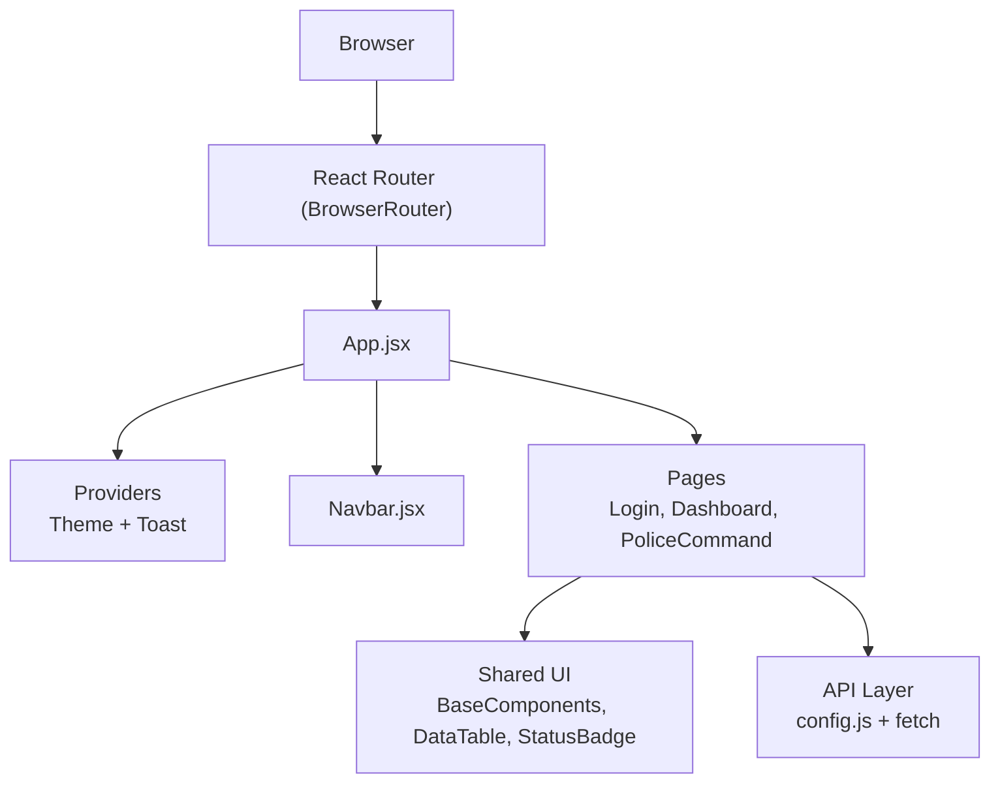
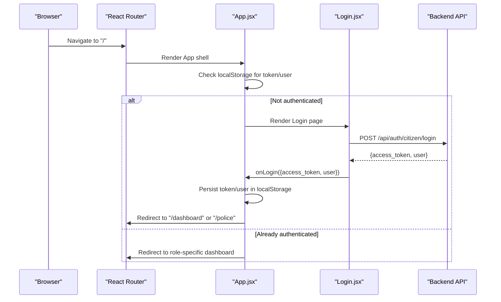
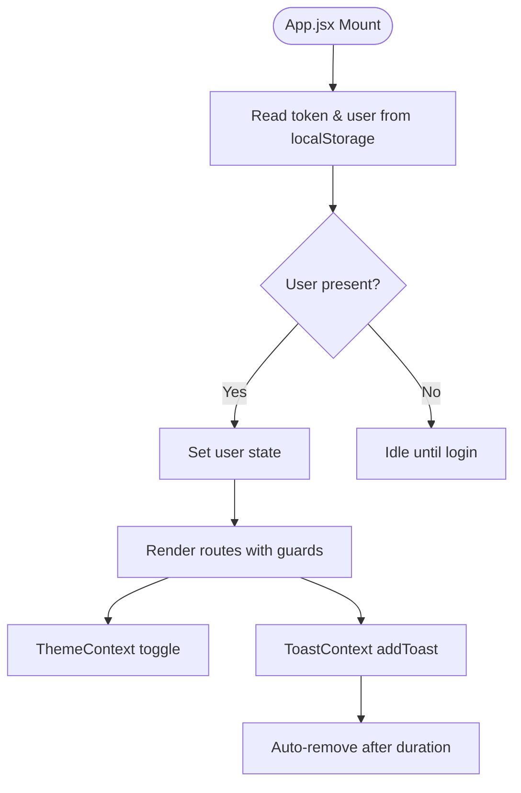
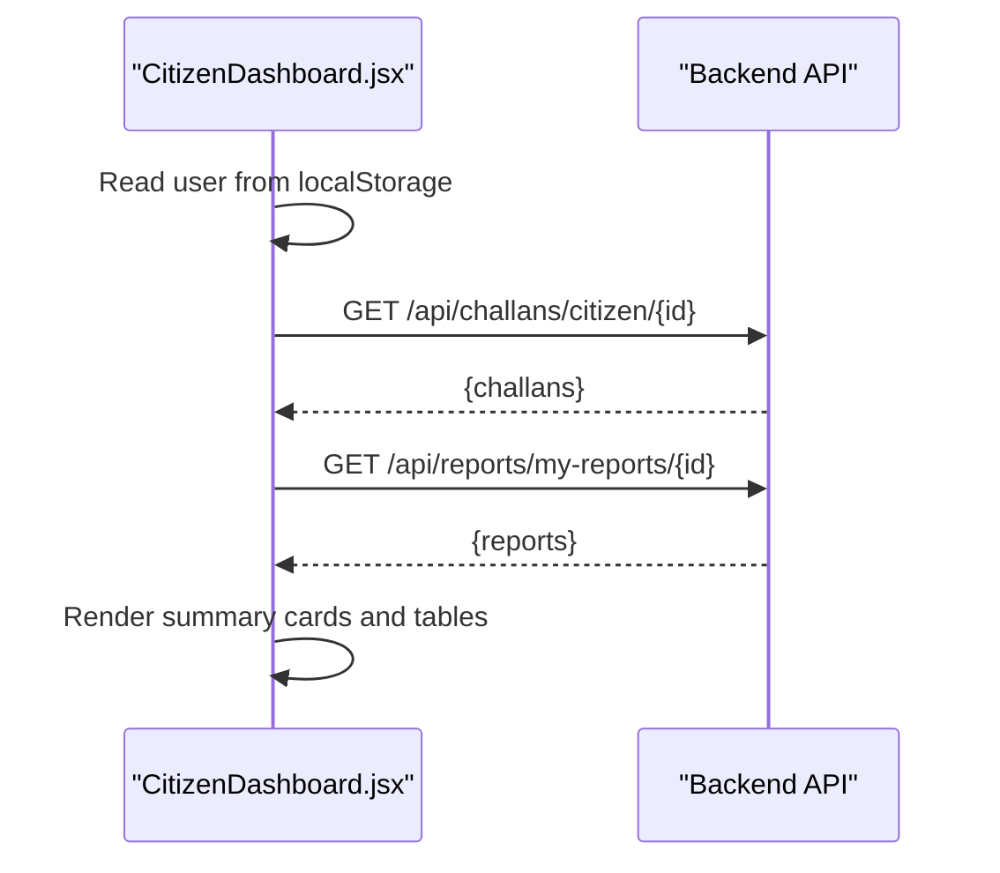
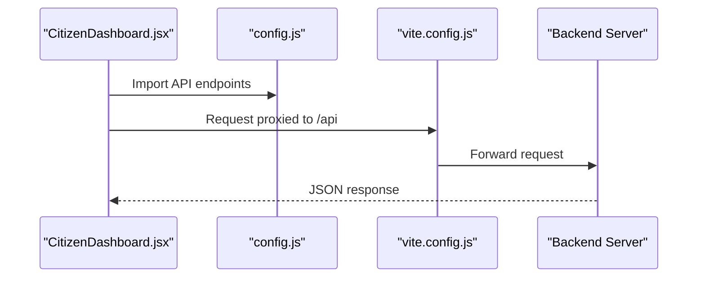
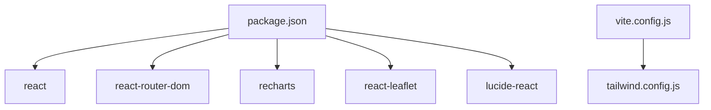

# Frontend Application

<cite>
**Referenced Files in This Document**
- [main.jsx](file://frontend/src/main.jsx)
- [App.jsx](file://frontend/src/App.jsx)
- [config.js](file://frontend/src/config.js)
- [vite.config.js](file://frontend/vite.config.js)
- [package.json](file://frontend/package.json)
- [tailwind.config.js](file://frontend/tailwind.config.js)
- [ThemeContext.jsx](file://frontend/src/context/ThemeContext.jsx)
- [ToastContext.jsx](file://frontend/src/context/ToastContext.jsx)
- [BaseComponents.jsx](file://frontend/src/components/ui/BaseComponents.jsx)
- [Navbar.jsx](file://frontend/src/components/Navbar.jsx)
- [DataTable.jsx](file://frontend/src/components/DataTable.jsx)
- [StatusBadge.jsx](file://frontend/src/components/StatusBadge.jsx)
- [Login.jsx](file://frontend/src/pages/Login.jsx)
- [CitizenDashboard.jsx](file://frontend/src/pages/CitizenDashboard.jsx)
- [PoliceCommand.jsx](file://frontend/src/pages/PoliceCommand.jsx)
</cite>

## Table of Contents
1. [Introduction](#introduction)
2. [Project Structure](#project-structure)
3. [Core Components](#core-components)
4. [Architecture Overview](#architecture-overview)
5. [Detailed Component Analysis](#detailed-component-analysis)
6. [Dependency Analysis](#dependency-analysis)
7. [Performance Considerations](#performance-considerations)
8. [Troubleshooting Guide](#troubleshooting-guide)
9. [Conclusion](#conclusion)
10. [Appendices](#appendices)

## Introduction
This document describes the React-based frontend application for the Traffic Violation Management System. It covers the component hierarchy, routing configuration with React Router, state management patterns, styling approach with TailwindCSS, real-time data fetching, responsive design, navigation and transitions, accessibility, performance optimization, and integration with backend APIs. The application supports two user roles—citizens and police officers—with role-aware navigation, dashboards, and actions.

## Project Structure
The frontend is organized into modular directories:
- src/main.jsx: Application entry point bootstrapping React and React Router.
- src/App.jsx: Central routing and authentication state management.
- src/pages: Page-level components grouped by user role and function.
- src/components: Shared UI components and layout elements.
- src/context: Global providers for theme and toast notifications.
- src/config.js: API base URL and endpoint constants.
- vite.config.js: Vite dev server and proxy configuration.
- tailwind.config.js: Tailwind customization for colors, animations, and fonts.
- package.json: Dependencies and scripts.

**Diagram sources**
- [main.jsx:1-14](file://frontend/src/main.jsx#L1-L14)
- [App.jsx:1-274](file://frontend/src/App.jsx#L1-L274)
- [Navbar.jsx:1-254](file://frontend/src/components/Navbar.jsx#L1-L254)
- [ThemeContext.jsx:1-39](file://frontend/src/context/ThemeContext.jsx#L1-L39)
- [ToastContext.jsx:1-113](file://frontend/src/context/ToastContext.jsx#L1-L113)
- [BaseComponents.jsx:1-178](file://frontend/src/components/ui/BaseComponents.jsx#L1-L178)
- [DataTable.jsx:1-37](file://frontend/src/components/DataTable.jsx#L1-L37)
- [StatusBadge.jsx:1-39](file://frontend/src/components/StatusBadge.jsx#L1-L39)
- [Login.jsx:1-186](file://frontend/src/pages/Login.jsx#L1-L186)
- [CitizenDashboard.jsx:1-340](file://frontend/src/pages/CitizenDashboard.jsx#L1-L340)
- [PoliceCommand.jsx:1-207](file://frontend/src/pages/PoliceCommand.jsx#L1-L207)

**Section sources**
- [main.jsx:1-14](file://frontend/src/main.jsx#L1-L14)
- [App.jsx:1-274](file://frontend/src/App.jsx#L1-L274)
- [package.json:1-30](file://frontend/package.json#L1-L30)

## Core Components
- Routing and Authentication: Centralized in App.jsx with route guards and local storage persistence for tokens and user data.
- Providers: ThemeContext manages light/dark mode persisted in localStorage; ToastContext provides global toast notifications with severity types.
- Shared UI: BaseComponents offers reusable Button, Input, Card, Badge, Skeleton, and Spinner; DataTable and StatusBadge encapsulate tabular rendering and status indicators.
- Navigation: Navbar adapts to user role, handles profile dropdown, mobile menu, and logout.

**Section sources**
- [App.jsx:27-274](file://frontend/src/App.jsx#L27-L274)
- [ThemeContext.jsx:13-39](file://frontend/src/context/ThemeContext.jsx#L13-L39)
- [ToastContext.jsx:13-113](file://frontend/src/context/ToastContext.jsx#L13-L113)
- [BaseComponents.jsx:1-178](file://frontend/src/components/ui/BaseComponents.jsx#L1-L178)
- [DataTable.jsx:1-37](file://frontend/src/components/DataTable.jsx#L1-L37)
- [StatusBadge.jsx:1-39](file://frontend/src/components/StatusBadge.jsx#L1-L39)
- [Navbar.jsx:5-254](file://frontend/src/components/Navbar.jsx#L5-L254)

## Architecture Overview
The app initializes React and wraps the application with providers. App.jsx defines routes and role-based navigation, while pages consume shared UI components and context providers. API endpoints are centralized in config.js and consumed via fetch calls in pages.

**Diagram sources**
- [main.jsx:3-12](file://frontend/src/main.jsx#L3-L12)
- [App.jsx:1-274](file://frontend/src/App.jsx#L1-L274)
- [Navbar.jsx:1-254](file://frontend/src/components/Navbar.jsx#L1-L254)
- [BaseComponents.jsx:1-178](file://frontend/src/components/ui/BaseComponents.jsx#L1-L178)
- [DataTable.jsx:1-37](file://frontend/src/components/DataTable.jsx#L1-L37)
- [StatusBadge.jsx:1-39](file://frontend/src/components/StatusBadge.jsx#L1-L39)
- [config.js:1-34](file://frontend/src/config.js#L1-L34)

## Detailed Component Analysis

### Routing and Authentication Flow
- App.jsx sets up routes and guards:
  - Root path navigates authenticated users to hero/dashboard depending on role.
  - Role-based routes restrict access using user role checks.
  - Local storage persists token and user data; App.jsx restores user on mount.
- Login.jsx demonstrates form submission, error handling, and invoking the parent onLogin handler to persist credentials.

**Diagram sources**
- [App.jsx:27-92](file://frontend/src/App.jsx#L27-L92)
- [Login.jsx:15-69](file://frontend/src/pages/Login.jsx#L15-L69)

**Section sources**
- [App.jsx:27-92](file://frontend/src/App.jsx#L27-L92)
- [Login.jsx:15-69](file://frontend/src/pages/Login.jsx#L15-L69)

### State Management Patterns
- Authentication state: App.jsx maintains user state and exposes handlers for login/logout.
- Theme state: ThemeContext persists theme preference in localStorage and toggles document class.
- Toast notifications: ToastContext manages a queue of toasts with severity helpers and auto-dismiss timers.

**Diagram sources**
- [App.jsx:30-76](file://frontend/src/App.jsx#L30-L76)
- [ThemeContext.jsx:19-31](file://frontend/src/context/ThemeContext.jsx#L19-L31)
- [ToastContext.jsx:16-27](file://frontend/src/context/ToastContext.jsx#L16-L27)

**Section sources**
- [App.jsx:27-76](file://frontend/src/App.jsx#L27-L76)
- [ThemeContext.jsx:13-39](file://frontend/src/context/ThemeContext.jsx#L13-L39)
- [ToastContext.jsx:13-113](file://frontend/src/context/ToastContext.jsx#L13-L113)

### Styling Approach with TailwindCSS
- Tailwind configuration extends:
  - Primary palette aligned to government branding.
  - Beige palette for subtle backgrounds.
  - Inter font family for clean readability.
  - Slide-in, fade-in, and float animations for micro-interactions.
- Components apply utility classes consistently for cards, badges, inputs, buttons, and responsive grids.

**Section sources**
- [tailwind.config.js:1-54](file://frontend/tailwind.config.js#L1-L54)
- [BaseComponents.jsx:14-46](file://frontend/src/components/ui/BaseComponents.jsx#L14-L46)
- [CitizenDashboard.jsx:176-204](file://frontend/src/pages/CitizenDashboard.jsx#L176-L204)

### Real-Time Data Fetching and Page Transitions
- Pages fetch data on mount:
  - CitizenDashboard retrieves challans and reports for the logged-in citizen.
  - PoliceCommand fetches analytics summary for the command center.
- Transitions:
  - Navbar dropdowns and mobile menus use CSS animations.
  - Toast notifications appear with slide-in animation.
- Page transitions:
  - React Router renders pages without page reloads; animations are applied via Tailwind utilities.

**Diagram sources**
- [CitizenDashboard.jsx:14-68](file://frontend/src/pages/CitizenDashboard.jsx#L14-L68)

**Section sources**
- [CitizenDashboard.jsx:14-68](file://frontend/src/pages/CitizenDashboard.jsx#L14-L68)
- [PoliceCommand.jsx:20-48](file://frontend/src/pages/PoliceCommand.jsx#L20-L48)

### Responsive Design Implementation
- Navbar uses responsive breakpoints to show a mobile menu drawer.
- Grid layouts adapt from single to multi-column summaries.
- Inputs and buttons scale with size variants; tables use horizontal scrolling on small screens.

**Section sources**
- [Navbar.jsx:95-248](file://frontend/src/components/Navbar.jsx#L95-L248)
- [CitizenDashboard.jsx:176-204](file://frontend/src/pages/CitizenDashboard.jsx#L176-L204)
- [BaseComponents.jsx:23-27](file://frontend/src/components/ui/BaseComponents.jsx#L23-L27)

### Navigation Structure and User Interaction Workflows
- Role-aware navigation:
  - Citizens see dashboard, submit report, manage reports/challans, rewards, payments, analytics, rules, and future scopes.
  - Police see command center, review reports, vehicle search, analytics, rules, and future scopes.
- Profile dropdown allows access to profile and logout.
- Mobile menu collapses on route change and outside clicks.

**Section sources**
- [Navbar.jsx:59-78](file://frontend/src/components/Navbar.jsx#L59-L78)
- [Navbar.jsx:138-191](file://frontend/src/components/Navbar.jsx#L138-L191)
- [App.jsx:81-262](file://frontend/src/App.jsx#L81-L262)

### Accessibility Features
- Semantic HTML and proper labeling in shared components.
- Focus states and keyboard-friendly interactions via Tailwind focus utilities.
- Icons include accessible markup for screen readers.
- Sufficient color contrast using the configured palette.

**Section sources**
- [BaseComponents.jsx:65-101](file://frontend/src/components/ui/BaseComponents.jsx#L65-L101)
- [ToastContext.jsx:96-108](file://frontend/src/context/ToastContext.jsx#L96-L108)

### Component Composition Patterns
- Pages compose shared UI components (Button, Input, Card) and status components (StatusBadge).
- DataTable abstracts column rendering and empty states.
- Navbar composes Logo and links conditionally based on role.

**Section sources**
- [Login.jsx:90-158](file://frontend/src/pages/Login.jsx#L90-L158)
- [CitizenDashboard.jsx:207-333](file://frontend/src/pages/CitizenDashboard.jsx#L207-L333)
- [DataTable.jsx:1-37](file://frontend/src/components/DataTable.jsx#L1-L37)
- [StatusBadge.jsx:1-39](file://frontend/src/components/StatusBadge.jsx#L1-L39)

### Integration with Backend APIs
- API endpoints are centralized in config.js and consumed via fetch in pages.
- Example endpoints include auth, reports, challans, trust, and analytics.
- Vite proxy forwards /api and /uploads to the backend server during development.

**Diagram sources**
- [config.js:5-31](file://frontend/src/config.js#L5-L31)
- [vite.config.js:9-20](file://frontend/vite.config.js#L9-L20)

**Section sources**
- [config.js:1-34](file://frontend/src/config.js#L1-L34)
- [vite.config.js:1-23](file://frontend/vite.config.js#L1-L23)
- [Login.jsx:26-51](file://frontend/src/pages/Login.jsx#L26-L51)
- [CitizenDashboard.jsx:31-48](file://frontend/src/pages/CitizenDashboard.jsx#L31-L48)
- [PoliceCommand.jsx:24-42](file://frontend/src/pages/PoliceCommand.jsx#L24-L42)

## Dependency Analysis
- Runtime dependencies include React, React Router DOM, Recharts, Leaflet, Lucide icons, and React Leaflet.
- Dev dependencies include Vite, PostCSS, TailwindCSS, and React plugin.
- The app proxies API requests to the backend server during development.

**Diagram sources**
- [package.json:11-28](file://frontend/package.json#L11-L28)
- [vite.config.js:1-23](file://frontend/vite.config.js#L1-L23)
- [tailwind.config.js:1-54](file://frontend/tailwind.config.js#L1-L54)

**Section sources**
- [package.json:1-30](file://frontend/package.json#L1-L30)

## Performance Considerations
- Bundle size:
  - Keep shared UI components small and avoid unnecessary re-renders by passing memoized callbacks.
  - Lazy-load heavy pages if needed to reduce initial bundle size.
- Rendering:
  - Use Skeleton components for loading states.
  - Paginate or virtualize large tables if data grows.
- Network:
  - Debounce frequent fetches; cache results per session.
  - Use Vite’s built-in tree-shaking and minification in production builds.
- Styling:
  - Purge unused Tailwind classes in production.
  - Prefer utility classes over custom CSS to reduce CSS payload.

## Troubleshooting Guide
- Authentication issues:
  - Verify token and user persistence in localStorage after login.
  - Ensure onLogin handler updates App.jsx state and redirects appropriately.
- API connectivity:
  - Confirm Vite proxy settings for /api and /uploads.
  - Check network tab for CORS errors and backend availability.
- Toast notifications:
  - Use severity helpers (success, error, warning, info) and confirm auto-dismiss behavior.
- Theme switching:
  - Confirm localStorage theme value and document class toggling.

**Section sources**
- [App.jsx:52-76](file://frontend/src/App.jsx#L52-L76)
- [vite.config.js:7-21](file://frontend/vite.config.js#L7-L21)
- [ToastContext.jsx:29-32](file://frontend/src/context/ToastContext.jsx#L29-L32)
- [ThemeContext.jsx:19-27](file://frontend/src/context/ThemeContext.jsx#L19-L27)

## Conclusion
The frontend follows a modular, provider-driven architecture with clear separation of concerns. Routing and authentication are centralized, shared UI components promote consistency, and Tailwind utilities enable responsive, government-aligned theming. Real-time data is fetched via a centralized API configuration, and navigation adapts to user roles. With thoughtful performance and accessibility practices, the application provides a robust foundation for citizens and police officers to interact with the traffic violation system.

## Appendices
- Development workflow:
  - Run dev server with Vite; proxy targets backend on localhost:5000.
  - Build for production using Vite; ensure Tailwind purging and minification are enabled.
- Styling guidelines:
  - Use primary palette for primary actions and accents.
  - Apply badge variants for status communication.
  - Maintain consistent spacing and typography scales.