# Page Components

<cite>
**Referenced Files in This Document**
- [CitizenDashboard.jsx](file://frontend/src/pages/CitizenDashboard.jsx)
- [PoliceCommand.jsx](file://frontend/src/pages/PoliceCommand.jsx)
- [SubmitReport.jsx](file://frontend/src/pages/SubmitReport.jsx)
- [Analytics.jsx](file://frontend/src/pages/Analytics.jsx)
- [MyReports.jsx](file://frontend/src/pages/MyReports.jsx)
- [MyChallans.jsx](file://frontend/src/pages/MyChallans.jsx)
- [PaymentPage.jsx](file://frontend/src/pages/PaymentPage.jsx)
- [ReviewReports.jsx](file://frontend/src/pages/ReviewReports.jsx)
- [ChallanCreation.jsx](file://frontend/src/pages/ChallanCreation.jsx)
- [VehicleSearch.jsx](file://frontend/src/pages/VehicleSearch.jsx)
</cite>

## Table of Contents
1. [Introduction](#introduction)
2. [Project Structure](#project-structure)
3. [Core Components](#core-components)
4. [Architecture Overview](#architecture-overview)
5. [Detailed Component Analysis](#detailed-component-analysis)
6. [Dependency Analysis](#dependency-analysis)
7. [Performance Considerations](#performance-considerations)
8. [Troubleshooting Guide](#troubleshooting-guide)
9. [Conclusion](#conclusion)

## Introduction
This document provides comprehensive documentation for all page components in the traffic violation management application. It covers user-centric dashboards, law enforcement portals, reporting workflows, analytics, payment processing, and vehicle search functionality. Each page component is analyzed for structure, data flows, API integrations, form handling, validation patterns, and user interaction flows.

## Project Structure
The frontend pages are organized under the `frontend/src/pages` directory. Each page is a React functional component that encapsulates UI rendering, state management, and API interactions. Shared UI primitives and utilities reside in `frontend/src/components` and `frontend/src/context`.

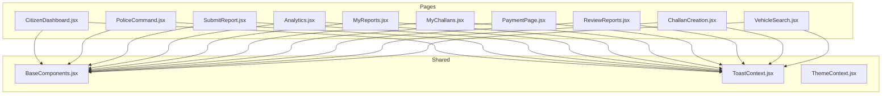

**Diagram sources**
- [CitizenDashboard.jsx:1-340](file://frontend/src/pages/CitizenDashboard.jsx#L1-L340)
- [PoliceCommand.jsx:1-207](file://frontend/src/pages/PoliceCommand.jsx#L1-L207)
- [SubmitReport.jsx:1-344](file://frontend/src/pages/SubmitReport.jsx#L1-L344)
- [Analytics.jsx:1-271](file://frontend/src/pages/Analytics.jsx#L1-L271)
- [MyReports.jsx:1-255](file://frontend/src/pages/MyReports.jsx#L1-L255)
- [MyChallans.jsx:1-207](file://frontend/src/pages/MyChallans.jsx#L1-L207)
- [PaymentPage.jsx:1-481](file://frontend/src/pages/PaymentPage.jsx#L1-L481)
- [ReviewReports.jsx:1-256](file://frontend/src/pages/ReviewReports.jsx#L1-L256)
- [ChallanCreation.jsx:1-347](file://frontend/src/pages/ChallanCreation.jsx#L1-L347)
- [VehicleSearch.jsx:1-334](file://frontend/src/pages/VehicleSearch.jsx#L1-L334)

**Section sources**
- [CitizenDashboard.jsx:1-340](file://frontend/src/pages/CitizenDashboard.jsx#L1-L340)
- [PoliceCommand.jsx:1-207](file://frontend/src/pages/PoliceCommand.jsx#L1-L207)
- [SubmitReport.jsx:1-344](file://frontend/src/pages/SubmitReport.jsx#L1-L344)
- [Analytics.jsx:1-271](file://frontend/src/pages/Analytics.jsx#L1-L271)
- [MyReports.jsx:1-255](file://frontend/src/pages/MyReports.jsx#L1-L255)
- [MyChallans.jsx:1-207](file://frontend/src/pages/MyChallans.jsx#L1-L207)
- [PaymentPage.jsx:1-481](file://frontend/src/pages/PaymentPage.jsx#L1-L481)
- [ReviewReports.jsx:1-256](file://frontend/src/pages/ReviewReports.jsx#L1-L256)
- [ChallanCreation.jsx:1-347](file://frontend/src/pages/ChallanCreation.jsx#L1-L347)
- [VehicleSearch.jsx:1-334](file://frontend/src/pages/VehicleSearch.jsx#L1-L334)

## Core Components
This section summarizes the primary responsibilities of each page component and their integration points with the backend API.

- CitizenDashboard
  - Purpose: Display user-specific traffic challans and reports, payment actions, and summary cards.
  - Key APIs: `/api/challans/citizen/{id}`, `/api/reports/my-reports/{id}`, `/api/challans/pay/{id}`, `/api/reports/{id}`.
  - Real-time sync: Automatic refresh for challans and reports.
  - Status badges: Color-coded statuses for challan/payment and report verification.

- PoliceCommand
  - Purpose: Law enforcement central command with real-time stats and quick actions.
  - Key APIs: `/api/analytics/police-summary`.
  - UI: Stat cards and quick navigation to review reports, vehicle search, and analytics.

- SubmitReport
  - Purpose: Allow citizens to submit violation reports with evidence photo upload and validation.
  - Key APIs: `/api/reports/create`, `/api/reports/upload-evidence/{reportId}`.
  - Validation: Form validation and image constraints (type and size).
  - Preview: Real-time image preview before submission.

- Analytics
  - Purpose: Provide role-specific analytics and visualization.
  - Key APIs: `/api/analytics/citizen/{id}` or `/api/analytics/police/system`, `/api/analytics/violation-types`.
  - Visualizations: Bar and pie charts powered by Recharts.

- MyReports
  - Purpose: Track citizen's submitted reports with edit/delete capabilities and real-time status updates.
  - Key APIs: `/api/reports/my-reports/{id}`, `/api/reports/delete/{reportId}`, `/api/reports/update/{reportId}`.
  - Real-time sync: Auto-refresh every 3 seconds.

- MyChallans
  - Purpose: Manage citizen's challans with payment initiation and summary cards.
  - Key APIs: `/api/challans/my?citizen_id={id}`.
  - Real-time sync: Auto-refresh every 3 seconds.

- PaymentPage
  - Purpose: Secure payment processing page with demo payment flow and modal-like success screen.
  - Key APIs: `/api/challans/my?citizen_id={id}`, `/api/challans/pay/{challanId}`.
  - UX: Terms agreement, payment method selection, and success redirect.

- ReviewReports
  - Purpose: Enable police officers to review pending reports, verify or reject, and delete records.
  - Key APIs: `/api/reports/police/pending`, `/api/reports/police/process/{reportId}`, `/api/reports/{reportId}`, `/api/rules/all`.
  - Real-time sync: Auto-refresh every 3 seconds.

- ChallanCreation
  - Purpose: Create challans from verified reports with rule selection and fine amount input.
  - Key APIs: `/api/challans/report/{reportId}`, `/api/rules/all`, `/api/challans/create`.
  - Validation: Rule selection and positive fine amount.

- VehicleSearch
  - Purpose: Search vehicle registration and violation history for law enforcement.
  - Key APIs: `/api/vehicles/search/{plateNo}`.
  - UX: Error messaging, vehicle profile, summary stats, and violation history table.

**Section sources**
- [CitizenDashboard.jsx:1-340](file://frontend/src/pages/CitizenDashboard.jsx#L1-L340)
- [PoliceCommand.jsx:1-207](file://frontend/src/pages/PoliceCommand.jsx#L1-L207)
- [SubmitReport.jsx:1-344](file://frontend/src/pages/SubmitReport.jsx#L1-L344)
- [Analytics.jsx:1-271](file://frontend/src/pages/Analytics.jsx#L1-L271)
- [MyReports.jsx:1-255](file://frontend/src/pages/MyReports.jsx#L1-L255)
- [MyChallans.jsx:1-207](file://frontend/src/pages/MyChallans.jsx#L1-L207)
- [PaymentPage.jsx:1-481](file://frontend/src/pages/PaymentPage.jsx#L1-L481)
- [ReviewReports.jsx:1-256](file://frontend/src/pages/ReviewReports.jsx#L1-L256)
- [ChallanCreation.jsx:1-347](file://frontend/src/pages/ChallanCreation.jsx#L1-L347)
- [VehicleSearch.jsx:1-334](file://frontend/src/pages/VehicleSearch.jsx#L1-L334)

## Architecture Overview
The application follows a client-server architecture with React frontend pages communicating with a backend API. Pages use local storage for user session persistence and toast notifications for feedback. Real-time updates are achieved through periodic polling.

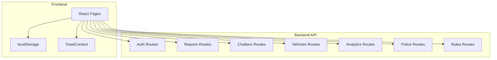

**Diagram sources**
- [CitizenDashboard.jsx:1-340](file://frontend/src/pages/CitizenDashboard.jsx#L1-L340)
- [PoliceCommand.jsx:1-207](file://frontend/src/pages/PoliceCommand.jsx#L1-L207)
- [SubmitReport.jsx:1-344](file://frontend/src/pages/SubmitReport.jsx#L1-L344)
- [Analytics.jsx:1-271](file://frontend/src/pages/Analytics.jsx#L1-L271)
- [MyReports.jsx:1-255](file://frontend/src/pages/MyReports.jsx#L1-L255)
- [MyChallans.jsx:1-207](file://frontend/src/pages/MyChallans.jsx#L1-L207)
- [PaymentPage.jsx:1-481](file://frontend/src/pages/PaymentPage.jsx#L1-L481)
- [ReviewReports.jsx:1-256](file://frontend/src/pages/ReviewReports.jsx#L1-L256)
- [ChallanCreation.jsx:1-347](file://frontend/src/pages/ChallanCreation.jsx#L1-L347)
- [VehicleSearch.jsx:1-334](file://frontend/src/pages/VehicleSearch.jsx#L1-L334)

## Detailed Component Analysis

### CitizenDashboard
- Responsibilities
  - Load user profile from localStorage.
  - Fetch challans and reports via API.
  - Render summary cards and two data tables.
  - Handle payment initiation and report deletion.
  - Provide status badges and loading/error states.

- Data Flow
  - On mount, parse user from localStorage and call `/api/challans/citizen/{id}` and `/api/reports/my-reports/{id}`.
  - Payment: PUT `/api/challans/pay/{id}` followed by a refetch.
  - Deletion: DELETE `/api/reports/{id}` followed by a refetch.

- Real-time Behavior
  - No continuous polling; manual retry on connection error.

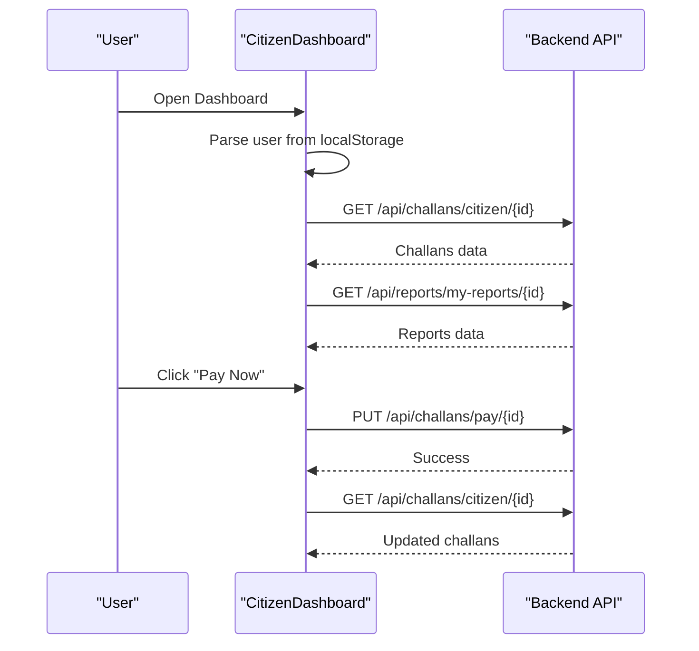

**Diagram sources**
- [CitizenDashboard.jsx:14-92](file://frontend/src/pages/CitizenDashboard.jsx#L14-L92)

**Section sources**
- [CitizenDashboard.jsx:1-340](file://frontend/src/pages/CitizenDashboard.jsx#L1-L340)

### PoliceCommand
- Responsibilities
  - Load real-time dashboard stats from `/api/analytics/police-summary`.
  - Render stat cards and quick action buttons.
  - Provide navigation to review reports, vehicle search, and analytics.

- Data Flow
  - On mount, fetch stats and render cards.
  - Quick actions navigate to `/police/review-reports`, `/vehicle-search`, `/analytics`.

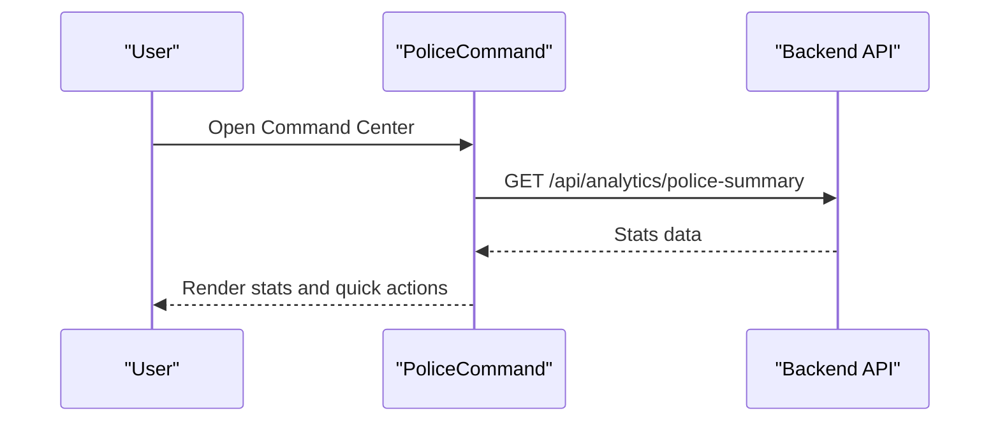

**Diagram sources**
- [PoliceCommand.jsx:20-48](file://frontend/src/pages/PoliceCommand.jsx#L20-L48)

**Section sources**
- [PoliceCommand.jsx:1-207](file://frontend/src/pages/PoliceCommand.jsx#L1-L207)

### SubmitReport
- Responsibilities
  - Capture report details (plate, violation type, location, description).
  - Validate form fields and image constraints.
  - Upload evidence image and create report via API.
  - Provide real-time preview and navigation to My Reports.

- Data Flow
  - POST `/api/reports/create` with report payload.
  - Optional: POST `/api/reports/upload-evidence/{reportId}` with FormData.
  - On success, reset form and navigate to `/my-reports`.

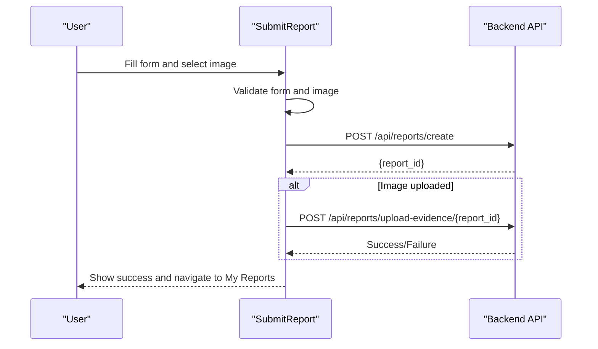

**Diagram sources**
- [SubmitReport.jsx:92-177](file://frontend/src/pages/SubmitReport.jsx#L92-L177)

**Section sources**
- [SubmitReport.jsx:1-344](file://frontend/src/pages/SubmitReport.jsx#L1-L344)

### Analytics
- Responsibilities
  - Fetch role-specific analytics and violation type breakdown.
  - Render summary cards and interactive charts (bar and pie).
  - Handle loading, error states, and retry.

- Data Flow
  - Determine user role from localStorage.
  - GET `/api/analytics/citizen/{id}` or `/api/analytics/police/system`.
  - GET `/api/analytics/violation-types`.
  - Prepare datasets for Recharts.

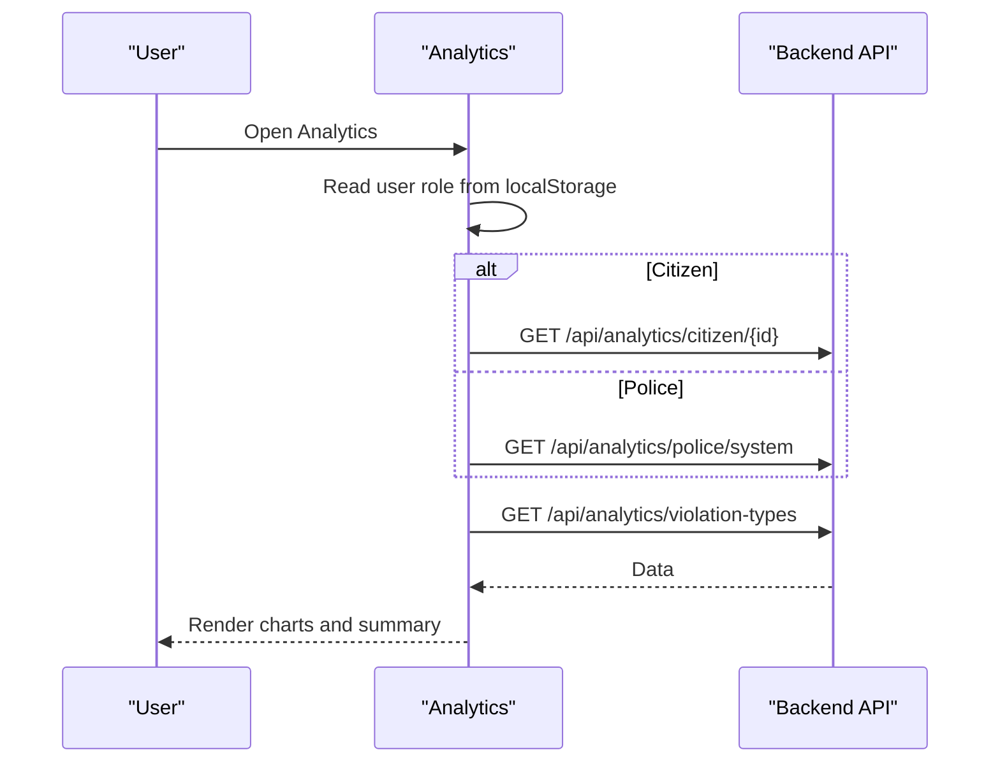

**Diagram sources**
- [Analytics.jsx:19-57](file://frontend/src/pages/Analytics.jsx#L19-L57)

**Section sources**
- [Analytics.jsx:1-271](file://frontend/src/pages/Analytics.jsx#L1-L271)

### MyReports
- Responsibilities
  - List citizen's reports with status badges.
  - Edit or delete reports when status is Pending.
  - Real-time updates via periodic polling.

- Data Flow
  - GET `/api/reports/my-reports/{id}` on mount and every 3 seconds.
  - PUT `/api/reports/update/{reportId}` for edits.
  - DELETE `/api/reports/delete/{reportId}` for deletions.

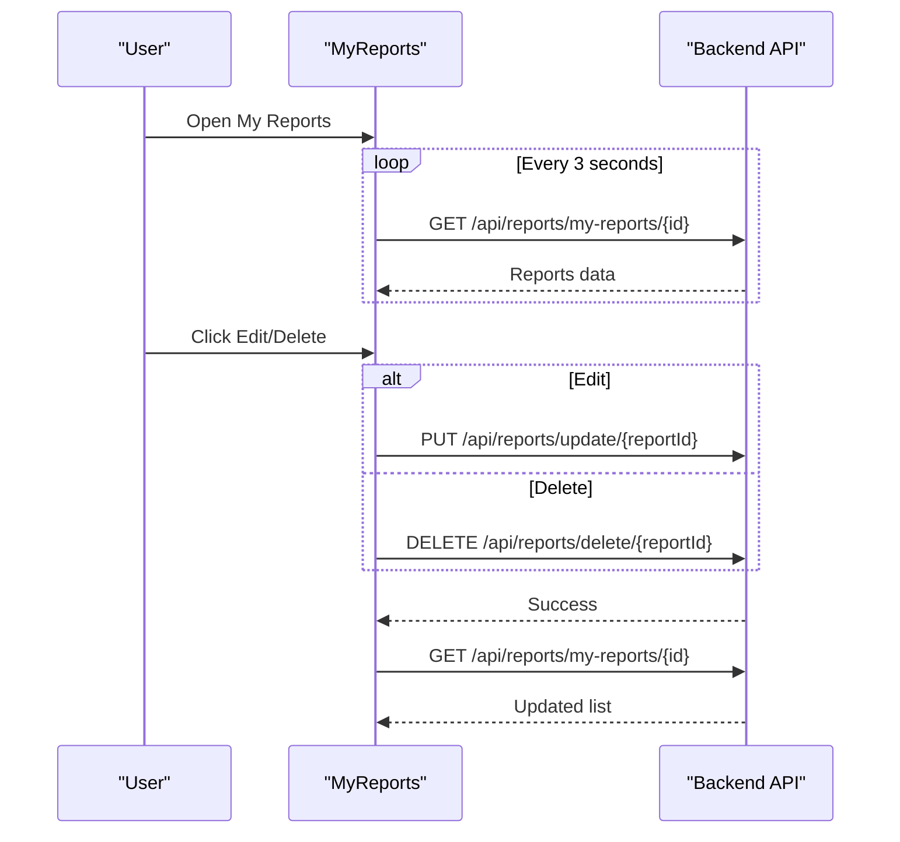

**Diagram sources**
- [MyReports.jsx:13-95](file://frontend/src/pages/MyReports.jsx#L13-L95)

**Section sources**
- [MyReports.jsx:1-255](file://frontend/src/pages/MyReports.jsx#L1-L255)

### MyChallans
- Responsibilities
  - Display citizen's challans with summary cards.
  - Initiate payment for Unpaid challans.
  - Real-time updates via periodic polling.

- Data Flow
  - GET `/api/challans/my?citizen_id={id}` on mount and every 3 seconds.
  - Navigation to `/payment/{challanId}` for Unpaid challans.

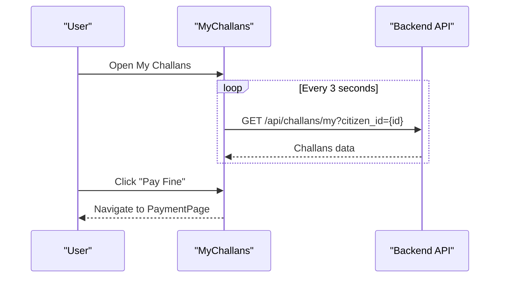

**Diagram sources**
- [MyChallans.jsx:14-44](file://frontend/src/pages/MyChallans.jsx#L14-L44)

**Section sources**
- [MyChallans.jsx:1-207](file://frontend/src/pages/MyChallans.jsx#L1-L207)

### PaymentPage
- Responsibilities
  - Display challan details and payment options.
  - Process demo payment and show success screen.
  - Integrate with terms agreement and payment method selection.

- Data Flow
  - GET `/api/challans/my?citizen_id={id}` to fetch challan details.
  - PUT `/api/challans/pay/{challanId}` to mark as paid.
  - Redirect to `/my-challans` on success.

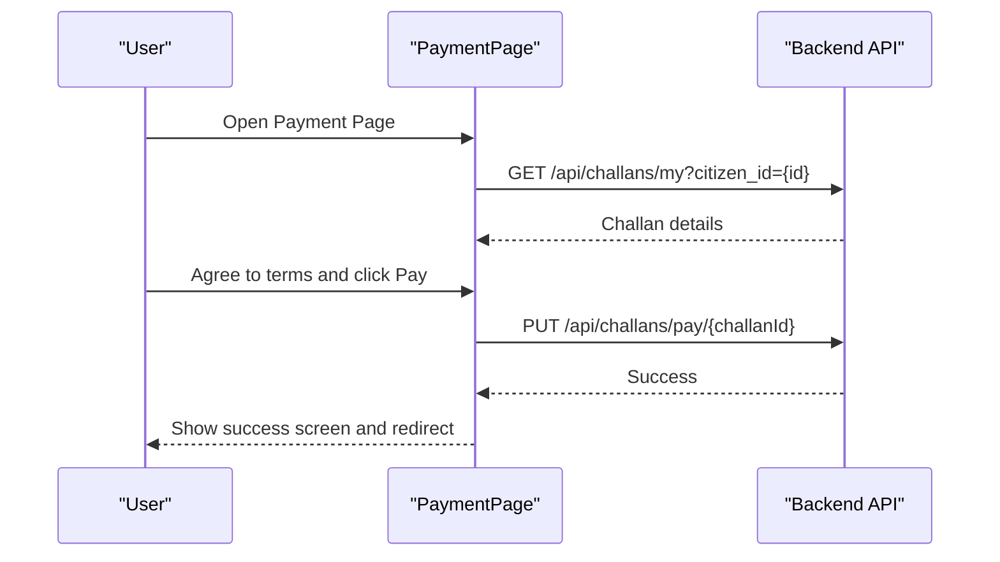

**Diagram sources**
- [PaymentPage.jsx:23-80](file://frontend/src/pages/PaymentPage.jsx#L23-L80)

**Section sources**
- [PaymentPage.jsx:1-481](file://frontend/src/pages/PaymentPage.jsx#L1-L481)

### ReviewReports
- Responsibilities
  - Display pending reports for police review.
  - Verify reports to create challans or reject/delete records.
  - Real-time updates via periodic polling.

- Data Flow
  - GET `/api/reports/police/pending` on mount and every 3 seconds.
  - PUT `/api/reports/police/process/{reportId}` to reject.
  - DELETE `/api/reports/{reportId}` to delete.
  - Navigate to `/police/create-challan/{reportId}` on verify.

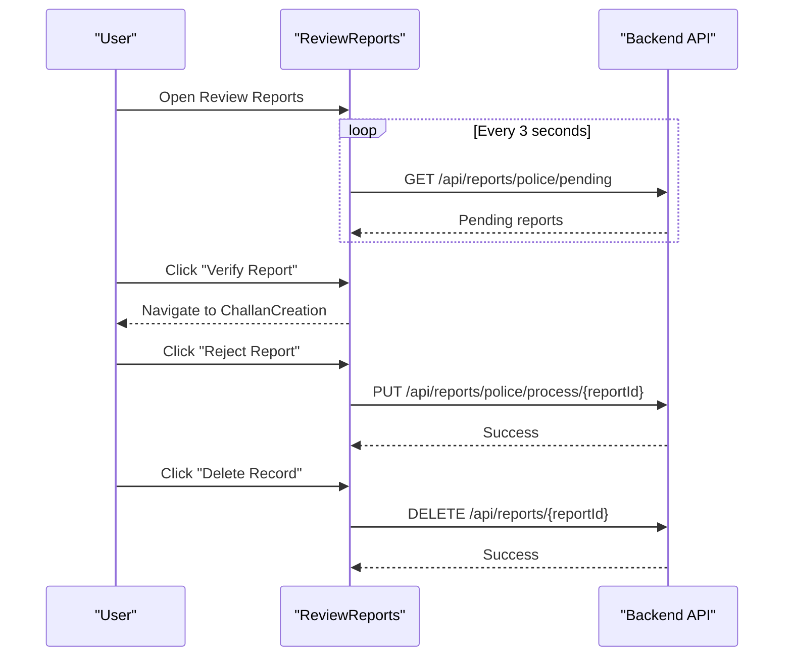

**Diagram sources**
- [ReviewReports.jsx:14-108](file://frontend/src/pages/ReviewReports.jsx#L14-L108)

**Section sources**
- [ReviewReports.jsx:1-256](file://frontend/src/pages/ReviewReports.jsx#L1-L256)

### ChallanCreation
- Responsibilities
  - Load report details and available rules.
  - Create challans with selected rule and fine amount.
  - Provide officer badge number context.

- Data Flow
  - GET `/api/challans/report/{reportId}` for report details.
  - GET `/api/rules/all` for available rules.
  - POST `/api/challans/create` with rule_id, badge_no, total_amount, notes.

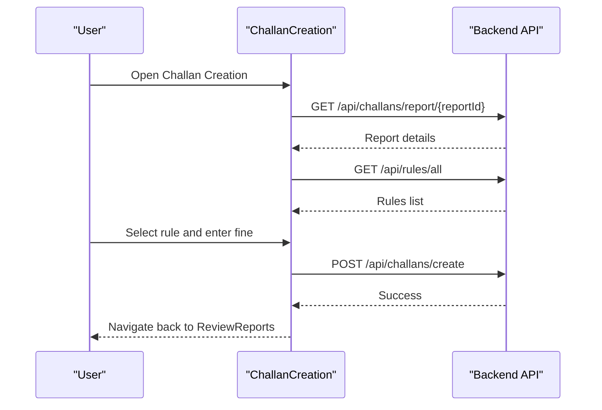

**Diagram sources**
- [ChallanCreation.jsx:29-114](file://frontend/src/pages/ChallanCreation.jsx#L29-L114)

**Section sources**
- [ChallanCreation.jsx:1-347](file://frontend/src/pages/ChallanCreation.jsx#L1-L347)

### VehicleSearch
- Responsibilities
  - Search vehicle by plate number and display registration and violation history.
  - Show summary statistics and status badges.

- Data Flow
  - POST `/api/vehicles/search/{plateNo}` with plate number.
  - Display vehicle profile, summary, and violation history table.

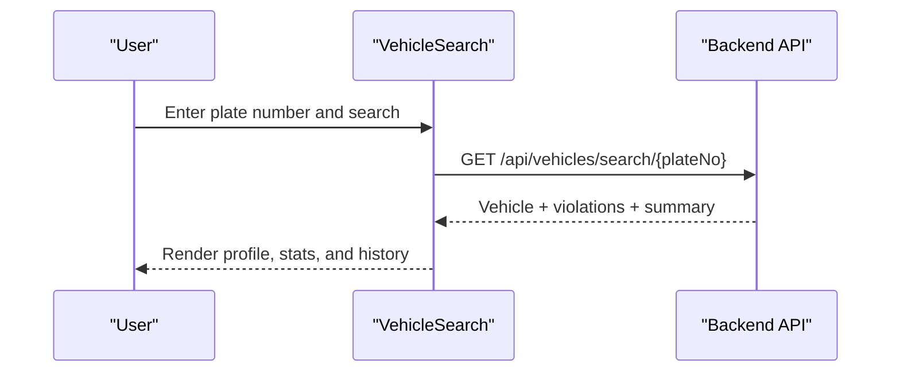

**Diagram sources**
- [VehicleSearch.jsx:13-44](file://frontend/src/pages/VehicleSearch.jsx#L13-L44)

**Section sources**
- [VehicleSearch.jsx:1-334](file://frontend/src/pages/VehicleSearch.jsx#L1-L334)

## Dependency Analysis
- Internal Dependencies
  - All pages depend on shared UI components (`BaseComponents.jsx`) and context providers (`ToastContext.jsx`, `ThemeContext.jsx`).
  - Pages use `useNavigate` and `useParams` for routing and modal-like flows.

- External Dependencies
  - Recharts for Analytics charts.
  - Local storage for user/session persistence.
  - Toast notifications for user feedback.

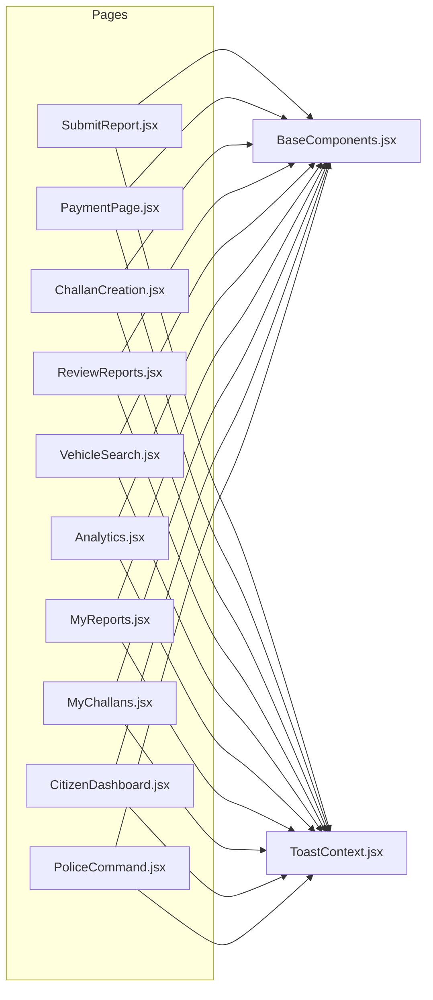

**Diagram sources**
- [SubmitReport.jsx:1-5](file://frontend/src/pages/SubmitReport.jsx#L1-L5)
- [PaymentPage.jsx:1-5](file://frontend/src/pages/PaymentPage.jsx#L1-L5)
- [ChallanCreation.jsx:1-5](file://frontend/src/pages/ChallanCreation.jsx#L1-L5)
- [ReviewReports.jsx:1-5](file://frontend/src/pages/ReviewReports.jsx#L1-L5)
- [VehicleSearch.jsx:1-5](file://frontend/src/pages/VehicleSearch.jsx#L1-L5)
- [Analytics.jsx:1-3](file://frontend/src/pages/Analytics.jsx#L1-L3)
- [MyReports.jsx:1-3](file://frontend/src/pages/MyReports.jsx#L1-L3)
- [MyChallans.jsx:1-4](file://frontend/src/pages/MyChallans.jsx#L1-L4)
- [CitizenDashboard.jsx:1-8](file://frontend/src/pages/CitizenDashboard.jsx#L1-L8)
- [PoliceCommand.jsx:1-6](file://frontend/src/pages/PoliceCommand.jsx#L1-L6)

**Section sources**
- [SubmitReport.jsx:1-5](file://frontend/src/pages/SubmitReport.jsx#L1-L5)
- [PaymentPage.jsx:1-5](file://frontend/src/pages/PaymentPage.jsx#L1-L5)
- [ChallanCreation.jsx:1-5](file://frontend/src/pages/ChallanCreation.jsx#L1-L5)
- [ReviewReports.jsx:1-5](file://frontend/src/pages/ReviewReports.jsx#L1-L5)
- [VehicleSearch.jsx:1-5](file://frontend/src/pages/VehicleSearch.jsx#L1-L5)
- [Analytics.jsx:1-3](file://frontend/src/pages/Analytics.jsx#L1-L3)
- [MyReports.jsx:1-3](file://frontend/src/pages/MyReports.jsx#L1-L3)
- [MyChallans.jsx:1-4](file://frontend/src/pages/MyChallans.jsx#L1-L4)
- [CitizenDashboard.jsx:1-8](file://frontend/src/pages/CitizenDashboard.jsx#L1-L8)
- [PoliceCommand.jsx:1-6](file://frontend/src/pages/PoliceCommand.jsx#L1-L6)

## Performance Considerations
- Real-time Sync
  - MyReports and MyChallans use 3-second intervals for live updates. Consider debouncing or adjusting intervals based on load.
- Image Upload
  - SubmitReport enforces image type and size limits to prevent large payloads. Consider client-side compression for better UX.
- API Calls
  - Analytics fetches two endpoints; consider combining endpoints on the backend to reduce round trips.
- Rendering
  - Large tables (ReviewReports, VehicleSearch) can benefit from virtualization for better scrolling performance.

## Troubleshooting Guide
- Authentication Issues
  - Ensure user data exists in localStorage. Pages read from localStorage for user context and token for protected routes.
- API Connectivity
  - Pages display connection errors and provide retry mechanisms. Check network tab for 5xx/4xx responses.
- Toast Notifications
  - Use success and error toast handlers for immediate feedback on actions like payment, report deletion, and rule updates.
- Real-time Updates
  - If data does not refresh, verify the polling intervals and confirm backend endpoints are reachable.

**Section sources**
- [CitizenDashboard.jsx:14-48](file://frontend/src/pages/CitizenDashboard.jsx#L14-L48)
- [MyReports.jsx:23-44](file://frontend/src/pages/MyReports.jsx#L23-L44)
- [MyChallans.jsx:23-36](file://frontend/src/pages/MyChallans.jsx#L23-L36)
- [PaymentPage.jsx:38-44](file://frontend/src/pages/PaymentPage.jsx#L38-L44)
- [ReviewReports.jsx:37-61](file://frontend/src/pages/ReviewReports.jsx#L37-L61)
- [Analytics.jsx:24-28](file://frontend/src/pages/Analytics.jsx#L24-L28)

## Conclusion
The page components collectively deliver a comprehensive traffic violation management experience for both citizens and law enforcement. They emphasize real-time updates, robust form validation, secure API interactions, and intuitive user interfaces. The modular structure and shared contexts enable maintainability and scalability across future enhancements.