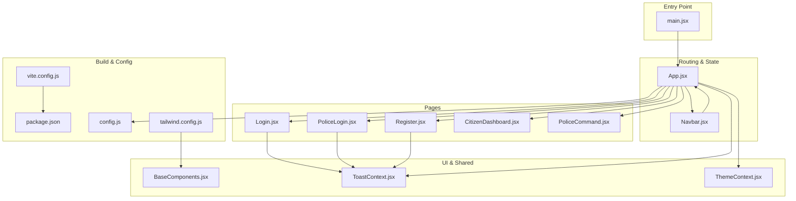
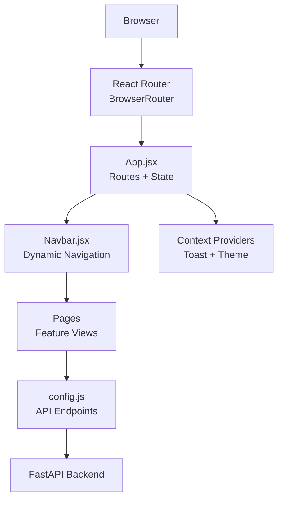
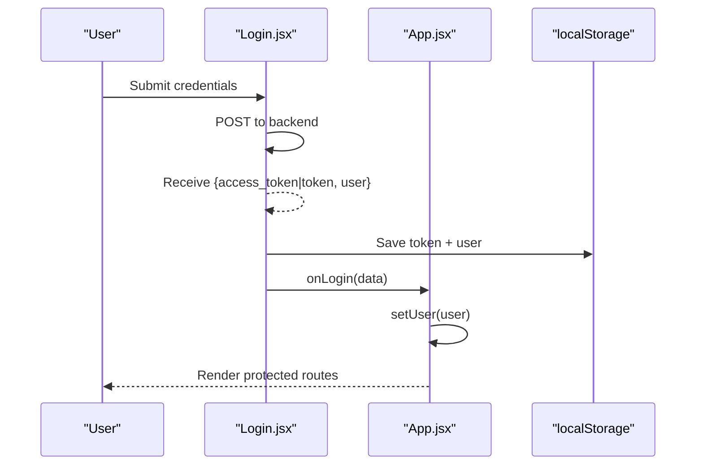
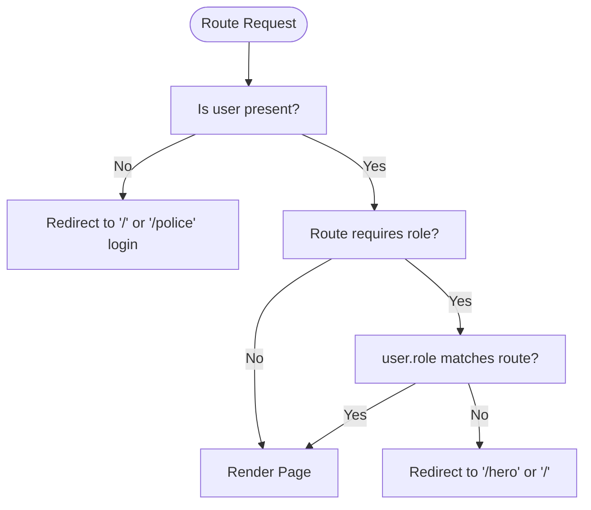
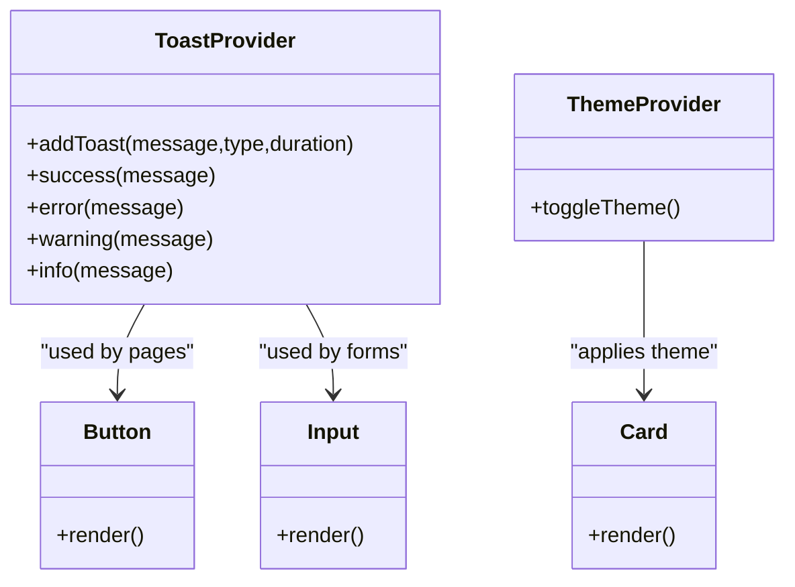
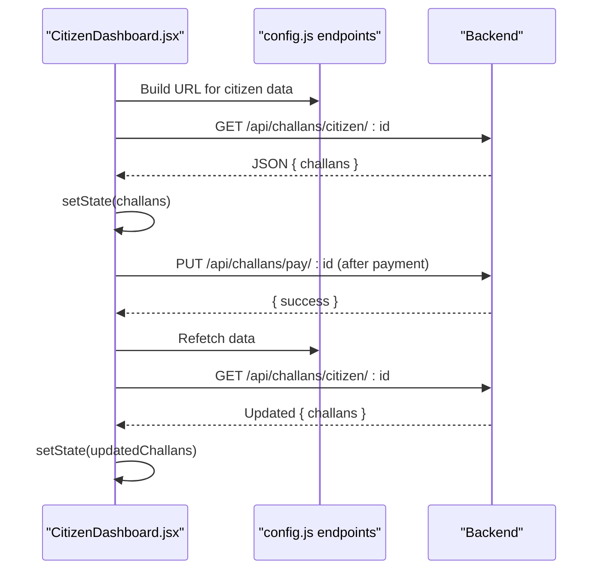
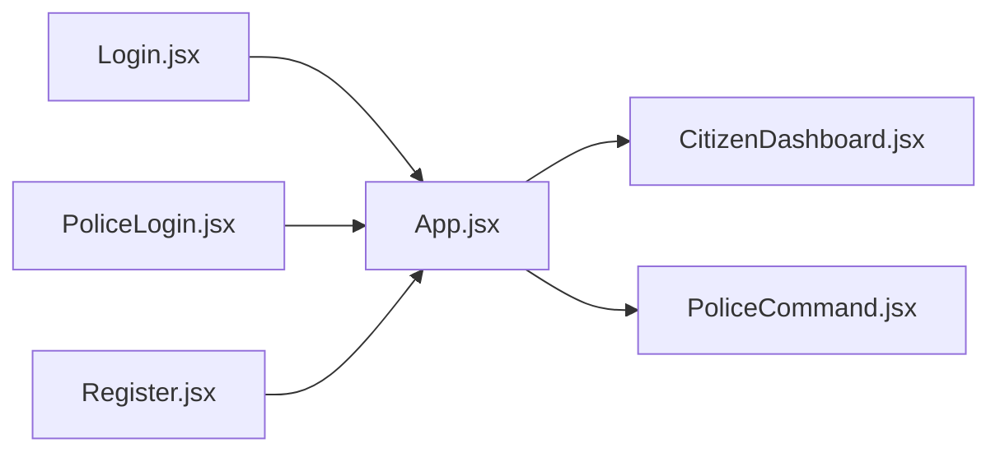
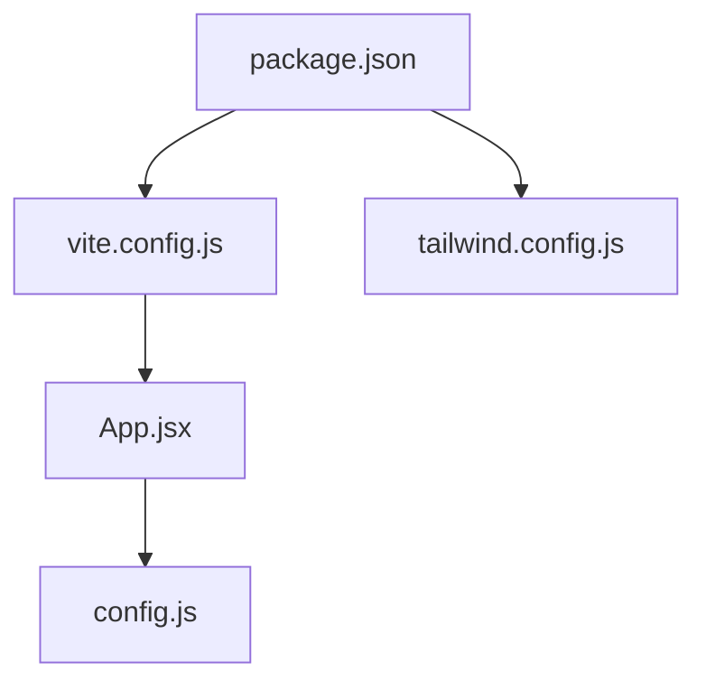

# React Application Architecture

<cite>
**Referenced Files in This Document**
- [main.jsx](file://frontend/src/main.jsx)
- [App.jsx](file://frontend/src/App.jsx)
- [config.js](file://frontend/src/config.js)
- [vite.config.js](file://frontend/vite.config.js)
- [package.json](file://frontend/package.json)
- [Login.jsx](file://frontend/src/pages/Login.jsx)
- [PoliceLogin.jsx](file://frontend/src/pages/PoliceLogin.jsx)
- [Register.jsx](file://frontend/src/pages/Register.jsx)
- [ToastContext.jsx](file://frontend/src/context/ToastContext.jsx)
- [ThemeContext.jsx](file://frontend/src/context/ThemeContext.jsx)
- [BaseComponents.jsx](file://frontend/src/components/ui/BaseComponents.jsx)
- [Navbar.jsx](file://frontend/src/components/Navbar.jsx)
- [CitizenDashboard.jsx](file://frontend/src/pages/CitizenDashboard.jsx)
- [PoliceCommand.jsx](file://frontend/src/pages/PoliceCommand.jsx)
- [tailwind.config.js](file://frontend/tailwind.config.js)
</cite>

## Table of Contents
1. [Introduction](#introduction)
2. [Project Structure](#project-structure)
3. [Core Components](#core-components)
4. [Architecture Overview](#architecture-overview)
5. [Detailed Component Analysis](#detailed-component-analysis)
6. [Dependency Analysis](#dependency-analysis)
7. [Performance Considerations](#performance-considerations)
8. [Troubleshooting Guide](#troubleshooting-guide)
9. [Conclusion](#conclusion)

## Introduction
This document explains the React application architecture for the Traffic Violation Management System. It focuses on the component hierarchy starting from the application entry point, the routing configuration with protected routes and role-based access control, authentication state management using localStorage persistence, and the Vite build configuration. It also covers component composition patterns, architectural decisions, route guards, authentication flow, state synchronization, performance considerations, and bundle optimization techniques.

## Project Structure
The frontend is organized around a clear separation of concerns:
- Entry point initializes the React app with React Router and global styles.
- App.jsx defines the routing tree and manages user authentication state.
- Pages implement feature-specific views and integrate with the backend via API endpoints.
- Components provide reusable UI primitives and shared layouts.
- Context providers manage cross-cutting concerns like toasts and theme.
- Build tooling is configured with Vite, Tailwind CSS, and environment-driven API URLs.

**Diagram sources**
- [main.jsx:1-14](file://frontend/src/main.jsx#L1-L14)
- [App.jsx:1-274](file://frontend/src/App.jsx#L1-L274)
- [Navbar.jsx:1-252](file://frontend/src/components/Navbar.jsx#L1-L252)
- [Login.jsx:1-186](file://frontend/src/pages/Login.jsx#L1-L186)
- [PoliceLogin.jsx:1-186](file://frontend/src/pages/PoliceLogin.jsx#L1-L186)
- [Register.jsx:1-221](file://frontend/src/pages/Register.jsx#L1-L221)
- [CitizenDashboard.jsx:1-340](file://frontend/src/pages/CitizenDashboard.jsx#L1-L340)
- [PoliceCommand.jsx:1-207](file://frontend/src/pages/PoliceCommand.jsx#L1-L207)
- [BaseComponents.jsx:1-178](file://frontend/src/components/ui/BaseComponents.jsx#L1-L178)
- [ToastContext.jsx:1-113](file://frontend/src/context/ToastContext.jsx#L1-L113)
- [ThemeContext.jsx:1-39](file://frontend/src/context/ThemeContext.jsx#L1-L39)
- [vite.config.js:1-23](file://frontend/vite.config.js#L1-L23)
- [package.json:1-30](file://frontend/package.json#L1-L30)
- [config.js:1-34](file://frontend/src/config.js#L1-L34)
- [tailwind.config.js:1-54](file://frontend/tailwind.config.js#L1-L54)

**Section sources**
- [main.jsx:1-14](file://frontend/src/main.jsx#L1-L14)
- [App.jsx:1-274](file://frontend/src/App.jsx#L1-L274)
- [vite.config.js:1-23](file://frontend/vite.config.js#L1-L23)
- [package.json:1-30](file://frontend/package.json#L1-L30)
- [config.js:1-34](file://frontend/src/config.js#L1-L34)
- [tailwind.config.js:1-54](file://frontend/tailwind.config.js#L1-L54)

## Core Components
- Application entry point initializes React Strict Mode, React Router, and mounts the root component.
- App.jsx orchestrates routing, role-based navigation, and authentication state using localStorage.
- Pages encapsulate feature logic and integrate with backend APIs via centralized endpoints.
- Shared UI components and contexts provide consistent behavior across the app.

Key responsibilities:
- Entry point: [main.jsx:7-13](file://frontend/src/main.jsx#L7-L13)
- Routing and state: [App.jsx:27-273](file://frontend/src/App.jsx#L27-L273)
- API configuration: [config.js:1-34](file://frontend/src/config.js#L1-L34)
- UI primitives: [BaseComponents.jsx:1-178](file://frontend/src/components/ui/BaseComponents.jsx#L1-L178)
- Toast notifications: [ToastContext.jsx:13-40](file://frontend/src/context/ToastContext.jsx#L13-L40)
- Theme provider: [ThemeContext.jsx:13-38](file://frontend/src/context/ThemeContext.jsx#L13-L38)

**Section sources**
- [main.jsx:1-14](file://frontend/src/main.jsx#L1-L14)
- [App.jsx:1-274](file://frontend/src/App.jsx#L1-L274)
- [config.js:1-34](file://frontend/src/config.js#L1-L34)
- [BaseComponents.jsx:1-178](file://frontend/src/components/ui/BaseComponents.jsx#L1-L178)
- [ToastContext.jsx:1-113](file://frontend/src/context/ToastContext.jsx#L1-L113)
- [ThemeContext.jsx:1-39](file://frontend/src/context/ThemeContext.jsx#L1-L39)

## Architecture Overview
The application follows a layered architecture:
- Presentation layer: React components and pages.
- Routing and navigation: React Router with protected routes.
- State management: Local state in App.jsx plus localStorage for authentication persistence.
- Cross-cutting concerns: Toast notifications and theme management via context providers.
- Backend integration: Centralized API endpoints and environment-driven base URL.

**Diagram sources**
- [main.jsx:3-12](file://frontend/src/main.jsx#L3-L12)
- [App.jsx:1-274](file://frontend/src/App.jsx#L1-L274)
- [Navbar.jsx:1-252](file://frontend/src/components/Navbar.jsx#L1-L252)
- [config.js:1-34](file://frontend/src/config.js#L1-L34)

## Detailed Component Analysis

### Authentication and Session Management
The authentication flow persists user sessions using localStorage and synchronizes state across components:
- On login, the page saves token and user profile to localStorage and invokes a callback to update App.jsx state.
- On initial load, App.jsx restores user state from localStorage and sets up navigation accordingly.
- Logout clears localStorage and resets state.

**Diagram sources**
- [Login.jsx:15-69](file://frontend/src/pages/Login.jsx#L15-L69)
- [App.jsx:52-76](file://frontend/src/App.jsx#L52-L76)

**Section sources**
- [Login.jsx:1-186](file://frontend/src/pages/Login.jsx#L1-L186)
- [PoliceLogin.jsx:1-186](file://frontend/src/pages/PoliceLogin.jsx#L1-L186)
- [App.jsx:27-76](file://frontend/src/App.jsx#L27-L76)

### Protected Routes and Role-Based Access Control
Protected routes are enforced by checking user presence and role:
- Unauthenticated users are redirected to login or hero depending on route.
- Role checks restrict access to citizen or police-specific routes.
- Navbar adapts menu items and home path based on user role.

**Diagram sources**
- [App.jsx:81-262](file://frontend/src/App.jsx#L81-L262)
- [Navbar.jsx:59-76](file://frontend/src/components/Navbar.jsx#L59-L76)

**Section sources**
- [App.jsx:81-262](file://frontend/src/App.jsx#L81-L262)
- [Navbar.jsx:1-252](file://frontend/src/components/Navbar.jsx#L1-L252)

### Component Composition Patterns
- Reusable UI primitives: Button, Input, Card, Badge, Skeleton, Spinner in BaseComponents.jsx.
- Toast notifications: ToastProvider wraps the app to deliver global feedback.
- Theme management: ThemeProvider toggles dark mode and persists preference.
- Page composition: Pages render UI and orchestrate data fetching and actions.

**Diagram sources**
- [ToastContext.jsx:13-40](file://frontend/src/context/ToastContext.jsx#L13-L40)
- [ThemeContext.jsx:13-38](file://frontend/src/context/ThemeContext.jsx#L13-L38)
- [BaseComponents.jsx:1-178](file://frontend/src/components/ui/BaseComponents.jsx#L1-L178)

**Section sources**
- [BaseComponents.jsx:1-178](file://frontend/src/components/ui/BaseComponents.jsx#L1-L178)
- [ToastContext.jsx:1-113](file://frontend/src/context/ToastContext.jsx#L1-L113)
- [ThemeContext.jsx:1-39](file://frontend/src/context/ThemeContext.jsx#L1-L39)

### Data Fetching and State Synchronization
- Pages fetch data from backend endpoints and update local state.
- CitizenDashboard demonstrates loading states, error handling, and refresh after actions.
- State synchronization occurs by re-fetching data after mutations (e.g., payment or deletion).

**Diagram sources**
- [CitizenDashboard.jsx:27-92](file://frontend/src/pages/CitizenDashboard.jsx#L27-L92)
- [config.js:24-26](file://frontend/src/config.js#L24-L26)

**Section sources**
- [CitizenDashboard.jsx:1-340](file://frontend/src/pages/CitizenDashboard.jsx#L1-L340)
- [config.js:1-34](file://frontend/src/config.js#L1-L34)

### Example Pages and Navigation
- Login and PoliceLogin pages handle form submission, error messaging, and redirect after successful authentication.
- Register page validates and submits user registration data.
- PoliceCommand and CitizenDashboard demonstrate role-specific dashboards with summary cards and actionable lists.

**Diagram sources**
- [Login.jsx:1-186](file://frontend/src/pages/Login.jsx#L1-L186)
- [PoliceLogin.jsx:1-186](file://frontend/src/pages/PoliceLogin.jsx#L1-L186)
- [Register.jsx:1-221](file://frontend/src/pages/Register.jsx#L1-L221)
- [App.jsx:13-255](file://frontend/src/App.jsx#L13-L255)
- [CitizenDashboard.jsx:1-340](file://frontend/src/pages/CitizenDashboard.jsx#L1-L340)
- [PoliceCommand.jsx:1-207](file://frontend/src/pages/PoliceCommand.jsx#L1-L207)

**Section sources**
- [Login.jsx:1-186](file://frontend/src/pages/Login.jsx#L1-L186)
- [PoliceLogin.jsx:1-186](file://frontend/src/pages/PoliceLogin.jsx#L1-L186)
- [Register.jsx:1-221](file://frontend/src/pages/Register.jsx#L1-L221)
- [CitizenDashboard.jsx:1-340](file://frontend/src/pages/CitizenDashboard.jsx#L1-L340)
- [PoliceCommand.jsx:1-207](file://frontend/src/pages/PoliceCommand.jsx#L1-L207)

## Dependency Analysis
- Runtime dependencies include React, React Router DOM, and UI libraries.
- Build-time dependencies include Vite, Tailwind CSS, PostCSS, and React plugin.
- Environment variables drive API base URL, enabling flexible deployment targets.

**Diagram sources**
- [package.json:11-28](file://frontend/package.json#L11-L28)
- [vite.config.js:1-23](file://frontend/vite.config.js#L1-L23)
- [tailwind.config.js:1-54](file://frontend/tailwind.config.js#L1-L54)
- [App.jsx:1-274](file://frontend/src/App.jsx#L1-L274)
- [config.js:1-34](file://frontend/src/config.js#L1-L34)

**Section sources**
- [package.json:1-30](file://frontend/package.json#L1-L30)
- [vite.config.js:1-23](file://frontend/vite.config.js#L1-L23)
- [tailwind.config.js:1-54](file://frontend/tailwind.config.js#L1-L54)
- [config.js:1-34](file://frontend/src/config.js#L1-L34)

## Performance Considerations
- Build configuration: Vite provides fast dev server and optimized production builds.
- Proxy configuration: Local development proxies API requests to the backend server.
- Bundle optimization: Use code splitting and lazy loading for large pages to reduce initial bundle size.
- UI rendering: Prefer memoization and efficient list rendering; avoid unnecessary re-renders by isolating state.
- Network efficiency: Centralize API endpoints and reuse them across pages to minimize duplication.
- Styling: Tailwind CSS utility classes enable rapid UI iteration; ensure purge configuration removes unused styles in production.

[No sources needed since this section provides general guidance]

## Troubleshooting Guide
Common issues and resolutions:
- Authentication persistence errors: Verify localStorage keys and parsing logic in App.jsx and login pages.
- API connectivity: Confirm API base URL and endpoint correctness in config.js; check network tab for failures.
- Toast visibility: Ensure ToastProvider wraps the application root and that toasts are rendered conditionally.
- Theme persistence: Confirm theme provider updates document class and localStorage appropriately.

**Section sources**
- [App.jsx:30-50](file://frontend/src/App.jsx#L30-L50)
- [Login.jsx:55-62](file://frontend/src/pages/Login.jsx#L55-L62)
- [ToastContext.jsx:13-40](file://frontend/src/context/ToastContext.jsx#L13-L40)
- [ThemeContext.jsx:13-38](file://frontend/src/context/ThemeContext.jsx#L13-L38)
- [config.js:1-34](file://frontend/src/config.js#L1-L34)

## Conclusion
The application employs a clean, modular architecture with React Router managing protected routes and role-based access control, localStorage for authentication persistence, and centralized API configuration. Component composition via shared UI primitives and context providers ensures consistency and maintainability. With Vite’s development server and Tailwind CSS, the project balances developer productivity with a modern, responsive UI. Adopting lazy loading and further optimizing bundle size will improve runtime performance, while continued adherence to centralized configuration and context patterns will support scalability.