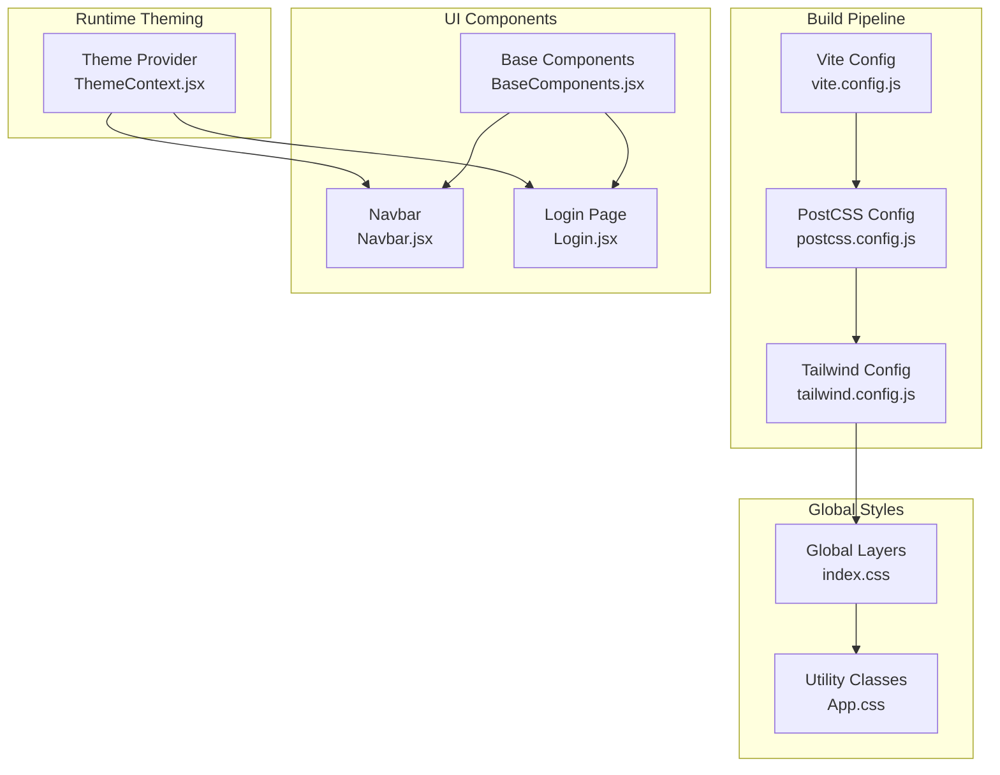
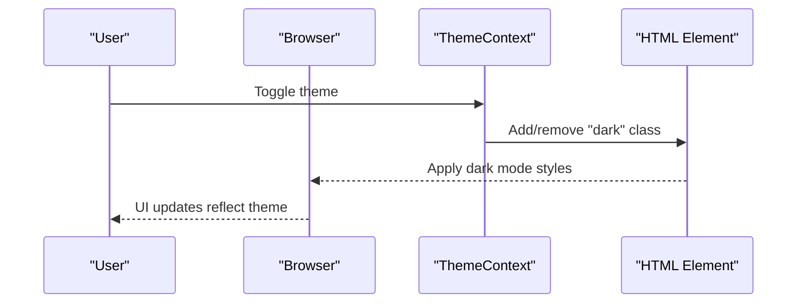
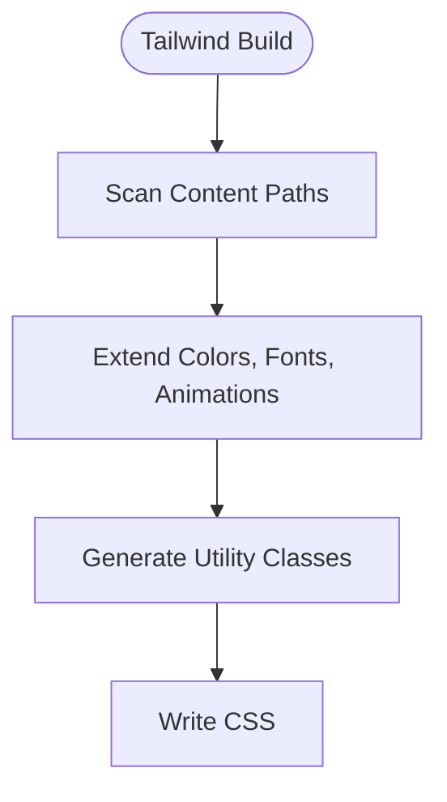
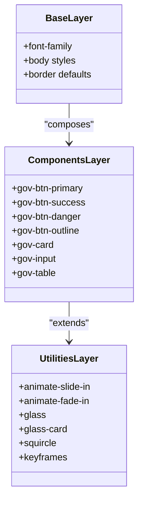
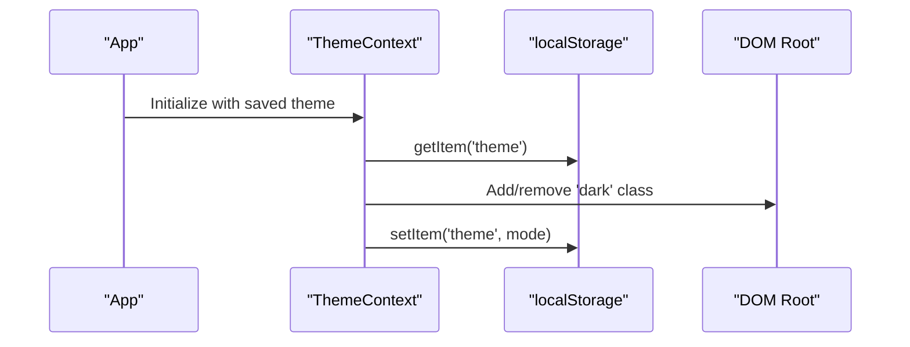
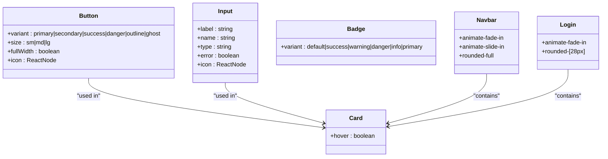
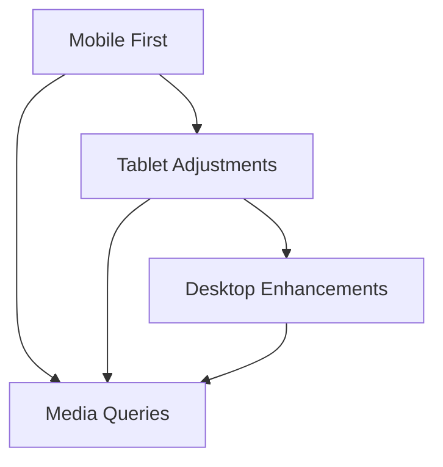
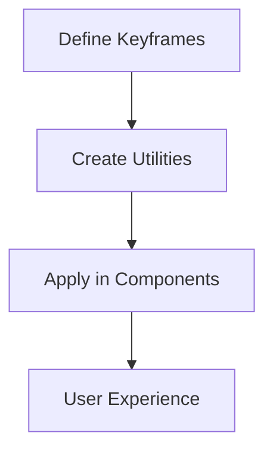
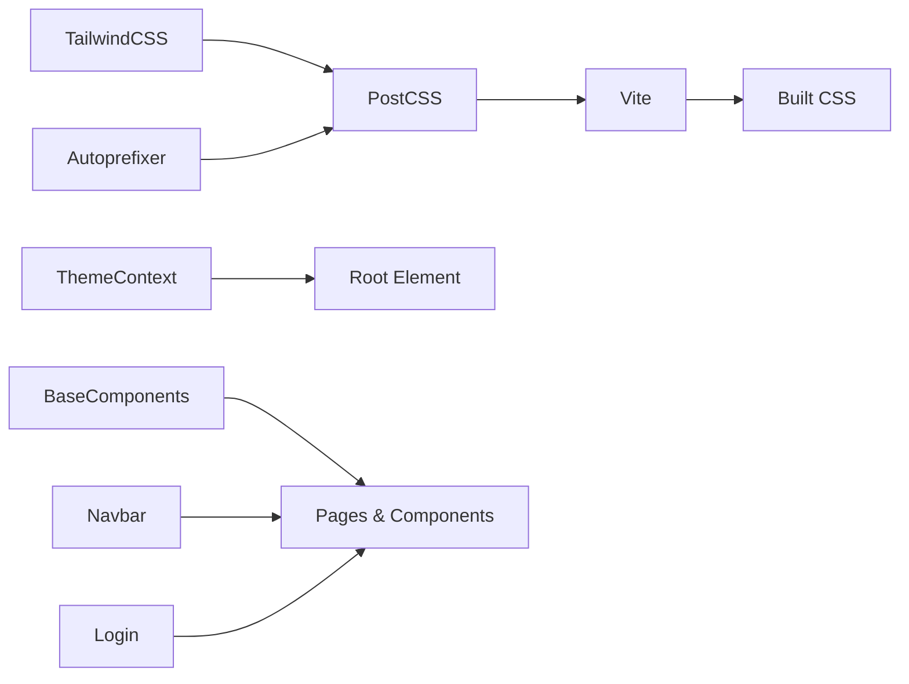

# Styling and Theming

<cite>
**Referenced Files in This Document**
- [tailwind.config.js](file://frontend/tailwind.config.js)
- [postcss.config.js](file://frontend/postcss.config.js)
- [vite.config.js](file://frontend/vite.config.js)
- [package.json](file://frontend/package.json)
- [index.css](file://frontend/src/index.css)
- [App.css](file://frontend/src/App.css)
- [ThemeContext.jsx](file://frontend/src/context/ThemeContext.jsx)
- [BaseComponents.jsx](file://frontend/src/components/ui/BaseComponents.jsx)
- [Navbar.jsx](file://frontend/src/components/Navbar.jsx)
- [Login.jsx](file://frontend/src/pages/Login.jsx)
- [App.jsx](file://frontend/src/App.jsx)
- [main.jsx](file://frontend/src/main.jsx)
</cite>

## Table of Contents
1. [Introduction](#introduction)
2. [Project Structure](#project-structure)
3. [Core Components](#core-components)
4. [Architecture Overview](#architecture-overview)
5. [Detailed Component Analysis](#detailed-component-analysis)
6. [Dependency Analysis](#dependency-analysis)
7. [Performance Considerations](#performance-considerations)
8. [Troubleshooting Guide](#troubleshooting-guide)
9. [Conclusion](#conclusion)

## Introduction
This document describes the styling and theming system for the traffic violation management platform. It covers TailwindCSS configuration, custom color palettes, utility classes, animations, responsive design patterns, dark/light mode implementation via CSS variables and class toggling, and the PostCSS pipeline. It also documents the build process and deployment considerations for CSS optimization.

## Project Structure
The styling system is organized around TailwindCSS and PostCSS, with custom CSS layers and a React-based theming provider. Key files include:
- Tailwind configuration for extending colors, fonts, animations, and keyframes
- PostCSS configuration enabling Tailwind and Autoprefixer
- Global CSS layers for base styles, component utilities, and animations
- A theme context provider for runtime light/dark mode switching
- Reusable UI components that apply consistent styling

**Diagram sources**
- [vite.config.js:1-23](file://frontend/vite.config.js#L1-L23)
- [postcss.config.js:1-7](file://frontend/postcss.config.js#L1-L7)
- [tailwind.config.js:1-54](file://frontend/tailwind.config.js#L1-L54)
- [index.css:1-189](file://frontend/src/index.css#L1-L189)
- [App.css:1-185](file://frontend/src/App.css#L1-L185)
- [ThemeContext.jsx:1-39](file://frontend/src/context/ThemeContext.jsx#L1-L39)
- [BaseComponents.jsx:1-178](file://frontend/src/components/ui/BaseComponents.jsx#L1-L178)
- [Navbar.jsx:1-252](file://frontend/src/components/Navbar.jsx#L1-L252)
- [Login.jsx:1-186](file://frontend/src/pages/Login.jsx#L1-L186)

**Section sources**
- [vite.config.js:1-23](file://frontend/vite.config.js#L1-L23)
- [postcss.config.js:1-7](file://frontend/postcss.config.js#L1-L7)
- [tailwind.config.js:1-54](file://frontend/tailwind.config.js#L1-L54)
- [index.css:1-189](file://frontend/src/index.css#L1-L189)
- [App.css:1-185](file://frontend/src/App.css#L1-L185)
- [ThemeContext.jsx:1-39](file://frontend/src/context/ThemeContext.jsx#L1-L39)

## Core Components
- TailwindCSS configuration extends:
  - Colors: primary palette and a neutral beige palette
  - Typography: Inter font stack
  - Animation utilities and keyframes for slide-in, fade-in, and float
- PostCSS pipeline:
  - TailwindCSS plugin
  - Autoprefixer for vendor prefixes
- Global CSS layers:
  - Base layer sets font family and default body styles
  - Components layer defines reusable gov-* utilities
  - Utilities layer adds animation helpers and glass-like effects
- Theme provider:
  - Persists theme preference in localStorage
  - Adds/removes a class on the root element to switch dark mode

**Section sources**
- [tailwind.config.js:7-51](file://frontend/tailwind.config.js#L7-L51)
- [postcss.config.js:1-7](file://frontend/postcss.config.js#L1-L7)
- [index.css:5-90](file://frontend/src/index.css#L5-L90)
- [ThemeContext.jsx:13-38](file://frontend/src/context/ThemeContext.jsx#L13-L38)

## Architecture Overview
The styling architecture integrates TailwindCSS with PostCSS and React theming:
- Tailwind generates utility classes from the configuration
- PostCSS compiles Tailwind and applies vendor prefixes
- Global layers define base styles and component utilities
- The theme provider toggles a class on the root element for dark mode
- Components consume Tailwind utilities and custom CSS classes

**Diagram sources**
- [ThemeContext.jsx:19-27](file://frontend/src/context/ThemeContext.jsx#L19-L27)

## Detailed Component Analysis

### TailwindCSS Configuration
- Content scanning targets HTML and JSX under src
- Extended theme:
  - Primary palette with 50–900 shades for branding
  - Neutral beige palette for subtle backgrounds
  - Inter font stack for modern typography
  - Animation utilities and keyframes for UI micro-interactions

**Diagram sources**
- [tailwind.config.js:3-51](file://frontend/tailwind.config.js#L3-L51)

**Section sources**
- [tailwind.config.js:3-51](file://frontend/tailwind.config.js#L3-L51)

### Global CSS Architecture
- Base layer:
  - Sets font family and default body styles
  - Applies default border colors
- Components layer:
  - Defines government-themed button variants (primary, success, danger, outline)
  - Card, input, table utilities with consistent spacing and focus states
- Utilities layer:
  - Animation helpers (slide-in, fade-in)
  - Glass morphism utilities and rounded corner variants
  - Keyframes for typing, glow, staggered fade-in, float, and pulse-glow

**Diagram sources**
- [index.css:5-90](file://frontend/src/index.css#L5-L90)

**Section sources**
- [index.css:5-90](file://frontend/src/index.css#L5-L90)

### Dark/Light Mode Implementation
- Theme provider:
  - Reads saved theme from localStorage
  - Adds/removes a class on the root element to switch modes
  - Persists user preference
- Runtime behavior:
  - Consumers can rely on the class on the root element to drive dark styles
  - No explicit CSS variable overrides are present in the current configuration

**Diagram sources**
- [ThemeContext.jsx:14-27](file://frontend/src/context/ThemeContext.jsx#L14-L27)

**Section sources**
- [ThemeContext.jsx:14-38](file://frontend/src/context/ThemeContext.jsx#L14-L38)

### Component Styling Examples
- Base components:
  - Button variants and sizes integrate Tailwind utilities and focus rings
  - Input composes focus states and error styling
  - Card supports hover elevation and transitions
  - Badge variants for status indicators
  - Skeleton and Spinner for loading states
- Navbar:
  - Uses animation utilities for dropdown and mobile menu
  - Rounded card styling for profile and mobile menus
- Login page:
  - Leverages animation utilities for entrance effects
  - Custom rounded styling for the card container

**Diagram sources**
- [BaseComponents.jsx:1-178](file://frontend/src/components/ui/BaseComponents.jsx#L1-L178)
- [Navbar.jsx:136-246](file://frontend/src/components/Navbar.jsx#L136-L246)
- [Login.jsx:88-175](file://frontend/src/pages/Login.jsx#L88-L175)

**Section sources**
- [BaseComponents.jsx:1-178](file://frontend/src/components/ui/BaseComponents.jsx#L1-L178)
- [Navbar.jsx:136-246](file://frontend/src/components/Navbar.jsx#L136-L246)
- [Login.jsx:88-175](file://frontend/src/pages/Login.jsx#L88-L175)

### Responsive Design Patterns
- Mobile-first approach:
  - Breakpoint-driven adjustments in global and component styles
  - Media queries for tablet and smaller screens
- Component responsiveness:
  - Flex layouts with gap and alignment utilities
  - Conditional padding and spacing adjustments
  - Grid and flex utilities for adaptive layouts

**Diagram sources**
- [App.css:67-96](file://frontend/src/App.css#L67-L96)
- [index.css:66-90](file://frontend/src/index.css#L66-L90)

**Section sources**
- [App.css:67-96](file://frontend/src/App.css#L67-L96)
- [index.css:66-90](file://frontend/src/index.css#L66-L90)

### Accessibility Considerations
- Focus management:
  - Consistent focus ring utilities on interactive elements
  - Focus-visible outlines for keyboard navigation
- Color contrast:
  - Primary and neutral palettes selected for readability
  - Error states use red palette for clear feedback
- Semantic markup:
  - Components render semantic HTML elements (button, input, label)
- ARIA and roles:
  - Dropdowns and menus use appropriate ARIA attributes and event handlers

**Section sources**
- [BaseComponents.jsx:85-95](file://frontend/src/components/ui/BaseComponents.jsx#L85-L95)
- [Navbar.jsx:117-133](file://frontend/src/components/Navbar.jsx#L117-L133)

### Animation Effects and Transitions
- Defined animations:
  - Slide-in, fade-in, float, typing, glow, staggered-fade-in, pulse-glow
- Usage:
  - Applied via utility classes on components and pages
  - Smooth transitions for hover and focus states

**Diagram sources**
- [index.css:92-188](file://frontend/src/index.css#L92-L188)

**Section sources**
- [index.css:92-188](file://frontend/src/index.css#L92-L188)

## Dependency Analysis
- Build dependencies:
  - TailwindCSS, PostCSS, Autoprefixer, Vite
- Runtime dependencies:
  - React, React Router DOM
- Theming and UI:
  - Theme provider manages theme state and persistence
  - Base components encapsulate shared styling patterns

**Diagram sources**
- [package.json:11-29](file://frontend/package.json#L11-L29)
- [postcss.config.js:1-7](file://frontend/postcss.config.js#L1-L7)
- [vite.config.js:1-23](file://frontend/vite.config.js#L1-L23)
- [ThemeContext.jsx:1-39](file://frontend/src/context/ThemeContext.jsx#L1-L39)
- [BaseComponents.jsx:1-178](file://frontend/src/components/ui/BaseComponents.jsx#L1-L178)
- [Navbar.jsx:1-252](file://frontend/src/components/Navbar.jsx#L1-L252)
- [Login.jsx:1-186](file://frontend/src/pages/Login.jsx#L1-L186)

**Section sources**
- [package.json:11-29](file://frontend/package.json#L11-L29)
- [postcss.config.js:1-7](file://frontend/postcss.config.js#L1-L7)
- [vite.config.js:1-23](file://frontend/vite.config.js#L1-L23)

## Performance Considerations
- Purge unused CSS:
  - Tailwind’s content scanning targets HTML and JSX to remove unused styles
- Minification and bundling:
  - Vite builds and bundles CSS during production builds
- Font rendering:
  - Subpixel antialiasing applied for smoother text rendering
- Animation performance:
  - Prefer transform and opacity for smooth animations
  - Limit expensive properties like layout and paint during animations

**Section sources**
- [tailwind.config.js:3-6](file://frontend/tailwind.config.js#L3-L6)
- [index.css:7-10](file://frontend/src/index.css#L7-L10)
- [index.css:173-188](file://frontend/src/index.css#L173-L188)

## Troubleshooting Guide
- Theme not persisting:
  - Verify localStorage availability and correct key usage
  - Ensure the root element receives the class for dark mode
- Animations not playing:
  - Confirm utility classes are applied and keyframes are defined
  - Check for conflicting styles overriding animations
- Build errors:
  - Validate PostCSS and Tailwind versions match devDependencies
  - Ensure Tailwind directives are present in global CSS

**Section sources**
- [ThemeContext.jsx:14-27](file://frontend/src/context/ThemeContext.jsx#L14-L27)
- [index.css:92-188](file://frontend/src/index.css#L92-L188)
- [postcss.config.js:1-7](file://frontend/postcss.config.js#L1-L7)
- [package.json:20-29](file://frontend/package.json#L20-L29)

## Conclusion
The styling and theming system leverages TailwindCSS for utility-first development, PostCSS for compilation and vendor prefixing, and a React theme provider for runtime light/dark mode. The government-themed palette, consistent component utilities, and responsive patterns deliver a cohesive, accessible, and performant user interface. Extending the system involves adding new utilities in global CSS layers, updating Tailwind configuration, and ensuring theme-awareness across components.