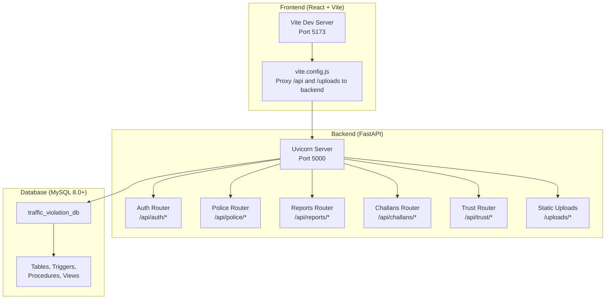

# Getting Started

<cite>
**Referenced Files in This Document**
- [README.md](file://README.md)
- [SETUP_GUIDE.md](file://SETUP_GUIDE.md)
- [schema.sql](file://db/schema.sql)
- [setup_db.bat](file://scripts/setup_db.bat)
- [setup_demo_environment.bat](file://scripts/setup_demo_environment.bat)
- [generate_password_hashes.py](file://scripts/generate_password_hashes.py)
- [requirements.txt](file://server/requirements.txt)
- [main.py](file://server/main.py)
- [config.py](file://server/config.py)
- [.env](file://server/.env)
- [README.txt](file://server/models/README.txt)
- [vite.config.js](file://frontend/vite.config.js)
- [config.js](file://frontend/src/config.js)
- [package.json](file://frontend/package.json)
- [package.json](file://backend/package.json)
- [auth.py](file://server/routes/auth.py)
</cite>

## Table of Contents
1. [Introduction](#introduction)
2. [Prerequisites](#prerequisites)
3. [Step-by-Step Installation](#step-by-step-installation)
4. [Backend Setup](#backend-setup)
5. [Frontend Setup](#frontend-setup)
6. [Default Credentials](#default-credentials)
7. [Health Check and Initial Verification](#health-check-and-initial-verification)
8. [Architecture Overview](#architecture-overview)
9. [Troubleshooting Guide](#troubleshooting-guide)
10. [Conclusion](#conclusion)

## Introduction
This guide helps you install and run the Traffic Violation Management System locally. It covers prerequisites, database setup, backend and frontend configuration, default credentials, health checks, and troubleshooting. The system integrates a FastAPI backend, a React/Vite frontend, and a MySQL 8.0+ database with advanced features like triggers, stored procedures, and temporal tables.

## Prerequisites
Ensure your environment meets the following requirements:
- Python 3.10 or newer (for the FastAPI backend)
- Node.js 18 or newer (for the React frontend)
- MySQL 8.0 or newer (database server)
- Webcam (for face recognition features)

These requirements are confirmed by the project’s architecture and technology stack.

**Section sources**
- [README.md: Architecture and tech stack:14-41](file://README.md#L14-L41)
- [README.md: Quick Start prerequisites:99-105](file://README.md#L99-L105)

## Step-by-Step Installation

### Step 1: Database Setup
Choose one of the following methods to initialize the database.

- Option A: Use the Windows batch script
  - Navigate to the scripts directory and run the database setup script.
  - The script will prompt for the MySQL root password and execute the schema to create tables, triggers, stored procedures, views, and seed data.

- Option B: Manual setup (fallback)
  - Open a MySQL client and run the schema SQL file to create the database and all required objects.

What the setup creates:
- 16 tables (core, history, transient)
- 5 triggers (trust score automation, temporal versioning)
- 4 stored procedures (challan generation, payment, rejection, overdue flagging)
- 4 views (pending reports, performance stats, trust history)
- Seed data (citizens, police, vehicles, rules, reports)

**Section sources**
- [README.md: Database setup instructions:108-125](file://README.md#L108-L125)
- [setup_db.bat: Script behavior and prompts:1-64](file://scripts/setup_db.bat#L1-L64)
- [schema.sql: Database schema and objects:1-120](file://db/schema.sql#L1-L120)

### Step 2: Backend Setup
Follow these steps to prepare and run the backend server.

- Create and activate a Python virtual environment (recommended).
- Install backend dependencies using the requirements file.
- Download the OpenCV DNN models required for face recognition.
- Configure environment variables using the provided .env template.
- Start the backend server.

Backend endpoints:
- Health check: http://localhost:5000/api/health
- API docs: http://localhost:5000/docs

**Section sources**
- [README.md: Backend setup steps:128-157](file://README.md#L128-L157)
- [requirements.txt: Backend dependencies:1-13](file://server/requirements.txt#L1-L13)
- [README.txt: OpenCV DNN model download instructions:1-41](file://server/models/README.txt#L1-L41)
- [.env: Backend environment variables:1-24](file://server/.env#L1-L24)
- [main.py: Backend entrypoint and health check:88-103](file://server/main.py#L88-L103)

### Step 3: Frontend Setup
Install frontend dependencies and start the development server.

- Install dependencies using npm.
- Start the Vite development server.

Frontend runs at http://localhost:5173. The Vite proxy forwards API requests to the backend at http://localhost:5000.

**Section sources**
- [README.md: Frontend setup steps:160-173](file://README.md#L160-L173)
- [package.json: Frontend dependencies:1-30](file://frontend/package.json#L1-L30)
- [vite.config.js: Proxy configuration:1-23](file://frontend/vite.config.js#L1-L23)
- [config.js: API base URL and endpoints:1-34](file://frontend/src/config.js#L1-L34)

## Backend Setup

### Virtual Environment and Dependencies
- Create a virtual environment and activate it.
- Install Python dependencies from the requirements file.

**Section sources**
- [requirements.txt:1-13](file://server/requirements.txt#L1-L13)

### OpenCV Model Downloads
- Download the two OpenCV DNN model files into the models directory:
  - deploy.prototxt
  - res10_300x300_ssd_iter_140000.caffemodel
- The README in the models directory provides multiple download options and verification steps.

**Section sources**
- [README.txt:1-41](file://server/models/README.txt#L1-L41)

### Environment Configuration
- Copy the .env template to .env and update database credentials and other settings.
- Confirm the database host, port, user, password, and name match your local MySQL setup.

**Section sources**
- [.env:1-24](file://server/.env#L1-L24)
- [config.py: Settings loading and defaults:9-41](file://server/config.py#L9-L41)

### Starting the Backend
- Run the FastAPI application. The server listens on port 5000 by default.

**Section sources**
- [main.py:105-107](file://server/main.py#L105-L107)

## Frontend Setup

### Dependencies and Development Server
- Install frontend dependencies using npm.
- Start the development server with Vite.

Proxy behavior:
- API calls prefixed with /api are proxied to http://localhost:5000.
- Static uploads under /uploads are also proxied to the backend.

**Section sources**
- [package.json:1-30](file://frontend/package.json#L1-L30)
- [vite.config.js:1-23](file://frontend/vite.config.js#L1-L23)
- [config.js:1-34](file://frontend/src/config.js#L1-L34)

## Default Credentials
Use the following default accounts for testing after database initialization.

- Citizens (password: password123)
  - aarav@example.com (Trust Score: 75)
  - priya@example.com (Trust Score: 50)
  - rohan@example.com (Trust Score: 30)
  - sneha@example.com (Trust Score: 90)
  - vikram@example.com (Trust Score: 10, Suspended)

- Police (password: police123)
  - rajesh@police.gov (Badge: TN-4521, Inspector)
  - lakshmi@police.gov (Badge: TN-3310, Sub-Inspector)
  - deepak@police.gov (Badge: TN-7788, Asst Sub-Inspector)

**Section sources**
- [README.md: Default credentials:176-189](file://README.md#L176-L189)

## Health Check and Initial Verification

### Backend Health Check
- Verify the backend is running and responsive:
  - Endpoint: http://localhost:5000/api/health
  - Expected response: service status OK

**Section sources**
- [main.py: Health check endpoint:88-95](file://server/main.py#L88-L95)

### API Testing Examples
- Use the Swagger UI at http://localhost:5000/docs to explore endpoints.
- Example curl commands:
  - Health check: curl http://localhost:5000/api/health
  - Citizen login: curl -X POST http://localhost:5000/api/auth/login -H "Content-Type: application/json" -d '{"email":"aarav@example.com","password":"password123","role":"citizen"}'

**Section sources**
- [README.md: API testing:254-271](file://README.md#L254-L271)

### Frontend Manual Testing Checklist
- Register a new citizen account
- Register face during signup
- Login with face recognition
- Login with email/password
- Submit violation report with image upload
- View trust score history chart
- Pay challan (test row-level locking)
- Police: Verify report and issue challan
- Police: Reject report with reason
- Police: View performance statistics

**Section sources**
- [README.md: Manual testing checklist:273-283](file://README.md#L273-L283)

## Architecture Overview

**Diagram sources**
- [README.md: Architecture diagram:14-41](file://README.md#L14-L41)
- [main.py: Router inclusions:74-87](file://server/main.py#L74-L87)
- [vite.config.js: Proxy configuration:7-20](file://frontend/vite.config.js#L7-L20)
- [schema.sql: Database schema overview:1-120](file://db/schema.sql#L1-L120)

## Troubleshooting Guide

### Backend Won’t Start
- Ensure MySQL is running and accessible.
- Verify the .env file contains correct database credentials.
- Confirm all Python dependencies are installed.

**Section sources**
- [README.md: Backend troubleshooting:373-377](file://README.md#L373-L377)

### Face Detection Not Working
- Download the OpenCV DNN models into the models directory.
- Ensure the webcam is enabled and accessible by the browser.
- Good lighting improves face capture quality.

**Section sources**
- [README.md: Face detection troubleshooting:378-382](file://README.md#L378-L382)
- [README.txt: Model download and verification:1-41](file://server/models/README.txt#L1-L41)

### Frontend Can’t Connect to Backend
- Confirm the backend is running on port 5000.
- Check the Vite proxy configuration in vite.config.js.
- Clear browser cache and reload the page.

**Section sources**
- [README.md: Frontend connectivity troubleshooting:383-387](file://README.md#L383-L387)
- [vite.config.js:1-23](file://frontend/vite.config.js#L1-L23)

### Database Errors
- Re-run the database setup script to recreate the schema.
- Verify MySQL version is 8.0 or newer.
- Ensure schema.sql executed without errors.

**Section sources**
- [README.md: Database troubleshooting:388-392](file://README.md#L388-L392)
- [setup_db.bat:1-64](file://scripts/setup_db.bat#L1-L64)

### Demo Accounts and Password Hashes
- Generate bcrypt hashes for demo accounts using the provided script.
- Update the seed SQL file with the generated hashes.
- Seed the database with demo accounts.

**Section sources**
- [generate_password_hashes.py:1-33](file://scripts/generate_password_hashes.py#L1-L33)
- [setup_demo_environment.bat:1-79](file://scripts/setup_demo_environment.bat#L1-L79)

## Conclusion
You now have the Traffic Violation Management System running locally with a working database, backend, and frontend. Use the default credentials to log in, verify endpoints via Swagger, and test the full citizen and police workflows. If issues arise, consult the troubleshooting section aligned with the specific subsystems.