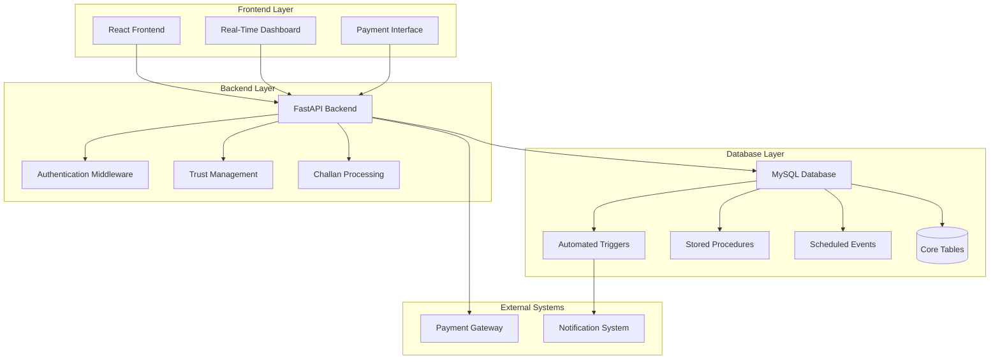
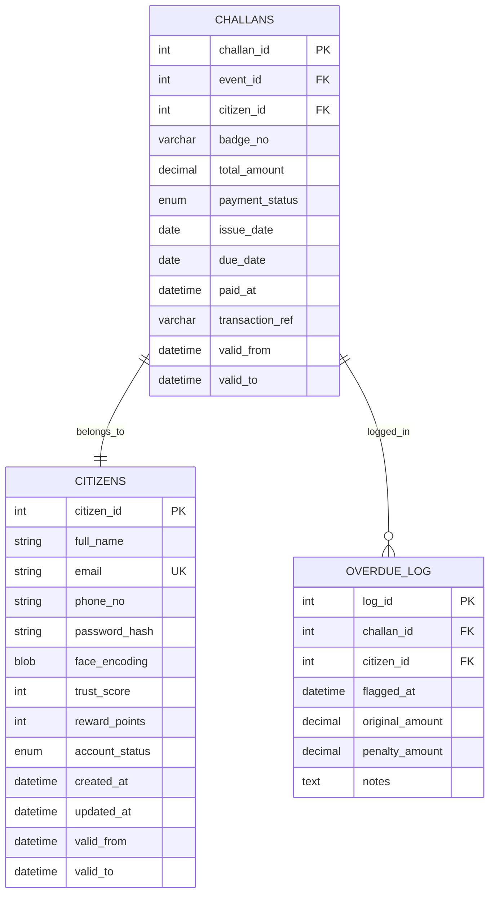
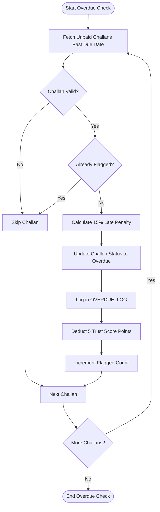
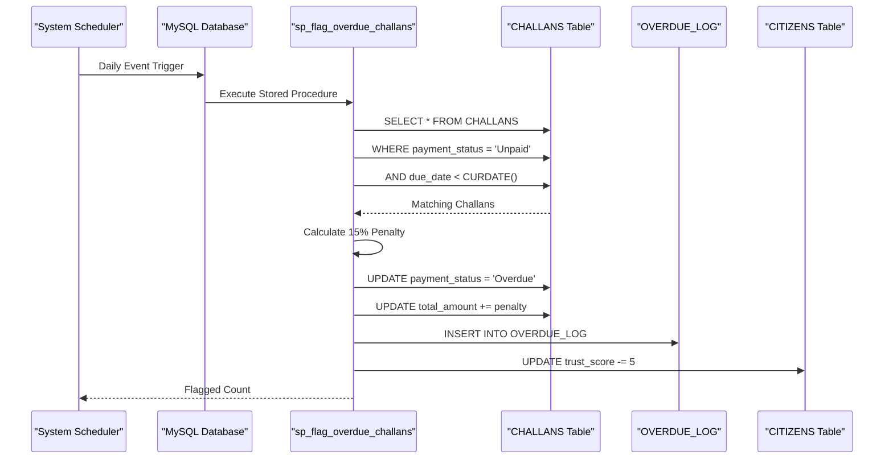
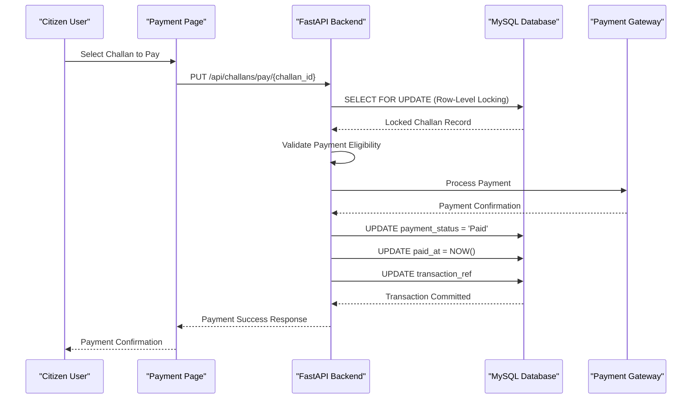

# Overdue Penalty System

<cite>
**Referenced Files in This Document**
- [schema.sql](file://db/schema.sql)
- [database_triggers.sql](file://db/database_triggers.sql)
- [trust.py](file://server/routes/trust.py)
- [challans.py](file://server/routes/challans.py)
- [challans.js](file://backend/routes/challans.js)
- [MyChallans.jsx](file://frontend/src/pages/MyChallans.jsx)
- [PaymentPage.jsx](file://frontend/src/pages/PaymentPage.jsx)
- [PaymentModal.jsx](file://frontend/src/components/PaymentModal.jsx)
- [main.py](file://server/main.py)
- [stored_procedure_process_report.sql](file://db/stored_procedure_process_report.sql)
</cite>

## Table of Contents
1. [Introduction](#introduction)
2. [System Architecture](#system-architecture)
3. [Core Components](#core-components)
4. [Penalty Calculation Algorithms](#penalty-calculation-algorithms)
5. [Grace Period and Due Date Enforcement](#grace-period-and-due-date-enforcement)
6. [Automatic Overdue Flagging](#automatic-overdue-flagging)
7. [Integration with Payment System](#integration-with-payment-system)
8. [Trust Score Impact](#trust-score-impact)
9. [Audit Trail and Compliance](#audit-trail-and-compliance)
10. [Real-Time Dashboard Updates](#real-time-dashboard-updates)
11. [Troubleshooting Guide](#troubleshooting-guide)
12. [Conclusion](#conclusion)

## Introduction

The Overdue Penalty System is a comprehensive automated mechanism designed to enforce traffic challan payment deadlines, apply financial penalties for late payments, and maintain system integrity through database triggers and scheduled procedures. This system ensures compliance with traffic regulations while providing transparent audit trails and real-time updates across all user interfaces.

The system operates on a tier-1 government database management system with ACID compliance, featuring automated penalty calculations, trust score adjustments, and seamless integration with the payment infrastructure. It maintains strict separation of concerns between frontend presentation, backend processing, and database-level automation.

## System Architecture

The overdue penalty system follows a multi-layered architecture with clear separation between presentation, business logic, and data persistence layers:



**Diagram sources**
- [main.py:77-87](file://server/main.py#L77-L87)
- [schema.sql:8-9](file://db/schema.sql#L8-L9)

## Core Components

### Database Schema Foundation

The system is built upon a comprehensive database schema that defines the core entities and relationships governing the penalty system:



**Diagram sources**
- [schema.sql:173-195](file://db/schema.sql#L173-L195)
- [schema.sql:224-235](file://db/schema.sql#L224-L235)

### Penalty Calculation Engine

The penalty calculation engine operates through a sophisticated stored procedure that processes overdue challans systematically:



**Diagram sources**
- [schema.sql:689-754](file://db/schema.sql#L689-L754)

**Section sources**
- [schema.sql:173-235](file://db/schema.sql#L173-L235)
- [schema.sql:689-754](file://db/schema.sql#L689-L754)

## Penalty Calculation Algorithms

### Base Penalty Formula

The system implements a standardized 15% late penalty calculation applied to the original challan amount:

**Penalty Calculation Formula:**
```
Penalty Amount = Original Amount × 0.15
Final Amount = Original Amount + Penalty Amount
```

### Grace Period Implementation

The system enforces a 30-day grace period from issue date to due date:

**Due Date Calculation:**
```
Due Date = Issue Date + 30 Days
```

**Grace Period Logic:**
- Challans remain in "Unpaid" status until due date passes
- No penalties applied during grace period
- Automatic transition occurs at midnight of due date

### Multiplier Application

While the current implementation applies a fixed 15% penalty, the system architecture supports future multiplier configurations:

**Multiplier Framework:**
```sql
-- Current implementation uses fixed 15%
SET v_penalty = ROUND(v_amount * 0.15, 2);

-- Future enhancement could support configurable multipliers
-- SET v_penalty = ROUND(v_amount * penalty_rate, 2);
```

**Section sources**
- [schema.sql:689-754](file://db/schema.sql#L689-L754)
- [challans.py:97-101](file://server/routes/challans.py#L97-L101)

## Grace Period and Due Date Enforcement

### Automated Due Date Tracking

The system maintains strict due date enforcement through database-level automation:



**Diagram sources**
- [schema.sql:928-936](file://db/schema.sql#L928-L936)
- [schema.sql:689-754](file://db/schema.sql#L689-L754)

### Real-Time Status Updates

The frontend receives real-time updates through continuous polling mechanisms:

**Frontend Refresh Mechanism:**
- Automatic refresh every 3 seconds for challan lists
- Real-time status updates without manual page refresh
- Immediate visual feedback for status changes

**Section sources**
- [MyChallans.jsx:14-21](file://frontend/src/pages/MyChallans.jsx#L14-L21)
- [MyChallans.jsx:38-44](file://frontend/src/pages/MyChallans.jsx#L38-L44)

## Automatic Overdue Flagging

### Scheduled Event Configuration

The system employs MySQL events for automated overdue processing:

**Event Schedule Configuration:**
- Daily execution at 2:00 AM following due date
- Automatic processing of all overdue challans
- Configurable timing for optimal system performance

### Manual Override Capability

Authorized personnel can manually trigger overdue processing:

**Manual Flagging Process:**
- Police officers can initiate immediate overdue checks
- Manual intervention capability for special circumstances
- Audit trail maintained for all manual actions

**Section sources**
- [schema.sql:928-936](file://db/schema.sql#L928-L936)
- [trust.py:104-134](file://server/routes/trust.py#L104-L134)

## Integration with Payment System

### Payment Processing Workflow

The payment system integrates seamlessly with the overdue penalty mechanism:



**Diagram sources**
- [challans.js:32-98](file://backend/routes/challans.js#L32-L98)
- [challans.py:336-398](file://server/routes/challans.py#L336-L398)

### Row-Level Locking Implementation

The system implements robust concurrency control to prevent double-payment scenarios:

**Locking Mechanism:**
- Exclusive row-level locks during payment processing
- Automatic deadlock detection and resolution
- Transaction rollback on payment failures

**Section sources**
- [challans.js:40-82](file://backend/routes/challans.js#L40-L82)
- [challans.py:336-398](file://server/routes/challans.py#L336-L398)

## Trust Score Impact

### Penalty-Based Trust Deduction

The system automatically adjusts citizen trust scores based on challan payment behavior:

**Trust Score Adjustment Logic:**
- 5-point deduction for each overdue challan
- Minimum trust score of 0 enforced
- Automatic suspension when trust reaches zero

### Trust Score Recovery

Citizens can rebuild trust through positive actions:

**Trust Score Recovery Mechanisms:**
- Timely challan payments (+2 reward points)
- Report verification submissions (+10 trust points)
- Community service participation (varies by activity)

**Section sources**
- [schema.sql:743-746](file://db/schema.sql#L743-L746)
- [challans.py:619-622](file://server/routes/challans.py#L619-L622)

## Audit Trail and Compliance

### Comprehensive Logging System

The system maintains detailed audit trails for all penalty-related activities:

**Audit Trail Components:**
- OVERDUE_LOG table for penalty application records
- CHALLANS_HISTORY for payment status changes
- CITIZENS_HISTORY for trust score modifications
- Real-time dashboard updates for transparency

### Compliance Features

**Regulatory Compliance Measures:**
- ACID-compliant transactions for financial accuracy
- Immutable audit trails for legal proceedings
- Automated reporting capabilities for oversight bodies
- Data retention policies aligned with government standards

**Section sources**
- [schema.sql:198-235](file://db/schema.sql#L198-L235)
- [schema.sql:224-235](file://db/schema.sql#L224-L235)

## Real-Time Dashboard Updates

### Live Challan Monitoring

The dashboard provides real-time visibility into challan status and penalty applications:

**Dashboard Features:**
- Automatic 3-second refresh intervals
- Color-coded status indicators (Unpaid, Overdue, Paid)
- Total outstanding amount calculations
- Individual challan detail views

### Notification Integration

The system supports automated notifications for penalty applications:

**Notification Capabilities:**
- SMS alerts for overdue challans
- Email notifications for penalty applications
- Mobile push notifications for status changes
- Integration with government communication channels

**Section sources**
- [MyChallans.jsx:14-21](file://frontend/src/pages/MyChallans.jsx#L14-L21)
- [MyChallans.jsx:46-55](file://frontend/src/pages/MyChallans.jsx#L46-L55)

## Troubleshooting Guide

### Common Issues and Solutions

**Overdue Penalty Not Applied:**
1. Verify scheduled event is enabled
2. Check database connectivity
3. Review stored procedure permissions
4. Confirm due date calculation accuracy

**Payment Processing Failures:**
1. Validate row-level locking implementation
2. Check transaction isolation levels
3. Review payment gateway integration
4. Examine concurrent access patterns

**Trust Score Anomalies:**
1. Verify trigger execution status
2. Check manual override logs
3. Review audit trail consistency
4. Validate minimum trust score enforcement

### Performance Optimization

**Database Optimization Strategies:**
- Index optimization for overdue queries
- Connection pooling configuration
- Transaction timeout settings
- Memory allocation tuning

**Monitoring and Alerting:**
- Automated system health checks
- Performance metric collection
- Alert threshold configuration
- Incident response protocols

## Conclusion

The Overdue Penalty System represents a comprehensive solution for automated traffic challan management, combining robust database automation with modern web technologies. The system's strength lies in its multi-layered approach to penalty enforcement, real-time monitoring capabilities, and comprehensive audit trail maintenance.

Key achievements include:
- **Automated Enforcement**: 15% late penalties applied without manual intervention
- **Real-Time Updates**: Continuous synchronization across all user interfaces
- **ACID Compliance**: Financial transactions guaranteed safe and consistent
- **Trust Management**: Dynamic trust scoring supporting behavioral modification
- **Audit Integrity**: Complete transparency for regulatory compliance

The system's modular architecture ensures scalability and maintainability while supporting future enhancements such as configurable penalty multipliers, advanced notification systems, and expanded payment processing capabilities. The integration of database triggers, scheduled events, and frontend real-time updates creates a cohesive ecosystem that promotes traffic law compliance while maintaining system reliability and user satisfaction.