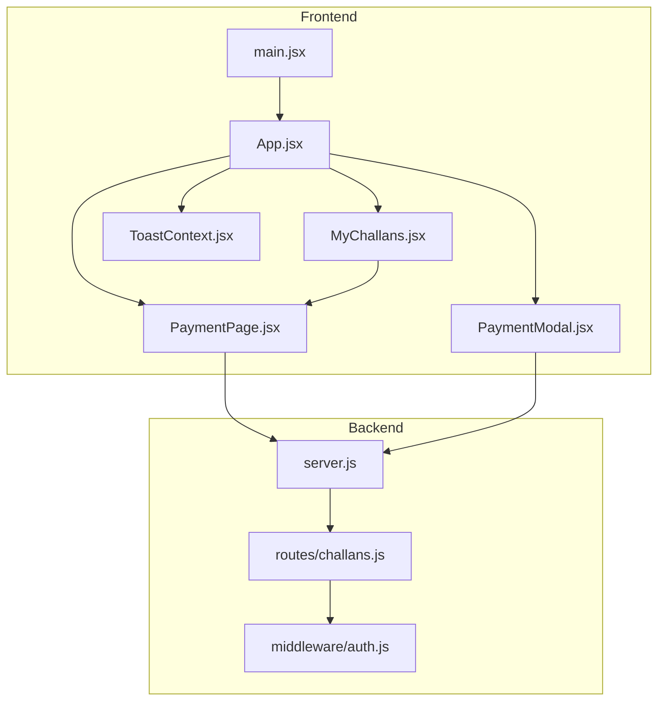
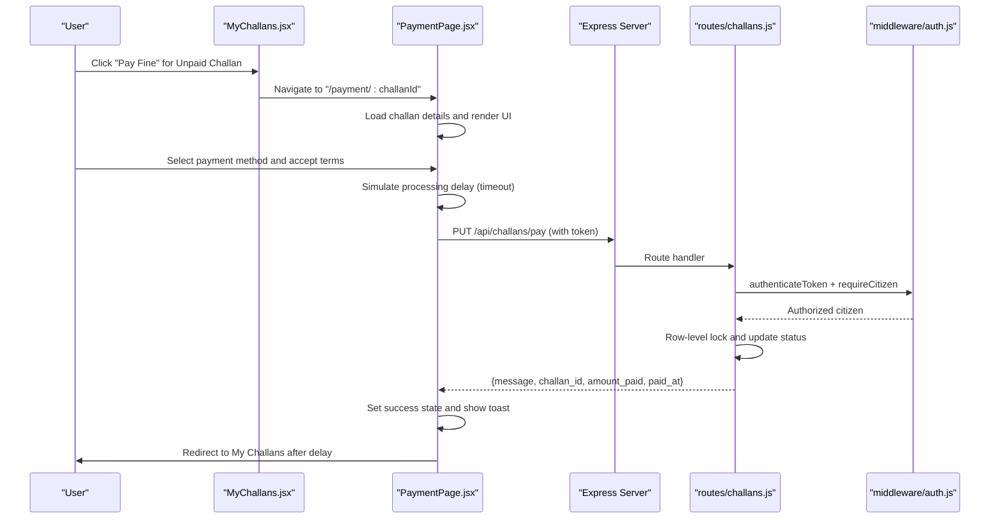
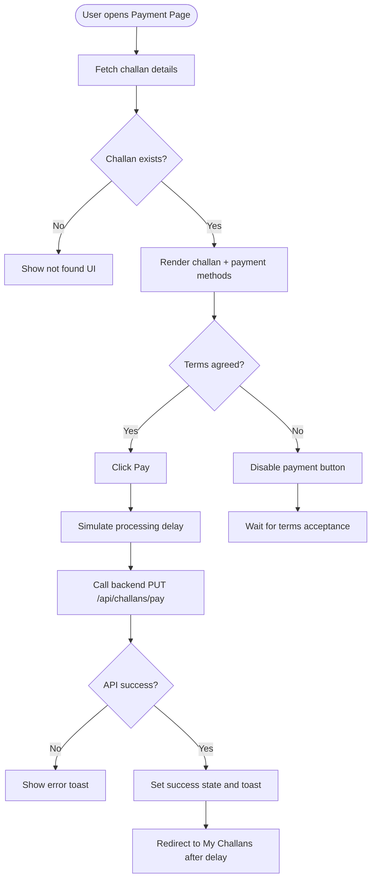
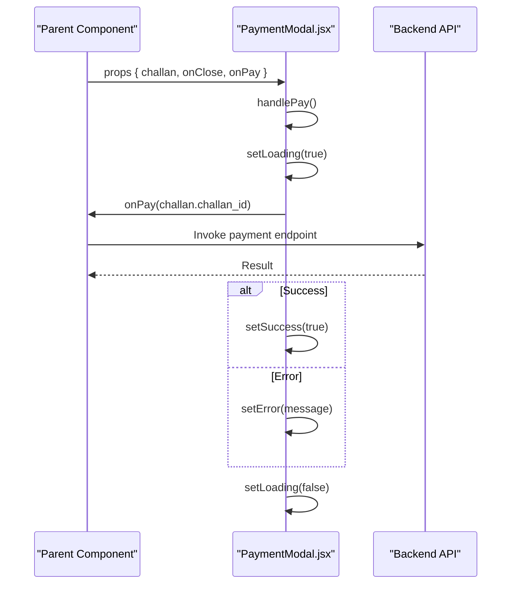
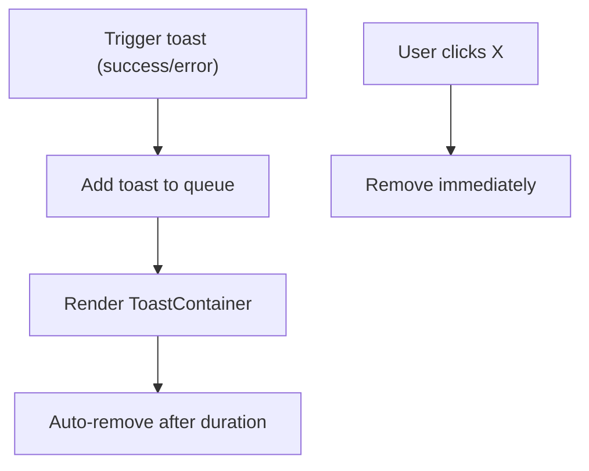
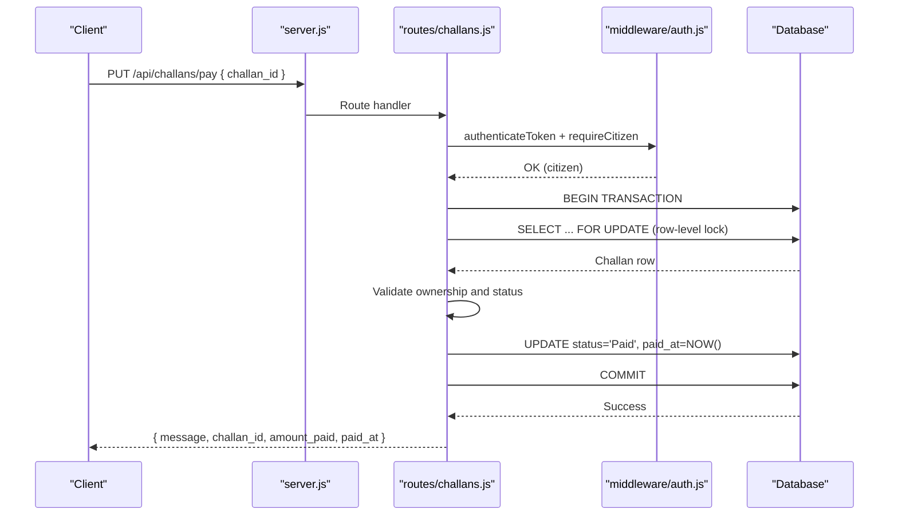
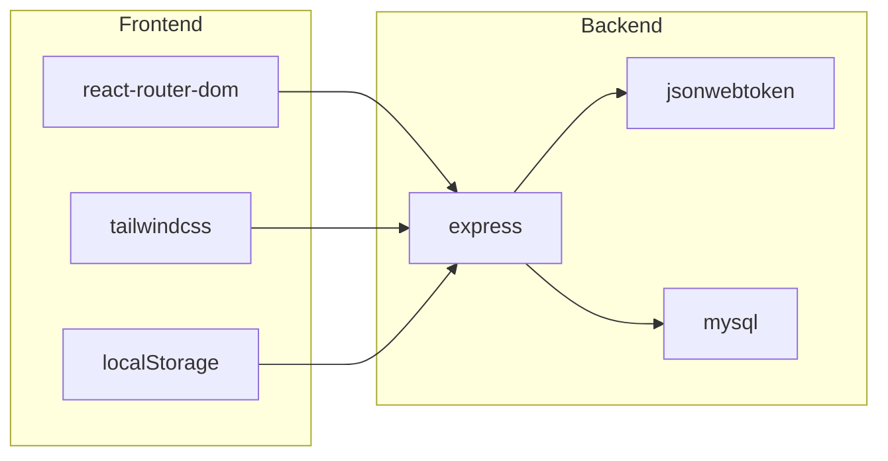

# Payment Gateway Integration

<cite>
**Referenced Files in This Document**
- [PaymentPage.jsx](file://frontend/src/pages/PaymentPage.jsx)
- [PaymentModal.jsx](file://frontend/src/components/PaymentModal.jsx)
- [ToastContext.jsx](file://frontend/src/context/ToastContext.jsx)
- [MyChallans.jsx](file://frontend/src/pages/MyChallans.jsx)
- [App.jsx](file://frontend/src/App.jsx)
- [main.jsx](file://frontend/src/main.jsx)
- [challans.js](file://backend/routes/challans.js)
- [auth.js](file://backend/middleware/auth.js)
- [server.js](file://backend/server.js)
- [package.json](file://frontend/package.json)
</cite>

## Table of Contents
1. [Introduction](#introduction)
2. [Project Structure](#project-structure)
3. [Core Components](#core-components)
4. [Architecture Overview](#architecture-overview)
5. [Detailed Component Analysis](#detailed-component-analysis)
6. [Dependency Analysis](#dependency-analysis)
7. [Performance Considerations](#performance-considerations)
8. [Troubleshooting Guide](#troubleshooting-guide)
9. [Conclusion](#conclusion)
10. [Appendices](#appendices)

## Introduction
This document explains the payment gateway integration patterns and mock payment processing implementation for the traffic violation system. It covers the frontend payment modal architecture, payment method selection interface, and user interaction flows. It documents the API integration patterns for payment processing, including request formatting, response handling, and error propagation. It also details the demo payment simulation logic, timeout handling, and success/failure state management. Styling and responsive design considerations are included, along with integration with toast notifications for user feedback, loading states, and redirect mechanisms. Finally, it addresses security considerations for payment data handling, encryption requirements, and PCI compliance preparation for future real payment gateway integration.

## Project Structure
The payment system spans the frontend React application and the backend Express server:
- Frontend:
  - PaymentPage: Full-page payment experience with method selection, terms agreement, and demo payment processing.
  - PaymentModal: Reusable modal for payment actions triggered elsewhere.
  - ToastContext: Global toast notification provider and container.
  - MyChallans: Lists challans and navigates to the payment page for unpaid items.
  - App and main: Routing and provider setup.
- Backend:
  - challans routes: Fetch citizen challans and process payments with row-level locking.
  - auth middleware: JWT-based authentication and role checks.
  - server: Express server bootstrap and CORS configuration.

**Diagram sources**
- [main.jsx:1-14](file://frontend/src/main.jsx#L1-L14)
- [App.jsx:1-274](file://frontend/src/App.jsx#L1-L274)
- [MyChallans.jsx:1-207](file://frontend/src/pages/MyChallans.jsx#L1-L207)
- [PaymentPage.jsx:1-529](file://frontend/src/pages/PaymentPage.jsx#L1-L529)
- [PaymentModal.jsx:1-99](file://frontend/src/components/PaymentModal.jsx#L1-L99)
- [ToastContext.jsx:1-113](file://frontend/src/context/ToastContext.jsx#L1-L113)
- [server.js:1-42](file://backend/server.js#L1-L42)
- [challans.js:1-101](file://backend/routes/challans.js#L1-L101)
- [auth.js:1-37](file://backend/middleware/auth.js#L1-L37)

**Section sources**
- [main.jsx:1-14](file://frontend/src/main.jsx#L1-L14)
- [App.jsx:1-274](file://frontend/src/App.jsx#L1-L274)
- [MyChallans.jsx:1-207](file://frontend/src/pages/MyChallans.jsx#L1-L207)
- [PaymentPage.jsx:1-529](file://frontend/src/pages/PaymentPage.jsx#L1-L529)
- [PaymentModal.jsx:1-99](file://frontend/src/components/PaymentModal.jsx#L1-L99)
- [ToastContext.jsx:1-113](file://frontend/src/context/ToastContext.jsx#L1-L113)
- [server.js:1-42](file://backend/server.js#L1-L42)
- [challans.js:1-101](file://backend/routes/challans.js#L1-L101)
- [auth.js:1-37](file://backend/middleware/auth.js#L1-L37)

## Core Components
- PaymentPage: Orchestrates payment flow, renders challan details, presents payment methods, handles terms agreement, simulates processing delay, and redirects upon success.
- PaymentModal: Generic modal for payment actions with loading, error, and success states.
- ToastContext: Provides global toast notifications for user feedback.
- MyChallans: Displays challans and navigates to the payment page for unpaid items.
- Backend Challans Routes: Fetches challans and processes payments with row-level locking and authorization checks.
- Auth Middleware: Validates JWT tokens and enforces role-based access.

**Section sources**
- [PaymentPage.jsx:1-529](file://frontend/src/pages/PaymentPage.jsx#L1-L529)
- [PaymentModal.jsx:1-99](file://frontend/src/components/PaymentModal.jsx#L1-L99)
- [ToastContext.jsx:1-113](file://frontend/src/context/ToastContext.jsx#L1-L113)
- [MyChallans.jsx:1-207](file://frontend/src/pages/MyChallans.jsx#L1-L207)
- [challans.js:1-101](file://backend/routes/challans.js#L1-L101)
- [auth.js:1-37](file://backend/middleware/auth.js#L1-L37)

## Architecture Overview
The payment flow integrates frontend UI with backend APIs. The frontend validates user intent, simulates processing, and invokes backend endpoints secured by JWT and role checks. The backend ensures data integrity with row-level locking and returns structured responses.

**Diagram sources**
- [MyChallans.jsx:38-44](file://frontend/src/pages/MyChallans.jsx#L38-L44)
- [PaymentPage.jsx:46-80](file://frontend/src/pages/PaymentPage.jsx#L46-L80)
- [server.js:22-26](file://backend/server.js#L22-L26)
- [challans.js:31-98](file://backend/routes/challans.js#L31-L98)
- [auth.js:5-27](file://backend/middleware/auth.js#L5-L27)

## Detailed Component Analysis

### PaymentPage: Full Payment Experience
- Responsibilities:
  - Fetch and validate challan details for the logged-in citizen.
  - Render challan invoice and payment method selection grid.
  - Enforce Terms & Conditions agreement.
  - Simulate payment processing delay and handle errors.
  - Provide success state and redirect to My Challans.
- Key behaviors:
  - Loading states during data fetch.
  - Terms agreement required before enabling payment button.
  - Demo processing delay using a timeout.
  - Toast notifications for success and error messages.
  - Redirect after success with a timer.
- Styling and responsiveness:
  - Uses Tailwind utility classes for responsive two-column layout.
  - Dynamic payment method selection highlighting with color-coded borders.
  - Government-themed branding and security badges.

**Diagram sources**
- [PaymentPage.jsx:19-44](file://frontend/src/pages/PaymentPage.jsx#L19-L44)
- [PaymentPage.jsx:46-80](file://frontend/src/pages/PaymentPage.jsx#L46-L80)
- [PaymentPage.jsx:82-113](file://frontend/src/pages/PaymentPage.jsx#L82-L113)
- [PaymentPage.jsx:115-125](file://frontend/src/pages/PaymentPage.jsx#L115-L125)

**Section sources**
- [PaymentPage.jsx:1-529](file://frontend/src/pages/PaymentPage.jsx#L1-L529)

### PaymentModal: Reusable Payment Action Component
- Responsibilities:
  - Accepts challan data and callbacks for close and payment actions.
  - Manages local loading, error, and success states.
  - Renders challan summary and action buttons.
- Interaction:
  - Calls onPay(challan_id) asynchronously.
  - Displays success state with green checkmark and close button.
  - Shows error messages with red banner and retry/cancel options.

**Diagram sources**
- [PaymentModal.jsx:3-22](file://frontend/src/components/PaymentModal.jsx#L3-L22)
- [PaymentModal.jsx:10-22](file://frontend/src/components/PaymentModal.jsx#L10-L22)

**Section sources**
- [PaymentModal.jsx:1-99](file://frontend/src/components/PaymentModal.jsx#L1-L99)

### Toast Notifications: Feedback and UX
- Responsibilities:
  - Provide global success/error/warning/info notifications.
  - Auto-dismiss toasts after a fixed duration.
  - Allow manual dismissal and dynamic styling per type.
- Integration:
  - PaymentPage uses toast for success and error feedback.
  - Toasts appear in the top-right corner with icons and colors.

**Diagram sources**
- [ToastContext.jsx:13-40](file://frontend/src/context/ToastContext.jsx#L13-L40)
- [ToastContext.jsx:42-112](file://frontend/src/context/ToastContext.jsx#L42-L112)
- [PaymentPage.jsx:68-76](file://frontend/src/pages/PaymentPage.jsx#L68-L76)

**Section sources**
- [ToastContext.jsx:1-113](file://frontend/src/context/ToastContext.jsx#L1-L113)
- [PaymentPage.jsx:68-76](file://frontend/src/pages/PaymentPage.jsx#L68-L76)

### Backend Payment Processing: Row-Level Locking and Authorization
- Endpoint: PUT /api/challans/pay
- Steps:
  - Authenticate JWT and enforce citizen role.
  - Acquire row-level lock on the target challan.
  - Verify ownership and unpaid status.
  - Update status to Paid and record paid_at.
  - Commit transaction; rollback on errors.
- Error handling:
  - Returns structured errors for missing fields, not found, unauthorized, already paid, and internal server errors.

**Diagram sources**
- [server.js:22-26](file://backend/server.js#L22-L26)
- [challans.js:31-98](file://backend/routes/challans.js#L31-L98)
- [auth.js:5-27](file://backend/middleware/auth.js#L5-L27)

**Section sources**
- [challans.js:31-98](file://backend/routes/challans.js#L31-L98)
- [auth.js:5-27](file://backend/middleware/auth.js#L5-L27)

### API Integration Patterns
- Request formatting:
  - PaymentPage sends a PUT request to /api/challans/pay with a JSON body containing challan_id.
  - Authentication header: Authorization: Bearer <token>.
- Response handling:
  - On success: PaymentPage sets success state, shows a success toast, and schedules a redirect.
  - On error: PaymentPage shows an error toast and keeps the UI interactive.
- Error propagation:
  - Backend returns structured JSON errors; PaymentPage reads detail fields and displays user-friendly messages.

**Section sources**
- [PaymentPage.jsx:58-69](file://frontend/src/pages/PaymentPage.jsx#L58-L69)
- [challans.js:84-89](file://backend/routes/challans.js#L84-L89)

### Demo Payment Simulation Logic
- Timeout handling:
  - PaymentPage introduces a 2-second delay before calling the backend to simulate processing.
- Success/failure state management:
  - Success: Sets paymentSuccess flag, shows success toast, and redirects after 3 seconds.
  - Failure: Displays error toast and remains on the payment page.

**Section sources**
- [PaymentPage.jsx:55-79](file://frontend/src/pages/PaymentPage.jsx#L55-L79)

### Payment Method Selection Interface and Styling
- Method grid:
  - Six payment methods with icons, descriptions, and color themes.
  - Dynamic selection styling with color-specific borders and rings.
- Responsive design:
  - Two-column layout on large screens; single column on small screens.
  - Utility-first Tailwind classes for spacing, shadows, and typography.

**Section sources**
- [PaymentPage.jsx:82-125](file://frontend/src/pages/PaymentPage.jsx#L82-L125)
- [PaymentPage.jsx:248-434](file://frontend/src/pages/PaymentPage.jsx#L248-L434)

### Integration with Toast Notifications, Loading States, and Redirects
- Toast integration:
  - success() and error() helpers invoked from PaymentPage for user feedback.
- Loading states:
  - PaymentPage uses processing and loading flags to disable controls and show spinners.
- Redirect mechanisms:
  - After success, PaymentPage schedules navigation to My Challans.

**Section sources**
- [PaymentPage.jsx:12-17](file://frontend/src/pages/PaymentPage.jsx#L12-L17)
- [PaymentPage.jsx:46-80](file://frontend/src/pages/PaymentPage.jsx#L46-L80)
- [PaymentPage.jsx:68-73](file://frontend/src/pages/PaymentPage.jsx#L68-L73)

### Security Considerations and PCI Compliance Preparation
- Authentication and authorization:
  - JWT verification and role enforcement ensure only citizens can pay their own challans.
- Data integrity:
  - Row-level locking prevents race conditions for concurrent payments.
- Encryption and transport:
  - Backend advertises 256-bit SSL encryption and secure headers; ensure HTTPS in production.
- PCI DSS readiness:
  - Current implementation avoids storing sensitive payment data; prepare for tokenization and third-party payment processors.
  - Maintain audit logs for payment events and ensure secure logging practices.

**Section sources**
- [auth.js:5-27](file://backend/middleware/auth.js#L5-L27)
- [challans.js:44-78](file://backend/routes/challans.js#L44-L78)
- [PaymentPage.jsx:204-217](file://frontend/src/pages/PaymentPage.jsx#L204-L217)

## Dependency Analysis
- Frontend dependencies:
  - React Router for routing and navigation.
  - Tailwind CSS for styling and responsive design.
  - Local storage for authentication persistence.
- Backend dependencies:
  - Express for HTTP server and routing.
  - JWT for authentication.
  - MySQL for database operations.

**Diagram sources**
- [package.json:11-29](file://frontend/package.json#L11-L29)
- [server.js:1-42](file://backend/server.js#L1-L42)
- [auth.js:1](file://backend/middleware/auth.js#L1)

**Section sources**
- [package.json:11-29](file://frontend/package.json#L11-L29)
- [server.js:1-42](file://backend/server.js#L1-L42)
- [auth.js:1-37](file://backend/middleware/auth.js#L1-L37)

## Performance Considerations
- Network latency:
  - Introduce minimal delays for realistic UX; avoid long-running synchronous operations.
- Database contention:
  - Row-level locks reduce conflicts; ensure fast updates and minimal transaction durations.
- UI responsiveness:
  - Use loading states and optimistic UI updates where safe; revert on errors.
- Caching:
  - Cache static assets and route data where appropriate; invalidate on state changes.

## Troubleshooting Guide
- Authentication failures:
  - Verify JWT presence and validity; ensure Authorization header is set.
- Authorization errors:
  - Confirm user role is citizen and challan belongs to the current user.
- Payment already processed:
  - Backend returns conflict when challan is already paid; inform the user accordingly.
- Network errors:
  - Check API health endpoint and CORS configuration; ensure backend is reachable.

**Section sources**
- [auth.js:9-20](file://backend/middleware/auth.js#L9-L20)
- [challans.js:53-72](file://backend/routes/challans.js#L53-L72)
- [server.js:17-20](file://backend/server.js#L17-L20)

## Conclusion
The payment gateway integration combines a robust frontend experience with secure backend processing. The frontend provides a clear, responsive payment flow with method selection, terms agreement, and user feedback. The backend enforces strict authentication and authorization, ensures data integrity with row-level locking, and returns structured responses. The system is prepared for future real payment gateway integration with PCI DSS readiness and encryption practices.

## Appendices
- Routing and providers:
  - App wraps children with ToastProvider and defines routes including payment/:challanId.
  - main.jsx bootstraps the React app with BrowserRouter.

**Section sources**
- [App.jsx:170-179](file://frontend/src/App.jsx#L170-L179)
- [main.jsx:7-13](file://frontend/src/main.jsx#L7-L13)