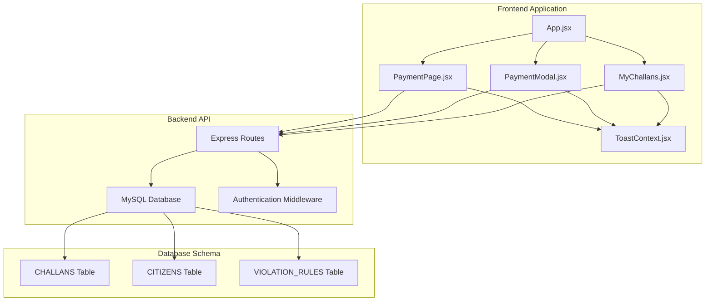
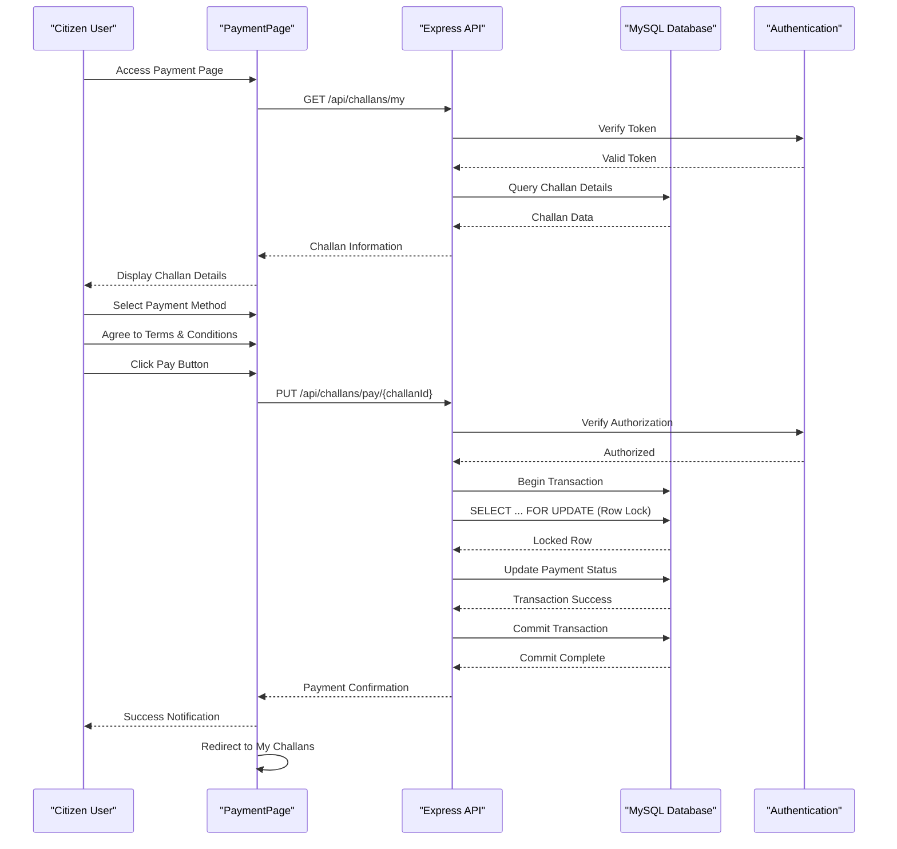
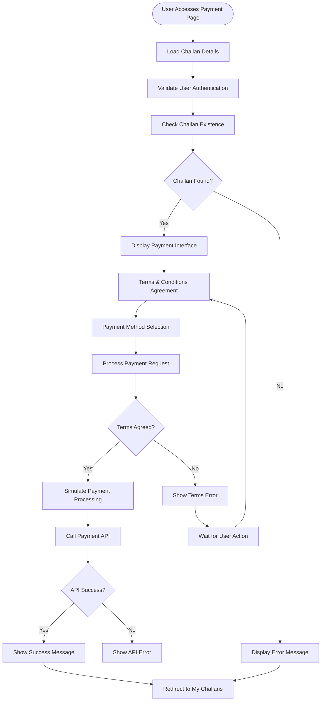
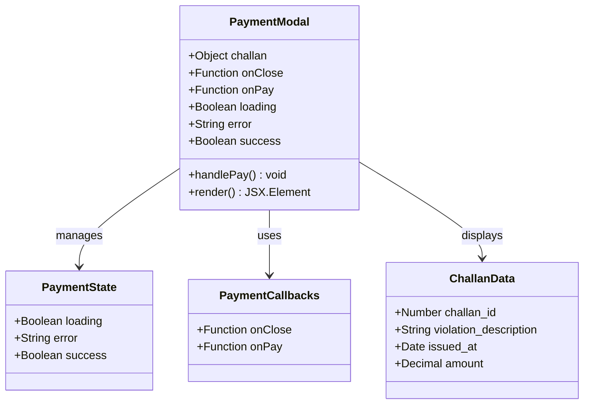
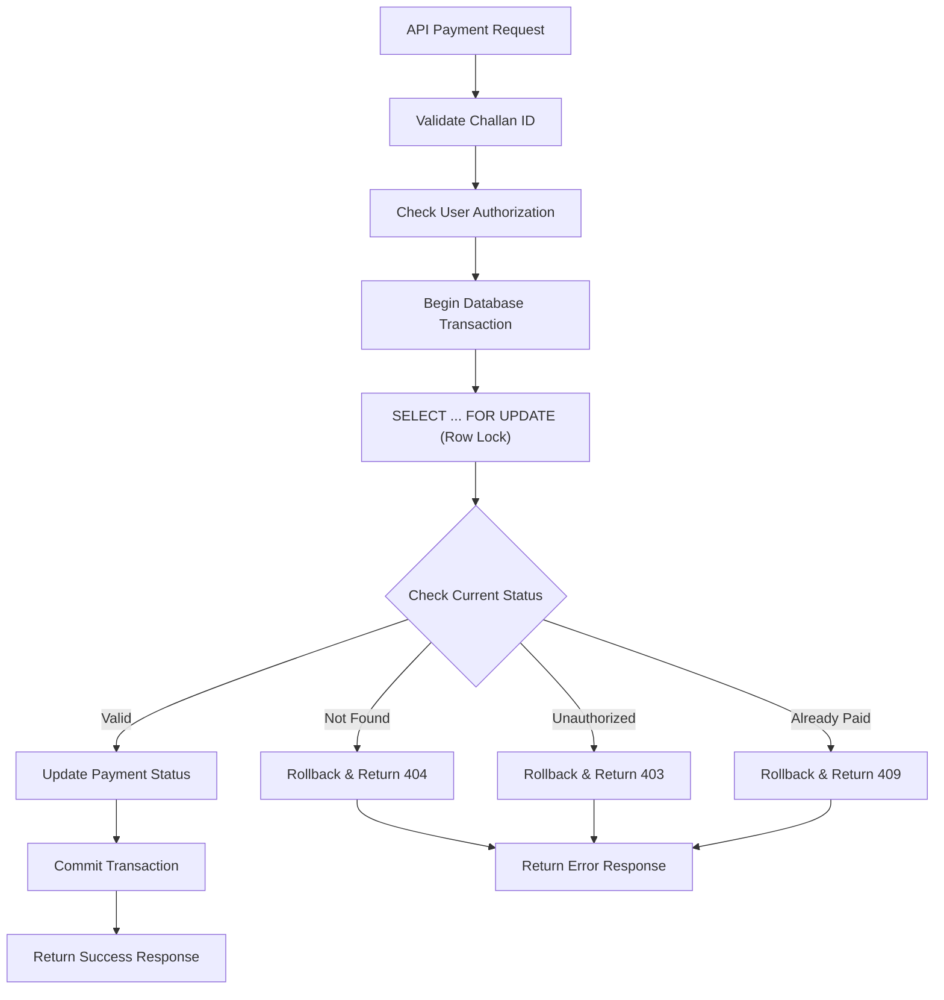
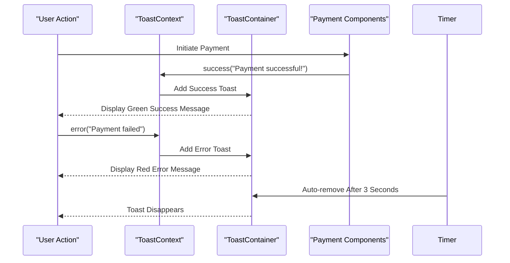
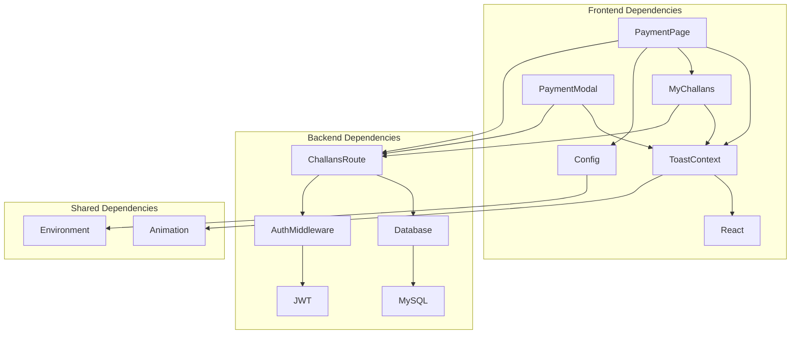
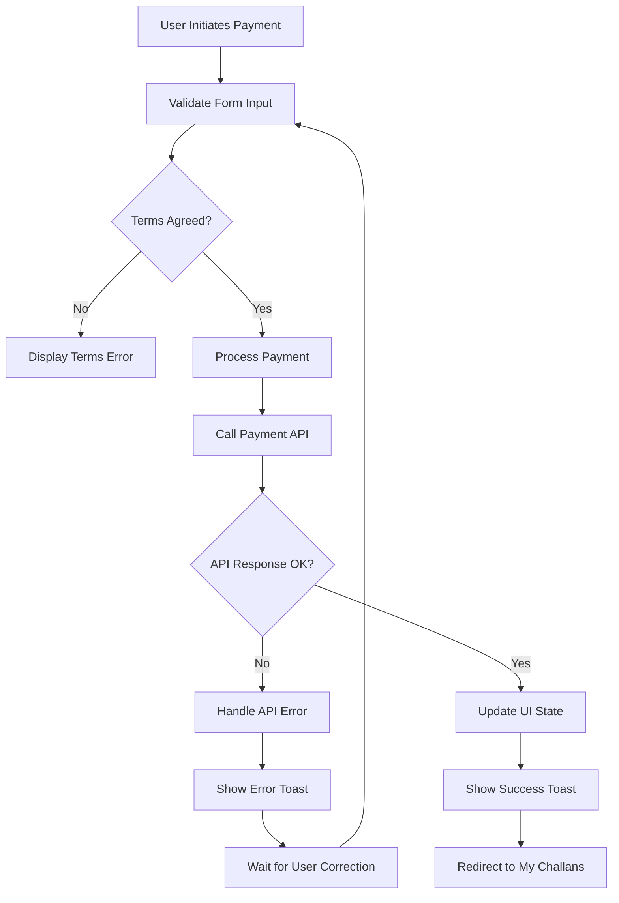

# Payment Processing Workflow

<cite>
**Referenced Files in This Document**
- [PaymentPage.jsx](file://frontend/src/pages/PaymentPage.jsx)
- [PaymentModal.jsx](file://frontend/src/components/PaymentModal.jsx)
- [MyChallans.jsx](file://frontend/src/pages/MyChallans.jsx)
- [ToastContext.jsx](file://frontend/src/context/ToastContext.jsx)
- [challans.js](file://backend/routes/challans.js)
- [db.js](file://backend/db.js)
- [schema.sql](file://db/schema.sql)
- [App.jsx](file://frontend/src/App.jsx)
- [config.js](file://frontend/src/config.js)
</cite>

## Table of Contents
1. [Introduction](#introduction)
2. [Project Structure](#project-structure)
3. [Core Components](#core-components)
4. [Architecture Overview](#architecture-overview)
5. [Detailed Component Analysis](#detailed-component-analysis)
6. [Dependency Analysis](#dependency-analysis)
7. [Performance Considerations](#performance-considerations)
8. [Troubleshooting Guide](#troubleshooting-guide)
9. [Conclusion](#conclusion)

## Introduction
This document provides comprehensive coverage of the payment processing workflow for traffic challan payments. It explains the complete flow from challan initiation to successful completion, including frontend payment page implementation, user interaction patterns, and backend transaction handling. The documentation covers the payment modal component structure, form validation, user experience flow, API integration patterns, error handling strategies, success/failure scenarios, demo payment simulation logic, timeout handling, and redirect mechanisms. It also details the payment method selection interface with six different payment options, the terms and conditions agreement flow, security considerations, and user feedback mechanisms through toast notifications.

## Project Structure
The payment processing system spans both frontend and backend components with clear separation of concerns:

- Frontend React application with dedicated payment page and modal components
- Backend Express.js API with MySQL database integration
- Real-time synchronization and security mechanisms
- Comprehensive toast notification system for user feedback

**Diagram sources**
- [App.jsx:1-274](file://frontend/src/App.jsx#L1-L274)
- [PaymentPage.jsx:1-481](file://frontend/src/pages/PaymentPage.jsx#L1-L481)
- [challans.js:1-101](file://backend/routes/challans.js#L1-L101)

**Section sources**
- [App.jsx:1-274](file://frontend/src/App.jsx#L1-L274)
- [PaymentPage.jsx:1-481](file://frontend/src/pages/PaymentPage.jsx#L1-L481)
- [challans.js:1-101](file://backend/routes/challans.js#L1-L101)

## Core Components
The payment processing workflow consists of several interconnected components that work together to provide a seamless user experience:

### Frontend Components
- **PaymentPage**: Main payment interface with challan details, payment method selection, and terms agreement
- **PaymentModal**: Modal dialog for payment confirmation with loading states and error handling
- **ToastContext**: Global notification system for user feedback
- **MyChallans**: Dashboard for challan management and payment initiation

### Backend Components
- **Express Routes**: API endpoints for challan payment processing
- **Database Layer**: MySQL integration with transaction support
- **Authentication**: Token-based security for citizen access

### Payment Methods
The system supports six distinct payment methods:
1. Credit/Debit Cards (Visa, Mastercard, RuPay)
2. UPI / Google Pay (PhonePe, Paytm, BHIM)
3. Net Banking (All major banks)
4. Digital Wallets (Amazon Pay, MobiKwik)
5. NEFT/RTGS Transfer (Direct bank transfer)
6. Offline Challan (Post Office/Bank)

**Section sources**
- [PaymentPage.jsx:82-89](file://frontend/src/pages/PaymentPage.jsx#L82-L89)
- [PaymentPage.jsx:91-101](file://frontend/src/pages/PaymentPage.jsx#L91-L101)
- [challans.js:31-98](file://backend/routes/challans.js#L31-L98)

## Architecture Overview
The payment processing architecture follows a client-server model with robust security and transaction handling:

**Diagram sources**
- [PaymentPage.jsx:46-80](file://frontend/src/pages/PaymentPage.jsx#L46-L80)
- [challans.js:31-98](file://backend/routes/challans.js#L31-L98)
- [db.js:1-26](file://backend/db.js#L1-L26)

The architecture implements several critical security measures:
- Row-level locking prevents double-payment race conditions
- Token-based authentication ensures authorized access
- ACID-compliant transactions guarantee data consistency
- Real-time synchronization keeps UI state current

## Detailed Component Analysis

### PaymentPage Component Analysis
The PaymentPage serves as the central hub for the payment workflow, providing a comprehensive interface for challan payment processing.

**Diagram sources**
- [PaymentPage.jsx:19-80](file://frontend/src/pages/PaymentPage.jsx#L19-L80)
- [PaymentPage.jsx:82-101](file://frontend/src/pages/PaymentPage.jsx#L82-L101)

Key features of the PaymentPage component:
- **Real-time Challan Loading**: Fetches challan details using citizen authentication
- **Payment Method Selection**: Grid-based interface with visual feedback
- **Terms & Conditions Validation**: Mandatory checkbox agreement
- **Demo Payment Simulation**: 2-second delay to mimic real payment processing
- **Toast Notifications**: Comprehensive user feedback system
- **Auto-Redirect**: Automatic navigation after successful payment

**Section sources**
- [PaymentPage.jsx:19-80](file://frontend/src/pages/PaymentPage.jsx#L19-L80)
- [PaymentPage.jsx:82-101](file://frontend/src/pages/PaymentPage.jsx#L82-L101)
- [PaymentPage.jsx:359-377](file://frontend/src/pages/PaymentPage.jsx#L359-L377)

### PaymentModal Component Analysis
The PaymentModal provides a focused payment confirmation interface with streamlined functionality.

**Diagram sources**
- [PaymentModal.jsx:1-99](file://frontend/src/components/PaymentModal.jsx#L1-L99)

The PaymentModal component offers:
- **Minimal Interface**: Focuses solely on payment confirmation
- **Loading States**: Visual feedback during payment processing
- **Error Handling**: Clear error messaging for failed transactions
- **Success Confirmation**: Visual success indicator with close option
- **Row-Level Locking**: Security through database transaction isolation

**Section sources**
- [PaymentModal.jsx:1-99](file://frontend/src/components/PaymentModal.jsx#L1-L99)

### Backend Transaction Processing
The backend implements robust transaction handling with multiple security layers:

**Diagram sources**
- [challans.js:31-98](file://backend/routes/challans.js#L31-L98)
- [schema.sql:173-195](file://db/schema.sql#L173-L195)

**Section sources**
- [challans.js:31-98](file://backend/routes/challans.js#L31-L98)
- [schema.sql:173-195](file://db/schema.sql#L173-L195)

### Toast Notification System
The toast notification system provides comprehensive user feedback across the payment workflow:

**Diagram sources**
- [ToastContext.jsx:1-112](file://frontend/src/context/ToastContext.jsx#L1-L112)

**Section sources**
- [ToastContext.jsx:1-112](file://frontend/src/context/ToastContext.jsx#L1-L112)

## Dependency Analysis
The payment processing system exhibits strong modularity with clear dependency relationships:

**Diagram sources**
- [PaymentPage.jsx:1-10](file://frontend/src/pages/PaymentPage.jsx#L1-L10)
- [challans.js:1-5](file://backend/routes/challans.js#L1-L5)
- [config.js:1-33](file://frontend/src/config.js#L1-L33)

**Section sources**
- [PaymentPage.jsx:1-10](file://frontend/src/pages/PaymentPage.jsx#L1-L10)
- [challans.js:1-5](file://backend/routes/challans.js#L1-L5)
- [config.js:1-33](file://frontend/src/config.js#L1-L33)

## Performance Considerations
The payment processing system incorporates several performance optimization strategies:

### Database Performance
- **Row-Level Locking**: Prevents contention while maintaining concurrency
- **Connection Pooling**: Efficient database connection management
- **Index Optimization**: Strategic indexing on frequently queried columns
- **Transaction Batching**: Minimizes database round trips

### Frontend Performance
- **Lazy Loading**: Components load only when needed
- **State Management**: Efficient state updates to minimize re-renders
- **Animation Optimization**: Smooth transitions without blocking UI
- **Real-time Updates**: 3-second polling interval balances freshness and performance

### Security Performance
- **Token Validation**: Lightweight JWT verification
- **Input Sanitization**: Minimal processing overhead
- **Rate Limiting**: Built into authentication middleware
- **SSL/TLS**: Encrypted communication with minimal performance impact

## Troubleshooting Guide

### Common Payment Issues
1. **Payment Not Processing**: Check network connectivity and API endpoint availability
2. **Double Payment Errors**: Verify row-level locking implementation and transaction isolation
3. **Authentication Failures**: Confirm token validity and expiration
4. **Terms Agreement Errors**: Ensure checkbox validation before payment initiation

### Error Handling Patterns
The system implements comprehensive error handling across all layers:

**Diagram sources**
- [PaymentPage.jsx:46-80](file://frontend/src/pages/PaymentPage.jsx#L46-L80)
- [ToastContext.jsx:16-32](file://frontend/src/context/ToastContext.jsx#L16-L32)

### Debugging Strategies
- **Console Logging**: Track API requests and responses
- **Network Monitoring**: Inspect request/response timing
- **Database Triggers**: Monitor transaction execution
- **User Feedback**: Utilize toast notifications for immediate feedback

**Section sources**
- [PaymentPage.jsx:46-80](file://frontend/src/pages/PaymentPage.jsx#L46-L80)
- [ToastContext.jsx:16-32](file://frontend/src/context/ToastContext.jsx#L16-L32)

## Conclusion
The payment processing workflow demonstrates a well-architected system that balances user experience with robust security and reliability. The implementation showcases modern React patterns, comprehensive error handling, and enterprise-grade database transaction management. The six payment method options provide flexibility while maintaining security through row-level locking and authentication. The toast notification system ensures users receive timely feedback throughout the payment process. The real-time synchronization and auto-redirect mechanisms enhance the overall user experience while maintaining data consistency.

The system's modular design allows for easy maintenance and future enhancements, particularly with the upcoming payment gateway integration planned for Q2 2026. The current implementation provides a solid foundation for production deployment while offering clear pathways for expansion and improvement.