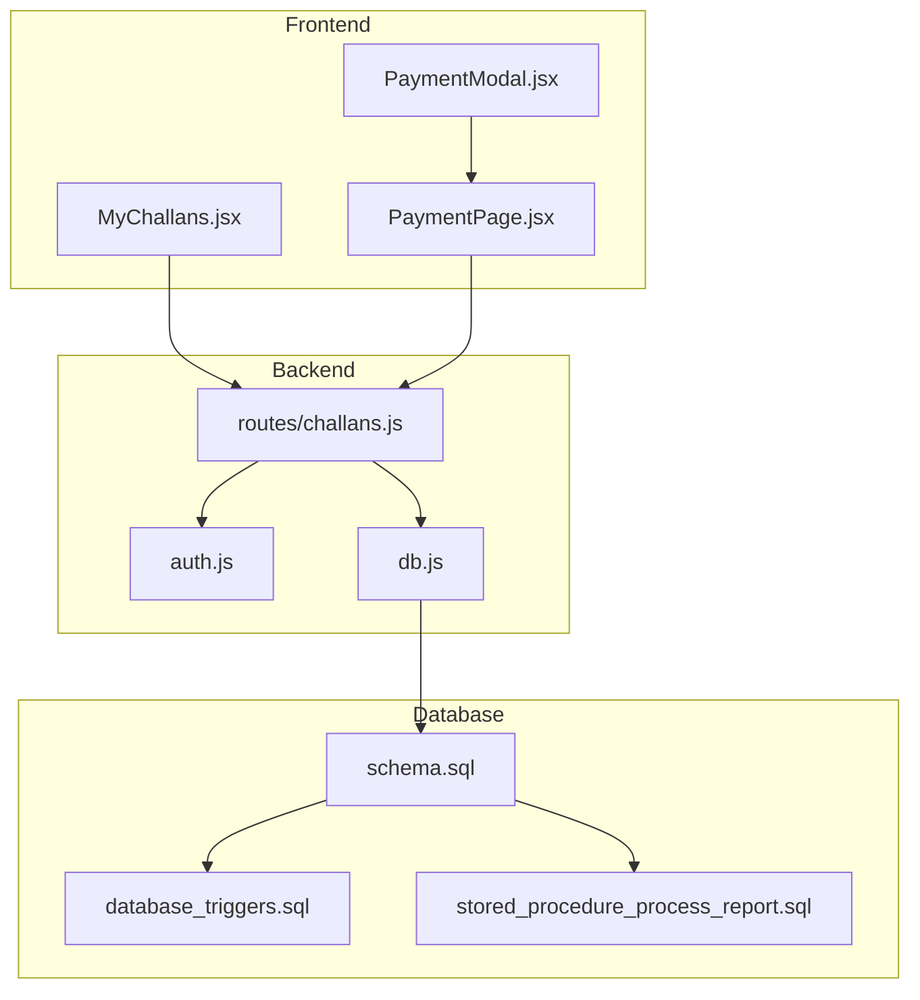
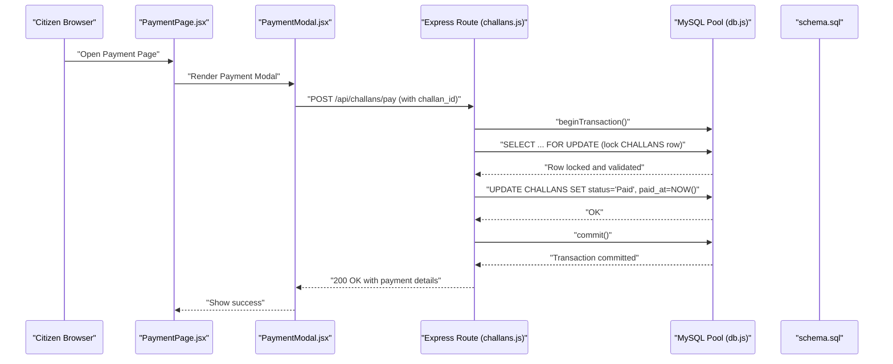
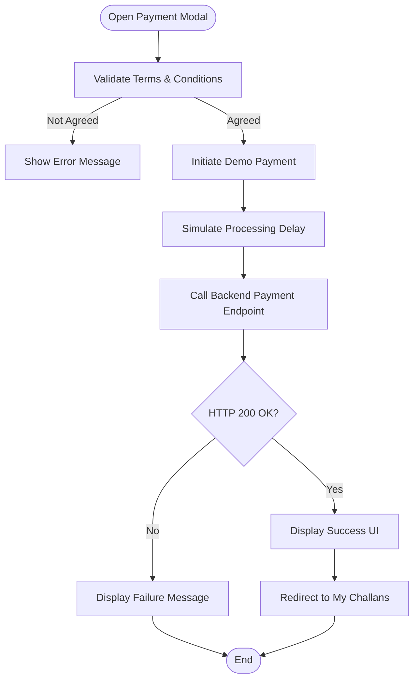
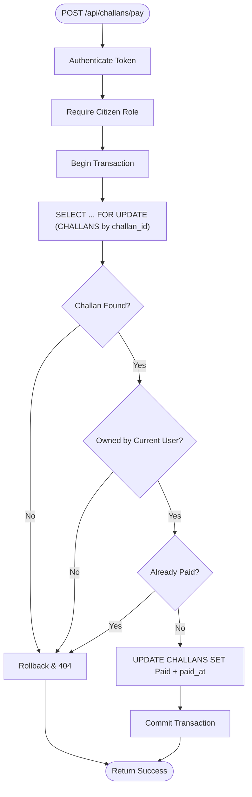
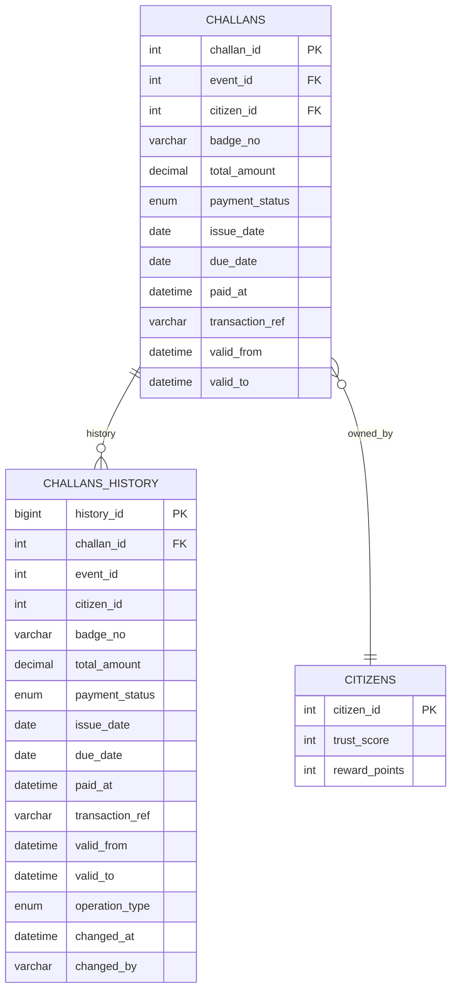
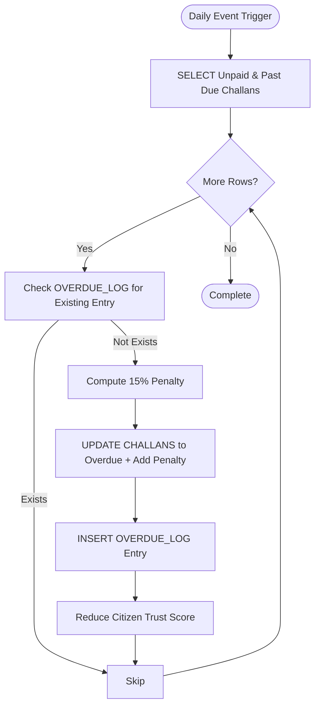
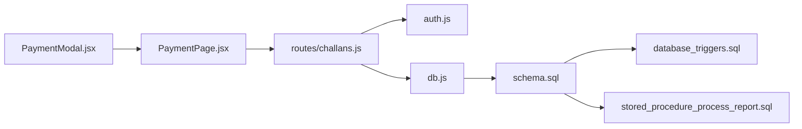

# Payment System

<cite>
**Referenced Files in This Document**
- [challans.js](file://backend/routes/challans.js)
- [PaymentModal.jsx](file://frontend/src/components/PaymentModal.jsx)
- [PaymentPage.jsx](file://frontend/src/pages/PaymentPage.jsx)
- [MyChallans.jsx](file://frontend/src/pages/MyChallans.jsx)
- [db.js](file://backend/db.js)
- [auth.js](file://backend/middleware/auth.js)
- [schema.sql](file://db/schema.sql)
- [stored_procedure_process_report.sql](file://db/stored_procedure_process_report.sql)
- [database_triggers.sql](file://db/database_triggers.sql)
</cite>

## Table of Contents
1. [Introduction](#introduction)
2. [Project Structure](#project-structure)
3. [Core Components](#core-components)
4. [Architecture Overview](#architecture-overview)
5. [Detailed Component Analysis](#detailed-component-analysis)
6. [Dependency Analysis](#dependency-analysis)
7. [Performance Considerations](#performance-considerations)
8. [Troubleshooting Guide](#troubleshooting-guide)
9. [Conclusion](#conclusion)

## Introduction
This document describes the payment processing system for traffic challans, focusing on the end-to-end workflow from initiation to completion. It covers:
- Payment modal implementation and transaction processing
- Row-level locking to prevent double-payment race conditions
- Overdue penalty calculation and automatic challan flagging
- Payment gateway integration patterns and transaction reference generation
- Payment history tracking and audit trail
- Challan generation triggered by successful payments and stored procedure integration
- Security measures, fraud prevention, and error handling for failed transactions
- Examples of payment flow implementations, database transaction handling, and frontend UI components

## Project Structure
The payment system spans three layers:
- Frontend React components for user interaction and payment presentation
- Backend Express routes enforcing authentication and orchestrating payment logic
- Database with ACID-compliant transactions, stored procedures, and triggers for audit and automation

**Diagram sources**
- [PaymentModal.jsx:1-99](file://frontend/src/components/PaymentModal.jsx#L1-L99)
- [PaymentPage.jsx:1-481](file://frontend/src/pages/PaymentPage.jsx#L1-L481)
- [MyChallans.jsx:1-207](file://frontend/src/pages/MyChallans.jsx#L1-L207)
- [auth.js:1-37](file://backend/middleware/auth.js#L1-L37)
- [db.js:1-26](file://backend/db.js#L1-L26)
- [challans.js:1-101](file://backend/routes/challans.js#L1-L101)
- [schema.sql:173-235](file://db/schema.sql#L173-L235)
- [database_triggers.sql:1-48](file://db/database_triggers.sql#L1-L48)
- [stored_procedure_process_report.sql:8-98](file://db/stored_procedure_process_report.sql#L8-L98)

**Section sources**
- [PaymentModal.jsx:1-99](file://frontend/src/components/PaymentModal.jsx#L1-L99)
- [PaymentPage.jsx:1-481](file://frontend/src/pages/PaymentPage.jsx#L1-L481)
- [MyChallans.jsx:1-207](file://frontend/src/pages/MyChallans.jsx#L1-L207)
- [auth.js:1-37](file://backend/middleware/auth.js#L1-L37)
- [db.js:1-26](file://backend/db.js#L1-L26)
- [challans.js:1-101](file://backend/routes/challans.js#L1-L101)
- [schema.sql:173-235](file://db/schema.sql#L173-L235)
- [database_triggers.sql:1-48](file://db/database_triggers.sql#L1-L48)
- [stored_procedure_process_report.sql:8-98](file://db/stored_procedure_process_report.sql#L8-L98)

## Core Components
- Frontend Payment Modal and Page: Present challan details, accept payment method selection, enforce terms agreement, and simulate payment processing.
- Backend Payment Route: Authenticate users, enforce role checks, and perform row-level locking to prevent double payments.
- Database Schema: Defines CHALLANS, CHALLANS_HISTORY, and OVERDUE_LOG for payment lifecycle and audit.
- Stored Procedures: Encapsulate ACID transactions for challan issuance and payment processing.
- Triggers: Maintain temporal audit trails and enforce automatic updates for trust scoring and payment history.

Key implementation references:
- Payment route with row-level locking and transaction handling: [challans.js:31-98](file://backend/routes/challans.js#L31-L98)
- Frontend payment UI and demo payment flow: [PaymentPage.jsx:46-80](file://frontend/src/pages/PaymentPage.jsx#L46-L80), [PaymentModal.jsx:10-22](file://frontend/src/components/PaymentModal.jsx#L10-L22)
- Database schema for CHALLANS and audit/history: [schema.sql:173-235](file://db/schema.sql#L173-L235)
- Stored procedure for payment with row-level locking: [schema.sql:549-629](file://db/schema.sql#L549-L629)
- Overdue penalty automation and event scheduling: [schema.sql:689-754](file://db/schema.sql#L689-L754), [schema.sql:928-936](file://db/schema.sql#L928-L936)

**Section sources**
- [challans.js:31-98](file://backend/routes/challans.js#L31-L98)
- [PaymentPage.jsx:46-80](file://frontend/src/pages/PaymentPage.jsx#L46-L80)
- [PaymentModal.jsx:10-22](file://frontend/src/components/PaymentModal.jsx#L10-L22)
- [schema.sql:173-235](file://db/schema.sql#L173-L235)
- [schema.sql:549-629](file://db/schema.sql#L549-L629)
- [schema.sql:689-754](file://db/schema.sql#L689-L754)
- [schema.sql:928-936](file://db/schema.sql#L928-L936)

## Architecture Overview
The payment architecture ensures strong isolation and atomicity:
- Authentication middleware validates tokens and roles.
- Payment route initiates a database transaction, locks the target challan row, verifies ownership and status, updates payment fields, and commits.
- Audit and history are maintained via triggers and CHALLANS_HISTORY.
- Overdue penalties are computed periodically by a scheduled event invoking a stored procedure.

**Diagram sources**
- [PaymentPage.jsx:46-80](file://frontend/src/pages/PaymentPage.jsx#L46-L80)
- [PaymentModal.jsx:10-22](file://frontend/src/components/PaymentModal.jsx#L10-L22)
- [challans.js:31-98](file://backend/routes/challans.js#L31-L98)
- [db.js:1-26](file://backend/db.js#L1-L26)
- [schema.sql:173-235](file://db/schema.sql#L173-L235)

## Detailed Component Analysis

### Payment Modal and Page (Frontend)
- PaymentModal displays challan details and handles user actions with loading, success, and error states.
- PaymentPage loads challan details, enforces Terms & Conditions, simulates payment processing delay, and navigates on success.

Implementation highlights:
- Modal action flow: [PaymentModal.jsx:10-22](file://frontend/src/components/PaymentModal.jsx#L10-L22)
- PaymentPage flow and demo processing: [PaymentPage.jsx:46-80](file://frontend/src/pages/PaymentPage.jsx#L46-L80)

**Diagram sources**
- [PaymentPage.jsx:46-80](file://frontend/src/pages/PaymentPage.jsx#L46-L80)
- [PaymentModal.jsx:10-22](file://frontend/src/components/PaymentModal.jsx#L10-L22)

**Section sources**
- [PaymentModal.jsx:1-99](file://frontend/src/components/PaymentModal.jsx#L1-L99)
- [PaymentPage.jsx:1-481](file://frontend/src/pages/PaymentPage.jsx#L1-L481)

### Backend Payment Route (Row-Level Locking)
- Authenticates and authorizes citizens, begins a transaction, locks the specific challan row, validates ownership and status, updates payment fields, and commits.
- Ensures no double payment by checking status and using SELECT ... FOR UPDATE.

Key references:
- Route definition and transaction flow: [challans.js:31-98](file://backend/routes/challans.js#L31-L98)
- Authentication middleware: [auth.js:1-37](file://backend/middleware/auth.js#L1-L37)
- Database pool configuration: [db.js:1-26](file://backend/db.js#L1-L26)

**Diagram sources**
- [challans.js:31-98](file://backend/routes/challans.js#L31-L98)
- [auth.js:1-37](file://backend/middleware/auth.js#L1-L37)
- [db.js:1-26](file://backend/db.js#L1-L26)

**Section sources**
- [challans.js:31-98](file://backend/routes/challans.js#L31-L98)
- [auth.js:1-37](file://backend/middleware/auth.js#L1-L37)
- [db.js:1-26](file://backend/db.js#L1-L26)

### Database Schema and Audit Trail
- CHALLANS stores payment lifecycle fields including payment_status, due_date, paid_at, and transaction_ref.
- CHALLANS_HISTORY captures temporal changes for auditability.
- Triggers maintain history and enforce automatic trust score adjustments.

References:
- CHALLANS and CHALLANS_HISTORY definitions: [schema.sql:173-235](file://db/schema.sql#L173-L235)
- CHALLANS history triggers: [schema.sql:384-429](file://db/schema.sql#L384-L429)
- Trust score triggers: [database_triggers.sql:8-35](file://db/database_triggers.sql#L8-L35)

**Diagram sources**
- [schema.sql:173-235](file://db/schema.sql#L173-L235)
- [schema.sql:384-429](file://db/schema.sql#L384-L429)

**Section sources**
- [schema.sql:173-235](file://db/schema.sql#L173-L235)
- [schema.sql:384-429](file://db/schema.sql#L384-L429)
- [database_triggers.sql:8-35](file://db/database_triggers.sql#L8-L35)

### Overdue Penalty Calculation and Automatic Flagging
- A scheduled event runs daily to flag overdue challans.
- The stored procedure iterates unpaid challans past due date, computes a 15% penalty, updates status to Overdue, logs in OVERDUE_LOG, and reduces trust score.

References:
- Event scheduling: [schema.sql:928-936](file://db/schema.sql#L928-L936)
- Procedure logic: [schema.sql:689-754](file://db/schema.sql#L689-L754)
- OVERDUE_LOG table: [schema.sql:224-235](file://db/schema.sql#L224-L235)

**Diagram sources**
- [schema.sql:928-936](file://db/schema.sql#L928-L936)
- [schema.sql:689-754](file://db/schema.sql#L689-L754)
- [schema.sql:224-235](file://db/schema.sql#L224-L235)

**Section sources**
- [schema.sql:928-936](file://db/schema.sql#L928-L936)
- [schema.sql:689-754](file://db/schema.sql#L689-L754)
- [schema.sql:224-235](file://db/schema.sql#L224-L235)

### Payment Gateway Integration Patterns and Transaction Reference Generation
- The CHALLANS table includes a transaction_ref field for storing gateway-generated references.
- The payment flow sets paid_at and updates payment_status upon successful processing.
- Frontend indicates “Secured by Government Payment Gateway” and mentions row-level locking for security.

References:
- CHALLANS fields: [schema.sql:173-187](file://db/schema.sql#L173-L187)
- Frontend security messaging: [PaymentPage.jsx:379-382](file://frontend/src/pages/PaymentPage.jsx#L379-L382), [PaymentModal.jsx:87-89](file://frontend/src/components/PaymentModal.jsx#L87-L89)

**Section sources**
- [schema.sql:173-187](file://db/schema.sql#L173-L187)
- [PaymentPage.jsx:379-382](file://frontend/src/pages/PaymentPage.jsx#L379-L382)
- [PaymentModal.jsx:87-89](file://frontend/src/components/PaymentModal.jsx#L87-L89)

### Challan Generation and Stored Procedure Integration
- A stored procedure encapsulates the end-to-end flow for issuing challans after verification, ensuring ACID compliance and error handling.
- The procedure validates inputs, inserts violation events, and creates challans with due dates.

References:
- Stored procedure for report processing and challan issuance: [stored_procedure_process_report.sql:8-98](file://db/stored_procedure_process_report.sql#L8-L98)
- Alternative stored procedure for payment: [schema.sql:549-629](file://db/schema.sql#L549-L629)

**Section sources**
- [stored_procedure_process_report.sql:8-98](file://db/stored_procedure_process_report.sql#L8-L98)
- [schema.sql:549-629](file://db/schema.sql#L549-L629)

### Payment History Tracking and Audit Trail
- CHALLANS_HISTORY captures all updates with operation_type, timestamps, and changed_by.
- Triggers fire before/after updates to populate history and maintain temporal validity.

References:
- History table and triggers: [schema.sql:198-235](file://db/schema.sql#L198-L235), [schema.sql:384-429](file://db/schema.sql#L384-L429)

**Section sources**
- [schema.sql:198-235](file://db/schema.sql#L198-L235)
- [schema.sql:384-429](file://db/schema.sql#L384-L429)

### Security Measures, Fraud Prevention, and Error Handling
- Row-level locking prevents race conditions during payment.
- Authentication middleware enforces JWT-based access control.
- Stored procedures centralize validation and rollback on errors.
- Frontend enforces Terms & Conditions and provides user feedback.

References:
- Row-level locking and validation: [challans.js:47-78](file://backend/routes/challans.js#L47-L78)
- Authentication and role guards: [auth.js:1-37](file://backend/middleware/auth.js#L1-L37)
- Stored procedure error handling: [schema.sql:565-570](file://db/schema.sql#L565-L570)
- Frontend error handling and UX: [PaymentModal.jsx:17-21](file://frontend/src/components/PaymentModal.jsx#L17-L21), [PaymentPage.jsx:75-79](file://frontend/src/pages/PaymentPage.jsx#L75-L79)

**Section sources**
- [challans.js:47-78](file://backend/routes/challans.js#L47-L78)
- [auth.js:1-37](file://backend/middleware/auth.js#L1-L37)
- [schema.sql:565-570](file://db/schema.sql#L565-L570)
- [PaymentModal.jsx:17-21](file://frontend/src/components/PaymentModal.jsx#L17-L21)
- [PaymentPage.jsx:75-79](file://frontend/src/pages/PaymentPage.jsx#L75-L79)

## Dependency Analysis
The payment system exhibits clear separation of concerns:
- Frontend depends on backend routes for payment operations.
- Backend depends on the database pool and enforces middleware policies.
- Database depends on stored procedures and triggers for automation and audit.

**Diagram sources**
- [PaymentModal.jsx:1-99](file://frontend/src/components/PaymentModal.jsx#L1-L99)
- [PaymentPage.jsx:1-481](file://frontend/src/pages/PaymentPage.jsx#L1-L481)
- [challans.js:1-101](file://backend/routes/challans.js#L1-L101)
- [auth.js:1-37](file://backend/middleware/auth.js#L1-L37)
- [db.js:1-26](file://backend/db.js#L1-L26)
- [schema.sql:173-235](file://db/schema.sql#L173-L235)
- [database_triggers.sql:1-48](file://db/database_triggers.sql#L1-L48)
- [stored_procedure_process_report.sql:8-98](file://db/stored_procedure_process_report.sql#L8-L98)

**Section sources**
- [PaymentModal.jsx:1-99](file://frontend/src/components/PaymentModal.jsx#L1-L99)
- [PaymentPage.jsx:1-481](file://frontend/src/pages/PaymentPage.jsx#L1-L481)
- [challans.js:1-101](file://backend/routes/challans.js#L1-L101)
- [auth.js:1-37](file://backend/middleware/auth.js#L1-L37)
- [db.js:1-26](file://backend/db.js#L1-L26)
- [schema.sql:173-235](file://db/schema.sql#L173-L235)
- [database_triggers.sql:1-48](file://db/database_triggers.sql#L1-L48)
- [stored_procedure_process_report.sql:8-98](file://db/stored_procedure_process_report.sql#L8-L98)

## Performance Considerations
- Row-level locking minimizes contention and avoids double payments but requires careful index usage on challan_id and foreign keys.
- Scheduled events for overdue checks should run during off-peak hours to reduce load.
- Frontend polling intervals should balance responsiveness with network overhead; consider WebSocket or server-sent events for real-time updates.

## Troubleshooting Guide
Common issues and resolutions:
- Payment fails with “already paid”: Verify challan status and retry after refresh. [challans.js:68-72](file://backend/routes/challans.js#L68-L72)
- Unauthorized access: Ensure the logged-in citizen owns the challan. [challans.js:62-66](file://backend/routes/challans.js#L62-L66)
- Transaction errors: Stored procedures roll back on exceptions; check database logs and retry. [schema.sql:565-570](file://db/schema.sql#L565-L570)
- Overdue penalties not applied: Confirm scheduled event is enabled and procedure executed. [schema.sql:928-936](file://db/schema.sql#L928-L936), [schema.sql:689-754](file://db/schema.sql#L689-L754)

**Section sources**
- [challans.js:62-72](file://backend/routes/challans.js#L62-L72)
- [schema.sql:565-570](file://db/schema.sql#L565-L570)
- [schema.sql:928-936](file://db/schema.sql#L928-L936)
- [schema.sql:689-754](file://db/schema.sql#L689-L754)

## Conclusion
The payment system integrates robust frontend UI, backend authentication and transaction control, and database-level automation through stored procedures and triggers. Row-level locking guarantees consistency, while scheduled events and audit tables provide transparency and compliance. The modular design supports future enhancements such as live payment gateway integration and expanded reporting.