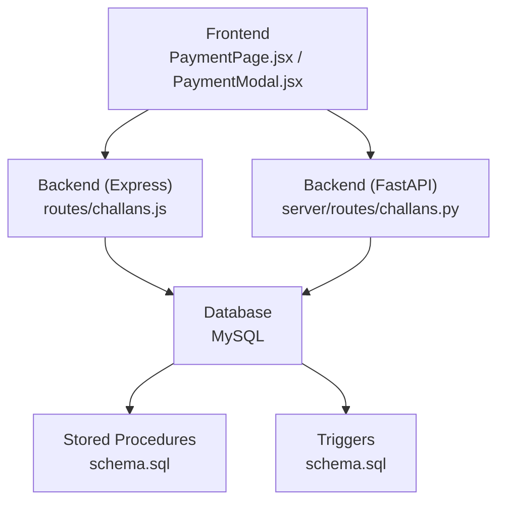
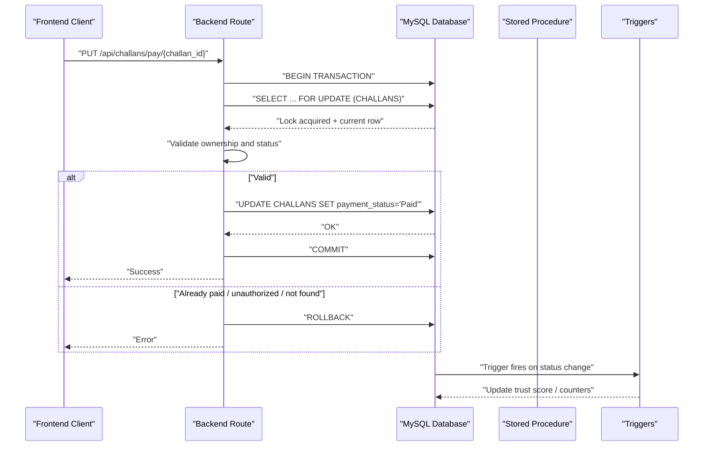
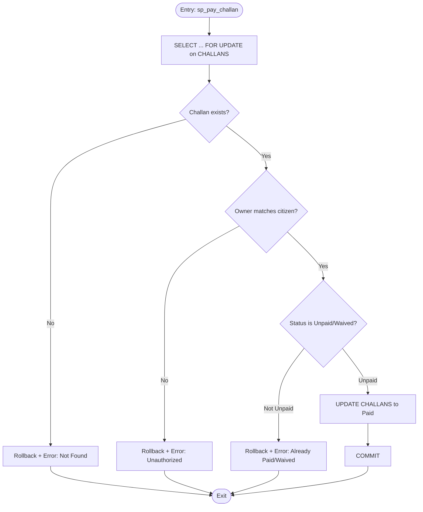
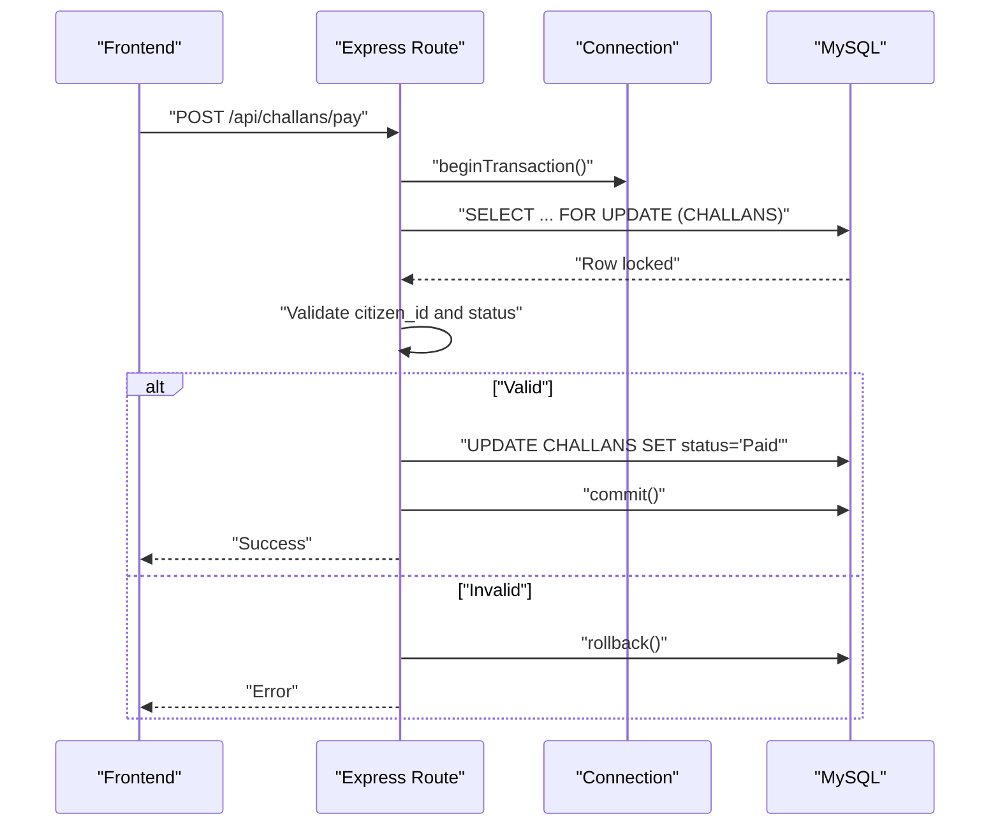
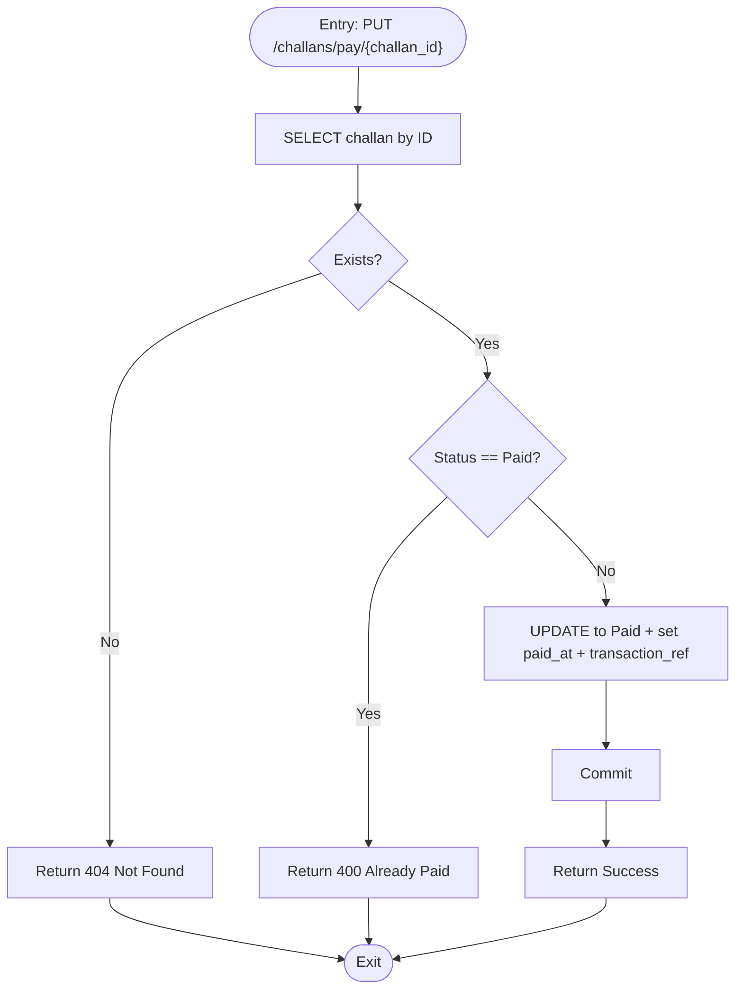
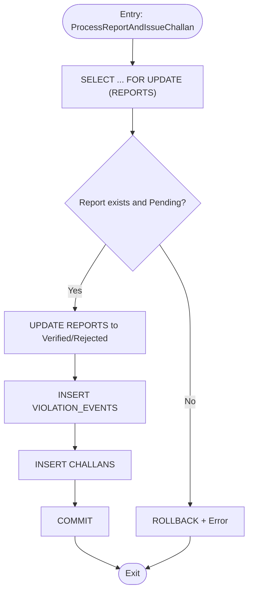
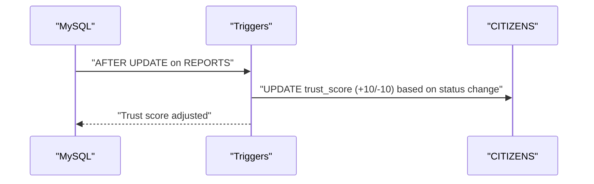
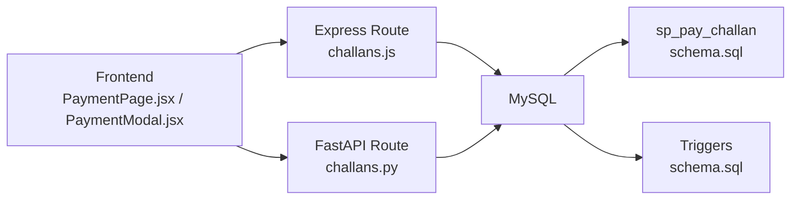

# Row-Level Locking Mechanism

<cite>
**Referenced Files in This Document**
- [schema.sql](file://db/schema.sql)
- [stored_procedure_process_report.sql](file://db/stored_procedure_process_report.sql)
- [database_triggers.sql](file://db/database_triggers.sql)
- [marga_rakshak_triggers.sql](file://db/marga_rakshak_triggers.sql)
- [challans.js](file://backend/routes/challans.js)
- [PaymentPage.jsx](file://frontend/src/pages/PaymentPage.jsx)
- [PaymentModal.jsx](file://frontend/src/components/PaymentModal.jsx)
- [db.js](file://backend/db.js)
- [database.py](file://server/database.py)
- [challans.py](file://server/routes/challans.py)
</cite>

## Table of Contents
1. [Introduction](#introduction)
2. [Project Structure](#project-structure)
3. [Core Components](#core-components)
4. [Architecture Overview](#architecture-overview)
5. [Detailed Component Analysis](#detailed-component-analysis)
6. [Dependency Analysis](#dependency-analysis)
7. [Performance Considerations](#performance-considerations)
8. [Troubleshooting Guide](#troubleshooting-guide)
9. [Conclusion](#conclusion)

## Introduction
This document explains the row-level locking mechanism that prevents double-payment race conditions in the traffic violation management system. It details how SELECT FOR UPDATE statements in stored procedures and triggers ensure atomicity during concurrent payment processing, outlines transaction isolation levels, lock acquisition timing, and deadlock prevention strategies. It also describes the integration with the challan payment workflow, demonstrates rollback scenarios, and provides performance and monitoring guidance.

## Project Structure
The payment workflow spans frontend, backend, and database layers:
- Frontend: PaymentPage and PaymentModal components orchestrate user actions and API calls.
- Backend: Express route (JavaScript) and FastAPI route (Python) handle payment requests and enforce row-level locks.
- Database: Stored procedures and triggers manage ACID guarantees and automatic trust scoring.

**Diagram sources**
- [PaymentPage.jsx:1-481](file://frontend/src/pages/PaymentPage.jsx#L1-L481)
- [PaymentModal.jsx:1-99](file://frontend/src/components/PaymentModal.jsx#L1-L99)
- [challans.js:1-101](file://backend/routes/challans.js#L1-L101)
- [challans.py:1-450](file://server/routes/challans.py#L1-L450)
- [schema.sql:440-629](file://db/schema.sql#L440-L629)

**Section sources**
- [PaymentPage.jsx:1-481](file://frontend/src/pages/PaymentPage.jsx#L1-L481)
- [PaymentModal.jsx:1-99](file://frontend/src/components/PaymentModal.jsx#L1-L99)
- [challans.js:1-101](file://backend/routes/challans.js#L1-L101)
- [challans.py:1-450](file://server/routes/challans.py#L1-L450)
- [schema.sql:440-629](file://db/schema.sql#L440-L629)

## Core Components
- Row-level locking via SELECT ... FOR UPDATE in stored procedures and backend routes.
- ACID-compliant transactions with explicit rollback on errors.
- Payment validation checks: existence, ownership, and status transitions.
- Automatic trust score updates via triggers on report status changes.

Key implementation locations:
- Stored procedure for payment: [sp_pay_challan:552-629](file://db/schema.sql#L552-L629)
- Backend Express route with row-level lock: [POST /api/challans/pay:31-98](file://backend/routes/challans.js#L31-L98)
- Backend FastAPI route for payment: [PUT /challans/pay/{challan_id}:336-397](file://server/routes/challans.py#L336-L397)
- Report processing with row-level lock: [ProcessReportAndIssueChallan:8-98](file://db/stored_procedure_process_report.sql#L8-L98)
- Trust score triggers: [trg_report_status_trust:363-382](file://db/schema.sql#L363-L382), [Auto_Reward_System:16-28](file://db/marga_rakshak_triggers.sql#L16-L28), [Auto_Penalty_System:34-44](file://db/marga_rakshak_triggers.sql#L34-L44)

**Section sources**
- [schema.sql:552-629](file://db/schema.sql#L552-L629)
- [challans.js:31-98](file://backend/routes/challans.js#L31-L98)
- [challans.py:336-397](file://server/routes/challans.py#L336-L397)
- [stored_procedure_process_report.sql:8-98](file://db/stored_procedure_process_report.sql#L8-L98)
- [marga_rakshak_triggers.sql:16-44](file://db/marga_rakshak_triggers.sql#L16-L44)

## Architecture Overview
The payment workflow enforces atomicity and prevents race conditions by acquiring an exclusive row-level lock on the target challan before any state changes.

**Diagram sources**
- [challans.js:31-98](file://backend/routes/challans.js#L31-L98)
- [schema.sql:363-382](file://db/schema.sql#L363-L382)

## Detailed Component Analysis

### Stored Procedure Payment Lock (sp_pay_challan)
- Acquires a row-level lock using SELECT ... FOR UPDATE on CHALLANS.
- Validates existence, ownership, and non-paid/waived statuses.
- Updates payment_status, paid_at, and transaction_ref atomically within a transaction.
- Uses an exception handler to roll back on errors.

**Diagram sources**
- [schema.sql:552-629](file://db/schema.sql#L552-L629)

**Section sources**
- [schema.sql:552-629](file://db/schema.sql#L552-L629)

### Backend Express Route Payment Lock
- Begins a transaction, acquires a row-level lock via SELECT ... FOR UPDATE, validates ownership and status, updates payment_status, and commits or rolls back accordingly.

**Diagram sources**
- [challans.js:31-98](file://backend/routes/challans.js#L31-L98)

**Section sources**
- [challans.js:31-98](file://backend/routes/challans.js#L31-L98)

### Backend FastAPI Route Payment Lock
- Similar to Express route, but implemented in Python using pymysql. Retrieves challan, checks status, and updates payment_status.

**Diagram sources**
- [challans.py:336-397](file://server/routes/challans.py#L336-L397)

**Section sources**
- [challans.py:336-397](file://server/routes/challans.py#L336-L397)

### Report Processing and Row-Level Locking
- The stored procedure ProcessReportAndIssueChallan locks the REPORTS row before updating status and creating related records, preventing concurrent verification/rejection races.

**Diagram sources**
- [stored_procedure_process_report.sql:8-98](file://db/stored_procedure_process_report.sql#L8-L98)

**Section sources**
- [stored_procedure_process_report.sql:8-98](file://db/stored_procedure_process_report.sql#L8-L98)

### Trigger-Based Payment Validation and Trust Scoring
- While the payment itself is enforced by row-level locks, triggers automatically adjust trust scores when reports change status, reinforcing system integrity.

**Diagram sources**
- [schema.sql:363-382](file://db/schema.sql#L363-L382)
- [marga_rakshak_triggers.sql:16-44](file://db/marga_rakshak_triggers.sql#L16-L44)

**Section sources**
- [schema.sql:363-382](file://db/schema.sql#L363-L382)
- [marga_rakshak_triggers.sql:16-44](file://db/marga_rakshak_triggers.sql#L16-L44)

## Dependency Analysis
- Frontend depends on backend routes for payment operations.
- Backend routes depend on database connectivity and stored procedures/triggers.
- Database relies on stored procedures for atomic payment processing and triggers for trust scoring.

**Diagram sources**
- [PaymentPage.jsx:1-481](file://frontend/src/pages/PaymentPage.jsx#L1-L481)
- [PaymentModal.jsx:1-99](file://frontend/src/components/PaymentModal.jsx#L1-L99)
- [challans.js:1-101](file://backend/routes/challans.js#L1-L101)
- [challans.py:1-450](file://server/routes/challans.py#L1-L450)
- [schema.sql:552-629](file://db/schema.sql#L552-L629)

**Section sources**
- [PaymentPage.jsx:1-481](file://frontend/src/pages/PaymentPage.jsx#L1-L481)
- [PaymentModal.jsx:1-99](file://frontend/src/components/PaymentModal.jsx#L1-L99)
- [challans.js:1-101](file://backend/routes/challans.js#L1-L101)
- [challans.py:1-450](file://server/routes/challans.py#L1-L450)
- [schema.sql:552-629](file://db/schema.sql#L552-L629)

## Performance Considerations
- Lock duration: Keep SELECT ... FOR UPDATE and UPDATE within minimal transaction scope to reduce lock contention.
- Indexes: Ensure CHALLANS.challan_id is indexed (primary key) and CHALLANS.citizen_id is indexed for efficient filtering.
- Isolation level: Default REPEATABLE READ in MySQL provides consistent reads and prevents dirty reads; SELECT ... FOR UPDATE escalates to an exclusive lock for the targeted row.
- Deadlock prevention:
  - Always acquire locks in a consistent order across all operations.
  - Minimize transaction duration; avoid interactive prompts inside transactions.
  - Retry transient deadlocks with exponential backoff in application code.
- Monitoring:
  - Monitor lock wait timeouts and slow queries.
  - Track transaction latency and lock contention metrics.
  - Use MySQL’s performance schema and slow query log for diagnostics.

[No sources needed since this section provides general guidance]

## Troubleshooting Guide
Common issues and resolutions:
- Double-payment attempts:
  - Symptom: 409 Conflict or stored procedure error indicating already paid.
  - Resolution: Ensure SELECT ... FOR UPDATE is executed before UPDATE and commit occurs only after validation.
  - References: [challans.js:68-72](file://backend/routes/challans.js#L68-L72), [schema.sql:598-603](file://db/schema.sql#L598-L603)
- Unauthorized access:
  - Symptom: 403 Forbidden when trying to pay another citizen’s challan.
  - Resolution: Validate ownership before acquiring locks.
  - References: [challans.js:62-66](file://backend/routes/challans.js#L62-L66), [schema.sql:591-596](file://db/schema.sql#L591-L596)
- Not found:
  - Symptom: 404 Not Found when challan does not exist.
  - Resolution: Check challan existence before lock acquisition.
  - References: [challans.js:53-57](file://backend/routes/challans.js#L53-L57), [schema.sql:584-589](file://db/schema.sql#L584-L589)
- Deadlocks:
  - Symptom: Transaction rollback with deadlock error.
  - Resolution: Retry with backoff; ensure consistent lock ordering; reduce transaction scope.
  - References: [schema.sql:565-570](file://db/schema.sql#L565-L570), [challans.js:90-97](file://backend/routes/challans.js#L90-L97)
- Waived challans:
  - Symptom: 400 Bad Request indicating no payment required.
  - Resolution: Check payment_status before attempting payment.
  - References: [schema.sql:605-610](file://db/schema.sql#L605-L610)

**Section sources**
- [challans.js:31-98](file://backend/routes/challans.js#L31-L98)
- [schema.sql:552-629](file://db/schema.sql#L552-L629)

## Conclusion
The row-level locking mechanism using SELECT ... FOR UPDATE in stored procedures and backend routes effectively prevents double-payment race conditions. Combined with ACID-compliant transactions, explicit validation, and automatic trust scoring via triggers, the system ensures atomicity, consistency, and integrity across concurrent payment attempts. Proper indexing, isolation levels, and deadlock prevention strategies further enhance reliability and performance.