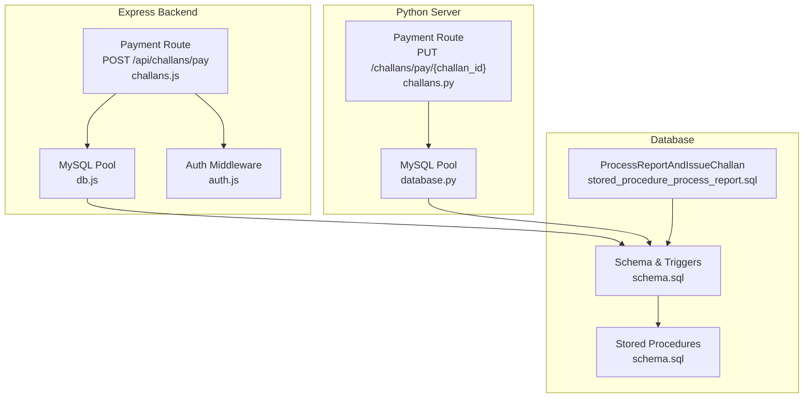
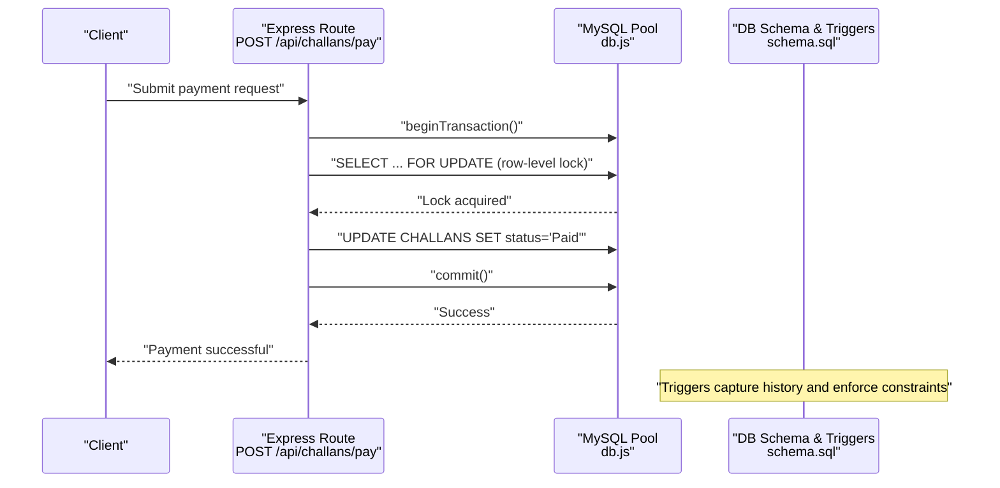
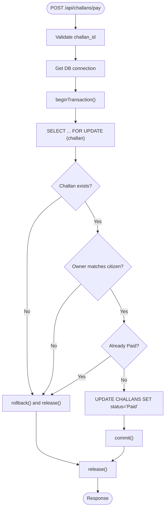
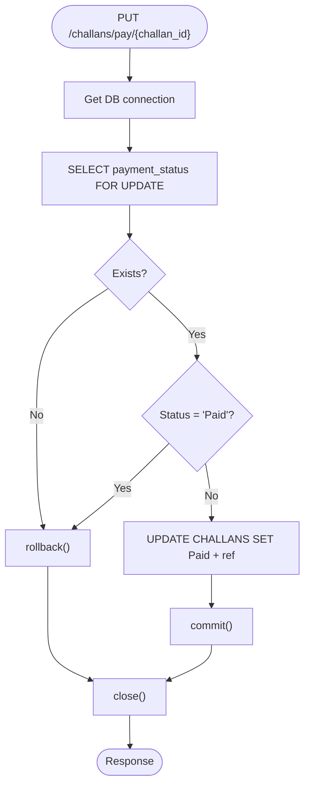
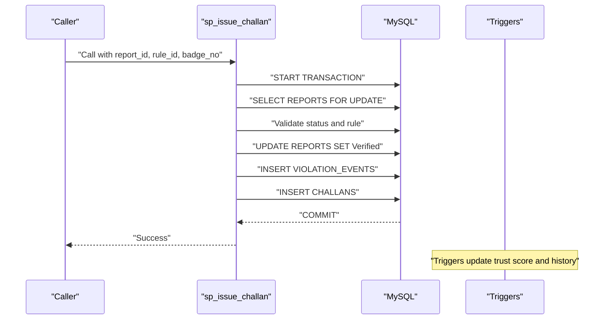
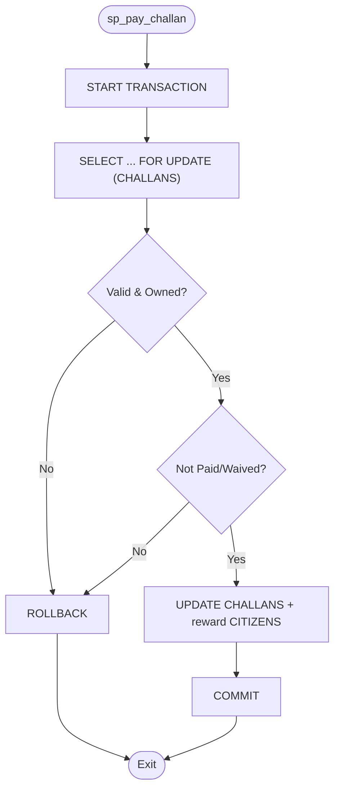
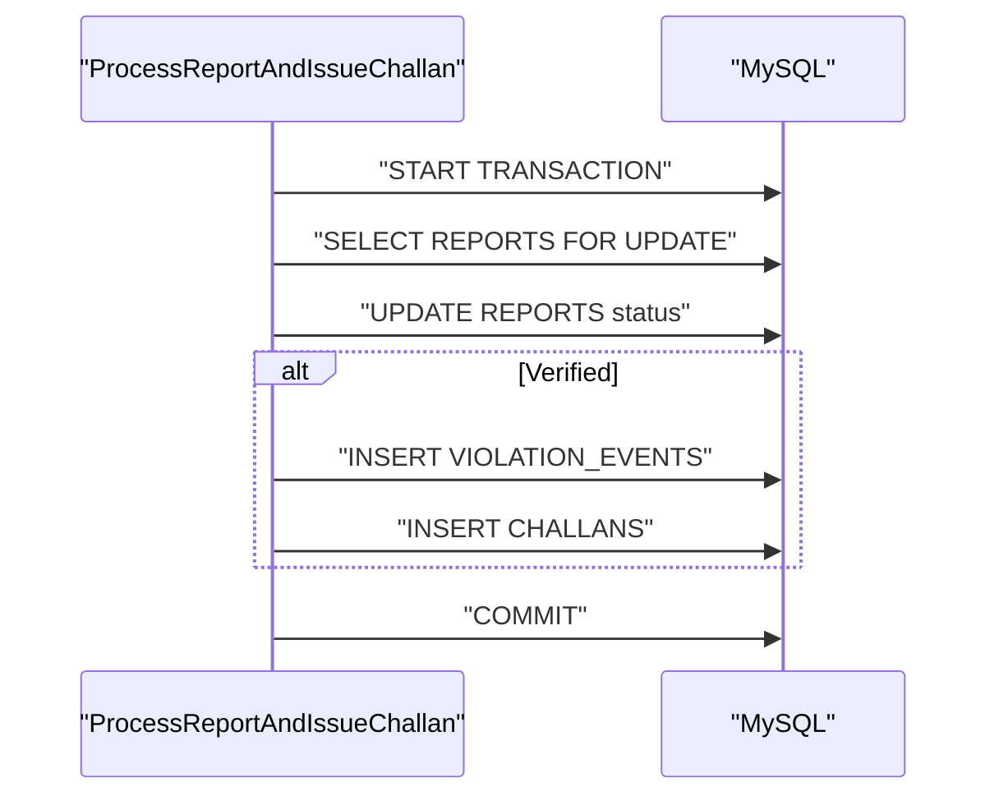
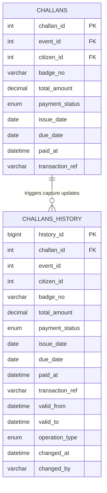
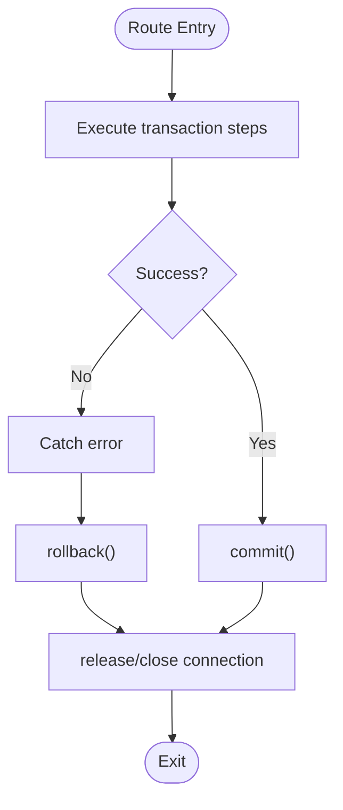
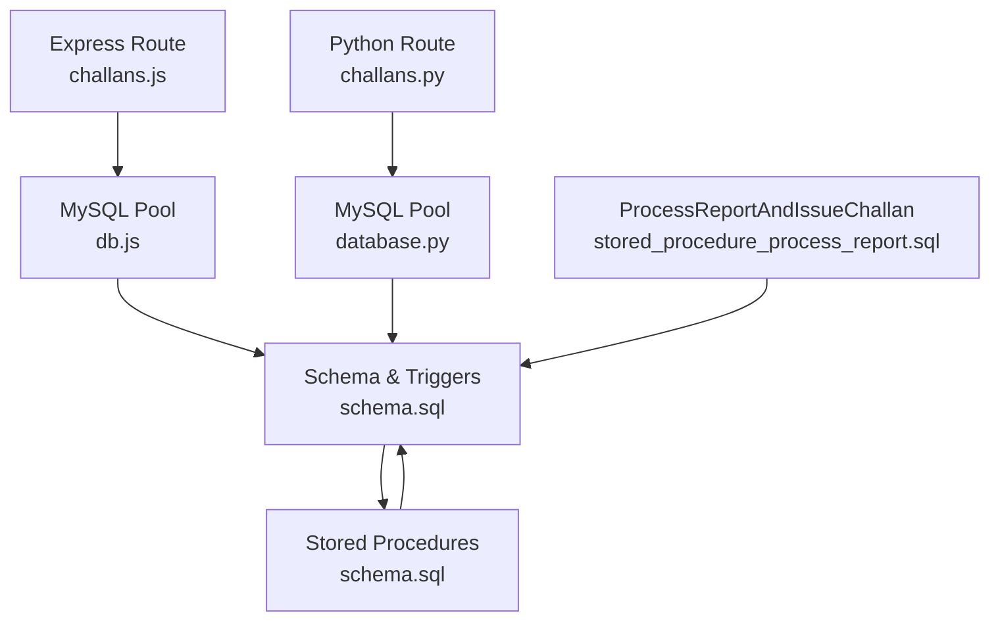

# Transaction Management

<cite>
**Referenced Files in This Document**
- [challans.js](file://backend/routes/challans.js)
- [db.js](file://backend/db.js)
- [auth.js](file://backend/middleware/auth.js)
- [schema.sql](file://db/schema.sql)
- [stored_procedure_process_report.sql](file://db/stored_procedure_process_report.sql)
- [database_triggers.sql](file://db/database_triggers.sql)
- [challans.py](file://server/routes/challans.py)
- [database.py](file://server/database.py)
</cite>

## Table of Contents
1. [Introduction](#introduction)
2. [Project Structure](#project-structure)
3. [Core Components](#core-components)
4. [Architecture Overview](#architecture-overview)
5. [Detailed Component Analysis](#detailed-component-analysis)
6. [Dependency Analysis](#dependency-analysis)
7. [Performance Considerations](#performance-considerations)
8. [Troubleshooting Guide](#troubleshooting-guide)
9. [Conclusion](#conclusion)

## Introduction
This document explains the transaction management system within the payment processing workflow for traffic violation challans. It covers ACID compliance, transaction boundaries, rollback mechanisms, stored procedure integration for challan generation and payment recording, isolation levels, consistency guarantees, audit trails, error handling, partial recovery, and orphaned transaction cleanup. It also details the relationship between payment transactions and challan generation triggers.

## Project Structure
The payment and challan lifecycle spans both the Express backend and the Python FastAPI server, backed by a MySQL database with stored procedures and triggers ensuring ACID guarantees and auditability.

**Diagram sources**
- [challans.js:31-98](file://backend/routes/challans.js#L31-L98)
- [db.js:1-26](file://backend/db.js#L1-L26)
- [auth.js:1-37](file://backend/middleware/auth.js#L1-L37)
- [challans.py:336-398](file://server/routes/challans.py#L336-L398)
- [database.py:14-76](file://server/database.py#L14-L76)
- [schema.sql:170-236](file://db/schema.sql#L170-L236)
- [stored_procedure_process_report.sql:8-98](file://db/stored_procedure_process_report.sql#L8-L98)

**Section sources**
- [challans.js:1-101](file://backend/routes/challans.js#L1-L101)
- [db.js:1-26](file://backend/db.js#L1-L26)
- [auth.js:1-37](file://backend/middleware/auth.js#L1-L37)
- [challans.py:1-450](file://server/routes/challans.py#L1-L450)
- [database.py:1-76](file://server/database.py#L1-L76)
- [schema.sql:1-942](file://db/schema.sql#L1-L942)
- [stored_procedure_process_report.sql:1-115](file://db/stored_procedure_process_report.sql#L1-L115)

## Core Components
- Express payment route with manual transaction control and row-level locking for safe double-payment prevention.
- Python payment route with manual transaction control and row-level locking for safe double-payment prevention.
- Stored procedures for challan issuance and payment processing with explicit transaction boundaries and rollback on errors.
- Database triggers for audit trail and consistency (trust score, temporal history, and report status transitions).
- Database schema enforcing referential integrity and constraints.

Key responsibilities:
- Enforce ACID properties for payment and challan operations.
- Prevent race conditions via row-level locks.
- Maintain audit trails via triggers and temporal history tables.
- Provide rollback and error signaling for partial failures.

**Section sources**
- [challans.js:31-98](file://backend/routes/challans.js#L31-L98)
- [challans.py:336-398](file://server/routes/challans.py#L336-L398)
- [schema.sql:440-629](file://db/schema.sql#L440-L629)
- [stored_procedure_process_report.sql:8-98](file://db/stored_procedure_process_report.sql#L8-L98)

## Architecture Overview
The payment workflow integrates frontend actions with backend routes and database-level ACID guarantees. Two pathways exist:
- Express route: POST /api/challans/pay performs row-level locking and commits the payment update.
- Python route: PUT /challans/pay/{challan_id} performs row-level locking and commits the payment update.

Both rely on database constraints and triggers to maintain consistency and auditability.

**Diagram sources**
- [challans.js:31-98](file://backend/routes/challans.js#L31-L98)
- [db.js:1-26](file://backend/db.js#L1-L26)
- [schema.sql:384-429](file://db/schema.sql#L384-L429)

**Section sources**
- [challans.js:31-98](file://backend/routes/challans.js#L31-L98)
- [db.js:1-26](file://backend/db.js#L1-L26)
- [schema.sql:384-429](file://db/schema.sql#L384-L429)

## Detailed Component Analysis

### Express Payment Route Transaction Control
- Transaction boundary: Explicit beginTransaction, commit, and rollback on errors.
- Isolation level: Row-level lock using SELECT ... FOR UPDATE prevents concurrent double-payments.
- Rollback conditions: Not found, unauthorized ownership, already paid, and general exceptions.
- Audit trail: CHALLANS_HISTORY captures updates via triggers.

**Diagram sources**
- [challans.js:31-98](file://backend/routes/challans.js#L31-L98)

**Section sources**
- [challans.js:31-98](file://backend/routes/challans.js#L31-L98)
- [db.js:1-26](file://backend/db.js#L1-L26)

### Python Payment Route Transaction Control
- Transaction boundary: Manual begin/commit/rollback around payment update.
- Isolation level: Row-level lock using SELECT ... FOR UPDATE prevents concurrent double-payments.
- Rollback conditions: Not found, already paid, and general exceptions.
- Audit trail: CHALLANS_HISTORY captures updates via triggers.

**Diagram sources**
- [challans.py:336-398](file://server/routes/challans.py#L336-L398)
- [database.py:52-76](file://server/database.py#L52-L76)

**Section sources**
- [challans.py:336-398](file://server/routes/challans.py#L336-L398)
- [database.py:52-76](file://server/database.py#L52-L76)

### Stored Procedure for Challan Generation and Payment Recording
- ACID compliance: START TRANSACTION, explicit rollback on errors, and COMMIT on success.
- Isolation: SELECT ... FOR UPDATE on REPORTS to prevent concurrent issuance.
- Constraint validation: Checks for pending status, active rule existence, and foreign keys.
- Consistency guarantees: Updates REPORTS, inserts VIOLATION_EVENTS and CHALLANS atomically.
- Audit trail: Triggers on CITIZENS and CHALLANS capture temporal history.

**Diagram sources**
- [schema.sql:440-546](file://db/schema.sql#L440-L546)
- [schema.sql:358-382](file://db/schema.sql#L358-L382)
- [schema.sql:384-429](file://db/schema.sql#L384-L429)

**Section sources**
- [schema.sql:440-546](file://db/schema.sql#L440-L546)
- [schema.sql:358-382](file://db/schema.sql#L358-L382)
- [schema.sql:384-429](file://db/schema.sql#L384-L429)

### Stored Procedure for Payment Recording (sp_pay_challan)
- ACID compliance: START TRANSACTION, rollback on errors, COMMIT on success.
- Isolation: SELECT ... FOR UPDATE on CHALLANS to prevent double-payment.
- Validation: Owner check, status checks (Paid, Waived), and constraint enforcement.
- Consistency: Updates CHALLANS and rewards CITIZENS atomically.
- Audit trail: CHALLANS_HISTORY captures updates via triggers.

**Diagram sources**
- [schema.sql:552-629](file://db/schema.sql#L552-L629)
- [schema.sql:384-429](file://db/schema.sql#L384-L429)

**Section sources**
- [schema.sql:552-629](file://db/schema.sql#L552-L629)
- [schema.sql:384-429](file://db/schema.sql#L384-L429)

### Integration with Stored Procedure for Challan Generation (ProcessReportAndIssueChallan)
- ACID compliance: START TRANSACTION, rollback on errors, COMMIT on success.
- Isolation: SELECT ... FOR UPDATE on REPORTS to prevent concurrent processing.
- Constraint validation: Ensures report is Pending and rule is active.
- Consistency guarantees: Inserts VIOLATION_EVENTS and CHALLANS only when Verified.
- Audit trail: Triggers update trust scores and histories.

**Diagram sources**
- [stored_procedure_process_report.sql:8-98](file://db/stored_procedure_process_report.sql#L8-L98)
- [schema.sql:358-382](file://db/schema.sql#L358-L382)
- [schema.sql:384-429](file://db/schema.sql#L384-L429)

**Section sources**
- [stored_procedure_process_report.sql:8-98](file://db/stored_procedure_process_report.sql#L8-L98)
- [schema.sql:358-382](file://db/schema.sql#L358-L382)
- [schema.sql:384-429](file://db/schema.sql#L384-L429)

### Audit Trail Creation for Payment Transactions
- CHALLANS_HISTORY captures all updates to CHALLANS with operation_type, timestamps, and transaction_ref.
- CITIZENS_HISTORY captures trust score and reward changes with temporal validity.
- Triggers: BEFORE UPDATE on CHALLANS logs pre-update state; AFTER INSERT logs initial state.
- Report status transitions: AFTER UPDATE on REPORTS adjusts trust scores and reward points.

**Diagram sources**
- [schema.sql:170-236](file://db/schema.sql#L170-L236)
- [schema.sql:384-429](file://db/schema.sql#L384-L429)

**Section sources**
- [schema.sql:170-236](file://db/schema.sql#L170-L236)
- [schema.sql:384-429](file://db/schema.sql#L384-L429)

### Error Handling Strategies, Partial Transaction Recovery, and Orphaned Transaction Cleanup
- Express route: On any error, rollback and release the connection; return 500 with error message.
- Python route: On any error, rollback and raise HTTPException; ensure connection close in finally.
- Stored procedures: DECLARE EXIT HANDLER FOR SQLEXCEPTION performs rollback and sets result code/message.
- Partial recovery: Each transaction boundary isolates partial writes; rollback reverts to consistent state.
- Orphaned transaction cleanup: Connections are released after commit/rollback; pools manage timeouts.

**Diagram sources**
- [challans.js:90-98](file://backend/routes/challans.js#L90-L98)
- [challans.py:125-139](file://server/routes/challans.py#L125-L139)
- [schema.sql:460-465](file://db/schema.sql#L460-L465)

**Section sources**
- [challans.js:90-98](file://backend/routes/challans.js#L90-L98)
- [challans.py:125-139](file://server/routes/challans.py#L125-L139)
- [schema.sql:460-465](file://db/schema.sql#L460-L465)

## Dependency Analysis
- Backend Express route depends on MySQL pool and auth middleware.
- Both Express and Python routes depend on database schema and triggers for consistency.
- Stored procedures encapsulate ACID logic and are invoked by higher-level workflows.
- Triggers enforce referential integrity and maintain audit trails.

**Diagram sources**
- [challans.js:1-101](file://backend/routes/challans.js#L1-L101)
- [db.js:1-26](file://backend/db.js#L1-L26)
- [challans.py:1-450](file://server/routes/challans.py#L1-L450)
- [database.py:1-76](file://server/database.py#L1-L76)
- [schema.sql:1-942](file://db/schema.sql#L1-L942)
- [stored_procedure_process_report.sql:1-115](file://db/stored_procedure_process_report.sql#L1-L115)

**Section sources**
- [challans.js:1-101](file://backend/routes/challans.js#L1-L101)
- [db.js:1-26](file://backend/db.js#L1-L26)
- [challans.py:1-450](file://server/routes/challans.py#L1-L450)
- [database.py:1-76](file://server/database.py#L1-L76)
- [schema.sql:1-942](file://db/schema.sql#L1-L942)
- [stored_procedure_process_report.sql:1-115](file://db/stored_procedure_process_report.sql#L1-L115)

## Performance Considerations
- Row-level locking minimizes contention and avoids phantom reads for payment operations.
- Stored procedures centralize ACID logic, reducing network round-trips and minimizing client-side complexity.
- Indexes on CHALLANS (status, citizen_id, due_date) improve query performance for payment and overdue checks.
- Event-based overdue processing reduces peak load by batching operations nightly.

[No sources needed since this section provides general guidance]

## Troubleshooting Guide
Common issues and resolutions:
- Double payment attempts: Ensure row-level lock is held until commit; verify status is not already Paid before update.
- Unauthorized access: Validate ownership against the logged-in user before updating CHALLANS.
- Constraint violations: Verify foreign keys and check constraints (e.g., positive amount, valid statuses) before update.
- Transaction failures: Confirm rollback occurs on exceptions; inspect result codes/messages from stored procedures.
- Audit trail discrepancies: Check CHALLANS_HISTORY and CITIZENS_HISTORY for operation_type and timestamps.

**Section sources**
- [challans.js:31-98](file://backend/routes/challans.js#L31-L98)
- [challans.py:336-398](file://server/routes/challans.py#L336-L398)
- [schema.sql:552-629](file://db/schema.sql#L552-L629)
- [schema.sql:384-429](file://db/schema.sql#L384-L429)

## Conclusion
The payment processing workflow enforces ACID compliance through explicit transaction boundaries, row-level locking, stored procedures, and database triggers. It maintains strong consistency and comprehensive audit trails across CHALLANS and CITIZENS. Error handling and rollback mechanisms ensure partial failures are contained, and the system’s design supports reliable, real-time payment operations with robust safeguards against race conditions and data anomalies.