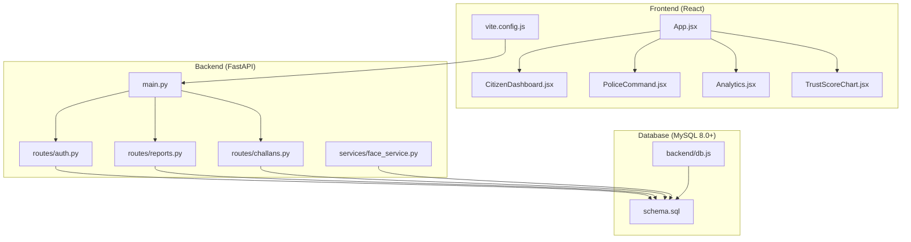
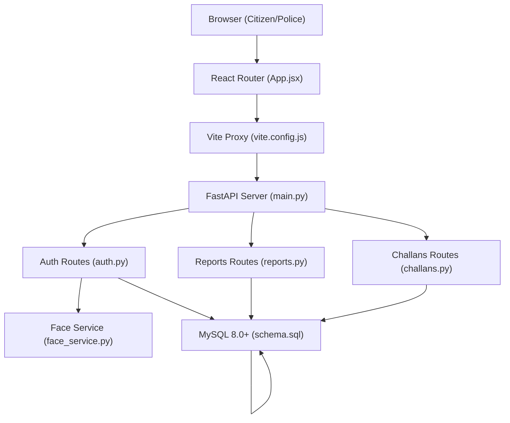
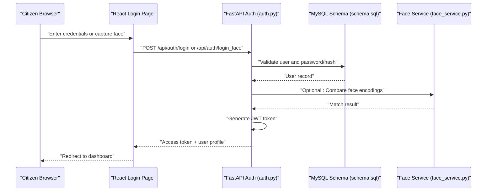
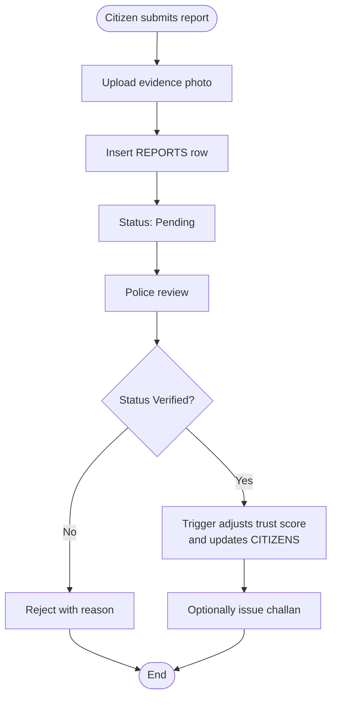
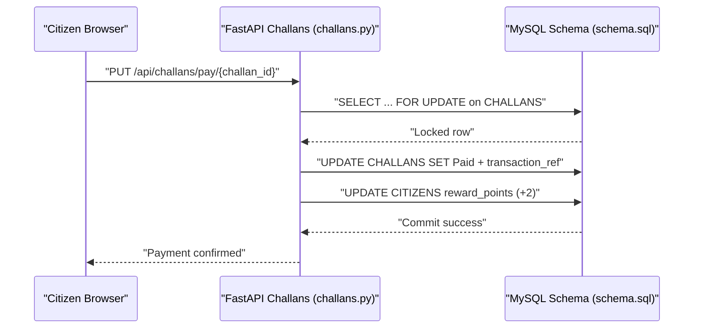
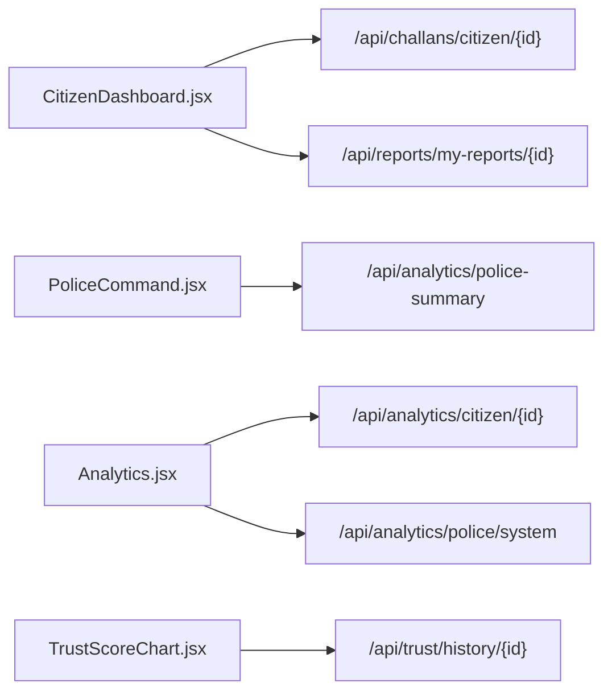
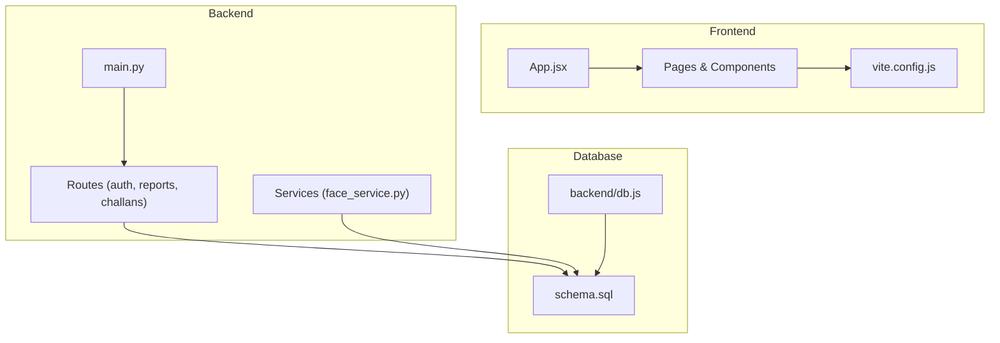

# Project Overview

<cite>
**Referenced Files in This Document**
- [README.md](file://README.md)
- [main.py](file://server/main.py)
- [auth.py](file://server/routes/auth.py)
- [reports.py](file://server/routes/reports.py)
- [challans.py](file://server/routes/challans.py)
- [face_service.py](file://server/services/face_service.py)
- [schema.sql](file://db/schema.sql)
- [db.js](file://backend/db.js)
- [App.jsx](file://frontend/src/App.jsx)
- [CitizenDashboard.jsx](file://frontend/src/pages/CitizenDashboard.jsx)
- [PoliceCommand.jsx](file://frontend/src/pages/PoliceCommand.jsx)
- [TrustScoreChart.jsx](file://frontend/src/components/TrustScoreChart.jsx)
- [Analytics.jsx](file://frontend/src/pages/Analytics.jsx)
- [vite.config.js](file://frontend/vite.config.js)
</cite>

## Table of Contents
1. [Introduction](#introduction)
2. [Project Structure](#project-structure)
3. [Core Components](#core-components)
4. [Architecture Overview](#architecture-overview)
5. [Detailed Component Analysis](#detailed-component-analysis)
6. [Dependency Analysis](#dependency-analysis)
7. [Performance Considerations](#performance-considerations)
8. [Troubleshooting Guide](#troubleshooting-guide)
9. [Conclusion](#conclusion)
10. [Appendices](#appendices)

## Introduction
The Traffic Violation Management System (TVMS) is a Tier-1 Government/Law Enforcement portal designed as a DBMS capstone project. It modernizes traffic enforcement through a dual-portal architecture serving citizens and police officers, integrating biometric authentication, real-time dashboards, and an automated trust scoring system. The system emphasizes academic rigor with advanced database normalization and concurrency control, while delivering practical value for law enforcement agencies and citizens alike.

Key value propositions:
- Seamless citizen experience: submit reports, track violations, and pay challans online.
- Intelligent enforcement: real-time dashboards, trust scoring, and automated workflows.
- Academic excellence: 5NF-normalized schema, temporal tables, triggers, stored procedures, and row-level locking.
- Scalable infrastructure: FastAPI backend, React frontend, and MySQL 8.0+ with advanced features.

Target audiences:
- Law enforcement agencies: command centers, verification workflows, and performance analytics.
- Citizens: self-service reporting, payment, and trust score transparency.

Problem statement addressed:
- Reducing manual overhead in traffic violation processing.
- Improving fairness and transparency via automated trust scoring and temporal auditing.
- Enhancing enforcement responsiveness with real-time dashboards and secure biometric login.

Technology uniqueness:
- OpenCV DNN-based face recognition integrated with JWT authentication.
- MySQL triggers and stored procedures automate trust score adjustments and challan issuance.
- Row-level locking prevents race conditions during payment processing.
- Temporal tables maintain immutable audit trails for compliance and governance.

**Section sources**
- [README.md:1-415](file://README.md#L1-L415)

## Project Structure
The project follows a clear separation of concerns across backend, frontend, and database layers, with dedicated directories for routes, services, and UI components.

**Diagram sources**
- [App.jsx:1-274](file://frontend/src/App.jsx#L1-L274)
- [main.py:1-107](file://server/main.py#L1-L107)
- [auth.py:1-740](file://server/routes/auth.py#L1-L740)
- [reports.py:1-563](file://server/routes/reports.py#L1-L563)
- [challans.py:1-450](file://server/routes/challans.py#L1-L450)
- [face_service.py:1-177](file://server/services/face_service.py#L1-L177)
- [schema.sql:1-942](file://db/schema.sql#L1-L942)
- [db.js:1-26](file://backend/db.js#L1-L26)
- [vite.config.js:1-23](file://frontend/vite.config.js#L1-L23)

**Section sources**
- [README.md:45-93](file://README.md#L45-L93)
- [main.py:77-87](file://server/main.py#L77-L87)
- [schema.sql:17-43](file://db/schema.sql#L17-L43)

## Core Components
- Dual-Portal Architecture:
  - Citizen Portal: dashboard, report submission, challan payment, trust score visualization.
  - Police Command Center: pending reports review, verification/rejection, analytics, and administrative actions.
- Biometric Authentication:
  - Face registration and login using OpenCV DNN (ResNet-34 Caffe).
  - Fallback to email/password login for accessibility.
- Real-Time Dashboards:
  - Citizen dashboard displays challans, reports, and trust score trends.
  - Police command center shows system-wide metrics and actionable queues.
- Trust Scoring System:
  - Automated score adjustments on report verification/rejection via MySQL triggers.
  - Temporal history charts for transparency and auditability.
- Database Engine:
  - 5NF-normalized schema with temporal tables, triggers, stored procedures, views, and cursors.
  - Row-level locking for secure payment processing.

**Section sources**
- [README.md:192-221](file://README.md#L192-L221)
- [CitizenDashboard.jsx:1-340](file://frontend/src/pages/CitizenDashboard.jsx#L1-L340)
- [PoliceCommand.jsx:1-207](file://frontend/src/pages/PoliceCommand.jsx#L1-L207)
- [TrustScoreChart.jsx:1-126](file://frontend/src/components/TrustScoreChart.jsx#L1-L126)
- [schema.sql:304-429](file://db/schema.sql#L304-L429)

## Architecture Overview
The system employs a layered architecture with clear separation between presentation, business logic, and data persistence.

**Diagram sources**
- [App.jsx:1-274](file://frontend/src/App.jsx#L1-L274)
- [vite.config.js:7-21](file://frontend/vite.config.js#L7-L21)
- [main.py:50-107](file://server/main.py#L50-L107)
- [auth.py:14-14](file://server/routes/auth.py#L14-L14)
- [reports.py:14-14](file://server/routes/reports.py#L14-L14)
- [challans.py:11-11](file://server/routes/challans.py#L11-L11)
- [face_service.py:15-177](file://server/services/face_service.py#L15-L177)
- [schema.sql:1-942](file://db/schema.sql#L1-L942)

## Detailed Component Analysis

### Authentication and Biometric Login
The authentication module supports both traditional and biometric login flows, ensuring robust identity verification for citizens and police officers.

**Diagram sources**
- [auth.py:218-491](file://server/routes/auth.py#L218-L491)
- [face_service.py:47-149](file://server/services/face_service.py#L47-L149)
- [schema.sql:26-43](file://db/schema.sql#L26-L43)

**Section sources**
- [auth.py:114-491](file://server/routes/auth.py#L114-L491)
- [face_service.py:15-177](file://server/services/face_service.py#L15-L177)
- [README.md:194-199](file://README.md#L194-L199)

### Report Submission and Verification Pipeline
The report lifecycle spans citizen submission, evidence attachment, and police verification with automated trust score updates.

**Diagram sources**
- [reports.py:147-223](file://server/routes/reports.py#L147-L223)
- [schema.sql:358-382](file://db/schema.sql#L358-L382)

**Section sources**
- [reports.py:147-511](file://server/routes/reports.py#L147-L511)
- [schema.sql:116-136](file://db/schema.sql#L116-L136)

### Challan Payment with Concurrency Control
Payments are processed securely using row-level locks to prevent race conditions and ensure atomicity.

**Diagram sources**
- [challans.py:336-398](file://server/routes/challans.py#L336-L398)
- [schema.sql:548-629](file://db/schema.sql#L548-L629)

**Section sources**
- [challans.py:336-398](file://server/routes/challans.py#L336-L398)
- [schema.sql:548-629](file://db/schema.sql#L548-L629)

### Real-Time Dashboards and Trust Visualization
The frontend integrates with backend analytics to render real-time summaries and trust score histories.

**Diagram sources**
- [CitizenDashboard.jsx:27-68](file://frontend/src/pages/CitizenDashboard.jsx#L27-L68)
- [PoliceCommand.jsx:20-48](file://frontend/src/pages/PoliceCommand.jsx#L20-L48)
- [Analytics.jsx:19-57](file://frontend/src/pages/Analytics.jsx#L19-L57)
- [TrustScoreChart.jsx:1-126](file://frontend/src/components/TrustScoreChart.jsx#L1-L126)

**Section sources**
- [CitizenDashboard.jsx:1-340](file://frontend/src/pages/CitizenDashboard.jsx#L1-L340)
- [PoliceCommand.jsx:1-207](file://frontend/src/pages/PoliceCommand.jsx#L1-L207)
- [Analytics.jsx:1-271](file://frontend/src/pages/Analytics.jsx#L1-L271)
- [TrustScoreChart.jsx:1-126](file://frontend/src/components/TrustScoreChart.jsx#L1-L126)

## Dependency Analysis
The system exhibits strong cohesion within functional domains and controlled coupling between layers.

**Diagram sources**
- [App.jsx:1-274](file://frontend/src/App.jsx#L1-L274)
- [main.py:12-87](file://server/main.py#L12-L87)
- [auth.py:14-14](file://server/routes/auth.py#L14-L14)
- [reports.py:14-14](file://server/routes/reports.py#L14-L14)
- [challans.py:11-11](file://server/routes/challans.py#L11-L11)
- [face_service.py:15-177](file://server/services/face_service.py#L15-L177)
- [schema.sql:1-942](file://db/schema.sql#L1-942)
- [db.js:1-26](file://backend/db.js#L1-L26)
- [vite.config.js:1-23](file://frontend/vite.config.js#L1-L23)

**Section sources**
- [main.py:12-87](file://server/main.py#L12-L87)
- [schema.sql:17-43](file://db/schema.sql#L17-L43)

## Performance Considerations
- Database normalization and indexing reduce redundancy and improve query performance.
- Row-level locking minimizes contention during concurrent payment processing.
- Temporal tables and views pre-aggregate data for responsive dashboards.
- Asynchronous processing and connection pooling optimize throughput.

[No sources needed since this section provides general guidance]

## Troubleshooting Guide
Common issues and resolutions:
- Backend startup failures: verify MySQL connectivity, environment variables, and dependency installation.
- Face detection problems: ensure OpenCV DNN models are downloaded and webcam permissions are granted.
- Frontend-backend connectivity: confirm Vite proxy configuration and backend availability on port 5000.
- Database errors: re-run the database setup script and validate schema execution.

**Section sources**
- [README.md:371-392](file://README.md#L371-L392)

## Conclusion
The Traffic Violation Management System delivers a production-ready, academically rigorous solution for modern traffic enforcement. Its dual-portal design, biometric authentication, real-time dashboards, and trust scoring system collectively address key challenges in governance and citizen services. The advanced database features and secure concurrency controls establish a robust foundation for scalability and compliance.

[No sources needed since this section summarizes without analyzing specific files]

## Appendices

### Academic and Research Contributions
- Database normalization: 5NF normalization with multi-valued dependencies eliminated.
- Advanced SQL features: triggers, stored procedures, cursors, views, and temporal tables.
- Concurrency control: row-level locking and exception handling for ACID compliance.

**Section sources**
- [README.md:346-369](file://README.md#L346-L369)
- [schema.sql:304-754](file://db/schema.sql#L304-L754)

### API Endpoint Overview
Key endpoints supporting the dual-portal architecture:
- Authentication: registration, login, profile retrieval, and face-based login.
- Reports: creation, updates, deletion, and pending review retrieval.
- Challans: payment processing and citizen challan history.
- Trust: trust score history and current score.
- Analytics: role-specific summaries and violation type breakdowns.

**Section sources**
- [README.md:300-331](file://README.md#L300-L331)
- [auth.py:114-491](file://server/routes/auth.py#L114-L491)
- [reports.py:147-511](file://server/routes/reports.py#L147-L511)
- [challans.py:336-398](file://server/routes/challans.py#L336-L398)