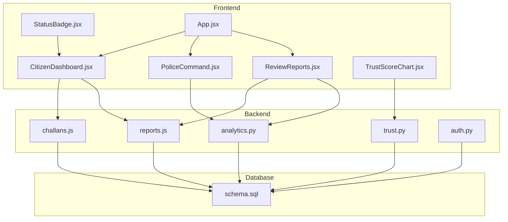
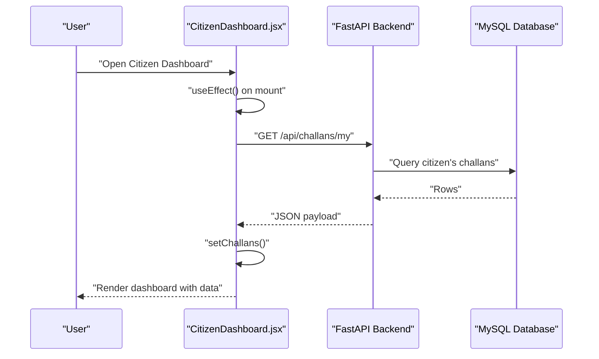
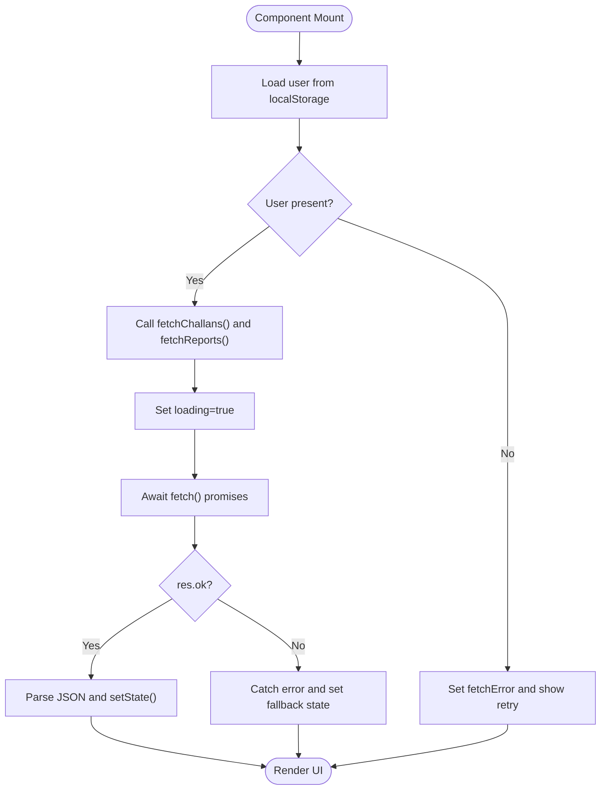
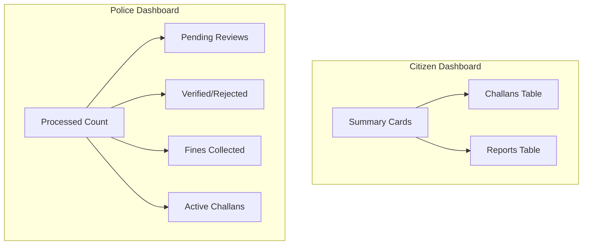
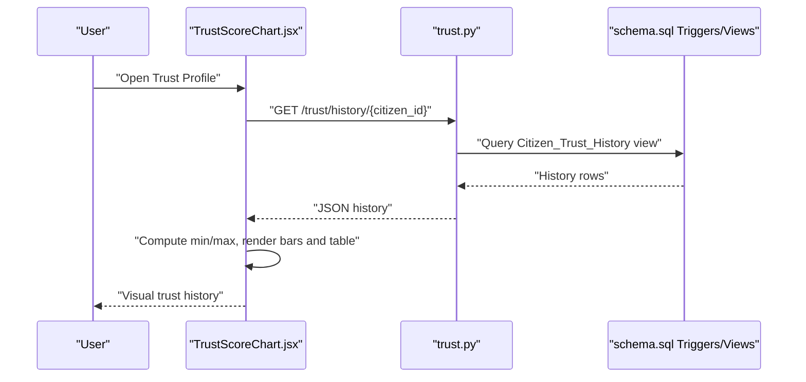
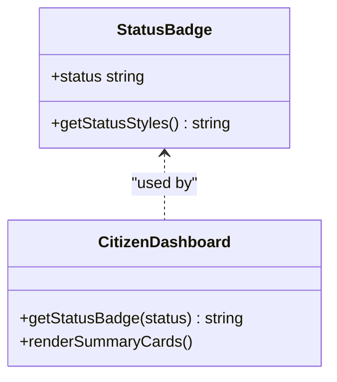
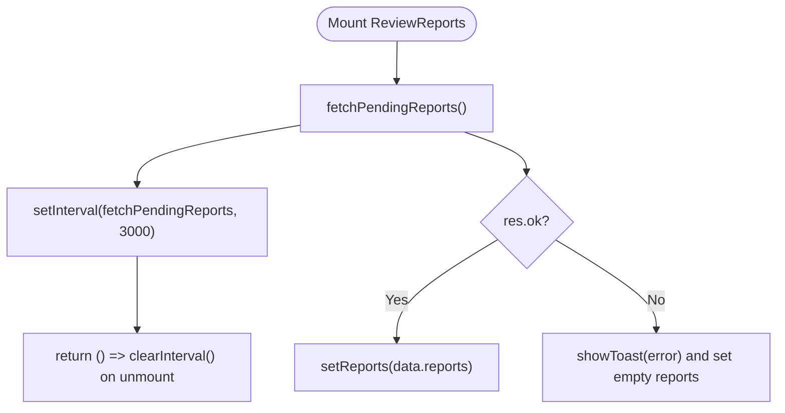
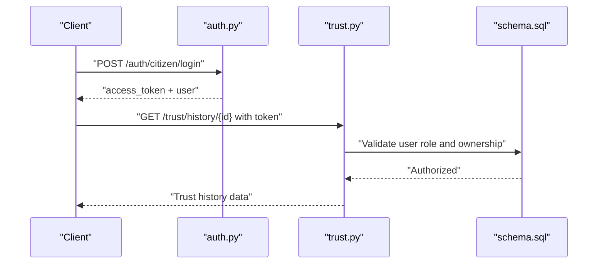
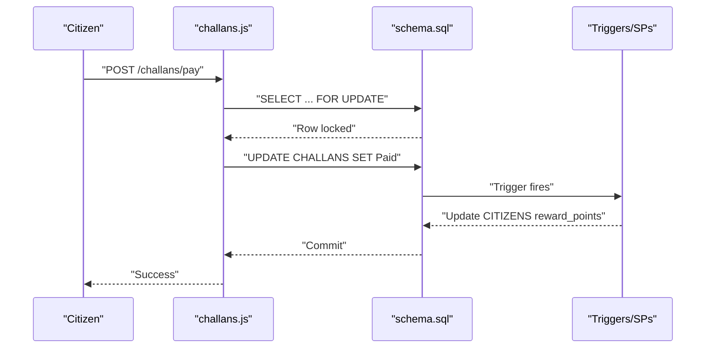
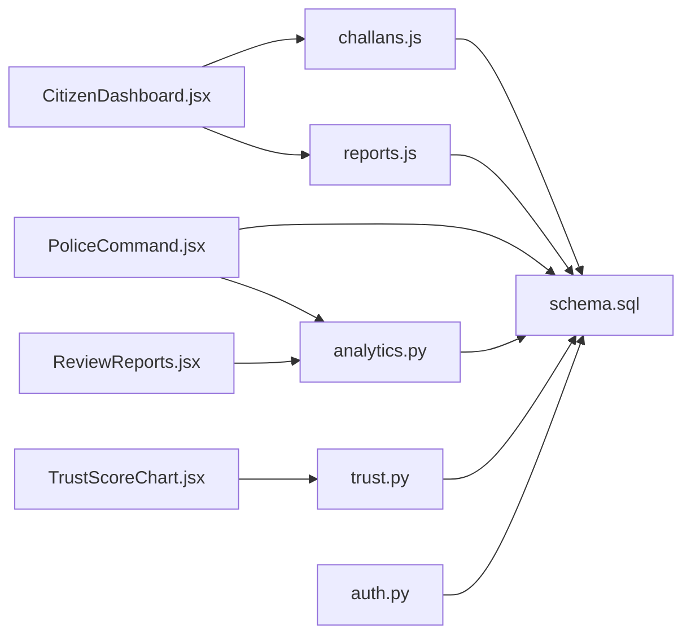

# Dashboard Updates

<cite>
**Referenced Files in This Document**
- [CitizenDashboard.jsx](file://frontend/src/pages/CitizenDashboard.jsx)
- [PoliceCommand.jsx](file://frontend/src/pages/PoliceCommand.jsx)
- [ReviewReports.jsx](file://frontend/src/pages/ReviewReports.jsx)
- [TrustScoreChart.jsx](file://frontend/src/components/TrustScoreChart.jsx)
- [StatusBadge.jsx](file://frontend/src/components/StatusBadge.jsx)
- [App.jsx](file://frontend/src/App.jsx)
- [analytics.py](file://server/routes/analytics.py)
- [trust.py](file://server/routes/trust.py)
- [challans.js](file://backend/routes/challans.js)
- [reports.js](file://backend/routes/reports.js)
- [auth.py](file://server/middleware/auth.py)
- [schema.sql](file://db/schema.sql)
- [REALTIME_SYNC_DOCUMENTATION.md](file://REALTIME_SYNC_DOCUMENTATION.md)
- [REALTIME_DASHBOARD_AND_SQL_FIX.md](file://REALTIME_DASHBOARD_AND_SQL_FIX.md)
</cite>

## Table of Contents
1. [Introduction](#introduction)
2. [Project Structure](#project-structure)
3. [Core Components](#core-components)
4. [Architecture Overview](#architecture-overview)
5. [Detailed Component Analysis](#detailed-component-analysis)
6. [Dependency Analysis](#dependency-analysis)
7. [Performance Considerations](#performance-considerations)
8. [Troubleshooting Guide](#troubleshooting-guide)
9. [Conclusion](#conclusion)

## Introduction
This document explains the dashboard update mechanisms in the Traffic Violation Management System with a focus on:
- Real-time data fetching using React hooks and useEffect for automatic updates
- Role-based dashboard differences between citizen and police views
- Trust score calculation and display logic, including the gradient bar chart component
- Summary cards with dynamic color coding based on status values
- Polling strategy for data refresh, error handling patterns, and loading states
- Examples of how dashboards respond to system events and maintain consistency across roles

## Project Structure
The dashboard system spans a React frontend and a Python FastAPI backend:
- Frontend pages implement dashboard layouts and real-time polling
- Backend routes expose analytics, trust history, and operational endpoints
- Database schema defines entities, triggers, and stored procedures that drive trust scoring and overdue processing

**Diagram sources**
- [CitizenDashboard.jsx:1-340](file://frontend/src/pages/CitizenDashboard.jsx#L1-L340)
- [PoliceCommand.jsx:1-207](file://frontend/src/pages/PoliceCommand.jsx#L1-L207)
- [ReviewReports.jsx:1-254](file://frontend/src/pages/ReviewReports.jsx#L1-L254)
- [TrustScoreChart.jsx:1-126](file://frontend/src/components/TrustScoreChart.jsx#L1-L126)
- [StatusBadge.jsx:1-39](file://frontend/src/components/StatusBadge.jsx#L1-L39)
- [App.jsx:1-274](file://frontend/src/App.jsx#L1-L274)
- [analytics.py:127-203](file://server/routes/analytics.py#L127-L203)
- [trust.py:15-134](file://server/routes/trust.py#L15-L134)
- [challans.js:1-101](file://backend/routes/challans.js#L1-L101)
- [reports.js:1-54](file://backend/routes/reports.js#L1-L54)
- [auth.py:1-182](file://server/middleware/auth.py#L1-L182)
- [schema.sql:1-942](file://db/schema.sql#L1-L942)

**Section sources**
- [App.jsx:1-274](file://frontend/src/App.jsx#L1-L274)
- [CitizenDashboard.jsx:1-340](file://frontend/src/pages/CitizenDashboard.jsx#L1-L340)
- [PoliceCommand.jsx:1-207](file://frontend/src/pages/PoliceCommand.jsx#L1-L207)
- [ReviewReports.jsx:1-254](file://frontend/src/pages/ReviewReports.jsx#L1-L254)
- [TrustScoreChart.jsx:1-126](file://frontend/src/components/TrustScoreChart.jsx#L1-L126)
- [StatusBadge.jsx:1-39](file://frontend/src/components/StatusBadge.jsx#L1-L39)
- [analytics.py:127-203](file://server/routes/analytics.py#L127-L203)
- [trust.py:15-134](file://server/routes/trust.py#L15-L134)
- [challans.js:1-101](file://backend/routes/challans.js#L1-L101)
- [reports.js:1-54](file://backend/routes/reports.js#L1-L54)
- [auth.py:1-182](file://server/middleware/auth.py#L1-L182)
- [schema.sql:1-942](file://db/schema.sql#L1-L942)

## Core Components
- CitizenDashboard: Loads citizen-specific data (challans and personal reports), computes summary metrics, and supports actions like payment and deletion with immediate refresh.
- PoliceCommand: Loads real-time command center statistics from the backend analytics endpoint.
- ReviewReports: Implements a 3-second polling loop to keep the pending reports list synchronized with database changes.
- TrustScoreChart: Renders a trust score history chart and table with color-coded segments and status badges.
- StatusBadge: Provides consistent status styling across the system.
- Backend analytics and trust routes: Provide real-time aggregates and trust history for dashboards.
- Authentication middleware: Ensures role-based access and secure token handling.

**Section sources**
- [CitizenDashboard.jsx:1-340](file://frontend/src/pages/CitizenDashboard.jsx#L1-L340)
- [PoliceCommand.jsx:1-207](file://frontend/src/pages/PoliceCommand.jsx#L1-L207)
- [ReviewReports.jsx:1-254](file://frontend/src/pages/ReviewReports.jsx#L1-L254)
- [TrustScoreChart.jsx:1-126](file://frontend/src/components/TrustScoreChart.jsx#L1-L126)
- [StatusBadge.jsx:1-39](file://frontend/src/components/StatusBadge.jsx#L1-L39)
- [analytics.py:127-203](file://server/routes/analytics.py#L127-L203)
- [trust.py:15-134](file://server/routes/trust.py#L15-L134)
- [auth.py:1-182](file://server/middleware/auth.py#L1-L182)

## Architecture Overview
The dashboard update architecture follows a reactive pattern:
- On mount, components call backend endpoints via fetch
- Error handling sets fallback UI and toast notifications
- Loading states provide user feedback during network requests
- Periodic polling keeps the police review dashboard synchronized
- Backend routes compute real-time aggregates and enforce access controls

**Diagram sources**
- [CitizenDashboard.jsx:14-25](file://frontend/src/pages/CitizenDashboard.jsx#L14-L25)
- [challans.js:7-29](file://backend/routes/challans.js#L7-L29)
- [schema.sql:173-195](file://db/schema.sql#L173-L195)

**Section sources**
- [CitizenDashboard.jsx:14-68](file://frontend/src/pages/CitizenDashboard.jsx#L14-L68)
- [challans.js:7-29](file://backend/routes/challans.js#L7-L29)
- [schema.sql:173-195](file://db/schema.sql#L173-L195)

## Detailed Component Analysis

### Real-Time Data Fetching with React Hooks and useEffect
- CitizenDashboard initializes by reading user data from localStorage, then fetches citizen-specific challans and reports. It sets loading and error states and renders a retry button on failure.
- PoliceCommand fetches real-time command center stats from the backend analytics endpoint on mount.
- ReviewReports implements a 3-second polling interval to continuously synchronize pending reports with database changes, cleaning up the interval on unmount.

**Diagram sources**
- [CitizenDashboard.jsx:14-68](file://frontend/src/pages/CitizenDashboard.jsx#L14-L68)
- [PoliceCommand.jsx:16-48](file://frontend/src/pages/PoliceCommand.jsx#L16-L48)
- [ReviewReports.jsx:14-23](file://frontend/src/pages/ReviewReports.jsx#L14-L23)

**Section sources**
- [CitizenDashboard.jsx:14-68](file://frontend/src/pages/CitizenDashboard.jsx#L14-L68)
- [PoliceCommand.jsx:16-48](file://frontend/src/pages/PoliceCommand.jsx#L16-L48)
- [ReviewReports.jsx:14-23](file://frontend/src/pages/ReviewReports.jsx#L14-L23)
- [REALTIME_SYNC_DOCUMENTATION.md:115-139](file://REALTIME_SYNC_DOCUMENTATION.md#L115-L139)

### Role-Based Dashboard Differences
- Citizen view: Personalized summary cards (total challans, unpaid, total due, pending reports), payment actions, and report deletion when status is pending.
- Police view: Command center overview with processed, pending reviews, verified/rejected counts, fines collected, and active challans. Includes quick action links.

**Diagram sources**
- [CitizenDashboard.jsx:175-204](file://frontend/src/pages/CitizenDashboard.jsx#L175-L204)
- [PoliceCommand.jsx:82-172](file://frontend/src/pages/PoliceCommand.jsx#L82-L172)

**Section sources**
- [CitizenDashboard.jsx:175-333](file://frontend/src/pages/CitizenDashboard.jsx#L175-L333)
- [PoliceCommand.jsx:68-203](file://frontend/src/pages/PoliceCommand.jsx#L68-L203)

### Trust Score Calculation and Display Logic
- Trust score history is retrieved from the backend trust route and rendered by TrustScoreChart, which builds a gradient bar chart and a tabular history.
- Trust score changes are governed by database triggers and stored procedures, ensuring atomicity and auditability.

**Diagram sources**
- [TrustScoreChart.jsx:1-126](file://frontend/src/components/TrustScoreChart.jsx#L1-L126)
- [trust.py:15-61](file://server/routes/trust.py#L15-L61)
- [schema.sql:307-382](file://db/schema.sql#L307-L382)

**Section sources**
- [TrustScoreChart.jsx:1-126](file://frontend/src/components/TrustScoreChart.jsx#L1-L126)
- [trust.py:15-134](file://server/routes/trust.py#L15-L134)
- [schema.sql:307-382](file://db/schema.sql#L307-L382)

### Summary Cards and Dynamic Color Coding
- CitizenDashboard computes summary metrics and renders colored cards for totals and statuses.
- StatusBadge provides consistent status styling across components.

**Diagram sources**
- [StatusBadge.jsx:1-39](file://frontend/src/components/StatusBadge.jsx#L1-L39)
- [CitizenDashboard.jsx:118-128](file://frontend/src/pages/CitizenDashboard.jsx#L118-L128)

**Section sources**
- [CitizenDashboard.jsx:118-204](file://frontend/src/pages/CitizenDashboard.jsx#L118-L204)
- [StatusBadge.jsx:1-39](file://frontend/src/components/StatusBadge.jsx#L1-L39)

### Polling Strategy, Error Handling, and Loading States
- Polling: ReviewReports polls every 3 seconds to reflect database changes instantly.
- Error handling: Components set error messages, show toasts, and provide retry actions.
- Loading states: Skeleton loaders improve perceived performance while data loads.

**Diagram sources**
- [ReviewReports.jsx:14-23](file://frontend/src/pages/ReviewReports.jsx#L14-L23)
- [REALTIME_SYNC_DOCUMENTATION.md:115-139](file://REALTIME_SYNC_DOCUMENTATION.md#L115-L139)

**Section sources**
- [ReviewReports.jsx:14-61](file://frontend/src/pages/ReviewReports.jsx#L14-L61)
- [REALTIME_SYNC_DOCUMENTATION.md:115-139](file://REALTIME_SYNC_DOCUMENTATION.md#L115-L139)

### Access Controls and Authentication
- Authentication middleware creates tokens and enforces role-based access for routes.
- Trust history endpoints restrict access to the requesting citizen.

**Diagram sources**
- [auth.py:96-123](file://server/middleware/auth.py#L96-L123)
- [trust.py:15-30](file://server/routes/trust.py#L15-L30)
- [schema.sql:307-382](file://db/schema.sql#L307-L382)

**Section sources**
- [auth.py:96-123](file://server/middleware/auth.py#L96-L123)
- [trust.py:15-30](file://server/routes/trust.py#L15-L30)
- [schema.sql:307-382](file://db/schema.sql#L307-L382)

### System Events and Data Consistency
- Payment flow: Updating a challan’s status to Paid triggers backend transactions and updates dependent metrics.
- Overdue processing: Stored procedures flag overdue challans, apply penalties, and adjust trust scores atomically.

**Diagram sources**
- [challans.js:32-98](file://backend/routes/challans.js#L32-L98)
- [schema.sql:549-629](file://db/schema.sql#L549-L629)

**Section sources**
- [challans.js:32-98](file://backend/routes/challans.js#L32-L98)
- [schema.sql:549-629](file://db/schema.sql#L549-L629)

## Dependency Analysis
- Frontend depends on backend analytics and trust endpoints for real-time data.
- Backend routes depend on database schema, triggers, and stored procedures for accurate and consistent results.
- Authentication middleware secures endpoints and enforces role-based access.

**Diagram sources**
- [CitizenDashboard.jsx:1-340](file://frontend/src/pages/CitizenDashboard.jsx#L1-L340)
- [PoliceCommand.jsx:1-207](file://frontend/src/pages/PoliceCommand.jsx#L1-L207)
- [ReviewReports.jsx:1-254](file://frontend/src/pages/ReviewReports.jsx#L1-L254)
- [TrustScoreChart.jsx:1-126](file://frontend/src/components/TrustScoreChart.jsx#L1-L126)
- [challans.js:1-101](file://backend/routes/challans.js#L1-L101)
- [reports.js:1-54](file://backend/routes/reports.js#L1-L54)
- [analytics.py:127-203](file://server/routes/analytics.py#L127-L203)
- [trust.py:15-134](file://server/routes/trust.py#L15-L134)
- [auth.py:1-182](file://server/middleware/auth.py#L1-L182)
- [schema.sql:1-942](file://db/schema.sql#L1-L942)

**Section sources**
- [CitizenDashboard.jsx:1-340](file://frontend/src/pages/CitizenDashboard.jsx#L1-L340)
- [PoliceCommand.jsx:1-207](file://frontend/src/pages/PoliceCommand.jsx#L1-L207)
- [ReviewReports.jsx:1-254](file://frontend/src/pages/ReviewReports.jsx#L1-L254)
- [TrustScoreChart.jsx:1-126](file://frontend/src/components/TrustScoreChart.jsx#L1-L126)
- [challans.js:1-101](file://backend/routes/challans.js#L1-L101)
- [reports.js:1-54](file://backend/routes/reports.js#L1-L54)
- [analytics.py:127-203](file://server/routes/analytics.py#L127-L203)
- [trust.py:15-134](file://server/routes/trust.py#L15-L134)
- [auth.py:1-182](file://server/middleware/auth.py#L1-L182)
- [schema.sql:1-942](file://db/schema.sql#L1-L942)

## Performance Considerations
- Prefer backend aggregation endpoints to avoid heavy client-side computations.
- Use short polling intervals judiciously to balance freshness and server load.
- Cache frequently accessed static data (e.g., violation rules) to reduce redundant requests.
- Optimize database queries with appropriate indexes and limit returned fields.

## Troubleshooting Guide
Common issues and resolutions:
- Network errors: Components set error states and show retry buttons; ensure the backend is running on the expected port and that CORS/firewall rules permit requests.
- Authentication failures: Verify tokens are persisted and refreshed; check role-based routing.
- Trust history access denied: Confirm the requesting user matches the citizen ID for trust history endpoints.
- Overdue processing not updating: Ensure the stored procedure is invoked and database events are enabled.

**Section sources**
- [CitizenDashboard.jsx:43-48](file://frontend/src/pages/CitizenDashboard.jsx#L43-L48)
- [PoliceCommand.jsx:20-48](file://frontend/src/pages/PoliceCommand.jsx#L20-L48)
- [ReviewReports.jsx:37-61](file://frontend/src/pages/ReviewReports.jsx#L37-L61)
- [trust.py:24-29](file://server/routes/trust.py#L24-L29)
- [REALTIME_DASHBOARD_AND_SQL_FIX.md:252-295](file://REALTIME_DASHBOARD_AND_SQL_FIX.md#L252-L295)

## Conclusion
The dashboard update mechanisms combine React hooks for lifecycle management, periodic polling for synchronization, and backend endpoints for real-time aggregates and trust history. Role-based access controls ensure data privacy, while robust error handling and loading states deliver a resilient user experience. Database triggers and stored procedures guarantee data consistency and enforce policy-driven outcomes such as trust score adjustments and overdue processing.