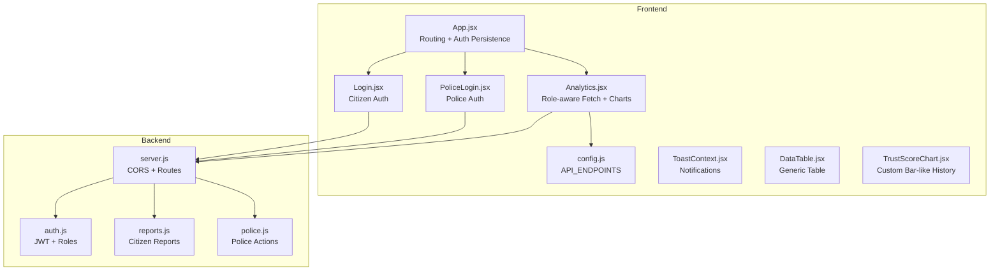
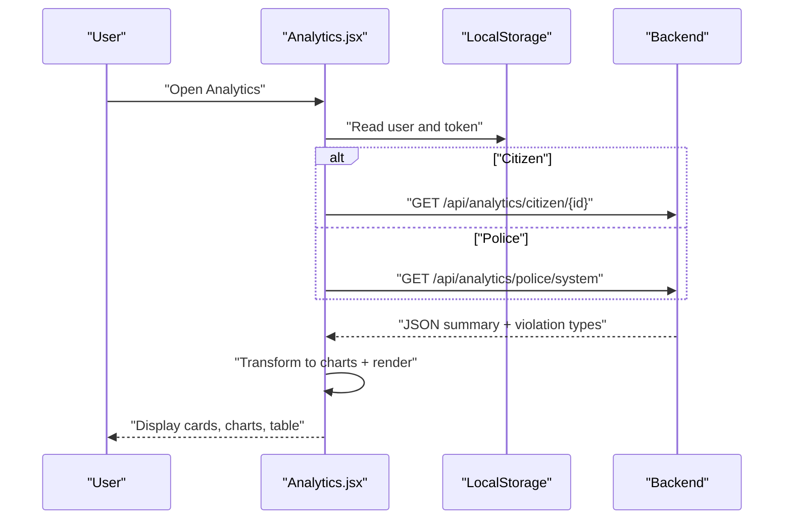
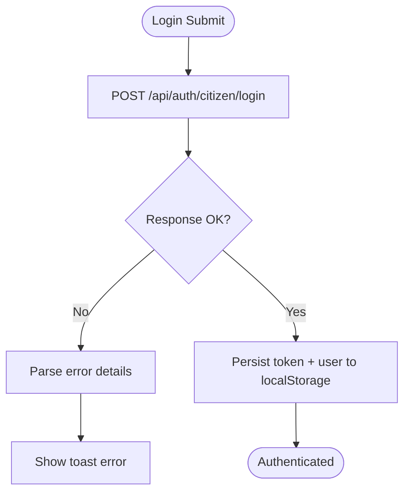
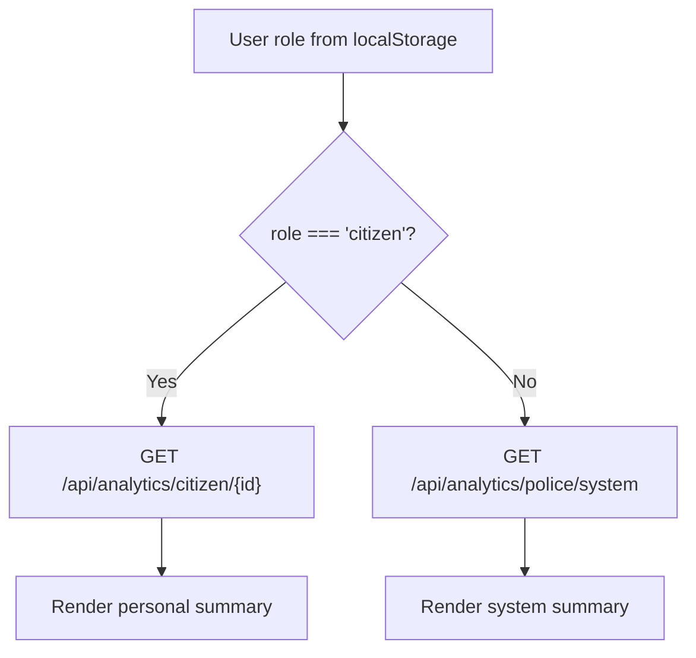
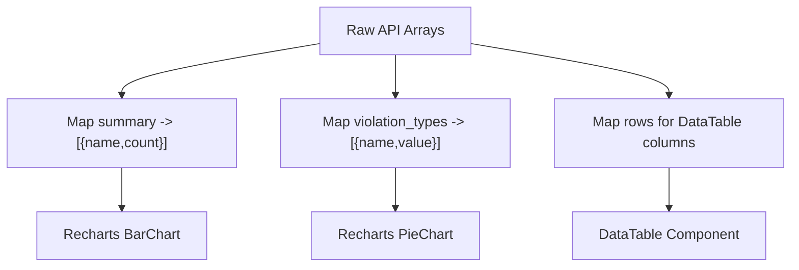
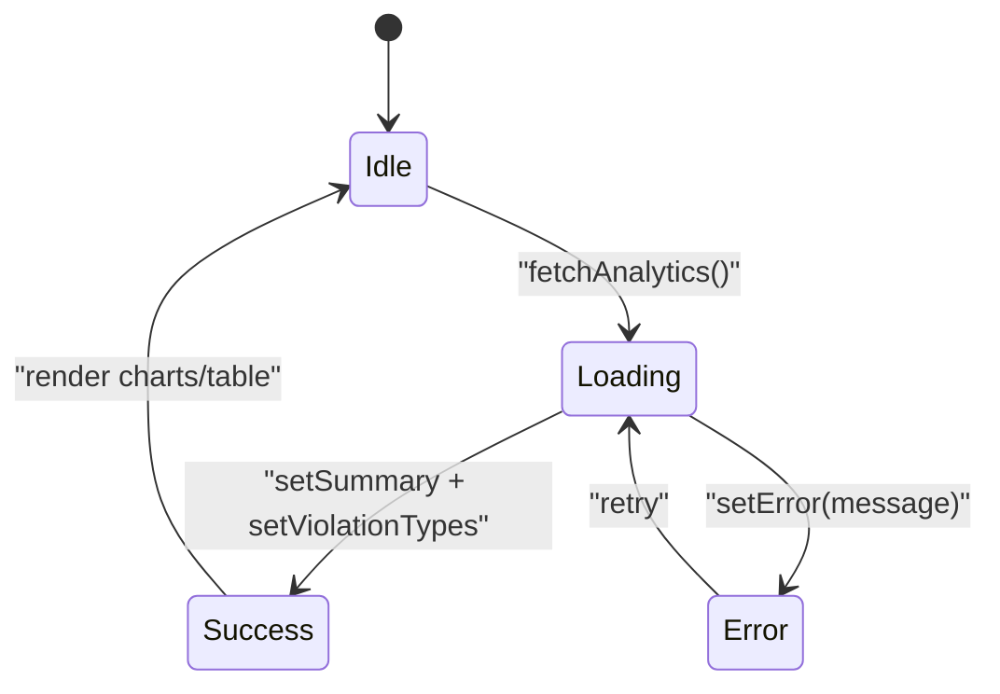
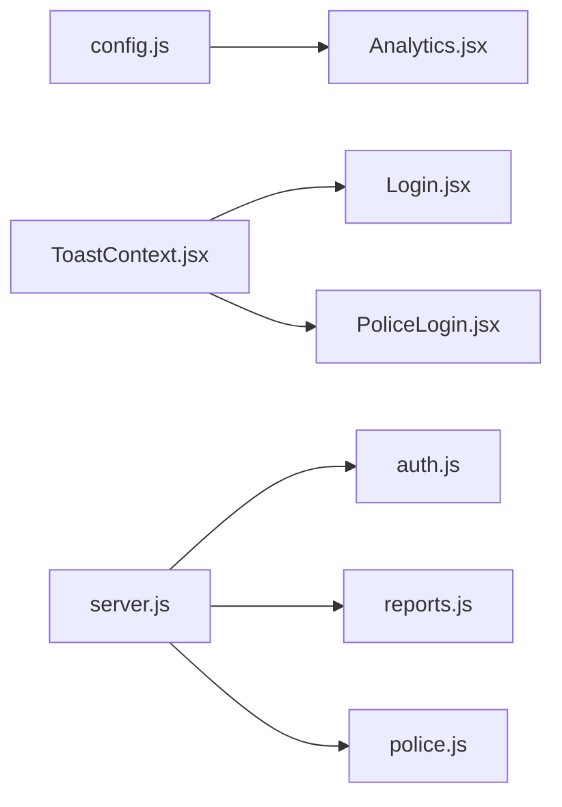

# Data Synchronization

<cite>
**Referenced Files in This Document**
- [App.jsx](file://frontend/src/App.jsx)
- [Analytics.jsx](file://frontend/src/pages/Analytics.jsx)
- [Login.jsx](file://frontend/src/pages/Login.jsx)
- [PoliceLogin.jsx](file://frontend/src/pages/PoliceLogin.jsx)
- [config.js](file://frontend/src/config.js)
- [ToastContext.jsx](file://frontend/src/context/ToastContext.jsx)
- [DataTable.jsx](file://frontend/src/components/DataTable.jsx)
- [TrustScoreChart.jsx](file://frontend/src/components/TrustScoreChart.jsx)
- [auth.js](file://backend/middleware/auth.js)
- [server.js](file://backend/server.js)
- [reports.js](file://backend/routes/reports.js)
- [police.js](file://backend/routes/police.js)
</cite>

## Table of Contents
1. [Introduction](#introduction)
2. [Project Structure](#project-structure)
3. [Core Components](#core-components)
4. [Architecture Overview](#architecture-overview)
5. [Detailed Component Analysis](#detailed-component-analysis)
6. [Dependency Analysis](#dependency-analysis)
7. [Performance Considerations](#performance-considerations)
8. [Troubleshooting Guide](#troubleshooting-guide)
9. [Conclusion](#conclusion)

## Introduction
This document explains the data synchronization mechanisms between the frontend and backend for the traffic violation management system. It covers:
- HTTP client usage via the browser fetch API with authentication headers and error handling
- Role-based API routing for citizen and police analytics endpoints
- Data transformation from raw API responses into chart-ready formats for Recharts and tabular displays
- State management patterns using React useState and useEffect
- Examples of data formatting for Recharts components, table rendering optimizations, and responsive data structures
- Network error recovery, retry mechanisms, and offline data persistence strategies

## Project Structure
The system comprises:
- Frontend (React + Vite): Pages, components, contexts, and configuration for HTTP endpoints
- Backend (Express): Authentication middleware, route handlers, and CORS configuration

**Diagram sources**
- [App.jsx:1-274](file://frontend/src/App.jsx#L1-L274)
- [Analytics.jsx:1-271](file://frontend/src/pages/Analytics.jsx#L1-L271)
- [Login.jsx:1-186](file://frontend/src/pages/Login.jsx#L1-L186)
- [PoliceLogin.jsx:1-186](file://frontend/src/pages/PoliceLogin.jsx#L1-L186)
- [config.js:1-34](file://frontend/src/config.js#L1-L34)
- [ToastContext.jsx:1-113](file://frontend/src/context/ToastContext.jsx#L1-L113)
- [DataTable.jsx:1-37](file://frontend/src/components/DataTable.jsx#L1-L37)
- [TrustScoreChart.jsx:1-126](file://frontend/src/components/TrustScoreChart.jsx#L1-L126)
- [server.js:1-42](file://backend/server.js#L1-L42)
- [auth.js:1-37](file://backend/middleware/auth.js#L1-L37)
- [reports.js:1-54](file://backend/routes/reports.js#L1-L54)
- [police.js:1-109](file://backend/routes/police.js#L1-L109)

**Section sources**
- [App.jsx:1-274](file://frontend/src/App.jsx#L1-L274)
- [server.js:1-42](file://backend/server.js#L1-L42)

## Core Components
- Authentication and routing:
  - Frontend maintains user session in localStorage and restores it on startup
  - Login pages send credentials to backend and persist tokens and user metadata
  - Backend enforces JWT verification and role-based access control
- Analytics page:
  - Determines role-specific analytics endpoints and loads summary and violation-type data
  - Transforms raw arrays into Recharts-compatible structures
- Data presentation:
  - Generic DataTable component renders tabular data efficiently
  - TrustScoreChart renders a custom vertical bar-like history with color-coded segments
- Notifications:
  - ToastContext provides centralized, time-bound notifications

**Section sources**
- [App.jsx:27-76](file://frontend/src/App.jsx#L27-L76)
- [Login.jsx:15-69](file://frontend/src/pages/Login.jsx#L15-L69)
- [PoliceLogin.jsx:15-68](file://frontend/src/pages/PoliceLogin.jsx#L15-L68)
- [auth.js:5-34](file://backend/middleware/auth.js#L5-L34)
- [Analytics.jsx:9-57](file://frontend/src/pages/Analytics.jsx#L9-L57)
- [Analytics.jsx:59-71](file://frontend/src/pages/Analytics.jsx#L59-L71)
- [DataTable.jsx:1-37](file://frontend/src/components/DataTable.jsx#L1-L37)
- [TrustScoreChart.jsx:1-126](file://frontend/src/components/TrustScoreChart.jsx#L1-L126)
- [ToastContext.jsx:13-40](file://frontend/src/context/ToastContext.jsx#L13-L40)

## Architecture Overview
The frontend authenticates users and stores tokens locally. Analytics requests are routed differently depending on the user’s role. The backend verifies tokens and enforces role-based access.

**Diagram sources**
- [Analytics.jsx:15-57](file://frontend/src/pages/Analytics.jsx#L15-L57)
- [auth.js:5-34](file://backend/middleware/auth.js#L5-L34)

## Detailed Component Analysis

### HTTP Client Implementation with fetch API
- Authentication headers:
  - Tokens are persisted in localStorage after login and can be attached to requests as needed
  - Current analytics fetch does not attach Authorization header; consider adding it for protected endpoints
- Error handling:
  - Login pages parse response bodies and surface errors via toasts
  - Analytics page sets loading/error states and provides a retry button
- Endpoint configuration:
  - API base URL and endpoint constants are centralized for maintainability

**Diagram sources**
- [Login.jsx:26-69](file://frontend/src/pages/Login.jsx#L26-L69)
- [ToastContext.jsx:29-32](file://frontend/src/context/ToastContext.jsx#L29-L32)

**Section sources**
- [Login.jsx:15-69](file://frontend/src/pages/Login.jsx#L15-L69)
- [PoliceLogin.jsx:15-68](file://frontend/src/pages/PoliceLogin.jsx#L15-L68)
- [config.js:1-34](file://frontend/src/config.js#L1-L34)
- [ToastContext.jsx:13-40](file://frontend/src/context/ToastContext.jsx#L13-L40)

### Role-Based API Routing
- Citizen analytics:
  - Endpoint: role-specific summary for the current user
- Police analytics:
  - Endpoint: system-wide summary for command dashboards
- Backend enforcement:
  - JWT verification and role checks occur before serving analytics

**Diagram sources**
- [Analytics.jsx:34-40](file://frontend/src/pages/Analytics.jsx#L34-L40)
- [auth.js:22-33](file://backend/middleware/auth.js#L22-L33)

**Section sources**
- [Analytics.jsx:34-40](file://frontend/src/pages/Analytics.jsx#L34-L40)
- [auth.js:22-33](file://backend/middleware/auth.js#L22-L33)

### Data Transformation Pipeline to Chart-Ready Formats
- Bar chart data:
  - Transform summary counts into an array of objects with name and count keys
- Pie chart data:
  - Map violation types to name/value pairs for Recharts Pie
- Table rendering:
  - Use generic DataTable with column definitions and optional render functions
  - TrustScoreChart builds a compact vertical bar visualization with color coding

**Diagram sources**
- [Analytics.jsx:59-71](file://frontend/src/pages/Analytics.jsx#L59-L71)
- [DataTable.jsx:14-27](file://frontend/src/components/DataTable.jsx#L14-L27)
- [TrustScoreChart.jsx:10-32](file://frontend/src/components/TrustScoreChart.jsx#L10-L32)

**Section sources**
- [Analytics.jsx:59-71](file://frontend/src/pages/Analytics.jsx#L59-L71)
- [DataTable.jsx:1-37](file://frontend/src/components/DataTable.jsx#L1-L37)
- [TrustScoreChart.jsx:1-126](file://frontend/src/components/TrustScoreChart.jsx#L1-L126)

### State Management Patterns with React Hooks
- Initialization and persistence:
  - Restore user and token on app load
- Analytics lifecycle:
  - On mount, fetch role-specific analytics and violation types
  - Manage loading, error, and success states
  - Provide retry action on failure
- Toast notifications:
  - Centralized provider exposes convenience methods for success/error/warning/info

**Diagram sources**
- [App.jsx:30-50](file://frontend/src/App.jsx#L30-L50)
- [Analytics.jsx:15-57](file://frontend/src/pages/Analytics.jsx#L15-L57)
- [ToastContext.jsx:16-23](file://frontend/src/context/ToastContext.jsx#L16-L23)

**Section sources**
- [App.jsx:27-76](file://frontend/src/App.jsx#L27-L76)
- [Analytics.jsx:15-57](file://frontend/src/pages/Analytics.jsx#L15-L57)
- [ToastContext.jsx:13-40](file://frontend/src/context/ToastContext.jsx#L13-L40)

### Data Formatting Examples for Recharts and Tables
- Recharts bar chart:
  - Data shape: array of objects with name and count
  - Responsive container ensures adaptivity
- Recharts pie chart:
  - Data shape: array of objects with name and value
  - Tooltip and label formatting included
- DataTable:
  - Columns define accessor or render functions
  - Empty-state handling for no data

**Section sources**
- [Analytics.jsx:199-233](file://frontend/src/pages/Analytics.jsx#L199-L233)
- [Analytics.jsx:237-264](file://frontend/src/pages/Analytics.jsx#L237-L264)
- [DataTable.jsx:14-27](file://frontend/src/components/DataTable.jsx#L14-L27)

### Offline Data Persistence Strategies
- Local storage persistence:
  - Token and user metadata are stored after login and restored on app start
- Recommendations:
  - Cache analytics snapshots with timestamps
  - Implement optimistic updates for local edits and queue network sync
  - Use service workers or background sync for resilient offline-first experiences

**Section sources**
- [App.jsx:30-50](file://frontend/src/App.jsx#L30-L50)
- [Login.jsx:55-62](file://frontend/src/pages/Login.jsx#L55-L62)
- [PoliceLogin.jsx:54-61](file://frontend/src/pages/PoliceLogin.jsx#L54-L61)

## Dependency Analysis
- Frontend depends on:
  - config.js for endpoint URLs
  - ToastContext for user feedback
  - Recharts for visualization
- Backend depends on:
  - Express and CORS
  - JWT middleware for authentication and role checks
  - Route modules for reports and police actions

**Diagram sources**
- [config.js:1-34](file://frontend/src/config.js#L1-L34)
- [Analytics.jsx:1-10](file://frontend/src/pages/Analytics.jsx#L1-L10)
- [ToastContext.jsx:1-113](file://frontend/src/context/ToastContext.jsx#L1-L113)
- [Login.jsx:1-10](file://frontend/src/pages/Login.jsx#L1-L10)
- [PoliceLogin.jsx:1-10](file://frontend/src/pages/PoliceLogin.jsx#L1-L10)
- [server.js:1-42](file://backend/server.js#L1-L42)
- [auth.js:1-37](file://backend/middleware/auth.js#L1-L37)
- [reports.js:1-54](file://backend/routes/reports.js#L1-L54)
- [police.js:1-109](file://backend/routes/police.js#L1-L109)

**Section sources**
- [server.js:13-26](file://backend/server.js#L13-L26)
- [auth.js:1-37](file://backend/middleware/auth.js#L1-L37)
- [reports.js:1-54](file://backend/routes/reports.js#L1-L54)
- [police.js:1-109](file://backend/routes/police.js#L1-L109)

## Performance Considerations
- Minimize re-renders:
  - Memoize derived chart data using useMemo/useCallback where appropriate
- Efficient table rendering:
  - Virtualize large tables and avoid unnecessary re-creations of rows
- Network efficiency:
  - Debounce rapid route changes; batch analytics refreshes
- Caching:
  - Cache recent analytics snapshots with expiry to reduce redundant requests

## Troubleshooting Guide
- Authentication failures:
  - Verify token presence and validity; check JWT_SECRET on backend
- Role access errors:
  - Ensure user role matches endpoint permissions enforced by middleware
- Network errors:
  - Analytics page surfaces errors and allows retry; add exponential backoff for retries
- CORS issues:
  - Confirm backend CORS configuration and origin policies
- Toast visibility:
  - Ensure ToastProvider wraps the application root

**Section sources**
- [auth.js:5-34](file://backend/middleware/auth.js#L5-L34)
- [Analytics.jsx:52-56](file://frontend/src/pages/Analytics.jsx#L52-L56)
- [ToastContext.jsx:13-40](file://frontend/src/context/ToastContext.jsx#L13-L40)
- [server.js:14-15](file://backend/server.js#L14-L15)

## Conclusion
The system synchronizes frontend and backend data through a clean separation of concerns: role-aware endpoints, robust authentication, and reactive state management. By centralizing endpoints, transforming data into chart-ready formats, and providing resilient error handling and notifications, the solution supports both citizen and police analytics needs while remaining extensible for future enhancements.