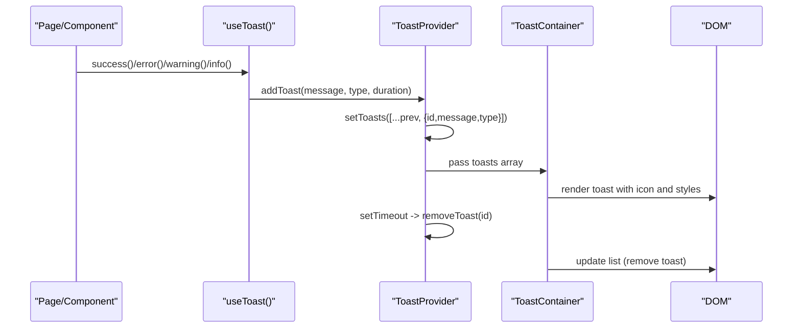
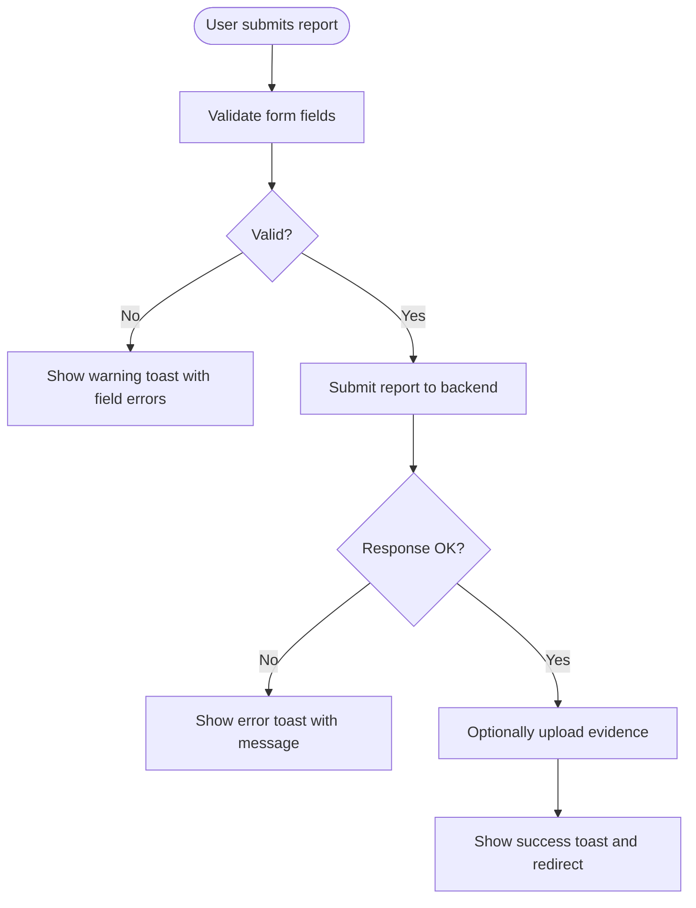
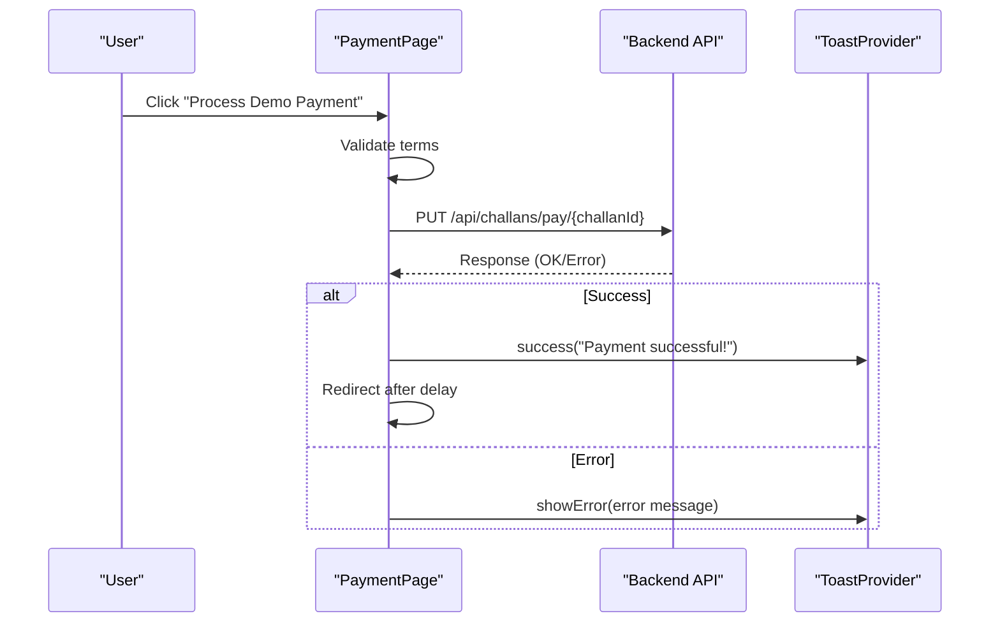
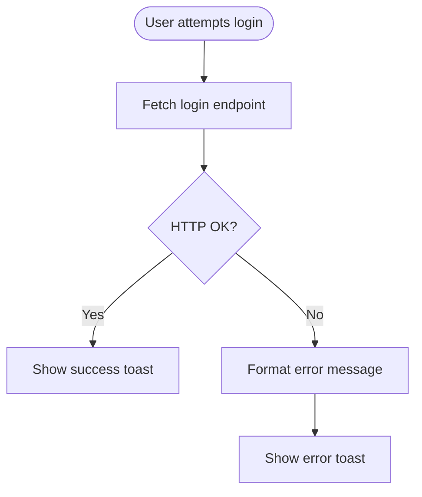
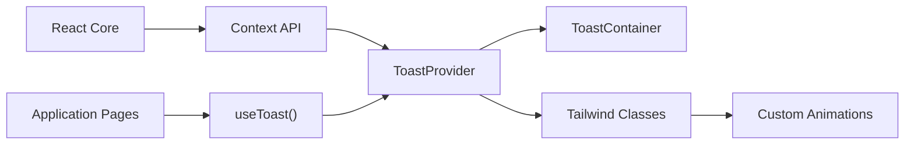

# Notification System

<cite>
**Referenced Files in This Document**
- [ToastContext.jsx](file://frontend/src/context/ToastContext.jsx)
- [App.jsx](file://frontend/src/App.jsx)
- [Login.jsx](file://frontend/src/pages/Login.jsx)
- [PaymentPage.jsx](file://frontend/src/pages/PaymentPage.jsx)
- [SubmitReport.jsx](file://frontend/src/pages/SubmitReport.jsx)
- [ReportForm.jsx](file://frontend/src/components/ReportForm.jsx)
- [tailwind.config.js](file://frontend/tailwind.config.js)
- [index.css](file://frontend/src/index.css)
</cite>

## Table of Contents
1. [Introduction](#introduction)
2. [Project Structure](#project-structure)
3. [Core Components](#core-components)
4. [Architecture Overview](#architecture-overview)
5. [Detailed Component Analysis](#detailed-component-analysis)
6. [Dependency Analysis](#dependency-analysis)
7. [Performance Considerations](#performance-considerations)
8. [Troubleshooting Guide](#troubleshooting-guide)
9. [Conclusion](#conclusion)

## Introduction
This document describes the notification and alert system for the real-time features of the traffic violation management platform. It focuses on the ToastContext implementation that manages system notifications and user alerts, the notification lifecycle from trigger to display, integration with application state, styling and positioning strategies, and practical examples for report status changes, payment confirmations, and system alerts. Accessibility and mobile responsiveness considerations are also addressed.

## Project Structure
The notification system is implemented as a React context provider with a dedicated container component that renders toast messages. The provider is mounted at the application root so all pages and components can trigger notifications.

```mermaid
graph TB
App["App.jsx<br/>Root component"] --> Provider["ToastProvider<br/>Context provider"]
Provider --> Container["ToastContainer<br/>Renders toasts"]
App --> Pages["Pages & Components<br/>useToast() hooks"]
Pages --> |success()/error()/warning()/info()| Provider
```

**Diagram sources**
- [App.jsx:267-273](file://frontend/src/App.jsx#L267-L273)
- [ToastContext.jsx:13-40](file://frontend/src/context/ToastContext.jsx#L13-L40)

**Section sources**
- [App.jsx:267-273](file://frontend/src/App.jsx#L267-L273)
- [ToastContext.jsx:13-40](file://frontend/src/context/ToastContext.jsx#L13-L40)

## Core Components
- ToastProvider: Creates and manages the toast state, exposes convenience methods for success, error, warning, and info notifications, and renders the ToastContainer.
- ToastContainer: Displays the current queue of toasts with appropriate styling and icons, supports manual dismissal, and auto-dismisses based on duration.
- useToast: Hook that provides access to notification methods to any component within the provider.

Key behaviors:
- Toasts are uniquely identified by timestamp-based IDs.
- Each toast has a type (success, error, warning, info) that determines styling and icon.
- Automatic dismissal occurs after a fixed duration (default 3000ms).
- Manual dismissal via close button.

**Section sources**
- [ToastContext.jsx:5-11](file://frontend/src/context/ToastContext.jsx#L5-L11)
- [ToastContext.jsx:13-40](file://frontend/src/context/ToastContext.jsx#L13-L40)
- [ToastContext.jsx:42-112](file://frontend/src/context/ToastContext.jsx#L42-L112)

## Architecture Overview
The notification architecture follows a unidirectional flow: components trigger notifications through the useToast hook, the provider updates state, and the container renders the visual toast with animations and styles.



**Diagram sources**
- [ToastContext.jsx:16-27](file://frontend/src/context/ToastContext.jsx#L16-L27)
- [ToastContext.jsx:42-112](file://frontend/src/context/ToastContext.jsx#L42-L112)

## Detailed Component Analysis

### ToastContext Implementation
The context encapsulates:
- State: An array of toast objects with id, message, and type.
- Methods: addToast (internal), removeToast, and convenience methods success, error, warning, info.
- Container: Renders toasts in a fixed position on the page with per-type styling and icons.

Styling and positioning:
- Fixed top-right corner with z-index stacking and vertical spacing.
- Per-type background, border, and text colors with dark-mode variants.
- Icons for each toast type.
- Slide-in animation and fade effects.

Accessibility:
- Close button is present for manual dismissal.
- No ARIA live region is implemented; screen readers will not automatically announce toasts.

Mobile responsiveness:
- Toasts are positioned absolutely in the viewport; they remain visible on small screens.
- Max width constraint prevents overflow on narrow devices.

**Section sources**
- [ToastContext.jsx:13-40](file://frontend/src/context/ToastContext.jsx#L13-L40)
- [ToastContext.jsx:42-112](file://frontend/src/context/ToastContext.jsx#L42-L112)
- [tailwind.config.js:31-49](file://frontend/tailwind.config.js#L31-L49)
- [index.css:66-110](file://frontend/src/index.css#L66-L110)

### Notification Lifecycle
Trigger to display:
- Component calls useToast().success/error/warning/info().
- Provider adds a toast to state and schedules auto-removal.
- Container renders the toast with animation.

Manual dismissal:
- User clicks the close button to remove a toast immediately.

Examples of triggers in the application:
- Login success and error feedback.
- Report submission success and validation errors.
- Payment processing outcomes and validation warnings.

**Section sources**
- [Login.jsx:53-65](file://frontend/src/pages/Login.jsx#L53-L65)
- [SubmitReport.jsx:69-77](file://frontend/src/pages/SubmitReport.jsx#L69-L77)
- [SubmitReport.jsx:158-173](file://frontend/src/pages/SubmitReport.jsx#L158-L173)
- [ReportForm.jsx:62-71](file://frontend/src/components/ReportForm.jsx#L62-L71)
- [ReportForm.jsx:89-104](file://frontend/src/components/ReportForm.jsx#L89-L104)
- [PaymentPage.jsx:68-79](file://frontend/src/pages/PaymentPage.jsx#L68-L79)

### Toast Types and Styling
Each type maps to distinct visual styles and icons:
- Success: Green palette with checkmark icon.
- Error: Red palette with X icon.
- Warning: Yellow palette with exclamation icon.
- Info: Blue palette with info icon.

Dark mode support:
- Dark variants of each palette are applied when the system prefers dark mode.

Animation:
- Slide-in from the right with a short easing curve.
- Fade-in utility is also available.

**Section sources**
- [ToastContext.jsx:45-88](file://frontend/src/context/ToastContext.jsx#L45-L88)
- [ToastContext.jsx:32-33](file://frontend/src/context/ToastContext.jsx#L32-L33)
- [tailwind.config.js:9-27](file://frontend/tailwind.config.js#L9-L27)
- [index.css:66-110](file://frontend/src/index.css#L66-L110)

### Integration with Application State
- The provider is mounted at the root level, ensuring global availability.
- Notifications are not persisted in application state; they are ephemeral UI feedback.
- Components trigger notifications based on asynchronous operations (login, report submission, payment processing).

**Section sources**
- [App.jsx:267-273](file://frontend/src/App.jsx#L267-L273)

### Examples of Notification Patterns

#### Report Status Changes
- Validation failures: Show warning/error toasts with specific guidance.
- Submission success: Show success toast and redirect after delay.
- Evidence upload issues: Show warning/error toasts with file constraints.



**Diagram sources**
- [SubmitReport.jsx:31-52](file://frontend/src/pages/SubmitReport.jsx#L31-L52)
- [SubmitReport.jsx:92-177](file://frontend/src/pages/SubmitReport.jsx#L92-L177)
- [ReportForm.jsx:59-84](file://frontend/src/components/ReportForm.jsx#L59-L84)

**Section sources**
- [SubmitReport.jsx:31-52](file://frontend/src/pages/SubmitReport.jsx#L31-L52)
- [SubmitReport.jsx:92-177](file://frontend/src/pages/SubmitReport.jsx#L92-L177)
- [ReportForm.jsx:59-84](file://frontend/src/components/ReportForm.jsx#L59-L84)

#### Payment Confirmations
- Terms agreement validation: Show warning toast if terms not accepted.
- Payment processing: Show success toast upon completion and redirect.
- Error handling: Show error toast with backend messages.



**Diagram sources**
- [PaymentPage.jsx:46-80](file://frontend/src/pages/PaymentPage.jsx#L46-L80)

**Section sources**
- [PaymentPage.jsx:46-80](file://frontend/src/pages/PaymentPage.jsx#L46-L80)

#### System Alerts
- Login failures: Show error toast with formatted message.
- Authentication success: Show success toast.



**Diagram sources**
- [Login.jsx:15-69](file://frontend/src/pages/Login.jsx#L15-L69)

**Section sources**
- [Login.jsx:15-69](file://frontend/src/pages/Login.jsx#L15-L69)

## Dependency Analysis
- ToastProvider depends on React’s Context API and local state.
- ToastContainer depends on Tailwind utility classes and custom animations.
- Pages and components depend on the useToast hook for notifications.



**Diagram sources**
- [ToastContext.jsx:1-112](file://frontend/src/context/ToastContext.jsx#L1-L112)
- [tailwind.config.js:31-49](file://frontend/tailwind.config.js#L31-L49)
- [index.css:66-110](file://frontend/src/index.css#L66-L110)

**Section sources**
- [ToastContext.jsx:1-112](file://frontend/src/context/ToastContext.jsx#L1-L112)
- [tailwind.config.js:31-49](file://frontend/tailwind.config.js#L31-L49)
- [index.css:66-110](file://frontend/src/index.css#L66-L110)

## Performance Considerations
- Toast rendering is lightweight; each toast is a simple DOM element with minimal reflows.
- Auto-dismiss timers are scheduled per toast; ensure not to flood the queue to avoid rapid DOM churn.
- Using fixed positioning keeps toasts outside the normal layout flow, minimizing layout shifts.

## Troubleshooting Guide
Common issues and resolutions:
- Toast not appearing:
  - Ensure the provider is mounted at the application root.
  - Verify that useToast is called within the provider’s subtree.
- Toast not dismissing:
  - Check that the duration parameter is not excessively long.
  - Confirm that removeToast is not being overridden unexpectedly.
- Styling anomalies:
  - Confirm Tailwind utilities and custom animations are loaded.
  - Verify dark mode classes are applied when expected.
- Accessibility concerns:
  - Consider adding ARIA live regions for screen reader announcements.
  - Ensure close buttons are keyboard accessible.

**Section sources**
- [App.jsx:267-273](file://frontend/src/App.jsx#L267-L273)
- [ToastContext.jsx:16-27](file://frontend/src/context/ToastContext.jsx#L16-L27)
- [ToastContext.jsx:42-112](file://frontend/src/context/ToastContext.jsx#L42-L112)
- [tailwind.config.js:31-49](file://frontend/tailwind.config.js#L31-L49)
- [index.css:66-110](file://frontend/src/index.css#L66-L110)

## Conclusion
The ToastContext-based notification system provides a clean, reusable mechanism for delivering timely feedback to users across the application. Its simplicity, combined with Tailwind-based styling and animations, ensures consistent visual communication for success, error, warning, and informational messages. Extending the system with accessibility enhancements (such as ARIA live regions) would further improve inclusivity, while maintaining the current performance characteristics.