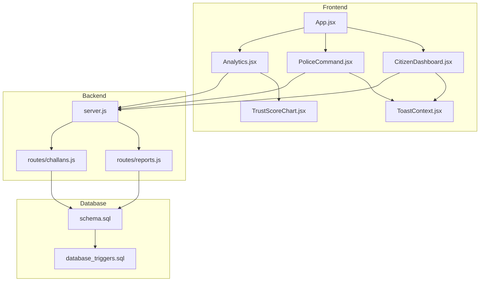
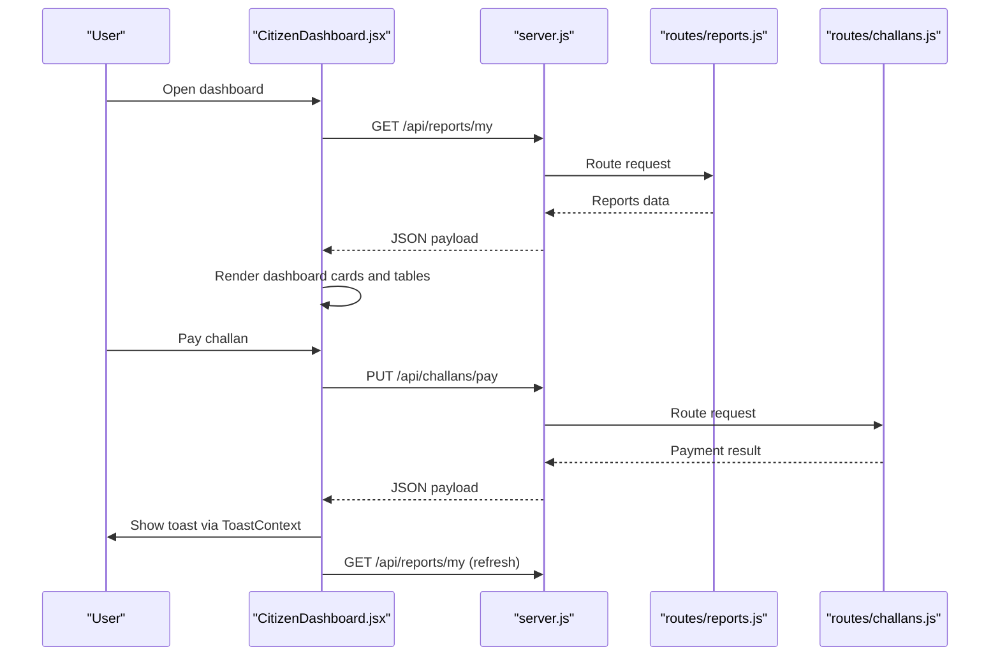
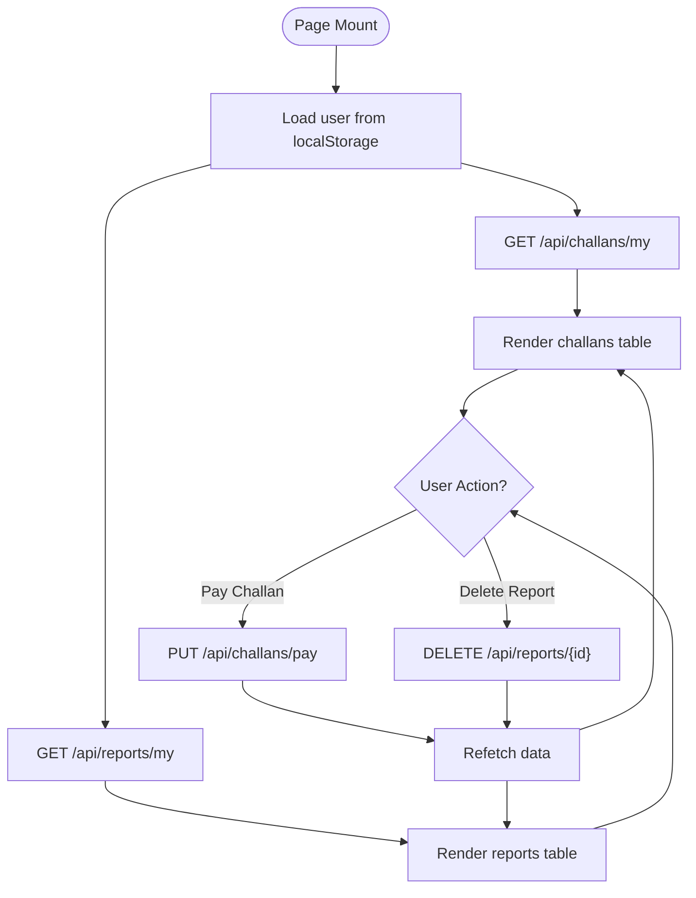
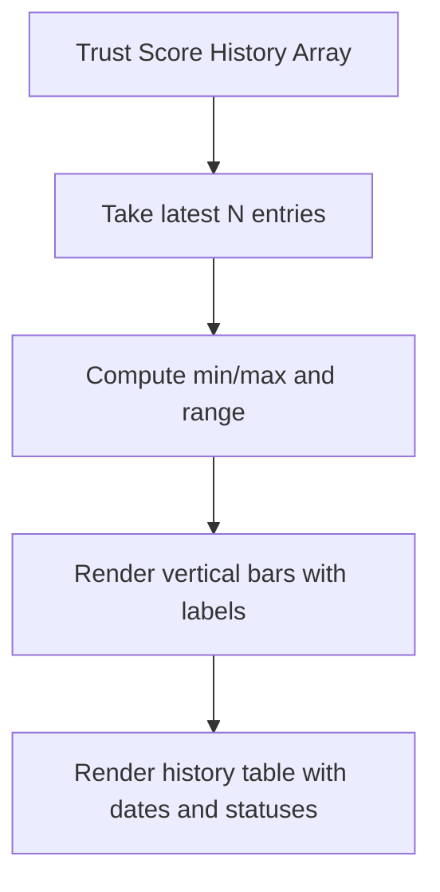
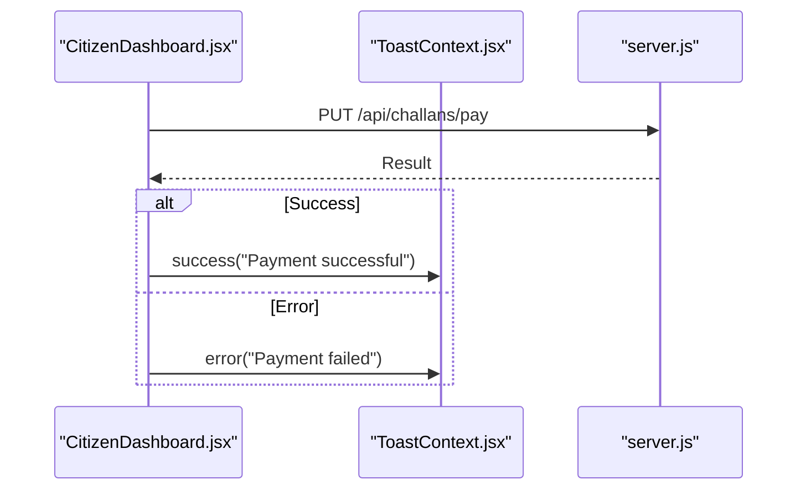
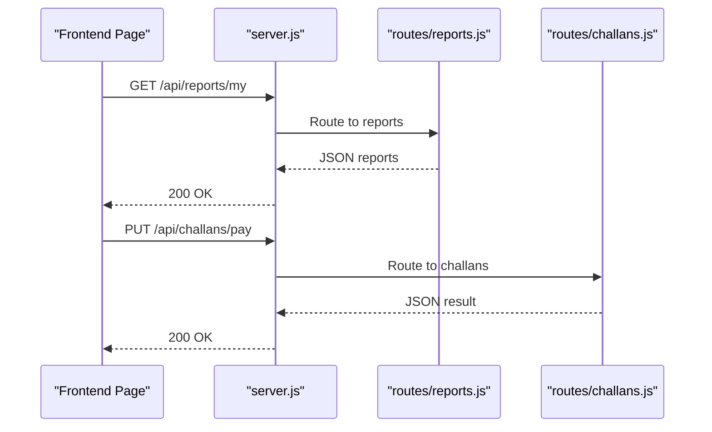
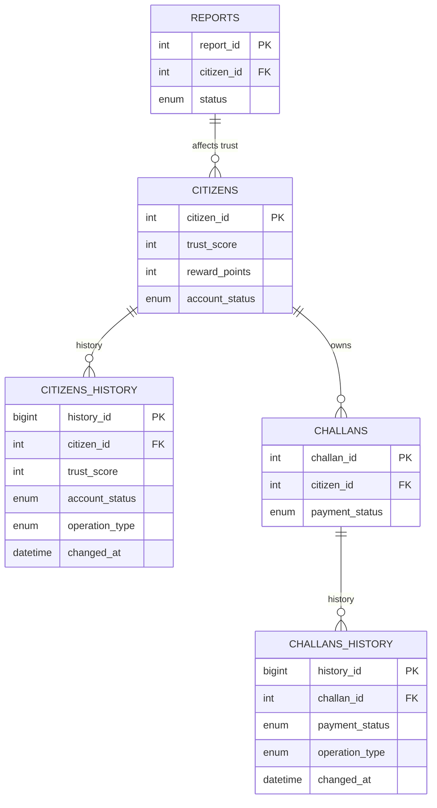
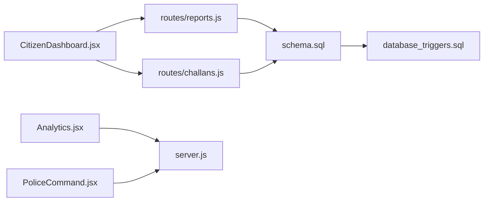

# Real-time Features

<cite>
**Referenced Files in This Document**
- [Analytics.jsx](file://frontend/src/pages/Analytics.jsx)
- [CitizenDashboard.jsx](file://frontend/src/pages/CitizenDashboard.jsx)
- [PoliceCommand.jsx](file://frontend/src/pages/PoliceCommand.jsx)
- [TrustScoreChart.jsx](file://frontend/src/components/TrustScoreChart.jsx)
- [ToastContext.jsx](file://frontend/src/context/ToastContext.jsx)
- [App.jsx](file://frontend/src/App.jsx)
- [reports.js](file://backend/routes/reports.js)
- [challans.js](file://backend/routes/challans.js)
- [server.js](file://backend/server.js)
- [schema.sql](file://db/schema.sql)
- [database_triggers.sql](file://db/database_triggers.sql)
</cite>

## Table of Contents
1. [Introduction](#introduction)
2. [Project Structure](#project-structure)
3. [Core Components](#core-components)
4. [Architecture Overview](#architecture-overview)
5. [Detailed Component Analysis](#detailed-component-analysis)
6. [Dependency Analysis](#dependency-analysis)
7. [Performance Considerations](#performance-considerations)
8. [Troubleshooting Guide](#troubleshooting-guide)
9. [Conclusion](#conclusion)

## Introduction
This document explains the real-time features of the Traffic Violation Management System with a focus on live dashboards, data synchronization, trust score visualization, analytics, notifications, and client-side state management. It also covers performance considerations and integration patterns for live data updates.

## Project Structure
The real-time features span the frontend React application and the backend Express server:
- Frontend pages and components render live data and user feedback.
- Backend routes expose REST endpoints for dashboards and analytics.
- Database triggers automatically update trust scores and maintain audit trails.
- Notifications are surfaced via a toast system.

**Diagram sources**
- [App.jsx:1-274](file://frontend/src/App.jsx#L1-L274)
- [CitizenDashboard.jsx:1-340](file://frontend/src/pages/CitizenDashboard.jsx#L1-L340)
- [PoliceCommand.jsx:1-207](file://frontend/src/pages/PoliceCommand.jsx#L1-L207)
- [Analytics.jsx:1-271](file://frontend/src/pages/Analytics.jsx#L1-L271)
- [TrustScoreChart.jsx:1-126](file://frontend/src/components/TrustScoreChart.jsx#L1-L126)
- [ToastContext.jsx:1-113](file://frontend/src/context/ToastContext.jsx#L1-L113)
- [server.js:1-42](file://backend/server.js#L1-L42)
- [reports.js:1-54](file://backend/routes/reports.js#L1-L54)
- [challans.js:1-101](file://backend/routes/challans.js#L1-L101)
- [schema.sql:1-942](file://db/schema.sql#L1-L942)
- [database_triggers.sql:1-48](file://db/database_triggers.sql#L1-L48)

**Section sources**
- [App.jsx:1-274](file://frontend/src/App.jsx#L1-L274)
- [server.js:1-42](file://backend/server.js#L1-L42)

## Core Components
- Real-time dashboards:
  - CitizenDashboard displays live challans and pending reports.
  - PoliceCommand shows live operational stats.
  - Analytics renders system-wide summaries and trust score visuals.
- Trust score visualization:
  - TrustScoreChart renders historical trust score bars and a detailed history table.
- Notification system:
  - ToastContext provides transient notifications for actions and errors.
- Backend synchronization:
  - REST endpoints serve dashboard data and accept updates (e.g., payment).
- Database-driven updates:
  - Triggers update trust scores and maintain audit trails.

**Section sources**
- [CitizenDashboard.jsx:1-340](file://frontend/src/pages/CitizenDashboard.jsx#L1-L340)
- [PoliceCommand.jsx:1-207](file://frontend/src/pages/PoliceCommand.jsx#L1-L207)
- [Analytics.jsx:1-271](file://frontend/src/pages/Analytics.jsx#L1-L271)
- [TrustScoreChart.jsx:1-126](file://frontend/src/components/TrustScoreChart.jsx#L1-L126)
- [ToastContext.jsx:1-113](file://frontend/src/context/ToastContext.jsx#L1-L113)
- [reports.js:1-54](file://backend/routes/reports.js#L1-L54)
- [challans.js:1-101](file://backend/routes/challans.js#L1-L101)
- [schema.sql:1-942](file://db/schema.sql#L1-L942)
- [database_triggers.sql:1-48](file://db/database_triggers.sql#L1-L48)

## Architecture Overview
The system uses REST-based synchronization:
- Frontend pages fetch data on mount and refresh after user actions.
- Backend routes expose endpoints for citizen dashboards, analytics, and payment updates.
- Database triggers ensure trust score updates and audit trail creation.

**Diagram sources**
- [CitizenDashboard.jsx:1-340](file://frontend/src/pages/CitizenDashboard.jsx#L1-L340)
- [server.js:1-42](file://backend/server.js#L1-L42)
- [reports.js:1-54](file://backend/routes/reports.js#L1-L54)
- [challans.js:1-101](file://backend/routes/challans.js#L1-L101)
- [ToastContext.jsx:1-113](file://frontend/src/context/ToastContext.jsx#L1-L113)

## Detailed Component Analysis

### Real-time Dashboards
- CitizenDashboard:
  - Loads user, challans, and reports on mount.
  - Provides actions to pay challans and delete pending reports.
  - Refreshes data after successful actions.
- PoliceCommand:
  - Loads operational stats from a dedicated endpoint.
  - Displays summary cards for quick situational awareness.
- Analytics:
  - Role-aware analytics: citizens see personal trust score; police see system-wide summaries.
  - Renders summary cards, bar/pie charts, and a violation-type table.

**Diagram sources**
- [CitizenDashboard.jsx:1-340](file://frontend/src/pages/CitizenDashboard.jsx#L1-L340)
- [reports.js:1-54](file://backend/routes/reports.js#L1-L54)
- [challans.js:1-101](file://backend/routes/challans.js#L1-L101)

**Section sources**
- [CitizenDashboard.jsx:1-340](file://frontend/src/pages/CitizenDashboard.jsx#L1-L340)
- [PoliceCommand.jsx:1-207](file://frontend/src/pages/PoliceCommand.jsx#L1-L207)
- [Analytics.jsx:1-271](file://frontend/src/pages/Analytics.jsx#L1-L271)

### Trust Score Visualization
- TrustScoreChart:
  - Accepts trust score history and renders a bar chart and a detailed table.
  - Computes min/max for scaling and assigns color bands based on score ranges.
  - Displays operation type and account status for each history entry.

**Diagram sources**
- [TrustScoreChart.jsx:1-126](file://frontend/src/components/TrustScoreChart.jsx#L1-L126)

**Section sources**
- [TrustScoreChart.jsx:1-126](file://frontend/src/components/TrustScoreChart.jsx#L1-L126)

### Notification System
- ToastContext:
  - Provides success/error/warning/info notifications with automatic dismissal.
  - Integrates into pages to surface action outcomes and errors.

**Diagram sources**
- [CitizenDashboard.jsx:1-340](file://frontend/src/pages/CitizenDashboard.jsx#L1-L340)
- [ToastContext.jsx:1-113](file://frontend/src/context/ToastContext.jsx#L1-L113)

**Section sources**
- [ToastContext.jsx:1-113](file://frontend/src/context/ToastContext.jsx#L1-L113)

### Backend Data Synchronization
- REST endpoints:
  - Reports: submit and fetch citizen reports.
  - Challans: fetch citizen challans and process payments.
- CORS and health checks:
  - Server enables cross-origin requests and exposes a health endpoint.

**Diagram sources**
- [server.js:1-42](file://backend/server.js#L1-L42)
- [reports.js:1-54](file://backend/routes/reports.js#L1-L54)
- [challans.js:1-101](file://backend/routes/challans.js#L1-L101)

**Section sources**
- [reports.js:1-54](file://backend/routes/reports.js#L1-L54)
- [challans.js:1-101](file://backend/routes/challans.js#L1-L101)
- [server.js:1-42](file://backend/server.js#L1-L42)

### Database-Driven Updates and Audit Trails
- Triggers:
  - Automatically adjust citizen trust scores when reports change status.
  - Maintain temporal history tables for citizens and challans.
- Stored procedures:
  - Safe issuance and payment workflows with row-level locks and rollback on errors.

**Diagram sources**
- [schema.sql:1-942](file://db/schema.sql#L1-L942)
- [database_triggers.sql:1-48](file://db/database_triggers.sql#L1-L48)

**Section sources**
- [schema.sql:1-942](file://db/schema.sql#L1-L942)
- [database_triggers.sql:1-48](file://db/database_triggers.sql#L1-L48)

## Dependency Analysis
- Frontend depends on:
  - REST endpoints for data.
  - ToastContext for UX feedback.
- Backend depends on:
  - MySQL schema and triggers for data integrity and automation.
- Coupling:
  - Pages are loosely coupled to endpoints via fetch calls.
  - Triggers decouple trust score updates from frontend logic.

**Diagram sources**
- [CitizenDashboard.jsx:1-340](file://frontend/src/pages/CitizenDashboard.jsx#L1-L340)
- [Analytics.jsx:1-271](file://frontend/src/pages/Analytics.jsx#L1-L271)
- [PoliceCommand.jsx:1-207](file://frontend/src/pages/PoliceCommand.jsx#L1-L207)
- [reports.js:1-54](file://backend/routes/reports.js#L1-L54)
- [challans.js:1-101](file://backend/routes/challans.js#L1-L101)
- [server.js:1-42](file://backend/server.js#L1-L42)
- [schema.sql:1-942](file://db/schema.sql#L1-L942)
- [database_triggers.sql:1-48](file://db/database_triggers.sql#L1-L48)

**Section sources**
- [CitizenDashboard.jsx:1-340](file://frontend/src/pages/CitizenDashboard.jsx#L1-L340)
- [Analytics.jsx:1-271](file://frontend/src/pages/Analytics.jsx#L1-L271)
- [PoliceCommand.jsx:1-207](file://frontend/src/pages/PoliceCommand.jsx#L1-L207)
- [reports.js:1-54](file://backend/routes/reports.js#L1-L54)
- [challans.js:1-101](file://backend/routes/challans.js#L1-L101)
- [server.js:1-42](file://backend/server.js#L1-L42)
- [schema.sql:1-942](file://db/schema.sql#L1-L942)
- [database_triggers.sql:1-48](file://db/database_triggers.sql#L1-L48)

## Performance Considerations
- Polling vs. streaming:
  - Current implementation uses on-mount fetch and manual refresh after actions. There is no WebSocket or long-polling in the current codebase.
- Update frequency:
  - No explicit polling intervals are configured in the frontend pages.
- Debouncing and caching:
  - No debouncing or caching logic is present in the current frontend code.
- Recommendations:
  - Introduce periodic refetch intervals for dashboards (e.g., every 30–60 seconds) with cleanup on unmount.
  - Use optimistic UI updates for payment actions and reconcile with a refetch.
  - Implement request deduplication to avoid concurrent identical fetches.
  - Add client-side caching with expiry for static analytics data.

[No sources needed since this section provides general guidance]

## Troubleshooting Guide
- Authentication persistence:
  - App restores user from localStorage on startup; ensure both token and user are present.
- Toast visibility:
  - ToastContext manages transient messages; confirm provider wraps the app.
- Network errors:
  - CitizenDashboard handles server errors during fetch and payment; verify backend health endpoint and CORS configuration.
- Trust score discrepancies:
  - Trust updates occur via database triggers; verify trigger presence and report status transitions.

**Section sources**
- [App.jsx:1-274](file://frontend/src/App.jsx#L1-L274)
- [ToastContext.jsx:1-113](file://frontend/src/context/ToastContext.jsx#L1-L113)
- [CitizenDashboard.jsx:1-340](file://frontend/src/pages/CitizenDashboard.jsx#L1-L340)
- [server.js:1-42](file://backend/server.js#L1-L42)
- [database_triggers.sql:1-48](file://db/database_triggers.sql#L1-L48)

## Conclusion
The system currently implements REST-based real-time dashboards with manual refresh after user actions. Trust score updates are automated via database triggers and visible in the analytics and trust score history components. To evolve toward true real-time updates, consider adding periodic refetch strategies, optimistic UI, and eventually WebSocket or Server-Sent Events for push updates.