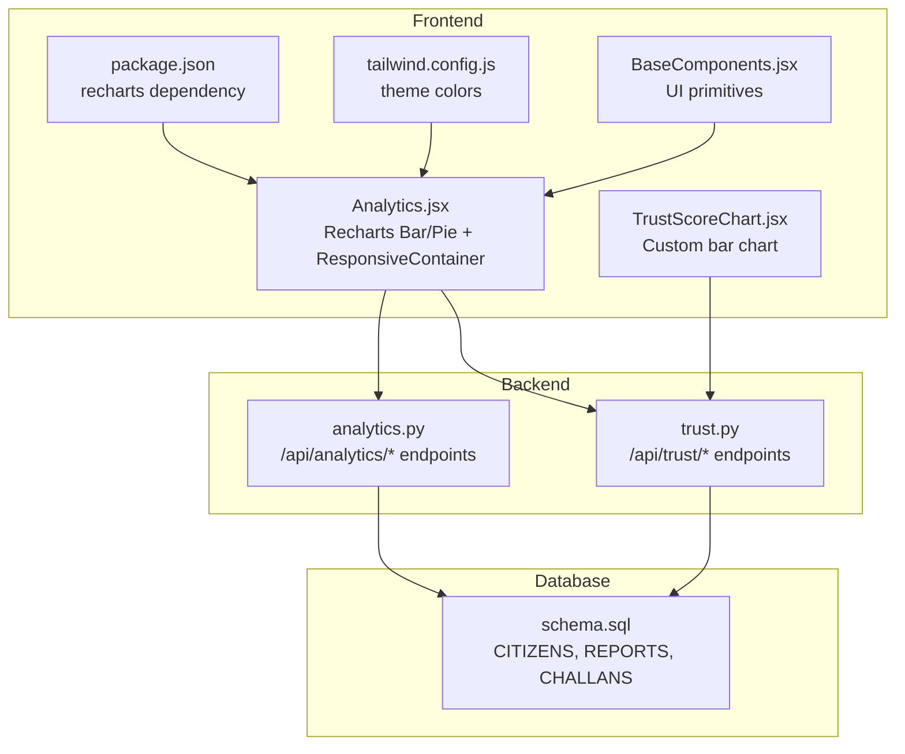
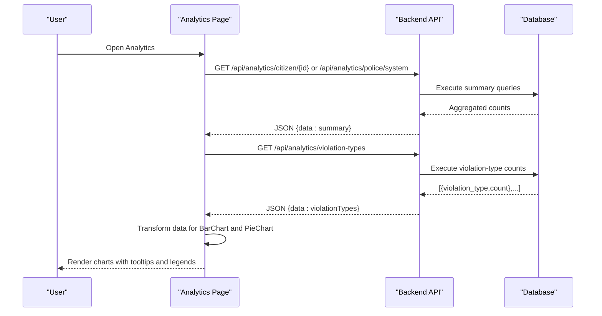
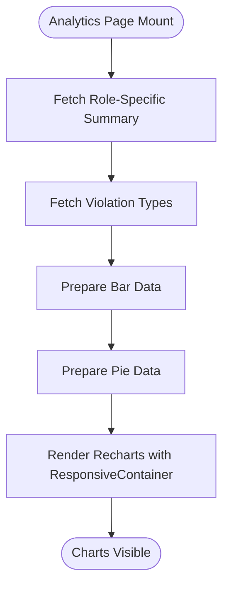
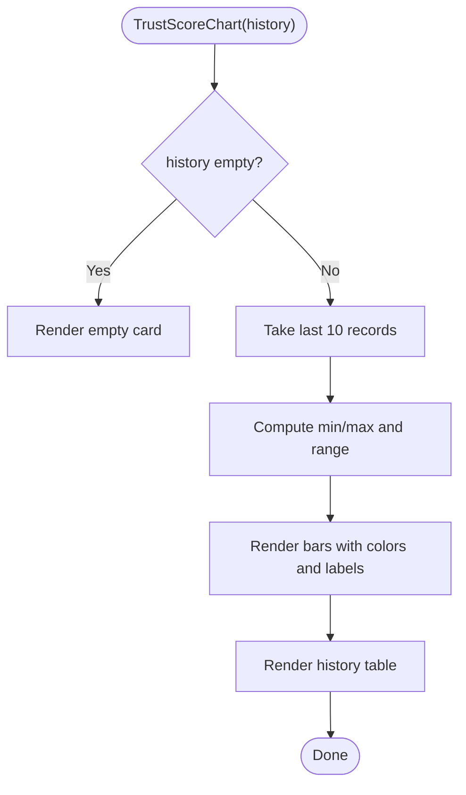
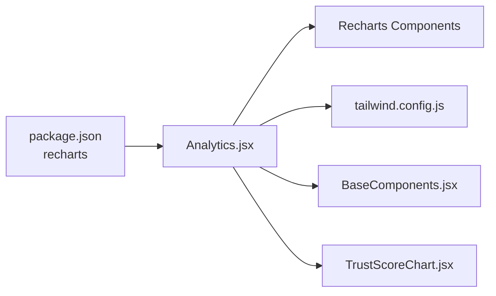

# Visualization Components

<cite>
**Referenced Files in This Document**
- [Analytics.jsx](file://frontend/src/pages/Analytics.jsx)
- [TrustScoreChart.jsx](file://frontend/src/components/TrustScoreChart.jsx)
- [analytics.py](file://server/routes/analytics.py)
- [trust.py](file://server/routes/trust.py)
- [schema.sql](file://db/schema.sql)
- [package.json](file://frontend/package.json)
- [tailwind.config.js](file://frontend/tailwind.config.js)
- [BaseComponents.jsx](file://frontend/src/components/ui/BaseComponents.jsx)
</cite>

## Table of Contents
1. [Introduction](#introduction)
2. [Project Structure](#project-structure)
3. [Core Components](#core-components)
4. [Architecture Overview](#architecture-overview)
5. [Detailed Component Analysis](#detailed-component-analysis)
6. [Dependency Analysis](#dependency-analysis)
7. [Performance Considerations](#performance-considerations)
8. [Troubleshooting Guide](#troubleshooting-guide)
9. [Conclusion](#conclusion)

## Introduction
This document details the visualization components used in the analytics dashboard. It covers Recharts integration for bar and pie charts, a custom TrustScoreChart component, data preparation from API responses, color schemes and styling patterns, responsive design, tooltips and legends, and performance considerations for large datasets.

## Project Structure
The visualization logic spans the frontend React application and the backend FastAPI service:
- Frontend pages and components render charts and manage data fetching and transformations.
- Backend routes expose analytics endpoints returning structured data for charts.
- Database schema defines the underlying entities and relationships used by analytics queries.

**Diagram sources**
- [Analytics.jsx:1-271](file://frontend/src/pages/Analytics.jsx#L1-L271)
- [TrustScoreChart.jsx:1-126](file://frontend/src/components/TrustScoreChart.jsx#L1-L126)
- [analytics.py:1-526](file://server/routes/analytics.py#L1-L526)
- [trust.py:1-134](file://server/routes/trust.py#L1-L134)
- [schema.sql:1-942](file://db/schema.sql#L1-L942)
- [package.json:1-30](file://frontend/package.json#L1-L30)
- [tailwind.config.js:1-54](file://frontend/tailwind.config.js#L1-L54)
- [BaseComponents.jsx:1-178](file://frontend/src/components/ui/BaseComponents.jsx#L1-L178)

**Section sources**
- [Analytics.jsx:1-271](file://frontend/src/pages/Analytics.jsx#L1-L271)
- [TrustScoreChart.jsx:1-126](file://frontend/src/components/TrustScoreChart.jsx#L1-L126)
- [analytics.py:1-526](file://server/routes/analytics.py#L1-L526)
- [trust.py:1-134](file://server/routes/trust.py#L1-L134)
- [schema.sql:1-942](file://db/schema.sql#L1-L942)
- [package.json:1-30](file://frontend/package.json#L1-L30)
- [tailwind.config.js:1-54](file://frontend/tailwind.config.js#L1-L54)
- [BaseComponents.jsx:1-178](file://frontend/src/components/ui/BaseComponents.jsx#L1-L178)

## Core Components
- Recharts BarChart and PieChart integrated in the Analytics page with ResponsiveContainer for adaptive sizing.
- Custom TrustScoreChart component renders a trust score history visualization using native HTML/CSS bars with color-coded segments and a tabular history.

Key capabilities:
- Data preparation: transforms backend responses into chart-friendly arrays and objects.
- Color schemes: consistent palette for pie slices and status indicators.
- Responsive layout: grid and container sizing adapt to breakpoints.
- Interactivity: tooltips, legends, and hover effects.

**Section sources**
- [Analytics.jsx:1-271](file://frontend/src/pages/Analytics.jsx#L1-L271)
- [TrustScoreChart.jsx:1-126](file://frontend/src/components/TrustScoreChart.jsx#L1-L126)

## Architecture Overview
The analytics dashboard fetches data from backend endpoints, prepares it for charts, and renders visualizations with Recharts and a custom component.

**Diagram sources**
- [Analytics.jsx:15-57](file://frontend/src/pages/Analytics.jsx#L15-L57)
- [analytics.py:257-330](file://server/routes/analytics.py#L257-L330)
- [analytics.py:398-435](file://server/routes/analytics.py#L398-L435)

## Detailed Component Analysis

### Recharts Integration in Analytics Page
The Analytics page integrates:
- BarChart for report status distribution.
- PieChart for violation type distribution.
- ResponsiveContainer for adaptive sizing.
- Tooltip and Legend for interactivity.

Data preparation:
- Bar chart data derived from summary totals.
- Pie chart data mapped from violation types endpoint.

Styling and responsiveness:
- Grid layout adapts from single-column on small screens to two-column on larger screens.
- Container height fixed for consistent aspect ratio.

Interactive features:
- Tooltip displays values on hover.
- Legend labels for clarity.

**Diagram sources**
- [Analytics.jsx:15-72](file://frontend/src/pages/Analytics.jsx#L15-L72)

**Section sources**
- [Analytics.jsx:1-271](file://frontend/src/pages/Analytics.jsx#L1-L271)
- [analytics.py:257-330](file://server/routes/analytics.py#L257-L330)
- [analytics.py:398-435](file://server/routes/analytics.py#L398-L435)

### TrustScoreChart Component
TrustScoreChart renders a compact trust score history:
- Validates input history and handles empty state.
- Slices recent entries and computes min/max for scaling.
- Renders vertical bars with color-coded segments based on score thresholds.
- Provides a tabular history view with status badges and operation types.

**Diagram sources**
- [TrustScoreChart.jsx:1-126](file://frontend/src/components/TrustScoreChart.jsx#L1-L126)

**Section sources**
- [TrustScoreChart.jsx:1-126](file://frontend/src/components/TrustScoreChart.jsx#L1-L126)

### Data Preparation Logic
- Summary data: aggregated counts for reports by status and system metrics.
- Violation types: grouped counts per violation type.
- Trust score history: temporal records with status and operation metadata.

Transformation patterns:
- Bar chart: array of objects with name and count keys.
- Pie chart: array of objects with name and value keys.
- Trust history: recent slice with computed heights and color classes.

**Section sources**
- [Analytics.jsx:59-71](file://frontend/src/pages/Analytics.jsx#L59-L71)
- [analytics.py:257-330](file://server/routes/analytics.py#L257-L330)
- [analytics.py:398-435](file://server/routes/analytics.py#L398-L435)
- [trust.py:15-60](file://server/routes/trust.py#L15-L60)

### Color Schemes and Styling Patterns
- Recharts color palette: predefined colors for pie slices.
- Status-based colors: green/yellow/orange/red for trust score segments and badges.
- Tailwind theme: primary palette and custom colors for branding.
- Card and table styles: consistent spacing, shadows, and borders.

**Section sources**
- [Analytics.jsx:6-7](file://frontend/src/pages/Analytics.jsx#L6-L7)
- [Analytics.jsx:177-192](file://frontend/src/pages/Analytics.jsx#L177-L192)
- [TrustScoreChart.jsx:19-32](file://frontend/src/components/TrustScoreChart.jsx#L19-L32)
- [tailwind.config.js:9-27](file://frontend/tailwind.config.js#L9-L27)
- [BaseComponents.jsx:105-119](file://frontend/src/components/ui/BaseComponents.jsx#L105-L119)

### Responsive Design Considerations
- Grid layout: 1 column on small screens, 4 columns for summary cards on large screens.
- Chart containers: 100% width with fixed height via ResponsiveContainer.
- Typography and spacing: adjusted via Tailwind utilities for readability across breakpoints.

**Section sources**
- [Analytics.jsx:118-174](file://frontend/src/pages/Analytics.jsx#L118-L174)
- [Analytics.jsx:195-234](file://frontend/src/pages/Analytics.jsx#L195-L234)

### Tooltips, Legends, and Interactive Features
- BarChart: Tooltip enabled; legend for series identification.
- PieChart: Tooltip with percentage; labels for segment names.
- TrustScoreChart: Hover effects and titles for bars; status badges for account state.

**Section sources**
- [Analytics.jsx:204-206](file://frontend/src/pages/Analytics.jsx#L204-L206)
- [Analytics.jsx:230-231](file://frontend/src/pages/Analytics.jsx#L230-L231)
- [Analytics.jsx:220-221](file://frontend/src/pages/Analytics.jsx#L220-L221)
- [TrustScoreChart.jsx:47-58](file://frontend/src/components/TrustScoreChart.jsx#L47-L58)

### Custom Chart Component Integration Pattern
TrustScoreChart demonstrates:
- Input validation and early exit for empty data.
- Computation of min/max and scaling for bar heights.
- Conditional coloring and text styling based on thresholds.
- Tabular fallback for detailed history.

Integration pattern:
- Accept history prop.
- Transform and render bars.
- Provide a readable table for detailed rows.

**Section sources**
- [TrustScoreChart.jsx:1-126](file://frontend/src/components/TrustScoreChart.jsx#L1-L126)

## Dependency Analysis
External dependencies and internal relationships:
- Recharts: BarChart, PieChart, ResponsiveContainer, Tooltip, Legend.
- Tailwind CSS: Theming and utility classes for layout and colors.
- Local components: BaseComponents provide shared UI primitives.

**Diagram sources**
- [package.json:18-18](file://frontend/package.json#L18-L18)
- [Analytics.jsx:1-271](file://frontend/src/pages/Analytics.jsx#L1-L271)
- [tailwind.config.js:1-54](file://frontend/tailwind.config.js#L1-L54)
- [BaseComponents.jsx:1-178](file://frontend/src/components/ui/BaseComponents.jsx#L1-L178)
- [TrustScoreChart.jsx:1-126](file://frontend/src/components/TrustScoreChart.jsx#L1-L126)

**Section sources**
- [package.json:1-30](file://frontend/package.json#L1-L30)
- [Analytics.jsx:1-271](file://frontend/src/pages/Analytics.jsx#L1-L271)

## Performance Considerations
- Data volume control: TrustScoreChart limits history to the most recent N entries to reduce DOM nodes and layout calculations.
- Efficient transforms: Single pass to compute min/max and mapping for chart data.
- Lazy rendering: Recharts components are mounted after data is ready; consider virtualization for very large datasets.
- Memoization: Consider memoizing transformed datasets if reused across renders.
- Debounced updates: If data is polled frequently, debounce fetches to avoid thrashing.
- Image and asset optimization: Ensure any images used in tables or cards are optimized.

[No sources needed since this section provides general guidance]

## Troubleshooting Guide
Common issues and resolutions:
- Empty or missing data: TrustScoreChart renders an empty card; Analytics page shows a friendly message and retry button.
- Authentication errors: Analytics page checks for user presence and role-specific endpoints; handle unauthorized access gracefully.
- Network failures: Error state displays a message and allows retry.
- Large datasets: Limit visible history and consider pagination or virtualization for tables.

**Section sources**
- [TrustScoreChart.jsx:2-8](file://frontend/src/components/TrustScoreChart.jsx#L2-L8)
- [Analytics.jsx:73-100](file://frontend/src/pages/Analytics.jsx#L73-L100)
- [Analytics.jsx:24-28](file://frontend/src/pages/Analytics.jsx#L24-L28)

## Conclusion
The analytics dashboard combines Recharts for standard bar and pie visualizations with a custom TrustScoreChart for trust history. Data preparation is straightforward, leveraging backend endpoints that return aggregated and grouped results. Styling relies on Tailwind utilities and a consistent color scheme, while responsive layouts ensure usability across devices. For large datasets, limit visible records and consider advanced rendering optimizations.