# Backend Architecture

<cite>
**Referenced Files in This Document**
- [main.py](file://server/main.py)
- [database.py](file://server/database.py)
- [auth.py](file://server/middleware/auth.py)
- [auth.py](file://server/routes/auth.py)
- [police.py](file://server/routes/police.py)
- [reports.py](file://server/routes/reports.py)
- [challans.py](file://server/routes/challans.py)
- [vehicles.py](file://server/routes/vehicles.py)
- [analytics.py](file://server/routes/analytics.py)
- [server.js](file://backend/server.js)
- [db.js](file://backend/db.js)
- [auth.js](file://backend/middleware/auth.js)
- [auth.js](file://backend/routes/auth.js)
- [reports.js](file://backend/routes/reports.js)
- [police.js](file://backend/routes/police.js)
- [challans.js](file://backend/routes/challans.js)
- [requirements.txt](file://server/requirements.txt)
- [package.json](file://backend/package.json)
</cite>

## Table of Contents
1. [Introduction](#introduction)
2. [Project Structure](#project-structure)
3. [Core Components](#core-components)
4. [Architecture Overview](#architecture-overview)
5. [Detailed Component Analysis](#detailed-component-analysis)
6. [Dependency Analysis](#dependency-analysis)
7. [Performance Considerations](#performance-considerations)
8. [Troubleshooting Guide](#troubleshooting-guide)
9. [Conclusion](#conclusion)
10. [Appendices](#appendices)

## Introduction
This document explains the dual-backend architecture of the Traffic Violation Management System. It covers the production-grade FastAPI backend (Python) for police/admin functions and the deprecated Express.js backend (JavaScript) for citizen features. It documents the FastAPI application structure, dependency injection patterns, modular route organization, authentication middleware, database connection pooling, error handling strategies, configuration management, environment variable handling, and security implementations. It also compares the two architectures, outlines migration paths, and discusses backward compatibility and maintenance implications.

## Project Structure
The repository is organized into two primary backend systems:
- FastAPI backend (Python): server/
- Express.js backend (JavaScript): backend/

Key characteristics:
- FastAPI backend emphasizes type safety, auto-generated OpenAPI docs, dependency injection via FastAPI Depends, and modular route organization.
- Express.js backend is simpler but lacks modern async concurrency and structured dependency management.

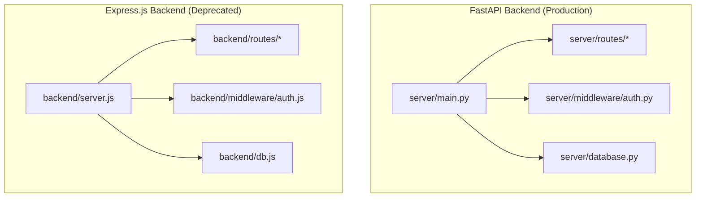

**Diagram sources**
- [main.py:1-107](file://server/main.py#L1-L107)
- [server.js:1-42](file://backend/server.js#L1-L42)

**Section sources**
- [main.py:1-107](file://server/main.py#L1-L107)
- [server.js:1-42](file://backend/server.js#L1-L42)

## Core Components
- FastAPI application lifecycle and CORS configuration
- Modular route organization under server/routes/*
- Self-contained authentication routes with JWT and bcrypt
- Database abstraction with connection pooling
- Error handling via HTTPException and centralized handlers
- Environment and configuration management

Key implementation highlights:
- Application lifespan manages startup/shutdown tasks and ensures upload directories exist.
- Route inclusion pattern centralizes endpoint registration with prefixes and tags.
- Database module initializes a MySQL connection pool and exposes context-managed connections and cursors.
- Authentication routes encapsulate password hashing, token creation, and profile retrieval without external middleware dependencies.

**Section sources**
- [main.py:35-103](file://server/main.py#L35-L103)
- [database.py:14-76](file://server/database.py#L14-L76)
- [auth.py:114-491](file://server/routes/auth.py#L114-L491)

## Architecture Overview
The FastAPI backend follows a layered architecture:
- Application layer: main.py orchestrates lifespan, middleware, static file serving, and route registration.
- Route layer: modular routers under server/routes/* encapsulate feature domains (auth, reports, challans, analytics, vehicles, police).
- Persistence layer: database.py abstracts MySQL connectivity with a connection pool and context managers.
- Security layer: authentication routes implement JWT-based access control and role checks.

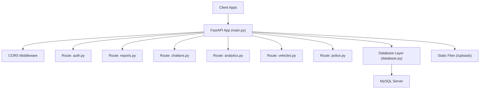

**Diagram sources**
- [main.py:50-103](file://server/main.py#L50-L103)
- [database.py:14-76](file://server/database.py#L14-L76)
- [auth.py:1-744](file://server/routes/auth.py#L1-L744)
- [reports.py:1-563](file://server/routes/reports.py#L1-L563)
- [challans.py:1-450](file://server/routes/challans.py#L1-L450)
- [analytics.py:1-526](file://server/routes/analytics.py#L1-L526)
- [vehicles.py:1-145](file://server/routes/vehicles.py#L1-L145)
- [police.py:1-220](file://server/routes/police.py#L1-L220)

## Detailed Component Analysis

### FastAPI Application (main.py)
- Lifespan manager initializes upload directories and logs startup/shutdown.
- CORS middleware configured broadly to allow all origins and headers.
- Static file mounting for evidence uploads.
- Route registration with modular routers and consistent prefix/tag conventions.
- Health check endpoint and root endpoint for service status.

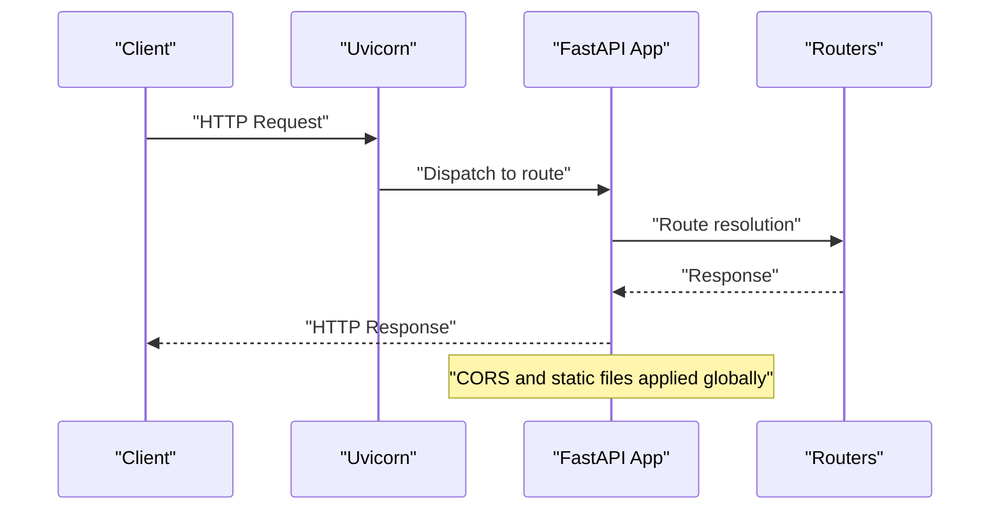

**Diagram sources**
- [main.py:35-103](file://server/main.py#L35-L103)

**Section sources**
- [main.py:35-103](file://server/main.py#L35-L103)

### Database Abstraction (database.py)
- Initializes a MySQL connection pool with fixed size and reset session enabled.
- Provides context-managed connection and cursor helpers to ensure proper resource cleanup.
- Centralized error handling with rollback on exceptions.

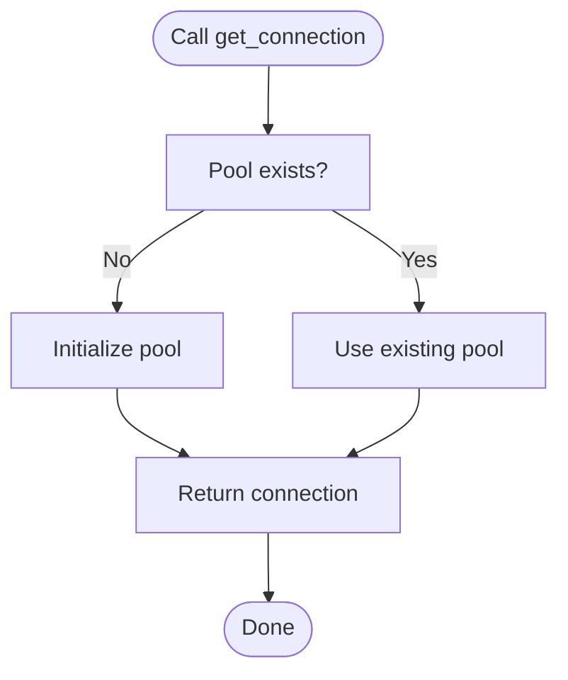

**Diagram sources**
- [database.py:14-76](file://server/database.py#L14-L76)

**Section sources**
- [database.py:14-76](file://server/database.py#L14-L76)

### Authentication Routes (server/routes/auth.py)
- Self-contained authentication with bcrypt hashing and JWT token issuance.
- Supports citizen and police registration and login with validation and error handling.
- Encodes user roles in JWT claims and decodes them for protected endpoints.
- Includes profile retrieval and updates with dynamic field updates.

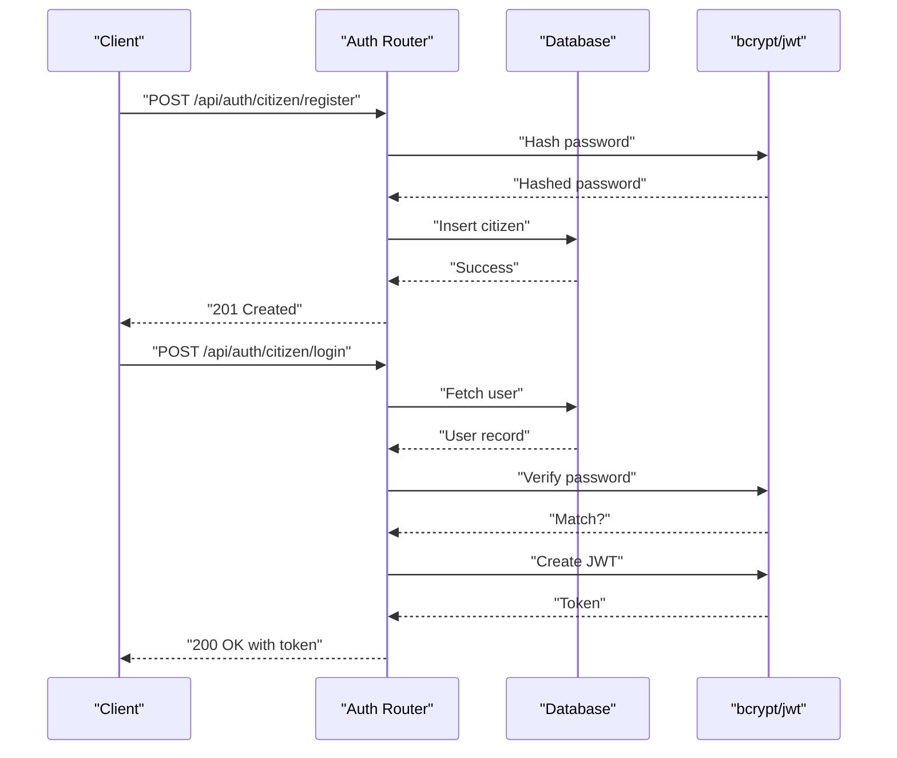

**Diagram sources**
- [auth.py:114-491](file://server/routes/auth.py#L114-L491)

**Section sources**
- [auth.py:114-491](file://server/routes/auth.py#L114-L491)

### Police Routes (server/routes/police.py)
- Requires police role via dependency injection.
- Exposes endpoints for pending reports, verification, rejection, violation rules, and officer performance.
- Uses stored procedures for verification and rejection workflows.
- Converts datetime objects to strings for JSON serialization.

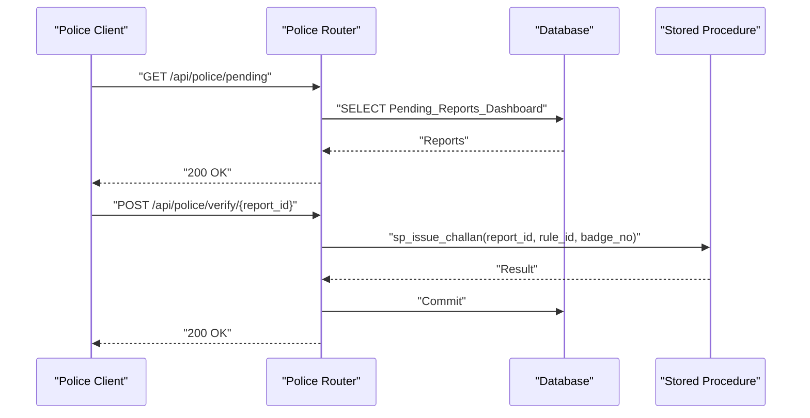

**Diagram sources**
- [police.py:25-156](file://server/routes/police.py#L25-L156)

**Section sources**
- [police.py:25-156](file://server/routes/police.py#L25-L156)

### Reports Routes (server/routes/reports.py)
- Supports evidence upload with file type and size validation.
- Creates reports and ensures vehicle existence before report insertion.
- Provides endpoints for citizens to view and manage their reports and for police to process reports.
- Uses direct SQL updates to avoid schema corruption and relies on triggers for trust score adjustments.

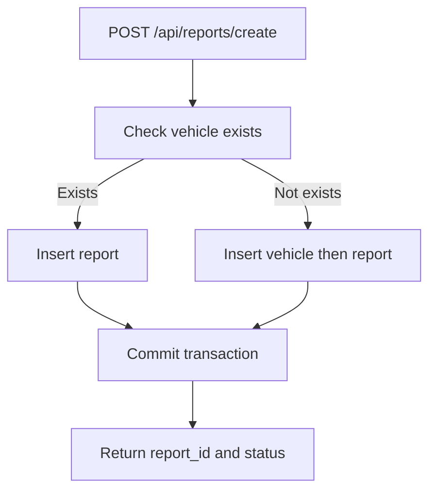

**Diagram sources**
- [reports.py:147-223](file://server/routes/reports.py#L147-L223)

**Section sources**
- [reports.py:147-223](file://server/routes/reports.py#L147-L223)

### Challans Routes (server/routes/challans.py)
- Creates challans after verifying reports and linking to violation events.
- Retrieves challans per citizen and supports payment updates.
- Handles payment status transitions and transaction references.

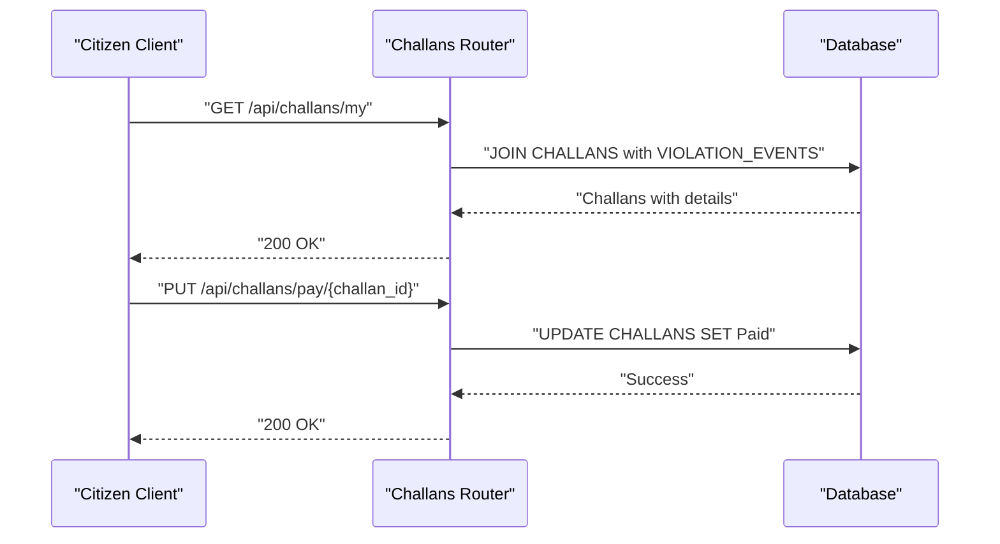

**Diagram sources**
- [challans.py:141-398](file://server/routes/challans.py#L141-L398)

**Section sources**
- [challans.py:141-398](file://server/routes/challans.py#L141-L398)

### Vehicles Routes (server/routes/vehicles.py)
- Allows police to search vehicles by plate number and retrieve violation histories.
- Aggregates summary statistics for unpaid challans and amounts.

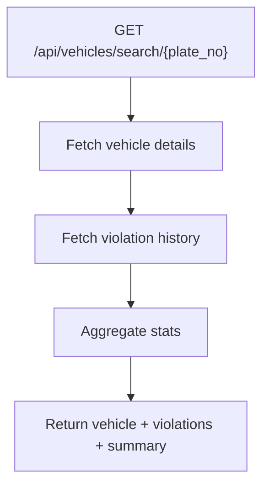

**Diagram sources**
- [vehicles.py:36-131](file://server/routes/vehicles.py#L36-L131)

**Section sources**
- [vehicles.py:36-131](file://server/routes/vehicles.py#L36-L131)

### Analytics Routes (server/routes/analytics.py)
- Provides dashboard summaries, leaderboards, and system analytics.
- Uses raw SQL queries to compute counts and aggregates efficiently.

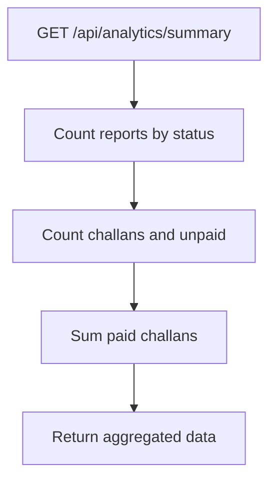

**Diagram sources**
- [analytics.py:36-124](file://server/routes/analytics.py#L36-L124)

**Section sources**
- [analytics.py:36-124](file://server/routes/analytics.py#L36-L124)

### Deprecated Express.js Backend (backend/)
- Simple Express server with CORS and JSON parsing.
- Route modules for auth, reports, police, and challans.
- Middleware for JWT verification and role gating.
- Database pool initialized with mysql2/promise.

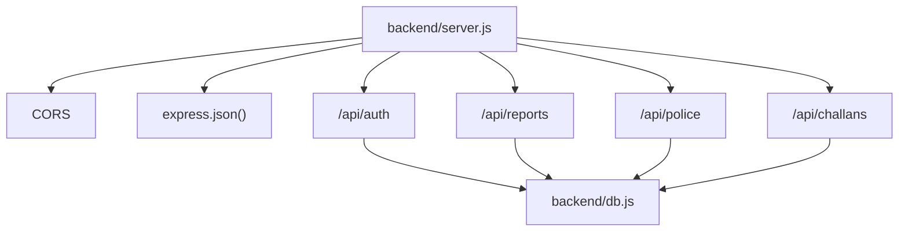

**Diagram sources**
- [server.js:1-42](file://backend/server.js#L1-L42)
- [db.js:1-26](file://backend/db.js#L1-L26)
- [auth.js:1-117](file://backend/routes/auth.js#L1-L117)
- [reports.js:1-54](file://backend/routes/reports.js#L1-L54)
- [police.js:1-109](file://backend/routes/police.js#L1-L109)
- [challans.js:1-101](file://backend/routes/challans.js#L1-L101)

**Section sources**
- [server.js:1-42](file://backend/server.js#L1-L42)
- [db.js:1-26](file://backend/db.js#L1-L26)
- [auth.js:1-37](file://backend/middleware/auth.js#L1-L37)
- [auth.js:1-117](file://backend/routes/auth.js#L1-L117)
- [reports.js:1-54](file://backend/routes/reports.js#L1-L54)
- [police.js:1-109](file://backend/routes/police.js#L1-L109)
- [challans.js:1-101](file://backend/routes/challans.js#L1-L101)

## Dependency Analysis
- FastAPI backend dependencies are declared in server/requirements.txt, including FastAPI, Uvicorn, PyMySQL, bcrypt, and Pydantic.
- Express.js backend dependencies are declared in backend/package.json, including Express, bcryptjs, jsonwebtoken, and mysql2.

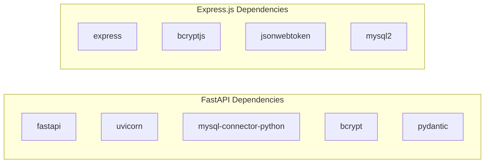

**Diagram sources**
- [requirements.txt:1-13](file://server/requirements.txt#L1-L13)
- [package.json:10-20](file://backend/package.json#L10-L20)

**Section sources**
- [requirements.txt:1-13](file://server/requirements.txt#L1-L13)
- [package.json:10-20](file://backend/package.json#L10-L20)

## Performance Considerations
- FastAPI vs Express.js:
  - FastAPI leverages asynchronous request handling and type-safe validation, reducing runtime overhead and improving throughput.
  - Express.js uses synchronous callbacks and less structured concurrency, potentially leading to higher latency under load.
- Database pooling:
  - FastAPI’s database.py initializes a connection pool with a fixed size, enabling concurrent requests without creating new connections each time.
  - Express.js uses mysql2/promise pool with configurable limits and keep-alive settings.
- Recommendations:
  - Prefer FastAPI for new development and future-proofing.
  - Tune pool sizes and timeouts based on observed concurrency and database capacity.
  - Use pagination and efficient queries for analytics endpoints.

[No sources needed since this section provides general guidance]

## Troubleshooting Guide
Common issues and resolutions:
- Database connection failures:
  - Verify host, port, user, and password in database configuration.
  - Ensure the MySQL service is reachable and the database exists.
- Authentication errors:
  - Confirm JWT secret consistency across auth routes.
  - Validate that tokens include required claims (sub, role).
- CORS errors:
  - Confirm client origin is permitted by CORS configuration.
- Route not found:
  - Ensure routes are included in main.py and mounted with correct prefixes.
- File upload issues:
  - Validate allowed content types and file size limits in reports routes.

**Section sources**
- [database.py:14-76](file://server/database.py#L14-L76)
- [auth.py:114-491](file://server/routes/auth.py#L114-L491)
- [main.py:60-87](file://server/main.py#L60-L87)
- [reports.py:50-121](file://server/routes/reports.py#L50-L121)

## Conclusion
The dual-backend architecture separates citizen-facing features (deprecated Express.js) from law enforcement/admin functions (FastAPI). The FastAPI backend offers superior performance, type safety, and maintainability, while the Express.js backend remains functional but outdated. For future development, prioritize migrating remaining citizen features to FastAPI, consolidating authentication and database logic, and leveraging FastAPI’s built-in documentation and dependency injection patterns.

[No sources needed since this section summarizes without analyzing specific files]

## Appendices

### Migration Path from Express.js to FastAPI
- Plan:
  - Identify all Express.js routes and their responsibilities.
  - Map each route to a FastAPI router with equivalent functionality.
  - Replace middleware with FastAPI Depends and Pydantic models.
  - Migrate database access to FastAPI’s database abstraction.
  - Retain backward compatibility during transition (e.g., expose legacy endpoints temporarily).
- Steps:
  - Create FastAPI equivalents for auth, reports, police, and challans.
  - Introduce shared models and validators.
  - Gradually redirect traffic from Express.js to FastAPI.
  - Decommission Express.js endpoints after validation.

[No sources needed since this section provides general guidance]

### Security and Configuration Notes
- Secrets and environment variables:
  - FastAPI routes embed secrets directly; consider moving to environment variables and a settings module.
  - Express.js middleware reads JWT_SECRET from environment; ensure consistent configuration.
- Token handling:
  - Both backends rely on JWT; ensure consistent signing algorithms and expiration policies.
- Access control:
  - FastAPI uses dependency injection for role checks; Express.js uses middleware functions.

**Section sources**
- [auth.py:29-32](file://server/routes/auth.py#L29-L32)
- [auth.js:3-3](file://backend/middleware/auth.js#L3-L3)
- [police.py:11-11](file://server/routes/police.py#L11-L11)