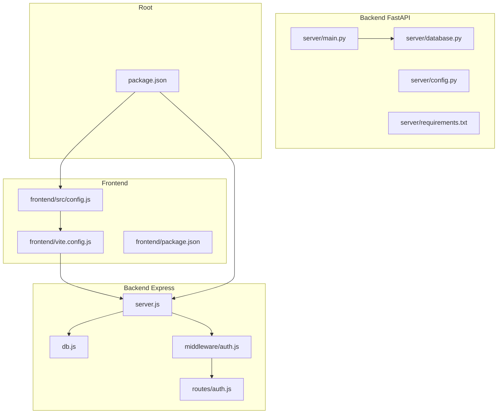
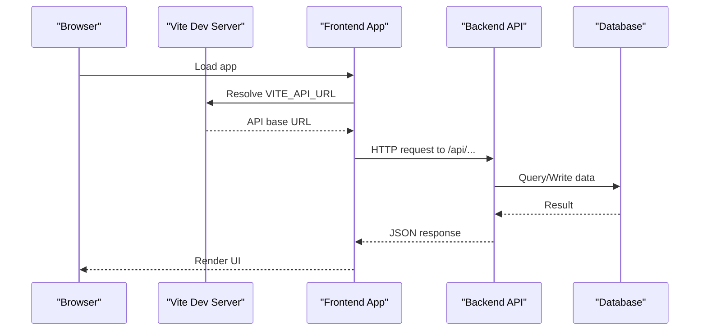
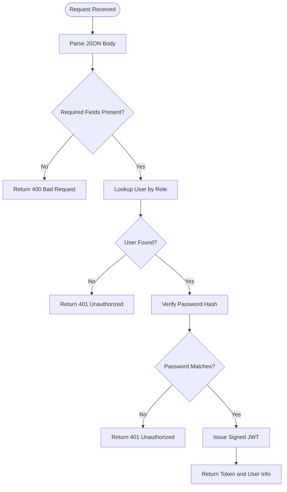
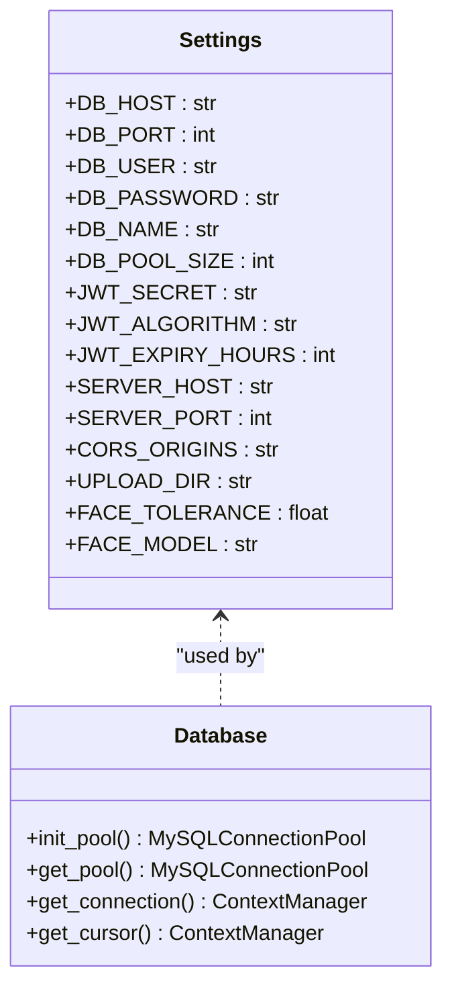
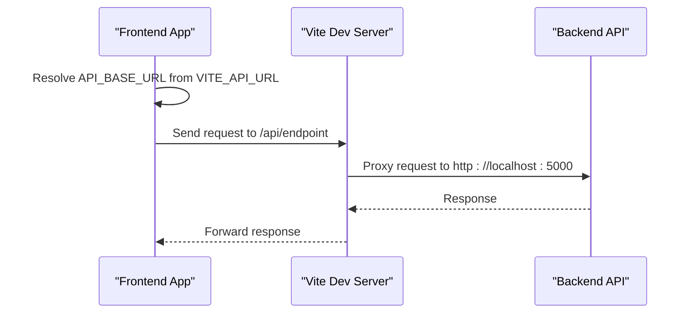
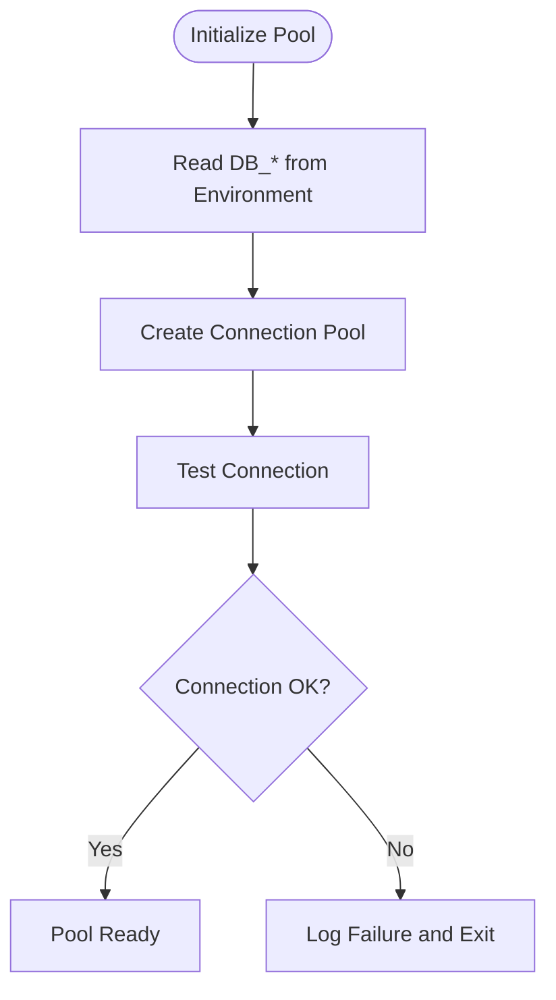
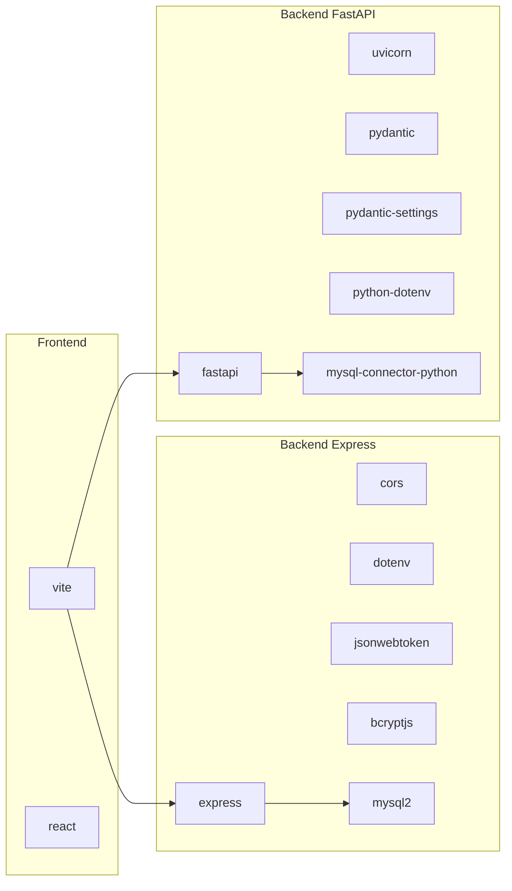

# Configuration and Environment Management

<cite>
**Referenced Files in This Document**
- [backend/package.json](file://backend/package.json)
- [backend/server.js](file://backend/server.js)
- [backend/db.js](file://backend/db.js)
- [backend/middleware/auth.js](file://backend/middleware/auth.js)
- [backend/routes/auth.js](file://backend/routes/auth.js)
- [server/main.py](file://server/main.py)
- [server/config.py](file://server/config.py)
- [server/database.py](file://server/database.py)
- [server/requirements.txt](file://server/requirements.txt)
- [frontend/src/config.js](file://frontend/src/config.js)
- [frontend/vite.config.js](file://frontend/vite.config.js)
- [frontend/package.json](file://frontend/package.json)
- [package.json](file://package.json)
</cite>

## Table of Contents
1. [Introduction](#introduction)
2. [Project Structure](#project-structure)
3. [Core Components](#core-components)
4. [Architecture Overview](#architecture-overview)
5. [Detailed Component Analysis](#detailed-component-analysis)
6. [Dependency Analysis](#dependency-analysis)
7. [Performance Considerations](#performance-considerations)
8. [Troubleshooting Guide](#troubleshooting-guide)
9. [Conclusion](#conclusion)
10. [Appendices](#appendices)

## Introduction
This document explains the configuration management system across both backend environments and how the frontend integrates with them. It covers environment variable handling, configuration loading patterns, secrets management, database connection strings, security settings, and frontend integration. Practical examples demonstrate development versus production settings, validation defaults, and error scenarios. Security best practices and troubleshooting guidance are included to help you manage environments safely and reliably.

## Project Structure
The system comprises:
- A Node.js/Express backend with environment-driven configuration and middleware for authentication and database connectivity.
- A Python/FastAPI backend with Pydantic settings loaded from a .env file and mounted static upload service.
- A React/Vite frontend that proxies API calls and loads environment-specific base URLs.

**Diagram sources**
- [backend/server.js:1-42](file://backend/server.js#L1-L42)
- [backend/db.js:1-26](file://backend/db.js#L1-L26)
- [backend/middleware/auth.js:1-37](file://backend/middleware/auth.js#L1-L37)
- [backend/routes/auth.js:1-117](file://backend/routes/auth.js#L1-L117)
- [server/main.py:1-107](file://server/main.py#L1-L107)
- [server/config.py:1-41](file://server/config.py#L1-L41)
- [server/database.py:1-76](file://server/database.py#L1-L76)
- [server/requirements.txt:1-13](file://server/requirements.txt#L1-L13)
- [frontend/src/config.js:1-34](file://frontend/src/config.js#L1-L34)
- [frontend/vite.config.js:1-23](file://frontend/vite.config.js#L1-L23)
- [frontend/package.json:1-30](file://frontend/package.json#L1-L30)
- [package.json:1-21](file://package.json#L1-L21)

**Section sources**
- [backend/server.js:1-42](file://backend/server.js#L1-L42)
- [backend/db.js:1-26](file://backend/db.js#L1-L26)
- [backend/middleware/auth.js:1-37](file://backend/middleware/auth.js#L1-L37)
- [backend/routes/auth.js:1-117](file://backend/routes/auth.js#L1-L117)
- [server/main.py:1-107](file://server/main.py#L1-L107)
- [server/config.py:1-41](file://server/config.py#L1-L41)
- [server/database.py:1-76](file://server/database.py#L1-L76)
- [server/requirements.txt:1-13](file://server/requirements.txt#L1-L13)
- [frontend/src/config.js:1-34](file://frontend/src/config.js#L1-L34)
- [frontend/vite.config.js:1-23](file://frontend/vite.config.js#L1-L23)
- [frontend/package.json:1-30](file://frontend/package.json#L1-L30)
- [package.json:1-21](file://package.json#L1-L21)

## Core Components
- Backend Express configuration:
  - Port selection via environment variable with fallback to 5000.
  - CORS enabled globally with default wildcard settings.
  - JSON body parsing middleware.
  - Database pool configured using environment variables with sensible defaults.
  - JWT secret sourced from environment with a fallback value.
  - Route handlers for authentication and profile retrieval.

- Backend FastAPI configuration:
  - Pydantic settings class defines typed configuration with defaults and .env loading.
  - CORS middleware configured to allow all origins with credentials and headers.
  - Static file mounting for uploaded evidence.
  - Uvicorn server run configuration with host, port, and reload settings.

- Frontend configuration:
  - API base URL resolved from Vite’s import.meta.env.VITE_API_URL with a localhost fallback.
  - Vite dev server proxy configured for /api and /uploads to the backend server.
  - Scripts for development and build lifecycle.

- Root workspace:
  - Workspaces define backend and frontend as separate packages.
  - Convenience scripts to start backend and frontend in development.

**Section sources**
- [backend/server.js:1-42](file://backend/server.js#L1-L42)
- [backend/db.js:1-26](file://backend/db.js#L1-L26)
- [backend/middleware/auth.js:1-37](file://backend/middleware/auth.js#L1-L37)
- [backend/routes/auth.js:1-117](file://backend/routes/auth.js#L1-L117)
- [server/main.py:1-107](file://server/main.py#L1-L107)
- [server/config.py:1-41](file://server/config.py#L1-L41)
- [server/database.py:1-76](file://server/database.py#L1-L76)
- [frontend/src/config.js:1-34](file://frontend/src/config.js#L1-L34)
- [frontend/vite.config.js:1-23](file://frontend/vite.config.js#L1-L23)
- [frontend/package.json:1-30](file://frontend/package.json#L1-L30)
- [package.json:1-21](file://package.json#L1-L21)

## Architecture Overview
The frontend communicates with the backend through proxied API endpoints. The backend FastAPI server serves both API routes and static uploads, while the Express backend serves API routes and relies on environment variables for runtime configuration.

**Diagram sources**
- [frontend/src/config.js:1-34](file://frontend/src/config.js#L1-L34)
- [frontend/vite.config.js:1-23](file://frontend/vite.config.js#L1-L23)
- [backend/server.js:1-42](file://backend/server.js#L1-L42)
- [server/main.py:1-107](file://server/main.py#L1-L107)

## Detailed Component Analysis

### Backend Express Configuration
- Environment variables:
  - PORT: Falls back to 5000 if unset.
  - JWT_SECRET: Falls back to a development key if unset.
  - Database: DB_HOST, DB_USER, DB_PASSWORD, DB_NAME with defaults.

- Middleware and routes:
  - Global CORS enabled.
  - JSON body parser enabled.
  - Authentication route validates role and credentials, issues signed tokens.
  - Profile route decodes JWT and fetches user details.

- Security and error handling:
  - Missing or invalid Authorization header yields 401.
  - Expired or invalid tokens yield 403.
  - Global 404 and 500 error handlers.

**Diagram sources**
- [backend/routes/auth.js:1-117](file://backend/routes/auth.js#L1-L117)
- [backend/middleware/auth.js:1-37](file://backend/middleware/auth.js#L1-L37)

**Section sources**
- [backend/server.js:1-42](file://backend/server.js#L1-L42)
- [backend/db.js:1-26](file://backend/db.js#L1-L26)
- [backend/middleware/auth.js:1-37](file://backend/middleware/auth.js#L1-L37)
- [backend/routes/auth.js:1-117](file://backend/routes/auth.js#L1-L117)

### Backend FastAPI Configuration
- Pydantic settings:
  - Typed configuration with defaults for database, JWT, server, CORS, and face recognition.
  - Loads from .env via env_file setting.

- Runtime behavior:
  - CORS configured to allow all origins with credentials and headers.
  - Static uploads directory mounted under /uploads.
  - Health check endpoint exposed.
  - Uvicorn run parameters for host, port, reload, and log level.

- Database pool:
  - Hardcoded connection parameters in the pool initializer.
  - Lazy initialization and context-managed connections/cursors.

**Diagram sources**
- [server/config.py:1-41](file://server/config.py#L1-L41)
- [server/database.py:1-76](file://server/database.py#L1-L76)

**Section sources**
- [server/main.py:1-107](file://server/main.py#L1-L107)
- [server/config.py:1-41](file://server/config.py#L1-L41)
- [server/database.py:1-76](file://server/database.py#L1-L76)

### Frontend Configuration Integration
- API base URL resolution:
  - Uses VITE_API_URL from environment; falls back to http://localhost:5000.
- Endpoint definitions:
  - Centralized API_ENDPOINTS map built from the base URL.
- Vite dev server:
  - Proxies /api and /uploads to the backend server.
  - Default dev server port is 5173.

**Diagram sources**
- [frontend/src/config.js:1-34](file://frontend/src/config.js#L1-L34)
- [frontend/vite.config.js:1-23](file://frontend/vite.config.js#L1-L23)

**Section sources**
- [frontend/src/config.js:1-34](file://frontend/src/config.js#L1-L34)
- [frontend/vite.config.js:1-23](file://frontend/vite.config.js#L1-L23)
- [frontend/package.json:1-30](file://frontend/package.json#L1-L30)

### Environment Variables and Secrets Management
- Backend Express:
  - PORT, JWT_SECRET, DB_HOST, DB_USER, DB_PASSWORD, DB_NAME.
  - JWT_SECRET has a fallback value; avoid using it in production.
- Backend FastAPI:
  - Settings class defines defaults; .env file is loaded via env_file.
  - JWT_SECRET and database credentials should be managed via .env in production.
- Frontend:
  - VITE_API_URL controls API base URL; ensure it matches backend host/port.
- Best practices:
  - Store secrets in .env files outside version control.
  - Use strong, random secrets and rotate periodically.
  - Restrict CORS origins in production to trusted domains.
  - Never commit secrets to repositories.

**Section sources**
- [backend/server.js:1-42](file://backend/server.js#L1-L42)
- [backend/middleware/auth.js:1-37](file://backend/middleware/auth.js#L1-L37)
- [backend/db.js:1-26](file://backend/db.js#L1-L26)
- [server/config.py:1-41](file://server/config.py#L1-L41)
- [frontend/src/config.js:1-34](file://frontend/src/config.js#L1-L34)

### Database Connection Strings and Drivers
- Express backend:
  - Uses mysql2/promise pool configured with environment variables for host, user, password, and database.
  - Includes connection testing on startup.
- FastAPI backend:
  - Uses mysql-connector-python with a hardcoded pool configuration.
  - Provides context-managed connection and cursor helpers.

**Diagram sources**
- [backend/db.js:1-26](file://backend/db.js#L1-L26)
- [server/database.py:1-76](file://server/database.py#L1-L76)

**Section sources**
- [backend/db.js:1-26](file://backend/db.js#L1-L26)
- [server/database.py:1-76](file://server/database.py#L1-L76)

### Security Settings and Middleware
- Express:
  - Global CORS enabled; consider narrowing origins in production.
  - JWT secret fallback present; configure JWT_SECRET in production.
  - Authentication middleware verifies tokens and enforces role checks.
- FastAPI:
  - CORS configured to allow all origins with credentials and headers.
  - Static uploads served publicly; ensure appropriate access control and sanitization.

**Section sources**
- [backend/server.js:1-42](file://backend/server.js#L1-L42)
- [backend/middleware/auth.js:1-37](file://backend/middleware/auth.js#L1-L37)
- [server/main.py:1-107](file://server/main.py#L1-L107)

### Frontend Integration and Build Configuration
- API base URL:
  - Controlled by VITE_API_URL; defaults to localhost:5000.
- Proxy configuration:
  - /api and /uploads proxied to backend server for local development.
- Build and scripts:
  - Vite build and preview scripts; React and related dependencies.

**Section sources**
- [frontend/src/config.js:1-34](file://frontend/src/config.js#L1-L34)
- [frontend/vite.config.js:1-23](file://frontend/vite.config.js#L1-L23)
- [frontend/package.json:1-30](file://frontend/package.json#L1-L30)

### Environment-Specific Configurations
- Development:
  - Express: PORT defaults to 5000; JWT_SECRET fallback used; CORS permissive.
  - FastAPI: Defaults loaded from Settings; CORS permissive; uploads mounted.
  - Frontend: VITE_API_URL defaults to localhost:5000; Vite proxy to backend.
- Production:
  - Set environment variables for PORT, JWT_SECRET, DB_HOST, DB_USER, DB_PASSWORD, DB_NAME.
  - Narrow CORS origins to trusted domains.
  - Serve FastAPI behind a reverse proxy and enforce HTTPS.
  - Use a dedicated secrets manager for JWT_SECRET and database credentials.

**Section sources**
- [backend/server.js:1-42](file://backend/server.js#L1-L42)
- [backend/middleware/auth.js:1-37](file://backend/middleware/auth.js#L1-L37)
- [server/config.py:1-41](file://server/config.py#L1-L41)
- [server/main.py:1-107](file://server/main.py#L1-L107)
- [frontend/src/config.js:1-34](file://frontend/src/config.js#L1-L34)
- [frontend/vite.config.js:1-23](file://frontend/vite.config.js#L1-L23)

### Configuration Validation and Defaults
- Express:
  - Uses environment variables with explicit fallbacks for port and database.
  - Validates presence of required fields in requests.
- FastAPI:
  - Pydantic Settings provides type-safe defaults and .env loading.
  - Database pool initialized once and reused.
- Frontend:
  - VITE_API_URL fallback ensures local development continuity.

**Section sources**
- [backend/server.js:1-42](file://backend/server.js#L1-L42)
- [backend/db.js:1-26](file://backend/db.js#L1-L26)
- [server/config.py:1-41](file://server/config.py#L1-L41)
- [frontend/src/config.js:1-34](file://frontend/src/config.js#L1-L34)

### Error Scenarios and Recovery
- Missing environment variables:
  - Backend may connect with defaults or fail to connect; ensure .env is loaded.
- Invalid or expired JWT:
  - Returns 401/403; instruct clients to re-authenticate.
- Database connection failures:
  - Pool connection test logs errors; fix credentials or network.
- CORS misconfiguration:
  - Cross-origin requests blocked; adjust CORS settings.

**Section sources**
- [backend/server.js:1-42](file://backend/server.js#L1-L42)
- [backend/middleware/auth.js:1-37](file://backend/middleware/auth.js#L1-L37)
- [backend/db.js:1-26](file://backend/db.js#L1-L26)
- [server/database.py:1-76](file://server/database.py#L1-L76)

## Dependency Analysis
- Backend Express depends on dotenv, cors, express, jsonwebtoken, bcryptjs, and mysql2.
- Backend FastAPI depends on FastAPI, Uvicorn, Pydantic, Pydantic Settings, python-dotenv, and mysql-connector-python.
- Frontend depends on React, Vite, Tailwind, and related libraries; Vite proxy targets backend.

**Diagram sources**
- [backend/package.json:1-22](file://backend/package.json#L1-L22)
- [server/requirements.txt:1-13](file://server/requirements.txt#L1-L13)
- [frontend/package.json:1-30](file://frontend/package.json#L1-L30)

**Section sources**
- [backend/package.json:1-22](file://backend/package.json#L1-L22)
- [server/requirements.txt:1-13](file://server/requirements.txt#L1-L13)
- [frontend/package.json:1-30](file://frontend/package.json#L1-L30)

## Performance Considerations
- Connection pooling:
  - Use pool sizes appropriate to workload; monitor connection usage.
- CORS overhead:
  - Limit allowed origins and headers in production to reduce preflight overhead.
- Static file serving:
  - Offload uploads and static assets to a CDN or reverse proxy in production.
- Token lifetime:
  - Balance usability and security by tuning JWT expiry.

[No sources needed since this section provides general guidance]

## Troubleshooting Guide
- Backend Express fails to start:
  - Verify PORT availability and environment variable loading.
  - Check JWT_SECRET presence; set a strong secret for production.
- Database connection errors:
  - Confirm DB_HOST, DB_USER, DB_PASSWORD, DB_NAME; test connectivity separately.
  - Review pool connection test logs for failure reasons.
- Frontend cannot reach backend:
  - Ensure VITE_API_URL matches backend host/port.
  - Confirm Vite proxy entries for /api and /uploads.
- CORS errors in browser:
  - Align CORS settings with frontend origin; avoid wildcard in production.
- JWT errors:
  - Validate token issuer, audience, and expiration; ensure shared secret alignment.

**Section sources**
- [backend/server.js:1-42](file://backend/server.js#L1-L42)
- [backend/db.js:1-26](file://backend/db.js#L1-L26)
- [backend/middleware/auth.js:1-37](file://backend/middleware/auth.js#L1-L37)
- [frontend/src/config.js:1-34](file://frontend/src/config.js#L1-L34)
- [frontend/vite.config.js:1-23](file://frontend/vite.config.js#L1-L23)

## Conclusion
The system separates configuration concerns across environments using environment variables and .env files. Express and FastAPI backends expose environment-driven settings, while the frontend resolves API base URLs from Vite’s environment. By tightening CORS, managing secrets securely, and validating configuration at startup, you can operate reliably in development and production.

[No sources needed since this section summarizes without analyzing specific files]

## Appendices
- Example environment variables:
  - PORT, JWT_SECRET, DB_HOST, DB_USER, DB_PASSWORD, DB_NAME, VITE_API_URL.
- Recommended production steps:
  - Use a secrets manager for JWT_SECRET and database credentials.
  - Pin CORS origins to trusted domains.
  - Run FastAPI behind a reverse proxy with TLS termination.

[No sources needed since this section provides general guidance]