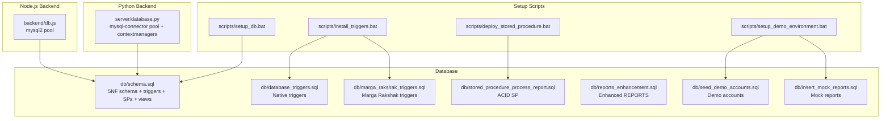
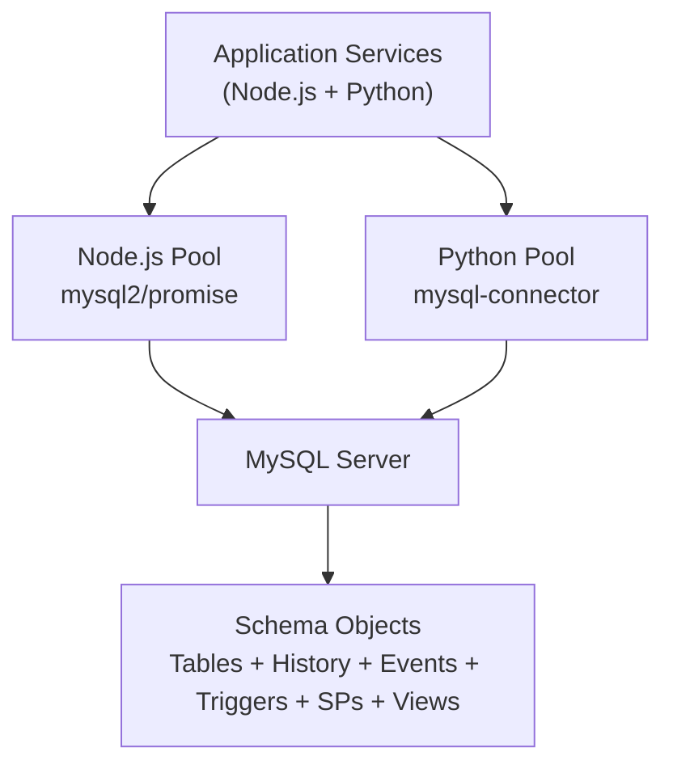
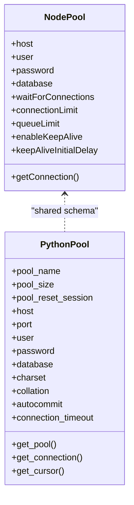
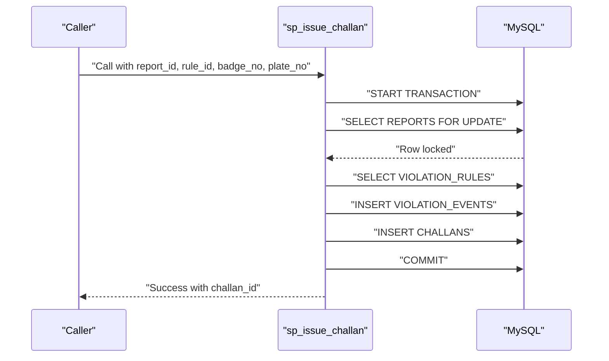
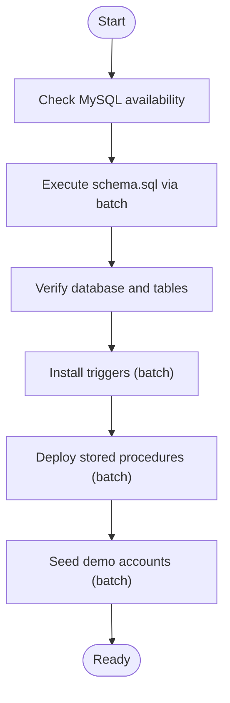
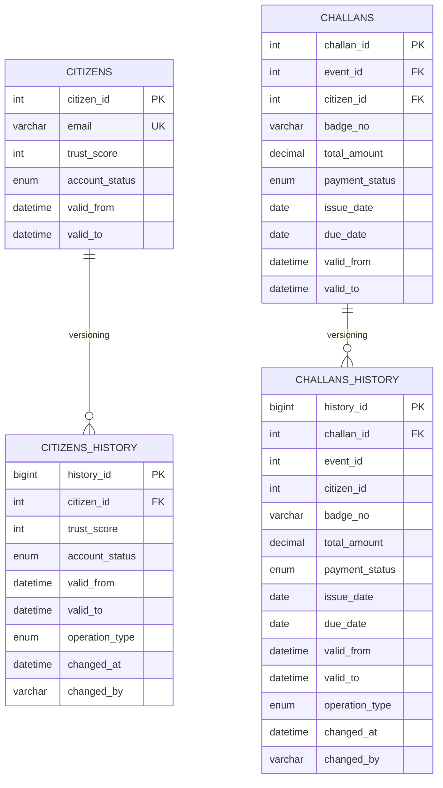
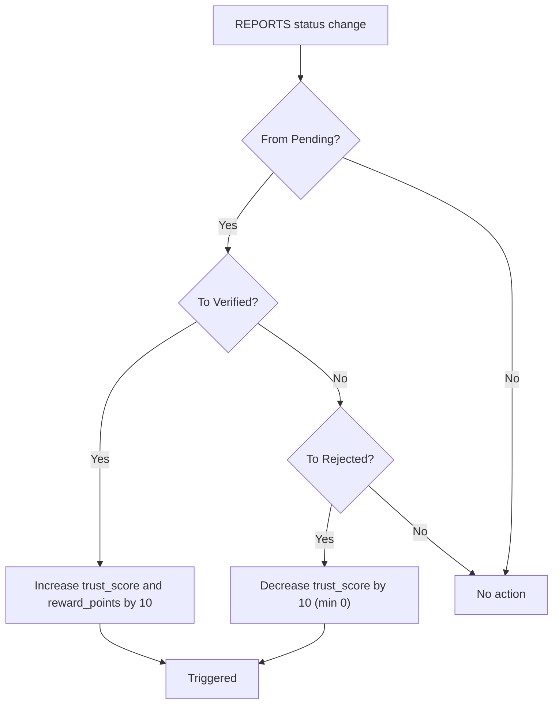
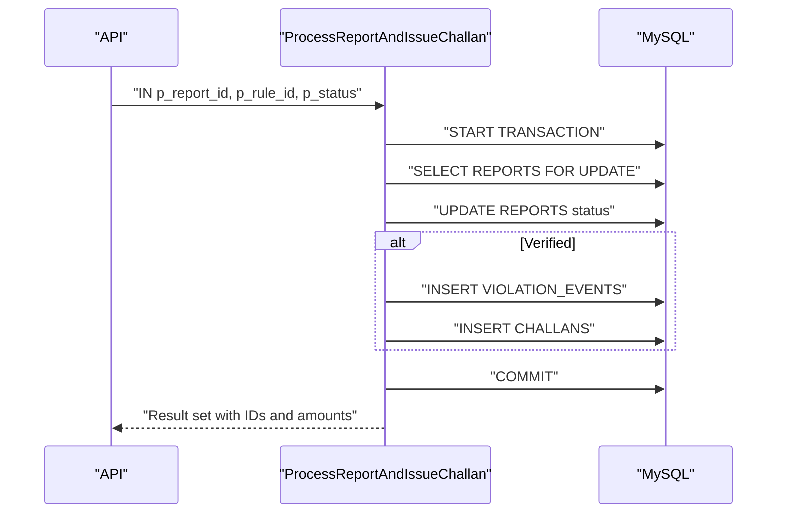
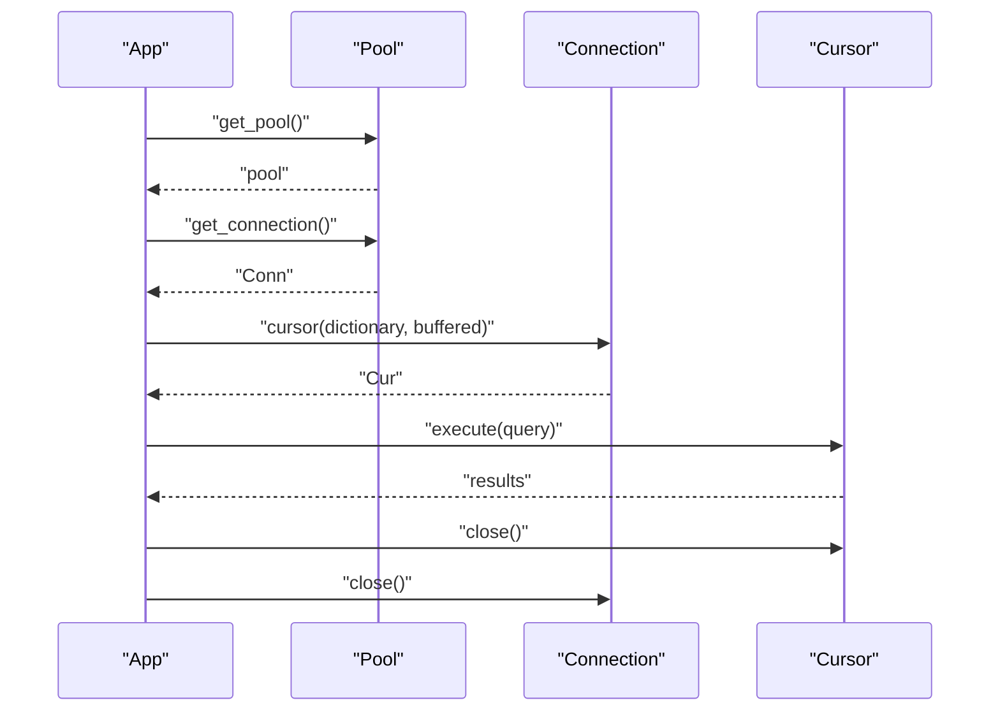
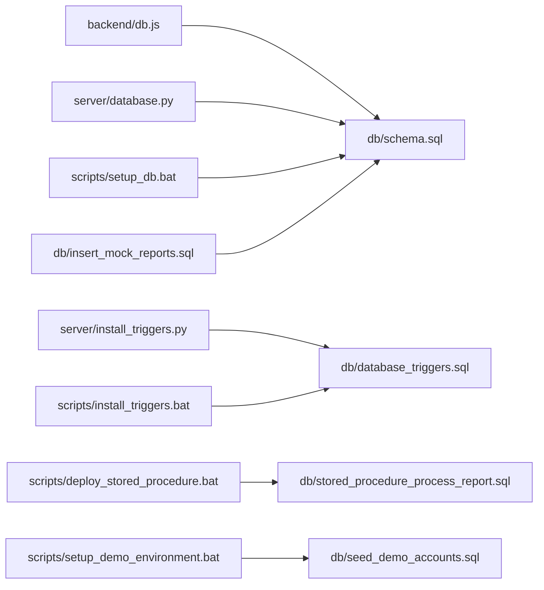

# Database Layer Architecture

<cite>
**Referenced Files in This Document**
- [backend/db.js](file://backend/db.js)
- [server/database.py](file://server/database.py)
- [db/schema.sql](file://db/schema.sql)
- [db/stored_procedure_process_report.sql](file://db/stored_procedure_process_report.sql)
- [db/database_triggers.sql](file://db/database_triggers.sql)
- [db/marga_rakshak_triggers.sql](file://db/marga_rakshak_triggers.sql)
- [db/reports_enhancement.sql](file://db/reports_enhancement.sql)
- [db/seed_demo_accounts.sql](file://db/seed_demo_accounts.sql)
- [db/insert_mock_reports.sql](file://db/insert_mock_reports.sql)
- [server/init_db.py](file://server/init_db.py)
- [server/setup_database.py](file://server/setup_database.py)
- [server/test_db_connection.py](file://server/test_db_connection.py)
- [scripts/setup_db.bat](file://scripts/setup_db.bat)
- [scripts/install_triggers.bat](file://scripts/install_triggers.bat)
- [scripts/deploy_stored_procedure.bat](file://scripts/deploy_stored_procedure.bat)
- [scripts/setup_demo_environment.bat](file://scripts/setup_demo_environment.bat)
- [server/install_triggers.py](file://server/install_triggers.py)
</cite>

## Table of Contents
1. [Introduction](#introduction)
2. [Project Structure](#project-structure)
3. [Core Components](#core-components)
4. [Architecture Overview](#architecture-overview)
5. [Detailed Component Analysis](#detailed-component-analysis)
6. [Dependency Analysis](#dependency-analysis)
7. [Performance Considerations](#performance-considerations)
8. [Troubleshooting Guide](#troubleshooting-guide)
9. [Conclusion](#conclusion)
10. [Appendices](#appendices)

## Introduction
This document describes the database layer architecture shared by both backend systems. It covers connection management, connection pooling strategies, transaction handling, initialization and schema validation, integrity checks, abstraction layers, query execution patterns, error handling, the 5NF normalized schema design, table relationships and indexing, trigger-based automation for trust scoring and audit trails, stored procedures for complex workflows, security considerations, backup strategies, performance optimization, and practical examples and troubleshooting guidance.

## Project Structure
The database layer spans two backend environments:
- JavaScript/Node.js backend using mysql2/promise with a connection pool
- Python backend using mysql-connector-python with a connection pool and context-managed resources

Database initialization and schema are defined via SQL scripts and Windows batch helpers. Stored procedures and triggers encapsulate business logic and automation.

**Diagram sources**
- [backend/db.js:1-26](file://backend/db.js#L1-L26)
- [server/database.py:1-76](file://server/database.py#L1-L76)
- [db/schema.sql:1-942](file://db/schema.sql#L1-L942)
- [db/database_triggers.sql:1-48](file://db/database_triggers.sql#L1-L48)
- [db/marga_rakshak_triggers.sql:1-78](file://db/marga_rakshak_triggers.sql#L1-L78)
- [db/stored_procedure_process_report.sql:1-115](file://db/stored_procedure_process_report.sql#L1-L115)
- [db/reports_enhancement.sql:1-302](file://db/reports_enhancement.sql#L1-L302)
- [db/seed_demo_accounts.sql:1-175](file://db/seed_demo_accounts.sql#L1-L175)
- [db/insert_mock_reports.sql:1-22](file://db/insert_mock_reports.sql#L1-L22)
- [scripts/setup_db.bat:1-64](file://scripts/setup_db.bat#L1-L64)
- [scripts/install_triggers.bat:1-55](file://scripts/install_triggers.bat#L1-L55)
- [scripts/deploy_stored_procedure.bat:1-44](file://scripts/deploy_stored_procedure.bat#L1-L44)
- [scripts/setup_demo_environment.bat:1-79](file://scripts/setup_demo_environment.bat#L1-L79)

**Section sources**
- [backend/db.js:1-26](file://backend/db.js#L1-L26)
- [server/database.py:1-76](file://server/database.py#L1-L76)
- [db/schema.sql:1-942](file://db/schema.sql#L1-L942)
- [scripts/setup_db.bat:1-64](file://scripts/setup_db.bat#L1-L64)

## Core Components
- Node.js connection pool: mysql2/promise pool configured with connection limits, queueing, keep-alive, and startup connection test.
- Python connection pool: mysql-connector pooling with context managers for safe acquisition/release and automatic rollback on errors.
- Schema and metadata: 5NF normalized production schema with temporal versioning, transient tables, events, triggers, stored procedures, and views.
- Automation: triggers for trust scoring and audit trails; stored procedures for ACID workflows (challan issuance, payment, rejection, overdue flagging).
- Initialization and verification: batch scripts and Python helpers for setup, trigger deployment, stored procedure deployment, and demo seeding.

**Section sources**
- [backend/db.js:1-26](file://backend/db.js#L1-L26)
- [server/database.py:14-76](file://server/database.py#L14-L76)
- [db/schema.sql:1-942](file://db/schema.sql#L1-L942)
- [db/stored_procedure_process_report.sql:8-98](file://db/stored_procedure_process_report.sql#L8-L98)
- [db/database_triggers.sql:8-35](file://db/database_triggers.sql#L8-L35)
- [db/marga_rakshak_triggers.sql:16-44](file://db/marga_rakshak_triggers.sql#L16-L44)

## Architecture Overview
The database layer is designed around:
- Shared schema across both backend systems
- Centralized automation via triggers and stored procedures
- Robust transaction boundaries with explicit rollback on exceptions
- Temporal auditing for sensitive entities (citizens and challans)
- Event-driven cleanup of transient data

**Diagram sources**
- [backend/db.js:3-13](file://backend/db.js#L3-L13)
- [server/database.py:14-50](file://server/database.py#L14-L50)
- [db/schema.sql:10-15](file://db/schema.sql#L10-L15)

## Detailed Component Analysis

### Connection Management and Pooling
- Node.js pool: configured with connectionLimit, queueLimit, keepAlive, and immediate release after startup test. This ensures predictable concurrency and resource reuse.
- Python pool: configured with reset_session, autocommit disabled, connection timeout, and charset/collation settings. Context managers guarantee proper close semantics and rollback on errors.

**Diagram sources**
- [backend/db.js:3-13](file://backend/db.js#L3-L13)
- [server/database.py:22-35](file://server/database.py#L22-L35)

**Section sources**
- [backend/db.js:1-26](file://backend/db.js#L1-L26)
- [server/database.py:14-76](file://server/database.py#L14-L76)

### Transaction Handling Patterns
- Stored procedures enforce ACID transactions with explicit exception handlers and rollback on SQL exceptions. Examples:
  - sp_issue_challan: validates report state, locks rows, creates violation event and challan, commits or rolls back.
  - sp_pay_challan: row-level locking for uniqueness and ownership, updates payment and rewards.
  - sp_reject_report: validates and updates status safely.
  - sp_flag_overdue_challans: cursor-based iteration with per-row checks and penalties.
- Python context managers ensure rollback on errors and safe closure.

**Diagram sources**
- [db/schema.sql:440-546](file://db/schema.sql#L440-L546)

**Section sources**
- [db/schema.sql:440-754](file://db/schema.sql#L440-L754)
- [server/database.py:52-76](file://server/database.py#L52-L76)

### Database Initialization and Schema Validation
- Batch setup script executes schema.sql to create database, tables, triggers, events, stored procedures, and views.
- Python setup scripts demonstrate database creation and table creation for early stages.
- Verification helpers check connectivity and table presence.

**Diagram sources**
- [scripts/setup_db.bat:30-35](file://scripts/setup_db.bat#L30-L35)
- [server/setup_database.py:8-109](file://server/setup_database.py#L8-L109)
- [server/test_db_connection.py:1-34](file://server/test_db_connection.py#L1-L34)

**Section sources**
- [scripts/setup_db.bat:1-64](file://scripts/setup_db.bat#L1-L64)
- [server/setup_database.py:8-109](file://server/setup_database.py#L8-L109)
- [server/test_db_connection.py:1-34](file://server/test_db_connection.py#L1-L34)

### Integrity Checking and Audit Trails
- Temporal versioning: CITIZENS and CHALLANS include valid_from/valid_to to track changes over time.
- History tables: CITIZENS_HISTORY and CHALLANS_HISTORY capture operation_type and changed_by for audits.
- Events: ACTIVE_SESSIONS and UNVERIFIED_UPLOADS are purged by scheduled events to maintain data hygiene.

**Diagram sources**
- [db/schema.sql:26-65](file://db/schema.sql#L26-L65)
- [db/schema.sql:173-219](file://db/schema.sql#L173-L219)

**Section sources**
- [db/schema.sql:26-65](file://db/schema.sql#L26-L65)
- [db/schema.sql:173-219](file://db/schema.sql#L173-L219)

### Trigger-Based Automation
- Native triggers (database_triggers.sql): auto-reward (+10 trust and points) on verified reports; auto-penalty (-10 trust) on rejected reports.
- Marga Rakshak triggers (marga_rakshak_triggers.sql): similar behavior with minor enhancements.
- Triggers fire after UPDATE on REPORTS and update CITIZENS accordingly.

**Diagram sources**
- [db/database_triggers.sql:10-35](file://db/database_triggers.sql#L10-L35)
- [db/marga_rakshak_triggers.sql:16-44](file://db/marga_rakshak_triggers.sql#L16-L44)

**Section sources**
- [db/database_triggers.sql:8-35](file://db/database_triggers.sql#L8-L35)
- [db/marga_rakshak_triggers.sql:12-44](file://db/marga_rakshak_triggers.sql#L12-L44)

### Stored Procedures for Complex Workflows
- ProcessReportAndIssueChallan: ACID-compliant pipeline for report processing with row-level locking, rule validation, event creation, and challan issuance.
- Additional procedures in schema.sql: sp_issue_challan, sp_pay_challan, sp_reject_report, sp_flag_overdue_challans.

**Diagram sources**
- [db/stored_procedure_process_report.sql:8-98](file://db/stored_procedure_process_report.sql#L8-L98)
- [db/schema.sql:440-754](file://db/schema.sql#L440-L754)

**Section sources**
- [db/stored_procedure_process_report.sql:8-98](file://db/stored_procedure_process_report.sql#L8-L98)
- [db/schema.sql:440-754](file://db/schema.sql#L440-L754)

### Connection Abstraction and Query Execution
- Node.js: pool.getConnection() for acquiring connections; release() after use; startup test logs success/failure.
- Python: get_pool()/get_connection() with context manager; get_cursor() yields a cursor and connection pair; automatic rollback on exceptions; safe close in finally.

**Diagram sources**
- [backend/db.js:15-23](file://backend/db.js#L15-L23)
- [server/database.py:52-76](file://server/database.py#L52-L76)

**Section sources**
- [backend/db.js:15-23](file://backend/db.js#L15-L23)
- [server/database.py:52-76](file://server/database.py#L52-L76)

### Practical Examples
- Connection management:
  - Node.js: acquire, use, and release a pooled connection; see startup test pattern.
  - Python: context-managed connection and cursor; automatic rollback on error.
- Query building and result processing:
  - Use prepared statements and parameterized queries in stored procedures.
  - In Python, configure dictionary cursors for structured results; ensure buffered cursors for large datasets.
- Schema enhancement:
  - Reports enhancement adds violation_type, latitude/longitude, fine_amount, and updated status enum.

**Section sources**
- [backend/db.js:15-23](file://backend/db.js#L15-L23)
- [server/database.py:52-76](file://server/database.py#L52-L76)
- [db/reports_enhancement.sql:14-47](file://db/reports_enhancement.sql#L14-L47)

## Dependency Analysis
- Both backend systems depend on the shared schema and automation objects.
- Python backend also includes a local trigger installer for environments where batch scripts are not used.
- Setup scripts orchestrate schema, triggers, stored procedures, and demo data.

**Diagram sources**
- [backend/db.js:1-26](file://backend/db.js#L1-L26)
- [server/database.py:1-76](file://server/database.py#L1-L76)
- [server/install_triggers.py:1-71](file://server/install_triggers.py#L1-L71)
- [scripts/setup_db.bat:1-64](file://scripts/setup_db.bat#L1-L64)
- [scripts/install_triggers.bat:1-55](file://scripts/install_triggers.bat#L1-L55)
- [scripts/deploy_stored_procedure.bat:1-44](file://scripts/deploy_stored_procedure.bat#L1-L44)
- [scripts/setup_demo_environment.bat:1-79](file://scripts/setup_demo_environment.bat#L1-L79)
- [db/seed_demo_accounts.sql:1-175](file://db/seed_demo_accounts.sql#L1-L175)
- [db/insert_mock_reports.sql:1-22](file://db/insert_mock_reports.sql#L1-L22)

**Section sources**
- [server/install_triggers.py:1-71](file://server/install_triggers.py#L1-L71)
- [scripts/setup_db.bat:1-64](file://scripts/setup_db.bat#L1-L64)
- [scripts/install_triggers.bat:1-55](file://scripts/install_triggers.bat#L1-L55)
- [scripts/deploy_stored_procedure.bat:1-44](file://scripts/deploy_stored_procedure.bat#L1-L44)
- [scripts/setup_demo_environment.bat:1-79](file://scripts/setup_demo_environment.bat#L1-L79)

## Performance Considerations
- Indexing strategy:
  - High-selectivity columns (email, badge_no, plate_no) indexed for fast joins and lookups.
  - Status and date-based indexes support dashboards and filtering.
  - Spatial/geospatial indexes can be considered for latitude/longitude if spatial queries increase.
- Connection pooling:
  - Tune pool sizes based on concurrent workload; monitor queueing and timeouts.
  - Enable keep-alive and appropriate timeouts to reduce connection churn.
- Transactions:
  - Keep transactions short; minimize row-level locks; use targeted SELECT ... FOR UPDATE only when necessary.
- Events:
  - Scheduled events purge transient data; ensure event_scheduler is enabled and schedule aligns with workload.
- Character set and collation:
  - utf8mb4 with unicode_ci improves internationalization and sorting consistency.

[No sources needed since this section provides general guidance]

## Troubleshooting Guide
- Connectivity issues:
  - Verify MySQL service is running and reachable on localhost.
  - Confirm credentials and database name match setup scripts.
  - Use test scripts to validate connection and table visibility.
- Schema migration challenges:
  - Apply schema.sql via batch script to recreate schema cleanly.
  - For partial updates, apply targeted SQL patches (e.g., reports enhancement).
- Trigger deployment failures:
  - Ensure database exists and credentials are correct.
  - Use batch script or Python installer to drop and recreate triggers.
- Stored procedure deployment:
  - Confirm procedure creation and verify via INFORMATION_SCHEMA.
- Demo environment setup:
  - Generate and insert password hashes, seed accounts, and optionally insert mock reports.

**Section sources**
- [scripts/setup_db.bat:10-20](file://scripts/setup_db.bat#L10-L20)
- [scripts/install_triggers.bat:14-20](file://scripts/install_triggers.bat#L14-L20)
- [scripts/deploy_stored_procedure.bat:12-15](file://scripts/deploy_stored_procedure.bat#L12-L15)
- [scripts/setup_demo_environment.bat:14-32](file://scripts/setup_demo_environment.bat#L14-L32)
- [server/test_db_connection.py:3-33](file://server/test_db_connection.py#L3-L33)

## Conclusion
The database layer employs a robust, shared schema with strong automation via triggers and stored procedures, reliable connection pooling across both backend systems, and comprehensive audit trails with temporal versioning. The setup scripts and verification helpers streamline initialization and ongoing maintenance. Adhering to the transaction and indexing strategies outlined here will help sustain performance and reliability.

[No sources needed since this section summarizes without analyzing specific files]

## Appendices

### Schema Design Highlights
- 5NF normalization reduces redundancy and supports temporal versioning.
- Core entities: CITIZENS, POLICE_OFFICERS, VEHICLES, VIOLATION_RULES, REPORTS, EVIDENCE_PHOTOS, VIOLATION_EVENTS, CHALLANS, OVERDUE_LOG.
- Transient tables: ACTIVE_SESSIONS, UNVERIFIED_UPLOADS with scheduled purges.
- Views: Pending_Reports_Dashboard, Citizen_Challan_Summary.

**Section sources**
- [db/schema.sql:17-800](file://db/schema.sql#L17-L800)

### Security Considerations
- Use strong credentials and limit database user privileges.
- Store secrets via environment variables or secure configuration management.
- Prefer parameterized queries and stored procedures to mitigate injection risks.
- Regularly review triggers and stored procedures for unintended side effects.

[No sources needed since this section provides general guidance]

### Backup Strategies
- Schedule regular logical backups of the traffic_violation_db database.
- Validate backups periodically and test restoration procedures.
- Consider point-in-time recovery (binlog) for granular recovery.

[No sources needed since this section provides general guidance]