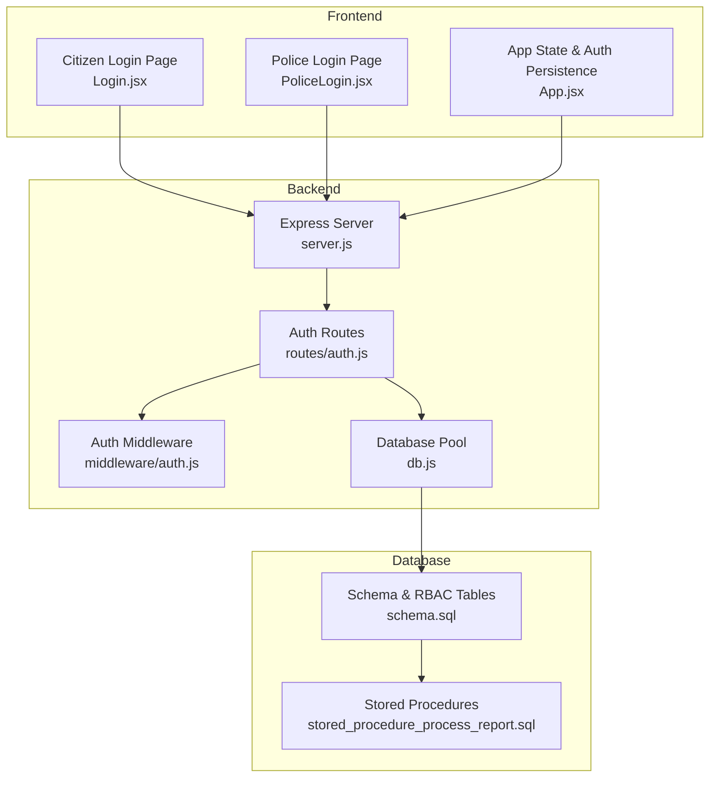
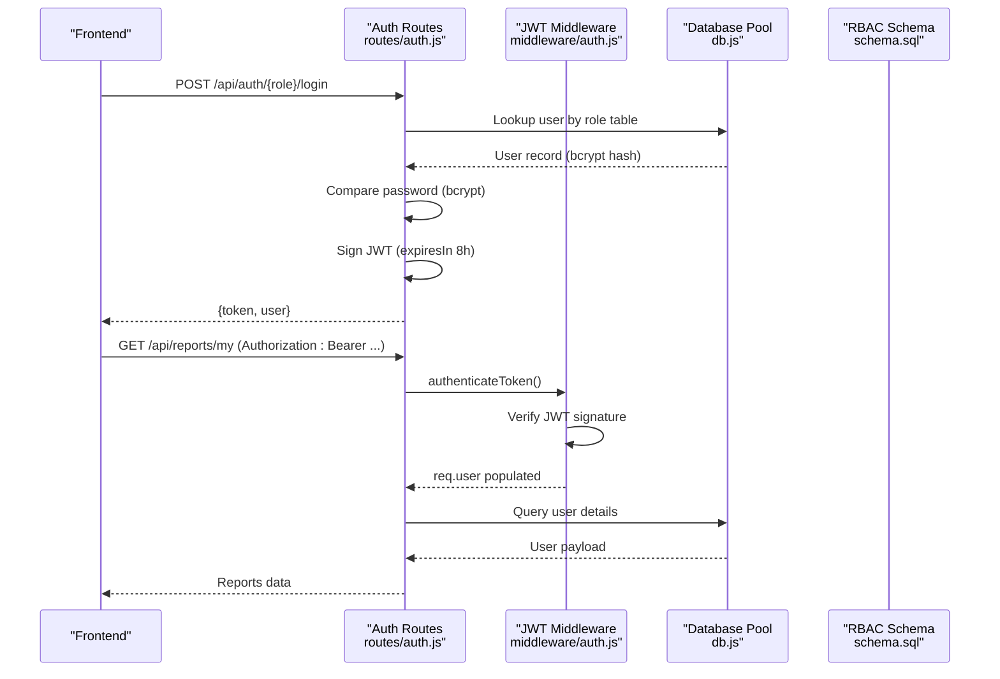
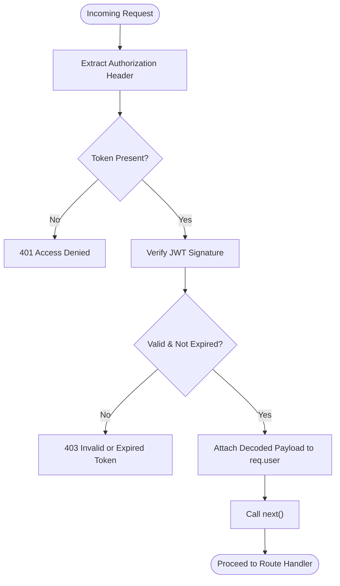
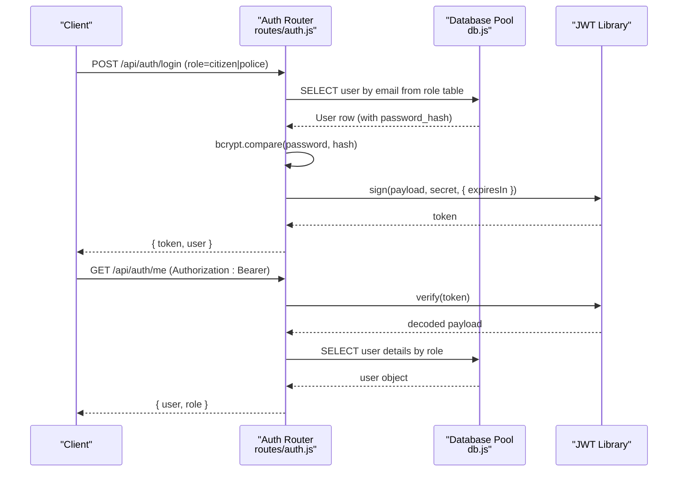
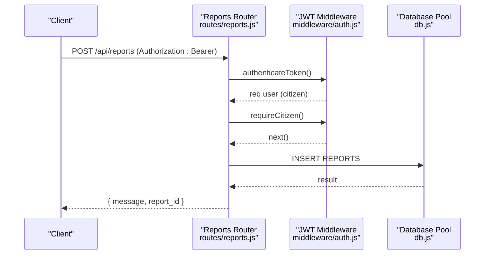
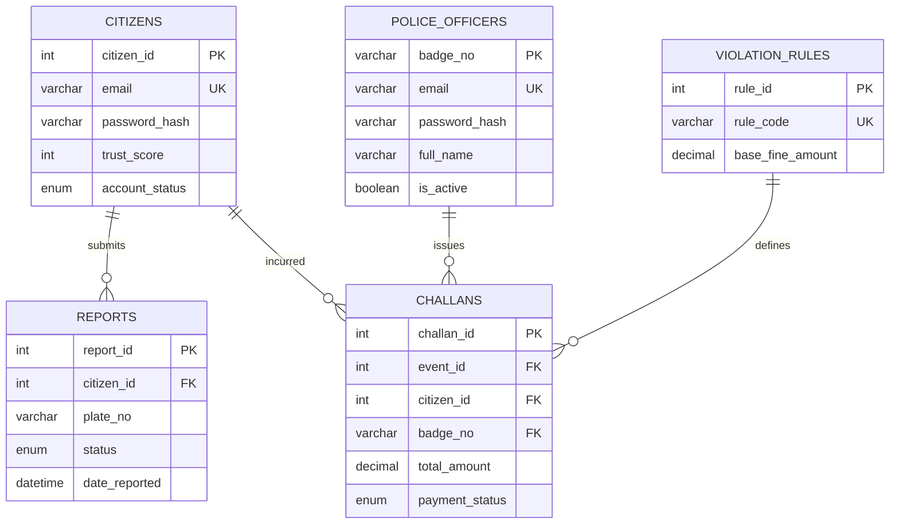
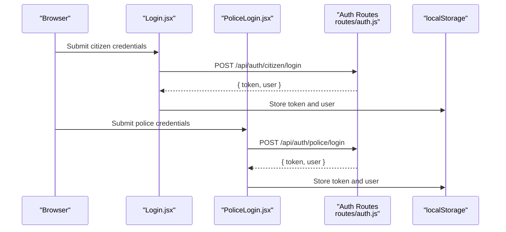
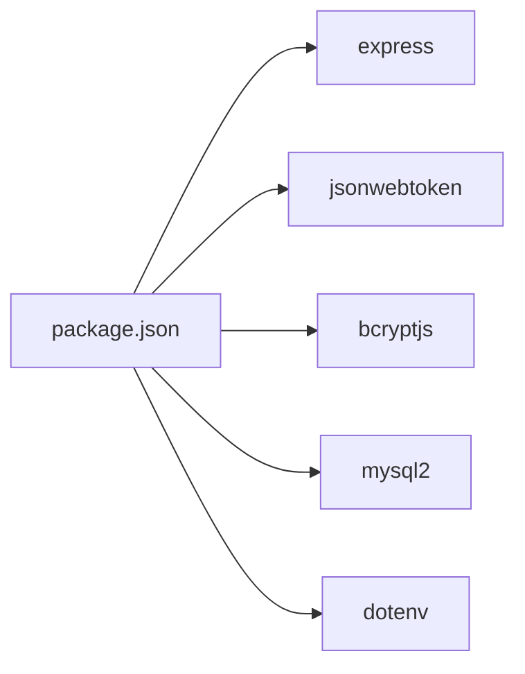

# Authentication Middleware and Security

<cite>
**Referenced Files in This Document**
- [auth.js](file://backend/middleware/auth.js)
- [auth.js](file://backend/routes/auth.js)
- [db.js](file://backend/db.js)
- [server.js](file://backend/server.js)
- [reports.js](file://backend/routes/reports.js)
- [police.js](file://backend/routes/police.js)
- [schema.sql](file://db/schema.sql)
- [seed_demo_accounts.sql](file://db/seed_demo_accounts.sql)
- [stored_procedure_process_report.sql](file://db/stored_procedure_process_report.sql)
- [package.json](file://backend/package.json)
- [Login.jsx](file://frontend/src/pages/Login.jsx)
- [PoliceLogin.jsx](file://frontend/src/pages/PoliceLogin.jsx)
- [App.jsx](file://frontend/src/App.jsx)
</cite>

## Table of Contents
1. [Introduction](#introduction)
2. [Project Structure](#project-structure)
3. [Core Components](#core-components)
4. [Architecture Overview](#architecture-overview)
5. [Detailed Component Analysis](#detailed-component-analysis)
6. [Dependency Analysis](#dependency-analysis)
7. [Performance Considerations](#performance-considerations)
8. [Troubleshooting Guide](#troubleshooting-guide)
9. [Conclusion](#conclusion)
10. [Appendices](#appendices)

## Introduction
This document provides a comprehensive guide to the authentication middleware and security implementation in the Traffic Violation Management System. It explains JWT token validation, session management, and role-based access control (RBAC) for citizens and police officers. It documents the middleware function implementation, token extraction and verification processes, error handling strategies, and secure token generation. It also covers authentication flows for both user roles, password hashing, protected route implementation, middleware chaining, and integration with the database. Finally, it addresses common security vulnerabilities, mitigation strategies, and compliance considerations.

## Project Structure
The authentication system spans three layers:
- Backend middleware and routes: Express-based JWT middleware and authentication endpoints
- Database schema and stored procedures: RBAC-enforcing tables and ACID-compliant transactions
- Frontend login pages: Role-specific login flows and local storage token persistence

**Diagram sources**
- [server.js:1-42](file://backend/server.js#L1-L42)
- [auth.js:1-117](file://backend/routes/auth.js#L1-L117)
- [auth.js:1-37](file://backend/middleware/auth.js#L1-L37)
- [db.js:1-26](file://backend/db.js#L1-L26)
- [schema.sql:1-942](file://db/schema.sql#L1-L942)
- [stored_procedure_process_report.sql:1-115](file://db/stored_procedure_process_report.sql#L1-L115)
- [Login.jsx:1-186](file://frontend/src/pages/Login.jsx#L1-L186)
- [PoliceLogin.jsx:1-186](file://frontend/src/pages/PoliceLogin.jsx#L1-L186)
- [App.jsx:27-76](file://frontend/src/App.jsx#L27-L76)

**Section sources**
- [server.js:1-42](file://backend/server.js#L1-L42)
- [auth.js:1-117](file://backend/routes/auth.js#L1-L117)
- [auth.js:1-37](file://backend/middleware/auth.js#L1-L37)
- [db.js:1-26](file://backend/db.js#L1-L26)
- [schema.sql:1-942](file://db/schema.sql#L1-L942)
- [stored_procedure_process_report.sql:1-115](file://db/stored_procedure_process_report.sql#L1-L115)
- [Login.jsx:1-186](file://frontend/src/pages/Login.jsx#L1-L186)
- [PoliceLogin.jsx:1-186](file://frontend/src/pages/PoliceLogin.jsx#L1-L186)
- [App.jsx:27-76](file://frontend/src/App.jsx#L27-L76)

## Core Components
- JWT Middleware: Extracts Authorization header, validates JWT signature, and attaches user payload to request
- Role Guards: Require specific roles (citizen or police) for protected routes
- Auth Routes: Login endpoint for both roles, user info retrieval via token
- Protected Routes: Citizens can submit reports; police can verify/reject reports and issue challans
- Database Integration: User lookup, bcrypt password comparison, and RBAC tables
- Frontend Persistence: Stores tokens and user metadata in localStorage

Key implementation references:
- JWT middleware and guards: [auth.js:1-37](file://backend/middleware/auth.js#L1-L37)
- Auth routes (login/me): [auth.js:1-117](file://backend/routes/auth.js#L1-L117)
- Protected routes (citizen/police): [reports.js:1-54](file://backend/routes/reports.js#L1-L54), [police.js:1-109](file://backend/routes/police.js#L1-L109)
- Database pool and RBAC tables: [db.js:1-26](file://backend/db.js#L1-L26), [schema.sql:1-942](file://db/schema.sql#L1-L942)
- Frontend login and persistence: [Login.jsx:1-186](file://frontend/src/pages/Login.jsx#L1-L186), [PoliceLogin.jsx:1-186](file://frontend/src/pages/PoliceLogin.jsx#L1-L186), [App.jsx:27-76](file://frontend/src/App.jsx#L27-L76)

**Section sources**
- [auth.js:1-37](file://backend/middleware/auth.js#L1-L37)
- [auth.js:1-117](file://backend/routes/auth.js#L1-L117)
- [reports.js:1-54](file://backend/routes/reports.js#L1-L54)
- [police.js:1-109](file://backend/routes/police.js#L1-L109)
- [db.js:1-26](file://backend/db.js#L1-L26)
- [schema.sql:1-942](file://db/schema.sql#L1-L942)
- [Login.jsx:1-186](file://frontend/src/pages/Login.jsx#L1-L186)
- [PoliceLogin.jsx:1-186](file://frontend/src/pages/PoliceLogin.jsx#L1-L186)
- [App.jsx:27-76](file://frontend/src/App.jsx#L27-L76)

## Architecture Overview
The authentication architecture follows a layered approach:
- Frontend authenticates via role-specific login endpoints and stores tokens
- Backend verifies JWT in middleware and enforces role-based access
- Database enforces RBAC via distinct tables and stored procedures
- Protected routes chain middleware to ensure authenticated and authorized access

**Diagram sources**
- [auth.js:1-117](file://backend/routes/auth.js#L1-L117)
- [auth.js:1-37](file://backend/middleware/auth.js#L1-L37)
- [db.js:1-26](file://backend/db.js#L1-L26)
- [schema.sql:1-942](file://db/schema.sql#L1-L942)

## Detailed Component Analysis

### JWT Middleware and Guards
The middleware extracts the Authorization header, splits the Bearer token, validates the JWT signature against the configured secret, and attaches the decoded payload to the request. Role guards enforce access based on the role claim.

**Diagram sources**
- [auth.js:1-37](file://backend/middleware/auth.js#L1-L37)

Implementation highlights:
- Secret management: [auth.js:3](file://backend/middleware/auth.js#L3)
- Token extraction: [auth.js:6-7](file://backend/middleware/auth.js#L6-L7)
- Verification and error handling: [auth.js:13-19](file://backend/middleware/auth.js#L13-L19)
- Role guards: [auth.js:22-34](file://backend/middleware/auth.js#L22-L34)

**Section sources**
- [auth.js:1-37](file://backend/middleware/auth.js#L1-L37)

### Authentication Routes (Login and User Info)
The authentication routes support:
- Login for citizens and police with role validation and bcrypt password comparison
- Secure token issuance with expiration
- Retrieval of current user details using the token

**Diagram sources**
- [auth.js:1-117](file://backend/routes/auth.js#L1-L117)
- [db.js:1-26](file://backend/db.js#L1-L26)

Key implementation references:
- Login route and role routing: [auth.js:9-76](file://backend/routes/auth.js#L9-L76)
- User info route: [auth.js:78-114](file://backend/routes/auth.js#L78-L114)
- Password hashing and verification: [auth.js:44](file://backend/routes/auth.js#L44)
- Token signing with expiration: [auth.js:49-58](file://backend/routes/auth.js#L49-L58)

**Section sources**
- [auth.js:1-117](file://backend/routes/auth.js#L1-L117)
- [db.js:1-26](file://backend/db.js#L1-L26)

### Protected Routes and Middleware Chaining
Protected routes demonstrate middleware chaining to enforce authentication and role checks:
- Citizen-only endpoints: submit reports and fetch personal reports
- Police-only endpoints: fetch pending reports, verify/reject reports, and issue challans

**Diagram sources**
- [reports.js:1-54](file://backend/routes/reports.js#L1-L54)
- [auth.js:1-37](file://backend/middleware/auth.js#L1-L37)
- [db.js:1-26](file://backend/db.js#L1-L26)

Additional examples:
- Police verify/reject routes: [police.js:18-106](file://backend/routes/police.js#L18-L106)
- Middleware chaining pattern: [reports.js:8](file://backend/routes/reports.js#L8), [police.js:8](file://backend/routes/police.js#L8)

**Section sources**
- [reports.js:1-54](file://backend/routes/reports.js#L1-L54)
- [police.js:1-109](file://backend/routes/police.js#L1-L109)
- [auth.js:1-37](file://backend/middleware/auth.js#L1-L37)
- [db.js:1-26](file://backend/db.js#L1-L26)

### Database Integration and RBAC
The database enforces role-based access and data integrity:
- Separate tables for citizens and police with unique identifiers
- Stored procedures encapsulate ACID transactions for report processing and challan issuance
- Indexes and constraints support efficient lookups and referential integrity

**Diagram sources**
- [schema.sql:26-195](file://db/schema.sql#L26-L195)

Stored procedures and triggers:
- Report processing and challan issuance: [stored_procedure_process_report.sql:8-99](file://db/stored_procedure_process_report.sql#L8-L99)
- Trust score and account status triggers: [schema.sql:307-382](file://db/schema.sql#L307-L382)

**Section sources**
- [schema.sql:1-942](file://db/schema.sql#L1-L942)
- [stored_procedure_process_report.sql:1-115](file://db/stored_procedure_process_report.sql#L1-L115)

### Frontend Authentication and Token Persistence
Frontend login pages send credentials to role-specific endpoints and persist tokens and user metadata in localStorage. The application state manages login/logout lifecycle.

**Diagram sources**
- [Login.jsx:15-69](file://frontend/src/pages/Login.jsx#L15-L69)
- [PoliceLogin.jsx:15-68](file://frontend/src/pages/PoliceLogin.jsx#L15-L68)
- [auth.js:1-117](file://backend/routes/auth.js#L1-L117)

**Section sources**
- [Login.jsx:1-186](file://frontend/src/pages/Login.jsx#L1-L186)
- [PoliceLogin.jsx:1-186](file://frontend/src/pages/PoliceLogin.jsx#L1-L186)
- [App.jsx:27-76](file://frontend/src/App.jsx#L27-L76)

## Dependency Analysis
The backend depends on several libraries and modules:
- Express for routing and middleware
- jsonwebtoken for JWT signing/verification
- bcryptjs for password hashing and comparison
- mysql2 for database connectivity
- dotenv for environment configuration

**Diagram sources**
- [package.json:10-16](file://backend/package.json#L10-L16)

**Section sources**
- [package.json:1-22](file://backend/package.json#L1-L22)

## Performance Considerations
- Token expiration: Tokens expire after 8 hours, reducing long-lived credential exposure
- Database pooling: Connection pool reduces overhead and improves throughput
- Indexes: Strategic indexes on email, citizen_id, and badge_no improve lookup performance
- Stored procedures: Encapsulate complex operations and reduce network round trips

[No sources needed since this section provides general guidance]

## Troubleshooting Guide
Common issues and resolutions:
- Missing Authorization header: Ensure requests include Authorization: Bearer <token>
- Invalid or expired token: Regenerate token via login endpoint
- Role mismatch: Verify role claim matches route requirements
- Database connectivity: Confirm environment variables and pool configuration
- CORS errors: Ensure frontend and backend origins are properly configured

**Section sources**
- [auth.js:9-19](file://backend/middleware/auth.js#L9-L19)
- [auth.js:83-85](file://backend/routes/auth.js#L83-L85)
- [auth.js:111-113](file://backend/routes/auth.js#L111-L113)
- [db.js:15-23](file://backend/db.js#L15-L23)
- [server.js:14](file://backend/server.js#L14)

## Conclusion
The authentication middleware and security implementation provide a robust foundation for the Traffic Violation Management System. JWT-based authentication, middleware-driven RBAC, and database-enforced constraints collectively ensure secure access control. The frontend integrates seamlessly with the backend through standardized login flows and token persistence. Adhering to the recommended best practices and mitigations will further strengthen the system’s resilience against common security threats.

[No sources needed since this section summarizes without analyzing specific files]

## Appendices

### Security Best Practices
- Rotate JWT secrets regularly and manage them securely
- Enforce HTTPS in production to protect tokens in transit
- Implement rate limiting and input sanitization
- Use strong password policies and consider multi-factor authentication
- Monitor and log authentication attempts and failures
- Regularly review and update stored procedures and triggers

[No sources needed since this section provides general guidance]