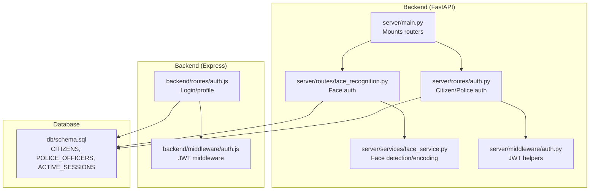
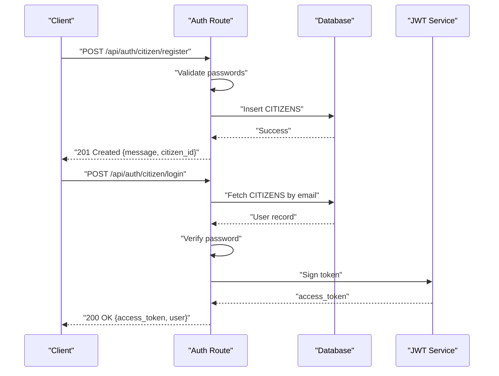
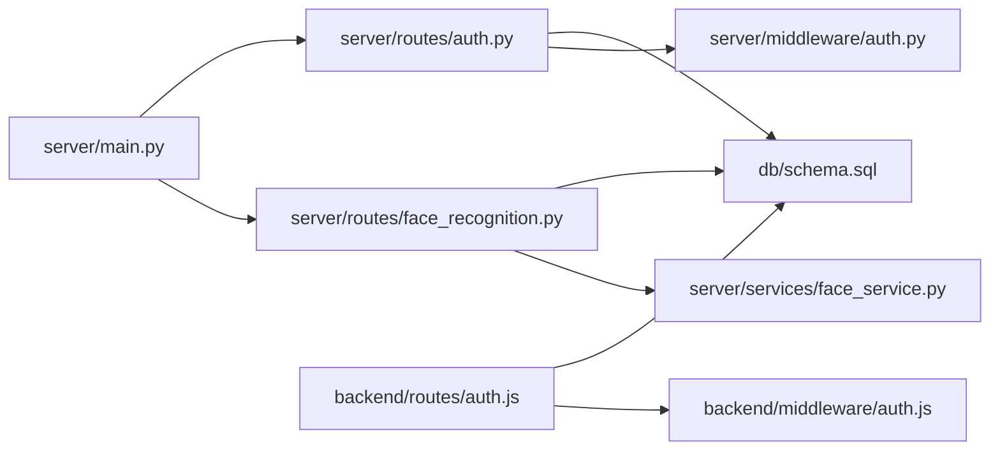

# Authentication Routes

<cite>
**Referenced Files in This Document**
- [auth.js](file://backend/routes/auth.js)
- [auth.js](file://backend/middleware/auth.js)
- [auth.py](file://server/routes/auth.py)
- [auth.py](file://server/middleware/auth.py)
- [face_recognition.py](file://server/routes/face_recognition.py)
- [face_service.py](file://server/services/face_service.py)
- [main.py](file://server/main.py)
- [schema.sql](file://db/schema.sql)
</cite>

## Table of Contents
1. [Introduction](#introduction)
2. [Project Structure](#project-structure)
3. [Core Components](#core-components)
4. [Architecture Overview](#architecture-overview)
5. [Detailed Component Analysis](#detailed-component-analysis)
6. [Dependency Analysis](#dependency-analysis)
7. [Performance Considerations](#performance-considerations)
8. [Troubleshooting Guide](#troubleshooting-guide)
9. [Conclusion](#conclusion)

## Introduction
This document provides API documentation for the authentication routes serving citizen and police users. It covers login, registration, and profile endpoints, including biometric face-based authentication. It documents HTTP methods, URL patterns, request/response schemas, authentication requirements, validation rules, error responses, and security considerations. It also explains JWT token issuance, expiration handling, and refresh token mechanisms, along with rate limiting and input sanitization practices.

## Project Structure
The authentication system spans two backend implementations:
- Node.js/Express implementation under backend/
- FastAPI implementation under server/

Key authentication-related files:
- backend/routes/auth.js: Express routes for login and profile retrieval
- backend/middleware/auth.js: JWT middleware for Express
- server/routes/auth.py: FastAPI routes for citizen and police registration/login/profile
- server/middleware/auth.py: JWT helpers for FastAPI
- server/routes/face_recognition.py: Face registration and login endpoints
- server/services/face_service.py: Face detection and encoding comparison
- server/main.py: Route mounting and CORS configuration
- db/schema.sql: Database schema including CITIZENS and POLICE_OFFICERS tables

**Diagram sources**
- [main.py:77-86](file://server/main.py#L77-L86)
- [auth.py:114-491](file://server/routes/auth.py#L114-L491)
- [face_recognition.py:28-231](file://server/routes/face_recognition.py#L28-L231)
- [face_service.py:15-177](file://server/services/face_service.py#L15-L177)
- [auth.js:9-114](file://backend/routes/auth.js#L9-L114)
- [auth.js:1-37](file://backend/middleware/auth.js#L1-L37)
- [schema.sql:26-82](file://db/schema.sql#L26-L82)

**Section sources**
- [main.py:77-86](file://server/main.py#L77-L86)
- [auth.js:1-117](file://backend/routes/auth.js#L1-L117)
- [auth.py:1-744](file://server/routes/auth.py#L1-L744)
- [face_recognition.py:1-282](file://server/routes/face_recognition.py#L1-L282)
- [face_service.py:1-177](file://server/services/face_service.py#L1-L177)
- [schema.sql:26-82](file://db/schema.sql#L26-L82)

## Core Components
- Authentication routes:
  - Citizen registration and login
  - Police registration and login
  - Profile retrieval and updates
  - Face-based registration and login
- JWT token issuance and validation
- Database-backed user storage and biometric face encodings
- CORS configuration for cross-origin requests

**Section sources**
- [auth.py:114-491](file://server/routes/auth.py#L114-L491)
- [face_recognition.py:28-231](file://server/routes/face_recognition.py#L28-L231)
- [auth.js:9-114](file://backend/routes/auth.js#L9-L114)
- [schema.sql:26-82](file://db/schema.sql#L26-L82)

## Architecture Overview
The authentication architecture integrates:
- Route handlers validating inputs and authenticating users
- Database queries for user lookup and updates
- JWT token generation and verification
- Optional biometric face recognition for citizen authentication

**Diagram sources**
- [auth.py:114-216](file://server/routes/auth.py#L114-L216)
- [auth.py:218-293](file://server/routes/auth.py#L218-L293)

## Detailed Component Analysis

### Authentication Endpoints

#### Citizen Registration
- Method: POST
- URL: /api/auth/citizen/register
- Request body schema:
  - full_name: string
  - email: string
  - phone_no: string (optional)
  - password: string
  - confirm_password: string (optional)
  - plate_no: string (vehicle number)
  - vehicle_type: string (Car, Motorcycle, etc.)
  - vehicle_model: string (optional)
- Validation rules:
  - Passwords must match if confirm_password is provided
  - Password length must be at least 6 characters
  - Email must be unique in CITIZENS
  - On success, inserts a new citizen and a linked vehicle record
- Successful response:
  - 201 Created with fields: message, citizen_id, full_name, email, role
- Error responses:
  - 400 Bad Request: Password mismatch or invalid length
  - 409 Conflict: Email already registered
  - 500 Internal Server Error: Database or hashing failure

**Section sources**
- [auth.py:114-216](file://server/routes/auth.py#L114-L216)

#### Citizen Login
- Method: POST
- URL: /api/auth/citizen/login
- Request body schema:
  - email: string
  - password: string
- Validation rules:
  - Email must exist in CITIZENS
  - Password must match stored hash
  - Account status must be Active
- Successful response:
  - 200 OK with fields: access_token, token_type, message, user (id, full_name, email, role, trust_score)
- Error responses:
  - 401 Unauthorized: Invalid credentials
  - 403 Forbidden: Account not Active
  - 500 Internal Server Error: Database or hashing failure

**Section sources**
- [auth.py:218-293](file://server/routes/auth.py#L218-L293)

#### Police Registration
- Method: POST
- URL: /api/auth/police/register
- Request body schema:
  - full_name: string
  - email: string
  - phone_no: string (optional)
  - password: string
  - confirm_password: string (optional)
- Validation rules:
  - Passwords must match if confirm_password is provided
  - Password length must be at least 6 characters
  - Email must be unique in POLICE_OFFICERS
  - Badge number is auto-generated (POLXXXX)
- Successful response:
  - 201 Created with fields: message, badge_no, full_name, email, role
- Error responses:
  - 400 Bad Request: Password mismatch or invalid length
  - 409 Conflict: Email already registered
  - 500 Internal Server Error: Database failure

**Section sources**
- [auth.py:310-396](file://server/routes/auth.py#L310-L396)

#### Police Login
- Method: POST
- URL: /api/auth/police/login
- Request body schema:
  - email: string
  - password: string
- Validation rules:
  - Email must exist in POLICE_OFFICERS
  - Password must match stored hash
  - Officer must be active (is_active)
- Successful response:
  - 200 OK with fields: access_token, token_type, message, user (id, full_name, email, role, badge_number, station, rank)
- Error responses:
  - 401 Unauthorized: Invalid credentials
  - 403 Forbidden: Officer deactivated
  - 500 Internal Server Error: Database or hashing failure

**Section sources**
- [auth.py:399-491](file://server/routes/auth.py#L399-L491)

#### Profile Retrieval
- Method: GET
- URL: /api/auth/profile
- Headers:
  - Authorization: Bearer <access_token>
- Validation rules:
  - Authorization header required and must start with "Bearer "
  - Token must decode successfully and contain sub and role
  - Role determines which table to query (CITIZENS vs POLICE_OFFICERS)
- Successful response:
  - 200 OK with user profile fields depending on role
- Error responses:
  - 401 Unauthorized: Missing/invalid/expired token
  - 404 Not Found: User not found in database
  - 500 Internal Server Error: Database or token decode failure

**Section sources**
- [auth.py:493-600](file://server/routes/auth.py#L493-L600)

#### Profile Update
- Method: PUT
- URL: /api/auth/profile
- Headers:
  - Authorization: Bearer <access_token>
- Request body (dynamic fields):
  - For citizens: full_name, phone_no, reward_points
  - For police: full_name, phone_no
- Validation rules:
  - Authorization header required and must start with "Bearer "
  - Token must decode successfully and contain sub and role
  - At least one valid field must be provided
- Successful response:
  - 200 OK with fields: message, profile (updated fields)
- Error responses:
  - 400 Bad Request: No valid fields to update
  - 401 Unauthorized: Missing/invalid/expired token
  - 404 Not Found: User not found in database
  - 500 Internal Server Error: Database failure

**Section sources**
- [auth.py:602-744](file://server/routes/auth.py#L602-L744)

#### Logout
- Method: GET/POST/DELETE (conceptual)
- URL: /api/auth/logout
- Notes:
  - The provided authentication routes do not expose an explicit logout endpoint.
  - Tokens are short-lived (24 hours in FastAPI implementation).
  - Consider client-side token removal and database-based session invalidation for production.

[No sources needed since this section describes a missing endpoint conceptually]

### Biometric Authentication Integration

#### Face Registration
- Method: POST
- URL: /api/auth/register_face
- Form fields:
  - citizen_id: integer
  - image: file (image bytes)
- Validation rules:
  - Face detection model must be loaded
  - Image must be valid and contain a detectable face
  - Encoded 128-d vector is serialized and stored in CITIZENS.face_encoding
- Successful response:
  - 200 OK with fields: message, citizen_id, citizen_name
- Error responses:
  - 400 Bad Request: No face detected or invalid image
  - 404 Not Found: Citizen not found
  - 500 Internal Server Error: Model not loaded or encoding extraction failure

**Section sources**
- [face_recognition.py:28-107](file://server/routes/face_recognition.py#L28-L107)

#### Face Login
- Method: POST
- URL: /api/auth/login_face
- Form fields:
  - image: file (image bytes)
- Validation rules:
  - Face detection model must be loaded
  - Image must be valid and contain a detectable face
  - Live encoding compared against stored encodings with tolerance
  - Only Active citizens with stored encodings are considered
- Successful response:
  - 200 OK with fields: message, token, user (id, name, email, role, trust_score), confidence
- Error responses:
  - 400 Bad Request: No face detected or invalid image
  - 401 Unauthorized: No match within tolerance
  - 404 Not Found: No registered faces found
  - 500 Internal Server Error: Model not loaded or comparison failure

**Section sources**
- [face_recognition.py:110-231](file://server/routes/face_recognition.py#L110-L231)

#### Face Detection Endpoint (Testing)
- Method: POST
- URL: /api/auth/detect_face
- Form fields:
  - image: file (image bytes)
- Successful response:
  - 200 OK with fields: face_detected, bounding_box (optional), message
- Error responses:
  - 400 Bad Request: Invalid image
  - 500 Internal Server Error: Model not loaded or detection failure

**Section sources**
- [face_recognition.py:234-281](file://server/routes/face_recognition.py#L234-L281)

### JWT Token Issuance and Expiration
- Token signing:
  - HS256 algorithm with a secret key
  - Payload includes sub (user identifier), role, email, name
- Expiration:
  - FastAPI implementation: 24 hours
  - Express implementation: 8 hours
- Token usage:
  - Authorization header: Bearer <token>
  - Profile endpoints require a valid, non-expired token

**Section sources**
- [auth.py:100-112](file://server/routes/auth.py#L100-L112)
- [auth.py:57-61](file://server/middleware/auth.py#L57-L61)
- [auth.js:49-58](file://backend/routes/auth.js#L49-L58)
- [auth.js:1-37](file://backend/middleware/auth.js#L1-L37)

### Refresh Token Mechanisms
- Current implementation:
  - No explicit refresh token endpoint is exposed.
  - Tokens expire after their configured TTL.
- Recommendations:
  - Implement a dedicated refresh endpoint that accepts a refresh token and issues a new access token.
  - Store refresh tokens in a secure, short-lived store with revocation capabilities.

[No sources needed since this section provides recommendations]

## Dependency Analysis
Authentication components depend on:
- Database schema for user storage and biometric encodings
- JWT libraries for token signing and verification
- Optional face detection models for biometric authentication

**Diagram sources**
- [auth.py:114-491](file://server/routes/auth.py#L114-L491)
- [face_recognition.py:28-231](file://server/routes/face_recognition.py#L28-L231)
- [face_service.py:15-177](file://server/services/face_service.py#L15-L177)
- [auth.js:9-114](file://backend/routes/auth.js#L9-L114)
- [auth.js:1-37](file://backend/middleware/auth.js#L1-L37)
- [auth.py:57-61](file://server/middleware/auth.py#L57-L61)
- [main.py:77-86](file://server/main.py#L77-L86)
- [schema.sql:26-82](file://db/schema.sql#L26-L82)

**Section sources**
- [auth.py:114-491](file://server/routes/auth.py#L114-L491)
- [face_recognition.py:28-231](file://server/routes/face_recognition.py#L28-L231)
- [face_service.py:15-177](file://server/services/face_service.py#L15-L177)
- [auth.js:9-114](file://backend/routes/auth.js#L9-L114)
- [auth.js:1-37](file://backend/middleware/auth.js#L1-L37)
- [auth.py:57-61](file://server/middleware/auth.py#L57-L61)
- [main.py:77-86](file://server/main.py#L77-L86)
- [schema.sql:26-82](file://db/schema.sql#L26-L82)

## Performance Considerations
- Password hashing:
  - bcrypt is used in both implementations; ensure hashing runs asynchronously to avoid blocking.
- Database connections:
  - Use connection pools to reduce overhead and improve throughput.
- Token lifetime:
  - Shorter lifetimes reduce risk but increase re-authentication frequency.
- Face recognition:
  - Model loading and encoding comparisons are CPU-intensive; consider caching and limiting concurrent requests.

[No sources needed since this section provides general guidance]

## Troubleshooting Guide
Common issues and resolutions:
- Invalid credentials:
  - Ensure email exists and password matches stored hash.
  - For biometric login, verify face detection models are loaded and image quality is sufficient.
- Token errors:
  - Confirm Authorization header format: Bearer <token>.
  - Check token expiration and regenerate if needed.
- Database errors:
  - Verify database connectivity and table schemas.
  - Ensure unique constraints (email) are respected.

**Section sources**
- [auth.py:218-293](file://server/routes/auth.py#L218-L293)
- [auth.py:399-491](file://server/routes/auth.py#L399-L491)
- [face_recognition.py:110-231](file://server/routes/face_recognition.py#L110-L231)
- [auth.js:78-114](file://backend/routes/auth.js#L78-L114)

## Conclusion
The authentication system provides robust endpoints for citizen and police users, including traditional email/password login and optional biometric face-based authentication. JWT tokens are issued with configurable expiration and validated centrally. While the current implementation lacks explicit logout and refresh endpoints, the foundation is solid for extending security controls such as rate limiting, refresh token management, and enhanced input sanitization.