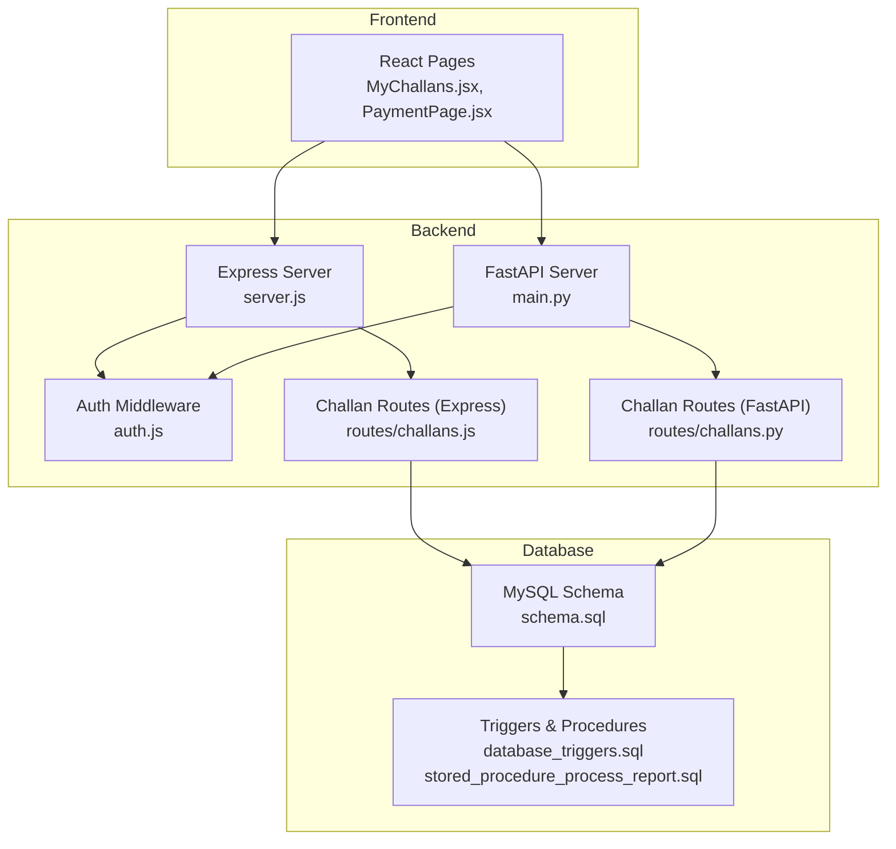
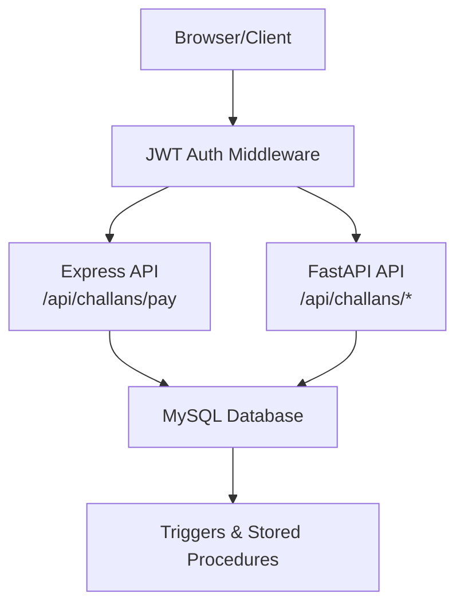
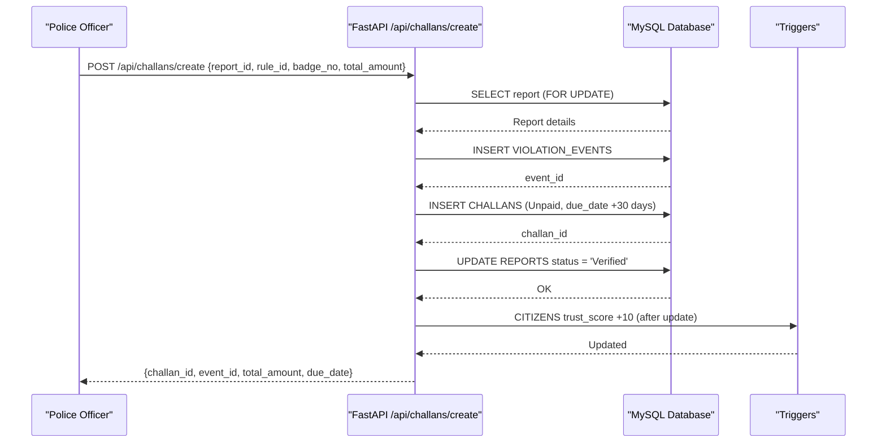
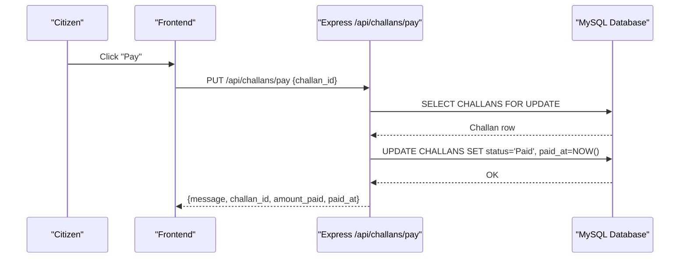
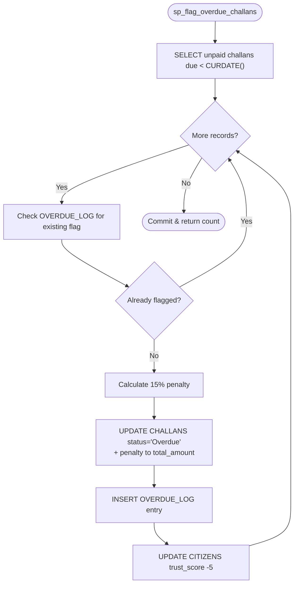
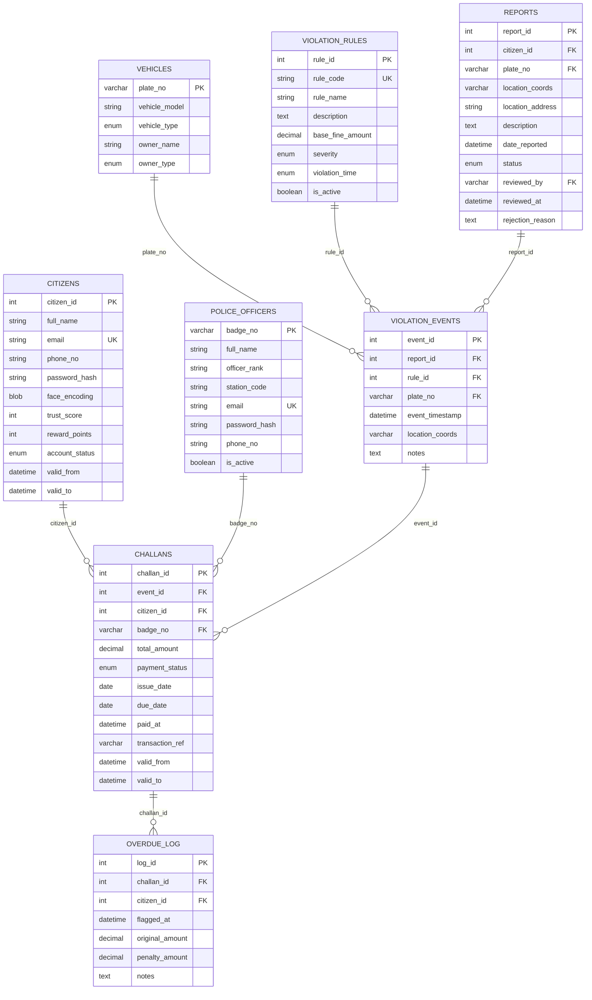
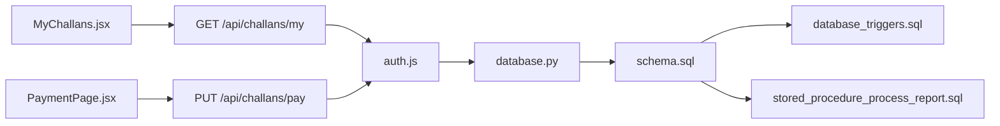

# Challan Management System

<cite>
**Referenced Files in This Document**
- [backend/server.js](file://backend/server.js)
- [backend/middleware/auth.js](file://backend/middleware/auth.js)
- [backend/routes/challans.js](file://backend/routes/challans.js)
- [server/main.py](file://server/main.py)
- [server/routes/challans.py](file://server/routes/challans.py)
- [server/database.py](file://server/database.py)
- [server/config.py](file://server/config.py)
- [db/schema.sql](file://db/schema.sql)
- [db/stored_procedure_process_report.sql](file://db/stored_procedure_process_report.sql)
- [db/stored_procedure_sp_flag_overdue_challans.sql](file://db/stored_procedure_sp_flag_overdue_challans.sql)
- [db/database_triggers.sql](file://db/database_triggers.sql)
- [frontend/src/pages/MyChallans.jsx](file://frontend/src/pages/MyChallans.jsx)
- [frontend/src/pages/PaymentPage.jsx](file://frontend/src/pages/PaymentPage.jsx)
- [frontend/src/components/PaymentModal.jsx](file://frontend/src/components/PaymentModal.jsx)
- [db/seed_demo_accounts.sql](file://db/seed_demo_accounts.sql)
</cite>

## Table of Contents
1. [Introduction](#introduction)
2. [Project Structure](#project-structure)
3. [Core Components](#core-components)
4. [Architecture Overview](#architecture-overview)
5. [Detailed Component Analysis](#detailed-component-analysis)
6. [Dependency Analysis](#dependency-analysis)
7. [Performance Considerations](#performance-considerations)
8. [Troubleshooting Guide](#troubleshooting-guide)
9. [Conclusion](#conclusion)
10. [Appendices](#appendices)

## Introduction
This document describes the Challan Management System for traffic violation processing. It covers the end-to-end workflow for challan creation, payment processing, and status tracking. It also documents the API endpoints, database schema, payment integration patterns, overdue penalty calculations, transaction management, and integration points with the payment gateway and financial reporting systems. The system supports both automatic and manual processing modes, with robust concurrency controls and audit trails.

## Project Structure
The system comprises:
- Backend API servers (Express.js and FastAPI) exposing REST endpoints for challan operations
- Frontend React application for citizen and police portals
- MySQL database with normalized schema, triggers, stored procedures, and views
- Authentication middleware enforcing role-based access

**Diagram sources**
- [backend/server.js:1-42](file://backend/server.js#L1-L42)
- [server/main.py:1-107](file://server/main.py#L1-L107)
- [backend/middleware/auth.js:1-37](file://backend/middleware/auth.js#L1-L37)
- [backend/routes/challans.js:1-101](file://backend/routes/challans.js#L1-L101)
- [server/routes/challans.py:1-450](file://server/routes/challans.py#L1-L450)
- [db/schema.sql:1-942](file://db/schema.sql#L1-L942)
- [db/database_triggers.sql:1-48](file://db/database_triggers.sql#L1-L48)
- [db/stored_procedure_process_report.sql:1-115](file://db/stored_procedure_process_report.sql#L1-L115)

**Section sources**
- [backend/server.js:1-42](file://backend/server.js#L1-L42)
- [server/main.py:1-107](file://server/main.py#L1-L107)
- [db/schema.sql:1-942](file://db/schema.sql#L1-L942)

## Core Components
- Authentication and Authorization: JWT verification and role checks for citizen and police
- Challan Creation Pipeline: Report verification → Violation Event → Challan issuance → Report status update
- Payment Processing: Manual payment flow with row-level locking to prevent race conditions
- Overdue Penalty System: Automated cursor-based procedure to flag overdue challans and apply penalties
- Audit and History: Triggers maintain temporal histories for citizens and challans
- Frontend Integration: Real-time polling for challan status and payment modal flow

**Section sources**
- [backend/middleware/auth.js:1-37](file://backend/middleware/auth.js#L1-L37)
- [db/stored_procedure_process_report.sql:1-115](file://db/stored_procedure_process_report.sql#L1-L115)
- [db/stored_procedure_sp_flag_overdue_challans.sql:694-754](file://db/stored_procedure_sp_flag_overdue_challans.sql#L694-L754)
- [db/database_triggers.sql:1-48](file://db/database_triggers.sql#L1-L48)
- [frontend/src/pages/MyChallans.jsx:1-207](file://frontend/src/pages/MyChallans.jsx#L1-L207)
- [frontend/src/pages/PaymentPage.jsx:1-529](file://frontend/src/pages/PaymentPage.jsx#L1-L529)

## Architecture Overview
The system uses a dual-server architecture:
- Express.js server for legacy-style endpoints and middleware
- FastAPI server for production-grade routing and database operations

Both servers connect to the same MySQL database with shared schema and stored procedures. Authentication middleware enforces role-based access across endpoints.

**Diagram sources**
- [backend/server.js:1-42](file://backend/server.js#L1-L42)
- [server/main.py:1-107](file://server/main.py#L1-L107)
- [backend/middleware/auth.js:1-37](file://backend/middleware/auth.js#L1-L37)
- [db/schema.sql:1-942](file://db/schema.sql#L1-L942)
- [db/stored_procedure_process_report.sql:1-115](file://db/stored_procedure_process_report.sql#L1-L115)

## Detailed Component Analysis

### Challan Creation Workflow
The creation workflow is implemented in two complementary ways:
- Stored Procedure: ACID-compliant transaction with row-level locks and automatic trust score adjustments
- FastAPI Route: Programmatic flow mirroring the stored procedure logic

**Diagram sources**
- [server/routes/challans.py:47-139](file://server/routes/challans.py#L47-L139)
- [db/stored_procedure_process_report.sql:30-87](file://db/stored_procedure_process_report.sql#L30-L87)
- [db/database_triggers.sql:8-35](file://db/database_triggers.sql#L8-L35)

Key behaviors:
- Report validation and row-level locking during creation
- Automatic creation of violation event and challan
- Report status transitions to Verified
- Trust score reward via triggers

**Section sources**
- [server/routes/challans.py:47-139](file://server/routes/challans.py#L47-L139)
- [db/stored_procedure_process_report.sql:30-87](file://db/stored_procedure_process_report.sql#L30-L87)
- [db/database_triggers.sql:8-35](file://db/database_triggers.sql#L8-L35)

### Payment Processing Flow
Two payment flows exist:
- Express route: Manual PUT to mark payment status
- FastAPI route: Manual PUT to mark payment status

Both use row-level locking to prevent race conditions and ensure atomicity.

**Diagram sources**
- [backend/routes/challans.js:31-98](file://backend/routes/challans.js#L31-L98)
- [frontend/src/pages/PaymentPage.jsx:46-80](file://frontend/src/pages/PaymentPage.jsx#L46-L80)

Additional payment flow via FastAPI:
- Endpoint: PUT /api/challans/pay/{challan_id}
- Behavior: Row-level lock, ownership check, status update, transaction reference generation

**Section sources**
- [backend/routes/challans.js:31-98](file://backend/routes/challans.js#L31-L98)
- [server/routes/challans.py:336-398](file://server/routes/challans.py#L336-L398)
- [frontend/src/pages/PaymentPage.jsx:46-80](file://frontend/src/pages/PaymentPage.jsx#L46-L80)

### Overdue Penalty Calculations
A cursor-based stored procedure iterates unpaid challans past due date, applies a 15% penalty, logs entries in the overdue ledger, and reduces citizen trust scores.

**Diagram sources**
- [db/stored_procedure_sp_flag_overdue_challans.sql:694-754](file://db/stored_procedure_sp_flag_overdue_challans.sql#L694-L754)

**Section sources**
- [db/stored_procedure_sp_flag_overdue_challans.sql:694-754](file://db/stored_procedure_sp_flag_overdue_challans.sql#L694-L754)

### Database Schema and Relationships
The schema defines core entities and their relationships, with temporal history tables and audit trails.

**Diagram sources**
- [db/schema.sql:26-235](file://db/schema.sql#L26-L235)

**Section sources**
- [db/schema.sql:26-235](file://db/schema.sql#L26-L235)

### API Endpoints for Challan Retrieval, Payment, and Status Updates
- GET /api/challans/my: Retrieve logged-in citizen's challans with joined details
- POST /api/challans/pay: Pay a challan with row-level locking (Express)
- PUT /api/challans/pay/{challan_id}: Pay a challan with row-level locking (FastAPI)
- DELETE /api/challans/{challan_id}: Delete a challan (Police only)
- GET /api/challans/citizen/{citizen_id}: Fetch all challans for a citizen (FastAPI)
- GET /api/challans/report/{report_id}: Fetch report details for challan creation (FastAPI)

Response examples:
- Challan retrieval returns an array of challans with fields such as challan_id, total_amount, payment_status, issue_date, due_date, paid_at, transaction_ref, rule_name, rule_code, plate_no, event_timestamp, location_address, and violation_description.
- Payment response includes message, challan_id, amount_paid, and paid_at.

**Section sources**
- [backend/routes/challans.js:7-29](file://backend/routes/challans.js#L7-L29)
- [backend/routes/challans.js:31-98](file://backend/routes/challans.js#L31-L98)
- [server/routes/challans.py:141-275](file://server/routes/challans.py#L141-L275)
- [server/routes/challans.py:336-398](file://server/routes/challans.py#L336-L398)
- [server/routes/challans.py:400-450](file://server/routes/challans.py#L400-L450)

### Transaction Management and Concurrency Control
- Row-level locking: SELECT ... FOR UPDATE ensures exclusive access during payment processing
- ACID transactions: Stored procedures wrap operations in START TRANSACTION / COMMIT with rollback on exceptions
- Audit trails: Triggers capture historical changes to citizens and challans

**Section sources**
- [backend/routes/challans.js:44-78](file://backend/routes/challans.js#L44-L78)
- [server/routes/challans.py:336-373](file://server/routes/challans.py#L336-L373)
- [db/stored_procedure_process_report.sql:23-28](file://db/stored_procedure_process_report.sql#L23-L28)
- [db/stored_procedure_process_report.sql:30-87](file://db/stored_procedure_process_report.sql#L30-L87)
- [db/database_triggers.sql:311-429](file://db/database_triggers.sql#L311-L429)

### Receipt Generation
- Payment success page displays challan invoice with violation details, dates, and total amount
- Transaction reference is generated and stored upon payment completion
- Receipt visuals include official header, payment confirmation, and system-generated metadata

**Section sources**
- [frontend/src/pages/PaymentPage.jsx:151-174](file://frontend/src/pages/PaymentPage.jsx#L151-L174)
- [server/routes/challans.py:366-373](file://server/routes/challans.py#L366-L373)

### Integration with Payment Gateway and Financial Reporting
- Current implementation simulates payment processing in the frontend and performs a backend PUT to mark status as Paid
- Future scope includes real payment gateway integration with automatic reconciliation and financial reporting exports
- Transaction references and timestamps are captured for audit and reporting

**Section sources**
- [frontend/src/pages/PaymentPage.jsx:46-80](file://frontend/src/pages/PaymentPage.jsx#L46-L80)
- [server/routes/challans.py:366-373](file://server/routes/challans.py#L366-L373)

### Challan Modification Policies, Cancellation, and Appeal Processes
- Modification: Not explicitly implemented in current routes; modifications would require additional endpoints and validation
- Cancellation: Not present in current endpoints; deletion is available for police-only via DELETE /api/challans/{challan_id}
- Appeal: Not present in current endpoints; would require new routes for filing and tracking appeals

**Section sources**
- [server/routes/challans.py:400-450](file://server/routes/challans.py#L400-L450)

## Dependency Analysis
The system exhibits layered dependencies:
- Frontend depends on backend APIs for challan retrieval and payment
- Backend depends on authentication middleware and database connectivity
- Database depends on triggers and stored procedures for automation

**Diagram sources**
- [frontend/src/pages/MyChallans.jsx:23-36](file://frontend/src/pages/MyChallans.jsx#L23-L36)
- [frontend/src/pages/PaymentPage.jsx:46-80](file://frontend/src/pages/PaymentPage.jsx#L46-L80)
- [backend/middleware/auth.js:1-37](file://backend/middleware/auth.js#L1-L37)
- [server/database.py:14-76](file://server/database.py#L14-L76)
- [db/schema.sql:1-942](file://db/schema.sql#L1-L942)
- [db/database_triggers.sql:1-48](file://db/database_triggers.sql#L1-L48)
- [db/stored_procedure_process_report.sql:1-115](file://db/stored_procedure_process_report.sql#L1-L115)

**Section sources**
- [frontend/src/pages/MyChallans.jsx:23-36](file://frontend/src/pages/MyChallans.jsx#L23-L36)
- [frontend/src/pages/PaymentPage.jsx:46-80](file://frontend/src/pages/PaymentPage.jsx#L46-L80)
- [backend/middleware/auth.js:1-37](file://backend/middleware/auth.js#L1-L37)
- [server/database.py:14-76](file://server/database.py#L14-L76)
- [db/schema.sql:1-942](file://db/schema.sql#L1-L942)

## Performance Considerations
- Connection pooling: MySQL connection pool initialized at startup for efficient resource usage
- Indexes: Strategic indexing on foreign keys and frequently queried columns (status, dates)
- Triggers: Lightweight updates to maintain audit trails and trust scores
- Frontend polling: Real-time refresh intervals balance responsiveness and server load

Recommendations:
- Tune pool size and timeouts based on workload
- Add database event scheduling for overdue processing
- Consider pagination for large challan lists

**Section sources**
- [server/database.py:14-50](file://server/database.py#L14-L50)
- [db/schema.sql:191-194](file://db/schema.sql#L191-L194)
- [frontend/src/pages/MyChallans.jsx:17-21](file://frontend/src/pages/MyChallans.jsx#L17-L21)

## Troubleshooting Guide
Common issues and resolutions:
- Authentication failures: Verify JWT token presence and validity
- Authorization errors: Ensure user role matches required access (citizen/policeman)
- Challan not found: Confirm challan_id exists and belongs to the requesting user
- Double payment attempts: Row-level locking prevents concurrent updates
- Payment failures: Check transaction rollback and error logs

**Section sources**
- [backend/middleware/auth.js:5-27](file://backend/middleware/auth.js#L5-L27)
- [backend/routes/challans.js:53-72](file://backend/routes/challans.js#L53-L72)
- [server/routes/challans.py:346-364](file://server/routes/challans.py#L346-L364)

## Conclusion
The Challan Management System provides a robust foundation for traffic violation processing with strong transactional guarantees, auditability, and scalability. The dual-server architecture enables modernization while maintaining compatibility. Future enhancements should focus on real payment gateway integration, appeal workflows, and automated overdue processing via scheduled events.

## Appendices

### Example Data Structures
- Challan object returned by retrieval endpoints includes identifiers, amounts, dates, status, and descriptive fields
- Payment response includes confirmation metadata and timestamps

**Section sources**
- [server/routes/challans.py:152-193](file://server/routes/challans.py#L152-L193)
- [server/routes/challans.py:366-382](file://server/routes/challans.py#L366-L382)

### Database Initialization and Seed Accounts
- Database bootstrap script creates tables and seeds demo accounts for testing
- Demo credentials are included for development and testing

**Section sources**
- [db/seed_demo_accounts.sql:13-107](file://db/seed_demo_accounts.sql#L13-L107)