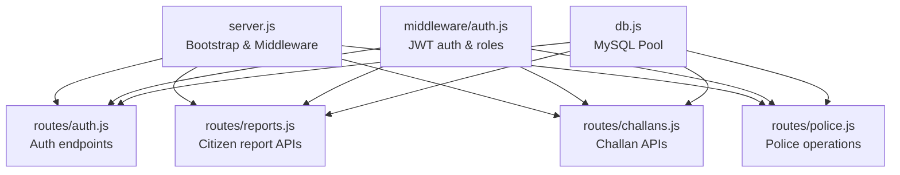
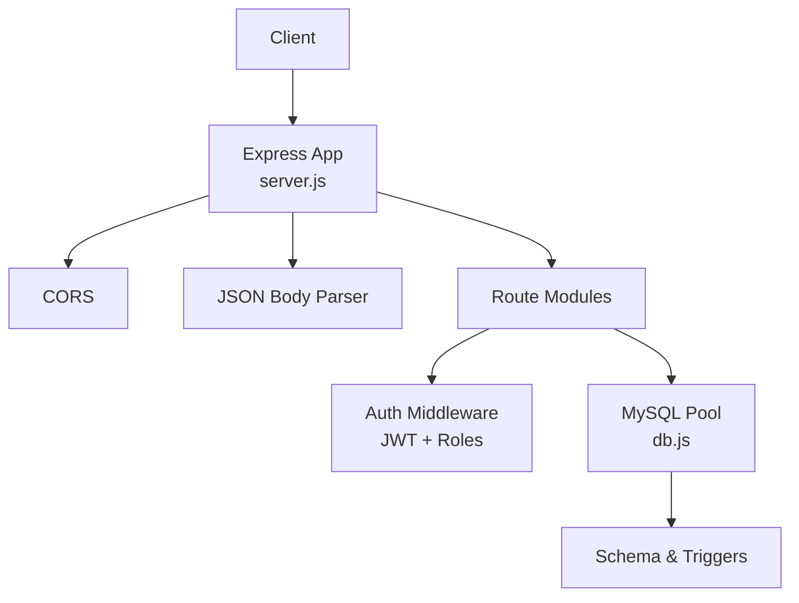
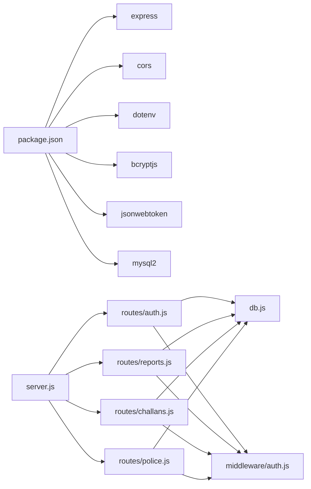

# Express.js Backend (Citizen Services)

<cite>
**Referenced Files in This Document**
- [server.js](file://backend/server.js)
- [package.json](file://backend/package.json)
- [db.js](file://backend/db.js)
- [auth.js](file://backend/middleware/auth.js)
- [auth.js](file://backend/routes/auth.js)
- [reports.js](file://backend/routes/reports.js)
- [challans.js](file://backend/routes/challans.js)
- [police.js](file://backend/routes/police.js)
- [schema.sql](file://db/schema.sql)
- [stored_procedure_process_report.sql](file://db/stored_procedure_process_report.sql)
</cite>

## Table of Contents
1. [Introduction](#introduction)
2. [Project Structure](#project-structure)
3. [Core Components](#core-components)
4. [Architecture Overview](#architecture-overview)
5. [Detailed Component Analysis](#detailed-component-analysis)
6. [Dependency Analysis](#dependency-analysis)
7. [Performance Considerations](#performance-considerations)
8. [Troubleshooting Guide](#troubleshooting-guide)
9. [Conclusion](#conclusion)
10. [Appendices](#appendices)

## Introduction
This document explains the Express.js backend for a citizen-facing traffic violation management system. It covers server initialization, middleware stack, database connection management, authentication and authorization, route structure, request/response patterns, error handling, database abstraction and transactions, and operational guidance. It also highlights deprecation status, migration considerations, and maintenance implications derived from the repository.

## Project Structure
The backend is organized around a small set of modules:
- Server bootstrap and middleware registration
- Route modules for authentication, reports, challans, and police operations
- Shared middleware for authentication and authorization
- Database connection pool and environment configuration
- Database schema, triggers, stored procedures, and seed data

**Diagram sources**
- [server.js:1-42](file://backend/server.js#L1-L42)
- [auth.js:1-37](file://backend/middleware/auth.js#L1-L37)
- [auth.js:1-117](file://backend/routes/auth.js#L1-L117)
- [reports.js:1-54](file://backend/routes/reports.js#L1-L54)
- [challans.js:1-101](file://backend/routes/challans.js#L1-L101)
- [police.js:1-109](file://backend/routes/police.js#L1-L109)
- [db.js:1-26](file://backend/db.js#L1-L26)

**Section sources**
- [server.js:1-42](file://backend/server.js#L1-L42)
- [package.json:1-22](file://backend/package.json#L1-L22)

## Core Components
- Server initialization and middleware stack
  - Registers CORS and JSON body parsing
  - Exposes health check endpoint
  - Mounts route modules under /api/*
  - Global 404 and error handlers
- Authentication middleware
  - JWT verification and role gating (citizen/police)
- Database abstraction
  - MySQL connection pool with connection limits and keep-alive
- Route modules
  - Authentication endpoints (login, profile)
  - Citizen report submission and retrieval
  - Challan listing and payment with row-level locking
  - Police dashboard and report verification/rejection

**Section sources**
- [server.js:13-37](file://backend/server.js#L13-L37)
- [auth.js:1-37](file://backend/middleware/auth.js#L1-L37)
- [db.js:1-26](file://backend/db.js#L1-L26)
- [auth.js:1-117](file://backend/routes/auth.js#L1-L117)
- [reports.js:1-54](file://backend/routes/reports.js#L1-L54)
- [challans.js:1-101](file://backend/routes/challans.js#L1-L101)
- [police.js:1-109](file://backend/routes/police.js#L1-L109)

## Architecture Overview
The backend follows a layered Express architecture:
- Entry point initializes Express, loads environment, registers middleware, mounts routes, and starts the server
- Routes delegate to shared middleware for authentication and role checks
- Database queries are executed via a pooled client; sensitive operations use explicit transactions and row-level locks

**Diagram sources**
- [server.js:10-26](file://backend/server.js#L10-L26)
- [auth.js:1-37](file://backend/middleware/auth.js#L1-L37)
- [db.js:1-26](file://backend/db.js#L1-L26)
- [schema.sql:1-120](file://db/schema.sql#L1-L120)

## Detailed Component Analysis

### Server Initialization and Middleware Stack
- Initializes Express, loads environment variables, and registers:
  - CORS for cross-origin requests
  - JSON body parser for request payloads
- Defines:
  - Health check endpoint at /api/health
  - Route mounts for /api/auth, /api/reports, /api/police, /api/challans
  - 404 handler for unknown endpoints
  - Global error handler logging and returning generic 500 responses

Operational notes:
- Environment variables are loaded via dotenv; ensure .env is present in production deployments
- CORS is enabled globally; consider scoping origins in production

**Section sources**
- [server.js:1-42](file://backend/server.js#L1-L42)
- [package.json:1-22](file://backend/package.json#L1-L22)

### Database Connection Management
- Creates a MySQL promise pool with:
  - Host, user, password, database from environment
  - Connection limit and queue behavior configured
  - Keep-alive enabled to maintain connections
- Tests connectivity on startup and logs success/failure

Operational notes:
- Use environment variables for DB credentials
- Monitor pool usage and adjust limits based on workload
- Ensure MySQL service availability and network access

**Section sources**
- [db.js:1-26](file://backend/db.js#L1-L26)

### Authentication Middleware and JWT
- JWT secret is loaded from environment with a fallback value
- Provides:
  - Token verification middleware
  - Role-based guards for citizen and police
- Authentication endpoints:
  - POST /api/auth/login validates role and credentials, compares hashed passwords, and issues signed JWT with 8-hour expiry
  - GET /api/auth/me verifies token and returns user profile based on role

Security considerations:
- Ensure JWT_SECRET is strong and rotated
- Prefer HTTPS in production to protect tokens in transit
- Validate and sanitize all inputs

**Section sources**
- [auth.js:1-37](file://backend/middleware/auth.js#L1-L37)
- [auth.js:1-117](file://backend/routes/auth.js#L1-L117)

### Route: Authentication Endpoints
- POST /api/auth/login
  - Validates presence of email, password, and role
  - Selects appropriate user table based on role
  - Compares password hash and issues JWT with user claims
  - Returns token and user profile (role-specific fields)
- GET /api/auth/me
  - Extracts token from Authorization header
  - Verifies token and retrieves user details from corresponding table

Error handling patterns:
- Early validation returns 400/401/403
- Database errors return 500 with generic message
- Token verification failures return 403

**Section sources**
- [auth.js:9-114](file://backend/routes/auth.js#L9-L114)

### Route: Reports (Citizen)
- POST /api/reports/
  - Requires authenticated citizen
  - Inserts a new report with status “Pending”
  - Returns report_id on success
- GET /api/reports/my
  - Returns all reports for the authenticated citizen ordered by timestamp

Validation and error handling:
- Required fields enforced before query
- Try/catch blocks wrap database operations and return 500 on failure

**Section sources**
- [reports.js:7-51](file://backend/routes/reports.js#L7-L51)

### Route: Challans (Citizen)
- GET /api/challans/my
  - Joins challans with violation rules and issuing officer to present summary
- POST /api/challans/pay
  - Requires authenticated citizen
  - Uses explicit transaction and row-level lock to prevent race conditions
  - Validates ownership, status, and updates to “Paid”
  - Returns payment details

Concurrency and correctness:
- FOR UPDATE ensures single-writer consistency
- Rollback on errors and early exits prevents inconsistent state
- Releases connection after commit/rollback

**Section sources**
- [challans.js:7-98](file://backend/routes/challans.js#L7-L98)

### Route: Police Operations
- GET /api/police/pending
  - Returns pending reports via a dashboard view
- PATCH /api/police/verify/:id
  - Updates report status to “Verified” and issues a challan via stored procedure
  - Uses transaction and row-level locks
  - Calls sp_issue_challan with parameters
- PATCH /api/police/reject/:id
  - Updates report status to “Rejected”

Stored procedure usage:
- sp_issue_challan encapsulates ACID guarantees and triggers trust score updates
- sp_reject_report handles rejection with validation and rollback on error

**Section sources**
- [police.js:7-106](file://backend/routes/police.js#L7-L106)
- [stored_procedure_process_report.sql:8-98](file://db/stored_procedure_process_report.sql#L8-L98)

### Database Abstraction Layer and Transactions
- Queries are executed against a MySQL promise pool
- Transactions are used for sensitive operations:
  - Challan payment uses explicit beginTransaction, FOR UPDATE, commit, and rollback
  - Police verify uses transaction and FOR UPDATE
- Stored procedures centralize business logic and error handling

Data model highlights:
- Core entities: CITIZENS, POLICE_OFFICERS, VEHICLES, VIOLATION_RULES, REPORTS, EVIDENCE_PHOTOS, VIOLATION_EVENTS, CHALLANS
- Triggers manage trust score changes and temporal auditing
- Views support dashboards and summaries

**Section sources**
- [db.js:1-26](file://backend/db.js#L1-L26)
- [challans.js:40-98](file://backend/routes/challans.js#L40-L98)
- [police.js:28-84](file://backend/routes/police.js#L28-L84)
- [schema.sql:26-235](file://db/schema.sql#L26-L235)
- [schema.sql:440-546](file://db/schema.sql#L440-L546)

### Request Handling, Response Formatting, and Error Management Patterns
- Validation occurs at the route level; minimal checks are performed before database calls
- Responses return structured JSON with either data payload or error field
- Errors are logged to the console and returned with appropriate HTTP status codes

Patterns observed:
- 400 for bad input
- 401 for missing/invalid credentials
- 403 for unauthorized access or invalid/expired tokens
- 404 for resource not found
- 409 for conflict (e.g., already paid)
- 500 for internal server errors

**Section sources**
- [auth.js:13-76](file://backend/routes/auth.js#L13-L76)
- [reports.js:12-31](file://backend/routes/reports.js#L12-L31)
- [challans.js:36-98](file://backend/routes/challans.js#L36-L98)
- [police.js:24-106](file://backend/routes/police.js#L24-L106)

### File Upload Handling, Static Assets, and CORS
- Evidence photo storage and URLs are handled by the database schema and stored procedures; no explicit Express upload middleware is present in the backend routes
- Static asset serving is not configured in the Express server
- CORS is enabled globally

Recommendations:
- Add multer or similar for secure file uploads
- Configure static asset serving for uploads directory
- Scope CORS to trusted origins in production

**Section sources**
- [schema.sql:140-149](file://db/schema.sql#L140-L149)
- [server.js:14](file://backend/server.js#L14)

## Dependency Analysis
- Runtime dependencies include Express, CORS, dotenv, bcryptjs, jsonwebtoken, and mysql2
- Dev dependency nodemon supports development hot reload
- Routes depend on shared auth middleware and the database pool
- Stored procedures encapsulate complex workflows and enforce ACID properties

**Diagram sources**
- [package.json:10-20](file://backend/package.json#L10-L20)
- [server.js:5-8](file://backend/server.js#L5-L8)
- [auth.js:1-37](file://backend/middleware/auth.js#L1-L37)
- [db.js:1-26](file://backend/db.js#L1-L26)

**Section sources**
- [package.json:1-22](file://backend/package.json#L1-L22)

## Performance Considerations
- Connection pooling: Tune connectionLimit and queueLimit based on expected concurrent load
- Transactions: Keep transactions short; release connections promptly
- Indexes: Ensure database indexes exist for joins and filters (e.g., report status, citizen_id, challan due dates)
- Payload sizes: Limit image_url sizes and consider offloading large media to cloud storage
- Caching: Consider caching dashboard views and frequently accessed metadata
- Monitoring: Add metrics and structured logging for slow queries and error rates

[No sources needed since this section provides general guidance]

## Troubleshooting Guide
Common issues and resolutions:
- Database connectivity failures
  - Verify DB_HOST, DB_USER, DB_PASSWORD, DB_NAME environment variables
  - Confirm MySQL service is reachable and credentials are correct
- JWT signature errors
  - Ensure JWT_SECRET matches across deployments
  - Rotate secrets carefully and update all instances
- CORS errors
  - Restrict origins in production; confirm preflight OPTIONS handling
- 401/403 token-related errors
  - Confirm Authorization header format and token validity
- 500 internal server errors
  - Check server logs for stack traces
  - Validate database connectivity and stored procedure availability

**Section sources**
- [db.js:15-23](file://backend/db.js#L15-L23)
- [auth.js:3-20](file://backend/middleware/auth.js#L3-L20)
- [server.js:33-37](file://backend/server.js#L33-L37)

## Conclusion
The backend provides a focused, modular Express API for citizen and police interactions. It leverages JWT for authentication, enforces role-based access, and uses database transactions and stored procedures to ensure data integrity. For production readiness, add scoped CORS, static asset serving, robust input validation, and comprehensive monitoring. The system’s current implementation demonstrates clear separation of concerns and solid transactional safeguards.

[No sources needed since this section summarizes without analyzing specific files]

## Appendices

### API Endpoints Summary
- Authentication
  - POST /api/auth/login
  - GET /api/auth/me
- Reports (Citizen)
  - POST /api/reports/
  - GET /api/reports/my
- Challans (Citizen)
  - GET /api/challans/my
  - POST /api/challans/pay
- Police
  - GET /api/police/pending
  - PATCH /api/police/verify/:id
  - PATCH /api/police/reject/:id

**Section sources**
- [auth.js:9-114](file://backend/routes/auth.js#L9-L114)
- [reports.js:7-51](file://backend/routes/reports.js#L7-L51)
- [challans.js:7-98](file://backend/routes/challans.js#L7-L98)
- [police.js:7-106](file://backend/routes/police.js#L7-L106)

### Database Schema Highlights
- Entities: CITIZENS, POLICE_OFFICERS, VEHICLES, VIOLATION_RULES, REPORTS, EVIDENCE_PHOTOS, VIOLATION_EVENTS, CHALLANS
- Triggers: Trust score updates, temporal auditing, and session cleanup
- Views: Dashboard and summary views for operational insights
- Stored procedures: ACID-compliant workflows for report processing and challan issuance

**Section sources**
- [schema.sql:26-235](file://db/schema.sql#L26-L235)
- [schema.sql:303-430](file://db/schema.sql#L303-L430)
- [schema.sql:757-840](file://db/schema.sql#L757-L840)
- [stored_procedure_process_report.sql:8-98](file://db/stored_procedure_process_report.sql#L8-L98)

### Deprecation Status, Migration, and Maintenance
- Deprecation status
  - No explicit deprecation notices were found in the backend codebase
- Migration considerations
  - Move from global CORS to origin-scoped configuration
  - Introduce input validation libraries and sanitization
  - Add structured logging and metrics collection
  - Implement rate limiting and request size caps
- Maintenance implications
  - Regular review of stored procedure logic and triggers
  - Rotation of JWT secrets and secure environment management
  - Database maintenance tasks (events, indexes, statistics)

[No sources needed since this section provides general guidance]