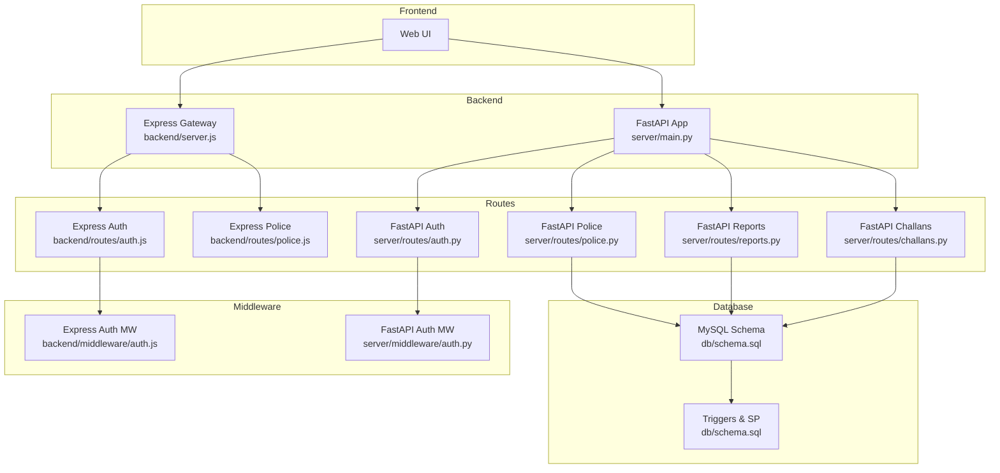
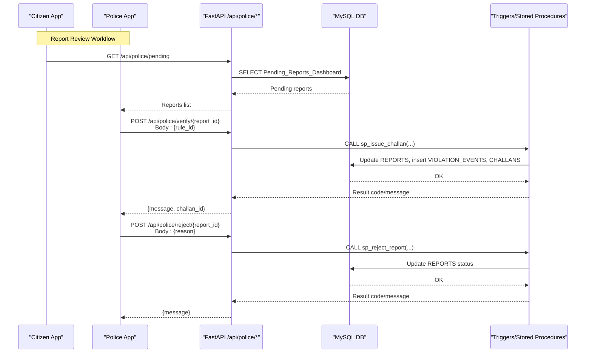
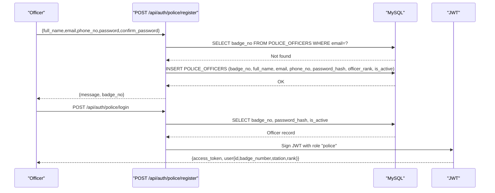
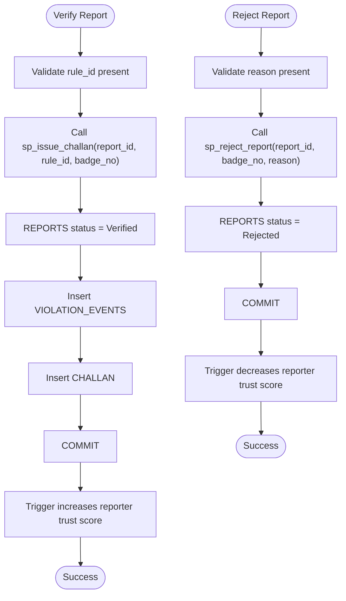
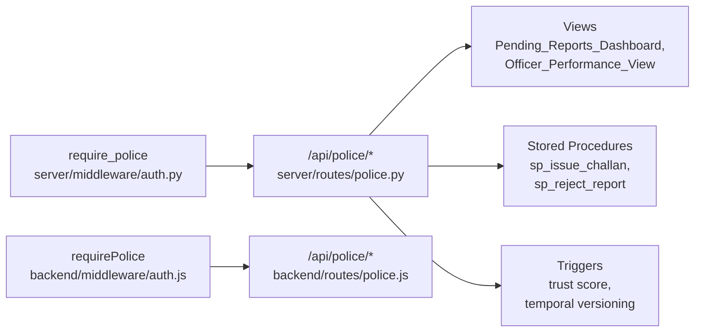

# Police Interaction Routes

<cite>
**Referenced Files in This Document**
- [backend/server.js](file://backend/server.js)
- [backend/routes/auth.js](file://backend/routes/auth.js)
- [backend/middleware/auth.js](file://backend/middleware/auth.js)
- [backend/routes/police.js](file://backend/routes/police.js)
- [server/main.py](file://server/main.py)
- [server/routes/auth.py](file://server/routes/auth.py)
- [server/middleware/auth.py](file://server/middleware/auth.py)
- [server/routes/police.py](file://server/routes/police.py)
- [server/routes/reports.py](file://server/routes/reports.py)
- [server/routes/challans.py](file://server/routes/challans.py)
- [db/schema.sql](file://db/schema.sql)
- [db/stored_procedure_process_report.sql](file://db/stored_procedure_process_report.sql)
</cite>

## Table of Contents
1. [Introduction](#introduction)
2. [Project Structure](#project-structure)
3. [Core Components](#core-components)
4. [Architecture Overview](#architecture-overview)
5. [Detailed Component Analysis](#detailed-component-analysis)
6. [Dependency Analysis](#dependency-analysis)
7. [Performance Considerations](#performance-considerations)
8. [Troubleshooting Guide](#troubleshooting-guide)
9. [Security and Compliance](#security-and-compliance)
10. [Conclusion](#conclusion)

## Introduction
This document describes the police interaction routes that enable communication between citizens and law enforcement within the Traffic Violation Management System. It covers:
- Police registration and authentication endpoints
- Report review workflows for verification and rejection
- Administrative functions for rule lookup and officer performance
- Role-based access control and audit logging
- Security considerations for sensitive law enforcement data

The system integrates a FastAPI backend with MySQL triggers and stored procedures to enforce trust scoring, audit trails, and financial processing.

## Project Structure
The system comprises:
- A Node.js Express API gateway for legacy routes and middleware
- A FastAPI Python backend for modern routes, including police-specific operations
- A MySQL database with views, triggers, stored procedures, and scheduled events

**Diagram sources**
- [backend/server.js:1-42](file://backend/server.js#L1-L42)
- [server/main.py:1-107](file://server/main.py#L1-L107)
- [backend/routes/auth.js:1-117](file://backend/routes/auth.js#L1-L117)
- [backend/routes/police.js:1-109](file://backend/routes/police.js#L1-L109)
- [server/routes/auth.py:1-744](file://server/routes/auth.py#L1-L744)
- [server/routes/police.py:1-220](file://server/routes/police.py#L1-L220)
- [server/routes/reports.py:1-563](file://server/routes/reports.py#L1-L563)
- [server/routes/challans.py:1-450](file://server/routes/challans.py#L1-L450)
- [backend/middleware/auth.js:1-37](file://backend/middleware/auth.js#L1-L37)
- [server/middleware/auth.py:1-182](file://server/middleware/auth.py#L1-L182)
- [db/schema.sql:1-942](file://db/schema.sql#L1-L942)

**Section sources**
- [backend/server.js:1-42](file://backend/server.js#L1-L42)
- [server/main.py:1-107](file://server/main.py#L1-L107)
- [db/schema.sql:1-942](file://db/schema.sql#L1-L942)

## Core Components
- Police authentication endpoints (FastAPI):
  - POST /api/auth/police/register
  - POST /api/auth/police/login
- Police operational endpoints (FastAPI):
  - GET /api/police/pending
  - POST /api/police/verify/{report_id}
  - POST /api/police/reject/{report_id}
  - GET /api/police/rules
  - GET /api/police/performance
- Legacy Express integration:
  - GET /api/police/pending (Express)
  - PATCH /api/police/verify/:id (Express)
  - PATCH /api/police/reject/:id (Express)

These endpoints integrate with database views, stored procedures, and triggers to manage report lifecycle, trust scoring, and challan issuance.

**Section sources**
- [server/routes/auth.py:310-491](file://server/routes/auth.py#L310-L491)
- [server/routes/police.py:25-220](file://server/routes/police.py#L25-L220)
- [backend/routes/police.js:7-109](file://backend/routes/police.js#L7-L109)

## Architecture Overview
The police interaction architecture centers on FastAPI routes protected by role-based middleware. Requests flow through:
- Authentication: JWT-based tokens for police officers
- Authorization: require_police middleware ensures badge_no-based identity
- Business logic: stored procedures and views orchestrate report verification, rejection, and performance metrics
- Audit: triggers maintain trust score and temporal histories

**Diagram sources**
- [server/routes/police.py:25-220](file://server/routes/police.py#L25-L220)
- [db/schema.sql:440-686](file://db/schema.sql#L440-L686)

**Section sources**
- [server/routes/police.py:25-220](file://server/routes/police.py#L25-L220)
- [db/schema.sql:764-820](file://db/schema.sql#L764-L820)

## Detailed Component Analysis

### Authentication Endpoints
- Police registration:
  - POST /api/auth/police/register
  - Validates password match and length, hashes password, assigns badge_no, inserts into POLICE_OFFICERS
- Police login:
  - POST /api/auth/police/login
  - Verifies credentials, checks active status, issues JWT with role "police"

**Diagram sources**
- [server/routes/auth.py:310-491](file://server/routes/auth.py#L310-L491)

**Section sources**
- [server/routes/auth.py:310-491](file://server/routes/auth.py#L310-L491)

### Police Operational Endpoints
- GET /api/police/pending
  - Returns Pending_Reports_Dashboard view entries for the command center
- POST /api/police/verify/{report_id}
  - Requires rule_id; calls sp_issue_challan to update REPORTS, create VIOLATION_EVENTS, and CHALLANS
  - Triggers trust score increase for the reporter
- POST /api/police/reject/{report_id}
  - Requires reason; calls sp_reject_report to set status to Rejected
  - Triggers trust score penalty for the reporter
- GET /api/police/rules
  - Returns active VIOLATION_RULES with severity and base_fine_amount
- GET /api/police/performance
  - Returns Officer_Performance_View filtered by badge_no

**Diagram sources**
- [server/routes/police.py:48-156](file://server/routes/police.py#L48-L156)
- [db/schema.sql:440-686](file://db/schema.sql#L440-L686)

**Section sources**
- [server/routes/police.py:25-220](file://server/routes/police.py#L25-L220)
- [db/schema.sql:764-820](file://db/schema.sql#L764-L820)

### Legacy Express Police Routes
- GET /api/police/pending
- PATCH /api/police/verify/:id
- PATCH /api/police/reject/:id
These endpoints mirror FastAPI behavior and use the same stored procedures and views.

**Section sources**
- [backend/routes/police.js:7-109](file://backend/routes/police.js#L7-L109)

### Report Access Patterns and Case Management
- Reports are accessed via:
  - GET /api/reports/police/pending (FastAPI)
  - GET /api/police/pending (Express/FastAPI)
- Case management:
  - Reports can be processed by police to Verified or Rejected
  - Challans are created through dedicated routes and stored procedures
  - Evidence photos can be uploaded and linked to reports

**Section sources**
- [server/routes/reports.py:411-460](file://server/routes/reports.py#L411-L460)
- [server/routes/challans.py:47-139](file://server/routes/challans.py#L47-L139)

### Administrative Actions
- Rule lookup:
  - GET /api/police/rules returns active violation rules with severity and base fine
- Performance stats:
  - GET /api/police/performance returns verified/rejected counts and revenue collected

**Section sources**
- [server/routes/police.py:158-220](file://server/routes/police.py#L158-L220)

## Dependency Analysis
Key dependencies and relationships:
- FastAPI police routes depend on:
  - require_police middleware for role gating
  - database views (Pending_Reports_Dashboard, Officer_Performance_View)
  - stored procedures (sp_issue_challan, sp_reject_report)
- Express police routes depend on:
  - authenticateToken and requirePolice middleware
  - direct SQL queries and stored procedures
- Database triggers enforce:
  - Trust score changes on report status updates
  - Temporal versioning for citizens and challans

**Diagram sources**
- [server/middleware/auth.py:1-182](file://server/middleware/auth.py#L1-L182)
- [server/routes/police.py:1-220](file://server/routes/police.py#L1-L220)
- [backend/middleware/auth.js:1-37](file://backend/middleware/auth.js#L1-L37)
- [backend/routes/police.js:1-109](file://backend/routes/police.js#L1-L109)
- [db/schema.sql:764-820](file://db/schema.sql#L764-L820)

**Section sources**
- [server/middleware/auth.py:1-182](file://server/middleware/auth.py#L1-L182)
- [backend/middleware/auth.js:1-37](file://backend/middleware/auth.js#L1-L37)
- [db/schema.sql:303-430](file://db/schema.sql#L303-L430)

## Performance Considerations
- Stored procedures encapsulate ACID transactions to prevent partial updates and race conditions.
- Views provide pre-aggregated data for dashboards and reduce query complexity.
- Triggers ensure automatic trust score and audit trail updates without application-level duplication.
- Scheduled events periodically flag overdue challans and adjust trust scores.

[No sources needed since this section provides general guidance]

## Troubleshooting Guide
Common issues and resolutions:
- Authentication failures:
  - Invalid or expired token: ensure Authorization header includes bearer token
  - Invalid credentials: verify email/password combination and active status
- Authorization failures:
  - 403 Forbidden indicates missing or incorrect role; ensure badge_no-based identity
- Report processing errors:
  - Verify report exists and is Pending before calling verify
  - Ensure rule_id is valid and active for verification
  - Rejection requires a reason; ensure body contains reason field
- Database connectivity:
  - Confirm MySQL service is running and credentials are correct
  - Check stored procedure availability and view definitions

**Section sources**
- [server/routes/auth.py:399-491](file://server/routes/auth.py#L399-L491)
- [server/routes/police.py:48-156](file://server/routes/police.py#L48-L156)
- [db/schema.sql:440-686](file://db/schema.sql#L440-L686)

## Security and Compliance
- Authentication and Authorization:
  - JWT-based tokens with HS256; roles embedded in token payload
  - require_police middleware enforces badge_no-based access
- Data Protection:
  - Passwords hashed with bcrypt before storage
  - Sensitive fields (password_hash) are not exposed in responses
- Audit Logging:
  - Triggers capture trust score changes and temporal history
  - Views aggregate performance metrics for oversight
- Compliance Considerations:
  - Temporal tables and histories support regulatory audit requirements
  - Scheduled events automate overdue processing and penalties
  - Stored procedures centralize business logic to minimize exposure

**Section sources**
- [server/middleware/auth.py:1-182](file://server/middleware/auth.py#L1-L182)
- [db/schema.sql:303-430](file://db/schema.sql#L303-L430)
- [db/schema.sql:757-840](file://db/schema.sql#L757-L840)

## Conclusion
The police interaction routes provide a secure, auditable pathway for law enforcement to review reports, verify violations, issue challans, and monitor performance. The integration of FastAPI, JWT-based access control, stored procedures, and database triggers ensures reliability, compliance, and scalability for sensitive traffic violation management workflows.