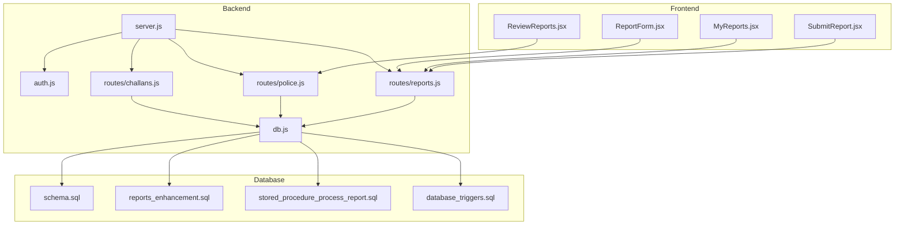
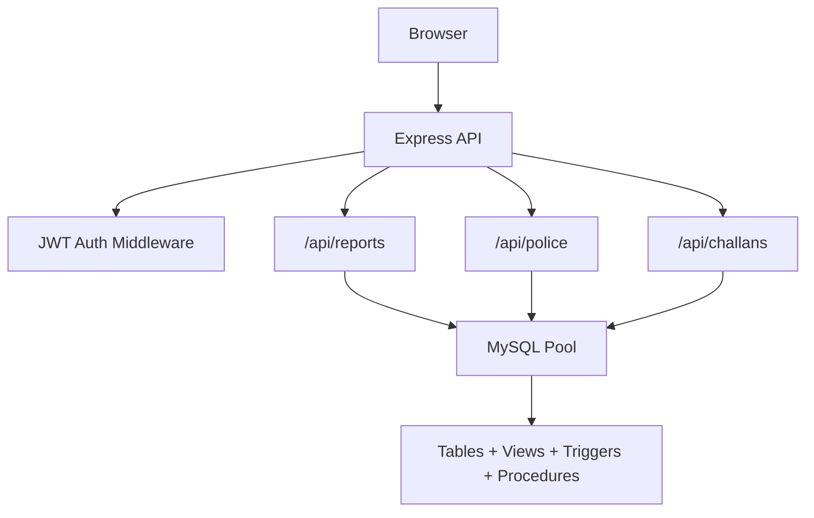
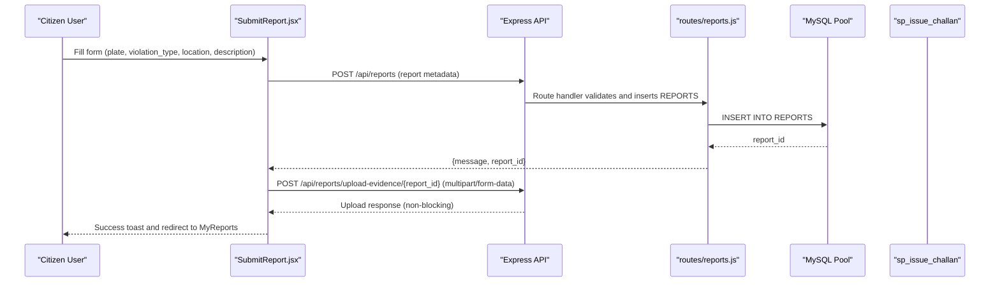
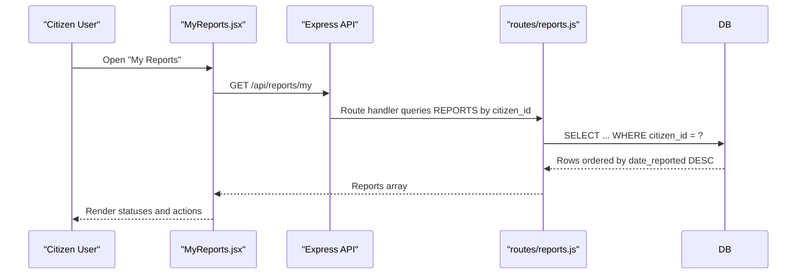
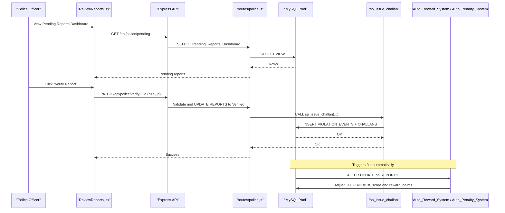
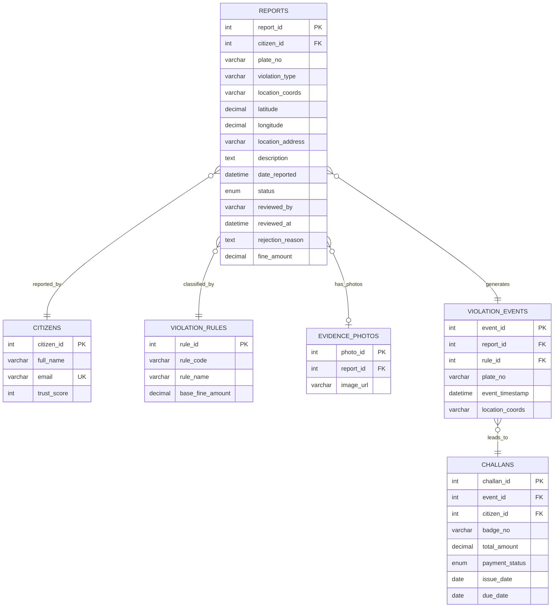
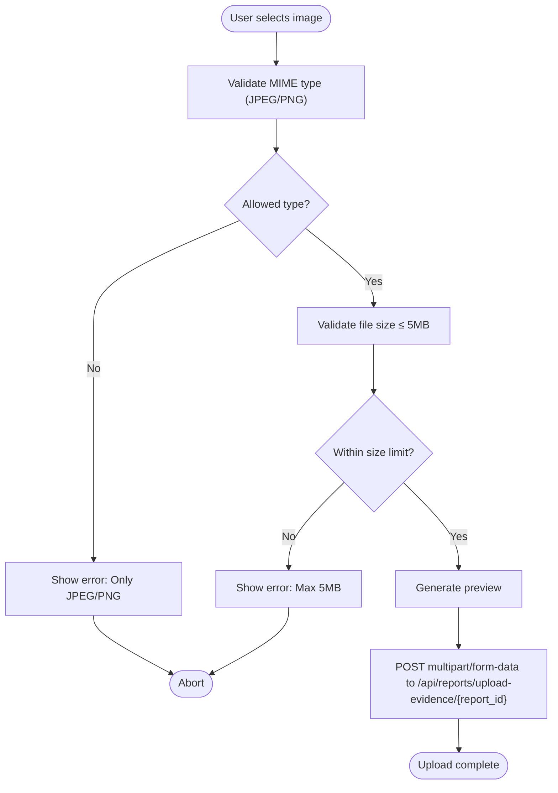
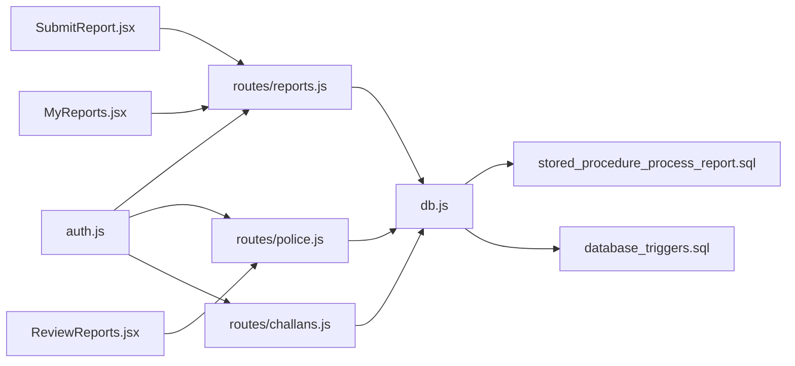

# Reports Management System

<cite>
**Referenced Files in This Document**
- [backend/server.js](file://backend/server.js)
- [backend/db.js](file://backend/db.js)
- [backend/middleware/auth.js](file://backend/middleware/auth.js)
- [backend/routes/reports.js](file://backend/routes/reports.js)
- [backend/routes/police.js](file://backend/routes/police.js)
- [backend/routes/challans.js](file://backend/routes/challans.js)
- [db/schema.sql](file://db/schema.sql)
- [db/reports_enhancement.sql](file://db/reports_enhancement.sql)
- [db/stored_procedure_process_report.sql](file://db/stored_procedure_process_report.sql)
- [db/database_triggers.sql](file://db/database_triggers.sql)
- [frontend/src/pages/SubmitReport.jsx](file://frontend/src/pages/SubmitReport.jsx)
- [frontend/src/pages/MyReports.jsx](file://frontend/src/pages/MyReports.jsx)
- [frontend/src/components/ReportForm.jsx](file://frontend/src/components/ReportForm.jsx)
- [frontend/src/pages/ReviewReports.jsx](file://frontend/src/pages/ReviewReports.jsx)
</cite>

## Table of Contents
1. [Introduction](#introduction)
2. [Project Structure](#project-structure)
3. [Core Components](#core-components)
4. [Architecture Overview](#architecture-overview)
5. [Detailed Component Analysis](#detailed-component-analysis)
6. [Dependency Analysis](#dependency-analysis)
7. [Performance Considerations](#performance-considerations)
8. [Troubleshooting Guide](#troubleshooting-guide)
9. [Conclusion](#conclusion)

## Introduction
This document describes the complete reports management system for traffic violation reporting. It covers the end-to-end workflow from citizen report submission to status tracking, evidence photo handling, report categorization, and the processing pipeline that integrates with the police backend for review and approval. It also documents the API endpoints, data models, database enhancements, stored procedures, triggers, and real-time synchronization mechanisms.

## Project Structure
The system is split into:
- Backend API (Node.js + Express) with route handlers for reports, police, and challans
- Database schema with normalized tables, views, stored procedures, and triggers
- Frontend React application with pages for report submission, viewing, and police review

**Diagram sources**
- [backend/server.js:1-42](file://backend/server.js#L1-L42)
- [backend/routes/reports.js:1-54](file://backend/routes/reports.js#L1-L54)
- [backend/routes/police.js:1-109](file://backend/routes/police.js#L1-L109)
- [backend/routes/challans.js:1-101](file://backend/routes/challans.js#L1-L101)
- [backend/db.js:1-26](file://backend/db.js#L1-L26)
- [backend/middleware/auth.js:1-37](file://backend/middleware/auth.js#L1-L37)
- [db/schema.sql:114-167](file://db/schema.sql#L114-L167)
- [db/reports_enhancement.sql:17-47](file://db/reports_enhancement.sql#L17-L47)
- [db/stored_procedure_process_report.sql:8-98](file://db/stored_procedure_process_report.sql#L8-L98)
- [db/database_triggers.sql:8-35](file://db/database_triggers.sql#L8-L35)

**Section sources**
- [backend/server.js:1-42](file://backend/server.js#L1-L42)
- [backend/db.js:1-26](file://backend/db.js#L1-L26)
- [db/schema.sql:114-167](file://db/schema.sql#L114-L167)

## Core Components
- Authentication and role gating via JWT middleware
- Report lifecycle: citizen submission, evidence attachment, police verification/rejection, and challan issuance
- Database schema with REPORTS, VIOLATION_RULES, VIOLATION_EVENTS, CHALLANS, and supporting tables
- Stored procedures for ACID-compliant report processing and challan issuance
- Triggers for automatic trust score adjustments based on report outcomes
- Real-time synchronization for status updates

**Section sources**
- [backend/middleware/auth.js:1-37](file://backend/middleware/auth.js#L1-L37)
- [backend/routes/reports.js:7-51](file://backend/routes/reports.js#L7-L51)
- [backend/routes/police.js:18-106](file://backend/routes/police.js#L18-L106)
- [db/schema.sql:98-167](file://db/schema.sql#L98-L167)
- [db/stored_procedure_process_report.sql:8-98](file://db/stored_procedure_process_report.sql#L8-L98)
- [db/database_triggers.sql:8-35](file://db/database_triggers.sql#L8-L35)

## Architecture Overview
The system follows a layered architecture:
- Presentation layer: React pages for citizen and police workflows
- Application layer: Express routes implementing business logic
- Data access layer: MySQL connection pool and stored procedures
- Persistence layer: Normalized schema with views and triggers

**Diagram sources**
- [backend/server.js:10-26](file://backend/server.js#L10-L26)
- [backend/middleware/auth.js:5-27](file://backend/middleware/auth.js#L5-L27)
- [backend/routes/reports.js:1-54](file://backend/routes/reports.js#L1-L54)
- [backend/routes/police.js:1-109](file://backend/routes/police.js#L1-L109)
- [backend/routes/challans.js:1-101](file://backend/routes/challans.js#L1-L101)
- [backend/db.js:3-13](file://backend/db.js#L3-L13)
- [db/schema.sql:114-167](file://db/schema.sql#L114-L167)

## Detailed Component Analysis

### Report Submission Workflow (Citizen)
End-to-end flow from form submission to database persistence and optional evidence upload.

**Diagram sources**
- [frontend/src/pages/SubmitReport.jsx:92-177](file://frontend/src/pages/SubmitReport.jsx#L92-L177)
- [backend/routes/reports.js:8-31](file://backend/routes/reports.js#L8-L31)

**Section sources**
- [frontend/src/pages/SubmitReport.jsx:92-177](file://frontend/src/pages/SubmitReport.jsx#L92-L177)
- [backend/routes/reports.js:8-31](file://backend/routes/reports.js#L8-L31)

### Report Retrieval and Tracking (Citizen)
Real-time polling to reflect police actions and status changes.

**Diagram sources**
- [frontend/src/pages/MyReports.jsx:23-44](file://frontend/src/pages/MyReports.jsx#L23-L44)
- [backend/routes/reports.js:33-51](file://backend/routes/reports.js#L33-L51)

**Section sources**
- [frontend/src/pages/MyReports.jsx:23-44](file://frontend/src/pages/MyReports.jsx#L23-L44)
- [backend/routes/reports.js:33-51](file://backend/routes/reports.js#L33-L51)

### Police Review and Processing Pipeline
Verification and rejection workflows with stored procedures and triggers.

**Diagram sources**
- [frontend/src/pages/ReviewReports.jsx:37-61](file://frontend/src/pages/ReviewReports.jsx#L37-L61)
- [backend/routes/police.js:7-16](file://backend/routes/police.js#L7-L16)
- [backend/routes/police.js:18-85](file://backend/routes/police.js#L18-L85)
- [db/stored_procedure_process_report.sql:8-98](file://db/stored_procedure_process_report.sql#L8-L98)
- [db/database_triggers.sql:8-35](file://db/database_triggers.sql#L8-L35)

**Section sources**
- [frontend/src/pages/ReviewReports.jsx:37-88](file://frontend/src/pages/ReviewReports.jsx#L37-L88)
- [backend/routes/police.js:18-85](file://backend/routes/police.js#L18-L85)
- [db/stored_procedure_process_report.sql:8-98](file://db/stored_procedure_process_report.sql#L8-L98)
- [db/database_triggers.sql:8-35](file://db/database_triggers.sql#L8-L35)

### Data Model and Enhanced Reporting Fields
The REPORTS table now includes violation_type, location coordinates, fine_amount, and extended status enumeration.

**Diagram sources**
- [db/schema.sql:114-167](file://db/schema.sql#L114-L167)
- [db/reports_enhancement.sql:17-47](file://db/reports_enhancement.sql#L17-L47)

**Section sources**
- [db/schema.sql:114-167](file://db/schema.sql#L114-L167)
- [db/reports_enhancement.sql:17-47](file://db/reports_enhancement.sql#L17-L47)

### Evidence Photo Upload Handling and Validation
Frontend validation and upload flow for evidence images.

**Diagram sources**
- [frontend/src/pages/SubmitReport.jsx:63-90](file://frontend/src/pages/SubmitReport.jsx#L63-L90)
- [backend/routes/reports.js:8-31](file://backend/routes/reports.js#L8-L31)

**Section sources**
- [frontend/src/pages/SubmitReport.jsx:63-90](file://frontend/src/pages/SubmitReport.jsx#L63-L90)
- [backend/routes/reports.js:8-31](file://backend/routes/reports.js#L8-L31)

### Report Categorization and Violation Types
The system supports predefined violation categories and base fines. The REPORTS table stores violation_type alongside rule_id linkage.

- Categories: Speeding, Red Light Violation, No Helmet, Wrong-Side Driving, Using Phone, Drunk Driving, Overloading, Other
- Base fines are derived from VIOLATION_RULES and used during challan issuance

**Section sources**
- [frontend/src/pages/SubmitReport.jsx:20-29](file://frontend/src/pages/SubmitReport.jsx#L20-L29)
- [db/schema.sql:98-111](file://db/schema.sql#L98-L111)

### API Endpoints Summary
- Reports
  - POST /api/reports - Submit a new report (citizen only)
  - GET /api/reports/my - Retrieve citizen’s reports
- Police
  - GET /api/police/pending - Pending reports dashboard
  - PATCH /api/police/verify/:id - Verify report and issue challan
  - PATCH /api/police/reject/:id - Reject report
- Challans
  - GET /api/challans/my - Retrieve citizen’s challans
  - POST /api/challans/pay - Pay a challan with row-level locking

**Section sources**
- [backend/routes/reports.js:7-51](file://backend/routes/reports.js#L7-L51)
- [backend/routes/police.js:7-106](file://backend/routes/police.js#L7-L106)
- [backend/routes/challans.js:7-98](file://backend/routes/challans.js#L7-L98)

### Database Enhancements and Stored Procedures
- Added violation_type, latitude, longitude, fine_amount, extended status enum
- ACID-compliant stored procedure for report processing and challan issuance
- Triggers for automatic trust score adjustments

**Section sources**
- [db/reports_enhancement.sql:17-47](file://db/reports_enhancement.sql#L17-L47)
- [db/stored_procedure_process_report.sql:8-98](file://db/stored_procedure_process_report.sql#L8-L98)
- [db/database_triggers.sql:8-35](file://db/database_triggers.sql#L8-L35)

## Dependency Analysis
- Routes depend on middleware for authentication and role checks
- Routes depend on the database pool for SQL operations
- Stored procedures encapsulate business-critical transactions
- Triggers enforce referential integrity and policy-driven side effects
- Frontend pages depend on backend endpoints for data and actions

**Diagram sources**
- [backend/middleware/auth.js:1-37](file://backend/middleware/auth.js#L1-L37)
- [backend/routes/reports.js:1-54](file://backend/routes/reports.js#L1-L54)
- [backend/routes/police.js:1-109](file://backend/routes/police.js#L1-L109)
- [backend/routes/challans.js:1-101](file://backend/routes/challans.js#L1-L101)
- [backend/db.js:1-26](file://backend/db.js#L1-L26)
- [db/stored_procedure_process_report.sql:8-98](file://db/stored_procedure_process_report.sql#L8-L98)
- [db/database_triggers.sql:8-35](file://db/database_triggers.sql#L8-L35)
- [frontend/src/pages/SubmitReport.jsx:92-177](file://frontend/src/pages/SubmitReport.jsx#L92-L177)
- [frontend/src/pages/MyReports.jsx:23-44](file://frontend/src/pages/MyReports.jsx#L23-L44)
- [frontend/src/pages/ReviewReports.jsx:37-61](file://frontend/src/pages/ReviewReports.jsx#L37-L61)

**Section sources**
- [backend/middleware/auth.js:1-37](file://backend/middleware/auth.js#L1-L37)
- [backend/routes/reports.js:1-54](file://backend/routes/reports.js#L1-L54)
- [backend/routes/police.js:1-109](file://backend/routes/police.js#L1-L109)
- [backend/routes/challans.js:1-101](file://backend/routes/challans.js#L1-L101)
- [backend/db.js:1-26](file://backend/db.js#L1-L26)
- [db/stored_procedure_process_report.sql:8-98](file://db/stored_procedure_process_report.sql#L8-L98)
- [db/database_triggers.sql:8-35](file://db/database_triggers.sql#L8-L35)
- [frontend/src/pages/SubmitReport.jsx:92-177](file://frontend/src/pages/SubmitReport.jsx#L92-L177)
- [frontend/src/pages/MyReports.jsx:23-44](file://frontend/src/pages/MyReports.jsx#L23-L44)
- [frontend/src/pages/ReviewReports.jsx:37-61](file://frontend/src/pages/ReviewReports.jsx#L37-L61)

## Performance Considerations
- Use database indexes on frequently filtered columns (status, citizen_id, date_reported)
- Prefer batch operations for bulk report updates or deletions
- Implement pagination for large report lists and dashboard views
- Use row-level locks and transactions for concurrent access to reports and challans
- Store evidence photos on a scalable object storage service and keep only URLs in the database

## Troubleshooting Guide
Common issues and resolutions:
- Authentication failures: Ensure JWT token is present and valid; verify role gating for citizen/police endpoints
- Report submission errors: Validate required fields (plate number, description); check database constraints
- Evidence upload errors: Confirm file type and size limits; ensure multipart/form-data format
- Verification/rejection failures: Confirm report status is Pending; verify rule_id validity
- Trust score anomalies: Check triggers firing after status changes

**Section sources**
- [backend/middleware/auth.js:5-27](file://backend/middleware/auth.js#L5-L27)
- [backend/routes/reports.js:12-14](file://backend/routes/reports.js#L12-L14)
- [frontend/src/pages/SubmitReport.jsx:63-90](file://frontend/src/pages/SubmitReport.jsx#L63-L90)
- [backend/routes/police.js:33-43](file://backend/routes/police.js#L33-L43)
- [db/database_triggers.sql:8-35](file://db/database_triggers.sql#L8-L35)

## Conclusion
The reports management system provides a robust, secure, and scalable foundation for traffic violation reporting. It integrates citizen submission, evidence handling, real-time status tracking, and a complete police review and challan issuance pipeline. The database schema, stored procedures, and triggers ensure data integrity and policy compliance, while the frontend offers intuitive workflows for both citizens and police officers.