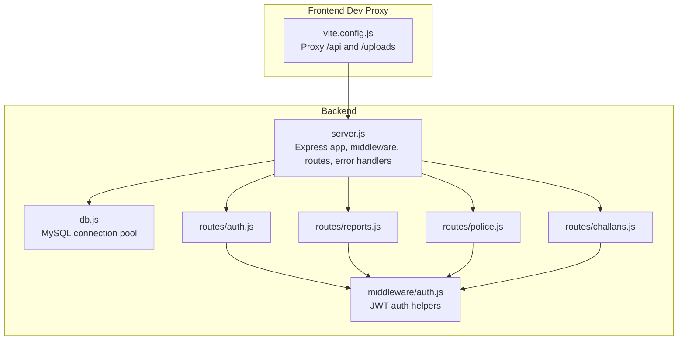
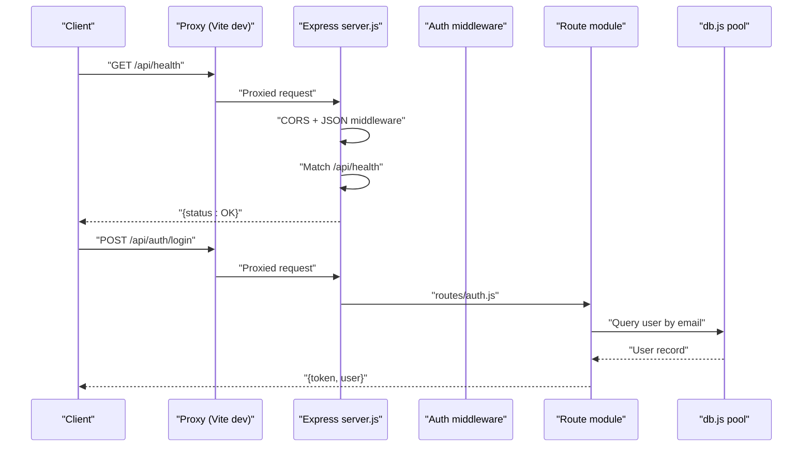
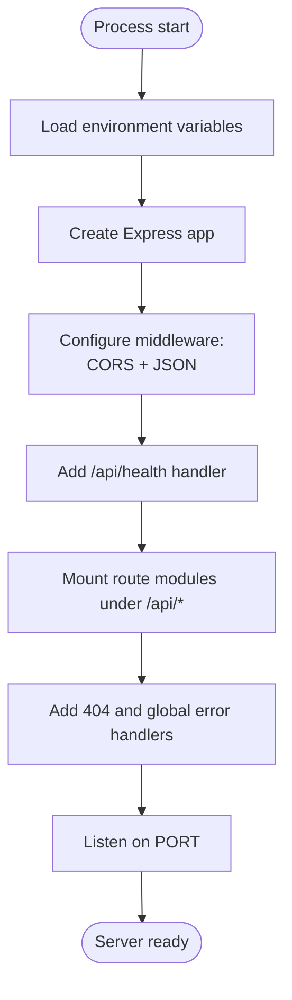
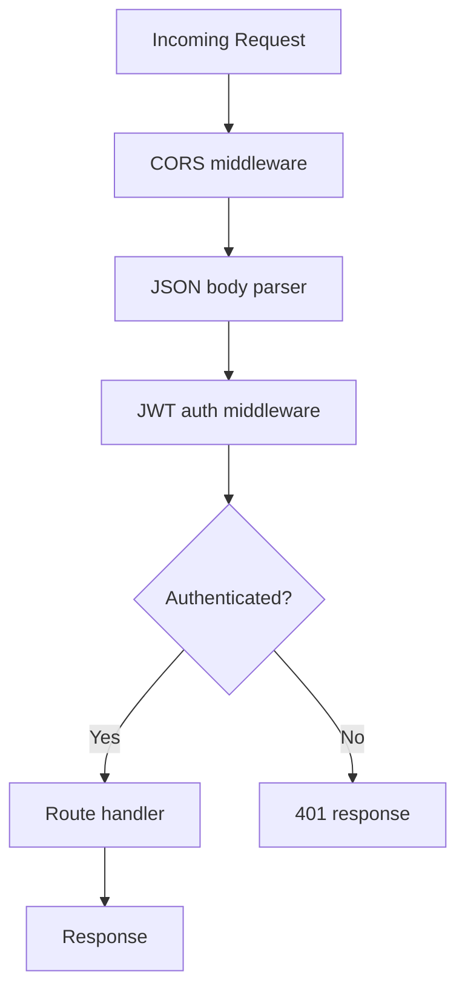
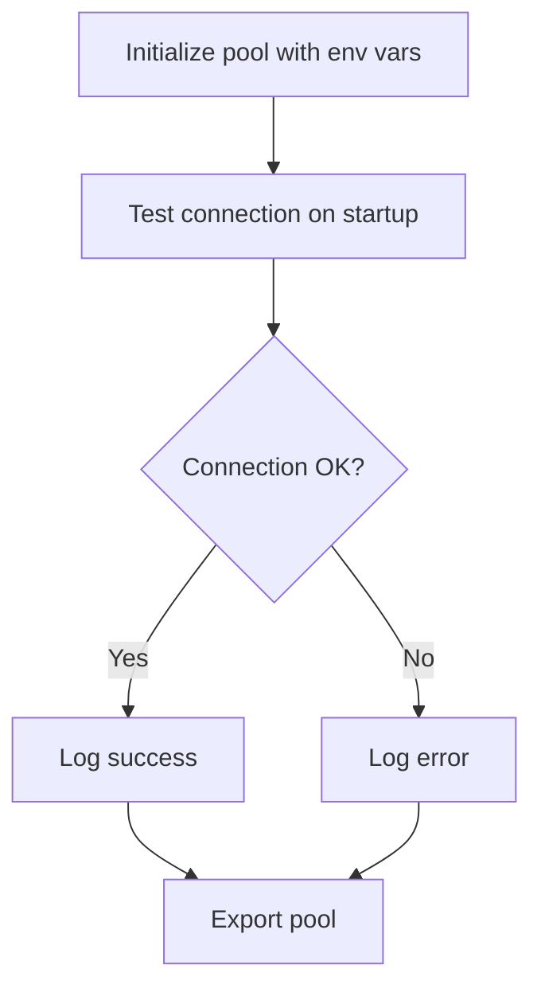
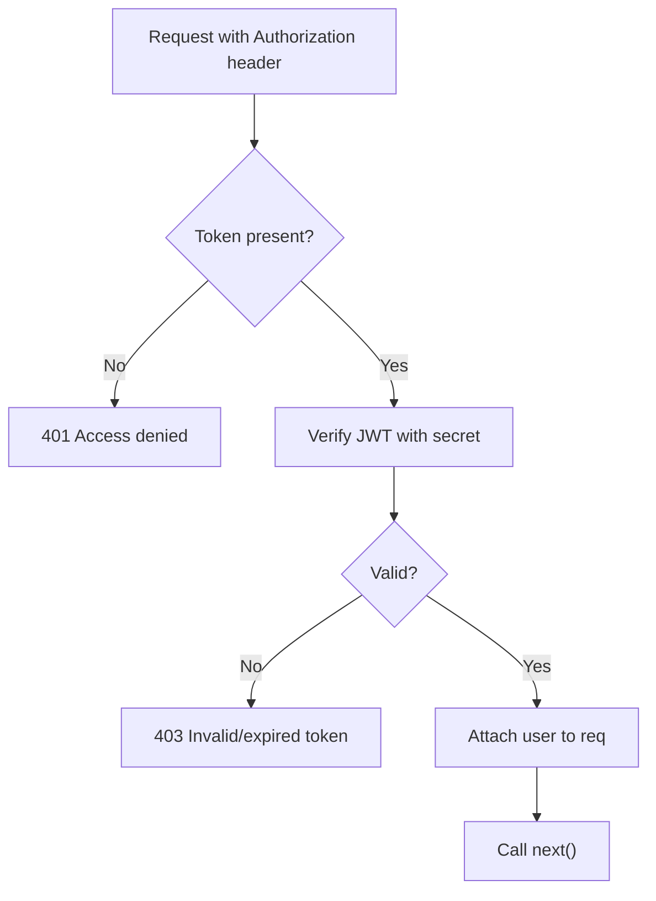
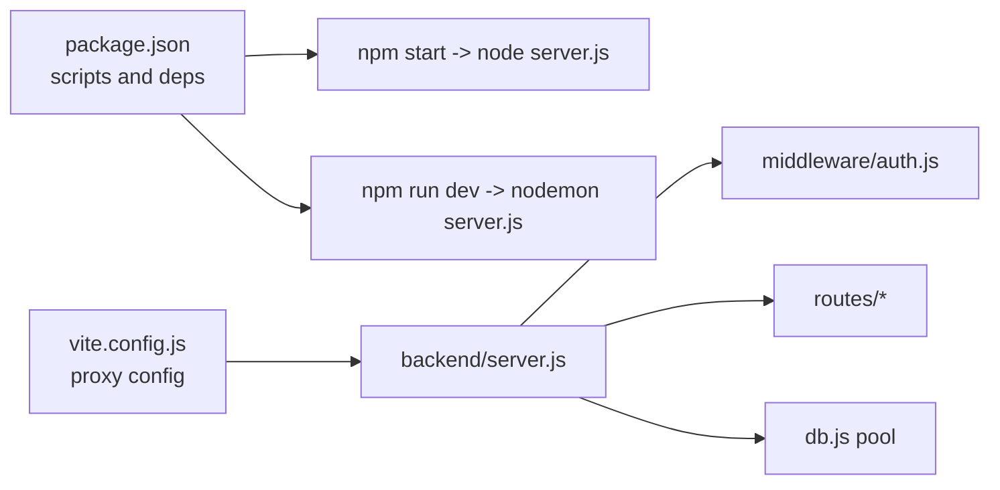

# Server Initialization and Configuration

<cite>
**Referenced Files in This Document**
- [server.js](file://backend/server.js)
- [db.js](file://backend/db.js)
- [package.json](file://backend/package.json)
- [auth.js](file://backend/middleware/auth.js)
- [auth-routes.js](file://backend/routes/auth.js)
- [reports-routes.js](file://backend/routes/reports.js)
- [police-routes.js](file://backend/routes/police.js)
- [challans-routes.js](file://backend/routes/challans.js)
- [vite.config.js](file://frontend/vite.config.js)
</cite>

## Table of Contents
1. [Introduction](#introduction)
2. [Project Structure](#project-structure)
3. [Core Components](#core-components)
4. [Architecture Overview](#architecture-overview)
5. [Detailed Component Analysis](#detailed-component-analysis)
6. [Dependency Analysis](#dependency-analysis)
7. [Performance Considerations](#performance-considerations)
8. [Troubleshooting Guide](#troubleshooting-guide)
9. [Conclusion](#conclusion)
10. [Appendices](#appendices)

## Introduction
This document explains the Express.js server initialization and configuration for the Traffic Violation Management System backend. It covers server startup, port configuration, environment variable handling, middleware stack (including CORS and JSON parsing), health check endpoint, route mounting patterns, global error handling, database connection management via a connection pool, and practical deployment considerations. It also highlights security configurations, performance tuning options, and monitoring integration points.

## Project Structure
The backend server is organized around a single entry point that initializes Express, loads environment variables, registers middleware, mounts routes, and starts listening on a configurable port. Database connectivity is managed through a reusable connection pool. Authentication middleware enforces role-based access control on protected endpoints.

**Diagram sources**
- [server.js](file://backend/server.js)
- [db.js](file://backend/db.js)
- [auth.js](file://backend/middleware/auth.js)
- [auth-routes.js](file://backend/routes/auth.js)
- [reports-routes.js](file://backend/routes/reports.js)
- [police-routes.js](file://backend/routes/police.js)
- [challans-routes.js](file://backend/routes/challans.js)
- [vite.config.js](file://frontend/vite.config.js)

**Section sources**
- [server.js](file://backend/server.js)
- [db.js](file://backend/db.js)
- [package.json](file://backend/package.json)

## Core Components
- Express application initialization and environment loading
- Middleware stack: CORS and JSON body parsing
- Health check endpoint
- Route mounting under /api/*
- Global 404 and error handlers
- Database connection pool with connection testing
- Authentication middleware with JWT secret management
- Route modules for auth, reports, police, and challans

**Section sources**
- [server.js](file://backend/server.js)
- [db.js](file://backend/db.js)
- [auth.js](file://backend/middleware/auth.js)
- [auth-routes.js](file://backend/routes/auth.js)
- [reports-routes.js](file://backend/routes/reports.js)
- [police-routes.js](file://backend/routes/police.js)
- [challans-routes.js](file://backend/routes/challans.js)

## Architecture Overview
The server composes middleware, routes, and database access into a cohesive API surface. Requests flow through middleware for CORS and JSON parsing, then match against mounted routes. Protected routes rely on JWT-based authentication and role checks. Database operations use a pooled connection strategy with explicit transaction handling in selected endpoints.

**Diagram sources**
- [server.js](file://backend/server.js)
- [auth-routes.js](file://backend/routes/auth.js)
- [db.js](file://backend/db.js)
- [vite.config.js](file://frontend/vite.config.js)

## Detailed Component Analysis

### Express Application Initialization and Startup
- Loads environment variables via dotenv.
- Creates an Express app and sets PORT from environment or defaults to 5000.
- Registers CORS and JSON middleware globally.
- Defines a health check endpoint at /api/health.
- Mounts route modules under /api/*.
- Adds centralized 404 and global error handlers.
- Starts the server and logs the bound address.

**Diagram sources**
- [server.js](file://backend/server.js)

**Section sources**
- [server.js](file://backend/server.js)

### Middleware Stack
- CORS: Enabled globally to allow cross-origin requests.
- JSON body parser: Parses incoming request bodies for JSON payloads.
- Authentication middleware: Extracts JWT from Authorization header, verifies it, and attaches user info to the request. Role guards enforce access per route.

**Diagram sources**
- [server.js](file://backend/server.js)
- [auth.js](file://backend/middleware/auth.js)

**Section sources**
- [server.js](file://backend/server.js)
- [auth.js](file://backend/middleware/auth.js)

### Health Check Endpoint
- Endpoint: GET /api/health
- Returns a simple JSON payload indicating service status and timestamp.

**Section sources**
- [server.js](file://backend/server.js)

### Route Mounting Patterns
- Authentication routes: /api/auth/*
- Reports routes: /api/reports/*
- Police routes: /api/police/*
- Challans routes: /api/challans/*

Each route module defines its own subroutes and applies authentication and role middleware as needed.

**Section sources**
- [server.js](file://backend/server.js)
- [auth-routes.js](file://backend/routes/auth.js)
- [reports-routes.js](file://backend/routes/reports.js)
- [police-routes.js](file://backend/routes/police.js)
- [challans-routes.js](file://backend/routes/challans.js)

### Global Error Handling and 404 Behavior
- 404 handler: Responds with a JSON error when no route matches.
- Global error handler: Logs unhandled errors and responds with a generic internal server error.

**Section sources**
- [server.js](file://backend/server.js)

### Database Connection Management (Connection Pool)
- Uses mysql2 promise-based pool with configurable parameters:
  - Host, user, password, database from environment variables with sensible defaults.
  - Connection limit and queue behavior configured for concurrency control.
  - Keep-alive enabled to maintain persistent connections.
- On startup, tests a connection and logs success or failure.
- Exports the pool for use across route modules.

**Diagram sources**
- [db.js](file://backend/db.js)

**Section sources**
- [db.js](file://backend/db.js)

### Authentication Middleware and Security
- JWT secret sourced from environment variable with a fallback value.
- Extracts token from Authorization header and validates it.
- Attaches user identity (id, email, name, role) to the request.
- Role guards enforce access for citizen-only and police-only endpoints.

**Diagram sources**
- [auth.js](file://backend/middleware/auth.js)

**Section sources**
- [auth.js](file://backend/middleware/auth.js)

### Route Modules Overview
- Authentication:
  - Login: Validates credentials, compares hashed passwords, and issues a signed JWT.
  - Profile: Verifies token and returns user details based on role.
- Reports:
  - Submit report: Requires citizen role; inserts a new report with default status.
  - Fetch my reports: Returns citizen’s reports ordered by recency.
- Police:
  - Pending reports dashboard: Returns aggregated pending reports.
  - Verify report: Updates status, computes fine, and invokes a stored procedure to issue a challan within a transaction.
  - Reject report: Updates status to Rejected.
- Challans:
  - Fetch my challans: Returns citizen’s challans with related rule and officer details.
  - Pay challan: Uses row-level locking to prevent double payment and updates status atomically.

**Section sources**
- [auth-routes.js](file://backend/routes/auth.js)
- [reports-routes.js](file://backend/routes/reports.js)
- [police-routes.js](file://backend/routes/police.js)
- [challans-routes.js](file://backend/routes/challans.js)

## Dependency Analysis
- Runtime dependencies include Express, CORS, dotenv, mysql2, bcryptjs, jsonwebtoken.
- Scripts define start and dev commands for production and development.
- Frontend dev server proxies /api and /uploads to the backend server.

**Diagram sources**
- [package.json](file://backend/package.json)
- [vite.config.js](file://frontend/vite.config.js)
- [server.js](file://backend/server.js)
- [auth.js](file://backend/middleware/auth.js)
- [db.js](file://backend/db.js)

**Section sources**
- [package.json](file://backend/package.json)
- [vite.config.js](file://frontend/vite.config.js)

## Performance Considerations
- Connection pool sizing: Tune connectionLimit and queueLimit based on expected concurrent load and database capacity.
- Keep-alive: enableKeepAlive reduces connection establishment overhead.
- Body parsing: Limit maximum request body size at the application level if needed.
- Route-level transactions: Use transactions and row-level locks for sensitive operations to avoid race conditions and ensure atomicity.
- Monitoring: Integrate metrics and logging to track pool utilization, latency, and error rates.

[No sources needed since this section provides general guidance]

## Troubleshooting Guide
- Environment variables missing:
  - Ensure .env contains required keys for database and JWT secret.
  - Confirm dotenv is loaded before accessing environment variables.
- Database connectivity:
  - Check pool configuration and network access.
  - Review startup connection test logs for failures.
- Authentication failures:
  - Verify JWT_SECRET matches across server and clients.
  - Confirm tokens are sent in the Authorization header as “Bearer <token>”.
- CORS issues:
  - Confirm frontend proxy targets the correct backend origin and port.
- Unexpected 500 errors:
  - Inspect global error handler logs for stack traces.
  - Validate route-specific error handling blocks.

**Section sources**
- [server.js](file://backend/server.js)
- [db.js](file://backend/db.js)
- [auth.js](file://backend/middleware/auth.js)
- [vite.config.js](file://frontend/vite.config.js)

## Conclusion
The backend server is structured for clarity and modularity: a central Express app initializes middleware and routes, a shared database pool manages connections, and JWT-based middleware secures endpoints. The design supports scalable development with explicit error handling, health checks, and transactional operations where safety is critical. Proper environment configuration and deployment practices ensure reliable operation in production.

[No sources needed since this section summarizes without analyzing specific files]

## Appendices

### Practical Configuration Examples
- Server startup:
  - Production: npm start
  - Development: npm run dev
- Environment variables (.env):
  - PORT, DB_HOST, DB_USER, DB_PASSWORD, DB_NAME, JWT_SECRET
- Frontend proxy:
  - /api and /uploads proxied to backend origin and port

**Section sources**
- [package.json](file://backend/package.json)
- [server.js](file://backend/server.js)
- [vite.config.js](file://frontend/vite.config.js)