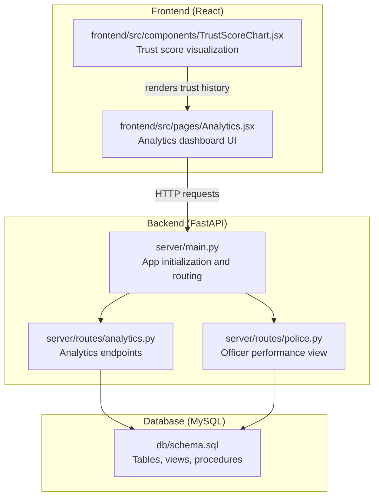
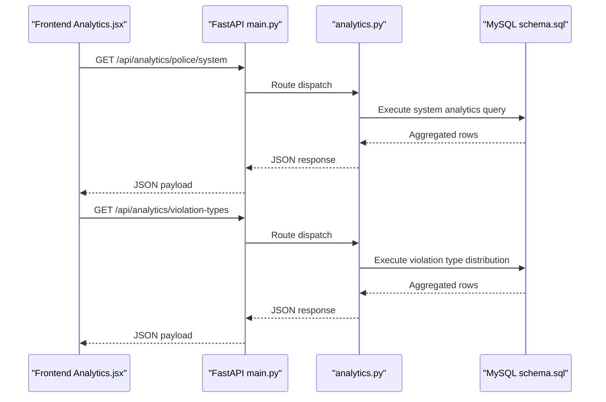
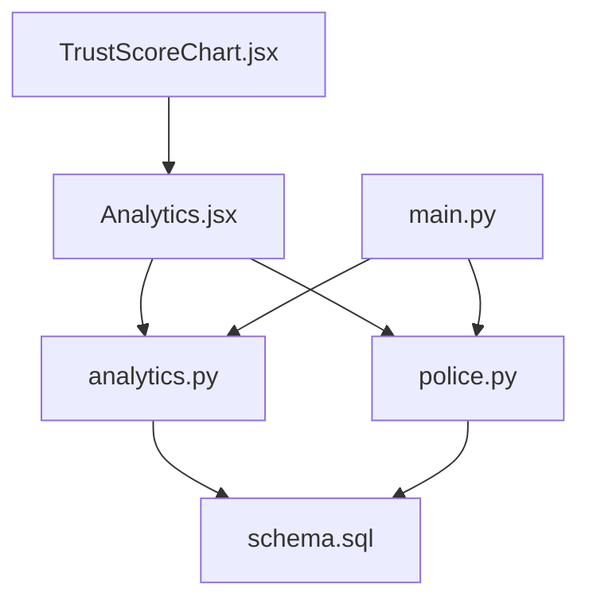

# Analytics and Dashboard

<cite>
**Referenced Files in This Document**
- [analytics.py](file://server/routes/analytics.py)
- [main.py](file://server/main.py)
- [Analytics.jsx](file://frontend/src/pages/Analytics.jsx)
- [schema.sql](file://db/schema.sql)
- [police.py](file://server/routes/police.py)
- [TrustScoreChart.jsx](file://frontend/src/components/TrustScoreChart.jsx)
- [server.js](file://backend/server.js)
- [reports.js](file://backend/routes/reports.js)
</cite>

## Table of Contents
1. [Introduction](#introduction)
2. [Project Structure](#project-structure)
3. [Core Components](#core-components)
4. [Architecture Overview](#architecture-overview)
5. [Detailed Component Analysis](#detailed-component-analysis)
6. [Dependency Analysis](#dependency-analysis)
7. [Performance Considerations](#performance-considerations)
8. [Troubleshooting Guide](#troubleshooting-guide)
9. [Conclusion](#conclusion)
10. [Appendices](#appendices)

## Introduction
This document provides comprehensive API documentation for the analytics and dashboard system. It covers real-time statistics, traffic pattern analysis, and performance metrics. The system exposes endpoints for:
- Violation trends
- Top offenders
- Department performance
- Geographic distribution data

It also documents request parameters for date-range filtering, category-based aggregation, and geographic queries, along with data aggregation patterns, caching strategies, and performance optimization techniques. Integration with frontend dashboard components, real-time data updates, and export functionality are explained, with examples of analytics query patterns and data visualization integration.

## Project Structure
The analytics and dashboard system spans a FastAPI backend, a React frontend, and a MySQL database with views and stored procedures supporting analytics.

**Diagram sources**
- [main.py:77-86](file://server/main.py#L77-L86)
- [analytics.py:36-125](file://server/routes/analytics.py#L36-L125)
- [police.py:190-220](file://server/routes/police.py#L190-L220)
- [Analytics.jsx:15-57](file://frontend/src/pages/Analytics.jsx#L15-L57)
- [TrustScoreChart.jsx:1-126](file://frontend/src/components/TrustScoreChart.jsx#L1-L126)
- [schema.sql:764-840](file://db/schema.sql#L764-L840)

**Section sources**
- [main.py:77-86](file://server/main.py#L77-L86)
- [analytics.py:36-125](file://server/routes/analytics.py#L36-L125)
- [police.py:190-220](file://server/routes/police.py#L190-L220)
- [Analytics.jsx:15-57](file://frontend/src/pages/Analytics.jsx#L15-L57)
- [TrustScoreChart.jsx:1-126](file://frontend/src/components/TrustScoreChart.jsx#L1-L126)
- [schema.sql:764-840](file://db/schema.sql#L764-L840)

## Core Components
- Backend API server (FastAPI) with CORS enabled and mounted routes for analytics, reports, challans, vehicles, and rules.
- Analytics endpoints for dashboard summaries, status trends, violation types, recent activity, and citizen/system analytics.
- Frontend dashboard rendering charts and tables using Recharts and local state.
- Database views and stored procedures supporting officer performance, trust history, and overdue processing.

Key capabilities:
- Real-time counts and summaries
- Daily status trend over the last seven days
- Violation type distribution
- Recent activity feed
- Officer performance metrics via a dedicated view

**Section sources**
- [main.py:50-95](file://server/main.py#L50-L95)
- [analytics.py:36-526](file://server/routes/analytics.py#L36-L526)
- [Analytics.jsx:19-100](file://frontend/src/pages/Analytics.jsx#L19-L100)
- [schema.sql:764-840](file://db/schema.sql#L764-L840)

## Architecture Overview
The system follows a client-server architecture:
- The frontend fetches analytics data from backend endpoints.
- The backend executes SQL queries against the database, leveraging views and procedures for performance.
- Real-time updates are achieved through periodic polling in the frontend.

**Diagram sources**
- [main.py:77-86](file://server/main.py#L77-L86)
- [analytics.py:398-436](file://server/routes/analytics.py#L398-L436)
- [schema.sql:764-840](file://db/schema.sql#L764-L840)

**Section sources**
- [main.py:77-86](file://server/main.py#L77-L86)
- [analytics.py:332-396](file://server/routes/analytics.py#L332-L396)
- [Analytics.jsx:32-51](file://frontend/src/pages/Analytics.jsx#L32-L51)

## Detailed Component Analysis

### Analytics Endpoints
Endpoints exposed by the analytics router provide real-time statistics and aggregations.

- GET /api/analytics/summary
  - Purpose: Global dashboard summary with counts for reports, challans, payments, revenue, citizens, and vehicles.
  - Response shape: Nested counts and totals suitable for summary cards.
  - Implementation: Executes multiple COUNT and SUM queries grouped by status/payment status.

- GET /api/analytics/police-summary
  - Purpose: Police dashboard summary with processed, pending, verified, rejected counts, fines collected, and active challans.
  - Implementation: Aggregates counts and sums filtered by status and payment status.

- GET /api/analytics/leaderboard
  - Purpose: Top 50 citizens by trust score with ranking and timestamps.
  - Implementation: Orders citizens by trust score and reward points, limits to 50.

- GET /api/analytics/citizen/{citizen_id}
  - Purpose: Personal analytics for a citizen including total reports, status breakdown, and trust score.
  - Implementation: Filters by citizen_id and aggregates report counts by status.

- GET /api/analytics/police/system
  - Purpose: Global system analytics for police/admin including total reports, statuses, citizens, and police officers.
  - Implementation: Counts across reports, citizens, and police officers.

- GET /api/analytics/violation-types
  - Purpose: Violation type distribution for pie chart grouping by actual violation types.
  - Implementation: Groups by violation_type and orders by count descending.

- GET /api/analytics/recent-activity?limit=10
  - Purpose: Recent report activity with reporter name and timestamps.
  - Implementation: Joins reports with citizens, orders by reported_at desc, and limits by query param.

- GET /api/analytics/status-trend
  - Purpose: Daily report status trend for the last seven days.
  - Implementation: Filters by reported_at within last 7 days, groups by date and status, orders by date.

Request parameters:
- limit (integer) for recent activity endpoint.
- No explicit date-range parameters are supported in current endpoints; future enhancements could add date filters.

Response format:
- Standard envelope with message and data fields.
- Dates and timestamps are serialized as ISO strings.

Error handling:
- Database connection failures and general exceptions are mapped to HTTP 500 with detailed messages.
- Specific endpoints re-raise HTTP exceptions for client-friendly errors.

**Section sources**
- [analytics.py:36-526](file://server/routes/analytics.py#L36-L526)

### Frontend Dashboard Integration
The frontend Analytics page integrates with analytics endpoints and renders:
- Summary cards for total, pending, verified, and rejected reports.
- Trust score card for citizens.
- Bar chart for report status distribution.
- Pie chart for violation types.
- Violation type breakdown table with percentages.

Real-time updates:
- The frontend fetches analytics on mount and periodically refreshes data.
- Role-aware selection: citizens see personal analytics; others see system analytics.

Visualization integration:
- Recharts components consume normalized arrays from backend responses.
- Trust score history is rendered via TrustScoreChart component.

**Section sources**
- [Analytics.jsx:19-100](file://frontend/src/pages/Analytics.jsx#L19-L100)
- [TrustScoreChart.jsx:1-126](file://frontend/src/components/TrustScoreChart.jsx#L1-L126)

### Database Views and Stored Procedures Supporting Analytics
- Pending_Reports_Dashboard view: Provides a feed of pending reports with reporter details for command center.
- Officer_Performance_View: Aggregates verified/rejected counts, challans issued, and revenue collected per officer.
- sp_flag_overdue_challans: Scheduled procedure to flag overdue challans, apply penalties, and adjust trust scores.

These artifacts support efficient analytics queries and reduce duplication in backend logic.

**Section sources**
- [schema.sql:764-840](file://db/schema.sql#L764-L840)
- [schema.sql:688-754](file://db/schema.sql#L688-L754)

### Officer Performance Endpoint (Backend)
The backend includes an endpoint to fetch officer performance using the Officer_Performance_View.

- GET /api/police/performance
  - Purpose: Retrieve performance metrics for the authenticated officer.
  - Implementation: Queries the view by badge_no and converts monetary values to float.

**Section sources**
- [police.py:190-220](file://server/routes/police.py#L190-L220)

### Real-Time Data Updates and Polling
- Frontend polls analytics endpoints at intervals to keep the dashboard up-to-date.
- The polling mechanism ensures near real-time updates without requiring WebSocket infrastructure.

**Section sources**
- [Analytics.jsx:15-57](file://frontend/src/pages/Analytics.jsx#L15-L57)

### Export Functionality
- The current analytics endpoints return JSON payloads suitable for programmatic consumption.
- Export to CSV/Excel can be implemented by the frontend by transforming the returned arrays into delimited formats.

[No sources needed since this section provides general guidance]

## Dependency Analysis
The analytics module depends on:
- Database connectivity and schema objects (tables, views, procedures).
- Frontend components for visualization and user interaction.
- Backend routing and CORS configuration.

**Diagram sources**
- [Analytics.jsx:19-100](file://frontend/src/pages/Analytics.jsx#L19-L100)
- [TrustScoreChart.jsx:1-126](file://frontend/src/components/TrustScoreChart.jsx#L1-L126)
- [main.py:77-86](file://server/main.py#L77-L86)
- [analytics.py:36-125](file://server/routes/analytics.py#L36-L125)
- [police.py:190-220](file://server/routes/police.py#L190-L220)
- [schema.sql:764-840](file://db/schema.sql#L764-L840)

**Section sources**
- [main.py:77-86](file://server/main.py#L77-L86)
- [analytics.py:36-125](file://server/routes/analytics.py#L36-L125)
- [police.py:190-220](file://server/routes/police.py#L190-L220)
- [Analytics.jsx:19-100](file://frontend/src/pages/Analytics.jsx#L19-L100)
- [TrustScoreChart.jsx:1-126](file://frontend/src/components/TrustScoreChart.jsx#L1-L126)
- [schema.sql:764-840](file://db/schema.sql#L764-L840)

## Performance Considerations
- Database indexing: The schema defines indexes on frequently queried columns (e.g., status, date_reported, payment_status), aiding aggregation performance.
- Aggregation queries: Endpoints use GROUP BY and aggregate functions; ensure appropriate indexes exist for columns used in WHERE and GROUP BY clauses.
- View usage: Leverage views (e.g., Pending_Reports_Dashboard, Officer_Performance_View) to pre-aggregate data and simplify endpoint logic.
- Stored procedures: Procedures encapsulate complex transactions and reduce application-level logic.
- Frontend polling: Periodic polling keeps data fresh; tune intervals based on acceptable staleness and server load.
- Pagination: For large datasets (e.g., recent activity), consider adding pagination parameters to limit response sizes.

[No sources needed since this section provides general guidance]

## Troubleshooting Guide
Common issues and resolutions:
- Database connection failures: Verify host, user, password, and database configuration in the analytics router; ensure MySQL service is running.
- Missing or invalid role/session: Ensure the frontend stores a valid user object with role and id for role-aware analytics retrieval.
- CORS errors: Confirm CORS middleware allows the frontend origin; the backend currently allows all origins.
- Empty or stale data: Check backend logs for SQL errors and verify that the database contains seed data or recent entries.
- Frontend rendering errors: Validate that the response structure matches expectations (message/data envelope) and that dates are properly serialized.

**Section sources**
- [analytics.py:24-34](file://server/routes/analytics.py#L24-L34)
- [main.py:60-66](file://server/main.py#L60-L66)
- [Analytics.jsx:24-31](file://frontend/src/pages/Analytics.jsx#L24-L31)

## Conclusion
The analytics and dashboard system provides a robust foundation for real-time traffic insights, combining backend endpoints, database views, and frontend visualizations. Current endpoints support dashboard summaries, status trends, violation distributions, recent activity, and officer performance. With minor enhancements—such as date-range filters, pagination, and export capabilities—the system can scale to broader analytical needs while maintaining performance and reliability.

[No sources needed since this section summarizes without analyzing specific files]

## Appendices

### API Reference

- GET /api/analytics/summary
  - Description: Global dashboard summary with counts and totals.
  - Response keys: message, data.reports.{pending,verified,rejected,total}, data.challans.{total,paid,unpaid,total_revenue}, data.system.{total_citizens,total_vehicles}.

- GET /api/analytics/police-summary
  - Description: Police dashboard summary with processed, pending, verified, rejected counts, fines collected, and active challans.
  - Response keys: message, data.{total_processed,pending_count,verified_count,rejected_count,fines_collected,active_challans}.

- GET /api/analytics/leaderboard
  - Description: Top 50 citizens by trust score with rank and timestamps.
  - Response keys: message, count, data[]. Fields include citizen metadata, trust_score, reward_points, created_at, and rank.

- GET /api/analytics/citizen/{citizen_id}
  - Description: Personal analytics for a citizen.
  - Response keys: message, data.{total_reports,total_pending,total_verified,total_rejected,trust_score}.

- GET /api/analytics/police/system
  - Description: Global system analytics for police/admin.
  - Response keys: message, data.{total_reports,total_pending,total_verified,total_rejected,total_citizens,total_police}.

- GET /api/analytics/violation-types
  - Description: Violation type distribution for pie chart.
  - Response keys: message, data[]. Each item includes violation_type and count.

- GET /api/analytics/recent-activity?limit=10
  - Description: Recent report activity with reporter name.
  - Response keys: message, data[]. Each item includes report_id, violation_type, status, reported_at, and reporter_name.

- GET /api/analytics/status-trend
  - Description: Daily report status trend for the last seven days.
  - Response keys: message, data[]. Each item includes date, status, and count.

- GET /api/police/performance
  - Description: Officer performance metrics using a database view.
  - Response keys: badge_no, full_name, station_code, verified_count, rejected_count, challans_issued, revenue_collected.

Notes:
- All endpoints return a standardized envelope with message and data.
- Dates and timestamps are serialized as ISO strings.
- For recent activity, limit defaults to 10 if not specified.

**Section sources**
- [analytics.py:36-526](file://server/routes/analytics.py#L36-L526)
- [police.py:190-220](file://server/routes/police.py#L190-L220)

### Request Parameters and Filtering
- limit (integer): Controls the number of recent activity items returned.
- No explicit date-range parameters are present in current endpoints; future enhancements can add date filters to status-trend and similar endpoints.

**Section sources**
- [analytics.py:438-482](file://server/routes/analytics.py#L438-L482)

### Data Aggregation Patterns
- Grouping and counting: violation-types endpoint groups by violation_type; status-trend endpoint groups by date and status.
- Summarization: summary and police-summary endpoints compute totals and sums across multiple statuses and payment states.
- Ranking: leaderboard orders citizens by trust_score and reward_points.

**Section sources**
- [analytics.py:398-436](file://server/routes/analytics.py#L398-L436)
- [analytics.py:484-526](file://server/routes/analytics.py#L484-L526)

### Caching Strategies
- Current implementation relies on periodic polling in the frontend to refresh data.
- Recommended strategies:
  - Client-side caching with expiry windows for low-churn metrics.
  - Server-side caching for expensive aggregations using Redis/Memcached.
  - Conditional requests with ETags/Last-Modified headers to reduce bandwidth.

[No sources needed since this section provides general guidance]

### Real-Time Data Updates
- Frontend fetches analytics on mount and periodically refreshes data.
- Role-aware selection: citizens see personal analytics; others see system analytics.

**Section sources**
- [Analytics.jsx:15-57](file://frontend/src/pages/Analytics.jsx#L15-L57)

### Export Functionality
- JSON payloads from analytics endpoints can be transformed into CSV/Excel by the frontend.
- Example pattern: serialize arrays returned by violation-types and recent-activity endpoints into delimited formats.

[No sources needed since this section provides general guidance]

### Examples of Analytics Query Patterns
- Violation type distribution: SELECT violation_type, COUNT(*) as count FROM REPORTS WHERE violation_type IS NOT NULL AND violation_type != '' GROUP BY violation_type ORDER BY count DESC.
- Daily status trend: SELECT DATE(reported_at) as date, status, COUNT(*) as count FROM REPORTS WHERE reported_at >= DATE_SUB(CURDATE(), INTERVAL 7 DAY) GROUP BY DATE(reported_at), status ORDER BY date ASC.

**Section sources**
- [analytics.py:408-436](file://server/routes/analytics.py#L408-L436)
- [analytics.py:494-512](file://server/routes/analytics.py#L494-L512)