# Application Initialization and Configuration

<cite>
**Referenced Files in This Document**
- [main.py](file://server/main.py)
- [database.py](file://server/database.py)
- [init_db.py](file://server/init_db.py)
- [routes/auth.py](file://server/routes/auth.py)
- [routes/reports.py](file://server/routes/reports.py)
- [routes/challans.py](file://server/routes/challans.py)
- [routes/police.py](file://server/routes/police.py)
- [routes/trust.py](file://server/routes/trust.py)
- [middleware/auth.py](file://server/middleware/auth.py)
- [requirements.txt](file://server/requirements.txt)
- [README.md](file://README.md)
</cite>

## Table of Contents
1. [Introduction](#introduction)
2. [Project Structure](#project-structure)
3. [Core Components](#core-components)
4. [Architecture Overview](#architecture-overview)
5. [Detailed Component Analysis](#detailed-component-analysis)
6. [Dependency Analysis](#dependency-analysis)
7. [Performance Considerations](#performance-considerations)
8. [Troubleshooting Guide](#troubleshooting-guide)
9. [Conclusion](#conclusion)
10. [Appendices](#appendices)

## Introduction
This document explains the FastAPI application initialization and configuration for the Traffic Violation Management System. It covers the async lifespan manager for startup and shutdown, logging setup, evidence upload directory creation, CORS middleware configuration, static file serving for uploads, modular router architecture with prefix-based routing and tags, database connection management, error handling during route imports, health check endpoint, and production deployment considerations.

## Project Structure
The backend is organized around a FastAPI application with:
- An application factory-like entry point that configures middleware, static files, routers, and lifecycle hooks
- A modular router architecture under routes/
- A centralized database module providing a connection pool and context-managed cursors
- Route modules that define endpoints grouped by domain (authentication, reports, challans, police, trust)
- A lightweight authentication middleware module for role-based access checks

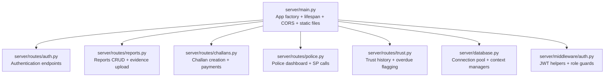

**Diagram sources**
- [main.py:12-103](file://server/main.py#L12-L103)
- [routes/auth.py:1-744](file://server/routes/auth.py#L1-L744)
- [routes/reports.py:1-563](file://server/routes/reports.py#L1-L563)
- [routes/challans.py:1-450](file://server/routes/challans.py#L1-L450)
- [routes/police.py:1-220](file://server/routes/police.py#L1-L220)
- [routes/trust.py:1-134](file://server/routes/trust.py#L1-L134)
- [database.py:1-76](file://server/database.py#L1-L76)
- [middleware/auth.py:1-182](file://server/middleware/auth.py#L1-L182)

**Section sources**
- [main.py:12-103](file://server/main.py#L12-L103)
- [README.md:45-93](file://README.md#L45-L93)

## Core Components
- Async lifespan manager: Initializes logging, ensures upload directories exist, logs startup/shutdown, and yields control to the app lifecycle
- CORS middleware: Allows all origins, credentials, methods, and headers for development
- Static file serving: Serves uploaded evidence images from a mounted directory
- Modular routers: Prefix-based routing with tags for grouping endpoints
- Health check endpoint: Lightweight readiness/liveness probe
- Database connection management: Centralized connection pool with context-managed connections and cursors

**Section sources**
- [main.py:28-103](file://server/main.py#L28-L103)
- [database.py:14-76](file://server/database.py#L14-L76)

## Architecture Overview
The application initializes FastAPI, sets up logging, mounts static files, registers routers with prefixes and tags, and defines a lifespan hook for startup and shutdown tasks. Routers encapsulate domain-specific endpoints and may depend on the shared database module or lightweight middleware.

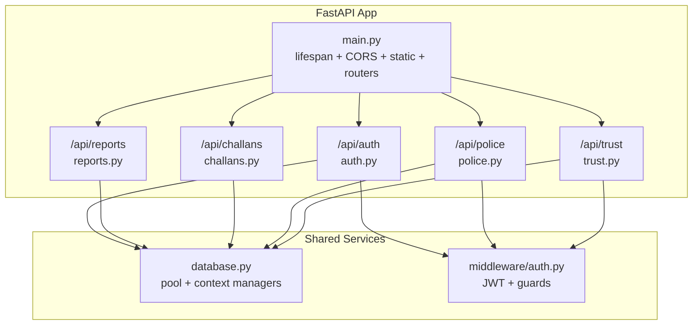

**Diagram sources**
- [main.py:35-103](file://server/main.py#L35-L103)
- [routes/auth.py:1-744](file://server/routes/auth.py#L1-L744)
- [routes/reports.py:1-563](file://server/routes/reports.py#L1-L563)
- [routes/challans.py:1-450](file://server/routes/challans.py#L1-L450)
- [routes/police.py:1-220](file://server/routes/police.py#L1-L220)
- [routes/trust.py:1-134](file://server/routes/trust.py#L1-L134)
- [database.py:1-76](file://server/database.py#L1-L76)
- [middleware/auth.py:1-182](file://server/middleware/auth.py#L1-L182)

## Detailed Component Analysis

### Async Lifespan Manager
The lifespan manager performs:
- Logging configuration at INFO level with a structured format
- Creation of the uploads directory for evidence files
- Startup and shutdown logging messages

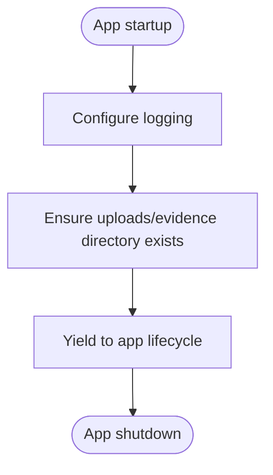

**Diagram sources**
- [main.py:28-47](file://server/main.py#L28-L47)

**Section sources**
- [main.py:28-47](file://server/main.py#L28-L47)

### CORS Middleware Configuration
CORS is configured to allow all origins, credentials, methods, and headers. This is suitable for development but should be restricted in production environments.

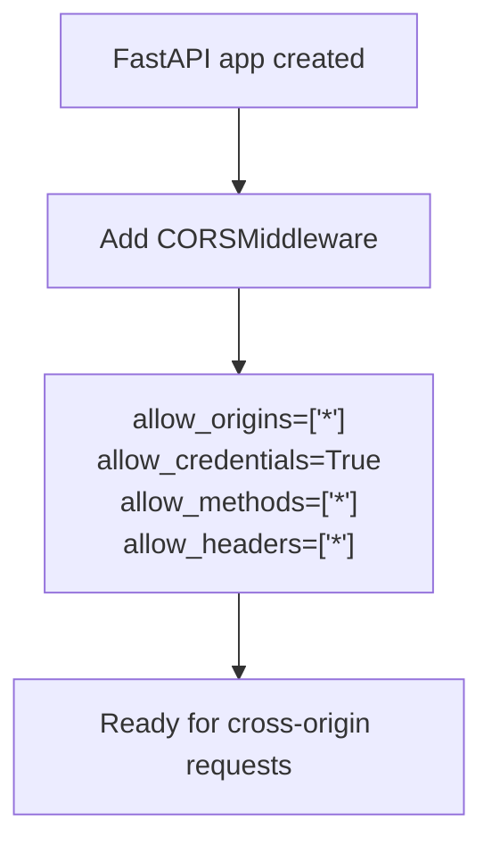

**Diagram sources**
- [main.py:58-67](file://server/main.py#L58-L67)

**Section sources**
- [main.py:58-67](file://server/main.py#L58-L67)

### Static File Serving for Evidence Uploads
Static files are mounted to serve uploaded evidence:
- Directory: uploads
- Mount path: /uploads
- Evidence directory: uploads/evidence

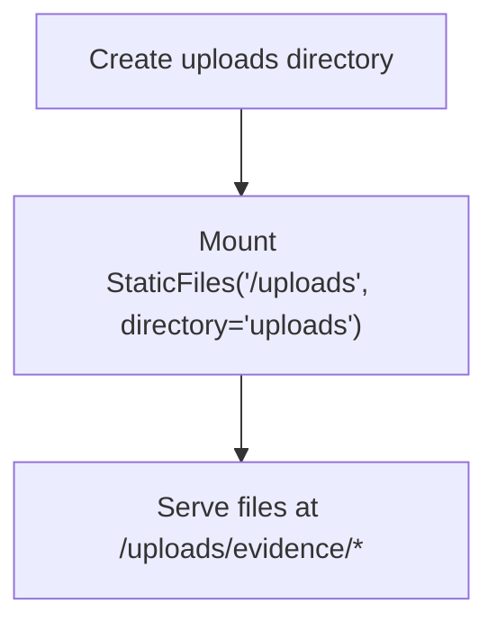

**Diagram sources**
- [main.py:69-72](file://server/main.py#L69-L72)

**Section sources**
- [main.py:69-72](file://server/main.py#L69-L72)

### Modular Router Architecture with Prefixes and Tags
Routers are included with explicit prefixes and tags for clean API organization:
- Authentication: /api/auth
- Analytics: /api/analytics
- Reports: /api/reports
- Challans: /api/challans
- Vehicles: /api/vehicles
- Rules: /api/rules
- Police (optional): /api/police
- Trust & History (optional): /api/trust

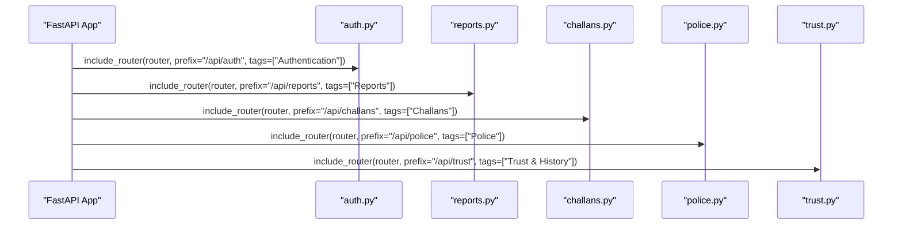

**Diagram sources**
- [main.py:77-86](file://server/main.py#L77-L86)

**Section sources**
- [main.py:77-86](file://server/main.py#L77-L86)

### Health Check Endpoint
A simple GET endpoint returns service metadata for monitoring and health checks.

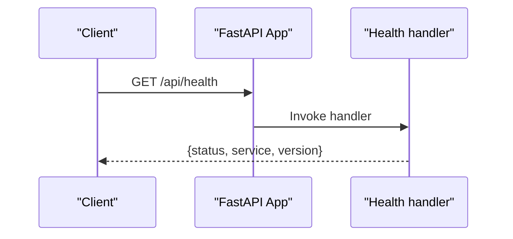

**Diagram sources**
- [main.py:88-95](file://server/main.py#L88-L95)

**Section sources**
- [main.py:88-95](file://server/main.py#L88-L95)

### Database Connection Management
The database module provides:
- A singleton connection pool initialized once at startup
- Context-managed connections and cursors
- Robust error handling with rollback on exceptions

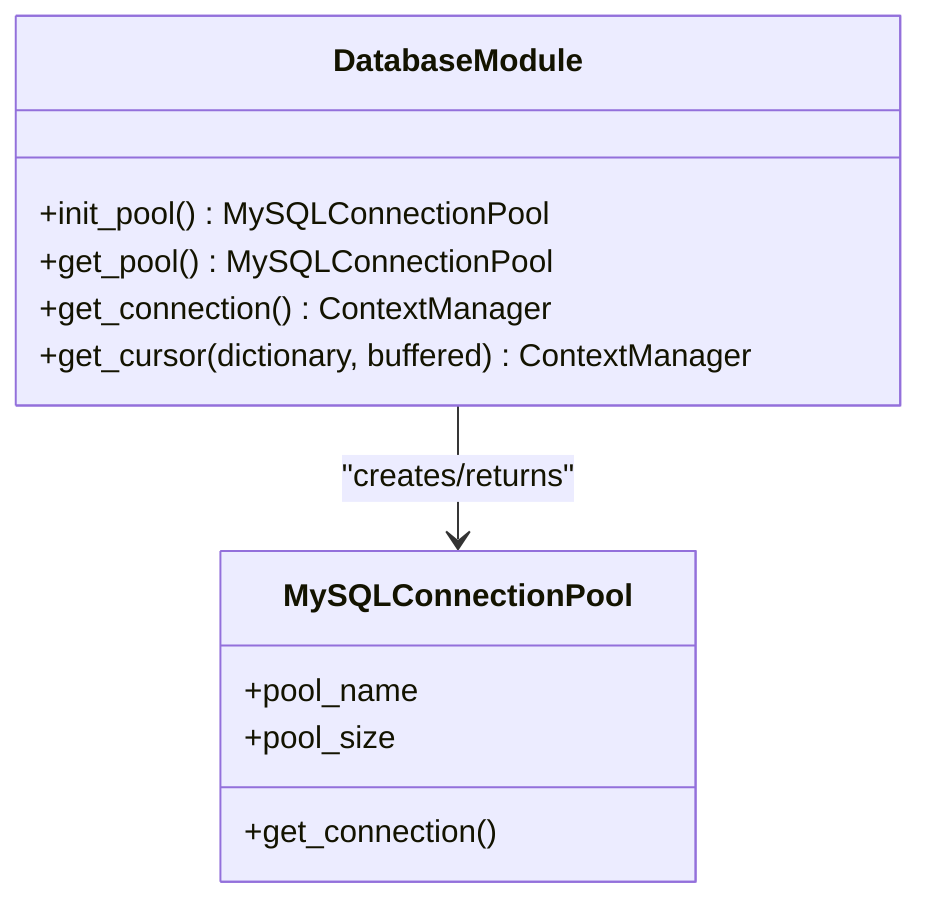

**Diagram sources**
- [database.py:14-76](file://server/database.py#L14-L76)

**Section sources**
- [database.py:14-76](file://server/database.py#L14-L76)

### Error Handling During Route Imports
The main application attempts to import optional routers (police, trust). If import fails, it logs a warning and continues with core routers, preventing startup crashes.

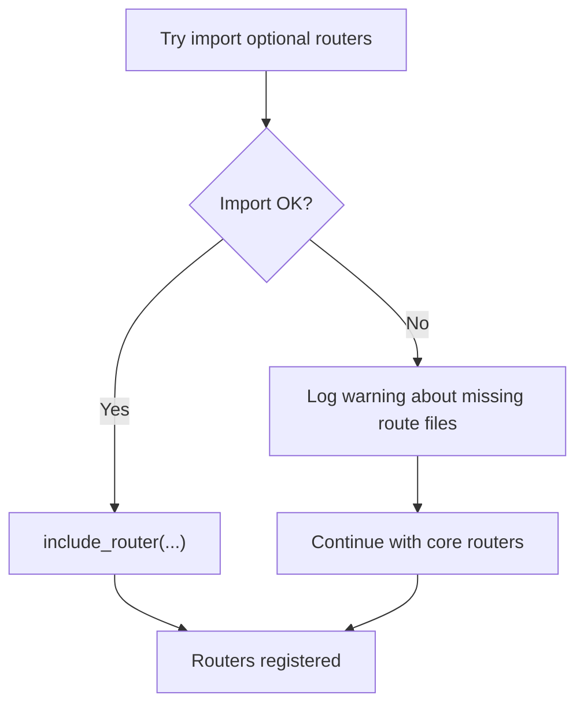

**Diagram sources**
- [main.py:21-26](file://server/main.py#L21-L26)
- [main.py:84-86](file://server/main.py#L84-L86)

**Section sources**
- [main.py:21-26](file://server/main.py#L21-L26)
- [main.py:84-86](file://server/main.py#L84-L86)

### Evidence Upload Flow (Reports Module)
The reports module handles evidence uploads:
- Validates file type and size
- Ensures report exists
- Saves file to uploads/evidence with a unique name
- Updates the report with evidence path

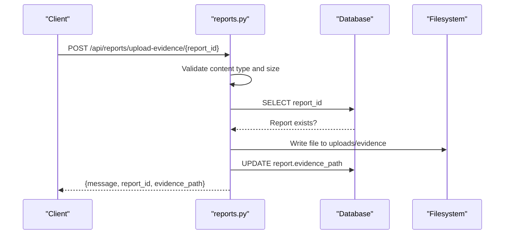

**Diagram sources**
- [routes/reports.py:50-120](file://server/routes/reports.py#L50-L120)

**Section sources**
- [routes/reports.py:50-120](file://server/routes/reports.py#L50-L120)

### Authentication Flow (Routes vs Middleware)
Two authentication-related modules exist:
- routes/auth.py: Self-contained authentication endpoints with PyMySQL and JWT
- middleware/auth.py: Lightweight JWT helpers and role guards used by other routers

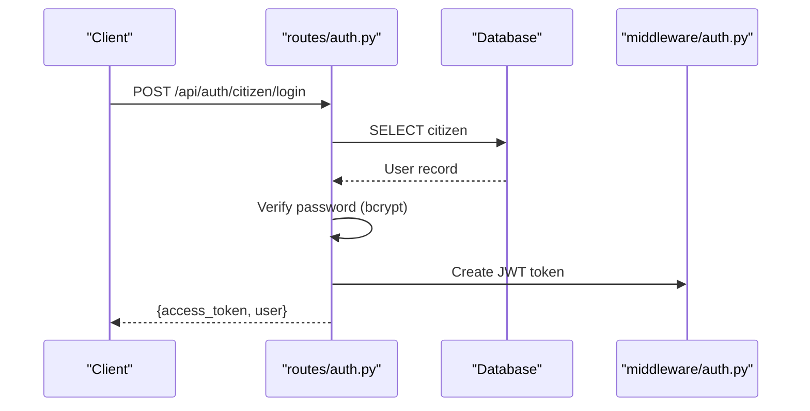

**Diagram sources**
- [routes/auth.py:218-293](file://server/routes/auth.py#L218-L293)
- [middleware/auth.py:45-61](file://server/middleware/auth.py#L45-L61)

**Section sources**
- [routes/auth.py:218-293](file://server/routes/auth.py#L218-L293)
- [middleware/auth.py:45-61](file://server/middleware/auth.py#L45-L61)

### Production Deployment Considerations
- CORS: Restrict allow_origins to trusted frontend domains
- Secrets: Replace hardcoded database credentials with environment variables and secure configuration management
- Static files: Ensure proper file permissions and consider CDN-backed serving
- Logging: Adjust log levels and consider structured logging with external collectors
- Database: Use environment-aware configuration and fail-open/fail-close strategies
- Health checks: Expand health checks to include database connectivity and critical services

[No sources needed since this section provides general guidance]

## Dependency Analysis
The application depends on FastAPI and related packages for async web server capabilities, database connectors, cryptography, and multipart handling. The routes depend on the database module and optionally on the lightweight JWT middleware.

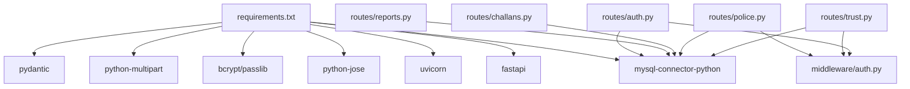

**Diagram sources**
- [requirements.txt:1-12](file://server/requirements.txt#L1-L12)
- [routes/auth.py:1-744](file://server/routes/auth.py#L1-L744)
- [routes/reports.py:1-563](file://server/routes/reports.py#L1-L563)
- [routes/challans.py:1-450](file://server/routes/challans.py#L1-L450)
- [routes/police.py:1-220](file://server/routes/police.py#L1-L220)
- [routes/trust.py:1-134](file://server/routes/trust.py#L1-L134)
- [middleware/auth.py:1-182](file://server/middleware/auth.py#L1-L182)

**Section sources**
- [requirements.txt:1-12](file://server/requirements.txt#L1-L12)

## Performance Considerations
- Use the connection pool to minimize connection overhead
- Keep database operations short and transactional
- Avoid synchronous I/O in hot paths; leverage async FastAPI features
- Monitor upload sizes and enforce limits at the gateway or application level
- Consider caching for read-heavy dashboard endpoints

[No sources needed since this section provides general guidance]

## Troubleshooting Guide
Common startup and runtime issues:
- Database connectivity failures: Verify MySQL is running and credentials are correct
- Missing route modules: Optional routers may be unavailable; the app logs warnings and continues
- CORS errors: Ensure frontend origin matches allowed origins
- Upload failures: Confirm uploads directory permissions and disk space

**Section sources**
- [main.py:21-26](file://server/main.py#L21-L26)
- [main.py:58-67](file://server/main.py#L58-L67)
- [routes/reports.py:50-120](file://server/routes/reports.py#L50-L120)

## Conclusion
The application initializes cleanly with an async lifespan manager, robust logging, and a modular router architecture. CORS is configured permissive for development, static files are served for evidence uploads, and database connections are pooled and context-managed. For production, tighten CORS, manage secrets securely, and expand health checks and logging.

[No sources needed since this section summarizes without analyzing specific files]

## Appendices

### Database Setup Script
A dedicated script initializes the database schema and seed data.

**Section sources**
- [init_db.py:18-179](file://server/init_db.py#L18-L179)

### Root and Health Endpoints
- Root: Returns a simple message and docs link
- Health: Returns service status and version

**Section sources**
- [main.py:98-103](file://server/main.py#L98-L103)
- [main.py:88-95](file://server/main.py#L88-L95)