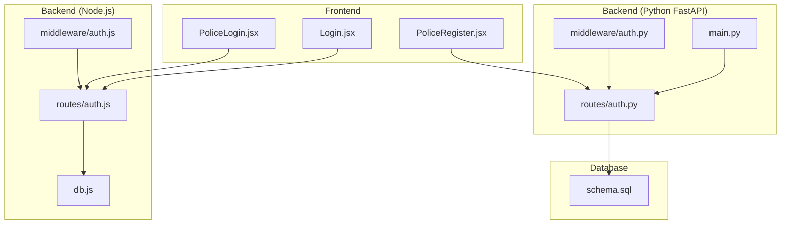
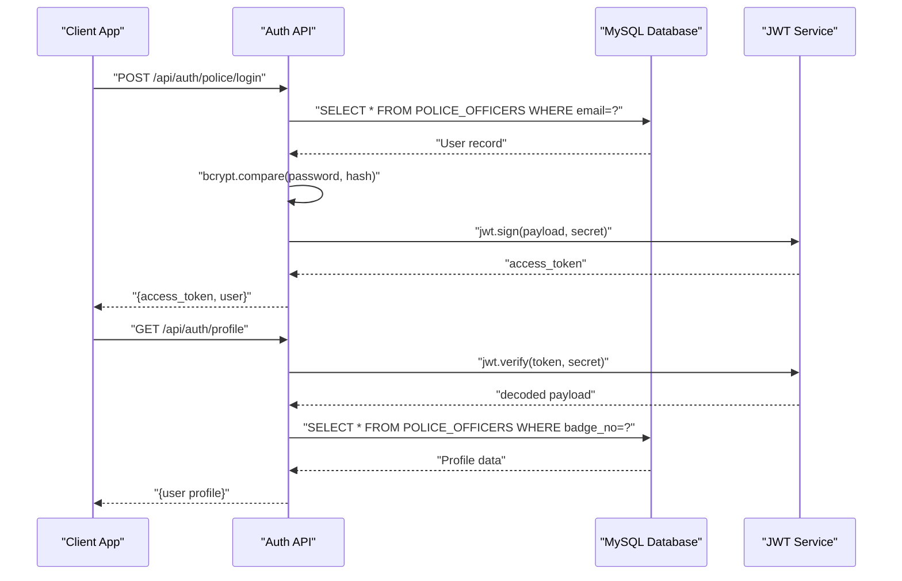
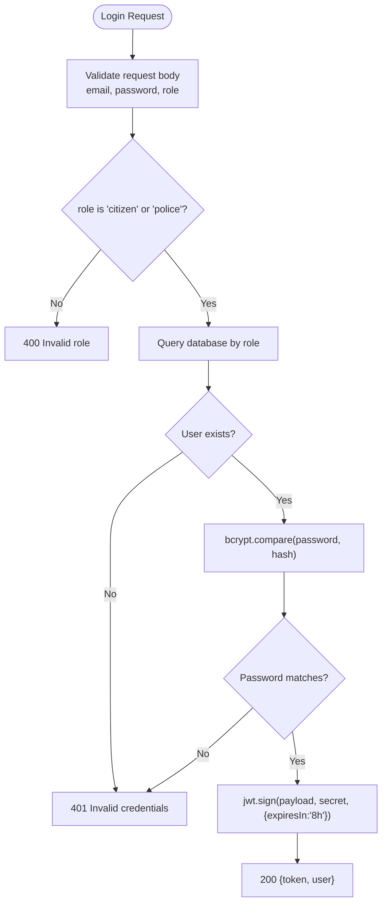
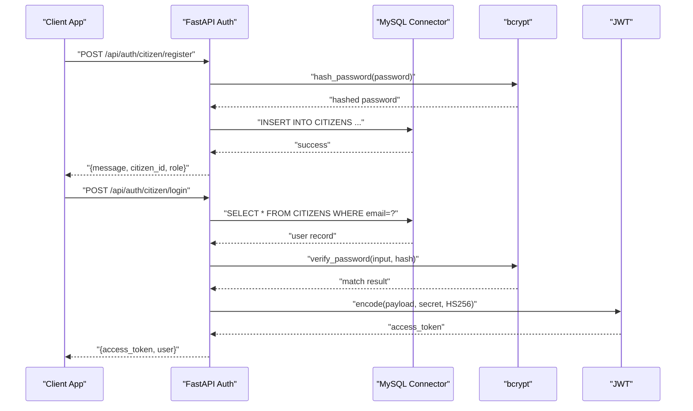
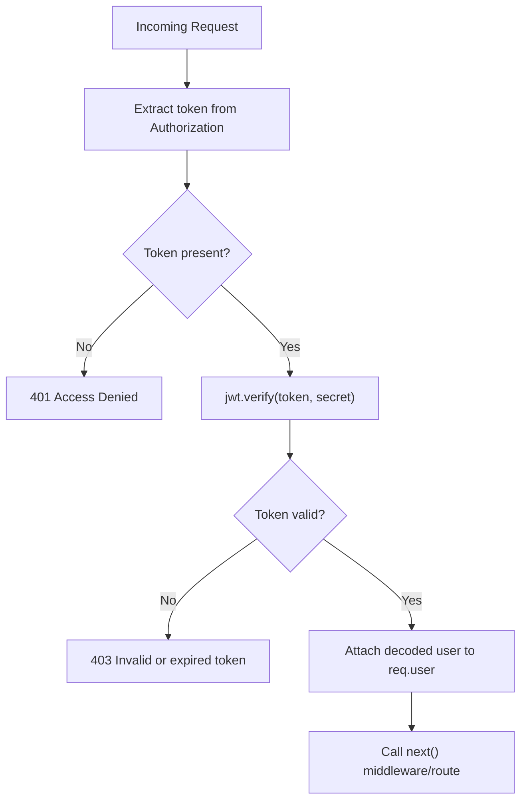
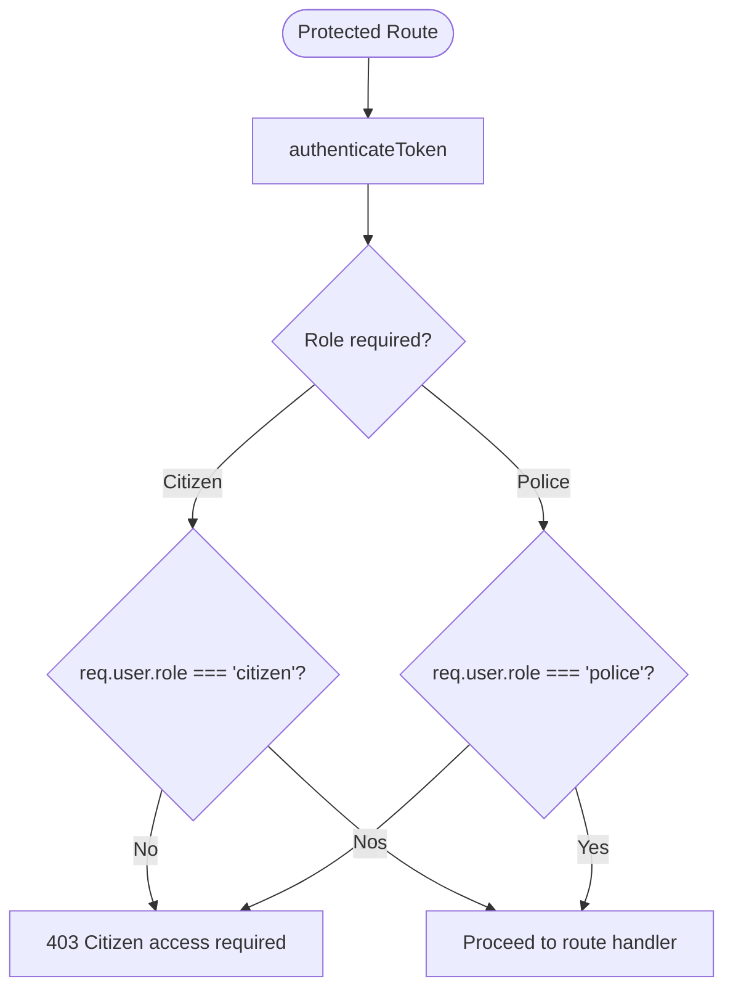
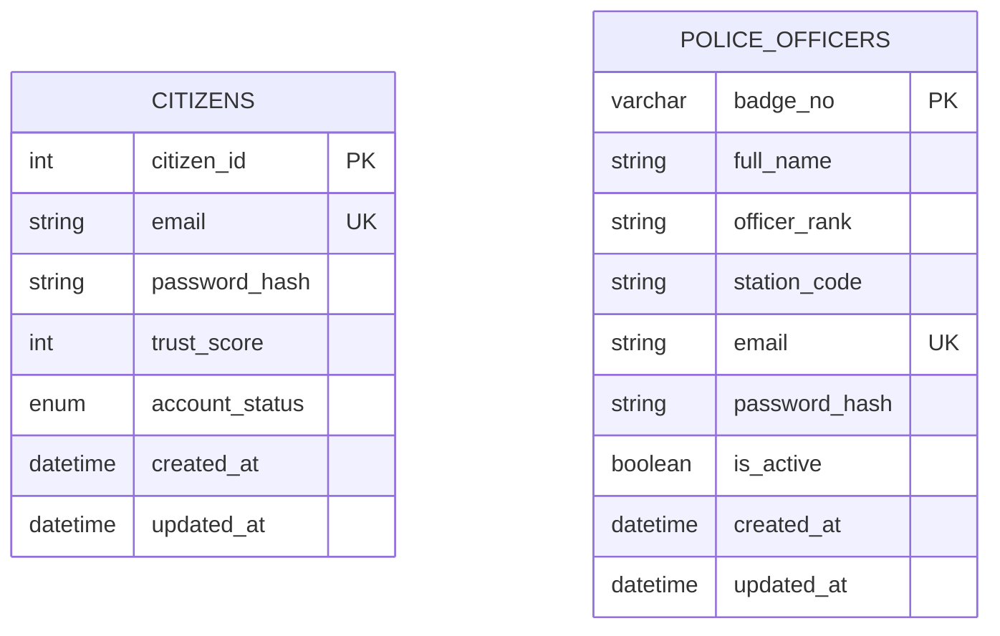
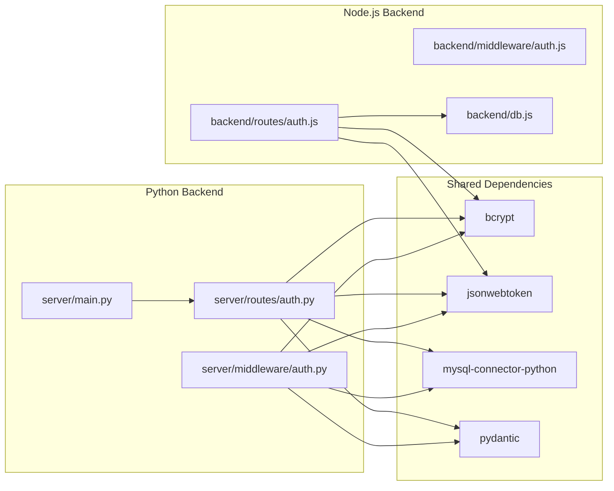

# Authentication Routes

<cite>
**Referenced Files in This Document**
- [backend/routes/auth.js](file://backend/routes/auth.js)
- [backend/middleware/auth.js](file://backend/middleware/auth.js)
- [backend/db.js](file://backend/db.js)
- [server/routes/auth.py](file://server/routes/auth.py)
- [server/middleware/auth.py](file://server/middleware/auth.py)
- [server/main.py](file://server/main.py)
- [db/schema.sql](file://db/schema.sql)
- [frontend/src/pages/PoliceLogin.jsx](file://frontend/src/pages/PoliceLogin.jsx)
- [frontend/src/pages/Login.jsx](file://frontend/src/pages/Login.jsx)
- [frontend/src/pages/PoliceRegister.jsx](file://frontend/src/pages/PoliceRegister.jsx)
- [package.json](file://package.json)
- [server/requirements.txt](file://server/requirements.txt)
</cite>

## Table of Contents
1. [Introduction](#introduction)
2. [Project Structure](#project-structure)
3. [Core Components](#core-components)
4. [Architecture Overview](#architecture-overview)
5. [Detailed Component Analysis](#detailed-component-analysis)
6. [Dependency Analysis](#dependency-analysis)
7. [Performance Considerations](#performance-considerations)
8. [Troubleshooting Guide](#troubleshooting-guide)
9. [Conclusion](#conclusion)
10. [Appendices](#appendices)

## Introduction
This document provides comprehensive API documentation for the authentication routes in the Traffic Violation Management System. It covers:
- Police officer login and registration endpoints
- Citizen login and registration endpoints
- Token-based authentication and middleware
- Role-based access control
- Password hashing with bcrypt
- Error handling strategies
- Practical client implementation guidelines and authentication flow patterns

The system supports two distinct user roles: citizens and police officers, with separate login and registration flows and protected routes.

## Project Structure
The authentication system spans both a Node.js backend and a Python FastAPI backend, each providing complementary authentication endpoints and middleware.

**Diagram sources**
- [backend/routes/auth.js:1-117](file://backend/routes/auth.js#L1-L117)
- [backend/middleware/auth.js:1-37](file://backend/middleware/auth.js#L1-L37)
- [backend/db.js:1-26](file://backend/db.js#L1-L26)
- [server/routes/auth.py:1-744](file://server/routes/auth.py#L1-L744)
- [server/middleware/auth.py:1-182](file://server/middleware/auth.py#L1-L182)
- [server/main.py:77-87](file://server/main.py#L77-L87)
- [db/schema.sql:26-82](file://db/schema.sql#L26-L82)

**Section sources**
- [backend/routes/auth.js:1-117](file://backend/routes/auth.js#L1-L117)
- [backend/middleware/auth.js:1-37](file://backend/middleware/auth.js#L1-L37)
- [backend/db.js:1-26](file://backend/db.js#L1-L26)
- [server/routes/auth.py:1-744](file://server/routes/auth.py#L1-L744)
- [server/middleware/auth.py:1-182](file://server/middleware/auth.py#L1-L182)
- [server/main.py:77-87](file://server/main.py#L77-L87)
- [db/schema.sql:26-82](file://db/schema.sql#L26-L82)

## Core Components
- Node.js Express authentication routes:
  - POST /api/auth/police/login
  - POST /api/auth/citizen/login
  - POST /api/auth/police/register
  - POST /api/auth/citizen/register
  - GET /api/auth/profile
- Python FastAPI authentication routes:
  - POST /api/auth/police/login
  - POST /api/auth/police/register
  - POST /api/auth/citizen/login
  - POST /api/auth/citizen/register
  - GET /api/auth/profile
- Authentication middleware:
  - Token extraction and validation
  - Role-based access control helpers

Key implementation highlights:
- Password hashing with bcrypt
- JWT token generation and verification
- Role-aware user profiles and protected routes
- Comprehensive error handling with appropriate HTTP status codes

**Section sources**
- [backend/routes/auth.js:9-114](file://backend/routes/auth.js#L9-L114)
- [server/routes/auth.py:114-491](file://server/routes/auth.py#L114-L491)
- [backend/middleware/auth.js:5-34](file://backend/middleware/auth.js#L5-L34)
- [server/middleware/auth.py:57-61](file://server/middleware/auth.py#L57-L61)

## Architecture Overview
The authentication architecture separates concerns between:
- Frontend clients (React) that submit login/register requests
- Backend APIs (Node.js and FastAPI) that handle authentication logic
- Database (MySQL) storing user credentials and profiles
- Middleware enforcing token validation and role checks

**Diagram sources**
- [server/routes/auth.py:399-491](file://server/routes/auth.py#L399-L491)
- [server/middleware/auth.py:57-61](file://server/middleware/auth.py#L57-L61)
- [db/schema.sql:70-82](file://db/schema.sql#L70-L82)

**Section sources**
- [server/routes/auth.py:399-491](file://server/routes/auth.py#L399-L491)
- [server/middleware/auth.py:57-61](file://server/middleware/auth.py#L57-L61)
- [db/schema.sql:70-82](file://db/schema.sql#L70-L82)

## Detailed Component Analysis

### Node.js Authentication Routes
The Node.js backend provides:
- POST /api/auth/police/login: Authenticate police officers
- POST /api/auth/citizen/login: Authenticate citizens
- POST /api/auth/police/register: Register new police officers
- POST /api/auth/citizen/register: Register new citizens
- GET /api/auth/profile: Retrieve current user profile

Implementation details:
- Uses bcrypt for password comparison
- Generates JWT tokens with 8-hour expiry
- Supports role-based routing and user selection
- Returns role-specific user data

**Diagram sources**
- [backend/routes/auth.js:9-76](file://backend/routes/auth.js#L9-L76)

**Section sources**
- [backend/routes/auth.js:9-114](file://backend/routes/auth.js#L9-L114)
- [backend/db.js:1-26](file://backend/db.js#L1-L26)

### Python FastAPI Authentication Routes
The FastAPI backend provides:
- POST /api/auth/police/login: Authenticate police officers
- POST /api/auth/police/register: Register new police officers
- POST /api/auth/citizen/login: Authenticate citizens
- POST /api/auth/citizen/register: Register new citizens
- GET /api/auth/profile: Retrieve current user profile

Implementation details:
- Uses bcrypt for password hashing and verification
- Generates JWT tokens with 24-hour expiry
- Enforces password policies (minimum length, presence of uppercase, lowercase, digit)
- Handles database transactions with commit/rollback
- Supports role-aware profile retrieval

**Diagram sources**
- [server/routes/auth.py:114-216](file://server/routes/auth.py#L114-L216)
- [server/routes/auth.py:218-293](file://server/routes/auth.py#L218-L293)

**Section sources**
- [server/routes/auth.py:114-491](file://server/routes/auth.py#L114-L491)
- [server/main.py:77-87](file://server/main.py#L77-L87)

### Authentication Middleware
Both backends implement middleware for:
- Token extraction from Authorization header
- JWT verification and decoding
- Role-based access control (requireCitizen, requirePolice)
- Error handling for missing/expired tokens

**Diagram sources**
- [backend/middleware/auth.js:5-20](file://backend/middleware/auth.js#L5-L20)
- [server/middleware/auth.py:57-61](file://server/middleware/auth.py#L57-L61)

**Section sources**
- [backend/middleware/auth.js:5-34](file://backend/middleware/auth.js#L5-L34)
- [server/middleware/auth.py:57-61](file://server/middleware/auth.py#L57-L61)

### Protected Route Access Patterns
Protected routes use role-based middleware:
- authenticateToken: Validates JWT and attaches user
- requireCitizen: Ensures user role is citizen
- requirePolice: Ensures user role is police

**Diagram sources**
- [backend/middleware/auth.js:22-34](file://backend/middleware/auth.js#L22-L34)
- [server/middleware/auth.py:1-182](file://server/middleware/auth.py#L1-L182)

**Section sources**
- [backend/middleware/auth.js:22-34](file://backend/middleware/auth.js#L22-L34)
- [server/middleware/auth.py:1-182](file://server/middleware/auth.py#L1-L182)

### Database Schema and User Models
Authentication relies on the following database tables:
- CITIZENS: Stores citizen accounts with password_hash, trust_score, account_status
- POLICE_OFFICERS: Stores police officer accounts with password_hash, badge_no, is_active

**Diagram sources**
- [db/schema.sql:26-43](file://db/schema.sql#L26-L43)
- [db/schema.sql:70-82](file://db/schema.sql#L70-L82)

**Section sources**
- [db/schema.sql:26-82](file://db/schema.sql#L26-L82)

## Dependency Analysis
Authentication depends on:
- bcrypt for password hashing/verification
- jsonwebtoken for JWT token handling
- MySQL connector for database access
- Pydantic for request/response validation

**Diagram sources**
- [backend/routes/auth.js:1-5](file://backend/routes/auth.js#L1-L5)
- [backend/middleware/auth.js](file://backend/middleware/auth.js#L1)
- [backend/db.js](file://backend/db.js#L1)
- [server/routes/auth.py:8-12](file://server/routes/auth.py#L8-L12)
- [server/middleware/auth.py:8-12](file://server/middleware/auth.py#L8-L12)
- [server/main.py:13-22](file://server/main.py#L13-L22)

**Section sources**
- [backend/routes/auth.js:1-5](file://backend/routes/auth.js#L1-L5)
- [backend/middleware/auth.js](file://backend/middleware/auth.js#L1)
- [backend/db.js](file://backend/db.js#L1)
- [server/routes/auth.py:8-12](file://server/routes/auth.py#L8-L12)
- [server/middleware/auth.py:8-12](file://server/middleware/auth.py#L8-L12)
- [server/main.py:13-22](file://server/main.py#L13-L22)
- [package.json:15-19](file://package.json#L15-L19)
- [server/requirements.txt:1-12](file://server/requirements.txt#L1-L12)

## Performance Considerations
- Password hashing runs in threadpool to prevent blocking (FastAPI implementation)
- JWT token verification is lightweight compared to database queries
- Database connections use connection pooling (Node.js) and connection pooling (FastAPI)
- Token expiration reduces long-term storage overhead
- Consider implementing rate limiting for login attempts to prevent brute force attacks

## Troubleshooting Guide
Common authentication issues and resolutions:
- Invalid credentials: Check email format, password length, and account status
- Invalid token: Verify Authorization header format (Bearer token), token expiration, and signing secret
- Database connectivity: Confirm MySQL service is running and credentials are correct
- CORS issues: Ensure frontend origin is allowed in CORS configuration
- Password policy violations: Ensure passwords meet minimum length and character requirements

**Section sources**
- [server/routes/auth.py:218-293](file://server/routes/auth.py#L218-L293)
- [backend/routes/auth.js:10-76](file://backend/routes/auth.js#L10-L76)
- [server/middleware/auth.py:57-61](file://server/middleware/auth.py#L57-L61)
- [backend/middleware/auth.js:5-20](file://backend/middleware/auth.js#L5-L20)

## Conclusion
The authentication system provides robust, role-based access control with secure password handling and token-based session management. Both Node.js and FastAPI backends offer comprehensive authentication flows with clear separation of concerns and strong error handling. The system supports scalable growth with modular middleware and database-first design.

## Appendices

### API Reference

#### Node.js Endpoints
- POST /api/auth/police/login
  - Request: { email, password, role: "police" }
  - Response: { token, user: { id, name, email, role: "police", badge_number, station } }
- POST /api/auth/citizen/login
  - Request: { email, password, role: "citizen" }
  - Response: { token, user: { id, name, email, role: "citizen", trust_score } }
- GET /api/auth/profile
  - Request: Authorization: Bearer <token>
  - Response: { user profile based on role }

#### Python FastAPI Endpoints
- POST /api/auth/police/login
  - Request: { email, password }
  - Response: { access_token, token_type: "bearer", user: { id, full_name, email, role: "police", badge_number, station, rank } }
- POST /api/auth/citizen/login
  - Request: { email, password }
  - Response: { access_token, token_type: "bearer", user: { id, full_name, email, role: "citizen", trust_score } }
- POST /api/auth/police/register
  - Request: { full_name, email, phone_no, password, confirm_password }
  - Response: { message, badge_no, full_name, email, role: "police" }
- POST /api/auth/citizen/register
  - Request: { full_name, email, phone_no, password, confirm_password, plate_no, vehicle_type, vehicle_model }
  - Response: { message, citizen_id, full_name, email, role: "citizen" }
- GET /api/auth/profile
  - Request: Authorization: Bearer <token>
  - Response: { user profile based on role }

### Client Implementation Guidelines
- Store tokens securely (localStorage/sessionStorage)
- Always send Authorization: Bearer <token> header for protected routes
- Implement automatic token refresh if needed
- Handle token expiration gracefully by redirecting to login
- Validate user roles before accessing protected features

**Section sources**
- [frontend/src/pages/PoliceLogin.jsx:25-68](file://frontend/src/pages/PoliceLogin.jsx#L25-L68)
- [frontend/src/pages/Login.jsx:26-69](file://frontend/src/pages/Login.jsx#L26-L69)
- [frontend/src/pages/PoliceRegister.jsx:103-143](file://frontend/src/pages/PoliceRegister.jsx#L103-L143)