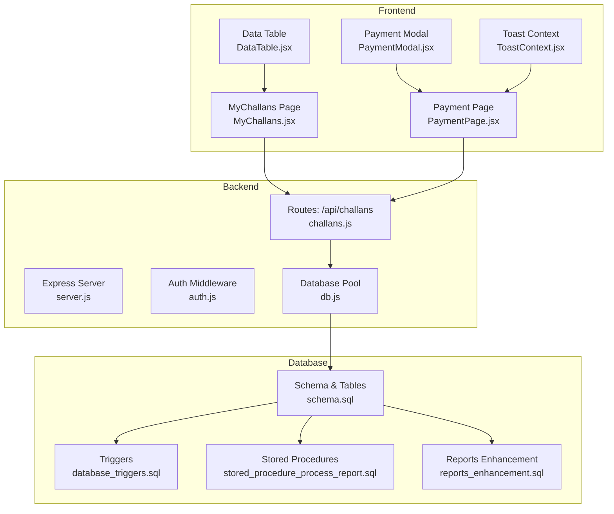
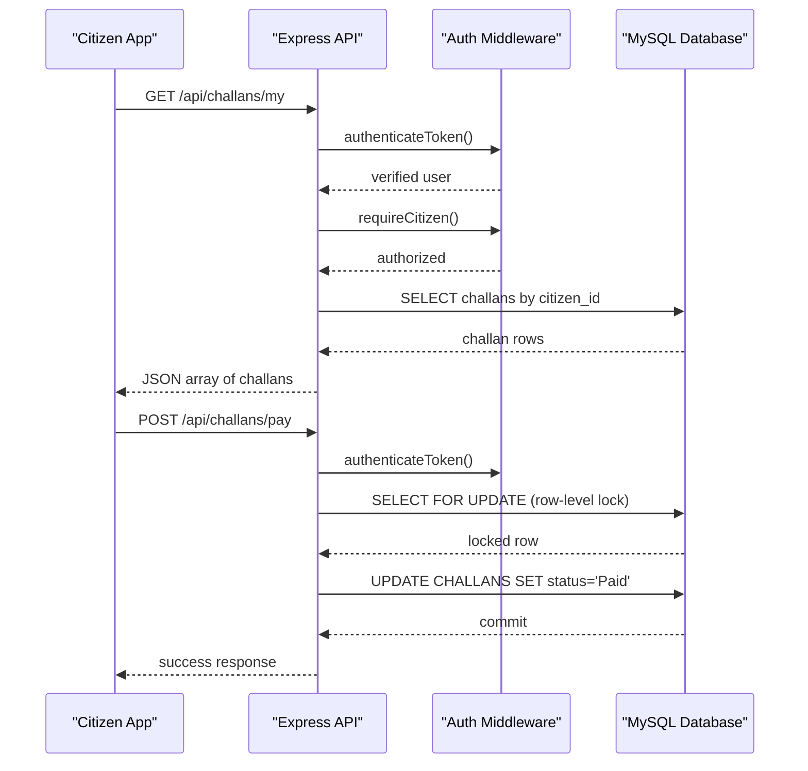
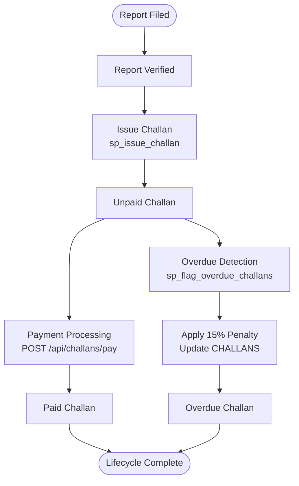
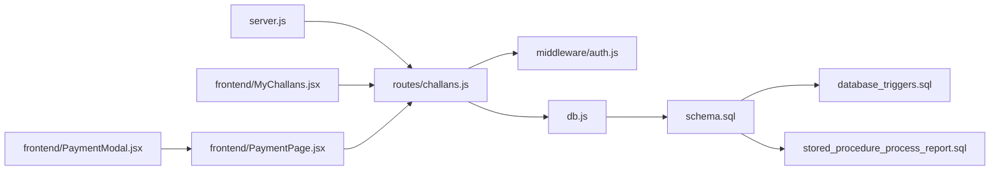

# Challans System

<cite>
**Referenced Files in This Document**
- [server.js](file://backend/server.js)
- [challans.js](file://backend/routes/challans.js)
- [auth.js](file://backend/middleware/auth.js)
- [db.js](file://backend/db.js)
- [schema.sql](file://db/schema.sql)
- [database_triggers.sql](file://db/database_triggers.sql)
- [stored_procedure_process_report.sql](file://db/stored_procedure_process_report.sql)
- [reports_enhancement.sql](file://db/reports_enhancement.sql)
- [MyChallans.jsx](file://frontend/src/pages/MyChallans.jsx)
- [PaymentPage.jsx](file://frontend/src/pages/PaymentPage.jsx)
- [PaymentModal.jsx](file://frontend/src/components/PaymentModal.jsx)
- [DataTable.jsx](file://frontend/src/components/DataTable.jsx)
- [ToastContext.jsx](file://frontend/src/context/ToastContext.jsx)
</cite>

## Table of Contents
1. [Introduction](#introduction)
2. [Project Structure](#project-structure)
3. [Core Components](#core-components)
4. [Architecture Overview](#architecture-overview)
5. [Detailed Component Analysis](#detailed-component-analysis)
6. [Dependency Analysis](#dependency-analysis)
7. [Performance Considerations](#performance-considerations)
8. [Troubleshooting Guide](#troubleshooting-guide)
9. [Conclusion](#conclusion)
10. [Appendices](#appendices)

## Introduction
This document provides comprehensive API documentation for the challans system, focusing on challan generation, payment processing, and overdue penalty calculation. It covers:
- REST endpoints for fetching challans, processing payments, and managing challan history
- Request/response schemas for challan data structures, payment information, and penalty calculations
- Integration with database triggers for automated challan generation, payment validation, and status updates
- Challan search and filtering capabilities
- Payment gateway integration patterns
- Examples of challan lifecycle management from generation to completion

## Project Structure
The system consists of:
- Backend API built with Express.js exposing REST endpoints for challans
- MySQL database with normalized schema, triggers, stored procedures, and views
- Frontend React application for citizen and police portals

**Diagram sources**
- [server.js:1-42](file://backend/server.js#L1-L42)
- [challans.js:1-101](file://backend/routes/challans.js#L1-L101)
- [auth.js:1-37](file://backend/middleware/auth.js#L1-L37)
- [db.js:1-26](file://backend/db.js#L1-L26)
- [schema.sql:170-236](file://db/schema.sql#L170-L236)
- [database_triggers.sql:1-48](file://db/database_triggers.sql#L1-L48)
- [stored_procedure_process_report.sql:1-115](file://db/stored_procedure_process_report.sql#L1-L115)
- [reports_enhancement.sql:14-47](file://db/reports_enhancement.sql#L14-L47)
- [MyChallans.jsx:1-207](file://frontend/src/pages/MyChallans.jsx#L1-L207)
- [PaymentPage.jsx:1-529](file://frontend/src/pages/PaymentPage.jsx#L1-L529)
- [PaymentModal.jsx:1-99](file://frontend/src/components/PaymentModal.jsx#L1-L99)
- [DataTable.jsx:1-37](file://frontend/src/components/DataTable.jsx#L1-L37)
- [ToastContext.jsx:1-113](file://frontend/src/context/ToastContext.jsx#L1-L113)

**Section sources**
- [server.js:1-42](file://backend/server.js#L1-L42)
- [challans.js:1-101](file://backend/routes/challans.js#L1-L101)
- [schema.sql:170-236](file://db/schema.sql#L170-L236)

## Core Components
- REST API endpoints for challans
- Authentication and role-based access control
- Database schema with triggers and stored procedures
- Frontend pages for challan management and payment

Key responsibilities:
- Challan retrieval and payment processing
- Automated trust score and penalty adjustments
- Real-time synchronization and user feedback

**Section sources**
- [challans.js:7-29](file://backend/routes/challans.js#L7-L29)
- [challans.js:31-98](file://backend/routes/challans.js#L31-L98)
- [auth.js:5-34](file://backend/middleware/auth.js#L5-L34)
- [schema.sql:170-236](file://db/schema.sql#L170-L236)

## Architecture Overview
The system follows a layered architecture:
- Presentation layer: React frontend
- Application layer: Express routes and middleware
- Data layer: MySQL with triggers and stored procedures

**Diagram sources**
- [challans.js:8-29](file://backend/routes/challans.js#L8-L29)
- [challans.js:32-98](file://backend/routes/challans.js#L32-L98)
- [auth.js:5-34](file://backend/middleware/auth.js#L5-L34)
- [schema.sql:170-195](file://db/schema.sql#L170-L195)

## Detailed Component Analysis

### REST API Endpoints

#### GET /api/challans/my
- Purpose: Fetch logged-in citizen's challans
- Authentication: Required (Citizen)
- Query parameters: None (uses authenticated user)
- Response: Array of challan objects ordered by issued_at descending

Response schema (object per challan):
- challan_id: integer
- amount: decimal (total_amount)
- status: string (payment_status)
- issued_at: datetime
- paid_at: datetime (nullable)
- rule_code: string
- violation_description: string
- issued_by_officer: string (officer name)

Error responses:
- 401 Unauthorized (no token)
- 403 Forbidden (invalid/expired token or non-citizen)
- 500 Internal Server Error

**Section sources**
- [challans.js:7-29](file://backend/routes/challans.js#L7-L29)
- [auth.js:5-27](file://backend/middleware/auth.js#L5-L27)

#### POST /api/challans/pay
- Purpose: Process challan payment with row-level locking
- Authentication: Required (Citizen)
- Request body:
  - challan_id: integer (required)
- Response:
  - message: string
  - challan_id: integer
  - amount_paid: decimal
  - paid_at: datetime (ISO string)

Validation and error handling:
- 400 Bad Request: challan_id missing
- 404 Not Found: challan not found
- 403 Forbidden: challan does not belong to citizen
- 409 Conflict: challan already paid
- 500 Internal Server Error: transaction failure

Payment flow:
- Begin transaction
- SELECT FOR UPDATE on CHALLANS row
- Validate ownership and status
- UPDATE to Paid with paid_at timestamp
- Commit transaction

**Section sources**
- [challans.js:31-98](file://backend/routes/challans.js#L31-L98)
- [auth.js:5-27](file://backend/middleware/auth.js#L5-L27)

### Database Schema and Triggers

#### Core Tables
- CHALLANS: Stores challan records with payment_status, amounts, due dates, and audit columns
- CHALLANS_HISTORY: Temporal audit trail for challan changes
- OVERDUE_LOG: Ledger for flagged overdue challans

Key constraints and indexes:
- Foreign keys to VIOLATION_EVENTS, CITIZENS, POLICE_OFFICERS
- Indexes on payment_status, citizen_id, due_date, issue_date

**Section sources**
- [schema.sql:170-236](file://db/schema.sql#L170-L236)

#### Triggers
- Auto-reward and auto-penalty system for trust score adjustments based on report status changes
- Automatic capture of CHALLANS updates into CHALLANS_HISTORY

**Section sources**
- [database_triggers.sql:8-35](file://db/database_triggers.sql#L8-L35)
- [schema.sql:384-429](file://db/schema.sql#L384-L429)

#### Stored Procedures
- sp_issue_challan: Safe challan generation with full transaction and validation
- sp_pay_challan: Payment processing with row-level locking and reward points
- sp_flag_overdue_challans: Cursor-based procedure to flag overdue challans with 15% penalty

**Section sources**
- [stored_procedure_process_report.sql:8-98](file://db/stored_procedure_process_report.sql#L8-L98)
- [schema.sql:436-630](file://db/schema.sql#L436-L630)

### Frontend Integration

#### MyChallans Page
- Fetches challans via GET /api/challans/my
- Displays summary cards (total, unpaid, total due)
- Shows challan table with status badges and actions
- Auto-refreshes every 3 seconds

**Section sources**
- [MyChallans.jsx:14-67](file://frontend/src/pages/MyChallans.jsx#L14-L67)
- [MyChallans.jsx:158-199](file://frontend/src/pages/MyChallans.jsx#L158-L199)

#### Payment Page
- Validates terms and conditions before payment
- Simulates payment processing and redirects to success screen
- Integrates with PUT /api/challans/pay (note: route path differs in frontend)

**Section sources**
- [PaymentPage.jsx:46-80](file://frontend/src/pages/PaymentPage.jsx#L46-L80)
- [PaymentPage.jsx:23-44](file://frontend/src/pages/PaymentPage.jsx#L23-L44)

#### Payment Modal
- Presents challan details and payment confirmation
- Handles loading states and error messages

**Section sources**
- [PaymentModal.jsx:10-22](file://frontend/src/components/PaymentModal.jsx#L10-L22)
- [PaymentModal.jsx:33-43](file://frontend/src/components/PaymentModal.jsx#L33-L43)

### Challan Lifecycle Management
End-to-end flow from generation to completion:

**Diagram sources**
- [stored_procedure_process_report.sql:8-98](file://db/stored_procedure_process_report.sql#L8-L98)
- [challans.js:31-98](file://backend/routes/challans.js#L31-L98)
- [schema.sql:688-754](file://db/schema.sql#L688-L754)

## Dependency Analysis

**Diagram sources**
- [server.js:1-42](file://backend/server.js#L1-L42)
- [challans.js:1-101](file://backend/routes/challans.js#L1-L101)
- [auth.js:1-37](file://backend/middleware/auth.js#L1-L37)
- [db.js:1-26](file://backend/db.js#L1-L26)
- [schema.sql:1-100](file://db/schema.sql#L1-L100)
- [database_triggers.sql:1-48](file://db/database_triggers.sql#L1-L48)
- [stored_procedure_process_report.sql:1-115](file://db/stored_procedure_process_report.sql#L1-L115)
- [MyChallans.jsx:1-207](file://frontend/src/pages/MyChallans.jsx#L1-L207)
- [PaymentPage.jsx:1-529](file://frontend/src/pages/PaymentPage.jsx#L1-L529)
- [PaymentModal.jsx:1-99](file://frontend/src/components/PaymentModal.jsx#L1-L99)

**Section sources**
- [server.js:22-26](file://backend/server.js#L22-L26)
- [challans.js:1-5](file://backend/routes/challans.js#L1-L5)

## Performance Considerations
- Row-level locking prevents race conditions during payment processing
- Database indexes on payment_status, citizen_id, due_date improve query performance
- Stored procedures encapsulate ACID transactions and reduce application-level complexity
- Frontend auto-refresh intervals balance real-time updates with resource usage

## Troubleshooting Guide
Common issues and resolutions:
- Authentication failures: Ensure valid JWT token is included in Authorization header
- Payment conflicts: Verify challan status is Unpaid and belongs to the authenticated citizen
- Database connectivity: Check MySQL connection pool configuration and credentials
- Frontend errors: Use toast notifications and browser developer tools to inspect API responses

**Section sources**
- [auth.js:9-19](file://backend/middleware/auth.js#L9-L19)
- [challans.js:53-72](file://backend/routes/challans.js#L53-L72)
- [db.js:15-23](file://backend/db.js#L15-L23)
- [ToastContext.jsx:16-32](file://frontend/src/context/ToastContext.jsx#L16-L32)

## Conclusion
The challans system provides a robust, database-driven solution for traffic violation management with:
- Secure payment processing using row-level locking
- Automated trust scoring and penalty systems
- Real-time synchronization and user-friendly interfaces
- Extensible architecture supporting future enhancements

## Appendices

### API Definitions

#### GET /api/challans/my
- Authentication: Required (Citizen)
- Response: Array of challan objects
- Sorting: issued_at DESC

#### POST /api/challans/pay
- Authentication: Required (Citizen)
- Request body: { challan_id: integer }
- Response: { message, challan_id, amount_paid, paid_at }

### Data Models

#### Challan Object
- challan_id: integer
- total_amount: decimal
- payment_status: enum(Unpaid, Paid, Overdue, Waived, Disputed)
- issue_date: date
- due_date: date
- paid_at: datetime (nullable)
- transaction_ref: string (nullable)
- rule_code: string
- violation_description: string
- issued_by_officer: string

#### Overdue Log Entry
- log_id: integer
- challan_id: integer
- citizen_id: integer
- flagged_at: datetime
- original_amount: decimal
- penalty_amount: decimal
- notes: text

**Section sources**
- [schema.sql:170-236](file://db/schema.sql#L170-L236)
- [schema.sql:222-235](file://db/schema.sql#L222-L235)