# FastAPI Backend (Police/Admin)

<cite>
**Referenced Files in This Document**
- [main.py](file://server/main.py)
- [database.py](file://server/database.py)
- [requirements.txt](file://server/requirements.txt)
- [init_db.py](file://server/init_db.py)
- [routes/auth.py](file://server/routes/auth.py)
- [routes/analytics.py](file://server/routes/analytics.py)
- [routes/reports.py](file://server/routes/reports.py)
- [routes/challans.py](file://server/routes/challans.py)
- [routes/vehicles.py](file://server/routes/vehicles.py)
- [routes/rules.py](file://server/routes/rules.py)
- [routes/police.py](file://server/routes/police.py)
- [routes/trust.py](file://server/routes/trust.py)
- [middleware/auth.py](file://server/middleware/auth.py)
</cite>

## Table of Contents
1. [Introduction](#introduction)
2. [Project Structure](#project-structure)
3. [Core Components](#core-components)
4. [Architecture Overview](#architecture-overview)
5. [Detailed Component Analysis](#detailed-component-analysis)
6. [Dependency Analysis](#dependency-analysis)
7. [Performance Considerations](#performance-considerations)
8. [Troubleshooting Guide](#troubleshooting-guide)
9. [Conclusion](#conclusion)
10. [Appendices](#appendices)

## Introduction
This document describes the FastAPI backend for a Traffic Violation Management System tailored for police and administrative functions. It covers application initialization, middleware configuration (including CORS), static file serving for evidence uploads, modular router architecture, dependency injection patterns, database connection management, error handling strategies, health checks, logging, and application lifecycle management. It also provides practical examples of route registration, prefix-based routing, tag-based organization, security considerations, performance optimizations, and production deployment configurations.

## Project Structure
The backend is organized around a FastAPI application with modular routers grouped by domain:
- Application entrypoint initializes FastAPI, middleware, static files, and registers routers.
- Routers encapsulate feature domains: authentication, analytics, reports, challans, vehicles, rules, police, and trust.
- Database utilities provide a pooled connection and context-managed cursors.
- A separate initialization script sets up database schemas and tables.

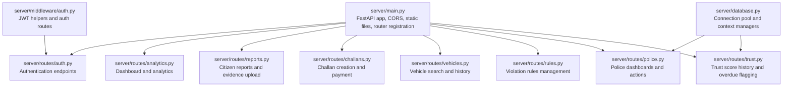

**Diagram sources**
- [main.py:49-103](file://server/main.py#L49-L103)
- [routes/auth.py:1-14](file://server/routes/auth.py#L1-L14)
- [routes/analytics.py:1-10](file://server/routes/analytics.py#L1-L10)
- [routes/reports.py:1-14](file://server/routes/reports.py#L1-L14)
- [routes/challans.py:1-11](file://server/routes/challans.py#L1-L11)
- [routes/vehicles.py:1-8](file://server/routes/vehicles.py#L1-L8)
- [routes/rules.py:1-11](file://server/routes/rules.py#L1-L11)
- [routes/police.py:1-14](file://server/routes/police.py#L1-L14)
- [routes/trust.py:1-12](file://server/routes/trust.py#L1-L12)
- [database.py:1-12](file://server/database.py#L1-L12)
- [middleware/auth.py:1-15](file://server/middleware/auth.py#L1-L15)

**Section sources**
- [main.py:49-103](file://server/main.py#L49-L103)

## Core Components
- Application initialization and lifecycle:
  - Uses an async lifespan manager to prepare the uploads directory and log startup/shutdown.
  - Registers CORS middleware globally to allow all origins, credentials, methods, and headers.
  - Mounts static files under /uploads for evidence storage.
  - Includes routers with prefix and tag metadata for clean API organization.
  - Exposes health and root endpoints.
- Database connectivity:
  - Centralized MySQL connection pool with context-managed connections and cursors.
  - Provides get_cursor() for dependency injection-style usage across routers.
- Logging:
  - Configured at INFO level with a structured format and named loggers for modules.

Practical examples:
- Route registration pattern with prefix and tags:
  - Example: [main.py:77-86](file://server/main.py#L77-L86)
- Static file serving:
  - Example: [main.py:69-72](file://server/main.py#L69-L72)
- Health check endpoint:
  - Example: [main.py:88-95](file://server/main.py#L88-L95)
- Lifespan startup/shutdown:
  - Example: [main.py:35-47](file://server/main.py#L35-L47)

**Section sources**
- [main.py:28-103](file://server/main.py#L28-L103)
- [database.py:14-76](file://server/database.py#L14-L76)

## Architecture Overview
The system follows a layered architecture:
- Presentation layer: FastAPI routers expose REST endpoints.
- Domain layer: Each router encapsulates a bounded context (auth, reports, challans, etc.).
- Persistence layer: Shared database utilities provide pooled connections and cursors.
- Security layer: JWT-based authentication and role-gated endpoints.

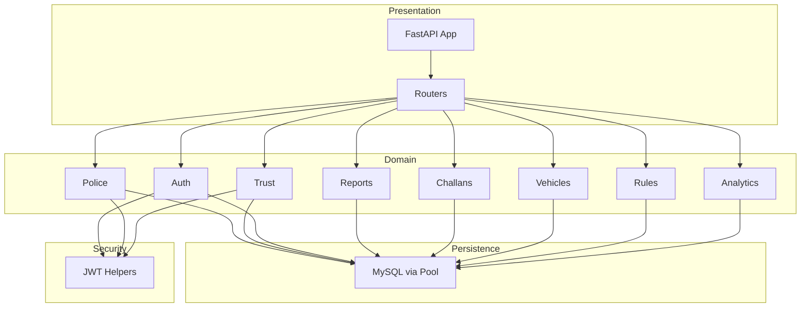

**Diagram sources**
- [main.py:77-95](file://server/main.py#L77-L95)
- [routes/police.py:1-14](file://server/routes/police.py#L1-L14)
- [routes/trust.py:1-12](file://server/routes/trust.py#L1-L12)
- [routes/auth.py:1-14](file://server/routes/auth.py#L1-L14)
- [routes/reports.py:1-14](file://server/routes/reports.py#L1-L14)
- [routes/challans.py:1-11](file://server/routes/challans.py#L1-L11)
- [routes/vehicles.py:1-8](file://server/routes/vehicles.py#L1-L8)
- [routes/rules.py:1-11](file://server/routes/rules.py#L1-L11)
- [routes/analytics.py:1-8](file://server/routes/analytics.py#L1-L8)
- [database.py:14-76](file://server/database.py#L14-L76)

## Detailed Component Analysis

### Application Initialization and Lifecycle
- CORS middleware is added with permissive settings suitable for development and controlled environments.
- Static files are mounted for evidence uploads.
- Routers are included with prefixes and tags for logical grouping.
- Health and root endpoints provide service status and docs discovery.

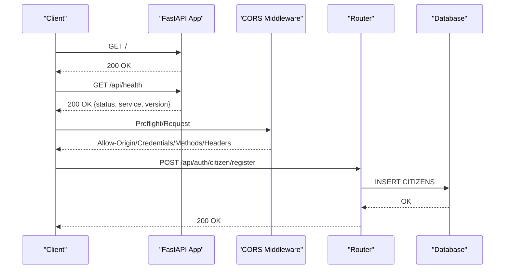

**Diagram sources**
- [main.py:50-103](file://server/main.py#L50-L103)
- [routes/auth.py:114-200](file://server/routes/auth.py#L114-L200)

**Section sources**
- [main.py:50-103](file://server/main.py#L50-L103)

### Database Connection Management
- A singleton connection pool is initialized once and reused.
- Context managers ensure proper connection release and rollback on errors.
- get_cursor(dictionary=True, buffered=True) yields both cursor and connection for dependency-style usage.

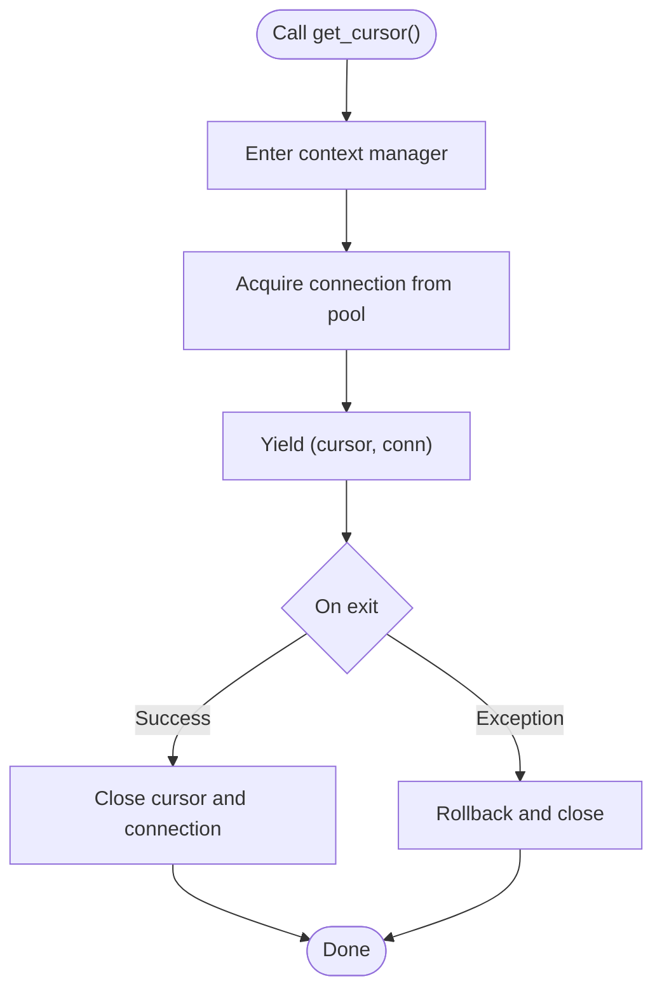

**Diagram sources**
- [database.py:68-76](file://server/database.py#L68-L76)

**Section sources**
- [database.py:14-76](file://server/database.py#L14-L76)

### Authentication Routes
- Self-contained authentication endpoints for citizens and police with password hashing and JWT issuance.
- Uses PyMySQL for database access and bcrypt for secure hashing.
- Includes profile retrieval and updates with role-specific logic.

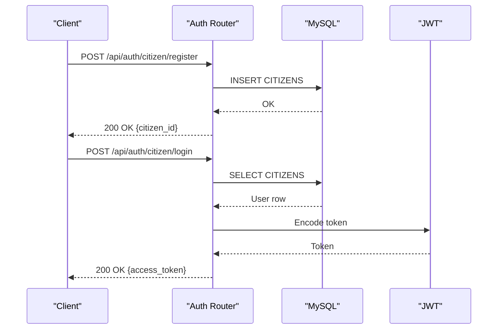

**Diagram sources**
- [routes/auth.py:114-293](file://server/routes/auth.py#L114-L293)

**Section sources**
- [routes/auth.py:1-744](file://server/routes/auth.py#L1-L744)

### Analytics Routes
- Provides dashboard summaries, leaderboards, citizen analytics, system analytics, violation-type distributions, recent activity, and status trends.
- Uses PyMySQL for direct connections and returns aggregated metrics.

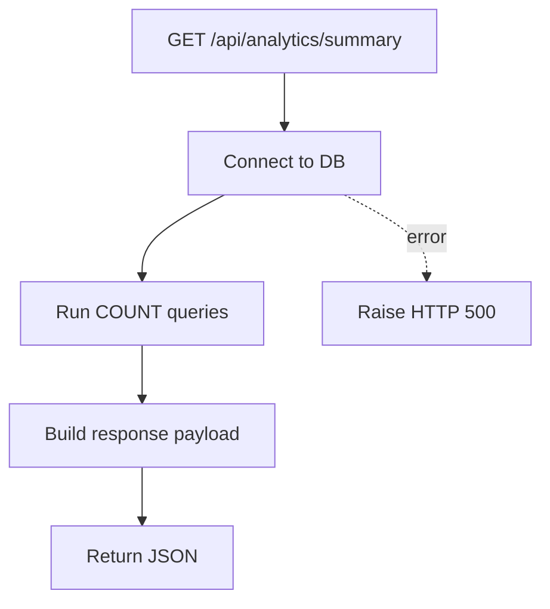

**Diagram sources**
- [routes/analytics.py:36-124](file://server/routes/analytics.py#L36-L124)

**Section sources**
- [routes/analytics.py:1-526](file://server/routes/analytics.py#L1-L526)

### Reports Routes
- Supports evidence upload, report creation, fetching citizen reports, updating/deleting reports (with status gating), and police processing.
- Uploads evidence to a local directory and stores a URL in the database.

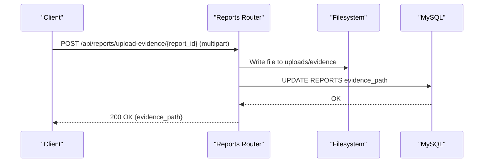

**Diagram sources**
- [routes/reports.py:50-121](file://server/routes/reports.py#L50-L121)

**Section sources**
- [routes/reports.py:1-563](file://server/routes/reports.py#L1-L563)

### Challans Routes
- Creates challans from verified reports, links to violation events, and supports citizen/my challans retrieval, report lookup, payment, deletion, and admin deletion.

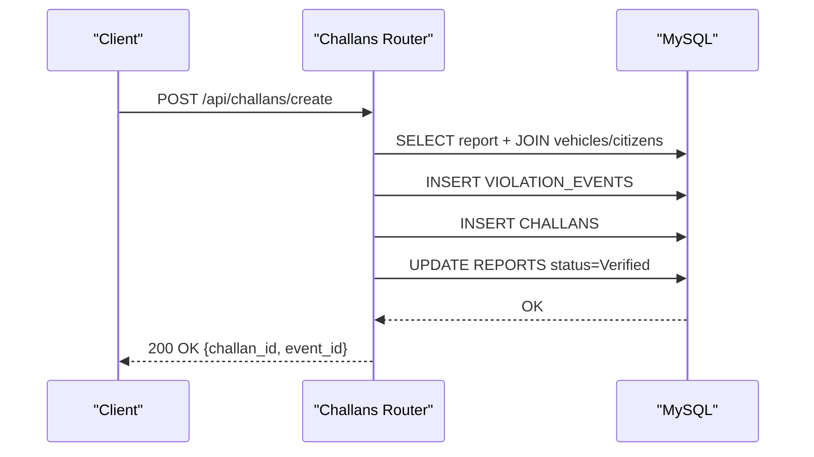

**Diagram sources**
- [routes/challans.py:47-138](file://server/routes/challans.py#L47-L138)

**Section sources**
- [routes/challans.py:1-450](file://server/routes/challans.py#L1-L450)

### Vehicles Routes
- Allows police to search vehicles by plate number and retrieve violation history with challan details.

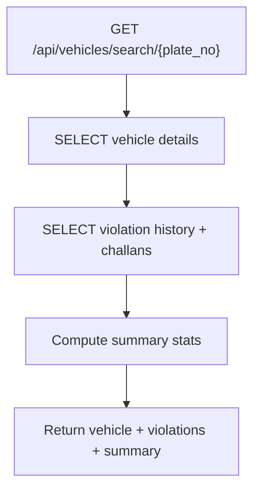

**Diagram sources**
- [routes/vehicles.py:36-131](file://server/routes/vehicles.py#L36-L131)

**Section sources**
- [routes/vehicles.py:1-145](file://server/routes/vehicles.py#L1-L145)

### Rules Routes
- Enables police to manage violation rules: list, get, update, create, and delete with validation and constraints.

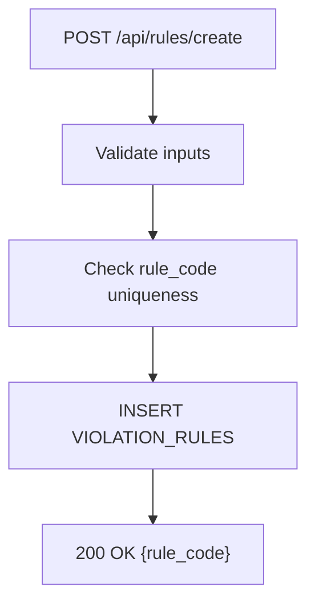

**Diagram sources**
- [routes/rules.py:252-308](file://server/routes/rules.py#L252-L308)

**Section sources**
- [routes/rules.py:1-377](file://server/routes/rules.py#L1-L377)

### Police Routes
- Requires police role via dependency; provides pending reports, verify/reject reports (via stored procedures), violation rules, and performance stats.

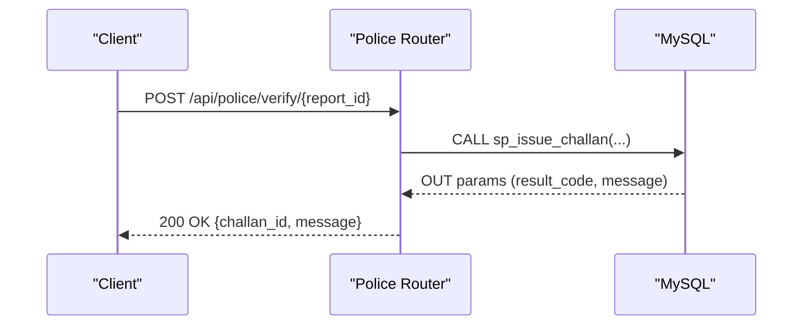

**Diagram sources**
- [routes/police.py:48-93](file://server/routes/police.py#L48-L93)

**Section sources**
- [routes/police.py:1-220](file://server/routes/police.py#L1-L220)

### Trust & History Routes
- Provides trust score history and current score for citizens; allows police to manually flag overdue challans via stored procedures.

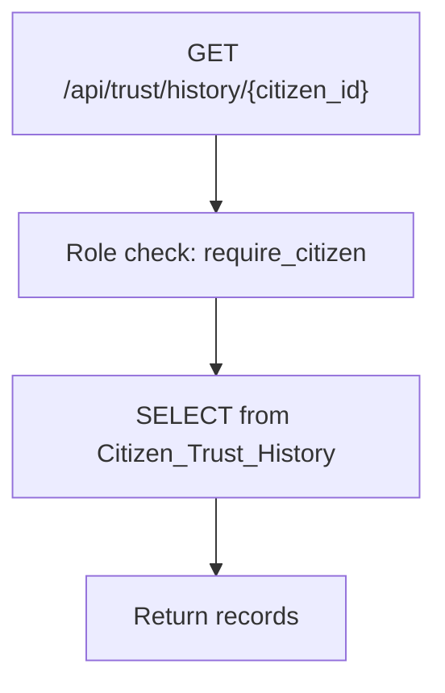

**Diagram sources**
- [routes/trust.py:15-60](file://server/routes/trust.py#L15-L60)

**Section sources**
- [routes/trust.py:1-134](file://server/routes/trust.py#L1-L134)

### Security Considerations
- CORS is configured broadly; in production, restrict allow_origins to trusted domains.
- Authentication uses JWT with HS256; keep the secret secure and rotate periodically.
- Role-based access control is enforced via dependency functions in police and trust routers.
- Input validation and parameterized queries are used across routers to mitigate SQL injection.

**Section sources**
- [main.py:60-66](file://server/main.py#L60-L66)
- [routes/auth.py:29-32](file://server/routes/auth.py#L29-L32)
- [routes/police.py:25-45](file://server/routes/police.py#L25-L45)
- [routes/trust.py:15-30](file://server/routes/trust.py#L15-L30)

## Dependency Analysis
External dependencies are declared in requirements.txt and include FastAPI, Uvicorn, MySQL Connector, PyJWT, bcrypt, and Pydantic.

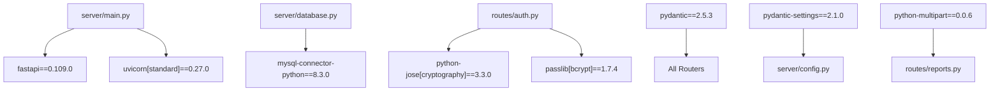

**Diagram sources**
- [requirements.txt:1-12](file://server/requirements.txt#L1-L12)
- [main.py:5-10](file://server/main.py#L5-L10)
- [database.py:4-8](file://server/database.py#L4-L8)
- [routes/auth.py:5-12](file://server/routes/auth.py#L5-L12)
- [routes/reports.py:5-12](file://server/routes/reports.py#L5-L12)

**Section sources**
- [requirements.txt:1-12](file://server/requirements.txt#L1-L12)

## Performance Considerations
- Connection pooling reduces connection overhead; ensure pool size matches workload expectations.
- Use buffered cursors for large result sets to reduce memory pressure.
- Prefer parameterized queries and avoid N+1 patterns.
- Offload CPU-intensive tasks (e.g., hashing) to thread pools where applicable.
- Compress static assets and set appropriate cache headers for /uploads in production.
- Monitor slow queries and add indexes as needed.

[No sources needed since this section provides general guidance]

## Troubleshooting Guide
- Database connectivity failures:
  - Verify pool initialization and connection timeouts.
  - Check error logs during pool creation and connection acquisition.
  - Reference: [database.py:14-43](file://server/database.py#L14-L43)
- Route errors:
  - Inspect HTTP exceptions raised in routers and ensure proper error propagation.
  - Examples: [routes/reports.py:50-121](file://server/routes/reports.py#L50-L121), [routes/challans.py:47-138](file://server/routes/challans.py#L47-L138)
- CORS issues:
  - Confirm allow_origins, methods, headers, and credentials settings.
  - Reference: [main.py:60-66](file://server/main.py#L60-L66)
- Static file serving:
  - Ensure uploads directory exists and is writable.
  - Reference: [main.py:69-72](file://server/main.py#L69-L72)
- Logging:
  - Use module-specific loggers and review INFO/ERROR messages for diagnostics.
  - References: [main.py:28-33](file://server/main.py#L28-L33), [routes/police.py](file://server/routes/police.py#L14), [routes/trust.py](file://server/routes/trust.py#L12)

**Section sources**
- [database.py:14-43](file://server/database.py#L14-L43)
- [routes/reports.py:50-121](file://server/routes/reports.py#L50-L121)
- [routes/challans.py:47-138](file://server/routes/challans.py#L47-L138)
- [main.py:60-72](file://server/main.py#L60-L72)
- [routes/police.py](file://server/routes/police.py#L14)
- [routes/trust.py](file://server/routes/trust.py#L12)

## Conclusion
The FastAPI backend provides a modular, database-backed system for managing traffic violations with clear separation of concerns. It leverages dependency injection via context-managed database cursors, robust authentication with JWT, and organized router-based APIs with prefix and tag metadata. With proper CORS hardening, secrets management, and production-grade deployment practices, the system can scale to serve both citizens and police stakeholders effectively.

[No sources needed since this section summarizes without analyzing specific files]

## Appendices

### Database Setup Script
- The initialization script creates the database and essential tables for the system.
- Use it to bootstrap the schema before running the application.

**Section sources**
- [init_db.py:18-177](file://server/init_db.py#L18-L177)

### Route Registration Patterns
- Prefix-based routing organizes endpoints by domain.
- Tag-based organization improves API documentation clarity.

**Section sources**
- [main.py:77-86](file://server/main.py#L77-L86)

### Static File Serving Configuration
- Evidence uploads served under /uploads with a dedicated directory.

**Section sources**
- [main.py:69-72](file://server/main.py#L69-L72)

### Health Check Endpoint
- Lightweight endpoint to verify service availability.

**Section sources**
- [main.py:88-95](file://server/main.py#L88-L95)

### Logging Setup
- Structured logging with module-specific loggers.

**Section sources**
- [main.py:28-33](file://server/main.py#L28-L33)