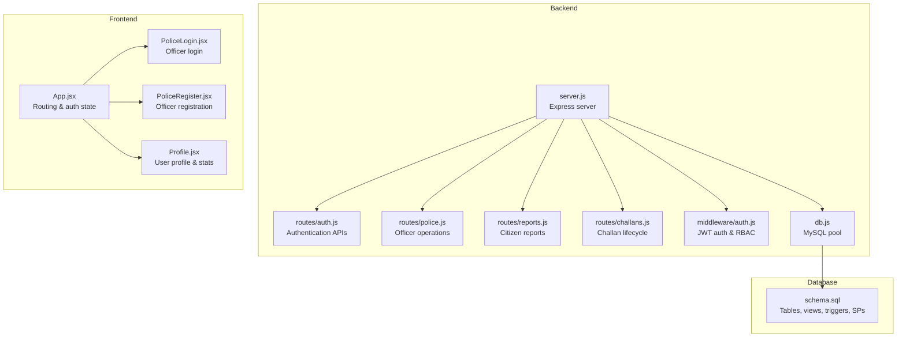
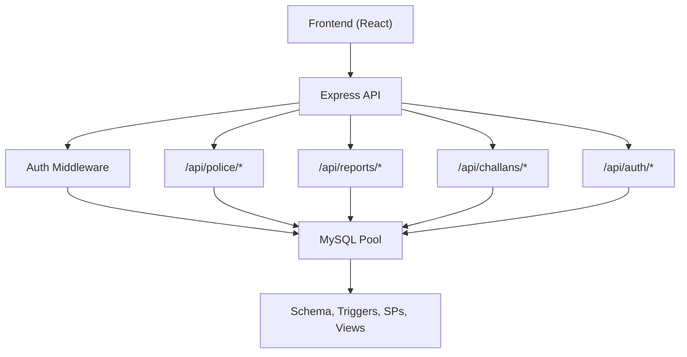
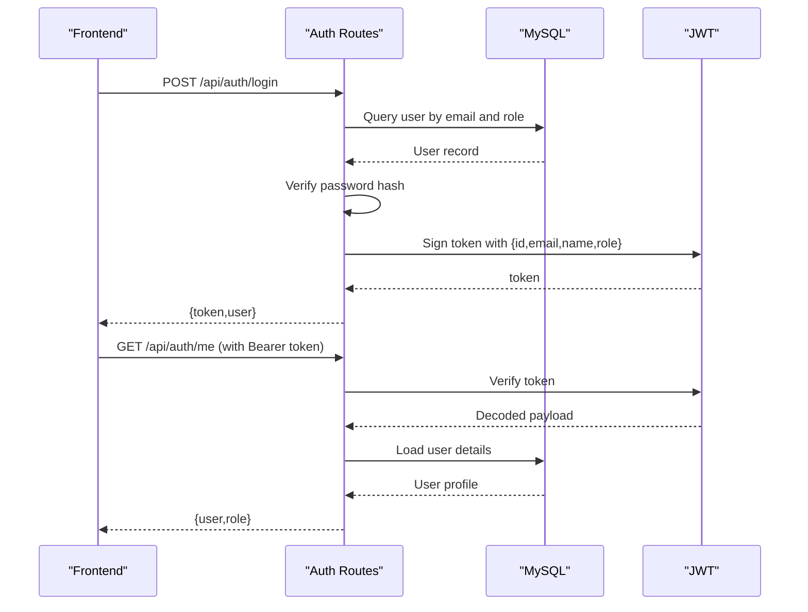
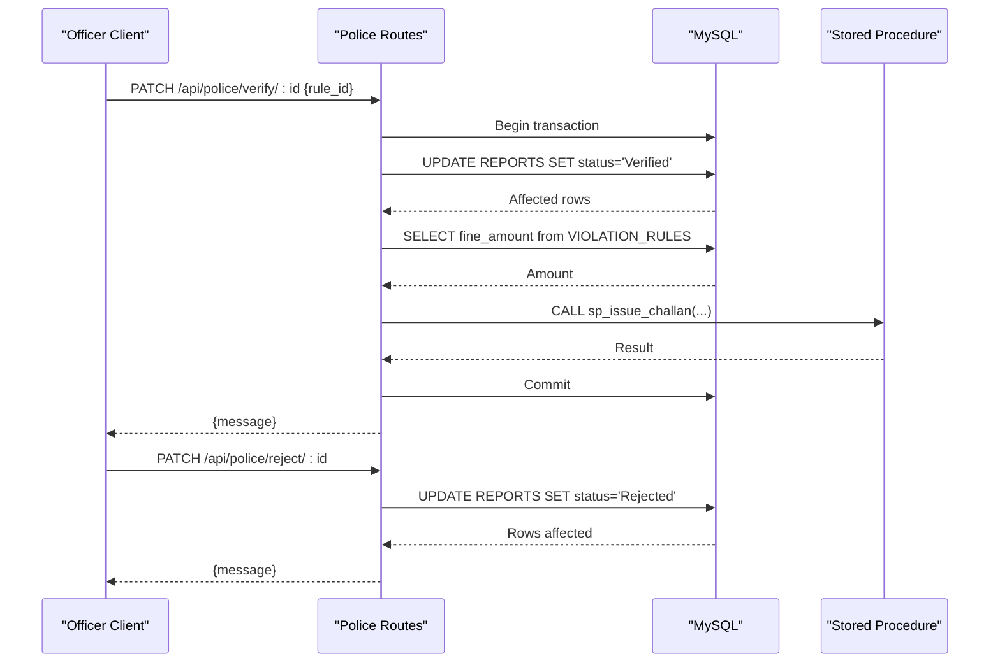
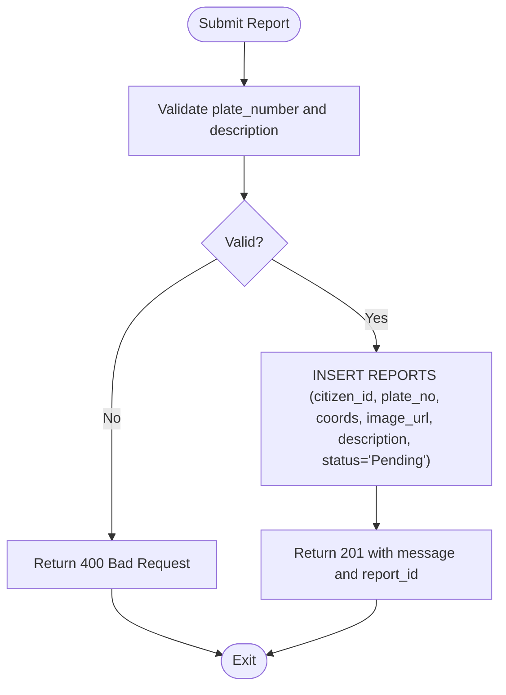
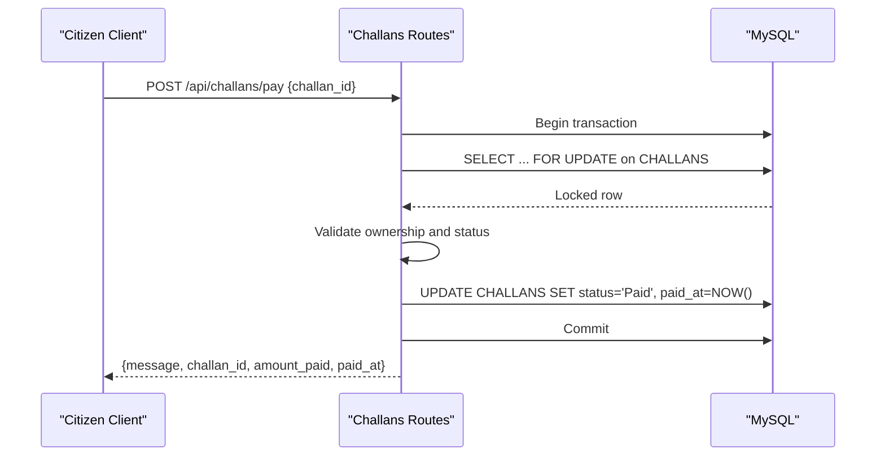
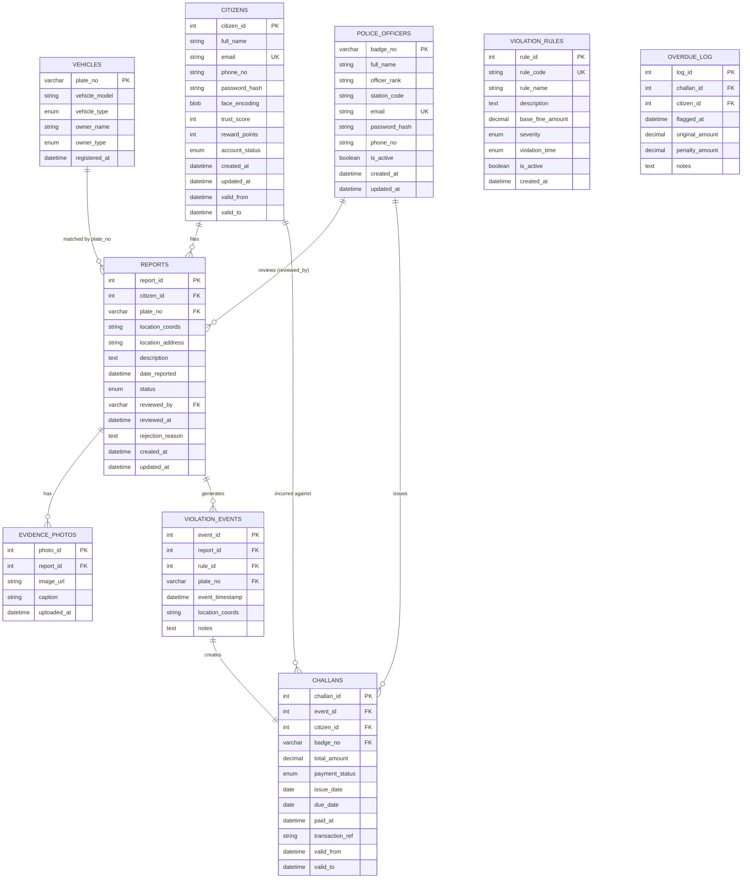
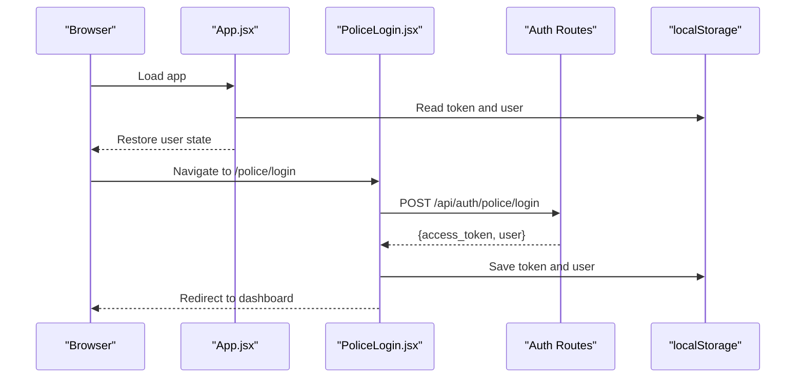
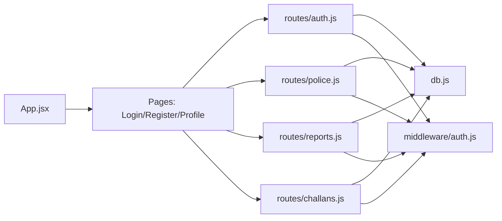

# Police Administration

<cite>
**Referenced Files in This Document**
- [server.js](file://backend/server.js)
- [auth.js](file://backend/routes/auth.js)
- [police.js](file://backend/routes/police.js)
- [reports.js](file://backend/routes/reports.js)
- [challans.js](file://backend/routes/challans.js)
- [auth.js](file://backend/middleware/auth.js)
- [db.js](file://backend/db.js)
- [schema.sql](file://db/schema.sql)
- [database_triggers.sql](file://db/database_triggers.sql)
- [stored_procedure_process_report.sql](file://db/stored_procedure_process_report.sql)
- [PoliceRegister.jsx](file://frontend/src/pages/PoliceRegister.jsx)
- [PoliceLogin.jsx](file://frontend/src/pages/PoliceLogin.jsx)
- [Profile.jsx](file://frontend/src/pages/Profile.jsx)
- [App.jsx](file://frontend/src/App.jsx)
</cite>

## Table of Contents
1. [Introduction](#introduction)
2. [Project Structure](#project-structure)
3. [Core Components](#core-components)
4. [Architecture Overview](#architecture-overview)
5. [Detailed Component Analysis](#detailed-component-analysis)
6. [Dependency Analysis](#dependency-analysis)
7. [Performance Considerations](#performance-considerations)
8. [Troubleshooting Guide](#troubleshooting-guide)
9. [Conclusion](#conclusion)
10. [Appendices](#appendices)

## Introduction
This document provides comprehensive API documentation for the police administration subsystem within the Traffic Violation Management System. It covers officer management, department operations, administrative functions, and integration points with authentication, role-based access control, and audit trails. The documentation includes endpoint definitions, request/response schemas, operational workflows, and integration patterns with the frontend and database.

## Project Structure
The backend is organized around Express.js with modular route handlers, shared middleware for authentication and authorization, and a MySQL connection pool. The database schema defines core entities and includes triggers, stored procedures, views, and transient tables supporting auditability and operational workflows.

**Diagram sources**
- [server.js:1-42](file://backend/server.js#L1-L42)
- [auth.js:1-117](file://backend/routes/auth.js#L1-L117)
- [police.js:1-109](file://backend/routes/police.js#L1-L109)
- [reports.js:1-54](file://backend/routes/reports.js#L1-L54)
- [challans.js:1-101](file://backend/routes/challans.js#L1-L101)
- [auth.js:1-37](file://backend/middleware/auth.js#L1-L37)
- [db.js:1-26](file://backend/db.js#L1-L26)
- [schema.sql:1-942](file://db/schema.sql#L1-L942)
- [App.jsx:1-274](file://frontend/src/App.jsx#L1-L274)
- [PoliceLogin.jsx:1-186](file://frontend/src/pages/PoliceLogin.jsx#L1-L186)
- [PoliceRegister.jsx:1-346](file://frontend/src/pages/PoliceRegister.jsx#L1-L346)
- [Profile.jsx:1-491](file://frontend/src/pages/Profile.jsx#L1-L491)

**Section sources**
- [server.js:1-42](file://backend/server.js#L1-L42)
- [schema.sql:1-942](file://db/schema.sql#L1-L942)

## Core Components
- Authentication and Authorization
  - JWT-based authentication with role-aware middleware enforcing access control.
  - Login endpoints for citizens and police; profile retrieval endpoint.
- Officer Operations
  - Dashboard view of pending reports.
  - Verify/reject reports with transactional integrity and audit-triggered trust adjustments.
- Citizen Reports and Challans
  - Submit reports, view own reports.
  - View and pay challans with row-level locking to prevent race conditions.
- Database Layer
  - Core entity tables, views, triggers, stored procedures, and transient tables for session and upload management.

**Section sources**
- [auth.js:1-117](file://backend/routes/auth.js#L1-L117)
- [auth.js:1-37](file://backend/middleware/auth.js#L1-L37)
- [police.js:1-109](file://backend/routes/police.js#L1-L109)
- [reports.js:1-54](file://backend/routes/reports.js#L1-L54)
- [challans.js:1-101](file://backend/routes/challans.js#L1-L101)
- [db.js:1-26](file://backend/db.js#L1-L26)
- [schema.sql:1-942](file://db/schema.sql#L1-L942)

## Architecture Overview
The system follows a layered architecture:
- Presentation: React frontend handles routing, authentication persistence, and calls backend APIs.
- Application: Express routes encapsulate business logic, enforced by middleware for authentication and role checks.
- Persistence: MySQL with normalized tables, triggers for audit and trust scoring, stored procedures for ACID transactions, and views for dashboards.

**Diagram sources**
- [server.js:1-42](file://backend/server.js#L1-L42)
- [auth.js:1-117](file://backend/routes/auth.js#L1-L117)
- [police.js:1-109](file://backend/routes/police.js#L1-L109)
- [reports.js:1-54](file://backend/routes/reports.js#L1-L54)
- [challans.js:1-101](file://backend/routes/challans.js#L1-L101)
- [auth.js:1-37](file://backend/middleware/auth.js#L1-L37)
- [db.js:1-26](file://backend/db.js#L1-L26)
- [schema.sql:1-942](file://db/schema.sql#L1-L942)

## Detailed Component Analysis

### Authentication and Authorization
- Purpose: Secure endpoints with JWT and enforce role-based access.
- Key endpoints:
  - POST /api/auth/login: Authenticate citizen or police, return token and user payload.
  - GET /api/auth/me: Retrieve current user profile based on token.
- Request/Response schemas:
  - Login request: { email, password, role }
  - Login response: { token, user: { id, name, email, role, trust_score?, badge_number?, station? } }
  - Profile response: { id, name, email, role, trust_score?, badge_number?, station? }
- Access control:
  - requireCitizen: restricts to citizen role.
  - requirePolice: restricts to police role.

**Diagram sources**
- [auth.js:1-117](file://backend/routes/auth.js#L1-L117)
- [auth.js:1-37](file://backend/middleware/auth.js#L1-L37)
- [db.js:1-26](file://backend/db.js#L1-L26)

**Section sources**
- [auth.js:1-117](file://backend/routes/auth.js#L1-L117)
- [auth.js:1-37](file://backend/middleware/auth.js#L1-L37)
- [db.js:1-26](file://backend/db.js#L1-L26)

### Officer Operations (/api/police)
- Dashboard
  - GET /api/police/pending: Returns pending reports for the command dashboard.
- Report Verification
  - PATCH /api/police/verify/:id: Verifies a report and issues a challan via stored procedure with transactional guarantees.
  - Requires rule_id in request body.
- Report Rejection
  - PATCH /api/police/reject/:id: Marks a report as rejected.

**Diagram sources**
- [police.js:1-109](file://backend/routes/police.js#L1-L109)
- [schema.sql:440-546](file://db/schema.sql#L440-L546)

**Section sources**
- [police.js:1-109](file://backend/routes/police.js#L1-L109)
- [schema.sql:440-546](file://db/schema.sql#L440-L546)

### Citizen Reports (/api/reports)
- Submit a report
  - POST /api/reports: Requires citizen role; inserts a new report with status Pending.
- Fetch own reports
  - GET /api/reports/my: Returns all reports for the logged-in citizen ordered by submission time.

**Diagram sources**
- [reports.js:1-54](file://backend/routes/reports.js#L1-L54)

**Section sources**
- [reports.js:1-54](file://backend/routes/reports.js#L1-L54)

### Challans (/api/challans)
- View own challans
  - GET /api/challans/my: Joins challans with violation rules and issuing officer info.
- Pay a challan
  - POST /api/challans/pay: Uses row-level locking to prevent double payment and updates status to Paid.

**Diagram sources**
- [challans.js:1-101](file://backend/routes/challans.js#L1-L101)

**Section sources**
- [challans.js:1-101](file://backend/routes/challans.js#L1-L101)

### Database Schema and Audit Trail
- Core Entities
  - CITIZENS, POLICE_OFFICERS, VEHICLES, VIOLATION_RULES, REPORTS, EVIDENCE_PHOTOS, VIOLATION_EVENTS, CHALLANS, OVERDUE_LOG.
- Triggers
  - Automatic trust score adjustments on report verification/rejection.
  - Temporal versioning for citizens and challans via history tables and triggers.
- Stored Procedures
  - sp_issue_challan: Full transactional flow for verification and challan creation.
  - sp_pay_challan: Payment with row-level locking and reward points addition.
  - sp_reject_report: Rejection with reason and status update.
  - sp_flag_overdue_challans: Cursor-based overdue processing with penalties.
- Views
  - Pending_Reports_Dashboard: Command center feed aggregating pending reports.

**Diagram sources**
- [schema.sql:26-235](file://db/schema.sql#L26-L235)

**Section sources**
- [schema.sql:26-235](file://db/schema.sql#L26-L235)
- [database_triggers.sql:1-48](file://db/database_triggers.sql#L1-L48)
- [stored_procedure_process_report.sql:1-115](file://db/stored_procedure_process_report.sql#L1-L115)

### Frontend Integration Patterns
- Authentication Persistence
  - Frontend stores token and user in localStorage after login and restores on app load.
- Officer Registration/Login
  - Dedicated pages call backend auth endpoints and persist tokens.
- Profile and Dashboards
  - Profile page aggregates data from auth/me, reports/my, and challans/my endpoints.

**Diagram sources**
- [App.jsx:1-274](file://frontend/src/App.jsx#L1-L274)
- [PoliceLogin.jsx:1-186](file://frontend/src/pages/PoliceLogin.jsx#L1-L186)
- [auth.js:1-117](file://backend/routes/auth.js#L1-L117)

**Section sources**
- [App.jsx:1-274](file://frontend/src/App.jsx#L1-L274)
- [PoliceLogin.jsx:1-186](file://frontend/src/pages/PoliceLogin.jsx#L1-L186)
- [PoliceRegister.jsx:1-346](file://frontend/src/pages/PoliceRegister.jsx#L1-L346)
- [Profile.jsx:1-491](file://frontend/src/pages/Profile.jsx#L1-L491)

## Dependency Analysis
- Route Dependencies
  - All routes depend on the database pool for queries and stored procedures.
  - Police routes depend on triggers and stored procedures for ACID operations.
- Middleware Dependencies
  - authenticateToken verifies JWT; requireCitizen/requirePolice enforce roles.
- Frontend Dependencies
  - Calls backend endpoints and persists tokens for subsequent requests.

**Diagram sources**
- [police.js:1-109](file://backend/routes/police.js#L1-L109)
- [reports.js:1-54](file://backend/routes/reports.js#L1-L54)
- [challans.js:1-101](file://backend/routes/challans.js#L1-L101)
- [auth.js:1-117](file://backend/routes/auth.js#L1-L117)
- [auth.js:1-37](file://backend/middleware/auth.js#L1-L37)
- [db.js:1-26](file://backend/db.js#L1-L26)
- [App.jsx:1-274](file://frontend/src/App.jsx#L1-L274)

**Section sources**
- [police.js:1-109](file://backend/routes/police.js#L1-L109)
- [reports.js:1-54](file://backend/routes/reports.js#L1-L54)
- [challans.js:1-101](file://backend/routes/challans.js#L1-L101)
- [auth.js:1-117](file://backend/routes/auth.js#L1-L117)
- [auth.js:1-37](file://backend/middleware/auth.js#L1-L37)
- [db.js:1-26](file://backend/db.js#L1-L26)
- [App.jsx:1-274](file://frontend/src/App.jsx#L1-L274)

## Performance Considerations
- Database Pooling
  - Connection limits and keep-alive configured to manage concurrent requests efficiently.
- Transactions and Locking
  - Row-level locks in challan payment and stored procedures minimize race conditions and ensure consistency.
- Indexes and Views
  - Strategic indexing on foreign keys and status/date columns improves query performance for dashboards and reporting.
- Event Scheduler
  - Automated cleanup of expired sessions and unlinked uploads reduces storage overhead.

[No sources needed since this section provides general guidance]

## Troubleshooting Guide
- Authentication Failures
  - Missing or invalid Authorization header leads to 401; expired or malformed tokens yield 403.
- Role Access Denied
  - Requests from unauthorized roles receive 403 responses.
- Report Verification Errors
  - Non-existent report or already processed status returns 404; invalid rule_id yields 400.
- Challan Payment Issues
  - Not found, unauthorized ownership, or already paid statuses return appropriate errors; FOR UPDATE prevents double payments.
- Database Connectivity
  - Connection test on startup logs success or failure; verify environment variables for DB configuration.

**Section sources**
- [auth.js:1-37](file://backend/middleware/auth.js#L1-L37)
- [police.js:1-109](file://backend/routes/police.js#L1-L109)
- [challans.js:1-101](file://backend/routes/challans.js#L1-L101)
- [db.js:1-26](file://backend/db.js#L1-L26)

## Conclusion
The police administration subsystem integrates secure authentication, role-based access control, and robust database operations to support officer workflows, citizen reporting, and challan management. Triggers and stored procedures ensure auditability and data integrity, while views and transient tables facilitate dashboards and operational hygiene. The frontend seamlessly integrates with these APIs to deliver a cohesive user experience.

[No sources needed since this section summarizes without analyzing specific files]

## Appendices

### Endpoint Reference Summary
- Authentication
  - POST /api/auth/login: { email, password, role } -> { token, user }
  - GET /api/auth/me: -> { user, role }
- Officer Operations
  - GET /api/police/pending: -> Pending reports dashboard
  - PATCH /api/police/verify/:id: { rule_id } -> { message }
  - PATCH /api/police/reject/:id: -> { message }
- Reports
  - POST /api/reports: { plate_number, latitude?, longitude?, image_url?, description } -> { message, report_id }
  - GET /api/reports/my: -> [reports]
- Challans
  - GET /api/challans/my: -> [challans]
  - POST /api/challans/pay: { challan_id } -> { message, challan_id, amount_paid, paid_at }

**Section sources**
- [auth.js:1-117](file://backend/routes/auth.js#L1-L117)
- [police.js:1-109](file://backend/routes/police.js#L1-L109)
- [reports.js:1-54](file://backend/routes/reports.js#L1-L54)
- [challans.js:1-101](file://backend/routes/challans.js#L1-L101)