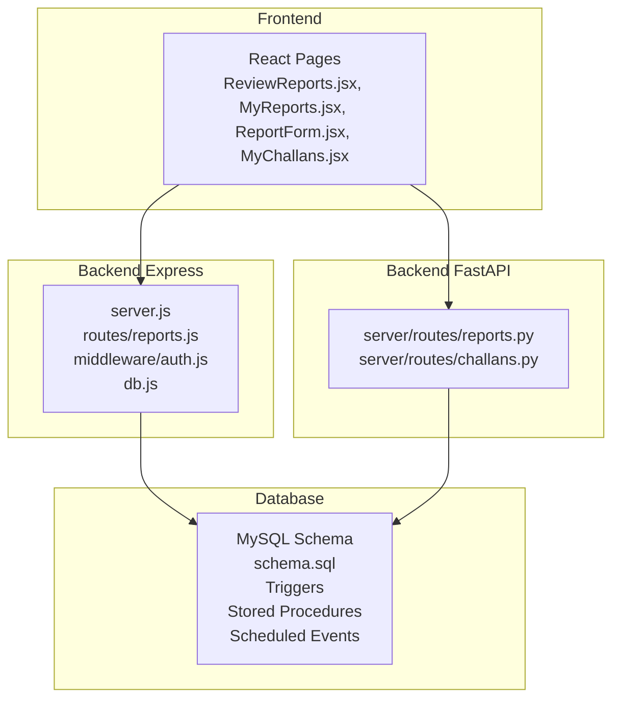
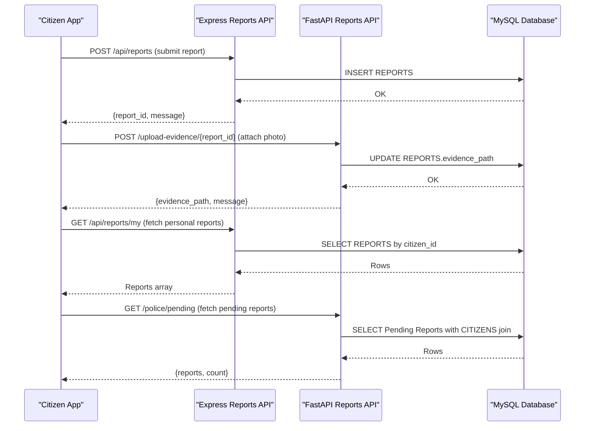
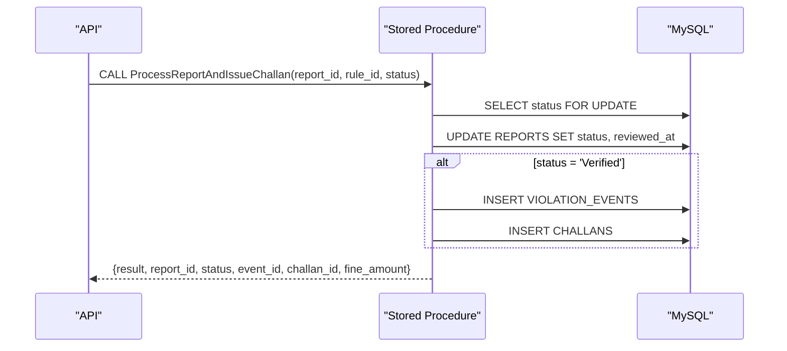
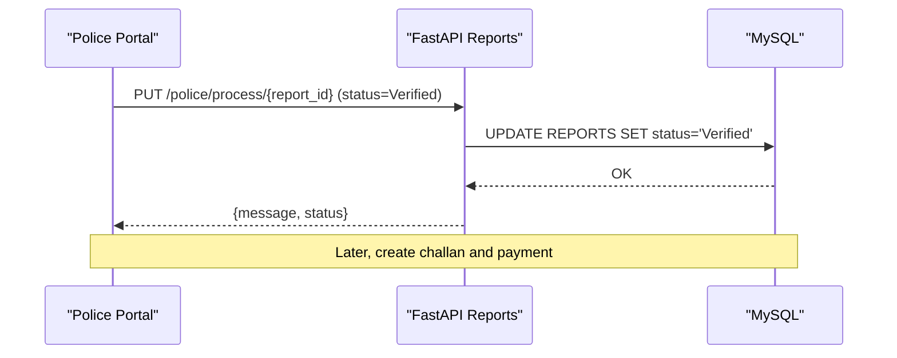
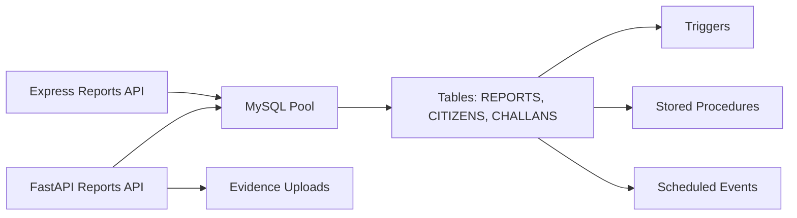

# Reports Management

<cite>
**Referenced Files in This Document**
- [reports.js](file://backend/routes/reports.js)
- [auth.js](file://backend/middleware/auth.js)
- [db.js](file://backend/db.js)
- [server.js](file://backend/server.js)
- [reports.py](file://server/routes/reports.py)
- [challans.py](file://server/routes/challans.py)
- [schema.sql](file://db/schema.sql)
- [stored_procedure_process_report.sql](file://db/stored_procedure_process_report.sql)
- [database_triggers.sql](file://db/database_triggers.sql)
- [reports_enhancement.sql](file://db/reports_enhancement.sql)
- [add_evidence_path_column.sql](file://db/add_evidence_path_column.sql)
- [ReviewReports.jsx](file://frontend/src/pages/ReviewReports.jsx)
- [MyReports.jsx](file://frontend/src/pages/MyReports.jsx)
- [ReportForm.jsx](file://frontend/src/components/ReportForm.jsx)
- [MyChallans.jsx](file://frontend/src/pages/MyChallans.jsx)
- [REPORTS_API_DOCUMENTATION.md](file://server/REPORTS_API_DOCUMENTATION.md)
- [PIPELINE_VERIFICATION.md](file://PIPELINE_VERIFICATION.md)
- [CHALLAN_SYSTEM_FIX_COMPLETE.md](file://CHALLAN_SYSTEM_FIX_COMPLETE.md)
</cite>

## Table of Contents
1. [Introduction](#introduction)
2. [Project Structure](#project-structure)
3. [Core Components](#core-components)
4. [Architecture Overview](#architecture-overview)
5. [Detailed Component Analysis](#detailed-component-analysis)
6. [Dependency Analysis](#dependency-analysis)
7. [Performance Considerations](#performance-considerations)
8. [Troubleshooting Guide](#troubleshooting-guide)
9. [Conclusion](#conclusion)
10. [Appendices](#appendices)

## Introduction
This document provides comprehensive API documentation for the traffic violation reports management system. It covers report submission, review, approval, and status tracking, including HTTP methods for fetching pending reports, reviewing violations, approving/rejecting reports, and integrating with the challan generation system. It also documents request/response schemas, evidence attachment handling, violation categorization, and the integration with stored procedures, triggers, and database transactions. Filtering, pagination, search, and real-time status updates are explained, along with practical examples of report lifecycle management.

## Project Structure
The system comprises:
- Backend Express server exposing REST APIs for reports and authentication
- Backend Python FastAPI server implementing additional report and challan endpoints
- Frontend React application for citizen and police portals
- MySQL database with normalized schema, triggers, stored procedures, and scheduled events

**Diagram sources**
- [server.js:10-26](file://backend/server.js#L10-L26)
- [reports.js:1-54](file://backend/routes/reports.js#L1-L54)
- [auth.js:1-37](file://backend/middleware/auth.js#L1-L37)
- [db.js:1-26](file://backend/db.js#L1-L26)
- [reports.py:1-14](file://server/routes/reports.py#L1-L14)
- [challans.py:181-207](file://server/routes/challans.py#L181-L207)
- [schema.sql:114-195](file://db/schema.sql#L114-L195)

**Section sources**
- [server.js:10-26](file://backend/server.js#L10-L26)
- [reports.js:1-54](file://backend/routes/reports.js#L1-L54)
- [reports.py:1-14](file://server/routes/reports.py#L1-L14)
- [schema.sql:114-195](file://db/schema.sql#L114-L195)

## Core Components
- Authentication and role-based access control (RBAC) enforced via JWT
- Report submission and lifecycle management (Pending, Verified, Rejected, Challan Issued)
- Evidence attachment handling with file validation and storage
- Violation categorization via VIOLATION_RULES and status-driven workflows
- Automated trust scoring via triggers and stored procedures
- Real-time status updates and polling-based synchronization

**Section sources**
- [auth.js:1-37](file://backend/middleware/auth.js#L1-L37)
- [reports.py:124-145](file://server/routes/reports.py#L124-L145)
- [schema.sql:100-111](file://db/schema.sql#L100-L111)

## Architecture Overview
The system integrates three layers:
- Frontend: Citizen and police dashboards with real-time refresh
- Backend: Express REST APIs and FastAPI endpoints for robust CRUD and automation
- Database: ACID-compliant transactions, triggers, stored procedures, and scheduled tasks

**Diagram sources**
- [reports.js:7-31](file://backend/routes/reports.js#L7-L31)
- [reports.py:50-121](file://server/routes/reports.py#L50-L121)
- [reports.py:225-272](file://server/routes/reports.py#L225-L272)
- [reports.py:411-460](file://server/routes/reports.py#L411-L460)

## Detailed Component Analysis

### Authentication and Authorization
- JWT-based authentication validates tokens and enforces role checks
- Middleware ensures only citizens can submit reports; only police can process reports

Key behaviors:
- authenticateToken verifies JWT
- requireCitizen restricts report submission to citizens
- requirePolice restricts report processing to police

**Section sources**
- [auth.js:5-20](file://backend/middleware/auth.js#L5-L20)
- [auth.js:22-34](file://backend/middleware/auth.js#L22-L34)

### Report Submission (Citizen)
Endpoints:
- POST /api/reports (Express) — submit a new report
- POST /upload-evidence/{report_id} (FastAPI) — attach evidence photo

Request schema (FastAPI):
- ReportCreateRequest: citizen_id, plate_no, violation_type, location_coords, location_address, description, evidence_path

Behavior:
- Validates required fields
- Inserts report with status "Pending"
- Optionally attaches evidence photo path after upload

Response:
- Success: {message, report_id, status, vehicle_created?}

Evidence upload:
- Validates MIME type and size
- Saves file to uploads/evidence
- Updates REPORTS.evidence_path

**Section sources**
- [reports.js:7-31](file://backend/routes/reports.js#L7-L31)
- [reports.py:124-145](file://server/routes/reports.py#L124-L145)
- [reports.py:50-121](file://server/routes/reports.py#L50-L121)

### Report Retrieval and Filtering
Endpoints:
- GET /api/reports/my (Express) — fetch citizen’s reports ordered by date
- GET /police/pending (FastAPI) — fetch pending reports with reporter details

Filtering and sorting:
- By citizen_id for personal reports
- By status = 'Pending' for police dashboard
- Ordered by date_reported desc

Response schema (FastAPI pending):
- {message, count, reports: [report objects]}
- Report fields include: report_id, plate_no, violation_type, location_coords/address, description, status, reported_at, reporter_name/email/trust_score, evidence_path

**Section sources**
- [reports.js:33-51](file://backend/routes/reports.js#L33-L51)
- [reports.py:225-272](file://server/routes/reports.py#L225-L272)
- [reports.py:411-460](file://server/routes/reports.py#L411-L460)
- [PIPELINE_VERIFICATION.md:129-151](file://PIPELINE_VERIFICATION.md#L129-L151)

### Report Review and Status Update (Police)
Endpoints:
- PUT /police/process/{report_id} (FastAPI) — update status to Verified or Rejected

Request schema:
- PoliceStatusUpdateRequest: status ('Verified' or 'Rejected'), rule_id (optional for Verified), badge_no (officer)

Behavior:
- Validates status
- Updates REPORTS.status and reviewed_at
- Triggers automatically adjust trust scores

Response:
- Success: {message, report_id, status}

Note: The FastAPI implementation avoids stored procedures to prevent schema corruption and relies on triggers for trust scoring.

**Section sources**
- [reports.py:462-511](file://server/routes/reports.py#L462-L511)
- [database_triggers.sql:8-35](file://db/database_triggers.sql#L8-L35)

### Stored Procedure Workflow (Alternative Path)
For systems preferring stored procedures:
- ProcessReportAndIssueChallan: ACID transaction to verify/reject/issue challan
- Uses row-level locks, validation, and triggers for trust scoring
- On Verified: creates VIOLATION_EVENTS and CHALLANS

**Diagram sources**
- [stored_procedure_process_report.sql:8-98](file://db/stored_procedure_process_report.sql#L8-L98)

**Section sources**
- [stored_procedure_process_report.sql:8-98](file://db/stored_procedure_process_report.sql#L8-L98)

### Evidence Attachment Handling
- Column: evidence_path added to REPORTS for direct linking
- Upload endpoint validates file type and size, stores file, and updates evidence_path
- Frontend supports drag-and-drop and preview

**Section sources**
- [add_evidence_path_column.sql:8-14](file://db/add_evidence_path_column.sql#L8-L14)
- [reports.py:50-121](file://server/routes/reports.py#L50-L121)
- [ReviewReports.jsx:188-210](file://frontend/src/pages/ReviewReports.jsx#L188-L210)

### Violation Categorization and Fine Amount
- VIOLATION_RULES defines rule_id, rule_code, rule_name, base_fine_amount, severity, violation_time
- Reports enhanced with violation_type and fine_amount
- Trust scoring and rewards/penalties applied via triggers

**Section sources**
- [schema.sql:100-111](file://db/schema.sql#L100-L111)
- [reports_enhancement.sql:17-47](file://db/reports_enhancement.sql#L17-L47)
- [database_triggers.sql:8-35](file://db/database_triggers.sql#L8-L35)

### Challan Generation and Payment Integration
- After Verified status, system can generate VIOLATION_EVENTS and CHALLANS
- Challan endpoints support retrieval and payment processing
- Payment updates CHALLANS with payment_status and transaction_ref

**Diagram sources**
- [reports.py:462-511](file://server/routes/reports.py#L462-L511)
- [challans.py:210-223](file://server/routes/challans.py#L210-L223)

**Section sources**
- [challans.py:210-223](file://server/routes/challans.py#L210-L223)
- [CHALLAN_SYSTEM_FIX_COMPLETE.md:289-330](file://CHALLAN_SYSTEM_FIX_COMPLETE.md#L289-L330)

### Real-Time Status Tracking and Frontend Integration
- Frontend polls endpoints every 3 seconds for near real-time updates
- ReviewReports displays pending reports with actions (Verify, Reject, Delete)
- MyReports shows personal report statuses and allows edits/deletes when Pending

**Section sources**
- [ReviewReports.jsx:18-23](file://frontend/src/pages/ReviewReports.jsx#L18-L23)
- [MyReports.jsx:16-21](file://frontend/src/pages/MyReports.jsx#L16-L21)
- [ReportForm.jsx:1-270](file://frontend/src/components/ReportForm.jsx#L1-L270)

## Dependency Analysis
- Express routes depend on shared database pool and JWT middleware
- FastAPI routes encapsulate database connectivity and file handling
- Database schema enforces referential integrity and normalization
- Triggers and stored procedures enforce business rules and audit trails
- Scheduled events automate overdue processing

**Diagram sources**
- [db.js:1-26](file://backend/db.js#L1-L26)
- [reports.py:38-48](file://server/routes/reports.py#L38-L48)
- [schema.sql:114-195](file://db/schema.sql#L114-L195)
- [database_triggers.sql:8-35](file://db/database_triggers.sql#L8-L35)
- [stored_procedure_process_report.sql:8-98](file://db/stored_procedure_process_report.sql#L8-L98)

**Section sources**
- [db.js:1-26](file://backend/db.js#L1-L26)
- [schema.sql:114-195](file://db/schema.sql#L114-L195)

## Performance Considerations
- Use indexes on frequently queried columns (status, citizen_id, date_reported, evidence_path)
- Apply row-level locks in stored procedures to prevent race conditions
- Limit concurrent uploads and enforce file size limits
- Batch overdue processing via scheduled events to avoid runtime overhead
- Cache frequently accessed violation rules and citizen details where appropriate

[No sources needed since this section provides general guidance]

## Troubleshooting Guide
Common issues and resolutions:
- Authentication failures: Ensure valid JWT token with correct role
- Report not found: Verify report_id and ownership/status constraints
- File upload errors: Confirm allowed MIME type and size limits
- Status update conflicts: Only Pending reports can be modified; Verified/Rejected require special handling
- Trust score anomalies: Check triggers firing on status changes

**Section sources**
- [auth.js:5-20](file://backend/middleware/auth.js#L5-L20)
- [reports.py:274-355](file://server/routes/reports.py#L274-L355)
- [reports.py:50-121](file://server/routes/reports.py#L50-L121)
- [database_triggers.sql:8-35](file://db/database_triggers.sql#L8-L35)

## Conclusion
The reports management system provides a robust, secure, and scalable solution for traffic violation reporting. It leverages RBAC, ACID transactions, triggers, and stored procedures to maintain data integrity and automate workflows. The dual-backend architecture (Express and FastAPI) offers flexibility and reliability, while the frontend enables real-time monitoring and efficient police review. Integration with the challan system completes the lifecycle from report to payment.

[No sources needed since this section summarizes without analyzing specific files]

## Appendices

### API Reference Summary
- Citizen
  - POST /api/reports — Submit report
  - GET /api/reports/my — Fetch personal reports
  - PUT /update/{report_id} — Update Pending report
  - DELETE /delete/{report_id} — Delete Pending report
  - POST /upload-evidence/{report_id} — Attach evidence photo
- Police
  - GET /police/pending — Fetch pending reports
  - PUT /police/process/{report_id} — Approve/Reject report
  - DELETE /{report_id} — Delete report (police)
- Challan
  - GET /my — Fetch citizen’s challans
  - GET /report/{report_id} — Fetch report with violator details

**Section sources**
- [REPORTS_API_DOCUMENTATION.md:125-411](file://server/REPORTS_API_DOCUMENTATION.md#L125-L411)
- [PIPELINE_VERIFICATION.md:129-151](file://PIPELINE_VERIFICATION.md#L129-L151)
- [CHALLAN_SYSTEM_FIX_COMPLETE.md:289-330](file://CHALLAN_SYSTEM_FIX_COMPLETE.md#L289-L330)