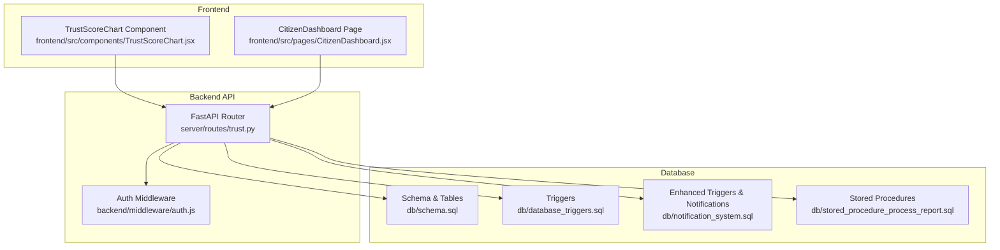
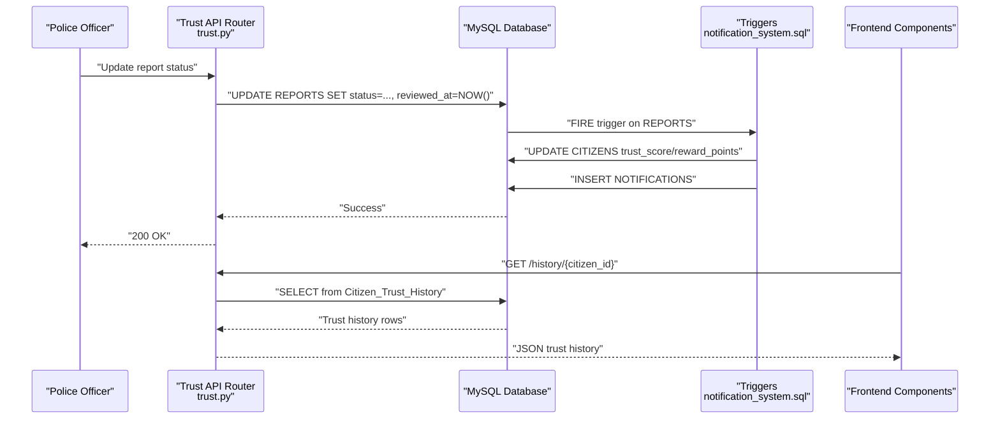
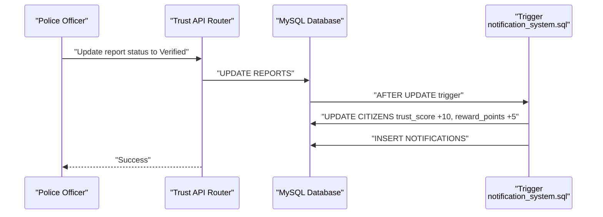
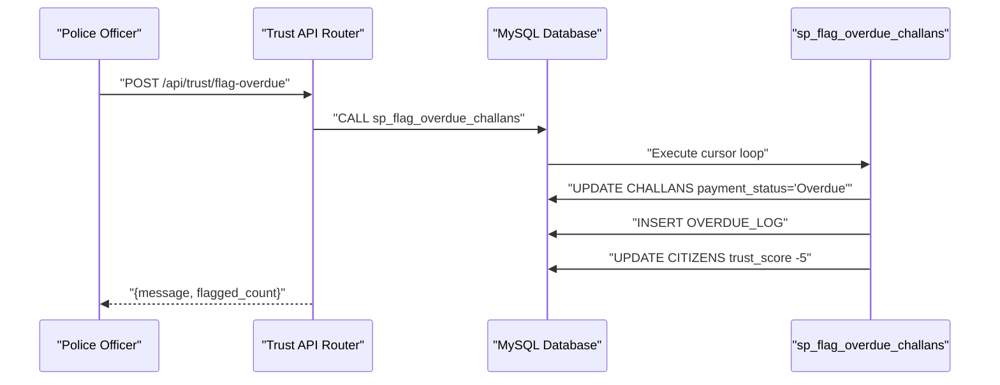
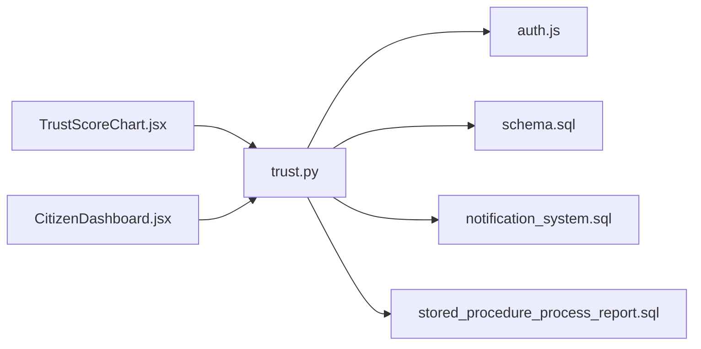

# Trust Score System

<cite>
**Referenced Files in This Document**
- [trust.py](file://server/routes/trust.py)
- [auth.js](file://backend/middleware/auth.js)
- [schema.sql](file://db/schema.sql)
- [database_triggers.sql](file://db/database_triggers.sql)
- [stored_procedure_process_report.sql](file://db/stored_procedure_process_report.sql)
- [notification_system.sql](file://db/notification_system.sql)
- [TrustScoreChart.jsx](file://frontend/src/components/TrustScoreChart.jsx)
- [CitizenDashboard.jsx](file://frontend/src/pages/CitizenDashboard.jsx)
- [test_trust_score_triggers.py](file://scripts/test_trust_score_triggers.py)
- [TRUST_SCORE_SETUP_GUIDE.md](file://TRUST_SCORE_SETUP_GUIDE.md)
</cite>

## Table of Contents
1. [Introduction](#introduction)
2. [Project Structure](#project-structure)
3. [Core Components](#core-components)
4. [Architecture Overview](#architecture-overview)
5. [Detailed Component Analysis](#detailed-component-analysis)
6. [Dependency Analysis](#dependency-analysis)
7. [Performance Considerations](#performance-considerations)
8. [Troubleshooting Guide](#troubleshooting-guide)
9. [Conclusion](#conclusion)

## Introduction
This document describes the trust score system that governs citizen reputation management, automated scoring algorithms, and trust history tracking. It covers:
- API endpoints for fetching trust scores, calculating reputation changes, viewing trust history, and managing trust-related permissions
- Request/response schemas for trust score data structures, scoring criteria, and historical records
- Integration with database triggers for automatic trust score updates, violation impact calculations, and reward/penalty mechanisms
- Trust score thresholds, appeal processes, and administrative override capabilities
- Examples of trust scoring algorithms and integration with citizen portal features

## Project Structure
The trust score system spans backend API routes, database schema and triggers, stored procedures, and frontend components that visualize trust history and integrate with the citizen portal.

**Diagram sources**
- [trust.py:1-134](file://server/routes/trust.py#L1-L134)
- [auth.js:1-37](file://backend/middleware/auth.js#L1-L37)
- [schema.sql:1-942](file://db/schema.sql#L1-L942)
- [database_triggers.sql:1-48](file://db/database_triggers.sql#L1-L48)
- [notification_system.sql:1-217](file://db/notification_system.sql#L1-L217)
- [stored_procedure_process_report.sql:1-115](file://db/stored_procedure_process_report.sql#L1-L115)
- [TrustScoreChart.jsx:1-126](file://frontend/src/components/TrustScoreChart.jsx#L1-L126)
- [CitizenDashboard.jsx:1-454](file://frontend/src/pages/CitizenDashboard.jsx#L1-L454)

**Section sources**
- [trust.py:1-134](file://server/routes/trust.py#L1-L134)
- [auth.js:1-37](file://backend/middleware/auth.js#L1-L37)
- [schema.sql:1-942](file://db/schema.sql#L1-L942)
- [database_triggers.sql:1-48](file://db/database_triggers.sql#L1-L48)
- [notification_system.sql:1-217](file://db/notification_system.sql#L1-L217)
- [stored_procedure_process_report.sql:1-115](file://db/stored_procedure_process_report.sql#L1-L115)
- [TrustScoreChart.jsx:1-126](file://frontend/src/components/TrustScoreChart.jsx#L1-L126)
- [CitizenDashboard.jsx:1-454](file://frontend/src/pages/CitizenDashboard.jsx#L1-L454)

## Core Components
- Trust API Router: Provides endpoints to fetch current trust score and trust history, and to manually flag overdue challans.
- Authentication Middleware: Enforces role-based access for citizens and police officers.
- Database Schema: Defines CITIZENS, REPORTS, CHALLANS, and supporting tables/views/triggers.
- Triggers: Automatically update trust scores and related metrics upon report status changes and challan updates.
- Stored Procedures: Encapsulate ACID-compliant workflows for report processing and challan issuance.
- Frontend Components: Visualize trust history and integrate trust score into the citizen dashboard.

**Section sources**
- [trust.py:15-134](file://server/routes/trust.py#L15-L134)
- [auth.js:22-34](file://backend/middleware/auth.js#L22-L34)
- [schema.sql:26-43](file://db/schema.sql#L26-L43)
- [schema.sql:307-429](file://db/schema.sql#L307-L429)
- [stored_procedure_process_report.sql:8-99](file://db/stored_procedure_process_report.sql#L8-L99)
- [TrustScoreChart.jsx:1-126](file://frontend/src/components/TrustScoreChart.jsx#L1-L126)
- [CitizenDashboard.jsx:65-86](file://frontend/src/pages/CitizenDashboard.jsx#L65-L86)

## Architecture Overview
The trust score system operates on an event-driven model:
- Police actions (verify/reject reports) trigger database-level updates via triggers.
- CITIZENS records are updated automatically, with temporal versioning captured in CITIZENS_HISTORY.
- Frontend components fetch current trust score and trust history to render dynamic dashboards.

**Diagram sources**
- [trust.py:15-134](file://server/routes/trust.py#L15-L134)
- [notification_system.sql:37-154](file://db/notification_system.sql#L37-L154)
- [schema.sql:307-429](file://db/schema.sql#L307-L429)

## Detailed Component Analysis

### Trust API Endpoints
Endpoints exposed by the trust router:
- GET /api/trust/current/{citizen_id}: Returns current trust score and related attributes for a citizen.
- GET /api/trust/history/{citizen_id}: Returns trust score history with temporal validity and change metadata.
- POST /api/trust/flag-overdue: Allows police to manually trigger overdue challan flagging.

Security and permissions:
- require_citizen decorator ensures only the owning citizen can access their own current score and history.
- require_police decorator restricts manual overdue flagging to authorized officers.

Response schemas:
- Current trust score: includes citizen_id, full_name, trust_score, reward_points, account_status.
- Trust history: includes history_id, citizen_id, full_name, trust_score, reward_points, account_status, valid_from, valid_to, operation_type, changed_at, changed_by.

Error handling:
- HTTP 403 for unauthorized access attempts.
- HTTP 404 for missing citizens.
- HTTP 500 for internal errors during fetch.

**Section sources**
- [trust.py:15-134](file://server/routes/trust.py#L15-L134)
- [auth.js:22-34](file://backend/middleware/auth.js#L22-L34)

### Trust Scoring Algorithms and Criteria
Automated scoring via triggers:
- Verified report: increases trust_score by 10 and reward_points by 5; resets consecutive_rejections.
- Rejected report: decreases trust_score by 10 (minimum 0), increments consecutive_rejections and total_rejections, and emits notifications.

Additional penalty mechanism:
- Overdue challans: stored procedure iterates unpaid challans past due date, applies 15% late penalty, logs in OVERDUE_LOG, and reduces trust_score by 5 per flagged challan.

Temporal versioning:
- CITIZENS_HISTORY captures historical snapshots with valid_from/valid_to timestamps and operation_type (INSERT/UPDATE/DELETE).

**Section sources**
- [notification_system.sql:37-154](file://db/notification_system.sql#L37-L154)
- [schema.sql:307-429](file://db/schema.sql#L307-L429)
- [schema.sql:688-754](file://db/schema.sql#L688-L754)

### Database Integration and Stored Procedures
- sp_issue_challan: Validates report and rule, creates violation event and challan, and ensures atomicity with exception handling.
- sp_pay_challan: Processes payment with row-level locks, awards reward_points, and updates payment status.
- sp_reject_report: Updates report status to Rejected with reason and maintains transactional integrity.
- sp_flag_overdue_challans: Cursor-based procedure to flag overdue challans, apply penalties, and penalize trust scores.

**Section sources**
- [schema.sql:440-546](file://db/schema.sql#L440-L546)
- [schema.sql:552-628](file://db/schema.sql#L552-L628)
- [schema.sql:634-686](file://db/schema.sql#L634-L686)
- [schema.sql:693-754](file://db/schema.sql#L693-L754)

### Frontend Integration and Visualization
- TrustScoreChart: Renders trust score history with bars and a tabular summary, color-coded by score thresholds.
- CitizenDashboard: Fetches trust score and reward points from backend and updates local storage to reflect real-time changes.

**Section sources**
- [TrustScoreChart.jsx:1-126](file://frontend/src/components/TrustScoreChart.jsx#L1-L126)
- [CitizenDashboard.jsx:65-86](file://frontend/src/pages/CitizenDashboard.jsx#L65-L86)

### Example Workflows

#### Workflow: Verified Report Increases Trust Score

**Diagram sources**
- [notification_system.sql:37-154](file://db/notification_system.sql#L37-L154)
- [trust.py:15-134](file://server/routes/trust.py#L15-L134)

#### Workflow: Overdue Challan Flagging and Penalty

**Diagram sources**
- [trust.py:104-134](file://server/routes/trust.py#L104-L134)
- [schema.sql:693-754](file://db/schema.sql#L693-L754)

## Dependency Analysis
- API depends on authentication middleware and database connectivity.
- Triggers depend on REPORTS and CITIZENS tables and optionally NOTIFICATIONS.
- Stored procedures encapsulate complex workflows and depend on referential integrity.
- Frontend components depend on API endpoints and local storage for user context.

**Diagram sources**
- [trust.py:1-134](file://server/routes/trust.py#L1-L134)
- [auth.js:1-37](file://backend/middleware/auth.js#L1-L37)
- [schema.sql:1-942](file://db/schema.sql#L1-L942)
- [notification_system.sql:1-217](file://db/notification_system.sql#L1-L217)
- [stored_procedure_process_report.sql:1-115](file://db/stored_procedure_process_report.sql#L1-L115)
- [TrustScoreChart.jsx:1-126](file://frontend/src/components/TrustScoreChart.jsx#L1-L126)
- [CitizenDashboard.jsx:1-454](file://frontend/src/pages/CitizenDashboard.jsx#L1-L454)

**Section sources**
- [trust.py:1-134](file://server/routes/trust.py#L1-L134)
- [auth.js:1-37](file://backend/middleware/auth.js#L1-L37)
- [schema.sql:1-942](file://db/schema.sql#L1-L942)
- [notification_system.sql:1-217](file://db/notification_system.sql#L1-L217)
- [stored_procedure_process_report.sql:1-115](file://db/stored_procedure_process_report.sql#L1-L115)
- [TrustScoreChart.jsx:1-126](file://frontend/src/components/TrustScoreChart.jsx#L1-L126)
- [CitizenDashboard.jsx:1-454](file://frontend/src/pages/CitizenDashboard.jsx#L1-L454)

## Performance Considerations
- Triggers operate at the database level and are efficient for event-driven updates.
- Stored procedures use row-level locks and transactions to avoid race conditions.
- Views and indexes (e.g., CITIZENS(idx_citizen_trust), CITIZENS_HISTORY(idx_ch_citizen)) support fast queries for trust history and filtering.
- Frontend components should avoid redundant fetches by leveraging cached user data and periodic refresh.

## Troubleshooting Guide
Common issues and resolutions:
- Triggers not firing:
  - Verify installation via script and check trigger existence in INFORMATION_SCHEMA.
  - Confirm report status transitions from Pending to Verified/Rejected.
- Stale trust score in frontend:
  - Ensure profile endpoint fetches fresh data and updates local storage.
- Overdue challan flagging not applying:
  - Confirm stored procedure execution and that challans are unpaid and past due date.
- Notification delivery:
  - Check NOTIFICATIONS table creation and trigger logic for ban/rejection scenarios.

Verification resources:
- Test script validates trigger behavior end-to-end.
- Setup guide outlines step-by-step installation and verification steps.

**Section sources**
- [test_trust_score_triggers.py:17-198](file://scripts/test_trust_score_triggers.py#L17-L198)
- [TRUST_SCORE_SETUP_GUIDE.md:68-121](file://TRUST_SCORE_SETUP_GUIDE.md#L68-L121)
- [TRUST_SCORE_SETUP_GUIDE.md:313-353](file://TRUST_SCORE_SETUP_GUIDE.md#L313-L353)

## Conclusion
The trust score system integrates secure API endpoints, robust database triggers, and comprehensive stored procedures to automate reputation management. Citizens benefit from immediate score updates reflected across dashboards and leaderboards, while law enforcement retains administrative controls for manual interventions such as overdue challan flagging. The system’s design emphasizes automation, consistency, and transparency through temporal versioning and notifications.